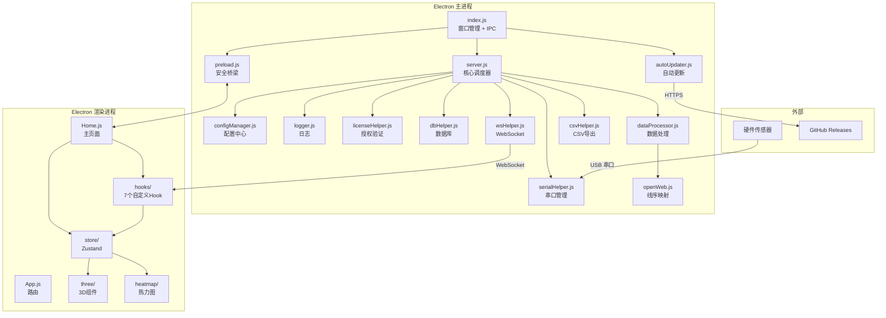

# 架构文档

> 本文档由 Manus 自动生成和维护。最后更新于：2026-03-16 16:36

## 1. 项目概述

Shroom1.0 是一个基于 **Electron** 的跨平台桌面应用程序，专用于**压力传感矩阵**的数据采集、实时可视化、存储与回放分析。系统通过串口（USB）与硬件传感器阵列连接，接收原始压力数据帧，经过线序映射、归零校准、高斯平滑等处理后，通过 WebSocket 推送至前端渲染进程，以 2D 热力图和 3D 模型的方式进行实时可视化呈现。

该系统支持多种传感器类型（汽车坐垫/靠背/头枕、床垫、手部、足底等），适用于人体工学研究、汽车座椅舒适性测试、医疗康复监测等场景。Max 分支在 main 分支基础上进行了全面的技术栈升级和架构重构，包括 Vite 构建工具迁移、React 19 升级、better-sqlite3 数据库替换、Electron 安全强化、InstancedMesh 3D 渲染优化、Zustand 状态管理引入以及自动更新集成。

## 2. 技术栈

| 分类 | 技术 | 版本/说明 |
| :--- | :--- | :--- |
| **应用框架** | Electron | ^31.3.0，跨平台桌面应用容器 |
| **前端框架** | React | ^19.0.0（从 17 升级），支持并发特性 |
| **前端构建** | Vite | ^6.0.0（从 Webpack 4 迁移），极速 HMR |
| **后端运行时** | Node.js | Electron 内置，主进程运行环境 |
| **数据库** | better-sqlite3 | ^11.0.0（从 sqlite3 迁移），同步 API + WAL 模式 |
| **编程语言** | JavaScript / TypeScript | 渐进式 TypeScript 引入（TS ^5.6.0） |
| **包管理器** | npm / yarn | 前后端分别管理依赖 |
| **状态管理** | Zustand | ^5.0.0，轻量级全局状态管理 |
| **实时通信** | WebSocket (`ws`) | ^8.14.2，前后端双向数据通信 |
| **硬件通信** | serialport | ^12.0.0，USB 串口数据读写 |
| **3D 渲染** | Three.js | ^0.170.0，压力分布 3D 可视化 |
| **UI 组件库** | Ant Design (antd) | ^5.22.0，控制面板 UI |
| **图表库** | ECharts | ^5.5.0，数据图表可视化 |
| **国际化** | i18next + react-i18next | 多语言支持 |
| **打包工具** | Electron Forge + electron-builder | 应用打包与分发 |
| **自动更新** | electron-updater | ^6.3.0，无缝后台更新 |
| **授权加密** | crypto-js (AES-ECB) | ^4.2.0，授权文件加密与验证 |
| **数据导出** | csv-writer | ^1.6.0，CSV 格式数据导出 |
| **测试框架** | Vitest | ^2.1.0，前端单元测试 |
| **代码规范** | ESLint | ^9.0.0，代码质量检查 |

## 3. 目录结构

```
shroom1.0/
├── index.js                 # Electron 主进程入口（窗口管理 + IPC 桥梁）
├── preload.js               # Electron 预加载脚本（安全 IPC 通道）
├── server.js                # 后端核心（串口数据处理 + WebSocket 分发，4308 行）
├── package.json             # 后端依赖与构建配置
│
├── # ── 后端拆分模块 ──
├── wsHelper.js              # WebSocket 广播与消息路由工具
├── dbHelper.js              # better-sqlite3 数据库操作封装
├── logger.js                # 结构化日志模块（带文件输出和性能计时）
├── serialHelper.js          # 串口生命周期管理
├── licenseHelper.js         # 授权验证（AES 解密 + 在线时间校验）
├── configManager.js         # 统一配置中心
├── dataProcessor.js         # 传感器数据处理管线
├── csvHelper.js             # CSV 导出工具
├── autoUpdater.js           # 自动更新模块
│
├── # ── 后端业务模块 ──
├── openWeb.js               # 数据转换函数库（线序映射、矩阵变换）
├── aes_ecb.js               # AES-ECB 加解密
├── gen.js / genType.js      # 传感器类型生成与配置
├── parse.js                 # 串口数据帧解析
├── press.js                 # 压力计算与校准
├── util.js / utilMatrix.js  # 通用工具函数
├── localWs.js               # 本地 WebSocket 客户端
├── serialport.js            # 串口端口扫描
│
├── # ── 模块化拆分 ──
├── server/                  # 从 server.js 提取的独立模块
│   ├── index.js             # 模块入口，统一导出
│   ├── mathUtils.js         # 数学/数据处理纯函数（高斯模糊、插值、分压等）
│   └── dbManager.js         # 数据库初始化和管理
│
├── # ── 配置文件 ──
├── forge.config.js          # Electron Forge 打包配置
├── jsconfig.json            # 后端 JSDoc 类型检查配置
├── types.d.ts               # 后端 TypeScript 类型定义
├── .gitignore               # Git 忽略规则
│
├── client/                  # 前端 React 应用
│   ├── package.json         # 前端依赖（React 19 + Vite + Zustand）
│   ├── vite.config.js       # Vite 构建配置
│   ├── index.html           # Vite 入口 HTML
│   ├── tsconfig.json        # 前端 TypeScript 配置
│   └── src/
│       ├── main.jsx         # Vite 入口（React 19 createRoot）
│       ├── App.js           # 路由配置（25+ 路由）
│       ├── constants.js     # 前端统一常量
│       ├── hooks/           # 自定义 Hook
│       │   ├── useWebSocket.js        # WebSocket 连接管理（自动重连 + 心跳）
│       │   ├── usePressureData.js     # 压力数据状态管理
│       │   ├── useSerialControl.js    # 串口控制指令封装
│       │   ├── useThreeScene.js       # Three.js 场景初始化
│       │   ├── usePlayback.js         # 历史数据回放控制
│       │   ├── useDeferredPressure.js # React 19 并发特性
│       │   └── useInstancedMesh.js    # InstancedMesh 渲染 Hook
│       ├── store/           # Zustand 状态管理
│       │   ├── useAppStore.js         # 全局应用状态
│       │   └── usePressureStore.js    # 压力数据专用 Store
│       ├── types/           # TypeScript 类型定义
│       │   └── index.ts
│       ├── components/      # UI 组件
│       │   ├── three/       # 3D 渲染组件（47 个传感器类型组件）
│       │   ├── heatmap/     # 2D 热力图组件
│       │   ├── chart/       # ECharts 图表组件
│       │   ├── car/         # 汽车座椅专用组件
│       │   ├── aside/       # 侧边栏导航
│       │   ├── title/       # 标题栏
│       │   ├── updater/     # 应用更新通知组件（UpdateNotifier.jsx）
│       │   ├── foot/        # 足底分析组件
│       │   ├── footTrack/   # 足迹追踪组件
│       │   ├── num/         # 数值显示组件
│       │   ├── video/       # 视频组件
│       │   └── ...
│       ├── page/            # 页面级组件
│       │   ├── home/        # 主页（Home.js 3610 行 + HomeFun.js）
│       │   ├── col/         # 数据采集页
│       │   ├── date/        # 历史数据页
│       │   └── license/     # 密钥配置可视化页面
│       │       ├── License.js    # 密钥生成/解析/管理页面
│       │       ├── License.css   # 页面样式
│       │       └── aesUtil.js    # 前端 AES-ECB 加解密工具
│       └── assets/          # 静态资源
│           ├── images/      # 图片资源
│           ├── json/        # JSON 配置
│           └── util/        # 前端工具函数
│
├── docs/                    # 项目文档
│   ├── architecture_max.md
│   ├── optimization_report_max.md
│   ├── tech_optimization_proposal.md
│   └── *.png               # 架构图和数据流图
│
├── db/                      # SQLite 数据库文件（Git 忽略）
└── data/                    # 采集数据 CSV 文件（Git 忽略）
```

### 关键目录说明

| 目录/文件 | 主要功能 |
| :--- | :--- |
| `/index.js` | Electron 主进程入口，窗口管理、IPC 桥梁、安全配置（contextIsolation + sandbox） |
| `/preload.js` | Electron 预加载脚本，建立渲染进程与主进程之间的安全 IPC 通道 |
| `/server.js` | 后端核心调度器，协调串口通信、数据处理、WebSocket 分发、数据库存储 |
| `/client/src/hooks/` | 7 个自定义 React Hook，封装 WebSocket、压力数据、串口控制、3D 场景等逻辑 |
| `/client/src/store/` | Zustand 状态管理，分为全局应用状态和高频压力数据状态 |
| `/client/src/components/three/` | Three.js 3D 渲染组件与兼容入口，覆盖不同传感器类型和矩阵尺寸 |
| `/client/src/components/webgl/` | WebGL/Canvas 热力图渲染兼容模块，供机器人与复合体表映射组件复用 |
| `/client/src/page/home/` | 主页面组件（Home.js），系统核心交互界面 |
| `/docs/` | 架构文档、优化报告、技术优化建议等项目文档 |
| `/db/` | SQLite 数据库文件，存储采集数据和配置信息（运行时生成，Git 忽略） |
| `/data/` | CSV 导出文件目录（运行时生成，Git 忽略） |

## 4. 核心模块与数据流

### 4.1. 模块关系图 (Mermaid)



### 4.2. 主要数据流

1. **传感器数据采集流程**
    - 硬件传感器通过 USB 串口发送原始二进制数据帧 → `serialHelper.js` 接收并触发 `parser.on('data')` 事件 → `server.js` 调用 `dataProcessor.js` 进行线序映射（`openWeb.js`）、归零校准、高斯平滑 → 处理后的矩阵数据通过 `wsHelper.js` 广播到 WebSocket 端口 19999 → 前端 `useWebSocket` Hook 接收数据 → 更新 `usePressureStore` → React 重新渲染热力图和 3D 模型。

2. **数据存储与导出流程**
    - 用户点击"开始采集" → 前端通过 WebSocket 发送 `col` 指令 → `server.js` 开启采集模式 → 每帧数据同时写入 `dbHelper.js`（SQLite）和 `csvHelper.js`（CSV 文件） → 用户点击"停止采集"结束录制。

3. **历史数据回放流程**
    - 用户在历史数据页选择记录 → 前端发送 `play` 指令 → `server.js` 从 SQLite 读取历史帧数据 → 按时间间隔逐帧通过 WebSocket 推送 → 前端 `usePlayback` Hook 管理播放状态（播放/暂停/变速/跳帧）。

4. **授权验证流程**
    - 应用启动 → `licenseHelper.js` 读取 `config.txt` → 使用 AES-ECB 解密 → 通过 HTTPS 获取网络时间 → 比对授权有效期 → 若过期则限制功能。
    - 密钥 `file` 字段支持三种格式：`"all"`（全部授权）、`"hand0205"`（单类型锁定）、`["hand0205","robot1","footVideo"]`（多类型组合授权）。
    - 前端 `Title.js` 根据 `allowedTypes` 数组动态过滤传感器类型下拉框，实现灵活的授权控制。

6. **密钥配置管理流程**
    - 管理员访问 `/license` 页面 → 勾选授权的传感器类型（支持分组全选和快捷预设） → 设置有效天数 → 点击生成密钥 → 密钥通过 AES-ECB 加密后可复制分发 → 也可在「密钥解析」标签页粘贴密钥查看授权详情。

5. **自动更新流程**
    - 应用启动 30 秒后 → `autoUpdater.js` 检查自建服务器 `http://sensor.bodyta.com/shroom1` → 发现新版本后通过 `update-status` IPC 通道通知前端 → 前端 `UpdateNotifier` 组件弹出通知 → 用户点击「下载更新」后通过 `update-command` IPC 通道触发下载 → 下载过程中实时推送进度到前端 → 下载完成后弹窗询问是否立即安装并重启。
    - IPC 通道：`update-command`（前端 → 主进程：checkForUpdate / downloadUpdate / installUpdate）、`update-status`（主进程 → 前端：checking / available / downloading / downloaded / error）。
    - 仅在打包后（`app.isPackaged`）启用自动更新，开发环境不触发。

## 5. API 端点 (Endpoints)

本项目不使用 HTTP REST API，而是通过 **WebSocket 消息协议**进行前后端通信。系统运行 3 个 WebSocket 服务器：

| WebSocket 端口 | 用途 | 数据方向 |
| :--- | :--- | :--- |
| `19999` | 主数据通道（压力矩阵数据 + 控制指令） | 双向 |
| `19998` | 辅助数据通道（靠背/头枕等附加传感器） | 后端 → 前端 |
| `19997` | 辅助数据通道（第三路传感器数据） | 后端 → 前端 |

### WebSocket 消息类型（前端 → 后端）

| 消息标识 | 描述 |
| :--- | :--- |
| `getMessage.index` | 切换传感器类型 |
| `getMessage.sitIndex` | 切换坐垫/靠背/头枕 |
| `getMessage.compen` | 设置压力补偿值 |
| `getMessage.resetZero` | 归零校准 |
| `getMessage.gauss` | 设置高斯平滑参数 |
| `getMessage.play` | 开始/停止历史回放 |
| `getMessage.date` | 提交密钥 / 查询历史数据列表 |
| `getMessage.delete` | 删除历史记录 |
| `getMessage.download` | 导出 CSV 数据 |
| `getMessage.exchange` | 矩阵行列交换 |
| `getMessage.variety` | 切换传感器变体 |
| `getMessage.up` / `getMessage.down` | 调整参数 |
| `getMessage.backIndex` | 靠背传感器索引 |
| `getMessage.history` | 历史数据查询 |
| `getMessage.serialReset` | 串口重置 |
| `getMessage.indexArr` | 批量索引设置 |

## 6. 外部依赖与集成

| 服务/库 | 用途 | 集成方式 |
| :--- | :--- | :--- |
| `serialport` + `@serialport/parser-delimiter` | 硬件传感器串口通信 | Node.js 原生模块 |
| `better-sqlite3` | 本地数据持久化（采集数据、配置） | Node.js 原生模块 |
| `ws` | 前后端实时双向通信 | WebSocket 协议 |
| `electron-updater` | 应用自动更新 | GitHub Releases API |
| `crypto-js` | 授权文件 AES-ECB 加解密 | 库调用 |
| `csv-writer` | 采集数据 CSV 格式导出 | 库调用 |
| `three` | 压力分布 3D 模型渲染 | WebGL 渲染 |
| `echarts` | 数据图表可视化 | Canvas 渲染 |
| `antd` | 控制面板 UI 组件 | React 组件库 |
| `i18next` | 多语言国际化支持 | React 插件 |
| `http` (Node.js 内置) | HTTP 请求（在线时间获取） | Node.js 原生模块（已从废弃的 `request` 包迁移） |

## 7. 环境变量

本项目为 Electron 桌面应用，不使用传统的 `.env` 环境变量文件。配置通过以下方式管理：

| 配置项 | 来源 | 描述 | 默认值 |
| :--- | :--- | :--- | :--- |
| WebSocket 端口 | `configManager.js` / `server.js` 硬编码 | 主数据通道端口 | `19999` |
| 串口波特率 | `configManager.js` / `server.js` 硬编码 | 串口通信速率 | `460800` |
| 授权信息 | `config.txt`（AES 加密文件） | 授权有效期、设备标识 | 无 |
| 数据库路径 | `configManager.js` | SQLite 数据库文件位置 | `./db/info.db` |
| CSV 导出路径 | `configManager.js` | 采集数据 CSV 导出目录 | `./data/` |
| 在线时间服务器 | `server.js` 硬编码 | 用于授权时间校验的 HTTPS 端点 | `https://worldtimeapi.org/api/ip` |

## 8. 项目进度

> 记录项目从开始到现在已经完成的所有工作，每次新增追加到末尾。

| 完成时间 | 分支 | 完成的功能/工作 | 说明 |
| :--- | :--- | :--- | :--- |
| 2025-02-03 | main | 核心数据采集系统 | 串口通信、数据解析、WebSocket 分发、SQLite 存储 |
| 2025-02-03 | main | 多传感器类型支持 | 汽车坐垫/靠背/头枕、床垫、手部、足底等 10+ 种传感器 |
| 2025-02-03 | main | 2D 热力图可视化 | Canvas 热力图渲染，支持高斯平滑和颜色映射 |
| 2025-02-03 | main | 3D 模型可视化 | Three.js 3D 压力分布渲染，47 个传感器类型组件 |
| 2025-02-03 | main | 历史数据回放 | SQLite 历史数据查询、逐帧回放、速度控制 |
| 2025-02-03 | main | CSV 数据导出 | 采集数据导出为 CSV 格式 |
| 2025-02-03 | main | 授权验证系统 | AES-ECB 加密授权文件 + 在线时间校验 |
| 2025-02-03 | main | 多语言支持 | i18next 国际化框架集成 |
| 2025-02-03 | main | Electron 桌面打包 | Electron Forge + electron-builder 打包分发 |
| 2026-03-01 | Max | 后端模块拆分 | 从 server.js 拆分出 wsHelper、dbHelper、logger、serialHelper、licenseHelper |
| 2026-03-01 | Max | 前端 Hook 化 | 创建 useWebSocket、usePressureData、useSerialControl 等自定义 Hook |
| 2026-03-01 | Max | 配置中心化 | 创建 configManager.js 和 constants.js，消除硬编码 |
| 2026-03-02 | Max | Electron 安全强化 | 启用 contextIsolation + sandbox，创建 preload.js 安全 IPC 通道 |
| 2026-03-02 | Max | Webpack → Vite 迁移 | 前端构建工具从 Webpack 4 迁移到 Vite 6，开发启动提速 10-100 倍 |
| 2026-03-02 | Max | React 17 → 19 升级 | 升级到 React 19，引入 useDeferredValue 并发特性 |
| 2026-03-02 | Max | sqlite3 → better-sqlite3 | 数据库迁移到同步 API + WAL 模式，性能提升 5-10 倍 |
| 2026-03-02 | Max | 3D InstancedMesh 优化 | 引入 InstancedMesh 渲染模式，Draw Call 从 O(n) 降至 O(1) |
| 2026-03-02 | Max | TypeScript 渐进式引入 | 添加 tsconfig.json、types.d.ts、types/index.ts 类型定义 |
| 2026-03-02 | Max | Zustand 状态管理 | 引入 Zustand，创建 useAppStore 和 usePressureStore |
| 2026-03-02 | Max | 自动更新集成 | 集成 electron-updater，支持 GitHub Releases 自动更新 |
| 2026-03-02 | Max | 密钥多类型授权 | 密钥 file 字段从 all/单个 升级为支持数组格式的多类型组合授权 |
| 2026-03-02 | Max | 密钥配置可视化页面 | 新增 /license 页面，支持传感器多选、时间设置、一键生成密钥、密钥解析 |
| 2026-03-04 | test | Windows 打包修复 | 修复缺失的 better-sqlite3 依赖并完成 `npm run make`，生成 Windows x64 分发包 |
| 2026-03-04 | test | 打包资源路径修复 | 统一打包态资源路径到 `process.resourcesPath`，并通过 `extraResource` 打入 `build/db/data/config.txt` |
| 2026-03-04 | test | 打包精简（DB/Data） | 打包仅携带 `db/init.db` 模板，`data` 目录改为应用启动时自动创建空目录 |
| 2026-03-04 | test | 配置路径修复 | `config.txt` 运行时路径固定为 `resources/config.txt`，不再回退到 `app.asar/config.txt` |
| 2026-03-04 | test | 打包资源归位（init.db） | 新增打包前同步脚本，仅将 `init.db` 打入 `resources/db/init.db`，不再落到 `resources/init.db` |
| 2026-03-04 | test | 配置文件加载策略调整 | 启动时仅在 `resources/config.txt` 存在时读取，不再自动复制或创建 `config.txt` |
| 2026-03-04 | update | 远程自动更新完整集成 | 主进程集成 AppUpdater、preload.js 添加 update-command/update-status IPC 通道、前端 UpdateNotifier 组件（通知+进度+安装） |
| 2026-03-04 | update | 更新源切换为自建服务器 | 从 GitHub Releases 切换到 generic provider，更新地址 http://sensor.bodyta.com/shroom1 |
| 2026-03-05 21:23 | test | 小型样品传感器支持 | 新增 smallSample 传感器类型，10×10 数值矩阵显示，单串口选择，Excel 点位映射 |
| 2026-03-05 21:23 | test | 下载通知弹窗修复 | 使用 message.useMessage() + HOC 包装解决 antd v5 在 Electron 中 CSS-in-JS 渲染问题 |
| 2026-03-05 21:47 | test | 全传感器类型清零功能 | 移除 Drawer 抽屉中清零按钮的传感器类型限制，所有类型均可使用清零/取消清零 |
| 2026-03-05 22:33 | test | 200Hz 高速渲染优化 | Num2D/Num2DOriginal/NumWs 组件使用 RAF 节流，移除数据路径 console.log，提升高速数据下渲染流畅性 |
| 2026-03-05 22:53 | test | WebGL 高速热力图渲染 | Num2D 组件从 1024 个 div DOM 渲染改为 WebGL 纹理+Shader 颜色映射，Canvas 2D overlay 绘制数字和网格 |
| 2026-03-04 23:05 | test | NumWs Canvas 2D 渲染 | NumWs（3D数字）从 1024 个 div DOM 渲染改为 Canvas 2D fillText 模拟 3D 柱状效果，RAF 节流 60fps |

| 2026-03-05 15:33 | test | Static build path compatibility fix | Main process static server now resolves build root from resources/build then app.asar/build to avoid Not Found in electron-builder package |

| 2026-03-05 15:51 | test | electron-builder static resources packaging | Add ./build to electron-builder extraResources, so resources/build is present and static server can serve frontend files |
| 2026-03-15 20:22 | fix-3d-renderer-mount | 3D renderer remount compatibility | Replace conditional `appendChild(renderer.domElement)` mounting with `container.replaceChildren(renderer.domElement)` in the affected robot, glove, hand and scene components so React dev-mode double mounts no longer leave a stale empty canvas on screen |
| 2026-03-16 11:00 | sync-robot-scene-transforms | Robot scene transform sync with test branch | Restore the `robot` and `robot1` scene orientation and original material presentation to match the test-branch baseline while preserving the `replaceChildren(renderer.domElement)` remount fix that keeps the active Three.js canvas visible |
| 2026-03-16 11:06 | fix-robot-scene-remount-sy-lcf | Robot scene remount fix for SY/LCF | Apply the same `replaceChildren(renderer.domElement)` remount strategy used for the visible Unitree robot scene to the `robotSY` and `robotLCF` canvases so React dev-mode remounts do not leave those 3D scenes detached from the DOM |
| 2026-03-16 16:19 | fix-smallbed-renderer-remount | Small-bed 3D visibility and controls fix | Remount the active Three.js renderer into `smallBed` canvas containers and clean up stale pointer/keyboard listeners so bed particle scenes keep updating and Trackball controls remain attached after React development remounts |
| 2026-03-16 16:36 | fix-smallbed-single-surface | Small-bed particle duplication fix | Align `smallBed` bed-monitoring rendering with the backend 32x32 sensor frame by removing the extra X-axis particle duplication path, shrinking the scene width back to a single surface, and reusing a single pressure field for smoothing and chart sampling |
| 2026-03-06 11:03 | optimization-cleanup | 代码全面优化清理 | 删除 20 个 copy 文件、8 个未使用组件、13 个未使用 3D 模型；后端 console.log 替换为 logger；var 全部替换为 let/const；移除废弃依赖 request；修复定时器内存泄漏；server.js 模块化拆分（提取 mathUtils + dbManager） |
| 2026-03-15 18:32 | fix-client-runtime | 前端运行时兼容修复 | 恢复 Home 页面缺失的 copy 组件兼容入口、补充 WebGL 热力图兼容模块、修复重复 state 键，恢复 client 的 Vite 构建与开发运行 |
| 2026-03-15 18:37 | fix-electron-preload | Electron 启动链路修复 | preload 改为自包含告警实现，移除对 `./logger` 的本地依赖；同时修复 Title 的 Select 废弃回调与 Aside 列表 key 警告 |

## 9. 更新日志

| 时间 | 分支 | 变更类型 | 描述 |
| :--- | :--- | :--- | :--- |
| 2026-03-02 | Max | 初始化 | 创建项目架构文档（ARCHITECTURE.md） |
| 2026-03-02 | Max | 新增功能 | 密钥控制系统升级：支持多类型组合授权 + 密钥配置可视化页面（/license） |
| 2026-03-04 | test | 依赖升级 | 补装 better-sqlite3 依赖并重新执行 Electron Forge 打包，产物输出到 `out/make` |
| 2026-03-04 | test | 配置变更 | 调整 Electron Forge `packagerConfig`：新增 `extraResource`，修复打包后静态资源与数据库资源缺失问题 |
| 2026-03-04 | test | 配置变更 | 调整打包策略：仅打入 `init.db`，不再打入 `data` 内容，运行时自动创建空 `data` 目录 |
| 2026-03-04 | test | 修复缺陷 | 修复 `config.txt` 路径回退逻辑，确保打包后优先使用 `resources/config.txt` |
| 2026-03-04 | test | 配置变更 | 增加 `prepare-pack-resources` 脚本，固定将 `init.db` 打包到 `resources/db` 目录 |
| 2026-03-04 | test | 修复缺陷 | 去除启动时自动复制 `config.txt` 的逻辑，避免打包后首次启动自动生成配置文件 |
| 2026-03-04 | update | 新增功能 | 远程自动更新完整集成：主进程 AppUpdater 初始化、独立 IPC 通道、前端 UpdateNotifier 更新通知组件、dev-app-update.yml 开发配置 |
| 2026-03-04 | update | 配置变更 | 更新源从 GitHub Releases 切换为自建服务器 http://sensor.bodyta.com/shroom1（generic provider） |
| 2026-03-05 21:23 | test | 新增功能 | 添加小型样品（smallSample）传感器类型：server.js 协议处理 + Excel 点位映射 + smallSample.jsx 10×10 矩阵组件 + Title.jsx 单串口选择 |
| 2026-03-05 21:23 | test | 修复缺陷 | 修复 antd v5 message.info() 在 Electron 中不渲染的问题，使用 message.useMessage() + HOC 方案 |
| 2026-03-05 21:47 | test | 新增功能 | 为所有传感器类型添加清零功能：移除 Drawer 抽屉中清零按钮的传感器类型限制，清零功能仅保留在 Drawer 中 |
| 2026-03-05 21:47 | test | 文档更新 | 按新规范升级 ARCHITECTURE.md 格式：时间精确到分钟 + 添加 Git 分支列 |
| 2026-03-05 22:33 | test | 优化重构 | 200Hz 高速数据渲染优化：Num2D/Num2DOriginal/NumWs 引入 requestAnimationFrame 节流渲染（200Hz→60fps），移除前后端数据处理路径中的 console.log |
| 2026-03-05 22:53 | test | 优化重构 | Num2D 组件 WebGL 渲染升级：32×32 压力数据作为 LUMINANCE 纹理上传 GPU，Fragment Shader 实现 jet1 颜色映射，Canvas 2D overlay 叠加数字和网格线 |
| 2026-03-04 23:05 | test | 优化重构 | NumWs（3D数字）Canvas 2D 渲染升级：用 Canvas 2D fillText + Y 偏移模拟 3D 柱状效果，jet 颜色映射，保持 CSS perspective 透视，RAF 节流 60fps |
| 2026-03-05 15:33 | test | Bug fix | Fix packaged static asset root resolution: prefer resources/build and fallback to app.asar/build, preventing startup Not Found page |
| 2026-03-05 15:51 | test | Configuration change | electron-builder adds extraResources mapping ./build -> resources/build, fixing startup Not Found in installed package |
| 2026-03-15 19:02 | restore-3d-copy-scenes | Bug fix | Restore the historical implementations of the still-referenced `copy` 3D components (`hand0205`, `carnewTest`, `hand`, `robot`, `NumThreeColor`, `WebGL.HeatMap`) instead of proxy wrappers, recovering the glove scene and related 3D render paths |
| 2026-03-15 19:18 | fix-robot-model-loading | Bug fix | Update robot 3D scenes to load models from absolute `/model/...` paths, add loader failure diagnostics, and auto-fit the camera to the loaded FBX bounds so robot models remain visible after mount |
| 2026-03-15 20:22 | fix-3d-renderer-mount | Bug fix | Fix React dev-mode double-mount rendering regressions by remounting the active Three.js renderer into the shared canvas container for robot and hand scenes, restoring visible robot and glove 3D views |
| 2026-03-16 11:00 | sync-robot-scene-transforms | Bug fix | Sync the `robot` and `robot1` scene presentation back to the test-branch baseline by restoring the original model rotation and texture-material mapping while preserving the renderer remount fix; keep the current `/model/jiqirenGggg.fbx` path for `robot` because the historical `./model/jiqiren-ggg.fbx` asset is not present in this workspace |
| 2026-03-16 11:06 | fix-robot-scene-remount-sy-lcf | Bug fix | Apply the same renderer remount fix to `robotSY` and `robotLCF` by replacing conditional canvas append logic with `container.replaceChildren(renderer.domElement)`, preventing stale empty canvases after React development remounts |
| 2026-03-16 16:19 | fix-smallbed-renderer-remount | Bug fix | Fix `smallBed`-based bed monitoring 3D scenes by replacing conditional renderer mount logic with `container.replaceChildren(renderer.domElement)` and correcting cleanup for resize, keyboard and pointer listeners so particle updates and Trackball controls stay bound to the live canvas |
| 2026-03-16 16:36 | fix-smallbed-single-surface | Bug fix | Fix `smallBed`-based bed monitoring particle duplication by removing the extra horizontal copy path, changing the particle grid back to a single smoothed surface, and matching the auxiliary body-profile sampling to the backend 32x32 sensor layout |
| 2026-03-06 11:03 | optimization-cleanup | 优化重构 | 删除 20 个 copy 文件、8 个未使用组件、13 个未使用 3D 模型、src1 目录、旧图标 |
| 2026-03-06 11:03 | optimization-cleanup | 优化重构 | 后端 118+ 处 console.log/error/warn 替换为 logger 模块，前端 Vite 配置生产环境自动移除 console |
| 2026-03-06 11:03 | optimization-cleanup | 优化重构 | 所有 var 声明替换为 let/const（server.js 66 处 + openWeb.js 28 处），修复 serialport 重复声明 |
| 2026-03-06 11:03 | optimization-cleanup | 依赖升级 | 移除废弃的 request 包（替换为内置 http 模块）、electron-squirrel-startup、electron-icon-maker |
| 2026-03-06 11:03 | optimization-cleanup | 修复缺陷 | 修复 Home.jsx componentWillUnmount 中定时器未清理的内存泄漏 |
| 2026-03-06 11:03 | optimization-cleanup | 优化重构 | server.js 模块化拆分：提取 server/mathUtils.js（10 个纯函数）和 server/dbManager.js（数据库初始化），server.js 从 4668 行减至 4308 行 |
| 2026-03-15 18:32 | fix-client-runtime | 修复缺陷 | 补齐 `client/src/components/three|video|webgl` 中被清理后仍被 Home/robot 页面引用的兼容模块，并移除 Home 初始 state 的重复 `press/length` 键，恢复 Vite 构建通过 |
| 2026-03-15 18:37 | fix-electron-preload | 修复缺陷 | 移除 `preload.js` 对 `./logger` 的本地 `require`，避免在 `contextIsolation + sandbox` 下 preload 加载失败；同步修复 Title/Aside 的前端运行期告警 |

*变更类型：`新增功能` / `优化重构` / `修复缺陷` / `配置变更` / `文档更新` / `依赖升级` / `初始化`*

---

*此文档旨在提供项目架构的快照，具体实现细节请参考源代码。*
