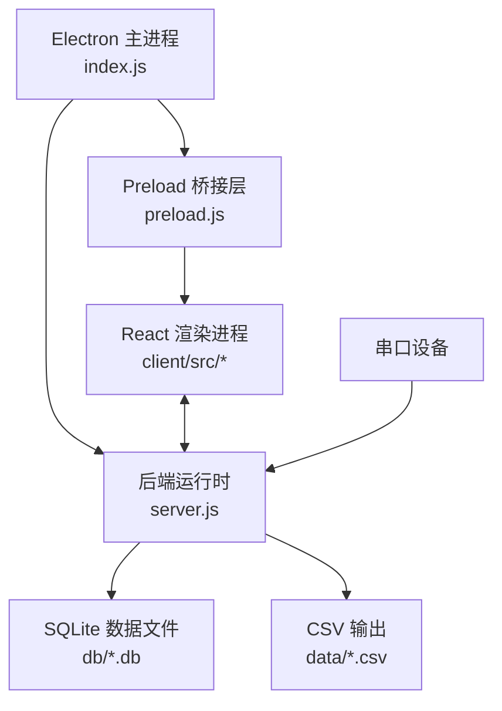

# 架构文档

> 本文档按 `update-tech-doc` 流程维护。  
> 最后更新：2026-03-02

## 1. 项目概览

Shroom 是一个基于 Electron 的压力传感器数据采集与可视化桌面应用，覆盖数据采集、处理、实时展示、存储与回放。

系统由三部分组成：

- Electron 主进程（`index.js`）：负责桌面窗口生命周期与 IPC 桥接。
- Node 后端运行时（`server.js`）：负责串口通信、WebSocket 分发、授权校验与数据持久化。
- React 渲染进程（`client/`）：负责实时页面、控制面板和历史回放界面。

## 2. 技术栈

| 分层 | 技术 | 版本 / 说明 |
| :--- | :--- | :--- |
| 桌面运行时 | Electron | `^31.3.0` |
| 前端框架 | React | `^19.0.0` |
| 前端构建 | Vite | `^6.0.0` |
| 路由 | react-router-dom | `^7.1.0`，`client/src/App.js` 使用 `HashRouter` |
| UI 组件库 | Ant Design | `^5.22.0` |
| 3D 渲染 | Three.js | `^0.170.0` |
| 图表 | ECharts | `^5.5.0` |
| 状态管理 | Zustand | `^5.0.0`（`client/src/store`） |
| 串口通信 | serialport | `^12.0.0` |
| 实时通信 | ws | `^8.14.2` |
| 数据库库 | sqlite3 / better-sqlite3 | 代码当前主要使用 `sqlite3`，依赖声明包含 `better-sqlite3` |
| CSV 导出 | csv-writer | `^1.6.0` |
| 加密 | crypto-js | `^4.2.0` |
| 自动更新 | electron-updater | 已有独立模块 `autoUpdater.js` |

## 3. 运行时架构

### 3.1 进程拓扑



### 3.2 启动链路

开发模式（`npm start` / `npm run dev`）：

1. `scripts/dev.js` 先检查 `http://127.0.0.1:3000` 是否已就绪。
2. 若未就绪，启动 `npm --prefix client run dev`。
3. 等待前端服务可访问。
4. 启动 Electron（`npm run start:electron:only`），并注入 `ELECTRON_START_URL`。
5. `index.js` 从开发服务器地址加载渲染页。

打包环境或非开发回退：

1. `index.js` 启动本地静态服务（`startStaticServer`），监听 `127.0.0.1:12321`。
2. 静态资源读取 `build/`（打包后的非 macOS 走 `resources/build`）。
3. `BrowserWindow` 加载本地静态 URL。

## 4. 目录结构（当前）

```text
shroom1/
|- index.js                    # Electron 主入口：窗口、IPC、静态资源回退
|- preload.js                  # contextIsolation 下的 IPC 安全桥
|- server.js                   # 后端核心（串口、ws、授权、DB、CSV），当前为大文件（约 4.6k 行）
|- scripts/
|  \- dev.js                   # 开发启动编排：Vite + Electron
|- client/
|  |- index.html               # Vite HTML 入口
|  |- vite.config.js           # Vite 配置，构建输出到 ../build
|  \- src/
|     |- main.jsx              # 当前生效的前端入口
|     |- App.js                # 路由配置（HashRouter）
|     |- page/                 # 页面层（home、date、col、license）
|     |- components/           # 组件层（three、heatmap、chart 等）
|     |- hooks/                # 自定义 Hook（websocket、playback、serial 等）
|     |- store/                # Zustand Store
|     \- constants.js          # 端口、传感器、阈值等常量
|- build/                      # 前端构建产物（供 Electron 静态回退使用）
|- db/                         # 运行时 SQLite 文件目录
|- data/                       # 运行时 CSV 输出目录
|- docs/                       # 其他架构/优化文档
|- openWeb.js                  # 传感器矩阵映射与转换工具
|- util.js / utilMatrix.js     # 通用工具函数
|- aes_ecb.js                  # 授权加解密辅助
\- ARCHITECTURE.md             # 本文档
```

### 4.1 已存在但未完全接入的模块

仓库中已有 `wsHelper.js`、`dbHelper.js`、`serialHelper.js`、`licenseHelper.js`、`configManager.js`、`dataProcessor.js`、`csvHelper.js`、`autoUpdater.js` 等模块。  
但当前主运行链路（`index.js` + `server.js`）仍以单体实现为主，尚未全面接线到这些模块。

## 5. 核心模块与数据流

### 5.1 采集与实时分发

1. 渲染层建立 WebSocket（主要 `ws://127.0.0.1:19999`，以及 `19998`、`19997`）。
2. 后端按前端指令打开串口并接收原始帧。
3. 原始数据经 `@serialport/parser-delimiter` 解析，再通过 `openWeb.js` 完成映射与转换。
4. 后端通过 WebSocket 服务向前端广播处理后的实时帧。

### 5.2 存储与回放

1. 采集过程中，后端写入 SQLite 并生成 CSV。
2. 前端可请求历史记录与回放。
3. 后端按记录读取历史数据并按帧推送回前端。

### 5.3 授权流程

1. 后端读取加密配置 `config.txt`。
2. 通过 `aes_ecb.js` 解密授权信息。
3. 访问 `sensor.bodyta.com` 时间接口校验有效期。
4. 前端授权页面（`/`）提交密钥后，根据回包进入 `/system`。

## 6. 接口

### 6.1 IPC 通道（preload 白名单）

`preload.js` 暴露的发送/调用通道：

- `ws-send`
- `serial-command`
- `app-command`
- `license-check`
- `file-dialog`
- `export-csv`
- `db-query`

接收通道：

- `ws-message`
- `serial-status`
- `license-status`
- `app-status`
- `export-progress`
- `db-result`
- `error`

说明：`index.js` 当前从 `server.js` 引用了 `handleCommand` 与 `getWsServer`，但 `server.js` 当前仅导出 `openServer`，因此对应 IPC 转发逻辑目前基本不会生效，需后续统一导出接口。

### 6.2 WebSocket 端口

| 端口 | 方向 | 主要用途 |
| :--- | :--- | :--- |
| `19999` | 双向 | 主数据通道与控制指令 |
| `19998` | 后端 -> 前端（并含命令处理分支） | 辅助数据流 1 |
| `19997` | 后端 -> 前端（并含命令处理分支） | 辅助数据流 2 |

## 7. 配置与环境

当前项目以硬编码配置 + 运行时文件为主，不依赖 `.env` 文件体系。

| 配置项 | 来源 | 默认值 / 行为 |
| :--- | :--- | :--- |
| 前端开发地址 | 环境变量 `FRONTEND_DEV_URL` | `scripts/dev.js` 默认 `http://127.0.0.1:3000` |
| Electron 渲染加载地址 | 环境变量 `ELECTRON_START_URL` | 开发模式由 `scripts/dev.js` 注入 |
| 静态回退地址 | `index.js` 常量 | `127.0.0.1:12321` |
| WebSocket 端口 | `server.js`、`client/src/constants.js` | `19999` / `19998` / `19997` |
| 串口波特率 | `server.js` | `1000000`（硬编码） |
| 运行时路径 | `server.js` 路径逻辑 | `db/`、`data/`、`config.txt`；打包后按平台切换 |

## 8. 当前架构备注

1. `server.js` 仍是关键单体模块，复杂度较高。
2. 模块化辅助文件已存在，但尚未完成主链路接入。
3. 前端当前有效入口是 `client/src/main.jsx`，`client/src/index.js` 仍保留为历史文件。
4. 数据库“代码使用”和“依赖声明”当前存在不一致（`sqlite3` vs `better-sqlite3`）。
5. 本文档描述的是 2026-03-02 的“当前代码事实”，不是目标态方案。

## 9. 项目进度

> 采用累积记录，按时间追加，不回写历史项。

| 日期 | 已完成工作 | 说明 |
| :--- | :--- | :--- |
| 2025-02-03 | 核心数据采集链路 | 串口通信、帧解析、WebSocket 分发、SQLite 存储 |
| 2025-02-03 | 多传感器支持 | 坐垫/靠背/头枕、手部、足部、床垫等多类型 |
| 2025-02-03 | 2D/3D 可视化 | 热力图 + Three.js 实时渲染 |
| 2025-02-03 | 历史回放与 CSV 导出 | 持久化查询与回放控制 |
| 2025-02-03 | 授权校验流程 | 加密密钥 + 在线时间校验 |
| 2025-02-03 | Electron 打包发布流程 | Forge + Builder 打包配置 |
| 2026-03-02 | Electron 安全强化 | `contextIsolation: true`、`sandbox: true`、preload 桥 |
| 2026-03-02 | Vite 开发启动链路 | `scripts/dev.js` 协调前端与 Electron 启动 |
| 2026-03-02 | 授权管理页面 | 增加 `/license` 路由及相关前端流程 |
| 2026-03-02 | 架构文档同步 | 文档已与当前代码结构对齐 |
| 2026-03-02 | 架构文档中文化 | 将 ARCHITECTURE.md 全量改为中文表述 |

## 10. 更新日志

| 日期 | 变更类型 | 说明 |
| :--- | :--- | :--- |
| 2026-03-02 | 初始化 | 创建初版 `ARCHITECTURE.md` |
| 2026-03-02 | 新增功能 | 授权控制升级，支持多类型授权与 `/license` 页面 |
| 2026-03-02 | 文档更新 | 根据当前运行代码刷新架构文档（开发脚本、启动路径、模块接线现状） |
| 2026-03-02 | 文档更新 | 文档全量中文化并统一术语 |


## 11. 2026-03-02 白屏修复记录

- 修复前端启动致命错误：删除 `client/src/components/three/box100_3.js` 和 `client/src/components/car/box100_3.js` 中对不存在导出 `interpSmall100` 的引用，避免模块加载阶段 `SyntaxError` 导致渲染进程白屏。
- 增强开发模式诊断能力（`index.js`）：新增渲染进程 `console-message`、`did-fail-load`、`render-process-gone` 日志，便于终端直接定位前端崩溃原因。
- 增强开发启动健壮性（`scripts/dev.js`）：启动前校验 `127.0.0.1:3000` 返回内容是否为 Shroom 前端，避免误连被占用端口上的其他服务而出现空白页面。
