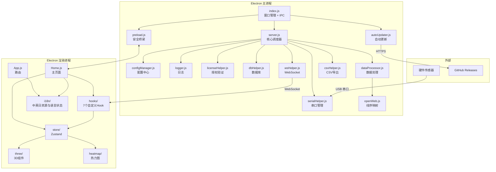

# 架构文档

> 本文档由 Manus 自动生成和维护。最后更新于：2026-08-17

## 1. 项目概述

Shroom1.0 是一个基于 **Electron** 的跨平台桌面应用程序，专用于**压力传感矩阵**的数据采集、实时可视化、存储与回放分析。系统通过串口（USB）与硬件传感器阵列连接，接收原始压力数据帧，经过线序映射、归零校准、高斯平滑等处理后，通过 WebSocket 推送至前端渲染进程，以 2D 热力图和 3D 模型的方式进行实时可视化呈现。

该系统支持多种传感器类型（汽车坐垫/靠背/头枕、床垫、手部、足底等），适用于人体工学研究、汽车座椅舒适性测试、医疗康复监测等场景。Max 分支在 main 分支基础上进行了全面的技术栈升级和架构重构，包括 Vite 构建工具迁移、React 19 升级、better-sqlite3 数据库替换、Electron 安全强化、InstancedMesh 3D 渲染优化、Zustand 状态管理引入以及自动更新集成。

## 2. 技术栈

| 分类 | 技术 | 版本/说明 |
| :--- | :--- | :--- |
| **应用框架** | Electron | ^31.3.0，跨平台桌面应用容器 |
| **前端框架** | React | ^19.0.0（从 17 升级），支持并发特性 |
| **前端构建** | Vite | ^6.0.0（从 Webpack 4 迁移），极速 HMR |
| **后端运行时** | Node.js | Electron 内置，主进程运行环境 |
| **数据库** | better-sqlite3 | ^11.0.0（从 sqlite3 迁移），同步 API + WAL 模式 |
| **编程语言** | JavaScript / TypeScript | 渐进式 TypeScript 引入（TS ^5.6.0） |
| **包管理器** | npm / yarn | 前后端分别管理依赖 |
| **状态管理** | Zustand | ^5.0.0，轻量级全局状态管理 |
| **实时通信** | WebSocket (`ws`) | ^8.14.2，前后端双向数据通信 |
| **硬件通信** | serialport | ^12.0.0，USB 串口数据读写 |
| **3D 渲染** | Three.js | ^0.170.0，压力分布 3D 可视化 |
| **UI 组件库** | Ant Design (antd) | ^5.22.0，控制面板 UI |
| **图表库** | ECharts | ^5.5.0，数据图表可视化 |
| **国际化** | i18next + react-i18next | 多语言支持 |
| **打包工具** | Electron Forge + electron-builder | 应用打包与分发 |
| **自动更新** | electron-updater | ^6.3.0，无缝后台更新 |
| **授权加密** | crypto-js (AES-ECB) | ^4.2.0，授权文件加密与验证 |
| **数据导出** | csv-writer | ^1.6.0，CSV 格式数据导出 |
| **测试框架** | Vitest | ^2.1.0，前端单元测试 |
| **代码规范** | ESLint | ^9.0.0，代码质量检查 |
| **代码混淆** | javascript-obfuscator + rollup-plugin-obfuscator | 生产构建时对业务代码进行混淆保护 |

## 3. 目录结构

```
shroom1.0/
├── index.js                 # Electron 主进程入口（窗口管理 + IPC 桥梁）
├── preload.js               # Electron 预加载脚本（安全 IPC 通道）
├── server.js                # 后端核心（串口数据处理 + WebSocket 分发，4308 行）
├── package.json             # 后端依赖与构建配置
│
├── # ── 后端拆分模块 ──
├── wsHelper.js              # WebSocket 广播与消息路由工具
├── dbHelper.js              # better-sqlite3 数据库操作封装
├── logger.js                # 结构化日志模块（带文件输出和性能计时）
├── serialHelper.js          # 串口生命周期管理
├── licenseHelper.js         # 授权配置路径解析与 config.txt 候选文件管理
├── licenseManager.js        # 在线/离线密钥统一解析、校验、缓存与运行期复检
├── sensorTypeStore.js       # 传感器类型清单缓存、远程拉取与前端下发
├── configManager.js         # 统一配置中心
├── dataProcessor.js         # 传感器数据处理管线
├── csvHelper.js             # CSV 导出工具
├── autoUpdater.js           # 自动更新模块
│
├── # ── 后端业务模块 ──
├── openWeb.js               # 数据转换函数库（线序映射、矩阵变换）
├── aes_ecb.js               # AES-ECB 加解密
├── gen.js / genType.js      # 传感器类型生成与配置
├── parse.js                 # 串口数据帧解析
├── press.js                 # 压力计算与校准
├── util.js / utilMatrix.js  # 通用工具函数
├── localWs.js               # 本地 WebSocket 客户端
├── serialport.js            # 串口端口扫描
│
├── # ── 模块化拆分 ──
├── server/                  # 从 server.js 提取的独立模块
│   ├── index.js             # 模块入口，统一导出
│   ├── mathUtils.js         # 数学/数据处理纯函数（高斯模糊、插值、分压等）
│   ├── dbManager.js         # 数据库初始化和管理
│   ├── jqbedAlgorithmConfig.js # jqbed 算法配置默认值、校验、原子持久化与快照
│   ├── jqbedAlgorithmProtocol.js # jqbed 算法配置 WebSocket 请求、广播与 Python 参数隔离
│   ├── smallBed12B.js       # 12B协议、V2.7.54压强标定与矩阵构帧
│   ├── collectionInsertQueue.js # SQLite采集批量写入队列
│   ├── csvUtf8.js           # 带UTF-8 BOM的CSV写入工具
│   └── csvMatrixUtils.js    # matCol方向和采集标签纯函数
│
├── # ── 配置文件 ──
├── forge.config.js          # Electron Forge 打包配置
├── jsconfig.json            # 后端 JSDoc 类型检查配置
├── types.d.ts               # 后端 TypeScript 类型定义
├── .gitignore               # Git 忽略规则
│
├── client/                  # 前端 React 应用
│   ├── package.json         # 前端依赖（React 19 + Vite + Zustand）
│   ├── vite.config.js       # Vite 构建配置
│   ├── index.html           # Vite 入口 HTML
│   ├── tsconfig.json        # 前端 TypeScript 配置
│   └── src/
│       ├── main.jsx         # Vite 入口（React 19 createRoot）
│       ├── App.js           # 路由配置（25+ 路由）
│       ├── constants.js     # 前端统一常量
│       ├── hooks/           # 自定义 Hook
│       │   ├── useWebSocket.js        # WebSocket 连接管理（自动重连 + 心跳）
│       │   ├── usePressureData.js     # 压力数据状态管理
│       │   ├── useSerialControl.js    # 串口控制指令封装
│       │   ├── useThreeScene.js       # Three.js 场景初始化
│       │   ├── usePlayback.js         # 历史数据回放控制
│       │   ├── useDeferredPressure.js # React 19 并发特性
│       │   └── useInstancedMesh.js    # InstancedMesh 渲染 Hook
│       ├── store/           # Zustand 状态管理
│       │   ├── useAppStore.js         # 全局应用状态
│       │   └── usePressureStore.js    # 压力数据专用 Store
│       ├── types/           # TypeScript 类型定义
│       │   └── index.ts
│       ├── components/      # UI 组件
│       │   ├── three/       # 3D 渲染组件（47 个传感器类型组件）
│       │   ├── heatmap/     # 2D 热力图组件
│       │   ├── chart/       # ECharts 图表组件
│       │   ├── car/         # 汽车座椅专用组件
│       │   ├── aside/       # 侧边栏导航
│       │   ├── title/       # 标题栏及 jqbed 算法配置图标、弹窗、表单模型
│       │   ├── updater/     # 应用更新通知组件（UpdateNotifier.jsx）
│       │   ├── foot/        # 足底分析组件
│       │   ├── footTrack/   # 足迹追踪组件
│       │   ├── num/         # 数值显示组件
│       │   ├── video/       # 视频组件
│       │   └── ...
│       ├── page/            # 页面级组件
│       │   ├── home/        # 主页、展示系统数据调度与本地化语音播报
│       │   ├── col/         # 数据采集页
│       │   ├── date/        # 启动密钥输入页（/）
│       │   ├── license/     # 管理员密钥配置页面
│       │   │   ├── License.js    # 密钥生成/解析/管理页面（/license-admin）
│       │   │   ├── License.css   # 页面样式
│       │   │   └── aesUtil.js    # 前端 AES-ECB 加解密工具
│       │   └── licensePortal/ # 行业解决方案访问密钥页（/license）
│       │       ├── LicensePortal.jsx # 密钥输入与行业方案展示页面
│       │       ├── LicensePortal.css # 独立深色页面样式
│       │       └── solutionConfig.jsx # 行业方案卡片与授权 key 映射
│       └── assets/          # 静态资源
│           ├── 开屏IMG/     # 行业方案体验中心图标图片资源
│           ├── images/      # 图片资源
│           ├── json/        # JSON 配置
│           └── util/        # 前端工具函数
│
├── docs/                    # 项目文档
│   ├── architecture_max.md
│   ├── optimization_report_max.md
│   ├── tech_optimization_proposal.md
│   └── *.png               # 架构图和数据流图
│
├── db/                      # SQLite 数据库文件（Git 忽略）
└── data/                    # 采集数据 CSV 文件（Git 忽略）
```

### 关键目录说明

| 目录/文件 | 主要功能 |
| :--- | :--- |
| `/index.js` | Electron 主进程入口，窗口管理、IPC 桥梁、安全配置（contextIsolation + sandbox），开发模式下会从 Vite 输出中识别并校验真实本地地址，避免误连其他 `localhost:3000` 页面 |
| `/client/src/components/title/` | 顶部标题栏组件，负责品牌字标、传感器切换、采集/回放控制、语言切换与设置抽屉 |
| `/client/src/i18n/` | 前端国际化入口与统一中英日资源目录；负责语言标准化、持久化，以及后端授权中文原因到当前界面语言的适配 |
| `/client/src/page/home/speechSynthesis.js` | 生命体征告警语音边界；按稳定 `alertKey` 调度日文本地 MP3，并负责中英文系统 voice、日文播放失败后的严格 `ja` voice 回退及防叠播状态 |
| `/client/public/audio/alerts/ja/` | 日文生命体征固定告警 MP3 源资源；生产发布副本位于 `/build/audio/alerts/ja/` |
| `/preload.js` | Electron 预加载脚本，建立渲染进程与主进程之间的安全 IPC 通道 |
| `/server.js` | 后端核心调度器，协调串口通信、数据处理、WebSocket 分发、数据库存储 |
| `/server/jqbedAlgorithmConfig.js` | jqbed 算法配置的 18 项默认值、双层校验、版本化快照及临时文件写入后重命名的原子持久化实现 |
| `/server/jqbedAlgorithmProtocol.js` | jqbed 实时配置的 WebSocket 协议边界；负责读取、保存、恢复默认、结果关联、广播和非 jqbed Python 请求隔离 |
| `/client/src/components/title/` | 除通用标题栏外，包含 `JqbedAlgorithmConfigModal.jsx`、`jqbedAlgorithmConfig.js` 与样式，提供四分组配置交互和前端校验 |
| `/client/src/hooks/` | 7 个自定义 React Hook，封装 WebSocket、压力数据、串口控制、3D 场景等逻辑 |
| `/client/src/store/` | Zustand 状态管理，分为全局应用状态和高频压力数据状态 |
| `/client/src/components/three/` | Three.js 3D 渲染组件与兼容入口，覆盖不同传感器类型和矩阵尺寸 |
| `/client/src/components/webgl/` | WebGL/Canvas 热力图渲染兼容模块，供机器人与复合体表映射组件复用 |
| `/client/src/page/home/` | 主页面组件（Home.js），系统核心交互界面 |
| `/docs/` | 架构文档、优化报告、技术优化建议，以及 EULA 最终用户许可协议文本 |
| `/scripts/` | 打包与发布脚本目录，包含 Python runtime 同步、更新说明注入，以及打包前清理和 `afterPack`/`afterComplete` 兜底移除 `config.txt` 的脚本 |
| `/python/app/` | Python 算法桥目录；`onbed_filter_example.py` 提供 JSON-line RPC，`oneStep/` 提供足压分析，`petCare/` 提供 `petCare` / `petCareMini` 算法二进制与调用文档 |
| `/python/dist/onbed_server/`、`/pack-resources/python/onbed_server/` | Windows 正式 Python JSON-line runtime 的构建输出与打包同步副本；均为生成物，不进入 Git |
| `/db/` | SQLite 数据库文件，存储采集数据和配置信息（运行时生成，Git 忽略） |
| `/data/` | CSV 导出文件目录（运行时生成，Git 忽略） |

## 4. 核心模块与数据流

### 4.1. 模块关系图 (Mermaid)


```mermaid
graph TD
    subgraph "Electron 主进程"
        INDEX["index.js<br/>窗口管理 + IPC"]
        PRELOAD["preload.js<br/>安全桥梁"]
        SERVER["server.js<br/>核心调度器"]
        CONFIG["configManager.js<br/>配置中心"]
        LOGGER["logger.js<br/>日志"]
        LICENSE["licenseHelper.js<br/>授权验证"]
        SERIAL["serialHelper.js<br/>串口管理"]
        DB["dbHelper.js<br/>数据库"]
        WS["wsHelper.js<br/>WebSocket"]
        DATA["dataProcessor.js<br/>数据处理"]
        CSV["csvHelper.js<br/>CSV导出"]
        UPDATE["autoUpdater.js<br/>自动更新"]
        OPENWEB["openWeb.js<br/>线序映射"]
    end

    subgraph "Electron 渲染进程"
        APP["App.js<br/>路由"]
        HOME["Home.js<br/>主页面"]
        HOOKS["hooks/<br/>7个自定义Hook"]
        STORE["store/<br/>Zustand"]
        I18N["i18n/<br/>中英日资源与语言状态"]
        THREE["three/<br/>3D组件"]
        HEAT["heatmap/<br/>热力图"]
    end

    subgraph "外部"
        HW["硬件传感器"]
        GH["GitHub Releases"]
    end

    INDEX --> SERVER
    INDEX --> PRELOAD
    INDEX --> UPDATE
    SERVER --> CONFIG
    SERVER --> LOGGER
    SERVER --> LICENSE
    SERVER --> SERIAL
    SERVER --> DB
    SERVER --> WS
    SERVER --> DATA
    SERVER --> CSV
    DATA --> OPENWEB

    PRELOAD <--> HOME
    APP --> I18N
    HOME --> I18N
    HOME --> HOOKS
    HOME --> STORE
    HOOKS --> STORE
    STORE --> THREE
    STORE --> HEAT

    HW -- "USB 串口" --> SERIAL
    UPDATE -- "HTTPS" --> GH
    WS -- "WebSocket" --> HOOKS
```

### 4.2. 主要数据流

1. **传感器数据采集流程**
    - 硬件传感器通过 USB 串口发送原始二进制数据帧 → `serialHelper.js` 接收并触发 `parser.on('data')` 事件 → `server.js` 调用 `dataProcessor.js` 进行线序映射（`openWeb.js`）、归零校准、高斯平滑 → 处理后的矩阵数据通过 `wsHelper.js` 广播到 WebSocket 端口 19999 → 前端 `useWebSocket` Hook 接收数据 → 更新 `usePressureStore` → React 重新渲染热力图和 3D 模型。
    - `smallBed12B`（小床检测 12B）使用 `1500000` 波特率和独立帧尾 `AA 00 55 00 03 00 99 00`，`@serialport/parser-delimiter` 按 8 字节帧尾切分后得到 2048 字节 payload；`server.js` 按 1024 个 `uint16LE` 解析为 32x32 ADC 矩阵，复用 `jqbed(pointArr)` 小床检测线序并清零后，立即调用 `estimatePointPressure` 将整帧转换为 kPa 压强矩阵并统一保留 1 位小数，后续 `sitData/rawSitData/pressureData`、左侧统计、回放、采集入库和 CSV 下载都使用这份 kPa 数据。该类型不加入 `jqbed/smallBed` 生命体征集合，因此前端 `Aside.jsx` 仅展示 Pressure Area 与 Pressure Data，不触发 Python 算法数据面板；左侧 Pressure Data / Pressure Area 统计使用 3D 插值和高斯处理前的 32x32 压强矩阵值。
    - `smallBed12B` 的标题栏新增 `展示设置`，实时矩阵可在 32x32 与 16x16 间切换；16x16 模式会按当前原始数据展示方向选择 2x2 块取点位置，前端通过 `smallBed12BDisplayOptions` 下发给后端，`server.js` 在串口入口转换为 kPa 后先把 32x32 转为原始数据显示方向，再从这份 32x32 展示矩阵按 2x2 抽点为 16x16，并用 `matrixOrientation: 'transposed'` 标记该帧已是展示方向；采集入库和 CSV 下载直接沿用实时展示尺寸与方向。12B 仅保留原始数据展示模式，前端切换到该系统时会强制使用 `numoriginal`，不再提供 3D 展示模式。`client/src/page/home/util.js` 的原始矩阵转置入口会按方阵长度自动识别 32x32 或 16x16；遇到已标记为展示方向的 12B 16x16 帧时不再二次转置。
    - `smallBed12B` 的采集按钮现在先打开 `Title.jsx` 采集配置弹窗；用户可设置采集名称、特征标签和入库频率。矩阵尺寸不再在采集弹窗里单独设置，而是跟随实时 `展示设置`，避免实时展示、采集入库和 CSV 下载尺寸不一致。
    - `handSinglePoint`（32*32(检测点)）沿用 `hand` 的单串口 32x32 / 1024 点协议和默认 `1000000` 波特率，实时串口数据只在后端 `openWeb.handSinglePoint()` 中按 1-based 点位表重排一次：先输出 481-992，每 32 点一行；再输出 449-1 的 15 行倒序块；最后输出 993-1024。WebSocket 展示、采集入库和 CSV 下载都使用这份后端处理后的 1024 点矩阵，前端不再参与线序转换；前端复用 `hand` 的 `CanvasHand` 渲染链路和 `normal` / `numoriginal` 模式，授权页和密钥脚本使用独立 key `handSinglePoint`，密钥配置页归入“精密”分组；CSV 下载按语言使用 `检测点` / `detection` 文件名前缀，并新增 `检测点` / `detectionPoint` 列写入 1024 点矩阵的最后一个点。
    - `smallBed12B` 使用独立的前端显示配置，不再复用通用 `bed` 颜色默认值；默认高斯为 `2`，3D 数字润滑为 `2`，颜色默认值为 `25`，过滤为 `0`，初始值为 `0`，高度默认值为 `0.1`。设置面板颜色滑块范围为 `5-30` 且步进为 `10`。`Home.jsx` 会通过通用 `syncDisplayRendererConfig()` 将进度条 state 同步到 3D/原始数据组件 ref，确保初始值、系统切换和滑块变更都会下发到渲染器内部变量。
    - 当系统类型为 `petCare` / `petCareMini` 时，`server.js` 先按 `jqbed` 线序将 32x32 数据重排，再以 50Hz（20ms）分别调用 `python/app/petCare/pet_care_wrapper` / `pet_care_wrappermini`；算法输出通过 `python/app/onbed_filter_example.py` 的 JSON-line RPC 回传给 Electron，前端 Title/Home/Aside/License 复用宠物看护链路展示呼吸率、姿态、体动、信号质量、模拟心率和压力系数；其中 `Aside.jsx` 会在前端层对 `petCareMini` 的离床状态（`petInBed=0` 或 `posture_state=0`）做展示归一化，强制将面板上的 `pressure_coefficient` 显示为 `0.00`，并依据呼吸频率在前端生成 `55-100` 区间的模拟心率替换原来的 SNR 展示；为避免心率跳变过快，模拟心率现在按 1 秒节拍更新一次，其余呼吸、姿态和质量数据仍保持实时刷新；同时 `server.js` 关闭了 `petCareMini` 的 `[petCareMini] algorithm result` 周期性信息日志，避免运行期刷屏。
    - 当系统类型为 `hand0205` / `hand0205Double` / `handGlove115200` / `handGloveFullPacket` 且前端处于普通 3D 遥操模式时，`Home.jsx` 使用模型渲染矩阵继续驱动手部姿态与手指弯曲，但 Aside 面板中的 `meanPres`、`maxPres`、`totalPres`、`point` 以及 Pressure Area / Pressure Data 图表改为直接基于原始 256 点矩阵（`realArr` / `rawPressureData`）计算和渲染，避免统计值被映射后的控制数据覆盖。
    - `hand0205Double`（触觉手套2）是独立于旧 `hand0205 copy.jsx` 的双手 3D 展示系统，前端使用新增 `client/src/components/three/hand0205Double.jsx`：左手继续沿用 `sitData/changeHandAngle/calibration` 旧手套接口，右手由 `backData` 分支调用 `rightData/changeRightHandAngle/calibrationRight` 驱动；右手模型从同一个 `hand1.glb` 克隆并设置镜像缩放，因此旧触觉手套系统和单手左右切换行为不受影响。`Title.jsx` 主传感器下拉与 `License.jsx` 授权配置页已恢复该系统入口；标题栏新增“一键连接双手套”，后端自动打开两个可用手套串口，并按每包第二个字节 `01=左手`、`02=右手` 将任意串口收到的数据路由到对应左右手通道。前端在双手模式下优先使用当前包的 `handSide` 区分左右手校准和姿态接口，`hand0205Double.jsx` 会把 147/256 点控制数据补成手形 32x32 渲染源，并在收到四元数/弯折数据时立即作用到左右手模型。
    - 触觉手套、触觉足底和 robot 类触觉上衣清零后，后端实时包会额外下发或优先保存 `rawPressureData` 作为清零后的压力矩阵；`Home.jsx` 的侧栏统计、Pressure Data 图表和 2D 数字模式优先读取该字段，右手 `backData` 清零后也会立即反映到前端显示。采集入库时，`server.js` 对 `hand0205` / `hand0205Double` / `handGlove115200` / `handGloveFullPacket` / `footVideo` / `robot*` 改为保存 `{ pressureData, rotate, zeroFrame }` 对象格式，其中 `pressureData` 是清零后的压力矩阵，`zeroFrame` 是用户点击清零时的基准帧；历史回放和 CSV 导出继续兼容旧数组格式。
    - 右手旧手套实时路径会在映射到 3D 模型前保留原始 256 点矩阵，并用独立的 `pointArr2RawZero` 作为右手 2D 数字/统计的清零基准；`Home.jsx` 只有在 `rawPressureData` 长度达到 256 时才使用该字段，否则回退到 `realArr`，避免右手 2D 数字误读 3D 映射数组后只显示少量点。
    - 手套类系统在 200Hz 采集时仍按原始采样频率写入 SQLite 历史数据，但 `server.js` 会把实时 WebSocket 展示推送限制到约 60fps，并移除手套高频路径上的逐帧 `console.log` / 入库成功日志，降低 Electron 主进程和前端渲染压力，避免采集时 UI 卡顿。
    - 当系统类型为 `handGloveFullPacket` 时，`server.js` 在 `AA 55 03 99` 分隔符后按 274 字节整包解析：前 2 字节为帧号与类型（当前按 `01` 右手、`02` 左手路由），中间 256 字节为手套压力矩阵，末尾 16 字节陀螺仪数据暂不参与渲染；解析后按整包协议专用的左右手 1-based 点位表映射到固定 `15x13`（195 点）数组：前 4 行为手指，第 5 行为指腹（非指腹格补 0），后 8 行为手掌（掌面空白格补 0）。`mappedArr195` 专用于原始数据视图的规则排布，`realArr` / `rawPressureData` 保留原始 256 点并继续供 `num` 2D 数字模式以 `16x16` 高速矩阵显示，`sitData` / `backData` 专用于旧手套 3D 模型并承载转换后的 32x32（1024 点）矩阵；前端会跳过整包手套的旧 `hand0205` 原始数据二次映射路径，避免 256/195/1024 三种数据形态互相覆盖。
    - 当系统类型为 `hand0205` / `handGlove115200` / `handGloveFullPacket` 且前端处于 3D `skin` 模式时，`client/src/components/video/hand.jsx` 继续沿用现有 `ndata1` 32×32 数据格式、`sitData/changeColor` ref 接口和 `CanvasTexture` 贴图链路，但热力图生成层由原来的 `HeatmapCanvas.changeHeatmap()` 切换为 `WebGLCanvas.render()`：为避免模型热力图全透明且保持原有 size 进度条语义不变，WebGL 输入改为复用旧 `HeatmapCanvas` 的强度缩放与补边预处理（包含固定 `*10` 强度放大和补零插值），并将滑杆 `size` 按旧 Canvas 圆形阴影扩散语义换算为 WebGL 半径后，再用单张离屏 WebGL canvas 生成 1024×1024 热力图并通过 `drawImage()` 回贴到原有手部纹理 canvas，以降低高频场景下的 CPU 逐帧绘制压力。

2. **数据存储与导出流程**
    - 用户点击"开始采集" → 前端通过 WebSocket 发送 `col` 指令 → `server.js` 开启采集模式 → 每帧数据同时写入 `dbHelper.js`（SQLite）和 `csvHelper.js`（CSV 文件） → 用户点击"停止采集"结束录制。
    - `Title.jsx` 的采集入口改为开始采集时弹出配置 Modal；原设置抽屉里的特征标签选择移动到该 Modal，采集频率通过 `colHZ/collectOptions.frequencyHz` 下发。`server.js` 使用每个通道独立的入库时间戳按频率跳帧，避免坐垫、靠背、头枕共用一个 `oldTimeStamp` 互相影响。
    - CSV 导出的最左侧 `seconds` 列使用数据库帧时间戳计算真实相对秒数（当前帧 `timestamp` - 导出首帧 `timestamp`），仅在缺失时间戳时回退到采集频率估算，不再固定按 12Hz 用 `j / 12` 生成。
    - CSV 表头根据前端当前语言自动选择：`Title.jsx` / `useSerialControl.js` 在 `downloadOptions.language` 中传入当前语言；`server.js` 中文模式输出 `秒数/矩阵最大值/时间戳/矩阵大于 0 的点数/矩阵总和/矩阵数据/四元数/温度/平均温度/温度K值` 等中文表头，英文模式继续输出旧版 `seconds/max/time/area/press/data/quaternion/temperatureCelsius/temperatureAvg/temperatureK` 简写表头；所有 CSV 文件开头统一写入 UTF-8 BOM，便于 Windows Excel/WPS 直接双击打开时识别中文；`handSinglePoint` 额外输出 `检测点` / `detectionPoint` 列，取 CSV `data` 矩阵的最后一个点。
    - `matCol` 停止采集不再自动触发 CSV 下载；采集记录名由“采集名称 + 特征标签1 + 特征标签2 + 时间片”组成，其中特征标签1只追加到文件名后面，`sitCol/matCol` 的 CSV `label` 列由 `server.js` 先去掉末尾时间片，再解析特征标签2 末尾的 `_数字`，并新增 `labelText` / `标签文本` 列记录特征标签2 的完整文本。
    - `smallBed12B` 的 CSV 文件名前缀使用系统简写 `12B`，例如 `12B2026-05-21...csv`；CSV `矩阵总和/press` 与选区矩阵总和按 kPa 压强数据求和并统一保留 1 位小数；其它系统保持既有 `file` 或通道名前缀。
    - 手套类 CSV 导出在保留整体 `data` 矩阵、`清零帧` 和 `quaternion` 姿态列的基础上，额外按左右手原始 256 点位表拆出 `小拇指`、`无名指`、`中指`、`食指`、`大拇指`、`指根`、`手掌` 七个 JSON 数组列；点位表为 1-based，代码读取时减 1 访问数组，`指根` 按小拇指到大拇指顺序写入 5 个弯折点。`hand0205`、`handGlove115200` 和 `handGloveFullPacket` 的 sit/back 导出都会写入这些部位列，但文件名前缀对用户改为左手 `left`、右手 `right`；`hand0205Double` 专用导出改为单个 `触觉手套2...csv` / `glove2...csv`，同一行同时写入左手和右手矩阵、统计、清零帧、四元数与分指数据；触觉足底和 robot 类触觉上衣也会写入 `清零帧`，但不会写入手套部位列。
    - `jqbed`、`smallBed`、`smallBedNoAlg` 与 `smallBed12B` 的原始数据展示和 CSV `data` 列会沿左上-右下对角线转置 32x32 矩阵，即 `(row, col)` 显示/导出为 `(col, row)`，用于匹配小床检测/监测系统原始矩阵方向；`jqbed/smallBed/smallBedNoAlg` 的前端原始 2D 数字矩阵入口仍在 `Num2Doriginal.jsx` 做兜底转置，`smallBed12B` 在 `util.js` 进入 `Fast1024` 前完成转置。
    - `smallBed12B` 的原始数据模式单独复用 `32*32高速` 的 `Fast1024` 渲染组件，进入组件前仍执行 32x32 对角线转置；该模式按压强值保留 1 位小数显示，颜色/数值上限按 `30` 处理，其它系统的原始数字矩阵颜色范围、配色逻辑和渲染组件保持原样。
    - `matCol` / 小床褥采集新增 `numoriginal` 原始数据模式，复用 `32*32高速` 的 `Fast1024` 彩色数字矩阵渲染；`Home.jsx` 固定传入 `matrixWidth=16`、`matrixHeight=10`，`NumThreeColor1024.jsx` 支持矩形矩阵尺寸后按 16x10 共 160 点居中渲染，旧 32x32/16x16 方阵模式保持默认行为不变。为保持与传感器和 3D 点图方向一致，2D 原始数据展示前会把 `matColLine()` 输出的 16 行 x 10 列矩阵转置为 10 行 x 16 列；`server.js` 的 `matCol` CSV `realData` 导出也执行同一转换。
    - `matCol` 现在纳入标题栏 `展示设置` 可视化调节范围，支持颜色上限、过滤值和初始过滤值；`Title.jsx` 按 `matCol + 当前展示模式` 独立读写 `valueConfig` 缓存，`Home.jsx` 通过 `syncDisplayRendererConfig()` 在系统切换和模式切换后把当前参数同步给 3D `MatCol` 与原始数据 `Fast1024` 渲染组件。
    - 大体量历史 CSV 下载不再先把所有帧和所有 CSV 行放入数组；`server.js` 使用 `matrix(date,id)` 索引按 `id` 游标分批读取历史帧，并用 `csv-writer` stringifier 写入文件流，覆盖通用 sit/back/head、整椅、大小床、选区标签和触觉手套2合并导出，降低 90 万帧下载时主进程内存压力。导出过程中后端会按批次通过 WebSocket 发送 `csvDownloadProgress`，前端 `Title.jsx` 的 CSV 下载弹窗展示百分比、当前文件、已写行数和多文件序号。

3. **历史数据回放流程**
    - 用户在历史数据页选择记录 → 前端发送 `play` 指令 → `server.js` 从 SQLite 读取历史帧数据 → 按时间间隔逐帧通过 WebSocket 推送 → 前端 `usePlayback` Hook 管理播放状态（播放/暂停/变速/跳帧）。
    - `smallBed12B` 回放兼容 32x32 原始采集和 16x16 缩小采集两种历史格式；`server.js` 会把对象格式历史帧还原为 `sitData` 并携带 `matrixWidth/matrixHeight`，32x32 采集按 32x32 回放，16x16 采集按 16x16 回放，不再把 256 点历史帧扩回 1024 点；`Home.jsx` 默认按标题栏 `展示设置` 初始化 12B 视图尺寸，`Title.jsx` 的回放/历史入口和历史时间选择都会同步 `smallBed12BDisplayOptions` 给后端，`server.js` 的主 WebSocket 与辅助 WebSocket 消息入口都会先应用该设置再处理 `getTime/loadSelectedHistory`，因此历史选择空帧也会按展示设置输出 16x16 或 32x32；前端只根据真实矩阵帧的 `matrixWidth/matrixHeight` 或历史回放帧的 `sitData` 方阵长度同步尺寸，控制/进度/切换清空类 WebSocket 消息不会再把尺寸回退到 32x32，避免默认展示和回放时反复重挂载闪烁。
    - 大体量历史记录（如几十万帧以上）选中时，`server.js` 不再一次性 `SELECT *` 加载全部帧到内存；改为先查询 `COUNT/MIN(id)/MAX(id)` 元信息、建立 `matrix(date,id)` 索引、生成最多约 2000 点的抽样压力/面积曲线，并通过懒加载代理在回放或拖动进度时按当前帧索引读取单帧，避免 90 万帧记录选中和回放时阻塞 Electron 主进程。
    - 历史记录列表合并时，`util.js` 的 `dedupli()` 会先过滤 `null`、空字符串和非数组输入，并把有效 `date` 统一转成字符串后再判断 `includes()`，避免数据库异常记录触发 Electron 主进程弹错。

4. **授权验证流程**
    - 应用启动 → `licenseHelper.js` 解析外部 `config.txt` 候选路径 → `licenseManager.js` 读取原始密钥并统一识别在线 hex 密钥或离线 base64 激活码 → 在线密钥走远程授权检查与断网缓存兜底，离线密钥走签名验签与防时间回拨可信时间校验 → `server.js` 只在 `licenseManager.isLicenseValid()` 通过后开放串口数据处理、采集和 WebSocket 数据通道。
    - Windows 打包版启动时按密钥保存位置读取 `config.txt`：优先当前 `userData/config.txt`，并兼容安装目录同级、`process.resourcesPath/config.txt`、旧版安装目录 `resources/config.txt` 与当前工作目录 `resources/config.txt` 候选；`server.js` 会用 `licenseManager.peekPayload()` 过滤无法解析的候选文件，并在安装目录或资源目录密钥有效时自动迁移到当前可写 `userData/config.txt`，避免远程更新后因读取路径变化丢失本地密钥。
    - `server.js` 在授权状态下发时重新按 `licenseHelper.js` 的保存位置候选读取当前 `config.txt` 原始 `licenseKey`，包括启动校验中、有效、无效和锁定状态；`Date.jsx` 与 `LicensePortal.jsx` 收到后回填密钥输入框，确保旧版本本地密钥被新版本读取后能在访问密钥页显示，前端不再把 `localStorage` 作为首屏读取来源。
    - `licenseManager` 会在启动和密钥写入后启动运行期复检，持续广播 `licenseType`、`remainingDays`、`licenseChecking`、`licenseError` 或 `licenseLocked`；前端 `Date.jsx`、`LicensePortal.jsx`、`License.jsx` 和 `Home.jsx` 根据这些状态展示验证中、过期、暂停、吊销或时间异常锁定提示。
    - 密钥 `file` 字段继续用于授权范围、默认系统、模块配置和前端可选系统过滤；`server.js` 通过 `getSelectFlagFromLicense()` 下发 `selectFlag`，并用独立的 `activeSensorType` 下发后端当前实际运行系统。`Home.jsx` 将授权范围写入 `allowedTypes`，同时优先用 `activeSensorType` 设置前端默认展示，保证界面、串口协议和数据库系统一致。
    - 运行中直接替换为默认系统不同的新密钥时，`server.js` 不再只改写 `file`；密钥入口与标题栏普通系统切换统一调用 `switchActiveDisplaySystem()`，关闭旧串口及民政传感器端口、清空自动重连端口号、重建目标系统数据库引用、停止历史回放并清空旧帧缓存，避免授权状态已切换而采集链路仍停留在旧展示系统。

6. **密钥配置管理流程**
    - 用户启动应用默认进入 `/` 的 `Date.jsx` 密钥输入页；该页只在用户主动提交后展示错误弹窗，收到有效 `date` 且 `valid !== false` 后再进入 `/system`。从系统页返回输入密钥时，不会因为后端主动推送有效授权而自动跳走。
    - `/license` 保留行业解决方案体验中心 `LicensePortal`，用于展示 Shroom Vision 方案卡片、SDK 状态和访问密钥入口；提交密钥时仍通过 WebSocket `ws://localhost:19999` 发送 `{ date: { date: key } }`，后端由 `licenseManager` 判断在线/离线密钥格式并写入可写 `config.txt`。
    - `/license-admin` 的 `License.jsx` 改为验证方密钥管理页：自动识别在线 hex 与离线 base64 激活码，支持解析预览、写入应用、展示当前授权状态、传感器类型映射、剩余天数、离线/在线状态和锁定提示；密钥统一由外部密钥管理系统生成，桌面端不再承担发证生成逻辑。
    - 后端支持前端请求 `getSensorTypes`，由 `sensorTypeStore.js` 拉取/缓存传感器类型清单并通过 `sensorTypeList` 下发，密钥页和系统页可用后台动态映射替代本地硬编码名称。

5. **自动更新流程**
    - 应用启动 30 秒后 → `autoUpdater.js` 检查自建服务器 `http://sensor.bodyta.com/shroom1` → 发现新版本后通过 `update-status` IPC 通道通知前端 → 前端 `UpdateNotifier` 组件弹出通知 → 用户点击「下载更新」后通过 `update-command` IPC 通道触发下载 → 下载过程中实时推送进度到前端 → 下载完成后弹窗询问是否立即安装并重启。
    - 若检查更新阶段遇到 `ERR_CONTENT_LENGTH_MISMATCH`，主进程会等待 1.5 秒后自动重试一次；若仍失败，则将归一化后的错误消息通过 `update-status` / `update-command` 返回给前端，提示优先排查更新服务器、CDN 或代理缓存的响应头与实际文件长度不一致问题。
    - 用户确认立即安装后，`autoUpdater.js` 会先调用主进程传入的 `beforeInstall` 清理钩子，关闭静态资源服务、WebSocket 服务、串口、数据库、Python worker 和 OneStep 报告 HTTP 服务，再触发 `quitAndInstall()`，避免 Windows NSIS 安装器因旧版进程未完全退出而弹出“Shroom 无法关闭”重试对话框。
    - IPC 通道：`update-command`（前端 → 主进程：checkForUpdate / downloadUpdate / installUpdate）、`update-status`（主进程 → 前端：checking / available / downloading / downloaded / error）。
    - 仅在打包后（`app.isPackaged`）启用自动更新，开发环境不触发。

7. **国际化流程**
    - `client/src/App.jsx` 统一加载 `client/src/i18n/index.js`；初始化层将 `zh-CN` / `en-US` / `ja-JP` 等语言值归一化为 `zh` / `en` / `ja`，从 `localStorage.language` 恢复用户选择，并在语言变化时同步持久化和更新 `document.documentElement.lang`。
    - `client/src/i18n/resources.js` 维护中文和英文基准文案，`client/src/i18n/ja.js` 按同一键路径以 `compare(中文, 日文)` 维护逐项对照目录，再生成 i18next 所需的三套同构资源；入口、授权、更新、采集、CSV、报告、主工具栏、传感器面板、人体分区、回放、足压分析和演示调节组件均通过 `t(key)` 读取。
    - `client/src/i18n/translateBackendMessage.js` 只在展示层转换授权服务返回的固定中文原因和带前缀异常；WebSocket 协议值、密钥内容、数据库字段、采集标签和 CSV 数据保持原值，避免国际化影响后端匹配与历史数据兼容。
    - Shroom Vision 入口页和系统标题栏都提供中、英、日文切换；入口页可在未授权状态下直接选择语言，系统标题栏沿用同一全局语言状态。日期、浏览器语音和 Ant Design 组件同步使用当前语言的区域设置。
    - 生命体征告警统一经过 `client/src/page/home/speechSynthesis.js`。`Home.jsx` 保持原有触发条件，只为 `leftBed`、`fallRisk`、`satUp`、`emergency` 传入稳定 `alertKey`；日文模式分别优先播放 `/audio/alerts/ja/left-bed.mp3`、`edge-seat.mp3`、`edge-seat.mp3`、`emergency.mp3`。同一活动键重复请求不叠播，不同键会暂停并归零上一条本地音频后切换。
    - 本地 MP3 的构造、加载或播放失败时回退 Web Speech API；voice 的大小写、下划线和地区变体会标准化后按基础语言匹配，日文只允许 `ja` voice，首次 voice 列表尚未加载时监听一次 `voiceschanged` 重试，仍不可用则跳过播报并告警，不回退到中文系统 voice。中文和英文继续直接使用 Web Speech，不进入日文 MP3 路径。日文界面及播报用的 `fallBed`、`sitUp`、`home.alerts.fallRisk`、`home.alerts.satUp` 四个资源键统一为 `端座位`。
    - `client/public/audio/alerts/ja/` 保存 `left-bed.mp3`（`離床`）、`edge-seat.mp3`（`端座位`）和 `emergency.mp3`（`SOS緊急通報`），均由 `ja-JP-NanamiNeural` 以 `-5%` 语速制作，并由 Vite 同步到 `build/audio/alerts/ja/` 供离线运行。
    - CSV 下载请求携带当前语言；`server.js` 分别输出中文、旧版英文简写或日文表头，并同步本地化检测点、触觉手套部位和左右手文件名，不修改历史数据字段和值。

### 4.3. Jqbed Algorithm Configuration

配置链路为 `Title` 图标/弹窗 → `Home` WebSocket → `jqbedAlgorithmProtocol` → `jqbedAlgorithmConfig` store → `server.js` 的 `jqbedTimer` → `pyWorker` → `getData(data, config=None)` → `onbed_filter.pyd`。该链路只服务持有效 `jqbed` 授权的实时“小床监测”；标题栏调节图标仅在 `matrixName === 'jqbed'` 时显示并位于通用设置齿轮左侧，回放时保留入口但禁用，提示“算法参数仅对实时监测生效”，后端同时以授权、活动系统和实时状态再次拒绝越界请求。

- **字段模型**：共 18 项，分为四组。SOS：`sos_peak_threshold`、`points_threshold_in`、`sos_disable_area`、`min_sos_sequence`；基础参数：`threshold_factor`、`continuous_on_bed_duration_minutes`、`unlock_sitting_alarm_duration_minutes`；滤波与区域：`filter_switch`、`strel_switch`、`leave_bed_disable_area`、`small_object_size`；高级参数：`breath_detect_mode`、`sitting_area`、`body_movement_threshold`、`step_leavebed_trigger`、`edge_align_ratio`、`sensitivity_threshold`、`breath_th`。新版原生算法删除二元输入 `head_foot_area`，新增整数模式 `sensitivity_threshold`：`0` 默认、`1` 宽松（严格参数）、`2` 标准、`3` 灵敏，用于联动三个内部阈值；实时返回预留字段第 5～8 位用于显示内部细节。前后端都要求字段完整并拒绝未知字段、非有限值和负数，灵敏度严格限制为整数 `0–3`；配置 envelope 升级至 v2，读取 v1 时保留其余公共参数、丢弃 `head_foot_area` 并补入灵敏度默认值。二维区域继续按各自约束校验，`sitting_area` 额外允许成对哨兵 `[255, 255]`。
- **持久化与同步**：打包环境写入 `app.getPath('userData')/jqbed-algorithm-config.json`，开发环境写入项目根目录 `jqbed-algorithm-config.json`。store 先把版本化 envelope 写入同目录唯一 `.tmp` 临时文件，再以 rename 替换正式 JSON；只有落盘成功后才更新内存快照。保存或恢复默认会向所有 WebSocket 客户端广播后端快照，GET/保存/恢复均按 `requestId` 返回明确结果。`Home` 只有在主 WebSocket 真正完成 `send()` 时才报告成功，并把连接状态及重连 epoch 传给弹窗；弹窗为读取和变更分别设置 10 秒超时，断线会清理 pending，重连会重新 GET。发送失败、超时、拒绝和断线都保留 dirty 草稿，远端广播/重连快照也不会覆盖未保存输入。
- **帧边界与系统隔离**：`jqbedTimer` 每次 Python 调用前读取一次深拷贝快照；已经发出的在途帧不被修改，下一帧开始使用新配置。`buildJqbedGetDataArgs()` 仅在活动系统为 `jqbed` 时附加 `config`；兼容定时器中的 `smallBed` 仍只发送 `{ data }`，`smallBedNoAlg` 与 `smallBed12B` 不进入此 Python 配置链路。原始矩阵、采集、回放、CSV 和历史数据通道不读取算法配置。
- **Python 与告警边界**：`python/app/onbed_filter_example.py` 的 `getData(data, config=None)` 将合法 JSON 配置转换为 `onbed_filter.pyd` 的标量或 `float32` 二元数组输入。SOS 配置本身不直接触发或改写前端告警；只有 PYD 输出经 Python RPC 返回的 `sosflag` 继续进入现有 `Home`/`Aside` 告警路径。
- **正式 runtime**：Windows 仓库直接跟踪指定的 `python/app/onbed_filter.cp311-win_amd64.pyd`，固定 SHA-256 为 `CDC003A317F8281AB126839DF4A3E94237A5856229CB3660CFAEB453B4D462E2`，保证其他电脑 `git pull` 后不会继续沿用仍要求 `head_foot_area` 的旧二进制。`npm run prepare-pack-resources` 默认校验该固定哈希；仍可用 `ONBED_FILTER_PYD_SOURCE` 与 `ONBED_FILTER_PYD_SHA256` 显式注入并校验外部候选。构建脚本对 Python 3.11 探测、PyInstaller 构建统一强制 UTF-8，生成 `python/dist/onbed_server/onbed_server.exe` 后执行 `health` JSON-line RPC，只有 `pong=true`、`onbedFilterAvailable=true` 且 `onbedFilterSensitivitySchema=true` 才继续同步到 `pack-resources/python/onbed_server/onbed_server.exe`，从打包阶段阻断旧字段协议。`npm run check-python-runtime-health` 可独立复验。打包后的 `pyWorker` 从 `process.resourcesPath/python`（含 `app.asar.unpacked` 候选）解析该可执行文件，并保持 stdout 仅承载 JSON-line RPC。`python/app/serial_monitor_updated2.0(1).py` 仅是非运行时、未跟踪参考，不属于提交、构建输入或打包 runtime。

## 5. API 端点 (Endpoints)

本项目不使用 HTTP REST API，而是通过 **WebSocket 消息协议**进行前后端通信。系统运行 3 个 WebSocket 服务器：

| WebSocket 端口 | 用途 | 数据方向 |
| :--- | :--- | :--- |
| `19999` | 主数据通道（压力矩阵数据 + 控制指令） | 双向 |
| `19998` | 辅助数据通道（靠背/头枕等附加传感器） | 后端 → 前端 |
| `19997` | 辅助数据通道（第三路传感器数据） | 后端 → 前端 |

### WebSocket 消息类型（前端 → 后端）

| 消息标识 | 描述 |
| :--- | :--- |
| `getMessage.index` | 切换传感器类型 |
| `getMessage.sitIndex` | 切换坐垫/靠背/头枕 |
| `getMessage.compen` | 设置压力补偿值 |
| `getMessage.resetZero` | 归零校准 |
| `getMessage.gauss` | 设置高斯平滑参数 |
| `getMessage.play` | 开始/停止历史回放 |
| `getMessage.date` | 提交密钥 / 查询历史数据列表 |
| `getMessage.delete` | 删除历史记录 |
| `getMessage.download` | 导出 CSV 数据 |
| `getMessage.exchange` | 矩阵行列交换 |
| `getMessage.variety` | 切换传感器变体 |
| `getMessage.up` / `getMessage.down` | 调整参数 |
| `getMessage.backIndex` | 靠背传感器索引 |
| `getMessage.history` | 历史数据查询 |
| `getMessage.serialReset` | 串口重置 |
| `getMessage.indexArr` | 批量索引设置 |
| `getMessage.getJqbedAlgorithmConfig` | 读取 jqbed 实时算法配置、PYD 状态和最后保存时间；成功或拒绝均返回关联结果 |
| `getMessage.setJqbedAlgorithmConfig` | 校验、原子保存并立即应用完整的 18 项 jqbed 算法配置 |
| `getMessage.resetJqbedAlgorithmConfig` | 恢复、原子保存并立即应用 jqbed 默认算法配置 |
| `getMessage.requestId`（关联字段，非独立消息） | 关联 jqbed 配置读取/保存/恢复请求与后端 `jqbedAlgorithmConfigResult`；成功变更快照通过 `jqbedAlgorithmConfig` 广播 |

## 6. 外部依赖与集成

| 服务/库 | 用途 | 集成方式 |
| :--- | :--- | :--- |
| `serialport` + `@serialport/parser-delimiter` | 硬件传感器串口通信 | Node.js 原生模块 |
| `better-sqlite3` | 本地数据持久化（采集数据、配置） | Node.js 原生模块 |
| `ws` | 前后端实时双向通信 | WebSocket 协议 |
| `electron-updater` | 应用自动更新 | GitHub Releases API |
| `crypto-js` | 授权文件 AES-ECB 加解密 | 库调用 |
| `csv-writer` | 采集数据 CSV 格式导出 | 库调用 |
| `three` | 压力分布 3D 模型渲染 | WebGL 渲染 |
| `echarts` | 数据图表可视化 | Canvas 渲染 |
| `antd` | 控制面板 UI 组件 | React 组件库 |
| `i18next` | 多语言国际化支持 | React 插件 |
| `http` (Node.js 内置) | HTTP 请求（在线时间获取） | Node.js 原生模块（已从废弃的 `request` 包迁移） |

## 7. 环境变量

本项目为 Electron 桌面应用，不使用传统的 `.env` 环境变量文件。配置通过以下方式管理：

| 配置项 | 来源 | 描述 | 默认值 |
| :--- | :--- | :--- | :--- |
| WebSocket 端口 | `configManager.js` / `server.js` 硬编码 | 主数据通道端口 | `19999` |
| 串口波特率 | `configManager.js` / `server.js` 硬编码 | 串口通信速率 | `460800` |
| 授权信息 | 外部 `config.txt`（AES 加密文件，不随安装包内置） | 授权有效期、设备标识 | 无 |
| 数据库路径 | `configManager.js` | SQLite 数据库文件位置 | `./db/info.db` |
| CSV 导出路径 | `configManager.js` | 采集数据 CSV 导出目录 | `./data/` |
| 授权服务配置 | `configManager.js` / `licenseManager.js` | 在线授权检查、离线密钥复检、传感器类型清单拉取 | `appConfig.keyServer.BASE_URL` |

## 8. 项目进度

> 记录项目从开始到现在已经完成的所有工作，每次新增追加到末尾。

| 完成时间 | 分支 | 完成的功能/工作 | 说明 |
| :--- | :--- | :--- | :--- |
| 2026-08-14 | sqliteOpti | 合并回退业务功能恢复 | 保留 `licenseManager` 在线/离线授权体系，恢复 `smallBed12B` V2.7.54 kPa 数据链、32/16显示缓存、历史时间、SQLite批量采集、CSV UTF-8 BOM 和 `matCol` 16x10原始数字方向。 |
| 2026-08-10 | Codex | 日文译文人工校订同步 | 按《JQTOOLS中日翻译确认表》逐项回写 642 项中日目录：采用 101 项填写的新译文，并按表格当前译文恢复 3 项已勾选内容；4 项空白待确认内容保持现状，所有模板占位符不变。 |
| 2026-07-21 | Codex | 授权默认系统前后端对齐 | 授权状态新增 `activeSensorType` 表示后端实际运行系统；前端多类型/全部授权默认展示优先跟随该值，修复精密类全选时前端显示触觉手套、后端运行检测点而导致串口无法连接的问题。 |
| 2026-07-21 | Codex | 日文资源中文对照 | `client/src/i18n/ja.js` 的 642 项资源改为 `compare(中文, 日文)` 逐项对照结构，运行时读取其中 `ja` 值，便于直接核对翻译。 |
| 2026-07-21 | Codex | 软件日文版 | 新增 642 项日文资源并接入 `ja` / `ja-JP`，入口和标题栏支持第三语言切换；日期、语音、Ant Design 组件及 CSV 表头/手套分区同步支持日文，协议与历史数据值保持不变。 |
| 2026-07-21 | Codex | 软件完整中英文配置 | 新增 `client/src/i18n/index.js`、`resources.js` 和授权消息转换层，将入口、授权、更新、主工具栏、采集/CSV/PDF、数据面板、人体分区、足压及演示组件统一接入中英文资源；入口页新增语言切换，协议与存储值保持不变。 |
| 2026-07-03 | Codex | 密钥输入框回填修复 | `server.js` 授权状态按保存位置读取并携带 `licenseKey`，`Date.jsx` 与 `LicensePortal.jsx` 在 WebSocket 收到本地配置密钥后回填输入框，修复访问密钥页不显示已读取密钥的问题。 |
| 2026-07-03 | Codex | 旧版 Windows 密钥路径兼容 | `licenseHelper.js` 在打包版候选中补充安装目录 `resources/config.txt` 与当前工作目录 `resources/config.txt`，兼容 1.0/1.1.0 旧版把密钥写入资源目录的安装方式。 |
| 2026-07-03 | Codex | 远程更新后密钥读取修复 | `server.js` 启动时按 `licenseHelper.js` 的保存位置候选验证 `config.txt`，并将安装目录或资源目录中的有效密钥迁移到当前可写目录，避免远程更新后无法读取本地已保存密钥。 |
| 2026-07-01 | Codex | Shroom Vision 保存密钥对齐 | `LicensePortal.css` 将“保存密钥”字号和复选框缩小，并让其左边距跟访问密钥输入框保持一致，桌面与 1280 响应式宽度分别同步到输入区缩进。 |
| 2026-07-01 | Codex | Shroom Vision 密钥区细节调整 | `LicensePortal.css` 缩小“保存密钥”文字，移除访问密钥图片外层背景/边框/阴影，并在 `html` / `body` / `#root` 层限制横向溢出，避免密钥页出现横向滚动条。 |
| 2026-07-01 | Codex | Shroom Vision 访问密钥图标替换 | `LicensePortal.jsx` 将访问密钥标题左侧 icon 从 `LockOutlined` 替换为 `assets/开屏IMG/ChatGPT Image 2026年7月1日 11_54_17.png`，并在 `LicensePortal.css` 固定图片尺寸，避免拉伸变形。 |
| 2026-06-30 | Codex | Shroom Vision 门户放大与底部对齐 | `LicensePortal.css` 放大密钥入口、方案卡片与 1280 宽度下的字号/间距，并将底部 `Shroom Vision · © 2026 JQ Industries` 固定到与右下角“反馈”文字同一水平线。 |
| 2026-06-30 | Codex | Shroom Vision 门户尺寸微调 | `LicensePortal.css` 将访问密钥面板背景改为 `#0072ef`，并在保持无横向滚动的前提下回放门户页整体字号、卡片和密钥区域间距，避免界面过度紧凑。 |
| 2026-06-30 | Codex | Shroom Vision 门户布局更新 | `LicensePortal.jsx` / `LicensePortal.css` 按新参考图调整为顶部品牌与状态、左侧主标题、横向访问密钥面板、四列方案卡片、底部版权和右下反馈按钮的一屏布局，并保留原密钥提交与反馈弹窗逻辑。 |
| 2026-06-30 | Codex | 采集标签 CSV 写入扩展 | `server.js` 将采集记录名里的特征标签2解析结果复用到大床、小床矩阵、通用座面、靠背、头枕和 `hand0205Double` CSV 导出；除小床褥外，其它带采集标签的下载也会追加 `label` / `labelText` 列。 |
| 2026-06-30 | Codex | 采集 CSV 表头恢复 | 将 `sitCol` / `matCol` 下载表头恢复为合并前 `sqliteOpti` 规则：`sitCol` 输出 `realData,label,labelText`，`matCol` 输出矩阵统计列加 `label,labelText`，并恢复小床褥矩阵方向格式化。 |
| 2026-06-30 | Codex | 采集写入运行时错误修复 | 修复 `server.js` 中 `colOrSendData()` 的 `frameToStore` 声明被合并冲突注释吞掉的问题，避免实时采集进入存储分支时报 `ReferenceError: frameToStore is not defined`。 |
| 2026-06-30 | Codex | 离线密钥分支合并 | 将 `feature/离线密钥功能增加/260616/sqt` 合并进 `sqliteOpti`，冲突文件以该分支为准，接入 `licenseManager` 在线/离线密钥统一校验、运行期复检、锁定提示和动态传感器类型清单。 |
| 2026-06-29 | Codex | Shroom Vision 新稿视觉收敛 | `/` 与 `/license` 密钥入口按新稿移除底部能力条，将反馈入口收敛为右下角紧凑按钮，右上角 SDK 文案改为“SDK 定制”，并统一方案卡片为蓝青色科技风格。 |
| 2026-06-29 | Codex | Shroom Vision 内页布局收敛 | `/` 与 `/license` 密钥入口移除人工窗口圆点和外层边框，只保留顶部 Logo/状态/SDK、主标题、密钥框、方案卡片和右下反馈入口组成的页面内部布局。 |
| 2026-06-29 | Codex | Shroom Vision 方案模块静态化 | `/` 与 `/license` 密钥入口取消方案卡和模块项的默认高亮与 hover 反馈，模块改为纯展示列表，并固定左侧 icon 容器尺寸避免图标压缩。 |
| 2026-06-26 | Codex | Shroom Vision 反馈入口与新版布局 | `/` 与 `/license` 密钥入口按新版视觉优化：方案模块改为卡片内竖向列表，底部新增核心能力条，右下角新增“提供反馈”入口，点击后在右侧弹出反馈类型、内容和联系方式表单。 |
| 2026-06-26 | Codex | Shroom Vision 密钥入口布局 | `/` 与 `/license` 密钥入口统一改为 Shroom Vision 标题和压力可视化/动态采集/报告输出副标题，左上角使用新增品牌 Logo 图片，并将访问密钥输入面板移动到解决方案模块上方居中展示。 |
| 2026-06-16 | Codex | 小床检测 12B 主回放连接设置顺序修复 | `server.js` 主 WebSocket 入口现在会在处理 `getTime/loadSelectedHistory` 前优先应用 `smallBed12BDisplayOptions`，避免应用重启后实时 16x16 切到回放时历史空帧仍按服务端默认 32x32 输出。 |
| 2026-06-16 | Codex | 小床检测 12B 实时切回放尺寸保持 | `Title.jsx` 的回放/历史按钮和历史时间选择消息会携带 `smallBed12BDisplayOptions` 并同步前端 12B 视图尺寸；`server.js` 在 WebSocket 消息入口优先应用该设置，再加载历史数据，避免实时 16x16 切换到回放时历史空帧按旧默认 32x32 下发。 |
| 2026-06-16 | Codex | 小床检测 12B 回放入口默认尺寸跟随展示设置 | `Home.jsx` 在点击回放进入本地模式时立即按 `smallBed12BRealtimeMatrixMode` 设置 12B 视图尺寸并同步 `smallBed12BDisplayOptions`；`server.js` 的历史选择空帧不再固定发 1024 点，而是按展示设置发送 16x16/32x32 和尺寸元数据。 |
| 2026-06-16 | Codex | 小床检测 12B 默认展示跟随展示设置 | `Home.jsx` 将 12B 默认矩阵尺寸计算收敛到展示设置，系统切换时直接按 `smallBed12BRealtimeMatrixMode` 初始化视图并把 `smallBed12BDisplayOptions` 与 `file` 合并发送给后端；实时无尺寸清空帧不再覆盖展示设置。 |
| 2026-06-16 | Codex | 小床检测 12B 回放尺寸闪烁修复 | `Home.jsx` 的 12B 矩阵尺寸同步不再对缺少 `matrixWidth/matrixHeight` 的非矩阵消息默认使用 32x32；只有真实 `sitData` 帧或明确尺寸元数据才会更新 `smallBedMatrixWidth/smallBedMatrixHeight`，避免回放 16x16/32x32 时视图尺寸来回切换。 |
| 2026-06-16 | Codex | 小床检测 12B 回放尺寸保持采集尺寸 | `server.js` 移除 12B 历史回放中 256 点扩回 1024 点的逻辑；对象格式和旧数组格式的 256 点历史帧都会按 `16x16` 下发，32x32 采集仍按 `32x32` 下发，前端按 `matrixWidth/matrixHeight` 重挂载原始矩阵视图。 |
| 2026-06-16 | Codex | 小床检测 12B 16x16 抽点基准修正 | `server.js` 将 12B 16x16 实时缩小改为先把 32x32 压强矩阵转为原始数据显示方向，再按用户选择的 2x2 位置抽点；新 256 点帧保存 `matrixOrientation: 'transposed'`，前端和 CSV 导出据此跳过二次转置，保证实时、采集、下载方向一致。 |
| 2026-06-16 | Codex | 小床检测 12B 实时矩阵展示设置 | `Title.jsx` 为 `smallBed12B` 增加展示设置弹窗，支持 32x32/16x16 和 2x2 取点位置；`Home.jsx` 将 12B 强制锁定为原始数据模式并按尺寸重挂载 `Fast1024`；`server.js` 在串口压强入口按 `smallBed12BDisplayOptions` 下发 32x32 或 16x16 kPa 矩阵，采集入库和 CSV 下载直接使用同一尺寸。 |
| 2026-06-16 | Codex | 小床检测 12B 16x16 实时方向修正 | `client/src/page/home/util.js` 将原始矩阵转置函数从固定 32x32 改为按方阵长度自动识别，16x16 实时缩小矩阵现在会像 32x32 一样经过同一左上-右下方向转置，避免实时展示沿对角线翻转。 |
| 2026-06-16 | Codex | CSV Excel 乱码方案入 QA | 新增 `QA.md`，记录 Windows Excel 直接打开中文 CSV 乱码的原因、项目内统一写 UTF-8 BOM 的解决方式，以及老版本 Excel 使用“从文本/CSV”按 UTF-8 导入的排查步骤。 |
| 2026-06-16 | Codex | CSV 中文编码兼容 | `server.js` 将流式 CSV 导出和旧 `writeRecords` 导出统一改为 UTF-8 BOM 文件输出，降低中文表头和中文文件内容在其它 Windows 电脑上用 Excel/WPS 直接打开时乱码的概率。 |
| 2026-06-16 | Codex | 小床检测 12B 矩阵总和精度统一 | `server.js` 为 `smallBed12B` 增加矩阵总和格式化入口，整帧 CSV 下载、选区下载和历史曲线抽样中的压强矩阵总和统一保留 1 位小数，其它展示系统继续沿用原来的总和格式。 |
| 2026-06-16 | Codex | 小床检测 12B 串口入口统一压强化 | `server.js` 将 `smallBed12B` 的 ADC→kPa 标定前移到串口解析入口，线序与清零后立即把整帧转换为压强并保留 1 位小数；实时 `sitData/rawSitData/pressureData`、采集入库、缩小采集、历史回放、选区统计和 CSV 下载都使用 kPa 数据，并通过 `pressureUnit: 'kPa'` 兼容新存储格式，旧 ADC 历史帧仍会自动标定后展示/导出。 |
| 2026-06-16 | Codex | 回放右侧滑块 hover 时间修复 | `server.js` 在历史数据选中后额外广播覆盖完整回放范围的 `historyTimeArr` 抽样时间轴，`Home.jsx` 单独缓存并传入 `Progress.jsx`；右侧结束滑块 hover 现在优先按 `historyTimeArr` 和当前手柄位置换算对应时间，避免误用历史日期列表或起始时间样本导致右侧显示不准。 |
| 2026-06-16 | Codex | 回放范围滑块 hover 时间索引修复 | `Home.jsx` 将历史 `timeArr` 缓存并传给 `Progress.jsx`；`Progress.jsx` 改为按左右手柄当前像素位置换算帧索引后读取对应时间，并用自定义 hover 提示显示，`progress/util.js` 同步修正最大帧索引换算，避免左右手柄都显示最初时间。 |
| 2026-06-16 | Codex | 小床检测 12B 左侧压强文案 | `Aside.jsx` 针对 `smallBed12B` 保持左侧面积卡片标题为 Pressure Area，并将数据卡片文案切换为压强数据，明细只展示平均压强和最大压强；`smallBed.jsx` 与 `NumThreeColor1024.jsx` 在 12B 模式下不再把压力总和写入左侧主数值和压力曲线，改用最大压强。 |
| 2026-06-16 | Codex | 小床检测 12B 原始/3D 左侧图表小数一致 | `smallBed.jsx` 针对 `smallBed12B` 取消 3D 模式左侧统计的压力取整，Pressure Data 曲线改为写入最大压强小数值，列均值可视化保留 1 位小数；`smallBed.jsx` 与 `NumThreeColor1024.jsx` 将 12B 曲线缩放从旧 ADC 大范围改为按压强小数动态缩放，避免原始数据 0.7 在 3D 视图中显示为 0。 |
| 2026-06-16 | Codex | 小床检测 12B 默认显示参数重置 | `Home.jsx` / `Title.jsx` 将 `smallBed12B` 默认参数重置为高斯 `2`、3D 数字润滑 `2`、颜色 `25`、过滤 `0`、初始值 `0`，并把旧的 `30/80/2205/4000` 颜色缓存和 `5` 润滑缓存自动回退；`NumThreeColor1024.jsx` 缩小 12B 一位小数贴图字号，避免 `10.0` 以上数字被单元格裁切。 |
| 2026-06-16 | Codex | 小床检测 12B 左侧统计与原始矩阵显示修复 | `smallBed.jsx` 将 `smallBed12B` 左侧 Pressure Data/Area 的统计阈值改为 0，并把 12B 整帧过滤阈值从旧 ADC 场景的 500 回退为 0，使左侧统计与原始矩阵展示同源；`NumThreeColor1024.jsx` 针对 12B 原始矩阵保留 1 位小数，并按 30 作为颜色/数值上限。 |
| 2026-06-16 | Codex | 小床检测 12B 压强显示全 0 修复 | `smallBed12B` 压强展示改用 kPa 后，前端默认过滤阈值从旧 ADC 场景的 `6` 降为 `0`，并兼容旧缓存回退；`smallBed.jsx` 的参数传入判断改为允许 `0` 生效，避免低压强点被渲染前全部扣成 0。 |
| 2026-06-16 | Codex | 小床检测 12B 压强标定展示 | `server.js` 接入 `util/pressureCalibration_V2.7.54.js` 的 `estimatePointPressure`，实时展示、历史回放和曲线统计会将 `smallBed12B` 每个点由 ADC 转为 kPa 压强；`Home.jsx` / `Title.jsx` 将 12B 默认颜色上限切换到 kPa 范围，并兼容旧 ADC 色阶缓存。 |
| 2026-06-15 | Codex | 回放范围滑块时间提示 | `Progress.jsx` 为播放控件左右范围滑块增加 hover 时间提示，拖动范围时同步维护左右帧索引，并从历史 `time` 数组按索引显示对应时间。 |
| 2026-06-15 | Codex | 回放滑块时间提示修复 | `Progress.jsx` 缓存历史时间轴数组，避免播放中单帧 `time` 覆盖左右范围滑块的时间来源，并兼容数字时间戳和已格式化时间字符串。 |
| 2026-06-15 | Codex | 采集数据库满盘保护 | `server.js` 在采集入库前检查数据库所在磁盘剩余空间，低于阈值或遇到 `SQLITE_FULL/database or disk is full` 时自动停止采集并广播错误；`Home.jsx` 收到 `collectionStorageError` 后弹出提示。 |
| 2026-06-15 | Codex | Windows 安装器协议编码修复 | `package.json` 将 NSIS 协议文件切换为 `docs/EULA.nsis.txt`，并新增 `scripts/prepare-nsis-license.js` 在打包前从 `docs/EULA.txt` 生成带 UTF-8 BOM 的安装器专用协议文本，避免中文许可证协议乱码。 |
| 2026-06-12 | Codex | 小床检测 12B 原始方向恢复 | `server.js`、`util.js` 和 `Num2Doriginal.jsx` 恢复 `smallBed12B` 原始矩阵与 CSV `data` 的小床转置规则，取消上一轮按 `Fast1024` 行优先直接显示的方向调整。 |
| 2026-06-12 | Codex | CSV 下载进度条 | `server.js` 在流式 CSV 导出批量写入后广播 `csvDownloadProgress`，`Home.jsx` 转发进度事件，`Title.jsx` 的下载弹窗新增进度条、当前文件、已写行数和多文件序号展示。 |
| 2026-06-12 | Codex | 小床检测 12B 缩小采集取点方向定义 | `server.js` 将 `smallBed12B` 缩小采集弹窗中的取点位置按当前原始数据展示方向解释，入库前把显示方向的右上/左下换算为未转置矩阵的左下/右上，并在元数据中同时保存显示取点与实际取点。 |
| 2026-06-12 | Codex | 小床检测 12B 256 点还原方位修正 | `server.js` 在 12B 256 点历史帧回放扩回 1024 点时，按采集时的 `matrixDownsample.samplePoint` 原样放回每个 2x2 块，避免选择右上却回放到左下；CSV 下载仍保留真实采集的 256 点数据。 |
| 2026-06-12 | Codex | 小床检测 12B 256 点回放还原 | `server.js` 在 `smallBed12B` 回放中检测到 256 点历史帧时，按采集时 `matrixDownsample.samplePoint` 的 2x2 取点位置还原为 32x32/1024 点矩阵，其余位置补 0；缺少元数据的旧 256 帧默认按左上点还原，CSV 下载保持 256 点。 |
| 2026-06-12 | Codex | 小床检测 12B 缩小采集 CSV 保持 256 点 | `server.js` 将 `smallBed12B` 缩小采集数据的 CSV 下载改为保留数据库中的 16x16/256 点矩阵，回放仍单独扩回 32x32/1024 点用于展示采样位置。 |
| 2026-06-12 | Codex | 小床原始数据展示对齐手部检测 | `Home.jsx` 将 `smallBed` / `smallBedNoAlg` / `smallBed12B` 原始数据模式改为复用 `hand` 的 `Fast1024` 32x32 高速方阵展示；`smallBed12B` 进入高速方阵前仍按既有小床矩阵方向转置。 |
| 2026-06-12 | Codex | 小床检测 CSV 表头对齐手部检测 | `server.js` 将 `smallBed` / `smallBedNoAlg` / `smallBed12B` / `smallBed1` 小床矩阵类 CSV 导出改为复用手部检测的通用表头 `seconds/max/time/area/press/data`，不再额外导出 `realInitData`、`pressuremmgH` 和 `algorData` 表头。 |
| 2026-06-12 | Codex | 小床检测(数据)采集入库异常修复 | `server.js` 修复 `smallBedNoAlg` / 小床矩阵类采集入库分支引用未定义 `realArr` 的问题，采集保存改为从当前帧 `sitData/backData/headData` 安全取矩阵数组，避免长时间采集时后端因 `ReferenceError` 中断。 |
| 2026-06-12 | Codex | 采集频率模式 | `Title.jsx` 的采集配置 Modal 将采集频率改为“跟随串口频率”和“自定义保存频率”两种模式；`server.js` 在跟随串口模式下每帧入库，在自定义模式下按目标 Hz 跳帧保存。 |
| 2026-06-12 | Codex | 采集特征标签分行说明 | `Title.jsx` 的采集配置 Modal 将特征标签1和特征标签2改为上下两行展示，并分别说明主标签用于采集对象/分组、副标签用于姿态/状态/场景。 |
| 2026-06-12 | Codex | 采集特征标签说明与弹窗配色收敛 | `Title.jsx` 在采集配置 Modal 的特征标签下方补充用途说明，`title.scss` 将 Modal 从多强调色改为深色背景、白字和灰紫边框的克制配色。 |
| 2026-06-12 | Codex | 采集配置弹窗样式统一 | `Title.jsx` 的采集配置 Modal 增加独立样式类，`title.scss` 将其输入框、下拉、分段按钮和底部按钮调整为与标题栏/设置抽屉一致的深色主题。 |
| 2026-06-12 | Codex | 采集配置弹窗与 12B 缩小采集 | `Title.jsx` 将采集参数移入 Modal，支持特征标签、采集频率和 `smallBed12B` 32x32→16x16 抽点入库；`server.js` 按通道独立频率入库并保存 16x16 帧元数据，`Home.jsx` 回放时按历史帧尺寸重挂载小床渲染。 |
| 2026-06-11 | Codex | 大历史记录回放懒加载 | `server.js` 的历史记录选中流程改为元信息查询、抽样曲线和单帧懒加载，避免 90 万帧级记录在选中或回放时一次性读入内存导致软件无响应。 |
| 2026-06-11 | Codex | 大历史记录 CSV 流式导出 | `server.js` 的历史 CSV 下载改为按 `id` 游标分批读取 SQLite，并用文件流逐批写入 CSV，避免 90 万帧导出时同时持有全部数据库行和 CSV 行。 |
| 2026-06-05 | Codex | 触觉手套2实时遥操修复 | `Home.jsx` 双手模式改为按当前包 `handSide` 选择左右手校准和模型接口；`hand0205Double.jsx` 补齐 147/256 点到 32x32 手形点阵的渲染归一化，并让四元数和弯折数据到达后立即应用到左右手模型。 |
| 2026-06-05 | Codex | 触觉手套2模型位置收窄 | `hand0205Double.jsx` 将左右手模型分组从 `x=±220` 调整为 `x=±80`，保持与普通触觉手套相同的相机、模型位置和缩放基准，使双手模型落在同一中心视野附近。 |
| 2026-06-05 | Codex | 触觉手套2近景视角修正 | `hand0205Double.jsx` 的渲染相机改为与 `hand0205.jsx` 一致的近景位置 `0,-1000,-50` 和旋转 `2.5,0,0`，并避免 `TrackballControls.update()` 每帧覆盖该视角，使触觉手套2进入 3D 遥操后不再显示为远处小模型。 |
| 2026-06-05 | Codex | 触觉手套2双手自动连接与单 CSV | `Title.jsx` 为 `hand0205Double` 增加“一键连接双手套”，`server.js` 自动打开两个手套串口并按包内第二个字节 `01/02` 分流左右手；`hand0205Double.jsx` 恢复单手套可见视角和 5 倍模型缩放；CSV 下载改为单个 `触觉手套2...csv` / `glove2...csv` 同时包含左右手数据。 |
| 2026-06-05 | Codex | 恢复触觉手套2入口 | `Title.jsx` 主传感器下拉重新展示 `hand0205Double` / 触觉手套2，`License.jsx` 精密分组和模块配置同步恢复该授权项；双手 3D 渲染、后端协议和 CSV 链路继续复用已有实现。 |
| 2026-06-05 | Codex | 隐藏触觉手套2展示入口 | `Title.jsx` 从主传感器下拉、手套展示类型集合和专属一键连接按钮移除 `hand0205Double`，`Home.jsx` 过滤授权/切换输入并将直接切换到该 key 的请求回退到 `hand0205`，保留后端协议和历史兼容逻辑。 |
| 2026-06-05 | Codex | 新增后端 SDK 骨架 | 新增 `sdk/` 后端能力包，将授权、系统配置、串口识别/读取、协议解析、清零、采集入库、历史回放、CSV 导出和报告生成适配拆成独立模块；SDK 暂不改动现有 `server.js` 主运行链路，可供新孵化系统直接接入。 |
| 2026-06-10 | Codex | SDK 接入线序函数 | 新增 `LineOrderRegistry` 和项目线序注册模块，SDK 可复用 `openWeb.js` / `utilMatrix.js` 中的 `jqbed`、`handSinglePoint`、手套、汽车座椅、小床等线序/矩阵转换函数，并支持 profile 通过 `lineOrder` 自动调用。 |
| 2026-06-11 | Codex | 新增前端展示 SDK 骨架 | 新增 `sdk/frontend/` 浏览器安全 ESM 包，抽出 `SensorClient`、标准命令、旧后端消息适配、`FrameStore`、统一 frame 归一化、`DisplayRegistry` 和现有展示系统 metadata，为后续逐步拆出 `Home.jsx` 中的大量 `matrixName` 渲染分支提供注册表基础。 |
| 2026-06-05 | Codex | 轮椅原始数据模式隐藏动画切换栏 | `Title.jsx` 中轮椅 `minzhen` 的“整体/座椅”动画切换菜单仅在 `normal` 3D 模型模式显示，切到 `numoriginal` 原始数据模式时隐藏，避免原始数据页出现无效动画入口。 |
| 2026-06-05 | Codex | 轮椅渲染颜色默认值按模式拆分 | `minzhen` 在 `normal` 3D 模型模式下颜色默认值为 `415`，在 `numoriginal` 原始数据模式下颜色默认值为 `25`；`Home.jsx` 与 `Title.jsx` 的模式配置同步更新，并兼容旧默认 `1205` 的本地缓存迁移。 |
| 2026-06-05 | Codex | 轮椅模型打包资源修复 | 将 `client/public/model/minzhen/chair.gltf` 及原始素材中的中文 `.bin` 引用改为 ASCII 文件名 `chair.bin`，Vite 构建后 `build/model/minzhen` 会稳定带出模型二进制、贴图和 glTF 资源，避免打包后 GLTFLoader 无法加载中文 buffer URI。 |
| 2026-06-10 | Codex | Wheelchair temperature/gyroscope serial display | `server.js` adds a dedicated `sensorPort` entry for `minzhen`, fixed at `115200` baud, parsing text frames containing `gyroscope` and `thermistor` into `tempObj`; `Title.jsx` shows a wheelchair-only temperature/gyroscope serial selector, `Home.jsx` tracks `portnameSensor`, and `minzhen.jsx` renders the sensor panel on the right side of the screen. |
| 2026-06-10 | Codex | Wheelchair gyroscope timestamp parsing fix | `server.js` now searches each semicolon-delimited sensor segment for the actual `yroscope` / `thermistor` key before splitting, so serial monitor prefixes such as `[12:17:11.663]...` no longer cause the gyroscope field to be dropped. |
| 2026-06-10 | Codex | Wheelchair sensor partial-frame guard | `parseMinzhenSensorFrame` now scans the whole text frame for known sensor field markers and only emits `tempObj` after `gyroscope` has been parsed, preventing temperature-only partial frames from overwriting accelerometer/gyroscope display data. |
| 2026-06-10 | Codex | Wheelchair matrix dead-point mask and gyro display | `server.js`, `client/src/page/home/util.js`, and `client/src/components/three/minzhen.jsx` now zero Minzhen matrix indexes `384` and `416` during frame normalization / realtime send; the right sensor panel formats accelerometer and gyroscope values as fixed three-value groups so missing or clipped values are visible. |
| 2026-06-10 | Codex | Wheelchair sensor stream framing fix | `server.js` now treats `yroscope:` as the extra-sensor frame start and `humidity:<number>` as the frame completion point, preserving possible split frame headers in the buffer and avoiding mixed previous-tail / next-head parsing when serial chunks are split or concatenated. |
| 2026-06-10 | Codex | Wheelchair thermistor raw passthrough | `server.js` keeps Minzhen `thermistor0` / `thermistor1` / `thermistor2` as the raw numeric values parsed from the serial frame; it no longer converts Kelvin-like values to Celsius and no longer applies the previous `1.5` degree outlier mask. |
| 2026-06-10 | Codex | Wheelchair raw Other Data panel | `Home.jsx` caches the latest `tempObj` so the `numoriginal` Fast1024 raw-data mode also renders the right-side Other Data panel, and the panel icons are hidden from the wheelchair sensor display. |
| 2026-06-10 | Codex | Wheelchair temperature and humidity display | The Minzhen right-side Other Data panel displays one Temperature value calculated as the average of raw `thermistor0` and `thermistor1`, plus raw Humidity, in both 3D model mode and raw-data mode. |
| 2026-06-11 | Codex | Wheelchair backend Gaussian | `server.js` applies a fixed `0.5` Gaussian to Minzhen pressure frames at the shared realtime/storage send path; the `normal` 3D point scene keeps its adjustable frontend Gaussian, while `numoriginal` raw-data mode keeps no frontend Gaussian slider. |
| 2026-06-11 | Codex | License key rules documentation | `docs/license-key-values.md` now documents the license payload, AES-ECB generation parameters, WebSocket write format, startup loading behavior, runtime validation rules, and current authorization key/module mappings. |
| 2026-06-05 | Codex | Minzhen 3D 点图方向调整 | `client/src/components/three/minzhen.jsx` 仅在 3D 模型模式的点云坐标投影中逆时针旋转 90 度并做左右镜像，原始数据、CSV、左侧统计、串口解析和模型变换保持不变。 |
| 2026-06-05 | Codex | Minzhen 显示名称改为轮椅 | 前端 `sensorMinzhen` 中文显示名改为“轮椅”、英文显示名改为 `Wheelchair`，授权配置页标签同步为“轮椅”；内部系统 key 仍为 `minzhen`，协议、模型路径和数据链路不变。 |
| 2026-06-05 | Codex | 32*32(检测点) 下拉顺序调整 | `Title.jsx` 主传感器下拉框中将 `handSinglePoint` / 32*32(检测点) 移到 `fast1024` / 32*32高速 后面，系统 key、授权分组和渲染逻辑保持不变。 |
| 2026-06-24 | Codex | 小床褥采集入口与授权配置 | `Title.jsx` 主传感器下拉新增 `matCol` / 小床褥采集，`License.jsx` 的“定制”授权分组同步加入 `matCol`，并补齐中英文显示文案和密钥规则文档。 |
| 2026-06-24 | Codex | matCol 采集停止与标签修正 | `Title.jsx` 取消 `matCol` 停止采集时自动发送 CSV 下载请求，补齐首次进入 `matCol` 时的采集标签下拉默认项；`server.js` 修正 `sitCol/matCol` CSV 标签解析，避免时间戳覆盖标签。 |
| 2026-06-24 | Codex | 采集特征标签语义调整 | `Title.jsx` 将采集记录名改为“采集名称 + 特征标签1 + 特征标签2”，明确特征标签1只追加到文件名后面；`server.js` 仅把特征标签2 末尾 `_数字` 写入 `sitCol/matCol` CSV 的 `label` 列。 |
| 2026-06-24 | Codex | CSV 标签文本列 | `sitCol/matCol` CSV 在保留原有数字 `label` 列的基础上新增 `labelText` / `标签文本` 列，记录特征标签2 的完整文本。 |
| 2026-06-25 | Codex | 历史记录空日期兜底 | `util.js` 的 `dedupli()` 过滤 null/空 date 并兼容非数组输入，避免历史列表合并时对 null 调用 `includes()` 导致 Electron 主进程弹错。 |
| 2026-06-25 | Codex | 小床褥原始数据 16x10 展示 | `matCol` 新增 `numoriginal` 原始数据模式，`Title.jsx` 显示原始数据切换项，`Home.jsx` 复用 `Fast1024` 并传入 16x10 尺寸，`NumThreeColor1024.jsx` 支持矩形矩阵渲染。 |
| 2026-06-25 | Codex | 小床褥 2D/CSV 方向统一 | `matCol` 以 3D 点图方向为基准，2D 原始数据和 CSV `realData` 导出都把 `matColLine()` 的 16x10 数据转为 10x16 行优先数组，保证传感器、3D、2D 和 CSV 方向一致。 |
| 2026-06-25 | Codex | 小床褥 CSV 表头对齐手部检测 | `server.js` 的 `matCol` CSV 导出改用手部检测同款核心表头 `秒数/矩阵最大值/时间戳/矩阵大于0的点数/矩阵总和/矩阵数据`，并继续在末尾追加 `label` / `labelText` 标签列。 |
| 2026-06-25 | Codex | 密钥行业方案体验页 | 新增 `client/src/page/licensePortal/LicensePortal.jsx` / `LicensePortal.css`，`/license` 切换为深色行业方案访问密钥页，旧密钥配置中心保留到 `/license-admin`。 |
| 2026-06-25 | Codex | 启动密钥输入页改版 | `client/src/page/date/Date.jsx` 改用行业解决方案体验中心样式，复用 `licensePortal/solutionConfig.jsx` 的卡片配置，保留 WebSocket 校验和过期判断；验证成功后默认停留在当前页，用户手动点击“进入系统”进入 `/system`。 |
| 2026-06-25 | Codex | 密钥输入页一屏适配 | `LicensePortal.css` 将行业方案体验中心改为 `height: 100vh` 的纵向 flex 布局，并按 1702x940 截图比例设置主内容宽度约 `85.5vw`、方案卡片区约 `48.3vh`、底部密钥框约 `20.2vh`；移动/窄屏仍回退为可滚动布局。 |
| 2026-06-25 | Codex | matCol 可视化调节 | `Title.jsx` 将 `matCol` 加入展示设置调节组并按 `matCol + 模式` 独立保存颜色、过滤和初始值；`Home.jsx` 将 `matCol` 加入渲染器配置同步名单，切换系统或模式后会把当前配置推送给 3D/原始数据组件。 |
| 2026-06-25 | Codex | 密钥保存确认修复 | `server.js` 将密钥写入改为同步落盘、临时文件替换和回读校验，失败时广播 `licenseError`；`/`、`/license` 与 `/license-admin` 提交可解密密钥后会立即保存到本地缓存，`/license` 与 `/license-admin` 页面等待 `licenseSaved` 回包后才提示应用配置写入成功。 |
| 2026-06-25 | Codex | 开屏图标图片替换 | `licensePortal/solutionConfig.jsx` 改为使用 `assets/开屏IMG` 中的图片资源渲染行业方案和模块图标，`/` 与 `/license` 两个密钥页共享同一套图片配置。 |
| 2026-06-25 | Codex | 密钥输入框读取配置 | `server.js` 在 WebSocket 连接和密钥写入成功回包中下发 `config.txt` 当前加密密钥 `licenseKey`；`/` 与 `/license` 输入框收到后优先使用该值作为默认显示。 |
| 2026-06-25 | Codex | 密钥页明文输入与模块选择 | `/` 与 `/license` 的访问密钥输入框改为明文显示；模块图标通过 focus/click 切换选中状态。 |
| 2026-06-25 | Codex | 座椅定制方案分类调整 | `licensePortal/solutionConfig.jsx` 将“汽车定制方案”改为“座椅定制方案”，并恢复第二个模块为“人体工学椅”，与“汽车座椅”并列展示。 |
| 2026-06-25 | Codex | 密钥页模块图标与宠物检测调整 | `licensePortal/solutionConfig.jsx` 将康养第二个模块从坐垫监测改为 `petCare` / 宠物检测并使用新宠物图标；人体工学椅模块切换到新人体工学椅图标。 |
| 2026-06-25 | Codex | 定制LAB 方案卡 | `licensePortal/solutionConfig.jsx` 新增“定制LAB”方案卡，包含“足垫”和“步道”两个模块并使用新增图片资源；`LicensePortal.css` 将方案网格扩展为四列并补充青色主题。 |
| 2026-06-26 | Codex | 密钥页四列布局溢出修复 | `LicensePortal.css` 调整四列方案卡高度、间距、详情区伸缩和解锁状态定位，避免底部说明文案溢出或与“已解锁”状态重叠。 |
| 2026-06-26 | Codex | 座椅定制标题单行显示 | `solutionConfig.jsx` 恢复“座椅定制方案”完整标题，`LicensePortal.css` 让方案标题保持单行显示，避免四列布局下自动换行。 |
| 2026-06-26 | Codex | 方案模块三项轮播 | `solutionConfig.jsx` 新增每 3 个模块一页的轮播分组，不足 3 个时补“正在探索”；`/` 与 `/license` 的模块区统一按三列展示，只有超过 3 个模块时才启用 viewport/track/slide 横向轮播，方案标题和描述保持单行。 |
| 2026-06-26 | Codex | 方案轮播进度与状态精简 | `/` 与 `/license` 的多页方案模块轮播在左右切换下方新增进度条，补位模块文案改为“正在探索”，并移除方案卡片底部“已解锁/等待密钥”状态行。 |
| 2026-06-26 | Codex | 密钥页标题区视觉调整 | `/` 与 `/license` 的行业方案副标题改为两行居中展示，并在右上系统状态下方新增“SDK 开发中”胶囊状态。 |
| 2026-06-26 | Codex | 方案探索模块替换 | `solutionConfig.jsx` 将康养、座椅定制、定制LAB 的“正在探索”补位替换为高精密小垫、自适应座椅、握力评估三个真实方案模块，并接入新增图标资源。 |
| 2026-06-26 | Codex | 密钥页方案区信息层级调整 | `/` 与 `/license` 移除方案卡底部的模块详情说明区，恢复方案标题下方场景描述，并将访问密钥输入面板上移到方案模块区下方居中展示。 |
| 2026-06-26 | Codex | 密钥页主按钮与模块 hover 调整 | `/` 启动密钥页将“进入系统/回到系统”和“保存”合并为底部同一个主按钮；模块图标取消鼠标 hover 高亮，只保留点击和键盘焦点选中。 |
| 2026-06-05 | Codex | 32*32(检测点) CSV 命名与检测点列 | `server.js` 中 `handSinglePoint` CSV 下载按语言输出 `检测点...csv` / `detection...csv` 文件名前缀，并在该系统 CSV 中新增 `检测点` / `detectionPoint` 列，值来自 1024 点矩阵最后一个点。 |
| 2026-06-05 | Codex | 新增 32*32(检测点) | 新增 `handSinglePoint` 系统类型，沿用 `hand` 的单串口 1024 点协议和默认波特率；线序只在后端按用户提供的 1-based 表重排一次，展示、入库和 CSV 下载都使用同一份后端处理后的矩阵；前端复用手部检测 3D 点阵/原始数据展示，并补齐授权页和密钥脚本入口。 |
| 2026-06-03 | Codex | CSV 表头中英文自适配 | 前端下载请求携带当前 `i18n.language`，后端按语言输出中文表头或旧版英文简写表头；手套部位列和 `清零帧` 也同步跟随语言。 |
| 2026-06-03 | Codex | 清零帧入库与 CSV 导出 | 触觉手套、触觉足底和 robot 类触觉上衣采集保存改为记录清零后的压力矩阵和 `zeroFrame` 基准帧；CSV 下载新增 `清零帧` 表头，历史回放和旧数组数据继续兼容。 |
| 2026-06-03 | Codex | 手套 CSV 左右手文件命名 | `server.js` 的手套类 CSV 导出将内部 sit/back 通道文件名前缀映射为 `left` / `right`，便于按物理左右手查找下载文件；其它系统仍保留原前缀。 |
| 2026-06-02 | Codex | 修复触觉手套右手 2D 数字点数异常 | `server.js` 为右手手套保留清零后的原始 256 点 `rawPressureData`，不再把 3D 映射后的数组交给 2D 数字矩阵；`Home.jsx` 增加长度校验，只在 `rawPressureData >= 256` 时使用该字段。 |
| 2026-06-02 | Codex | 隐藏触觉手套2并修复手套清零保存 | `Title.jsx` / `License.jsx` 暂时移除 `hand0205Double` 入口；手套实时包新增清零后的 `rawPressureData`，前端统计和 2D 数字优先读取该字段，后端采集入库改为保存清零后的 256 点压力矩阵加四元数。 |
| 2026-06-02 | Codex | 修复触觉手套2初始化报错 | `hand0205Double.jsx` 的点云位置赋值补充分号，避免 `particles.position.x = 8.55` 与下一行分组挂载表达式被 JS 解析成 `8.55(...)` 函数调用。 |
| 2026-06-02 | Codex | 新增触觉手套2双手展示 | 新增 `hand0205Double` / “触觉手套2” 系统类型，保留旧触觉手套组件不变，单独使用 `hand0205Double.jsx` 在同一 3D 视窗中渲染左右两只手；右手模型按 `scale.x = -1` 镜像，并由右侧串口 `backData` 的姿态和弯折数据驱动。 |
| 2026-05-29 | Codex | 手套 200Hz 采集卡顿优化 | `server.js` 保持手套采集数据按原始频率入库，但将手套实时 WebSocket 展示推送限频到约 60fps，并移除手套解析和入库路径上的逐帧日志，降低高频采集时的主进程和前端渲染压力。 |
| 2026-05-29 | Codex | 手套 CSV 左右手部位顺序修正 | `server.js` 的手套部位拆分改为直接使用用户给定的左右手 1-based 原始点位表读取 256 点数组，修正小拇指到大拇指方向反的问题，`指根` 按小拇指到大拇指写入 5 个弯折点。 |
| 2026-05-29 | Codex | 手套 CSV 部位字段拆分 | `server.js` 在手套类历史 CSV 导出中新增 `小拇指`、`无名指`、`中指`、`食指`、`大拇指`、`指根`、`手掌` 七个部位列，沿用现有手套线序映射拆分压力数据，并同步更新 `csv-shroom.md` 字段说明。 |
| 2026-05-29 | Codex | CSV 下载配置与文件定位增强 | `Title.jsx` 新增 CSV 下载配置/进度弹窗，支持自定义保存路径、导出格式选择、路径可写性预检查、导出完成文件列表、打开 CSV 文件和打开下载文件夹；`server.js` 支持 `downloadOptions.path/format` 并回传生成文件路径。 |
| 2026-05-29 | Codex | CSV 字段逻辑文档补充 | `csv-shroom.md` 新增字段计算逻辑章节，补充 `seconds/time/max/area/press/data/algorData/quaternion/temperature*` 等字段的来源、计算方式和各系统差异。 |
| 2026-05-29 | Codex | CSV 下载实现文档整理 | 新增 `csv-shroom.md`，基于用户提供的 `csv.md` 通用说明，结合本项目 WebSocket 下载入口、后端 `csv-writer` 导出分支、真实秒数列、线序处理和提示机制整理当前实现文档。 |
| 2026-05-29 | Codex | OneStep PDF 成功提示对齐 CSV 通道 | `client/src/page/home/Home.jsx` 将 `message.useMessage()` 创建的 `messageApi` 传给 `Title`，OneStep PDF 导出成功后改用与 CSV 下载一致的 `messageApi.success()` 提示。 |
| 2026-05-29 | Codex | OneStep PDF message 全局配置恢复 | `client/src/components/title/Title.jsx` 在 OneStep PDF 导出前恢复 `message.config` 的默认 `ant-message` 前缀，并在导出成功后销毁 loading 再延迟弹出成功提示，避免被其他模块的 message 配置覆盖。 |
| 2026-05-29 | Codex | OneStep PDF message 提示稳定性修正 | `client/src/components/title/Title.jsx` 将 OneStep PDF 导出流程的 loading/success/error 提示统一使用同一个 message key，成功或失败时直接替换加载提示，避免成功提示被关闭逻辑覆盖。 |
| 2026-05-29 | Codex | OneStep PDF 成功提示补充 | `client/src/components/title/Title.jsx` 在 OneStep PDF 导出成功后新增 `message.success` 轻提示，同时保留原有包含保存路径的通知弹窗。 |
| 2026-05-29 | Codex | Windows 打包态 OneStep 报告目录调整 | `server.js` 为 Windows 打包态单独指定 `process.resourcesPath/OneStep` 作为 OneStep PDF 输出目录，开发环境继续使用项目根目录 `oneStepPdf`。 |
| 2026-05-29 | Codex | OneStep PDF 输出目录调整 | `server.js` 将 OneStep 报告输出目录从 `OneStep` 调整为项目根目录下的 `oneStepPdf`，导出的 PDF/JSON 报告产物集中保存到该目录。 |
| 2026-05-29 | Codex | OneStep PDF 导出信息弹窗 | `client/src/components/title/Title.jsx` 将 OneStep 导出 PDF 的姓名、年龄、性别输入从标题栏内联控件改为导出前弹窗填写，确认后再执行热力图上传和报告生成流程。 |
| 2026-05-29 | Codex | OneStep PDF 导出修复 | 修正 `Title.jsx` 中 OneStep 导出 PDF 使用通用 heatmap 工具但未传 canvas 参数的问题，改为直接复用 `client/src/components/onestep/heatmap.js` 的 `bthClickHandle()` 生成 PNG，并补齐后端业务错误提示。 |
| 2026-05-28 | Codex | 人体全身可视化默认值二次调整 | 将 `humanBody` 可视化调节默认大小改为 `31`、颜色默认值改为 `1555`，颜色滑块最大值继续保持 `5000`，并兼容迁移旧默认缓存。 |
| 2026-05-28 | Codex | 人体全身可视化默认参数调整 | 将 `humanBody` 可视化调节默认大小从 `60` 改为 `20`，颜色上限默认值和颜色滑块最大值改为 `5000`，并兼容迁移本地缓存中的旧默认值。 |
| 2026-05-28 | Codex | 人体全身 WebGL 热力图稳定性修复 | `humanBody.jsx` 将人体全身离屏 WebGL 热力图源图恢复为 `128x2048`，避免 `512x8192` 在部分显卡上导致 shader 创建失败；同时移除固定 244 测试数据覆盖并增加渲染异常保护。 |
| 2026-05-27 | Codex | EULA 协议与安装器接入 | 新增 `docs/EULA.md` / `docs/EULA.txt` 中文最终用户许可协议初稿，并将 electron-builder NSIS `license` 指向 `docs/EULA.txt`，让 Windows 安装流程展示协议确认页。 |
| 2026-05-27 | Codex | OneStep 左侧压力图表修复 | `Canvas4096WebGL` 在接收 4096 原始矩阵时同步计算平均压力、最大压力、有效点数和总压力，并向左侧 Pressure Data / Pressure Area 图表推送最近 20 帧数据。 |
| 2026-05-26 | Codex | 整椅 2D 三路分发修正 | 修正 `wholeChair` 在 `2D数字` 模式下 sit/back 仍依赖隐藏的 `carState` 菜单才更新的问题，三路数据现在直接分发到 `WholeChairNum2D` 的 head/back/sit 独立面板。 |
| 2026-05-26 | Codex | 整椅 head CSV 下载修正 | 修正三串口导出时 head CSV 复用 back 行缓存的问题，head 导出现在使用独立缓存并基于 head 自身数据计算面积、压力和最大值。 |
| 2026-05-26 | Codex | 整椅后端方向修正 | 在 `server.js` 的 `wholeChair` 统一线序输出中追加 back 上下翻转和 head 上下翻转，实时、回放和 CSV 下载保持一致方向。 |
| 2026-05-26 | Codex | 整椅 head 方向追加修正 | 在 `wholeChairHeadLine` 中取消 head 左右翻转，仅保留上下翻转，确保 head 10x10 数据方向符合实际安装方向。 |
| 2026-05-26 | Codex | 整椅 head 后端数值缩放 | 在 `wholeChairHeadLine` 后端统一输出阶段将 head 10x10 数据除以 2，实时、回放和 CSV 下载共享同一缩放结果。 |
| 2026-05-26 | Codex | 整椅后端小高斯 | 在 `wholeChair` 的 sit/back/head 原始 1024 帧后端线序转换出口追加半径 0.5 的高斯平滑，新采集、回放旧原始帧和 CSV 下载共用平滑后的数据。 |
| 2026-05-26 | Codex | 整椅过滤值生效修正 | 修正 `wholeChair` 过滤滑块未作用于 3D 点图和 2D 数字的问题：3D 在插值/高斯前按 `valuef` 过滤，2D 数字保存原始矩阵并按当前过滤值派生显示。 |
| 2026-05-26 | Codex | 整椅 2D 数字展示取消 | 移除 `wholeChair` 的 2D 数字模式入口和专用渲染分支，整椅展示固定回到 `normal` 3D 模型/点图模式。 |
| 2026-05-27 | Codex | 整椅可视化默认值调整 | 调整 `wholeChair` 默认可视化参数：颜色 25、过滤 6、高度 15、数据连贯性 4、润滑/平滑程度 2。 |
| 2026-05-26 | Codex | 整椅 3D 靠背点图上下翻转 | 在 `wholeChair.jsx` 的 3D 点图渲染入口仅对 back 矩阵做前端显示层上下翻转，neck/sit 保持原方向，不影响后端数据、2D 数字和 CSV 下载。 |
| 2026-05-26 | Codex | 整椅展示 2D 数字视图 | 新增 `WholeChairNum2D` 专用组件，`wholeChair` 的 `2D数字` 模式同屏展示 head 10x10、back 16x16、sit 16x16 三路矩阵；Title 中移除整椅展示右侧整体/靠背/座椅/头枕切换入口。 |
| 2026-05-26 | Codex | 整椅展示线序后端化 | 将 `wholeChair` 的 sit/back/head QXline 线序从前端迁移到 `server.js` 串口解析、回放读取和 CSV 下载链路，下载与回放统一使用线序后的 16x16/10x10 数据，并保留旧 1024 原始历史帧兼容。 |
| 2026-05-26 | Codex | 整椅展示可视化调节 | 将 `wholeChair` 纳入可视化调节白名单和渲染参数同步链路，支持高斯、颜色、过滤、高度、一致性和初始值参数从 Title 抽屉实时下发到整椅 Three.js 组件。 |
| 2026-05-26 | Codex | 整椅展示系统 | 新增 `wholeChair` 整椅展示类型，接入 sit/back/head 三串口、1000000 波特率 1024 帧协议、QXline 线序映射和独立 Three.js 渲染组件。 |
| 2026-05-21 | Codex | 小床检测(12B)硬件协议与展示类型 | 新增 `smallBed12B` 传感器类型：后端使用 `1500000` 波特率并按 `AA 00 55 00 03 00 99 00` 帧尾解析 2048 字节 payload 为 1024 个 `uint16LE` 压力点，随后复用 `jqbed(pointArr)` 小床线序；前端加入定制授权分组、系统下拉、模式选择、3D 小床展示和原始数据展示；该类型只走 Pressure Area / Pressure Data，不接入 jqbed/smallBed Python 生命体征面板，左侧统计使用插值/高斯前的原始矩阵 |
| 2026-05-21 | Codex | 小床检测原始矩阵方向统一 | `smallBed` 原始数据展示和 CSV 导出 `data` 列改为沿左上-右下对角线转置 32x32 矩阵，与 12B 小床检测保持一致 |
| 2026-05-21 | Codex | 小床检测原始展示转置入口收敛 | `smallBed` 原始数据展示的 32x32 转置集中到 `Num2Doriginal.jsx`，`smallBed12B` 原始高速渲染则在 `util.js` 进入 `Fast1024` 前转置；同时补齐 `smallBed` 专用 CSV 导出分支的 `data` 列转置 |
| 2026-05-21 | Codex | 小床监测原始矩阵方向补齐 | 将界面“小床监测”对应的 `jqbed` 纳入原始数据展示与 CSV `data` 列的 32x32 对角线转置规则 |
| 2026-05-21 | Codex | 小床检测(12B)颜色范围扩展 | `smallBed12B` 从通用 `bed` 显示配置拆出独立默认值，当前默认高斯为 `2`、颜色上限为 `2205`、颜色滑块范围为 `5-4000` 且步进为 `10`、高度默认值为 `0.1` |
| 2026-05-21 | Codex | 小床检测(12B)渲染参数同步 | 将 12B 纳入 `Home.jsx` 的渲染器参数同步逻辑，进度条默认值会在首次挂载、系统切换、模式切换和滑块变更时同步到 3D 组件 |
| 2026-05-21 | Codex | 小床检测(12B)原始高速渲染 | 仅将 `smallBed12B` 的原始数据模式切到 `Fast1024` 32x32 高速渲染组件，并使用 `0-1024` 数字材质/颜色范围；其它系统保持原有渲染路径 |
| 2026-05-18 | Codex | 密钥默认系统修正 | `server.js` 在读取或更换非 all 密钥时将当前 `file` 设为密钥授权列表第一个系统；`Home.jsx` 对同时包含 `file/selectFlag` 的授权消息由 `selectFlag` 统一切换，避免默认展示到密钥外系统 |
| 2026-05-18 | Codex | 温度全床 CSV 温度格式 | `server.js` 的温度全床 CSV 导出将 `temperatureData` 和 `temperatureAvg` 格式化为 1 位小数，实时展示和落库数据不变 |
| 2026-05-18 | Codex | Windows 换密钥系统列表刷新 | `server.js` 恢复从密钥 `file` 字段生成 `selectFlag`，`Home.jsx` 根据 `selectFlag` 写入并恢复 `allowedTypes`，`Title.jsx` 按 `allowedTypes` 过滤系统下拉；新密钥不包含当前系统时自动切到第一个授权系统 |
| 2026-05-18 | Codex | 温度全床 CSV 导出温度 | `server.js` 的温度全床 CSV 导出在压力矩阵外追加公式转换后的 `temperatureData`、`temperatureAvg` 和 `temperatureK`，不导出原始温度 ADC |
| 2026-05-18 | Codex | 温度全床 3D 行优先铺点修正 | `tempFullBed.jsx` 内部改为按 `lineInterp()` 输出的行优先顺序铺点，坐标使用 `x=列/z=行`，并同步修正 `bigArrg1New` 扩展索引和列向曲线统计索引，避免 3D 点图行内数据不连续 |
| 2026-05-18 | Codex | 温度全床 3D 取消额外处理 | `util.js` 的 `tempFullBed` 3D 分支取消转置处理，3D 点图直接使用后端 `12行x15列` 原始矩阵；`Home.jsx` 传入 `matrixWidth=15/matrixHeight=12`，`tempFullBed.jsx` 使用列向 x2、行向 x4 插值 |
| 2026-05-18 | Codex | 温度全床 3D 数据转置 | `util.js` 中 `tempFullBed` 仅在 3D 点图分支把原始 `12行x15列` row-major 数据转置为点图入参需要的 `15行x12列`，原始 2D 数字展示继续使用未转置数据 |
| 2026-05-18 | Codex | 温度全床 3D 插值系数对调 | `tempFullBed.jsx` 在 3D 点图入参调整为 `matrixWidth=12/matrixHeight=15` 后，同步将插值系数改为 `sitInterp=4/sitInterp1=2`，即 12 方向插值 4 倍、15 方向插值 2 倍 |
| 2026-05-18 | Codex | 温度全床导出与点图方向调整 | `server.js` 下载 CSV 的通用导出分支对 `tempFullBed` 使用回放载荷中的 `sitData` 作为压力数组，避免对象执行 `reduce()`；`Home.jsx` 中温度全床 3D 点图入参调整为 `matrixWidth=12/matrixHeight=15` |
| 2026-05-18 | Codex | 温度全床矩阵方向重置 | `openWeb.tempFullBed()` 重新固定为先走小床检测线序，再抽取行 `20-31`、列 `13-19/21-28`，直接输出 `12行x15列` row-major 压力矩阵；前端矩阵配置和 3D 组件同步为 `matrixWidth=15/matrixHeight=12`，3D 按 `12行x4`、`15列x2` 插值 |
| 2026-05-18 | Codex | 温度全床压力矩阵阈值 | `openWeb.tempFullBed()` 对温度全床压力矩阵增加 `<20` 清零处理，温度 ADC 点仍从原始线序数据中读取；`server.js` 回放旧历史帧时也按同一阈值输出和统计 |
| 2026-05-18 | Codex | 温度全床回放历史兼容 | `server.js` 的历史统计解析新增 `normalizeHistoryPressureData()`，兼容温度全床新对象存储格式 `{ sitData, temperatureData, ... }` 和旧数组格式，避免回放统计时对对象执行 `reduce()` |
| 2026-05-18 | Codex | 温度全床原始矩阵展示 | `Num2DOriginal` 中 `tempFullBed` 的原始数字矩阵展示改为 `12行x15列`，即 `width=15/height=12`；3D 点图插值链路保持 `12*4/15*2` 不变 |
| 2026-05-18 | Codex | 温度全床 3D 插值倍率 | `tempFullBed.jsx` 的 3D 点图插值倍率调整为 `12` 维 `x4`、`15` 维 `x2`，在 `12x15` 展示矩阵上生成 `48x30` 点图网格 |
| 2026-05-18 | Codex | 温度全床链路重置 | `openWeb.tempFullBed()` 恢复先执行小床检测线序，再按行 `20-31`、列 `13-19/21-28` 抽取 `12x15` 压力矩阵，并在后端转置为前端展示用 `15行x12列`；温度继续取线序后的第 `14/15/16` 行第 `20` 列 |
| 2026-05-18 | Codex | 温度全床 12x15 展示 | 前端 `rotateTempFullBedMatrix90()` 改为按后端原始 `15x12` 读取并旋转输出 `12x15` 展示矩阵；`Home`、`Num2DOriginal` 和 `SENSOR_MATRIX_MAP` 同步切换到 `12x15` |
| 2026-05-18 | Codex | 温度全床前端矩阵旋转 | `tempFullBed` 后端继续保持原始抽取，前端 `sitTypeEvent.tempFullBed` 新增 `rotateTempFullBedMatrix90()`，按 `12x15` 源矩阵顺时针旋转为 `15x12` 展示矩阵，使原 12 列变成行后再下发给 2D 数字和 3D 点图 |
| 2026-05-18 | Codex | 温度全床 3D 回退 carSofa 处理 | `tempFullBed.jsx` 取消 3D `group` 视觉旋转，恢复参考 `carSofa.jsx` 的矩阵创建方式：`lineInterp(ndata1, sitnum2, sitnum1, sitInterp1, sitInterp)`，补边/高斯按交换后的宽高处理，铺点坐标按 `x=iy/z=ix` |
| 2026-05-18 | Codex | 温度全床后端原始线序 | `openWeb.tempFullBed()` 取消后端小床线序整理，不再交换/搬移 32x32 行数据；压力矩阵和温度 ADC 都直接从串口原始 32x32 帧按指定行列索引抽取，前端 3D 仍只做视觉旋转 |
| 2026-05-18 | Codex | 温度全床 3D 视觉旋转 | 温度全床数据链路和矩阵尺寸保持原始 `15x12`，仅在 `tempFullBed.jsx` 中通过 `group.rotation.y = Math.PI / 2` 将 3D 点图整体旋转 90 度，避免修改点图输入数据 |
| 2026-05-18 | Codex | 温度全床展示旋转回退 | 移除 `tempFullBed` 前端展示层的 `15x12 -> 12x15` 旋转，2D 数字矩阵和 3D 点图都直接使用后端原始 `15x12` 顺序；矩阵配置和 `Num2DOriginal` 尺寸同步恢复为 `15x12` |
| 2026-05-18 | Codex | 温度全床 3D 方向修正 | 温度全床数字矩阵继续按展示层旋转为 `12x15`，但 3D 点图改回使用原始 `15x12` 输入，避免点图整体旋转；3D 插值同步调整为 `15` 维 `x2`、`12` 维 `x4` |
| 2026-05-18 | Codex | 温度全床展示方向调整 | `tempFullBed` 后端和采集落库继续保留原始 `15x12` 矩阵方向；前端展示时再统一旋转 90 度为 `12x15`，2D 原始数字和 3D 点图使用同一展示方向；采集数据保留三路温度 raw ADC、转换温度、平均温度和温度系数 |
| 2026-05-18 | Codex | 温度全床 3D 插值倍率调整 | `tempFullBed.jsx` 以旋转后的 `12x15` 为输入，3D 点图对 `12` 维做 `x4`、对 `15` 维做 `x2`，渲染矩阵为 `48x30` |
| 2026-05-18 | Codex | 温度全床 12 维插值调整 | `tempFullBed.jsx` 将 3D 点图插值改为仅对 `12` 这一维做 `x2`，`15` 这一维保持原始采样，渲染矩阵由 `12x15` 变为 `24x15` |
| 2026-05-18 | Codex | 温度全床独立 3D 组件 | 新增 `client/src/components/three/tempFullBed.jsx`，不再复用 `smallBed.jsx` 渲染温度全床 3D 点图；组件参考 `carSofa.jsx` 使用 `lineInterp -> addSide -> gaussBlur` 创建矩阵，并按 `x=列 / z=行` 映射坐标 |
| 2026-05-18 | Codex | 温度全床 3D 转置排布测试 | `tempFullBed` 的 3D 点图在不插值基础上仅做 `15x12 -> 12x15` 转置后送入 `SmallBed`，用于修正同一行数据在 3D 中斜向展开的问题；2D 原始数字仍直接显示 `15x12` |
| 2026-05-18 | Codex | 温度全床 3D 取消插值试验 | `tempFullBed` 的 3D 点图暂时直接使用后端 `15x12` 原始矩阵渲染，不再在前端行向两倍插值，用于排查 3D 点图线序问题；2D 原始数字展示保持不变 |
| 2026-05-18 | Codex | 温度全床 3D 非方阵线序修正 | 修正 `SmallBed` 在 `tempFullBed` 这类非方阵点图下调用 `addSide/gaussBlur` 时宽高参数反置的问题，避免 3D 点图内部按错误行宽重排；原始 2D 数字展示继续保持 `15x12` |
| 2026-05-18 | Codex | 温度全床原始数据展示调整 | `tempFullBed` 的 `numoriginal` 原始 2D 数字视图直接展示后端保存的 `15x12` 原始矩阵，不再插值；仅 `normal` 3D 点图渲染时行向两倍插值并转置为 `24x15` |
| 2026-05-18 | Codex | 新增温度全床系统 | 新增 `tempFullBed` 系统类型：串口 1024 字节帧协议复用小床检测，后端先执行 `jqbed` 线序整理，再按行 `20-31`、列 `13-19/21-28` 抽取并保存原始 `15x12` 矩阵；前端仅渲染 3D 点图时再行向两倍插值并转置为 `24x15`；三路温度按 `((10/6)*adc_raw + 2/3) * k` 转换后下发，右侧 `Aside` 展示温度与平均温度，License 定制分组加入该类型 |
| 2026-05-08 | Codex | 触觉手套整包取消包内类型左右判断 | `handGloveFullPacket` 保留左手/右手两个串口选择；后端整包点位映射和数据发送均不再由包内 `packetType` 决定，而是按实际选择的左/右串口入口决定，使接到左手串口就按左手表、接到右手串口就按右手表展示 |
| 2026-05-08 | Codex | 人体全身原始数据展示 | `humanBody` 增加 `numoriginal` 原始数据模式，新增 `HumanBodyRawData.jsx` 按 `BACK_IDX/CHEST_IDX/RIGHT_ARM_IDX` 等 10 个模型部位索引矩阵绘制 2D 数值网格，并兼容实时 `sitData` 1024 点载荷、`jsonObject.data` 字符串、嵌套 `data`、大小写字段和直接数组载荷；原始数据展示中左/右肩臂、胸部、后背横向翻转，后裤左右纵向翻转 |
| 2026-05-08 | Codex | 修复整包手套默认 2D 展示空白 | `Home.jsx` 对 `handGloveFullPacket` 增加模式兜底，确保只进入 `num/numoriginal`；`Num2D.jsx` 在整包手套首屏主动渲染 16x16 全 0 数组，避免无串口数据时白屏 |
| 2026-05-08 | Codex | 限制整包手套展示模式并固定背景网格 | `humanBody.jsx` 的方向键旋转不再调用 `TrackballControls` 同步逻辑，只直接修改 human 模型自身旋转；`Title.jsx` 将 `handGloveFullPacket` 模式限制为 `num` 和 `numoriginal` 两项，隐藏旧手套校准入口 |
| 2026-05-08 | Codex | 修复人体全身键盘旋转联动背景 | `humanBody.jsx` 将左右方向键监听改为捕获阶段处理，并阻止事件继续传给 `TrackballControls`，避免键盘旋转 human 模型时相机/背景同步旋转 |
| 2026-05-08 | Codex | 人体全身模型键盘旋转 | `client/src/components/video/humanBody.jsx` 为 `humanBody` 增加左右方向键旋转模型能力，按键会修改模型 `rotation.y`，并在输入框聚焦时跳过以避免影响表单输入 |
| 2026-05-08 | Codex | 彻底取消系统类型筛选显示依赖 | `Title.jsx` 无条件渲染完整系统类型下拉框，不再受 `matrixTitle` 控制；`Home.jsx` 对空 `file` 下发做兜底，避免取消筛选后当前系统类型被置空 |
| 2026-05-07 | Codex | 取消密钥类型对传感器系统的锁定 | `server.js` 不再用密钥 `file` 字段覆盖当前系统类型，统一下发 `selectFlag='all'`；`Home.jsx` 和 `Title.jsx` 不再按 `allowedTypes` 隐藏或过滤系统类型，下拉框始终可选所有传感器 |
| 2026-05-07 | Codex | 对调整包手套左右手路由 | `server.js` 将 `handGloveFullPacket` 的包内类型解释改为 `type=01` 右手、`type=02` 左手，使点位映射和 `sitData/backData` 发送方向整体互换 |
| 2026-05-07 | Codex | 恢复整包手套 2D 数字 16x16 高速显示 | `Home.jsx` 在 `handGloveFullPacket` 的 `num` 模式下改回读取 `realArr` / `rawPressureData` 256 点并调用 `changeWsData256()`；`Num2D.jsx` 初始化尺寸恢复为 16x16，13x15 仅保留给 `numoriginal` 的规则排布视图 |
| 2026-05-07 | Codex | 修正整包手套左右手原始视图点位顺序 | `server.js` 将 `handGloveFullPacket` 的 15x13 映射表按用户给定明细重排：左手按大拇指到小拇指拼成 `65 66 67 / 38 69 70 / ...`，右手按 `190 191 192 / 187 188 189 / ...` 到小拇指，指腹与手掌按明细补 0 |
| 2026-05-07 | Codex | 修复整包手套数据形态混用 | `server.js` 将 `handGloveFullPacket` 的 15x13 映射数据转换为旧手套模型需要的 32x32 渲染矩阵，并把原始 256 点改由 `realArr` / `rawPressureData` 承载；`Home.jsx` 跳过整包手套旧 `hand0205` 二次映射，修正模型、统计和数字视图数据源错位 |
| 2026-05-07 | Codex | 整包手套 195 点数据字段显式化 | `server.js` 为 `handGloveFullPacket` 实时包新增 `mappedArr195` 字段；`Home.jsx` 优先读取该字段并只把 195 点识别为整包手套映射数据；`Num2DOriginal` 按 15x13 处理 |
| 2026-05-07 | Codex | 触觉手套整包映射扩展为 189 点 | `handGloveFullPacket` 不再裁剪掌面点位，完整保留 114 个掌面点；前端实时分支允许 189 点映射数据进入手套处理链路，回放分支也使用整包专用映射 |
| 2026-05-07 | Codex | 触觉手套整包原始布局改为 15x13 | `handGloveFullPacket` 映射输出改为固定 195 点：4 行手指、1 行指腹、8 行手掌，指腹和掌面空白位置补 0；`Num2DOriginal` 按 15x13 显示 |
| 2026-05-07 | Codex | 触觉手套整包原始视图对齐 15x13 | `Home.jsx` 在 `numoriginal` 模式下对 `handGloveFullPacket` 显示已按规则重排的 195 点；`Num2DOriginal.jsx` 对整包手套按 15x13 平铺渲染 |
| 2026-05-07 | Codex | 对齐整包手套模型输入顺序 | 调整 `handGloveFullPacket` 左右手手指与掌面输出顺序：前 147 点按旧手套模型兼容排列，新增 42 个掌面点追加，避免手指、手掌与模型坐标错位 |
| 2026-05-07 | Codex | 更新触觉手套整包点位映射 | `server.js` 为 `handGloveFullPacket` 新增左右手专用点位表，按包内 `type=01/02` 自动路由左/右手数据，并将 256 点压力数据映射为手套渲染数组 |
| 2026-05-07 | Codex | 新增触觉手套整包系统类型 | 新增 `handGloveFullPacket` / “触觉手套(整包)” 系统类型；后端支持 274 字节整包协议并复用原手套映射、存储和回放链路，前端 Title/Home/Aside/License/数字视图复用现有手套渲染模式 |
| 2026-04-24 | Codex | 宠物看护心率公式下沉到后端 | `server.js` 为 `petCare` / `petCareMini` 的 runtime 新增心率模拟状态机，在广播算法结果前按呼吸频率、RSA 振幅、趋势项、事件扰动和高斯噪声生成 `heart_rate`，并限制为每秒更新一次；`client/src/components/aside/Aside.jsx` 同步改为优先使用后端下发的 `heart_rate`，前端只保留缺省兜底 |
| 2026-04-24 | Codex | 宠物看护心率改为随呼吸变化触发 | `server.js` 继续保留 `petCare` / `petCareMini` 的 1 秒心率更新上限，但新增 `lastBreathRate` 记忆：只有当归一化后的 `breath_rate` 相比上一拍发生有效变化时，后端才会重新计算并下发新的 `heart_rate`；若呼吸率未变，则持续复用上一拍心率，避免心率脱离呼吸单独跳动 |
| 2026-04-24 | Codex | 宠物看护心率改为与呼吸同拍更新 | `server.js` 去掉 `petCare` / `petCareMini` 在呼吸变化后的额外 1 秒门限，改为只按归一化后的 `breath_rate` 是否变化来决定是否重算 `heart_rate`；这样呼吸显示值一变，心率就会立刻跟着更新，呼吸稳定时则保持上一拍心率 |
| 2026-04-24 | Codex | 宠物看护心率与呼吸显示节奏强制对齐 | `server.js` 为 `petCare` / `petCareMini` 的心率模拟器新增 `lastBreathDirection` 和记数值对齐逻辑：当呼吸显示值已变化、但公式重算后的整数 `heart_rate` 仍与上一拍相同时，会按呼吸变化方向强制推一拍，避免“后端已重算但前端整数心率没变”造成的视觉不同步 |
| 2026-04-24 | Codex | 宠物看护心率触发条件改为按 1 位小数显示值比较 | `server.js` 将 `petCare` / `petCareMini` 的呼吸变化判断从数值归一化改为直接使用 `Number(breath_rate).toFixed(1)` 的显示值：只有当呼吸在保留 1 位小数后的展示结果发生变化时，才重算并下发新的 `heart_rate`，确保后端触发条件与前端显示完全一致 |
| 2026-04-24 | Codex | 宠物看护心率改为等待 1 位小数呼吸稳定后触发 | `server.js` 为 `petCare` / `petCareMini` 的后端心率模拟器新增 `pendingBreathRate / pendingBreathCount`：呼吸在保留 1 位小数后的新值需要连续稳定 5 个采样周期后，才会提交为新的 `lastBreathRate` 并触发 `heart_rate` 重算，从而滤掉相邻帧之间的 0.1 来回抖动 |
| 2026-04-24 | Codex | 宠物看护心率回退为固定 1 秒更新 | `server.js` 将 `petCare` / `petCareMini` 的心率逻辑回退为最简单的固定节奏：满足在床且躯干姿态时，仅按 1 秒间隔重算一次 `heart_rate` 并缓存上一拍，其余时间直接复用；前面临时加入的按呼吸变化、显示值对齐和稳定帧触发逻辑均已撤回 |
| 2026-04-24 | Codex | 宠物看护心率固定刷新去除姿态抖动重置 | `server.js` 进一步放宽 `petCare` / `petCareMini` 的 1 秒心率刷新条件：不再要求 `posture_state === 2` 才保留缓存，而是只要 `petInBed=1` 且 `breath_rate` 有效，就继续沿用 1 秒缓存；这样实时姿态在 `2/3` 等状态间抖动时，不会反复重置心率模拟器并导致看起来像实时更新 |
| 2026-04-24 | Codex | 宠物看护心率改回按呼吸变化更新 | `server.js` 为 `petCare` / `petCareMini` 的后端心率模拟器恢复 `lastBreathRate` 记忆，改成只有当 `breath_rate`（当前仍按 `toFixed(1)` 归一）相对上一拍发生变化时，才重算并下发新的 `heart_rate`；呼吸值未变时持续复用上一拍心率，不再按固定 1 秒节奏刷新 |
| 2026-04-24 | Codex | 小床检测接入生命体征心率面板 | `server.js` 将 `smallBed` 纳入现有 `jqbed` 的 `getData` 检测定时器条件，使小床数据也能回传 `rate / heart_rate / stateInBbed / onBedTime`；`client/src/components/aside/Aside.jsx` 同步把 `smallBed` 纳入生命体征面板分支，和 `jqbed` 一样显示呼吸与心率 |
| 2026-04-24 | Codex | 小床检测心率增加后端公式兜底 | `server.js` 为 `jqbed` / `smallBed` 新增独立的后端心率模拟状态机；当 Python `getData()` 返回的 `heart_rate` 无效或为 `0` 时，改为按当前呼吸率在后端生成每秒一拍的兜底心率，仅在 `stateInBbed=1` 且呼吸有效时生效，离床或检测中会自动归零 |
| 2026-04-24 | Codex | 宠物看护模拟心率改为 1 秒刷新 | `client/src/components/aside/Aside.jsx` 在宠物看护心率模拟器内部新增 `lastHeartRate / lastHeartRateAt` 状态，将呼吸驱动的模拟心率更新频率限制为每秒一次；其余实时呼吸、姿态、信号质量和压力系数展示仍沿用原有实时刷新节奏 |
| 2026-04-24 | Codex | 宠物看护左侧卡片改为模拟心率展示 | `client/src/components/aside/Aside.jsx` 为 `petCare` / `petCareMini` 新增前端呼吸驱动的模拟心率生成器：按呼吸频率推进相位、RSA 振幅、趋势项、事件扰动和高斯噪声，输出 `55-100` 范围内的心率；左侧第一张卡片移除 SNR 显示，改为显示基于当前呼吸频率推导的心率，离床或无有效呼吸时重置状态并显示 `0` |
| 2026-04-23 | Codex | 关闭 mini看护算法结果刷屏日志 | `server.js` 在 `logPetCareResult()` 入口对 `petCareMini` 提前返回，停止输出 `[petCareMini] algorithm result` 周期性信息日志；`petCare` 原有算法结果日志保留不变 |
| 2026-04-23 | Codex | mini看护离床时前端压力系数归零 | `client/src/components/aside/Aside.jsx` 为 `petCareMini` 新增前端面板归一化：根据 `petInBed` 或 `posture_state` 识别离床状态，在 `changeData()` 进入 Aside state 前将 `pressure_coefficient` 覆写为 `0`，并在渲染层继续兜底显示 `0.00`；该改动只影响前端展示，不修改后端算法结果 |
| 2026-04-23 | Codex | 修复 petCareMini 动态库导出名不匹配 | `python/app/onbed_filter_example.py` 为 `petCareMini` 新增按文件路径加载扩展模块的兼容层：由于 `pet_care_wrappermini.cp311-win_amd64.pyd` 内部仍导出 `PyInit_pet_care_wrapper`，现在改为按文件路径加载并临时占用原始初始化名，再在加载后恢复 `sys.modules`，从而允许 `petCare` 与 `petCareMini` 在同一进程中先后切换使用 |
| 2026-04-23 | Codex | Add petCareMini system | Mirror the existing `petCare` flow for `petCareMini`: add Title/Home/Aside/License entries, reuse the same renderer configuration path, add server-side `jqbed` preprocessing plus an independent 50Hz Python timer, and package `pet_care_wrappermini.cp311-win_amd64.pyd` with the runtime |
| 2026-04-23 | Codex | 人体全身持久化补齐并提高颜色滑杆上限 | `client/src/components/title/Title.jsx` 将 `humanBody` 的设置缓存改为在 `skin` mode key 之外同步写入基础 `humanBody` key，补齐切换/刷新场景下的 size 持久化；同时把人体全身颜色滑杆的上限从通用 `1000` 提高到 `3000`，便于更高压力区间的可视化调节 |
| 2026-04-23 | Codex | 人体全身 WebGL 热力图连续性优化 | `client/src/components/video/humanBody.jsx` 将人体各部位 WebGL 热力图输入的默认 padding 和插值密度提升到 `3`，并开启 `drawImage()` 的高质量平滑；`client/src/components/webgl/WebGL.HeatMap copy 2.js` 为圆形扩散新增可选 `blurFactor` 参数，人体全身默认使用更柔和的 `0.72`，减少多个圆相加时的“颗粒感”和断裂边缘 |
| 2026-04-23 | Codex | 人体全身可视化 size 滑杆改为独立默认值并持久化 | `client/src/components/title/Title.jsx` 将 `humanBody` 的 size 滑杆独立改为 `50-200` 区间、默认 `60`，并在拖动时同步写入 `valueConfig` 与页面 state；`client/src/page/home/Home.jsx` 为人体全身新增 `sizeValue` 配置与 state 透传，同时对历史缓存的 `sizeValue` 做 `50-200` 区间归一化；`client/src/components/video/humanBody.jsx` 也把默认渲染半径改为 `60`，确保切换传感器、切换模式和刷新后都能恢复人体全身的 size 设置 |
| 2026-04-23 | Codex | WebGL 热力图 tile 尺寸改为可传参且默认兼容旧调用 | `client/src/page/home/robotUtil.js` 将 `genWebglData()` 改为支持可选参数 `canvasWidth/canvasHeight`，默认仍保持旧版 `128x128` 分块尺寸；`client/src/components/video/humanBody.jsx` 则显式传入 `WEBGL_TILE_SIZE`，使人体全身可以单独提升到更高分辨率而不影响机器人和其他既有调用方 |
| 2026-04-23 | Codex | 人体全身 human2.glb 手臂与肩膀 UV 区间微调 | `client/src/components/video/humanBody.jsx` 按最新 `64x64` UV 布局微调 `human2.glb` 的 4 个关键区域：右手臂改为 `22-30 / 28-33`、右肩膀改为 `31-36 / 29-35`、左手臂改为 `49-58 / 28-33`、左肩膀改为 `44-49 / 29-35`，其余后背、前胸和裤片区域保持上一版映射不变 |
| 2026-04-23 | Codex | 人体全身切换到 human2.glb 并更新 UV 分区 | `client/src/components/video/humanBody.jsx` 将人体模型资源切换为 `human2.glb`，并把后背、前胸、左右手臂、左右肩膀、前后裤片的 `64x64` UV 网格区间改为新模型对应布局；同时新增 `createUvRegionFromGrid()`，统一按 `1024 / 64 = 16px` 的比例把网格坐标换算成纹理像素区域，避免后续再手工维护整组像素值 |
| 2026-04-23 | Codex | 人体全身材质改为更强磨砂质感 | `client/src/components/video/humanBody.jsx` 为 `human.glb` 材质统一新增磨砂处理：在保留热力图贴图的前提下关闭环境反射、清漆层、高光和镜面反射，并将 `specular` 压黑，使人体模型从“略发亮”收敛为更哑光的磨砂观感 |
| 2026-04-23 | Codex | 人体全身控制器对焦到模型本体 | `client/src/components/video/humanBody.jsx` 在 `human.glb` 加载后通过包围盒中心同步 `TrackballControls.target` 和 `camera.lookAt(...)`，并在模型位姿调整后自动重设控制中心，使旋转/缩放/平移围绕人体模型本身而不是世界原点进行 |
| 2026-04-23 | Codex | 人体全身默认光照与材质高光收敛 | `client/src/components/video/humanBody.jsx` 将人体全身场景的点光源默认强度下调到 `0.22`，并在 `human.glb` 贴图材质上统一设置 `metalness=0 / roughness=1`，减少强高光把热力图和底色整体冲成发白的现象 |
| 2026-04-23 | Codex | 人体全身默认位姿更新为实测对位值 | `client/src/components/video/humanBody.jsx` 与 `client/src/components/title/Title.jsx` 的人体默认位姿同步改为 `Pos X=0 / Pos Y=26 / Pos Z=-9.5 / Rot X=-140 / Rot Y=0 / Rot Z=-180`，并将位置滑杆步进调整为 `0.5`，便于按实测结果做半格精度对位 |
| 2026-04-23 | Codex | 人体全身模型临时位姿滑杆 | `client/src/components/title/Title.jsx` 为 `humanBody` 设置面板新增位置 `Pos X/Y/Z` 与旋转 `Rot X/Y/Z` 六个临时滑杆，并提供 `Reset Human` 按钮；`client/src/components/video/humanBody.jsx` 通过 `changeModelTransform()` ref 接口实时应用 `human.glb` 的位置与角度，方便在不改模型文件的前提下做临时对位 |
| 2026-04-23 | Codex | 人体全身 `sitData` 改为保留原始帧 | `client/src/components/video/humanBody.jsx` 的 `sitData()` 不再在接收阶段按 `valuef/valuelInit` 直接清零 `ndata1`，改为保留 WebSocket 原始 32×32 数值帧，仅在 `buildPartHeatmapInput()` 生成 WebGL 各部位数据时再按当前过滤阈值裁剪，便于定位通讯链路并避免有值帧在组件入口处被抹成全 0 |
| 2026-04-23 | Codex | 人体全身 WebGL 默认参数与界面滑杆同步 | `client/src/components/video/humanBody.jsx` 的单 WebGL 热力图源默认改为使用人体页面实际默认渲染值 `max=1205 / size=20 / filter=6`，并由 `client/src/page/home/Home.jsx` 在挂载 `HumanBodyCanvas` 时同步传入当前 `valuej1/valuef1`，修复保留 `128x2048` 指数幂源尺寸后 WebGL 调试画布整张发白、无色阶输出的问题 |
| 2025-02-03 | main | 核心数据采集系统 | 串口通信、数据解析、WebSocket 分发、SQLite 存储 |
| 2025-02-03 | main | 多传感器类型支持 | 汽车坐垫/靠背/头枕、床垫、手部、足底等 10+ 种传感器 |
| 2025-02-03 | main | 2D 热力图可视化 | Canvas 热力图渲染，支持高斯平滑和颜色映射 |
| 2025-02-03 | main | 3D 模型可视化 | Three.js 3D 压力分布渲染，47 个传感器类型组件 |
| 2025-02-03 | main | 历史数据回放 | SQLite 历史数据查询、逐帧回放、速度控制 |
| 2025-02-03 | main | CSV 数据导出 | 采集数据导出为 CSV 格式 |
| 2025-02-03 | main | 授权验证系统 | AES-ECB 加密授权文件 + 在线时间校验 |
| 2025-02-03 | main | 多语言支持 | i18next 国际化框架集成 |
| 2025-02-03 | main | Electron 桌面打包 | Electron Forge + electron-builder 打包分发 |
| 2026-03-01 | Max | 后端模块拆分 | 从 server.js 拆分出 wsHelper、dbHelper、logger、serialHelper、licenseHelper |
| 2026-03-01 | Max | 前端 Hook 化 | 创建 useWebSocket、usePressureData、useSerialControl 等自定义 Hook |
| 2026-03-01 | Max | 配置中心化 | 创建 configManager.js 和 constants.js，消除硬编码 |
| 2026-03-02 | Max | Electron 安全强化 | 启用 contextIsolation + sandbox，创建 preload.js 安全 IPC 通道 |
| 2026-03-02 | Max | Webpack → Vite 迁移 | 前端构建工具从 Webpack 4 迁移到 Vite 6，开发启动提速 10-100 倍 |
| 2026-03-02 | Max | React 17 → 19 升级 | 升级到 React 19，引入 useDeferredValue 并发特性 |
| 2026-03-02 | Max | sqlite3 → better-sqlite3 | 数据库迁移到同步 API + WAL 模式，性能提升 5-10 倍 |
| 2026-03-02 | Max | 3D InstancedMesh 优化 | 引入 InstancedMesh 渲染模式，Draw Call 从 O(n) 降至 O(1) |
| 2026-03-02 | Max | TypeScript 渐进式引入 | 添加 tsconfig.json、types.d.ts、types/index.ts 类型定义 |
| 2026-03-02 | Max | Zustand 状态管理 | 引入 Zustand，创建 useAppStore 和 usePressureStore |
| 2026-03-02 | Max | 自动更新集成 | 集成 electron-updater，支持 GitHub Releases 自动更新 |
| 2026-03-02 | Max | 密钥多类型授权 | 密钥 file 字段从 all/单个 升级为支持数组格式的多类型组合授权 |
| 2026-03-02 | Max | 密钥配置可视化页面 | 新增 /license 页面，支持传感器多选、时间设置、一键生成密钥、密钥解析 |
| 2026-03-04 | test | Windows 打包修复 | 修复缺失的 better-sqlite3 依赖并完成 `npm run make`，生成 Windows x64 分发包 |
| 2026-03-04 | test | 打包资源路径修复 | 统一打包态资源路径到 `process.resourcesPath`，并通过 `extraResource` 打入 `build/db/data/config.txt` |
| 2026-03-04 | test | 打包精简（DB/Data） | 打包仅携带 `db/init.db` 模板，`data` 目录改为应用启动时自动创建空目录 |
| 2026-03-04 | test | 配置路径修复 | `config.txt` 运行时路径固定为 `resources/config.txt`，不再回退到 `app.asar/config.txt` |
| 2026-03-04 | test | 打包资源归位（init.db） | 新增打包前同步脚本，仅将 `init.db` 打入 `resources/db/init.db`，不再落到 `resources/init.db` |
| 2026-03-04 | test | 配置文件加载策略调整 | 启动时仅在 `resources/config.txt` 存在时读取，不再自动复制或创建 `config.txt` |
| 2026-03-04 | update | 远程自动更新完整集成 | 主进程集成 AppUpdater、preload.js 添加 update-command/update-status IPC 通道、前端 UpdateNotifier 组件（通知+进度+安装） |
| 2026-03-04 | update | 更新源切换为自建服务器 | 从 GitHub Releases 切换到 generic provider，更新地址 http://sensor.bodyta.com/shroom1 |
| 2026-03-05 21:23 | test | 小型样品传感器支持 | 新增 smallSample 传感器类型，10×10 数值矩阵显示，单串口选择，Excel 点位映射 |
| 2026-03-05 21:23 | test | 下载通知弹窗修复 | 使用 message.useMessage() + HOC 包装解决 antd v5 在 Electron 中 CSS-in-JS 渲染问题 |
| 2026-03-05 21:47 | test | 全传感器类型清零功能 | 移除 Drawer 抽屉中清零按钮的传感器类型限制，所有类型均可使用清零/取消清零 |
| 2026-03-05 22:33 | test | 200Hz 高速渲染优化 | Num2D/Num2DOriginal/NumWs 组件使用 RAF 节流，移除数据路径 console.log，提升高速数据下渲染流畅性 |
| 2026-03-05 22:53 | test | WebGL 高速热力图渲染 | Num2D 组件从 1024 个 div DOM 渲染改为 WebGL 纹理+Shader 颜色映射，Canvas 2D overlay 绘制数字和网格 |
| 2026-03-04 23:05 | test | NumWs Canvas 2D 渲染 | NumWs（3D数字）从 1024 个 div DOM 渲染改为 Canvas 2D fillText 模拟 3D 柱状效果，RAF 节流 60fps |

| 2026-03-05 15:33 | test | Static build path compatibility fix | Main process static server now resolves build root from resources/build then app.asar/build to avoid Not Found in electron-builder package |

| 2026-03-05 15:51 | test | electron-builder static resources packaging | Add ./build to electron-builder extraResources, so resources/build is present and static server can serve frontend files |
| 2026-03-15 20:22 | fix-3d-renderer-mount | 3D renderer remount compatibility | Replace conditional `appendChild(renderer.domElement)` mounting with `container.replaceChildren(renderer.domElement)` in the affected robot, glove, hand and scene components so React dev-mode double mounts no longer leave a stale empty canvas on screen |
| 2026-03-16 11:00 | sync-robot-scene-transforms | Robot scene transform sync with test branch | Restore the `robot` and `robot1` scene orientation and original material presentation to match the test-branch baseline while preserving the `replaceChildren(renderer.domElement)` remount fix that keeps the active Three.js canvas visible |
| 2026-03-16 11:06 | fix-robot-scene-remount-sy-lcf | Robot scene remount fix for SY/LCF | Apply the same `replaceChildren(renderer.domElement)` remount strategy used for the visible Unitree robot scene to the `robotSY` and `robotLCF` canvases so React dev-mode remounts do not leave those 3D scenes detached from the DOM |
| 2026-03-16 16:19 | fix-smallbed-renderer-remount | Small-bed 3D visibility and controls fix | Remount the active Three.js renderer into `smallBed` canvas containers and clean up stale pointer/keyboard listeners so bed particle scenes keep updating and Trackball controls remain attached after React development remounts |
| 2026-03-16 16:36 | fix-smallbed-single-surface | Small-bed particle duplication fix | Align `smallBed` bed-monitoring rendering with the backend 32x32 sensor frame by removing the extra X-axis particle duplication path, shrinking the scene width back to a single surface, and reusing a single pressure field for smoothing and chart sampling |
| 2026-03-16 16:51 | sync-smallbed-display-to-test | Small-bed display sync with test branch | Restore the `smallBed` 3D presentation parameters to the test-branch baseline so the bed canvas remains a long rectangular surface again, while keeping the newer renderer remount and listener cleanup fixes that prevent stale canvases and broken controls |
| 2026-03-16 16:58 | fix-smallbed-single-field-stretch | Small-bed single-field rectangular rendering | Replace the duplicated-width `smallBed` pressure field with a single 72x72 smoothed surface and stretch only the X-axis spacing so the bed scene keeps its long rectangular shape without rendering each pressure column twice |
| 2026-03-16 17:09 | add-python-requirements-file | Python dependency manifest | Add `python/requirements.txt` with the currently used `numpy`, `openpyxl`, and `pyinstaller` versions so the Python tooling under `python/` can be recreated with a single pip install command |
| 2026-03-16 17:18 | fix-smallbed-rectangular-single-grid | Small-bed rectangular single-grid rendering | Keep the `smallBed` test-branch visual proportions without duplicating particle fields by generating a single widened rectangular interpolation grid and reading it with proper rectangular row-major indexing during chart aggregation and particle rendering |
| 2026-03-17 17:34 | disable-react-strictmode-for-3d-runtime | React runtime stability for legacy 3D scenes | Remove `React.StrictMode` from the frontend entrypoints so legacy Three.js/FBX scene components that rely on one-shot `useEffect` initialization and async model loaders are not double-invoked during development, preventing duplicate model and point-cloud scene setup after serial-port connection starts streaming data |
| 2026-03-17 18:24 | fix-windows-python-bridge | Windows algorithm bridge and packaging fix | Add the missing `breath_th` default input for `onbed_filter`, keep the Python stdout channel JSON-only, surface Python-side errors immediately in `pyWorker`, and package the `python/` runtime assets into Forge and electron-builder outputs so Windows can load the algorithm consistently |
| 2026-03-17 18:37 | merge-cross-platform-pyworker | Cross-platform algorithm bridge merge | Resolve the Windows/macOS `pyWorker.js` conflict by combining macOS resource-root and interpreter path discovery with the Windows-tested Python error propagation, packaged-runtime fallback, and worker shutdown handling so one bridge implementation works across both development and packaged builds |
| 2026-03-18 11:21 | Max | Windows bundled Python runtime packaging | Add `scripts/build-python-runtime.js` to build `python/dist/onbed_server` before Windows packaging, keep `prepare-pack-resources` syncing the generated runtime into `pack-resources/python`, and make packaged `pyWorker.js` reject falling back to system Python while leaving the macOS packaging flow unchanged |
| 2026-03-18 11:44 | Max | Versioned Windows release notes | Bump the app version to `1.1.1`, add `scripts/inject-release-notes.js` plus `release-notes/windows/<version>.md`, append the release notes into `dist/latest.yml` after Windows builds, and render release notes as plain text in `UpdateNotifier.jsx` so users can see what changed during auto-update |
| 2026-03-18 12:03 | Max | Packaged frontend rebuild before installers | Add shared `build-client` and `prepare-build-assets` packaging steps so Electron Forge, electron-builder, and the macOS share build all rebuild `client` into the root `build/` directory before packaging, preventing stale renderer assets from being shipped |
| 2026-03-18 12:39 | Max | Release version bump to 1.1.2 | Update `package.json` and `package-lock.json` to `1.1.2`, and add `release-notes/windows/1.1.2.md` as the next Windows build's release-notes source file so packaging can proceed without a missing-notes error |
| 2026-03-23 | Max | Release version bump to 1.1.6 | Update `package.json` and the root `package-lock.json` to `1.1.6`, add the Chinese release notes file `release-notes/windows/1.1.6.md`, and rebuild the Windows installer artifacts so the updater can publish a fresh version without reusing the mismatched `1.1.5` payload |
| 2026-03-23 | Max | Windows export path rollback | Keep packaged macOS CSV exports on the desktop, but route packaged Windows CSV exports back to `process.resourcesPath/data` so historical workflows that read files from `Shroom\\resources\\data` continue to work |
| 2026-03-19 | Max | 配置文件外置化打包 | 打包配置显式排除 `config.txt`，运行时优先从 exe 同级外部文件读取，兼容旧的 `resources/config.txt` 路径 |
| 2026-04-16 | Codex | npm run build 配置兜底清理 | 为 `electron-builder` 的 Windows 构建链路增加 `out/dist` 预清理、`afterPack` 钩子删除，以及 `files` / `extraResources` 的 `config.txt` 显式排除，避免历史产物或额外资源把授权文件带进安装包 |
| 2026-04-16 | Codex | 打包态授权路径候选收紧 | `licenseHelper.js` 在打包态不再把 `app.asar/config.txt` 纳入候选列表，仅保留 `userData/config.txt`、exe 同级 `config.txt` 和兼容旧包的 `resources/config.txt` |
| 2026-03-18 12:52 | Max | Windows installer default path on D drive | Add `scripts/installer.nsh` and point `build.nsis.include` at it so the NSIS assisted installer defaults the installation directory to `D:\Shroom` instead of the system drive while still allowing users to change it |
| 2026-03-06 11:03 | optimization-cleanup | 代码全面优化清理 | 删除 20 个 copy 文件、8 个未使用组件、13 个未使用 3D 模型；后端 console.log 替换为 logger；var 全部替换为 let/const；移除废弃依赖 request；修复定时器内存泄漏；server.js 模块化拆分（提取 mathUtils + dbManager） |
| 2026-03-15 18:32 | fix-client-runtime | 前端运行时兼容修复 | 恢复 Home 页面缺失的 copy 组件兼容入口、补充 WebGL 热力图兼容模块、修复重复 state 键，恢复 client 的 Vite 构建与开发运行 |
| 2026-03-15 18:37 | fix-electron-preload | Electron 启动链路修复 | preload 改为自包含告警实现，移除对 `./logger` 的本地依赖；同时修复 Title 的 Select 废弃回调与 Aside 列表 key 警告 |

| 2026-03-18 13:59 | Max | Playback renderer stabilization and numeric layout cap | Reduce `Num2D` and `Num2DOriginal` to a 40% page-width budget, and wrap the hand/foot numeric playback renderers with `CanvasCom` so replay updates no longer trigger flashing from repeated parent rerenders |

| 2026-03-18 14:08 | Max | Playback message routing fix | Route replay-only numeric renderer updates by payload ownership so `wsData` consumes `sitData` frames and `ws1Data` consumes `backData` frames, preventing alternating overwrite flashes during playback |

| 2026-03-18 14:18 | Max | Right-hand numeric replay/data binding fix | Route right-hand hand-sensor `num` / `numoriginal` updates through the right-hand imperative path and let `Num2D` / `Num2DOriginal` reuse the hand renderer for right-side payloads, so the aside charts and numeric canvases refresh for realtime and playback |

| 2026-03-18 14:31 | Max | Playback history curve fallback fix | Generate replay `pressArr` / `areaArr` / `time` from whichever hand history is actually available, so right-hand-only playback still loads the aside history curves and timeline instead of emitting empty arrays |

| 2026-03-18 14:37 | Max | Replay stop-on-realtime switch | Stop the replay timer when the app switches back to realtime and make the client explicitly send `play:false` on the “now” action, so playback frames do not continue leaking into realtime mode |

| 2026-03-18 14:43 | Max | Canvas remount on mode switch | Force `CanvasCom` to remount wrapped visualizers when `matrixName/local` changes so playback-to-realtime transitions rebuild long-lived render loops with fresh props and resume aside curve updates |
| 2026-03-18 16:09 | Max | Foot single-side numeric layout fix | Track recent left/right foot frames in `Num2D` and `Num2DOriginal`, keep single-foot sessions on the primary canvas, and only split into dual canvases when both feet are actively streaming so right-foot-only realtime and replay views no longer show an empty left panel or a distorted right panel |
| 2026-03-18 16:26 | Max | Numeric renderer TDZ fix | Remove `scheduleRender` from the early foot-layout effect dependency arrays in `Num2D` and `Num2DOriginal`, preventing the renderer from reading a later-declared callback during render and throwing a `ReferenceError` before mount |
| 2026-03-18 16:33 | Max | Foot right-side numeric source fix | Change the `backTypeEvent.footVideo` numeric branch to forward `jsonObject.newArr147` instead of the interpolated `backData` matrix, so right-foot `2D数字` and `原始数据` receive the same 60-point payload format as the left side instead of a mismatched large matrix |
| 2026-03-18 | Max | Robot/foot raw-256 data storage | Change `colOrSendData` / `colOrSendData1` / `colOrSendData2` to store `realArr` (raw 256-point) + `rotate` (quaternion) for robot types (robot1/robotSY/robotLCF) and `realArr` for footVideo, update replay logic with old/new format compatibility, fix `getHistorySeries` to strip quaternion tail, and update CSV export to separate pressure data from quaternion for both left and right foot/hand/robot channels |
| 2026-03-23 06:55 | Max | Robot NPOT 纹理修复 | 修复 Num2Doriginal.jsx robot 渲染全白问题：WebGL 1.0 LUMINANCE 纹理在 NPOT 尺寸下触发 GL_INVALID_OPERATION，通过 nextPOT() 将纹理 pad 到 2 的幂次方并添加 u_texScale uniform 解决 |
| 2026-03-24 07:10 | Max | Aside 10Hz 节流 | Aside 组件所有更新方法（changeData/handleCharts/handleChartsArea/handleChartsBody）添加 100ms 节流，将左侧图表和数据变化频率限制为 10Hz |
| 2026-03-24 | Max | 回放模式切换 matrixName 数据残留修复 | 前端 changeMatrix 切换时停止回放、清空 Aside/图表/时间选择框/进度条数据、回放模式下自动重新获取新 db 时间列表；后端 file 切换时 stopPlaybackTimer 并重置 nowIndex/localData/localDataBack/localDataHead/indexArr |
| 2026-03-24 | Max | 播放时切换 matrixName 时序修复 | 统一由 changeMatrix 发送 play:false → file:e 保证后端先停播再切换 db；Progress 新增 resetPlay() 重置 playFlag 和滑块 DOM 位置；使用 wasLocal 缓存旧 state 避免异步 setState 读取问题 |
| 2026-03-24 | Max | 版本历史组件 | 新增 VersionHistory.jsx 组件，在更新 icon 旁边添加紫色版本历史 icon，点击弹出 Timeline 时间线展示历史版本更新信息，顶部显示当前版本号 |
| 2026-03-24 | Max | 串口关闭修复 | 修复切换系统类型和关闭串口时无法关闭当前串口的问题：server.js 关闭串口时清除 com/com1/comhead 变量阻止自动重连，添加 port.close() 错误回调，file 切换时也设置 headClose=true；前端 changeMatrix 先发送关闭所有串口命令再切换 file，并清空 portname 状态 |

| 2026-03-27 14:35 | Max | Dev Vite 误连修复与标题字标替换 | `index.js` 从 Vite 输出中识别真实本地地址并校验 HTML 标题/入口，只加载当前应用前端，避免误连其他 `localhost:3000` 页面；`Title.jsx` 用 `shroom-wordmark.svg` 替换 `JQTOOLS-robot` 文案 |
| 2026-03-27 14:43 | Max | util.js jqbed 语法修复 | 修复 `client/src/page/home/util.js` 中 `xiyueReal1` 与 `jqbed` 两个对象方法之间丢失的逗号，消除 `Unexpected identifier 'jqbed'` 运行时报错 |
| 2026-03-31 19:28 | merge-conflict | 合并冲突按线上版本解决 | 将 `.gitignore`、`client/src/components/title/Title.jsx`、`client/src/constants.js`、`client/src/page/home/Home.jsx`、`client/src/page/license/License.jsx`、`openWeb.js` 统一切换到远端版本，并清理 `client/yarn.lock` 中线上遗留的冲突标记以恢复有效锁文件 |
| 2026-04-02 14:13 | fix-heatmap-runtime | HeatmapCanvas 兼容导出恢复 | 在 `client/src/assets/util/heatmap.js` 保留 1.1.15 新增热力图导出逻辑的同时，补回旧版 `HeatmapCanvas` 兼容实现，恢复 hand/robot/video 等页面对共享热力图模块的历史调用，消除运行白屏并恢复 Vite 构建通过 |
| 2026-04-02 16:20 | fix-foot-report-import | 足压分析模板依赖降级 | 将 `python/app/Comprehensive_Indicators_4096_modify_input3.py` 中缺失的 `OneStep_template` 改为可降级的可选依赖，恢复 `get_peak_frame` 和足压分析链路的导入可用性，并让基础 PDF 生成在模板缺失时仍可继续执行 |
| 2026-04-02 16:44 | fix-python-requirements | Python 依赖清单修正 | 修正 `python/requirements.txt` 中无效的 `asynciob` 包名，并将 `reportlab` 固定到当前 Windows + Python 3.11 可直接安装的 `4.4.9`，恢复 `pip install -r python/requirements.txt` 可执行 |
| 2026-04-02 17:02 | fix-pdf-json-encoding | PDF 导出文本编码兜底 | 在 `python/app/Comprehensive_Indicators_4096_modify_input3.py` 为导出链路新增非法 surrogate 字符清洗，统一在用户字段和 JSON 序列化前替换异常码位，避免 `json.dump(..., encoding='utf-8')` 因脏输入直接崩溃 |
| 2026-04-02 17:13 | resolve-python-merge-conflict | Python 报告模块冲突收敛 | 解决 `python/app/Comprehensive_Indicators_4096_modify_input3.py` 的合并冲突并以上方当前改动为准，保留 `OneStep_template` 可降级导入、文本编码清洗和现有入口逻辑，恢复文件为可执行状态 |
| 2026-04-02 17:18 | move-foot-report-import | 足压报告模块路径切换 | 将 `python/app/onbed_filter_example.py` 中的足压报告导入从旧的 `Comprehensive_Indicators_4096_modify_input3` 切换到 `oneStep.Comprehensive_Indicators_4096_modify_input3`，对齐你迁移后的 `python/app/oneStep/` 目录结构并保留相对导入可用 |
| 2026-04-02 17:26 | fix-onestep-json-encoding | OneStep 导出编码兜底同步 | 将非法 surrogate 字符清洗逻辑同步到 `python/app/oneStep/Comprehensive_Indicators_4096_modify_input3.py`，在新目录下的报告模块里同样对用户字段和 JSON 递归序列化做文本净化，避免迁移路径后再次触发 `UnicodeEncodeError` |
| 2026-04-03 14:32 | fix-windows-python-encoding | Windows Python UTF-8 report bridge | Force the Electron/Node to Python worker bridge onto UTF-8 on Windows with `PYTHONUTF8`, `PYTHONIOENCODING`, `-X utf8`, and Python-side stdio reconfiguration, and decode multipart `gender` fields before report generation so Chinese names and gender survive the upload-to-report chain |
| 2026-04-17 16:45 | pet-care-integration | 宠物看护算法接入 | 新增 `petCare` 系统类型与 License 关怀分组选项；后端按 jqbed 线序处理 32x32 数据并以 50Hz 调用 `python/app/petCare` 算法，前端支持展示宠物呼吸/姿态/体动/离床等算法结果，PyInstaller 同步打入 `pet_care_wrapper` 二进制 |
| 2026-04-17 17:18 | pet-care-line-order-fix | 宠物看护线序修正 | 将 `petCare` 的后端预处理线序从 `handLine` 改为 `jqbed`，对齐新的传感器数据实际排布，保证送入 Python 宠物看护算法的 32x32 矩阵方向正确 |
| 2026-04-17 17:32 | pet-care-single-render-source | 宠物看护渲染去重 | 调整 `client/src/page/home/Home.jsx`：`petCare` 视图不再在通用 `sitData` 分支里更新 3D/2D 组件，而是只跟随算法回传的 `matrix_origin` 刷新，避免 raw 数据和算法结果双路推送造成同一组件连续重绘 |

| 2026-04-17 18:06 | ld | petCare 算法结果日志打印 | 在 `server.js` 为 `petCare` Python 算法结果新增 1 秒节流日志，终端可直接查看实时输出，同时避免 50Hz 持续刷屏 |

| 2026-04-20 | Codex | 手套 3D 遥操统计回切原始 256 数据 | `Home.jsx` 新增触觉手套原始矩阵解析与统计同步逻辑，使普通 3D 遥操模式下的平均压力、最大压力、压力总和直接来自原始 16x16 压力矩阵，同时保持手势控制与其它展示模式不变 |
| 2026-04-20 | Codex | 手套 Pressure Area / Pressure Data 侧栏切换到原始 256 统计 | `Aside.jsx` 将手套侧栏首屏从 `Index Finger Angle` 切换为 `Pressure Data`，显示值改为 `totalPres`；`Pressure Area` 点数与面积沿用原始 256 点统计结果，配合 `hand0205 copy.jsx` 的图表采样一起统一为原始 16x16 压力矩阵 |
| 2026-04-20 | Codex | 手套 Pressure Data 副标题修正 | 为手套侧栏新增 `bendAngle` 翻译项，`Pressure Data` 下方副标题改为“弯折角度 / Bending Angle”，仅修正文案，不改变 3D 遥操手指动画继续使用原有 5 点控制数组的逻辑 |
| 2026-04-20 | Codex | 手套弯折角度显示回接食指角度 | `Aside.jsx` 将手套 `Pressure Data` 区块中的大号数值回接到原有 `indexAngle` 字段，继续显示食指弯折角度；下方压力图表和 Pressure Area 点数仍保持使用原始 256 点压力统计 |
| 2026-04-20 | Codex | 手套弯折角度仅限 3D 遥操模式显示 | `Aside.jsx` 新增 `isGloveRemoteControl` 判定，仅在手套 `numMatrixFlag === 'normal'`（3D 遥操）时显示 `indexAngle` 与“弯折角度 / Bending Angle”；手套其它模式统一回退为压力总和文案与数值 |
| 2026-04-20 | Codex | 修复 Aside 模式切换不刷新问题 | `Home.jsx` 中 Aside 外层 `CanvasCom` 改为使用 `matrixName:numMatrixFlag` 作为刷新键，避免手套从 3D 遥操切到其它模式后侧栏继续停留在弯折角度显示，保证 Pressure Data 的文案和数值随模式切换实时生效 |
| 2026-04-21 | Codex | 串口列表详情日志输出 | `server.js` 新增统一串口枚举日志，在应用启动和 `serialReset` 刷新时打印 `path`、`manufacturer`、`vendorId`、`productId`、`serialNumber`、`pnpId`、`friendlyName`、`locationId`，便于按设备特征筛选目标串口 |
| 2026-04-22 | Codex | 手套左右手校准值改为固定保存 5 指采样 | `Home.jsx` 为左右手分别缓存实时 5 指原始采样值，采集校准数据时仅将这 5 个数写入 `fingerArrL` / `fingerArrR`；同时清理旧的异常缓存格式，避免把整帧矩阵误存成手指校准数据 |
| 2026-04-22 | Codex | Windows 串口白名单筛选 | `server.js` 在发送串口列表到前端前，对 Windows 平台按 `vendorId=1A86` 且 `productId` 属于 `7523/55D3` 的 WCH CH340 / CH343 设备做白名单过滤，避免无关串口进入前端下拉列表 |
| 2026-04-22 | Codex | Windows 串口筛选放宽到 WCH 厂商级别 | `server.js` 将 Windows 串口筛选从固定 `PID_7523/55D3` 放宽为 WCH 厂商特征匹配：优先接受 `vendorId=1A86`，缺失时回退到 `pnpId`、`manufacturer`、`friendlyName` 的 WCH/CH34/USB-SERIAL 识别，减少兼容设备被误过滤 |
| 2026-04-22 | Codex | 更新检查长度不匹配错误兜底 | `autoUpdater.js` 为 `ERR_CONTENT_LENGTH_MISMATCH` 新增归一化错误提示，并在检查更新阶段自动延迟 1.5 秒重试一次，减少更新源缓存或代理层瞬时异常直接导致前端更新检查失败 |
| 2026-04-22 | Codex | 标题栏模式选择 JSX 语法修复 | `client/src/components/title/Title.jsx` 修复显示模式下拉 `options` 末尾 ternary 分支误写成坏掉字符串的问题，改为空数组兜底，恢复 `hand0205`/`handGlove115200` 校准弹窗附近整段 JSX 的正常解析与前端构建 |
| 2026-04-22 | Codex | 授权下发广播拼写错误修复 | `server.js` 修复密钥写入成功分支里 `server.clients.forEachh` 的拼写错误，恢复 `all`/多类型/单类型密钥激活后向前端下发授权信息的正常广播，避免被误记为“密钥无效” |
| 2026-04-22 | Codex | 人体全身模型切换为 human.glb | `client/src/components/video/humanBody.jsx` 将人体全身视图从 `OBJLoader + robot05-g.obj` 切换为 `GLTFLoader + human.glb`，避免 OBJ 文件末尾线段记录导致 Three.js 将整模解析成 `LineSegments`，并沿用现有 UV Canvas 热力贴图逻辑 |
| 2026-04-22 | Codex | 人体全身 skin 模式对齐 hand 单热力图链路 | `client/src/components/video/humanBody.jsx` 删除按背部/胸部/手臂/裤腿拆分的 10 组 HeatmapCanvas 与分区贴图回写，改为和 `client/src/components/video/hand.jsx` 相同的单 `handHeatmapRef` + 单次 `ctx.drawImage(...)` 更新方式，保留 `sitData` / `changeColor` / `changeFlag` 对外接口不变以降低整帧更新开销 |
| 2026-04-22 | Codex | 人体全身热力图恢复专用 UV 分区映射与线序整理 | `client/src/components/video/humanBody.jsx` 恢复人体模型背部/胸部/手臂/裤腿的分区索引矩阵与 UV 区域绘制逻辑；`server.js` 将 `humanBody` 实时串口数据改为先经过 `jqbed` 线序整理再下发，避免 `changeHeatmap()` 读取到整块 0 数据导致人体贴图不渲染 |
| 2026-04-22 | Codex | 人体全身改回 hand skin 单热力图并明确前端传值 | 按用户要求撤销 `humanBody` 的线序整理与分区索引路径：`server.js` 恢复人体全身原始 32×32 数据直传，`client/src/page/home/util.js` 在 `sitTypeEvent.humanBody` 中显式把 `wsPointData/valuef/valuelInit` 传入 `HumanBodyCanvas.sitData()`，`client/src/components/video/humanBody.jsx` 切回和 `hand.jsx` 一致的单 `changeHeatmap(ndata1)` + 单次 `drawImage()` 更新链 |
| 2026-04-22 | Codex | 人体全身模式状态修复为自动 skin 并放通数据调用 | `client/src/page/home/Home.jsx` 新增 `getDefaultModeForMatrix()`，在切换或接收 `humanBody` 类型时自动将 `numMatrixFlag` 设为 `skin` 并加载对应配置；`client/src/components/title/Title.jsx` 将 `humanBody` 纳入模式下拉显示条件；`client/src/page/home/util.js` 去掉 `sitTypeEvent.humanBody` 对 `skin` 的额外门槛，确保 `that.com.current?.sitData(...)` 能实际调用到 `HumanBodyCanvas` |
| 2026-04-22 | Codex | 人体全身 GLB 贴图 UV 方向与边缘取样修正 | `client/src/components/video/humanBody.jsx` 在将 `CanvasTexture` 绑定到 `human.glb` 时显式设置 `flipY = false`，并把 `wrapS/wrapT` 从 `RepeatWrapping` 收紧为 `ClampToEdgeWrapping`，降低 glTF 贴图 V 方向颠倒和 UV 岛边缘重复采样造成的人体热力图错位感 |
| 2026-04-23 | Codex | 人体全身切换为单 WebGL 热力图源加 UV 分发 | `client/src/components/video/humanBody.jsx` 恢复人体原始点位矩阵 `BACK_IDX/CHEST_IDX/...`，改为用 `genWebglData()` + `WebGLCanvas.render()` 先生成一张纵向拼接的 WebGL 热力图源，再按 10 个部位的 `UV_REGIONS` 用 `ctx.drawImage(...)` 裁切复制到 `human.glb` 的对应 UV 岛，替代逐帧整张 32×32 直铺带来的错位和性能压力 |
| 2026-04-23 | Codex | 人体全身 WebGL 热力图半径按 tile 尺寸缩放 | `client/src/components/video/humanBody.jsx` 新增 `WEBGL_RADIUS_SCALE = WEBGL_TILE_SIZE / UV_CANVAS_SIZE`，将人体 WebGL 源图的 `radius` 从 UI 侧 `size` 按 `1024 -> 128` tile 比例缩小后再传给 `WebGLCanvas.render()`，避免胸背等高密度部位在 `128x128` tile 上因点半径过大而整块饱和成红色，同时移除临时 `console.log(ndata1)` 调试输出减少无效开销 |
| 2026-04-23 | Codex | 人体全身 WebGL 源图增加阈值裁剪与动态上限 | `client/src/components/video/humanBody.jsx` 在构造人体各部位 WebGL 输入时使用当前 `filter` 作为阈值裁剪，将低于阈值的点直接置零；同时基于激活点的 `98%` 分位数动态抬高 `renderMax`，并用 `WEBGL_RADIUS_DENSITY_FACTOR` 进一步压缩 WebGL 半径，降低胸背高密度部位在单张源图中整体发红的问题 |
| 2026-04-23 | Codex | 人体全身 WebGL 源图恢复原始参数并改为指数幂尺寸 | 根据排查结论将 `client/src/components/video/humanBody.jsx` 的人体 WebGL 参数恢复为原始 `radius/max/filter` 配置，撤销临时加入的阈值裁剪、动态上限和额外半径压缩；同时把 WebGL 源画布尺寸调整为 `128x2048`（均为 2 的指数幂），仍保持按 `128` 高度切片复制到人体各个 UV 区域的分发方式 |

| 2026-04-24 | Codex | 宠物看护前端只对实时包处理心率展示 | `client/src/components/aside/Aside.jsx` 为 `petCare` / `petCareMini` 新增 `PET_CARE_REALTIME_FIELDS` 白名单，只有收到包含 `heart_rate/breath_rate/posture_state/petInBed/quality/pressure_coefficient` 等实时字段的包时，才允许走心率归一化逻辑；纯 `meanPres/maxPres/point/totalPres` 这类前端统计更新不再覆写后端下发的 `heart_rate` |
| 2026-04-24 | Codex | 宠物看护心率队列状态增加结构化日志打印 | `server.js` 在 `petCare` / `petCareMini` 的两帧 `breathRateQueue` 判断点新增 `[systemKey] heart queue` 日志，实时打印原始呼吸值、归一化呼吸值、队列快照、动作类型（`init/recompute/reuse/reset`）以及最终 `heart_rate`，便于直接排查队列是否正确触发重算 |
| 2026-04-24 | Codex | 宠物看护心率状态拆分为纯队列触发与生命体征定时缓存 | `server.js` 将心率模拟状态拆成两类：`petCare` / `petCareMini` 使用仅包含 `breathRateQueue` 的纯队列状态，只保留“两帧呼吸不同才重算”的触发逻辑；`jqbed` / `smallBed` 继续使用独立的 `lastHeartRateAt` 定时缓存状态，避免两套策略共用同一结构造成误判 |
| 2026-04-24 | Codex | 宠物看护心率只保留两帧呼吸队列触发 | `server.js` 进一步收敛 `petCare` / `petCareMini` 的心率更新分支：去掉 `lastHeartRateAt` 在宠物看护链路中的参与，仅保留前后两帧 `breathRateQueue` 比较；首帧初始化一次心率，后续只有两帧呼吸值不同才重算，否则始终复用上一拍心率 |
| 2026-04-24 | Codex | 宠物看护心率改为比较前后两帧呼吸队列 | `server.js` 为 `petCare` / `petCareMini` 的心率运行时新增 `breathRateQueue`，每次只缓存前后两帧 `Number(breath_rate).toFixed(1)` 后的呼吸值；只有两帧不同才调用心率函数重算 `heart_rate`，两帧相同则继续复用上一拍心率，离床或呼吸无效时同步清空队列 |

| 2026-04-27 | Codex | 手套 3D skin 热力图切换为 WebGL 渲染层 | `client/src/components/video/hand.jsx` 将 `hand0205` / `handGlove115200` 的 3D `skin` 模式从 `HeatmapCanvas.changeHeatmap()` CPU 逐帧生成改为 `WebGLCanvas.render()` 生成离屏热力图，再回贴到原有 `CanvasTexture`；同时保留旧 `HeatmapCanvas` 的强度缩放与补边预处理，维持 `ndata1` 数据格式、`sitData/changeColor` 接口和现有贴图链路不变 |
| 2026-05-26 | Codex | Windows 自动更新安装前退出清理 | `autoUpdater.js` 在 `quitAndInstall()` 前调用主进程清理钩子，`index.js` 统一等待静态服务和后端服务关闭，`server.js` 将串口、WebSocket、数据库和 OneStep 报告 HTTP 服务关闭流程 Promise 化，避免 NSIS 安装器提示旧版 Shroom 无法关闭 |
| 2026-08-10 | Codex | 人体全身优化真实渲染系统 | 新增 `humanBodyOptimized` 展示系统，迁移 `heatmapAndModal` 的 Gaussian Shader 真实渲染，复用人体 32×32 原始数据协议和 `human3.glb`，支持热力、水晶、线网、点云、叠加、部位视角与原始数据模式。 |
| 2026-08-10 | Codex | 人体全身优化点云/线网一比一还原 | 接入源项目 v7 `sensor_canvas_positions.json` 最终点位档案，以同一组 1120 个物理坐标同时构建点云和区域行列线网；800 个逻辑点中的双腿镜像展开为左右 640 个物理点，原始 32×32 压力值按身体分区双线性映射到高密度物理点。 |
| 2026-08-10 | Codex | 人体全身优化全屏与视角数字联动 | 3D 渲染根容器改为固定覆盖 `100vw × 100vh`；场景内新增原始数据数字面板，全身显示 32×32，胸背、左右臂和前后腿视角分别显示对应身体分区矩阵，并随实时/回放帧同步刷新。 |
| 2026-08-13 | Codex | 人体全身优化后背/右臂上下方向修正 | 新增共享区域方向模块，仅对后背和右手臂执行行方向翻转，3D双线性采样和场景内2D数字面板复用同一规则；原始1024路帧、其它区域、左侧统计、回放和CSV保持不变。 |
| 2026-08-13 | Codex | 人体全身优化左右臂肩与后腿方向修正 | 按实物语义交换左右手臂、左右肩的模型点位取数归属，手臂和肩部内部保持原始行列；后背与左右后腿统一上下翻转，3D采样和2D数字只执行一次公共方向规则。 |
| 2026-08-13 | Codex | 人体全身优化3D列方向与前腿数字标题修正 | 方向配置拆分为3D模型与2D数字通道；仅对正面屏幕右前腿、背面屏幕右后腿、右手臂和右肩执行3D列翻转，2D不跟随；前腿数字块只交换标题文字。 |
| 2026-08-13 | Codex | 人体全身优化后腿数字与悬停放大镜 | 后腿视角固定左右标题槽位并交叉读取对侧后裤矩阵；3D 场景增加网格命中的 1120 点最近传感器 3×3 原始加权值悬停面板，包含稳定延迟、距离限界、拖动/离开隐藏、视口钳制和自动旋转生命周期管理。 |
| 2026-08-13 | Codex | 人体全身优化左右手臂点位上移 | 从最新 `(7)` 点位档案定向合并左右手臂各 90 个逻辑/物理坐标及两侧 `armWrap` 画布参数；前胸与其他区域坐标、点位索引、原始 1024 路数据和方向映射均保持不变。 |
| 2026-08-13 | Codex | 人体全身优化渲染设置与全身旋转优化 | 渲染入口仅保留热力和水晶，扩散半径限制为 `0.05–0.13`；模型颜色接入 Shader，设置面板支持折叠，全部可调值与全身旋转偏好使用版本化本地缓存；只有全身视角显示自动旋转/暂停，部位视角固定暂停。 |
| 2026-08-13 | Codex | 人体全身优化右侧裤腿放大镜方向修正 | 右前腿与右后腿的 3×3 悬停数据复用各自 3D 模型列翻转规则，将局部面板左右排列与模型热力位置对齐；不修改原始帧、Shader 采样和其他部位。 |
| 2026-08-13 | Codex | 人体全身优化默认颜色调整 | 将首次使用或缓存失效时的背景默认色调整为 `#e6e6e6`，模型默认色调整为 `#d2d6dc`，并同步为颜色预设首项；已有有效缓存继续保留。 |
| 2026-08-13 | Codex | 人体全身优化默认颜色再次调整 | 背景默认色更新为 `#afacac`，模型默认色更新为 `#718096`；设置缓存升级至版本 3，仅迁移上一版默认色，保留用户自定义颜色。 |
| 2026-08-13 | Codex | 人体全身优化默认扩散半径调整 | 默认扩散半径由 `0.13` 调整为 `0.10`，设置缓存升级至版本 4；仅迁移上一版仍为默认 `0.13` 的值，用户自定义半径保持不变。 |
| 2026-08-14 | Revise | 日文生命体征语音与状态翻译修正 | 告警播报提取为可测试的 Web Speech 适配模块；日文仅选择 `ja` voice，voice 延迟加载时单次重试，缺失时不回退中文；“已坐起”和“坠床风险”的界面与播报日文统一为 `端座位`。 |
| 2026-08-14 | Revise | 日文生命体征固定告警音频 | 使用 `ja-JP-NanamiNeural` 生成離床、端座位、SOS 三条日文 MP3，并将源资源与当前发布目录副本做 SHA-256 一致性校验；此轮不修改现有 Web Speech 播报逻辑。 |
| 2026-08-14 | Revise | 日文固定告警离线播放接入 | 四类生命体征告警按稳定 `alertKey` 优先播放随应用分发的日文 MP3；同键防叠播、异键切换，媒体失败时仅回退严格日文系统 voice，中英文 Web Speech 与告警触发条件保持不变。 |
| 2026-08-14 | Revise | 日文离床告警音频精简 | 将 `ja-JP-NanamiNeural` 离床 MP3 的播报内容由「離床しました」精简为「離床」，同步更新 public 与 build 资源；告警键、路径、回退逻辑及其他音频不变。 |
| 2026-08-14 | codex/jqbed-algorithm-config | 小床监测算法配置 | 完成 jqbed 18 项四分组配置弹窗、前后端双层校验、原子持久化、WebSocket 多窗口同步、下一帧 Python 快照应用、非 jqbed/回放隔离和正式 Python runtime 打包契约。 |
| 2026-08-14 | codex/jqbed-algorithm-config | 小床算法配置审查修复 | WebSocket 读写新增实际发送结果、读取 requestId、10 秒超时、断线失败与重连刷新，并保护 dirty 草稿；二元字段改用原生参数含义；Windows runtime 改为外部 PYD SHA-256 注入、自动 UTF-8 和原生导入 health 门禁。 |
| 2026-08-17 | Revise | 人体全身优化响应式居中与低功耗渲染 | 3D 相机按左右浮层之间的可见区域动态居中，窗口、DPI 与浏览器缩放时同步更新；渲染加入 1.25/1.0 自适应 DPR、30 FPS 活动帧率、静止按需绘制和隐藏页面暂停，不改变原始 1024 点、1120 点映射或热力方向。 |
| 2026-08-17 | Revise | 人体全身优化物理居中与旋转轴修正 | 移除按浮层可见区域偏移相机的方案，窗口与DPI变化后始终恢复整屏物理中心投影；关闭 OrbitControls 平移，仅保留旋转和缩放，使全身视角旋转中心固定在人体中心。 |
| 2026-08-17 | Revise | 人体全身优化视口根节点修正 | `HumanBodyOptimized` 通过 React Portal 直接挂载到 `document.body`，全屏根层不再继承 Home 或 Ant Design 容器的布局坐标系；Canvas 固定使用物理视口 `0,0 / 100vw / 100vh`，左右控制面板只作为覆盖层，不参与模型居中。 |
| 2026-08-17 | Revise | 密钥直接替换展示系统链路修复 | 密钥写入后的默认系统变化与普通系统切换统一复用完整生命周期，关闭旧串口、重建数据库并清理回放和帧缓存，避免授权与实际采集系统不一致。 |
| 2026-08-17 | Revise | 人体全身优化最近12点热力模式 | 保留原精确全点 Shader，并新增默认的最近12点顶点热力模式；屏幕可切换且版本化缓存，降低笔记本 GPU 像素循环负载。 |
| 2026-08-17 | Revise | 小床算法灵敏度字段升级 | 适配新版 `onbed_filter`：删除 `head_foot_area`，新增 `sensitivity_threshold` 0～3 模式及三语说明，配置 v1 自动迁移至 v2。 |
| 2026-08-17 | Revise | 小床算法包跨电脑同步 | 将新版 `onbed_filter` 纳入版本管理并固定哈希；打包健康门禁新增灵敏度字段协议检查，避免其他电脑拉取代码后继续加载旧 PYD。 |

## 9. 更新日志

| 时间 | 分支 | 变更类型 | 描述 |
| :--- | :--- | :--- | :--- |
| 2026-08-17 | Revise | 修复缺陷 | 修复其他电脑拉取代码后仍使用旧小床 PYD 的问题：跟踪新版二进制、默认校验固定 SHA-256，并要求打包 runtime 明确通过 `sensitivity_threshold` schema 健康检查。 |
| 2026-08-17 | Revise | 修复缺陷 | 直接替换密钥并改变默认展示系统时执行与手动切换相同的串口、数据库和回放清理流程。 |
| 2026-08-17 | Revise | 优化重构 | 人体全身热力新增“最近12点”顶点计算模式并作为默认值，保留“精确”全点模式供用户切换，两者选择写入本地渲染设置。 |
| 2026-08-17 | Revise | 配置变更 | 新版小床 PYD 输入改为 `sensitivity_threshold` 0～3，移除 `head_foot_area`；配置持久化升级 v2 并迁移旧值。 |
| 2026-08-14 | codex/jqbed-algorithm-config | 新增功能 | 同步 Jqbed Algorithm Configuration 架构：记录 18 项四分组字段、WebSocket/store/Python 数据流、原子落盘、下一帧快照、系统与回放隔离、SOS 输出边界及正式 runtime 打包路径。 |
| 2026-08-14 | codex/jqbed-algorithm-config | 修复缺陷 | 补齐 jqbed 配置 WebSocket 的发送/超时/断线/重连状态机和 GET 明确回包，修正五种二元/拍打点数三语语义，并把 Windows Python runtime 收紧为 UTF-8、外部 PYD 哈希验证及 native health 必过。 |
| 2026-08-17 | Revise | 优化重构 | 人体全身优化 Canvas 使用实际左右控制面板边界计算视觉中心并通过相机 view offset 响应窗口/DPI缩放；GPU 绘制限制为活动状态 30 FPS，静止只在数据/材质/交互变化时重绘，DPR 根据持续掉帧在 1.25 与 1.0 间切换，页面隐藏时暂停。 |
| 2026-08-17 | Revise | 修复缺陷 | 撤销左右浮层参与3D中心计算，ResizeObserver、window 与 visualViewport 缩放统一清除 camera view offset 并按全屏宽高更新投影；OrbitControls 禁止 pan，目标点保持人体中心，避免平移后自动旋转轴漂移。 |
| 2026-08-17 | Revise | 修复缺陷 | 人体全身优化全屏层改由 React Portal 挂载到 `document.body`，隔离页面祖先布局及堆叠上下文对 fixed 坐标的影响，保证模型投影中心始终对应屏幕物理中心；数据、部位视角、2D数字与悬停链路不变。 |
| 2026-08-14 | sqliteOpti | 修复缺陷 | 修复授权分支合并覆盖业务代码的问题：12B实时、统计、采集、回放和CSV统一使用1位小数kPa；历史新帧不重复标定，旧ADC帧兼容转换一次。 |
| 2026-08-14 | sqliteOpti | 优化重构 | SQLite采集按200行或250ms批量落库并在停止/退出前刷新；CSV一次性和流式导出统一写入UTF-8 BOM，`matCol` 方向与标签由纯函数回归测试锁定。 |
| 2026-08-10 | Codex | 配置变更 | 根据人工修订的《JQTOOLS中日翻译确认表》更新 `client/src/i18n/ja.js` 中 104 项日文译文，保留 4 项空白待确认译文及全部 `{{...}}` 模板占位符。 |
| 2026-07-21 | Codex | 修复缺陷 | 授权状态显式下发后端 `activeSensorType`，系统页优先以该值同步默认展示，并在展示系统变化时清空旧串口选择，避免多类型密钥下前后端系统错位造成串口连接失败。 |
| 2026-07-21 | Codex | 配置变更 | 将日文目录改为中文原文与日文译文同列的 642 项对照结构，i18next 日文资源继续从 `ja` 字段生成。 |
| 2026-07-21 | Codex | 配置变更 | 增加完整日文资源目录和 `ja-JP` 区域设置，语言切换扩展为中英日三种；日文模式下日期、语音、Ant Design 和 CSV 导出同步本地化，资源键与模板占位符完整性检查通过。 |
| 2026-07-21 | Codex | 配置变更 | 建立统一中英文资源目录与语言初始化层，迁移全部运行时可见页面和展示组件文案，补充授权后端原因翻译，并在未授权入口提供语言切换；生产构建与资源键完整性检查通过。 |
| 2026-07-03 | Codex | 修复缺陷 | 修复访问密钥页不回填本地配置密钥：授权状态包按 `config.txt` 保存位置读取并带回 `licenseKey`，`/` 与 `/license` 两个密钥入口收到后填入输入框。 |
| 2026-07-03 | Codex | 修复缺陷 | `licenseHelper.js` 明确补充旧版 Windows 安装目录 `resources/config.txt` 候选，确保旧版本保存在资源目录的本地密钥仍会被新版本启动扫描和迁移。 |
| 2026-07-03 | Codex | 修复缺陷 | 修复远程更新后不读取本地密钥的问题：启动时按保存位置候选逐个解析 `config.txt`，跳过空文件/无效文件，并把安装目录或资源目录中的有效密钥迁移到当前 `userData/config.txt`。 |
| 2026-07-01 | Codex | 配置变更 | Shroom Vision 密钥区“保存密钥”缩小为更轻量的文字与复选框，并与访问密钥输入框左边缘对齐。 |
| 2026-07-01 | Codex | 配置变更 | Shroom Vision 密钥区缩小“保存密钥”字号，取消访问密钥 icon 外层底色，并在页面根层隐藏横向溢出，防止整页出现横向滚动条。 |
| 2026-07-01 | Codex | 配置变更 | Shroom Vision 访问密钥模块左侧 icon 改为新增图片 `ChatGPT Image 2026年7月1日 11_54_17.png`，替换原 antd 锁图标。 |
| 2026-06-30 | Codex | 配置变更 | Shroom Vision 门户页整体比例放大，1280 宽度下同步放宽卡片/密钥区字号与间距，并让底部版权文字与右下角反馈按钮文字保持同一行视觉对齐。 |
| 2026-06-30 | Codex | 配置变更 | Shroom Vision 访问密钥面板背景色调整为 `#0072ef`，并放宽上一轮压缩后的整体间距与字号；浏览器检查确认 1280 宽度无横向滚动。 |
| 2026-06-30 | Codex | 配置变更 | Shroom Vision 门户页改为新稿布局：移除 hero 核心能力块，访问密钥面板横向铺满主内容区，方案模块改为深色列表卡片并保持四列展示，宽屏下避免一屏溢出。 |
| 2026-06-30 | Codex | 修复缺陷 | 采集标签不再只写入 `sitCol` / `matCol`：流式 CSV 导出会在大床、小床矩阵、通用座面、靠背、头枕和双手套记录中按需追加 `label` / `labelText`，确保填写采集标签后下载文件能保留标签数据。 |
| 2026-06-30 | Codex | 修复缺陷 | 恢复合并前 `sqliteOpti` 的采集 CSV 下载表头与行构造逻辑，避免离线密钥分支合并后 `sitCol` / `matCol` 下载列退回旧格式。 |
| 2026-06-30 | Codex | 修复缺陷 | `server.js` 的 `colOrSendData()` 恢复 `frameToStore` 局部变量声明，修复离线密钥合并后采集写入路径中的未定义变量异常。 |
| 2026-06-30 | Codex | 新增功能 | 合并离线密钥功能分支：新增 `licenseManager.js`、`crypto-lib.cjs`、`sensorTypeStore.js`，密钥校验从旧 `endDate/nowDate` 判断切换为 `licenseManager.isLicenseValid()`，并支持在线密钥、离线激活码、防回拨锁定、授权状态广播和传感器类型清单下发。 |
| 2026-06-29 | Codex | 配置变更 | Shroom Vision 密钥入口根据新稿移除 `SolutionFeatureStrip` 使用，反馈按钮改为“反馈 >”紧凑形态，SDK 徽标改为“SDK 定制”，方案卡、模块按钮、密钥框和背景地面光效统一为蓝青色视觉。 |
| 2026-06-29 | Codex | 配置变更 | Shroom Vision 密钥入口移除参考图外层窗口 chrome 的模拟，包括三色窗口圆点和页面外层描边圆角，保留内页布局本身。 |
| 2026-06-29 | Codex | 配置变更 | Shroom Vision 方案卡片不再响应点击/聚焦切换选中态，模块项不再使用按钮选中样式；方案头部 icon 与列表 icon 均设置固定 flex 基准，防止窄卡片下图片被压缩。 |
| 2026-06-26 | Codex | 新增功能 | Shroom Vision 密钥入口新增共享 `LicensePortalWidgets.jsx`，提供底部核心能力条和右下角反馈入口；点击“提供反馈”后弹出反馈表单，支持类型切换、500 字内容计数和选填联系方式。 |
| 2026-06-26 | Codex | 配置变更 | 密钥入口主标题改为 `Shroom Vision`，副标题改为一站式压力可视化、动态数据采集和专业报告输出文案；访问密钥面板移至解决方案卡片上方居中，左上角品牌图改用新增 `shroom-vision-logo.png`。 |
| 2026-06-12 | Codex | 配置变更 | `smallBed12B` 缩小采集 CSV 下载保持真实采集的 256 点 `data`，不再为下载扩回 1024；回放链路仍会扩回 1024 并把未采样位置填 0。 |
| 2026-06-12 | Codex | 新增功能 | CSV 下载弹窗新增进度条；后端流式写入每批 CSV 记录后上报总进度，前端展示当前文件、已写行数/总行数和文件序号，适配百万级历史帧导出。 |
| 2026-06-12 | Codex | 配置变更 | `smallBed12B` 16x16 缩小采集的“左上/右上/左下/右下”按当前原始数据展示方向定义；由于展示链路会做对角线转置，后端入库时会把右上与左下互换为实际矩阵取点。 |
| 2026-06-12 | Codex | 配置变更 | 取消 `smallBed12B` 按 `Fast1024` 行优先直接显示的方向调整，恢复原始高速矩阵和 CSV 下载的既有小床转置顺序。 |
| 2026-06-12 | Codex | 配置变更 | `smallBed12B` 历史回放遇到 256 点缩小采集帧时，按原 2x2 采样点位置扩回 1024 点，未采样位置填 0；CSV 下载保留 256 点，便于拿到真实采集数据。 |
| 2026-06-12 | Codex | 配置变更 | 小床检测、小床检测（数据）和小床检测 12B 的原始数据视图改为与 `hand` 手部检测一致的 `Fast1024` 32x32 高速方阵展示；其中 12B 进入组件前仍按既有小床矩阵方向转置。 |
| 2026-06-12 | Codex | 配置变更 | 小床检测、小床检测（数据）和小床检测 12B 的 CSV 下载表头对齐手部检测通用表头，保留 `data` 列作为矩阵数据输出，移除专用原始矩阵和算法数据表头。 |
| 2026-06-12 | Codex | 修复缺陷 | 修复小床检测（数据）采集时 `colOrSendData` 报 `realArr is not defined` 的问题：小床矩阵类入库统一从当前帧 payload 读取对应通道矩阵，避免采集保存 Promise 未处理异常。 |
| 2026-06-12 | Codex | 配置变更 | 采集频率配置新增两种模式：跟随串口频率时每收到一帧就入库；自定义保存频率时用户输入目标 Hz，后端按该频率跳帧保存，适用于只采集小于串口实际 Hz 的历史数据。 |
| 2026-06-12 | Codex | 配置变更 | 采集配置 Modal 中的特征标签改为两行展示：特征标签1作为主标签用于对象/分组，特征标签2作为副标签用于姿态/状态/场景，解决选项内容较长时横向拥挤的问题。 |
| 2026-06-12 | Codex | 配置变更 | 采集配置 Modal 的“特征标签”增加用途简介，说明其用于标注采集记录、方便回放和 CSV 识别且不参与矩阵计算；同时减少弹窗强调色，只保留深色背景、白字和灰紫边框。 |
| 2026-06-12 | Codex | 配置变更 | 采集配置 Modal 使用与当前软件一致的深色背景、紫灰边框、青色标题和深色下拉层，避免默认 Ant Design 白色弹窗与主界面风格割裂。 |
| 2026-06-12 | Codex | 新增功能 | 采集按钮改为开始采集前弹出配置 Modal，特征标签从设置抽屉移入采集流程；新增采集频率下发和 `smallBed12B` 32x32→16x16 2x2 抽点入库，历史回放与 CSV 导出按帧元数据兼容 16x16 记录。 |
| 2026-06-11 | Codex | 修复缺陷 | `server.js` 历史记录选中不再对同一 `date` 执行全量 `SELECT *` 并构造完整 `pressArr/areaArr`；大记录改用 `COUNT/MIN(id)/MAX(id)`、`matrix(date,id)` 索引、约 2000 点抽样曲线和当前帧懒加载，降低 90 万帧回放导致主进程无响应的风险。 |
| 2026-06-11 | Codex | 修复缺陷 | `server.js` 历史 CSV 下载改为流式导出：通过 `matrix(date,id)` 索引分批读取历史帧并逐批写入 CSV 文件，避免下载大记录时 `db.all()` 和 `csvWriteData` 占用过多内存。 |
| 2026-06-05 | Codex | 修复缺陷 | 修复触觉手套2连接数据后 3D 遥操无明显反馈的问题：双手帧按 `handSide` 分流，右手数据入口不再为空，短控制数组会归一化成手形 32x32 点阵，姿态/弯折即时应用到模型。 |
| 2026-06-05 | Codex | 配置变更 | `hand0205Double.jsx` 收窄双手模型分组间距，左右手从 `x=±220` 改为 `x=±80`，让触觉手套2模型位置接近普通触觉手套默认视角。 |
| 2026-06-05 | Codex | 修复缺陷 | `hand0205Double.jsx` 同步普通触觉手套的近景相机位置和旋转，并取消每帧 Trackball 更新覆盖默认视角，修复触觉手套2打开后模型过小、距离过远的问题。 |
| 2026-06-05 | Codex | 新增功能 | `hand0205Double` / 触觉手套2新增一键连接双手套，后端自动打开两个可用手套串口，并按包内第二个字节 `01=左手`、`02=右手` 分流；双手套 CSV 下载改为一个文件同时包含左右手数据。 |
| 2026-06-05 | Codex | 修复缺陷 | 修复 `hand0205Double.jsx` 双手模型默认不可见或过小的问题：恢复单手套相机/Group 可见参数，并保持左右手模型 5 倍缩放与右手镜像。 |
| 2026-06-05 | Codex | 配置变更 | 恢复 `hand0205Double` / 触觉手套2 在主传感器下拉和授权配置页中的入口，模块配置与普通触觉手套保持一致。 |
| 2026-06-05 | Codex | 新增功能 | 新增 `sdk/` 后端 SDK：覆盖授权、系统配置、串口、协议、清零、采集、回放、导出和报告适配等后端操作域，作为新孵化系统的后端能力底座。 |
| 2026-06-10 | Codex | 新增功能 | SDK 新增线序函数注册和调用能力，`ProtocolRegistry.parse()` 可按 profile 的 `lineOrder` 自动转换压力矩阵，也可通过 `applyLineOrder()` 手动调用项目既有线序函数。 |
| 2026-06-11 | Codex | 新增功能 | 新增浏览器侧前端 SDK：统一 WebSocket 客户端、标准命令、旧协议命令转换、实时帧归一化、帧缓存和展示系统注册表，先以 metadata 方式承接现有展示系统，不直接迁移 Three.js 渲染组件。 |
| 2026-06-10 | Codex | 新增功能 | 轮椅 `minzhen` 新增温度/陀螺仪专用串口：前端新增“温度陀螺仪串口”下拉并发送 `sensorPort`，后端以 `115200` 波特率打开 `portSensor`，解析 `gyroscope` / `thermistor` 文本帧为 `tempObj`，并在 `minzhen.jsx` 右侧展示。 |
| 2026-06-10 | Codex | 修复缺陷 | 修复温度/陀螺仪串口文本前带时间戳时加速度和陀螺仪不显示的问题：后端不再按字段中的第一个冒号切 key，而是优先定位真实的 `yroscope:` / `thermistor:` 字段。 |
| 2026-06-10 | Codex | 修复缺陷 | 修复温度/陀螺仪串口半帧覆盖问题：后端改为整帧扫描字段，并且只有解析到 `gyroscope` 后才下发 `tempObj`，避免 WS 出现只有温湿度而没有加速度/陀螺仪。 |
| 2026-06-10 | Codex | 配置变更 | 轮椅 `minzhen` 矩阵在后端实时发送/入库和前端归一化时均固定将数组下标 `384` 和 `416` 置为 `0`，并优化右侧传感器面板的加速度/陀螺仪三轴数据显示宽度。 |
| 2026-06-10 | Codex | 修复缺陷 | 修复温度/陀螺仪串口分包/粘包导致 `yroscope` 读取混乱的问题：后端按 `yroscope:` 帧头和 `humidity:<number>` 帧尾切出完整帧后再解析，并保留可能被拆开的下一帧头残片。 |
| 2026-06-10 | Codex | 配置变更 | 轮椅温度解析改为原始数值透传：温度0/1/2 不再做开尔文转摄氏度，也不再执行温差离群清零过滤。 |
| 2026-06-10 | Codex | 配置变更 | 轮椅温湿度串口下发的 `thermistor0`、`thermistor1`、`thermistor2` 和 `humidity` 均保留原始解析数值；右侧 Other Data 面板展示 `thermistor0` 与 `thermistor1` 的平均温度和原始湿度。 |
| 2026-06-10 | Codex | 配置变更 | 轮椅温度/陀螺仪数据保留串口原始温湿度数值；`Home.jsx` 缓存最新 `tempObj`，使原始数据 `numoriginal` 模式也显示右侧 Other Data 面板，并去掉该面板的图标。 |
| 2026-06-10 | Codex | 配置变更 | 轮椅右侧 Other Data 面板在 3D 和原始数据模式下均展示单个温度平均值和湿度，温度为 `thermistor0` 与 `thermistor1` 的平均值。 |
| 2026-06-11 | Codex | 配置变更 | 轮椅压力矩阵在 `server.js` 实时发送/入库共同出口固定追加 `0.5` 后端高斯；`normal` 3D 点图仍保留可调前端高斯，原始数据 `numoriginal` 模式隐藏高斯滑块且 `Fast1024` 不做前端高斯。 |
| 2026-06-11 | Codex | 文档更新 | `docs/license-key-values.md` 补充密钥 payload、AES-ECB 生成参数、WebSocket 写入格式、启动加载行为、运行期校验规则，以及当前授权 key 和模块 key 对照表。 |
| 2026-06-05 | Codex | 配置变更 | 轮椅 `minzhen` 的“整体/座椅”动画切换栏改为仅在 3D 模型 `normal` 模式显示，原始数据 `numoriginal` 模式隐藏。 |
| 2026-06-05 | Codex | 配置变更 | 轮椅 `minzhen` 渲染颜色默认值按模式拆分：3D 模型 `normal` 为 `415`，原始数据 `numoriginal` 为 `25`，并对旧默认 `1205` 做本地缓存迁移。 |
| 2026-06-05 | Codex | 修复缺陷 | 修复轮椅系统打包后模型无法加载的问题：`chair.gltf` 的 buffer URI 从中文文件名改为 `chair.bin`，并同步重命名 `client/public/model/minzhen` 与原始素材目录中的 `.bin` 文件。 |
| 2026-06-05 | Codex | 配置变更 | `minzhen` 系统显示名称改为中文“轮椅”/英文 `Wheelchair`，授权页标签同步更新，内部 key、协议和数据链路保持不变。 |
| 2026-06-05 | Codex | 配置变更 | `minzhen` 3D 模型模式中的压力点图展示坐标改为逆时针旋转 90 度并左右镜像，未改动原始数据展示、CSV、统计或模型本体。 |
| 2026-06-05 | Codex | 配置变更 | 主传感器下拉框中 `handSinglePoint` / 32*32(检测点) 顺序调整到 `fast1024` / 32*32高速 后方。 |
| 2026-06-24 | Codex | 配置变更 | 主界面传感器下拉和密钥配置“定制”分组新增 `matCol` / 小床褥采集授权入口。 |
| 2026-06-24 | Codex | 修复缺陷 | `matCol` 停止采集不再自动下载 CSV，且 `sitCol/matCol` CSV 导出的 `label` 字段改为从采集记录名中稳定解析真实标签。 |
| 2026-06-24 | Codex | 配置变更 | 采集弹窗中特征标签1改为文件名后缀语义，特征标签2 改为 CSV 标签语义，导出时只记录其下划线后的数字。 |
| 2026-06-24 | Codex | 配置变更 | `sitCol/matCol` CSV 追加 `labelText` / `标签文本` 列，保留原有 `label` 数字列不变。 |
| 2026-06-25 | Codex | 修复缺陷 | 历史记录列表合并 `dedupli()` 过滤 null/空 date，避免数据库异常记录触发 `Cannot read properties of null (reading 'includes')`。 |
| 2026-06-25 | Codex | 新增功能 | `matCol` / 小床褥采集增加原始数据模式，使用 `Fast1024` 以 16x10（宽16高10）矩形矩阵渲染，并在密钥模块配置中明确支持 `numoriginal`。 |
| 2026-06-25 | Codex | 修复缺陷 | `matCol` 的 2D 原始数据和 CSV `realData` 导出方向改为跟随正确的 3D/传感器方向，避免 2D、CSV 与 3D 不一致。 |
| 2026-06-25 | Codex | 配置变更 | `matCol` CSV 表头对齐手部检测核心字段，并按转换后的 10x16 矩阵补齐秒数、最大值、时间戳、有效点数和矩阵总和；标签列继续保留在末尾。 |
| 2026-06-25 | Codex | 配置变更 | `/license` 路由切换到行业解决方案体验中心，支持访问密钥输入、AES 校验和 WebSocket 写入；原密钥配置中心移动到 `/license-admin`。 |
| 2026-06-25 | Codex | 配置变更 | 根路由 `/` 的启动密钥输入页改为行业解决方案体验中心样式，并与 `/license` 共享方案卡片配置；密钥验证成功后不再自动跳转，改为显示“进入系统”手动入口。 |
| 2026-06-25 | Codex | 优化调整 | 行业方案体验中心按用户截图比例重排：主内容从原窄版放宽到约 85.5% 视口宽，三张方案卡和底部密钥框使用固定视口比例分配，避免视觉比例失真。 |
| 2026-06-25 | Codex | 修复缺陷 | 密钥提交后立即写入前端本地缓存并用于下次打开预填；写入应用配置则以后端同步保存 `config.txt` 并回读校验为准，`/license` 和 `/license-admin` 等待 `licenseSaved` 回包后才提示配置写入成功。 |
| 2026-06-25 | Codex | 配置变更 | 行业方案体验中心的方案卡和模块按钮图标从 Ant Design 图标切换为 `client/src/assets/开屏IMG` 中的图片资源，并通过 `solutionConfig.jsx` 统一供 `/` 与 `/license` 复用。 |
| 2026-06-25 | Codex | 配置变更 | 密钥输入框默认值改为以后端 `config.txt` 为准：连接建立后后端读取当前配置密钥并通过 `licenseKey` 下发，前端同步填入 `/` 与 `/license` 的输入框。 |
| 2026-06-25 | Codex | 配置变更 | 密钥输入框由 `password` 改为 `text` 明文显示；行业方案模块按钮通过 focus/click 切换选中状态。 |
| 2026-06-25 | Codex | 配置变更 | 行业方案卡片文案调整为“座椅定制方案”，下方模块固定为“汽车座椅”和“人体工学椅”。 |
| 2026-06-25 | Codex | 配置变更 | 康养方案模块由“坐垫监测”改为“宠物检测”，授权 key 改为 `petCare`，并分别使用新增宠物检测和人体工学椅图标文件。 |
| 2026-06-25 | Codex | 新增功能 | 密钥行业方案页新增“定制LAB”卡片，模块包含“足垫”和“步道”，并使用新增 LAB、足垫、步道与 Shroom 标识图片。 |
| 2026-06-26 | Codex | 优化调整 | 行业方案体验中心四列卡片布局加高并压缩内部间距，详情区改为自适应高度，“已解锁/等待密钥”状态改为静态底部行，避免覆盖说明文字。 |
| 2026-06-26 | Codex | 优化调整 | 座椅定制方案卡标题恢复单行展示，避免标题在四列布局下断行。 |
| 2026-06-26 | Codex | 优化调整 | 行业方案模块区改为每页固定三项，不足三项自动补“正在探索”；刚好一页时静态展示，超过一页时使用横向 track 轮播和上一页/下一页控制。 |
| 2026-06-26 | Codex | 优化调整 | 行业方案多页轮播在上一页/下一页控件下方新增进度条，卡片底部不再展示“已解锁/等待密钥”状态，补位模块统一显示“正在探索”。 |
| 2026-06-26 | Codex | 优化调整 | 行业方案体验页标题说明文案拆为两行居中排版，右上角增加“SDK 开发中”状态胶囊并与系统连接状态上下排列。 |
| 2026-06-26 | Codex | 配置变更 | 行业方案体验页新增高精密小垫、自适应座椅、握力评估模块，分别替换康养、座椅定制、定制LAB 卡片中的“正在探索”补位项。 |
| 2026-06-26 | Codex | 优化调整 | 行业方案卡片移除底部模块详情说明区，保留标题下方场景描述；访问密钥输入面板恢复标题提示并上移到方案模块区下方居中展示。 |
| 2026-06-26 | Codex | 优化调整 | 启动密钥页底部操作合并为单个主按钮，验证前显示“保存”，验证后显示“进入系统”，从系统页返回时显示“回到系统”；模块按钮不再响应 hover 高亮。 |
| 2026-06-05 | Codex | 配置变更 | `handSinglePoint` / 32*32(检测点) CSV 下载文件名前缀改为随语言输出中文 `检测点` 或英文 `detection`，并新增 `检测点` / `detectionPoint` 表头列记录矩阵最后一个点。 |
| 2026-06-05 | Codex | 新增功能 | 新增 `handSinglePoint` / 32*32(检测点)：串口协议与 `hand` 保持一致，默认 `1000000` 波特率，线序只在后端重排一次，前端展示、采集入库和 CSV 下载复用同一份 1024 点矩阵；前端与授权配置复用手部检测普通 3D/原始数据模式。 |
| 2026-06-03 | Codex | 配置变更 | CSV 下载表头改为跟随界面语言：中文系统使用中文表头，英文系统保留旧版英文简写表头。 |
| 2026-06-03 | Codex | 修复缺陷 | 修复触觉足底和 robot 类触觉上衣清零后采集保存仍为清零前数据的问题，并为触觉手套、触觉足底、robot 类触觉上衣 CSV 新增 `清零帧` 列记录清零基准帧。 |
| 2026-06-03 | Codex | 配置变更 | 触觉手套 CSV 下载文件名从内部通道前缀 `sit` / `back` 改为物理方向前缀 `left` / `right`，不影响其它系统的 CSV 命名。 |
| 2026-06-02 | Codex | 修复缺陷 | 修复触觉手套右手 2D 数字只显示少量点的问题：右手 `rawPressureData` 改为清零后的原始 256 点，前端只接受 256 点以上的 `rawPressureData` 作为 2D 数字数据源。 |
| 2026-06-02 | Codex | 修复缺陷 | 暂时隐藏 `hand0205Double`（触觉手套2）入口；修复触觉手套右手清零和采集保存不一致问题：右手/左手实时包均下发清零后的 `rawPressureData`，前端显示优先读取它，手套入库也保存清零后的 256 点矩阵加四元数。 |
| 2026-06-02 | Codex | 修复缺陷 | 修复 `hand0205Double.jsx` 初始化时报 `8.55 is not a function` 的问题：点云 `position.x` 赋值后补充分号，避免自动分号插入把下一行挂载调用拼接成数字函数调用。 |
| 2026-06-02 | Codex | 新增功能 | 新增 `hand0205Double`（触觉手套2）：后端将其纳入手套协议、CSV 和实时限频类型；前端新增传感器选项、授权项、数字视图白名单和独立 `hand0205Double.jsx` 双手 3D 组件，右手模型使用 `scale.x = -1` 并由 `backData` 驱动。 |
| 2026-05-29 | Codex | 优化重构 | 优化触觉手套 200Hz 采集性能：采集入库仍保留原始帧率，实时 WebSocket 展示推送降到约 60fps，并移除手套高频路径逐帧日志和重复 JSON.parse，降低卡顿。 |
| 2026-05-29 | Codex | 修复缺陷 | 修正手套 CSV 部位列左右手手指顺序反的问题：不再从 15 列映射矩阵推断部位，改为按用户给定的左右手 1-based 原始点位表读取 256 点数据，`指根` 输出 5 个弯折点。 |
| 2026-05-29 | Codex | 新增功能 | 手套类 CSV 下载新增部位拆分列：`小拇指`、`无名指`、`中指`、`食指`、`大拇指`、`指根`、`手掌`，sit/back 导出均按现有手套线序生成对应 JSON 数组，并保留原 `data` 与 `quaternion` 列。 |
| 2026-05-29 | Codex | 新增功能 | 完善历史数据 CSV 下载：下载前打开配置弹窗，可自定义导出目录并预检查可写性，后端写入自定义路径并在 WebSocket 结果中回传 `downloadFiles/downloadDir`，前端进度窗口展示文件列表并支持打开 CSV 或下载文件夹。 |
| 2026-05-29 | Codex | 文档更新 | 补充 `csv-shroom.md` 的字段逻辑说明，明确 CSV 每个字段在当前项目中的数据来源、计算规则、系统分支差异和未写入 header 的内部统计字段。 |
| 2026-05-29 | Codex | 文档更新 | 新增 `csv-shroom.md`，将外部 CSV 下载通用文档改写为适配当前 Shroom 项目的 CSV 下载实现说明，并明确当前未实现的配置弹窗、字段选择、路径选择等能力。 |
| 2026-05-29 | Codex | 修复缺陷 | OneStep PDF 导出成功提示改为复用 Home 注入给 CSV 下载提示的 `messageApi` 实例，避免全局 `message` 配置导致成功提示不可见。 |
| 2026-05-29 | Codex | 修复缺陷 | 修复 OneStep PDF 导出成功后仍看不到 message 的问题：导出流程会先恢复 `ant-message` 全局前缀，成功后销毁 loading 并延迟弹出独立的 `PDF 导出成功` 提示。 |
| 2026-05-29 | Codex | 修复缺陷 | 修复 OneStep PDF 导出成功后看不到顶部 message 的问题：使用固定 `oneStepPdfExport` key 让成功/失败提示替换 loading 提示，不再由 `hideLoading()` 立即关闭。 |
| 2026-05-29 | Codex | 优化重构 | OneStep PDF 导出成功后新增 `PDF 导出成功` 的顶部 message 提示，避免用户只依赖通知弹窗判断导出状态。 |
| 2026-05-29 | Codex | 配置变更 | Windows 打包后 OneStep 报告保存目录改为 `resources/OneStep`，对应运行时 `process.resourcesPath/OneStep`；开发环境仍保存到 `E:\shroom1\oneStepPdf`。 |
| 2026-05-29 | Codex | 配置变更 | OneStep 报告保存目录改为 `oneStepPdf`：开发环境下对应 `E:\shroom1\oneStepPdf`，导出报告时后端以该目录作为 `pdfPath`。 |
| 2026-05-29 | Codex | 优化重构 | OneStep 导出 PDF 交互改为点击「导出PDF」后弹出报告信息窗口，在弹窗内填写姓名、年龄、性别并确认后才调用 `getDbHeatmap/uploadCanvas` 生成报告。 |
| 2026-05-29 | Codex | 修复缺陷 | 修复 OneStep 采集数据后点击「导出PDF」无反应的问题：前端改为直接使用 `client/src/components/onestep/heatmap.js` 生成报告热力图，并对 `getDbHeatmap/uploadCanvas` 的业务失败返回明确提示。 |
| 2026-05-28 | Codex | 配置变更 | 人体全身 `humanBody` 可视化默认值更新为大小 `31`、颜色 `1555`；颜色滑块最大值仍为 `5000`，旧默认缓存 `20/60` 和 `1205/5000` 会迁移到新默认。 |
| 2026-05-28 | Codex | 配置变更 | 调整人体全身 `humanBody` 可视化参数：大小进度条默认值为 `20`，颜色上限默认值与颜色滑块最大值为 `5000`，旧缓存中的 `60/1205` 会自动迁移到新默认值。 |
| 2026-05-28 | Codex | 修复缺陷 | 修复人体全身 WebGL 热力图在部分环境下 `createShader()` 返回空对象导致 `shaderSource` 抛错的问题：降低离屏源图尺寸并为渲染失败增加兜底，避免打断 3D 渲染循环。 |
| 2026-05-27 | Codex | 配置变更 | 新增 Shroom 中文 EULA 初稿，并配置 Windows NSIS 安装器使用 `docs/EULA.txt` 作为安装许可协议展示文件。 |
| 2026-05-27 | Codex | 修复缺陷 | 修复 OneStep (`bed4096`) WebGL 渲染组件只绘制热力图、不更新左侧压力统计的问题；`sitData` 现在收到帧数据后直接更新 Pressure Data 和 Pressure Area。 |
| 2026-05-26 | Codex | 修复缺陷 | 修复 `wholeChair` 2D 数字视图只有 head 面板刷新的问题：sit/back 在 `num` 模式下不再走旧的 carState 单块矩阵入口，而是直接调用整椅专用组件的 `sitData/backData`。 |
| 2026-05-26 | Codex | 修复缺陷 | 修复三串口系统导出 `head*.csv` 时混入 back 数据的问题：head 下载分支改用独立 `csvWriteHeadData`，避免 `seconds` 列随 back/head 拼接重复从 0 开始。 |
| 2026-05-26 | Codex | 配置变更 | `wholeChair` 后端线序方向调整：back 在输出 16x16 数据后上下翻转，head 在输出 10x10 数据后上下翻转，保证前端展示、历史回放和下载数据方向一致。 |
| 2026-05-26 | Codex | 配置变更 | `wholeChair` 的 head 后端输出取消左右翻转，仅保留上下翻转，实时、回放和下载 CSV 均使用调整后的 10x10 数据。 |
| 2026-05-26 | Codex | 配置变更 | `wholeChair` 的 head 后端输出数据统一除以 2，前端展示、历史回放和下载 CSV 不再单独缩放。 |
| 2026-05-26 | Codex | 配置变更 | `wholeChair` 的 sit/back/head 后端线序输出增加 `0.5` 小高斯；高斯只作用于原始 1024 帧转换阶段，避免已处理历史帧回放/下载时重复平滑。 |
| 2026-05-26 | Codex | 修复缺陷 | `wholeChair` 的过滤值现在同时作用于 3D 点图和 `WholeChairNum2D`：滑块值可为 0，低于阈值的数据会显示为 0，实时切换过滤值会立即刷新当前画面。 |
| 2026-05-26 | Codex | 配置变更 | 取消 `wholeChair` 的 `2D数字` 展示：标题栏不再提供该模式，历史状态若停留在 `num` 会自动恢复为 `normal`。 |
| 2026-05-27 | Codex | 配置变更 | `wholeChair` 在 `Title.jsx` 和 `Home.jsx` 中的默认渲染参数同步改为 `valuej1=25`、`valuef1=6`、`value1=15`、`valuel1=4`、`valueg1=2`。 |
| 2026-05-26 | Codex | 配置变更 | `wholeChair` 3D 点图显示层仅对靠背 back 增加上下翻转，neck/sit 不再翻转，避免改变后端落库、回放和下载数据。 |
| 2026-05-26 | Codex | 新增功能 | `wholeChair` 新增 `2D数字` 展示模式，直接渲染 head/back/sit 三个传感器二维数字矩阵，并取消整椅展示在标题栏的 carState 分区切换菜单。 |
| 2026-05-26 | Codex | 配置变更 | `wholeChair` 线序处理前移到后端：实时入库、回放和 CSV 下载都会按 QXline 输出整椅 sit/back/head 数据；前端仅在遇到旧 1024 原始历史帧时做兼容转换，避免新数据重复处理。 |
| 2026-05-26 | Codex | 配置变更 | `wholeChair` 整椅展示新增可视化调节默认参数，并接入 `displayRendererConfigMatrixArr` 与 Title 滑块白名单，切换系统和调节滑块时会同步更新 sit/back/head 渲染参数。 |
| 2026-05-26 | Codex | 新增功能 | 新增 `wholeChair` 整椅展示系统：前端下拉、授权配置、三串口选择、sit/back/head 数据分发、QXline 线序映射、Three.js 整椅渲染组件与后端三库 head 回放链路同步接入。 |
| 2026-05-26 | Codex | 修复缺陷 | 修复 Windows 自动更新安装器弹出“Shroom 无法关闭”的问题：安装前先释放主进程资源，并关闭此前未纳入退出清理的 OneStep 报告 HTTP 服务 `127.0.0.1:19245`。 |
| 2026-05-21 | Codex | 新增功能 | 新增 `smallBed12B` 小床检测(12B)：后端使用 `1500000` 波特率，增加 8 字节帧尾解析器并按 1024 个 `uint16LE` 解析后复用小床检测线序，输出通用压力矩阵；前端加入定制授权分组、传感器下拉、模式选择和小床 3D/原始数据展示，左侧仅保留压力与面积统计，不接入 Python 算法数据，且统计来源为原始 32x32 矩阵 |
| 2026-05-21 | Codex | 修复缺陷 | CSV 导出最左侧秒数列改为基于 SQLite 帧 `timestamp` 的真实相对秒数，避免固定 `j / 12` 导致非 12Hz 采集时秒数不准确 |
| 2026-05-21 | Codex | 配置变更 | `smallBed12B` CSV 导出文件名前缀改为系统简写 `12B`，不再使用通用 `sit` 前缀 |
| 2026-05-21 | Codex | 配置变更 | `smallBed12B` 原始数据展示和 CSV `data` 列新增沿左上-右下对角线的 32x32 转置，统一 12B 原始矩阵方向 |
| 2026-05-21 | Codex | 配置变更 | `smallBed` 原始数据展示和 CSV `data` 列同样沿左上-右下对角线转置 32x32 矩阵，统一小床检测原始矩阵方向 |
| 2026-05-21 | Codex | 修复缺陷 | 修复小床检测原始数据展示未生效的问题：转置逻辑改到 `Num2Doriginal.jsx` 最终渲染入口，并补齐 `smallBed` 专用 CSV 导出路径 |
| 2026-05-21 | Codex | 修复缺陷 | 补齐 `jqbed` 小床监测系统的原始数据展示和 CSV 导出方向转置，避免界面所选“小床监测”未命中 `smallBed` 规则 |
| 2026-05-21 | Codex | 配置变更 | 调整 `smallBed12B` 可视化默认参数：高斯 `2`、颜色 `2205`、颜色滑块最大值 `4000`、步进 `10`、高度 `0.1` |
| 2026-05-21 | Codex | 修复缺陷 | 修复 `smallBed12B` 打包后进度条显示默认值但 3D 图仍使用旧内部初始值的问题，统一由 `syncDisplayRendererConfig()` 下发当前 state |
| 2026-05-21 | Codex | 配置变更 | 仅 `smallBed12B` 原始数据模式复用 `32*32高速` 的 `Fast1024` 渲染方式，并将该模式数字材质/颜色范围设为 `0-1024`；其它系统不变 |
| 2026-05-18 | Codex | 修复缺陷 | 修复换密钥后默认展示系统可能不是密钥内系统的问题，非 all 授权默认进入授权列表第一个系统 |
| 2026-05-18 | Codex | 配置变更 | 温度全床下载 CSV 中公式转换后的温度值统一保留 1 位小数 |
| 2026-05-18 | Codex | 修复缺陷 | 修复 Windows 换密钥后系统下拉不变化：后端不再把授权范围固定下发为 `all`，前端恢复按授权类型过滤并持久化 `allowedTypes` |
| 2026-05-18 | Codex | 新增功能 | 温度全床下载 CSV 增加公式转换后的温度列：`temperatureCelsius`、`temperatureAvg`、`temperatureK`，不包含原始 ADC |
| 2026-05-18 | Codex | 修复缺陷 | 修复温度全床 3D 点图内部按列优先读取行优先插值结果的问题，点位坐标和数组索引统一为 `x=列/z=行` |
| 2026-05-18 | Codex | 配置变更 | 温度全床 3D 取消额外数据处理：不再在进入 3D 前转置，点图直接接收 `12行x15列` 原始矩阵，按 `lineInterp(raw, 15, 12, 2, 4)` 插值 |
| 2026-05-18 | Codex | 修复缺陷 | 修复温度全床 3D 点图线序：原始矩阵仍按 `12行x15列` 展示，但进入 3D 前单独转置为 `15行x12列` 以匹配 `matrixWidth=12/matrixHeight=15` |
| 2026-05-18 | Codex | 配置变更 | 温度全床 3D 点图插值系数跟随 12/15 入参对调，改为 `lineInterp(raw, 12, 15, 4, 2)` |
| 2026-05-18 | Codex | 修复缺陷 | 修复温度全床下载 CSV 时 `pressureData.reduce is not a function`：导出前先从温度全床对象帧解析压力数组；同时将 3D 点图 12/15 入参对调 |
| 2026-05-18 | Codex | 配置变更 | 温度全床方向重新统一为 `12行x15列`：后端不再转置抽取结果，前端 `SENSOR_MATRIX_MAP` 和 `TempFullBed` 入参改为 `width=15/height=12`，3D 使用 `lineInterp(raw, 15, 12, 2, 4)` 生成 `30列x48行` 插值点阵 |
| 2026-05-18 | Codex | 配置变更 | 温度全床压力矩阵新增阈值过滤：除三路温度 ADC 点外，`sitData/rawSitData` 中小于 `20` 的压力值清零；回放历史数据同样在发给前端和统计前应用该规则 |
| 2026-05-18 | Codex | 修复缺陷 | 修复温度全床回放时主进程 `sitData.reduce is not a function`：历史曲线和回放详情统计统一先从历史帧对象中提取压力数组，再计算总压和面积 |
| 2026-05-18 | Codex | 配置变更 | 温度全床 `numoriginal` 原始矩阵展示改为 `12行x15列`，仅调整 `Num2DOriginal` 的 `width=15/height=12` |
| 2026-05-18 | Codex | 配置变更 | 温度全床 3D 点图插值改为 `sitInterp=4/sitInterp1=2`，对应展示矩阵 `12x15` 的 `12*4` 与 `15*2` |
| 2026-05-18 | Codex | 配置变更 | 温度全床重新按最终线序规则实现：后端恢复小床线序预处理并转置抽取结果为 `matrixWidth=12/matrixHeight=15`，前端取消额外旋转，2D 原始矩阵和 3D 点图直接使用后端下发的 `15行x12列` |
| 2026-05-18 | Codex | 配置变更 | 温度全床矩阵展示改为 `12x15`：前端旋转函数以 `15x12` 为源矩阵，输出 `12x15`；2D 原始数字、矩阵配置和 3D 组件入参同步为 `width=12/height=15` |
| 2026-05-18 | Codex | 配置变更 | 温度全床在前端渲染入口重新增加矩阵 90 度旋转：`rotateTempFullBedMatrix90()` 按 `12` 列、`15` 行重排 `wsPointData`，输出仍为 `15x12`，统一供原始数字、数字矩阵和 3D 点图使用 |
| 2026-05-18 | Codex | 配置变更 | 温度全床 3D 回退到参考 `carSofa.jsx` 的数据处理：删除 `group.rotation.y = Math.PI / 2`，插值/补边/高斯使用交换后的宽高参数，点位坐标按 `carSofa` 的 `x=iy/z=ix` 方式生成 |
| 2026-05-18 | Codex | 配置变更 | 温度全床后端取消小床线序预处理：`tempFullBed()` 直接使用串口原始 32x32 帧抽取行 `20-31`、列 `13-19/21-28` 和温度列，`realArr` 保存原始帧，不再在后端旋转或搬移数据 |
| 2026-05-18 | Codex | 配置变更 | 温度全床 3D 点图改为场景层旋转：不改变 `wsPointData`、`lineInterp(raw, 15, 12, 2, 4)` 和矩阵配置，只给 Three.js `group` 增加 90 度 Y 轴旋转，重置视图时保留该旋转 |
| 2026-05-18 | Codex | 修复缺陷 | 温度全床前端取消所有展示旋转：删除 `rotateTempFullBedDisplay90` 调用，`num/numoriginal/normal` 均接收原始 `15x12`，避免 2D 和 3D 同时被旋转 |
| 2026-05-18 | Codex | 配置变更 | 温度全床矩阵方向分层：`openWeb.tempFullBed()` 和采集落库保持原始 `15x12`，前端 `sitTypeEvent.tempFullBed` 在展示前旋转为 `12x15`，`Num2DOriginal`、`SENSOR_MATRIX_MAP` 和 3D 组件采用展示方向 |
| 2026-05-18 | Codex | 配置变更 | `tempFullBed.jsx` 的插值系数调整为 `lineInterp(raw, 12, 15, 4, 2)`，即 `12` 维插值四倍、`15` 维插值两倍 |
| 2026-05-18 | Codex | 修复缺陷 | 温度全床 3D 点图取消展示层旋转：`sitTypeEvent.tempFullBed` 仅在数字矩阵模式旋转为 `12x15`，3D 继续接收原始 `15x12`，`tempFullBed.jsx` 改为 `lineInterp(raw, 15, 12, 2, 4)` |
| 2026-05-18 | Codex | 配置变更 | `tempFullBed.jsx` 增加独立插值系数，`lineInterp(raw, 15, 12, 1, 2)` 只把 `12` 这一维插值为两倍，避免 `15` 维也被同步放大 |
| 2026-05-18 | Codex | 新增功能 | 新增温度全床专用 3D 组件 `tempFullBed.jsx`：参考 `carSofa.jsx` 的矩阵创建方式，原始 `15x12` 数据不在 `util.js` 转置，组件内部按 `lineInterp(raw, 15, 12, ...)` 构造渲染矩阵 |
| 2026-05-18 | Codex | 配置变更 | `tempFullBed` 的 3D 点图改为先转置原始矩阵再渲染：前端将 `15x12` 转为 `12x15`，`SmallBed` 同步按 `matrixWidth=12/matrixHeight=15` 接收，避免单行点位斜向排布 |
| 2026-05-18 | Codex | 配置变更 | `tempFullBed` 的 3D 点图临时取消插值，`SmallBed` 改按 `15x12` 接收原始矩阵渲染，以便对照排查 3D 线序 |
| 2026-05-18 | Codex | 修复缺陷 | 修复 `SmallBed` 非方阵 3D 点图线序：`addSide/gaussBlur` 改用 `sitnum1` 作为宽、`sitnum2` 作为高，避免 `tempFullBed` 的 `24x15` 渲染数据被按 `15x24` 行宽处理 |
| 2026-05-18 | Codex | 配置变更 | 调整 `tempFullBed` 原始数据展示：`Num2DOriginal` 和矩阵配置回到 `15x12/180`，前端仅在 3D 点图路径对数据插值成 `24x15` |
| 2026-05-18 | Codex | 新增功能 | 新增 `tempFullBed` 温度全床系统：协议沿用小床 1024 字节帧，先经过 `jqbed` 线序整理，再按指定行列索引生成 `15x12` 原始矩阵；仅前端渲染 3D 点图时转换为 `24x15`，实时和回放都保留温度 ADC 与摄氏度字段 |
| 2026-05-08 | Codex | 修复缺陷 | `触觉手套(整包)` 取消包内 `type` 的左右判断但保留左右串口选择：`Title.jsx` 继续显示左手/右手两个串口入口；`server.js` 的整包点位映射和发送通道都按实际串口入口决定，`packetType` 只作为调试字段保留 |
| 2026-05-08 | Codex | 新增功能 | `humanBody` 人体全身系统新增 `原始数据` 展示：`Title.jsx` 增加模式入口，`Home.jsx` 将实时 `sitData` 或 `ALLBODY/BODY` 转换后的 1024 点数据分发给 `HumanBodyRawData`，组件按 10 个 human 模型部位 IDX 矩阵用 canvas 展示 2D 数值；同时修复 `jsonObject.data` 为字符串、嵌套 `data`、大小写字段或直接数组时不渲染真实数据、窄矩阵标题被裁剪，并按当前对位规则翻转肩臂/胸背/后裤展示方向 |
| 2026-05-08 | Codex | 修复缺陷 | `触觉手套(整包)` 默认展示模式增加兜底：若状态仍停在旧的 `normal/skin/num3D` 会自动切回 `num`；`Num2D` 首屏渲染 16x16 全 0，`Num2DOriginal` 首屏渲染 15x13 全 0，避免无数据时白屏 |
| 2026-05-08 | Codex | 修复缺陷 | `humanBody` 左右方向键旋转改为直接更新 human 模型自身 `rotation.y`，不再调用会同步控制器目标点的 `changeModelTransform()`；同时 `触觉手套(整包)` 系统只保留 `2D数字` 和 `原始数据` 两个展示模式，并移除旧手套校准/固定入口 |
| 2026-05-08 | Codex | 修复缺陷 | 修复 `humanBody` 左右方向键旋转时背景/相机也跟着动的问题：方向键事件现在在捕获阶段拦截，并阻止继续传播给 `TrackballControls`，只修改 human 模型自身 `rotation.y` |
| 2026-05-08 | Codex | 新增功能 | `humanBody` 人体全身视图新增键盘左右方向键旋转模型：左键逆时针、右键顺时针，每次 5 度；输入框、文本框、下拉框或可编辑元素聚焦时不拦截方向键 |
| 2026-05-08 | Codex | 修复缺陷 | 取消类型筛选后系统类型为空：`Title.jsx` 改为无条件渲染完整 `sensorArr`，`Home.jsx` 对空数组/空字符串 `file` 做兜底，不再让授权下发把当前系统类型清空 |
| 2026-05-07 | Codex | 配置变更 | 取消密钥 `file/selectFlag` 对系统类型下拉框和当前传感器类型的锁定：授权仍校验有效期，但不再因密钥类型与实际设备类型不同导致传感器不可选或不可用 |
| 2026-05-07 | Codex | 配置变更 | 对调 `handGloveFullPacket` 左右手路由：`type=01` 现在按右手点位表并走 `backData`，`type=02` 现在按左手点位表并走 `sitData` |
| 2026-05-07 | Codex | 修复缺陷 | 恢复 `handGloveFullPacket` 的 `num` 2D 数字模式为原始 256 点 `16x16` 高速显示：前端改读 `realArr` / `rawPressureData` 并调用 `Num2D.changeWsData256()`，`mappedArr195` 只用于 `numoriginal` 的 13x15 规则排布 |
| 2026-05-07 | Codex | 修复缺陷 | 修正 `handGloveFullPacket` 左右手原始视图排布：左手第 1 行输出 `65 66 67 38 69 70 71 72 73 74 75 76 77 78 79`，右手第 1 行输出 `190 191 192 187 188 189 184 185 186 181 182 183 178 179 180`，指腹行和手掌 8 行保持 15x13 补 0 规则 |
| 2026-05-07 | Codex | 修复缺陷 | 深排 `handGloveFullPacket` 数据异常：后端不再把原始 256 点直接塞给旧手套 3D 模型，而是下发 1024 点模型矩阵；前端统计和 2D 数字模式改读 `realArr` / `rawPressureData`，原始数据视图继续读 `mappedArr195` |
| 2026-05-07 | Codex | 修复缺陷 | 修正 `handGloveFullPacket` 实时渲染字段选择：后端额外下发 `mappedArr195`，前端优先使用该 195 点数组并收紧整包手套长度判断，避免旧 `newArr147` / 256 点原始矩阵路径造成空行、末列补 0 或尺寸误判 |
| 2026-05-07 | Codex | 配置变更 | 将 `handGloveFullPacket` 的映射输出从 147 点扩展到 189 点，完整保留掌面多出的 42 个传感点；实时接收和历史回放均按左/右手整包点位表生成映射数据 |
| 2026-05-07 | Codex | 配置变更 | 将 `handGloveFullPacket` 原始映射布局调整为固定 `15x13`：手指在顶部 4 行，指腹单独占 1 行，手掌占后 8 行，空白格补 0；前端 `numoriginal` 按 15x13 渲染 |
| 2026-05-07 | Codex | 修复缺陷 | 修正 `handGloveFullPacket` 的 `numoriginal` 原始数据视图：复用后端 15x13 映射数组，确保原始数据排布与手指/指腹/手掌规则一致 |
| 2026-05-07 | Codex | 修复缺陷 | 修正 `handGloveFullPacket` 的模型映射顺序：不再按图片表格行列直接输出，而是按旧触觉手套模型顺序排列前 147 点，并将新增掌面点追加在末尾，避免手指、手掌和 3D 模型位置不对应 |
| 2026-05-07 | Codex | 配置变更 | 更新 `handGloveFullPacket` 整包手套点位映射：左手使用 `type=01`、右手使用 `type=02`，`server.js` 按用户提供的左右手手指与掌面 1-based 点位表生成 `newArr147`，并按包内类型自动发送 `sitData` 或 `backData` |
| 2026-05-07 | Codex | 新增功能 | 新增 `handGloveFullPacket` 系统类型（触觉手套整包）：`server.js` 解析 `AA 55 03 99` 分隔后的 274 字节整包，取 2 字节帧信息、256 字节压力数据并暂忽略 16 字节陀螺仪；前端新增传感器选项、授权项、模式选择和手套渲染判断，继续复用 `hand0205` 的处理与显示链路 |
| 2026-04-27 12:18 | Codex | 修复缺陷 | `client/src/components/video/hand.jsx` 进一步对齐手套 `skin` 模式的 WebGL 热力图参数语义：保留界面上原有的 size 进度条取值不变，但内部将 `options.size` 按旧 Canvas 阴影扩散半径换算后再传给 `WebGLCanvas.render()`；同时将传入 WebGL 的点值缩放固定为 `*10` 常量，保持与旧 `HeatmapCanvas.changeHeatmap()` 的数值强度一致 |
| 2026-04-27 12:11 | Codex | 修复缺陷 | `client/src/components/video/hand.jsx` 修复手套 `hand0205` / `handGlove115200` 的 3D `skin` 模式切到 WebGL 后模型热力图不出图的问题：不再直接沿用机器人链路的通用 `genWebglData()`，而是把 WebGL 输入改回兼容旧 `HeatmapCanvas.changeHeatmap()` 的强度缩放与补边预处理（含 `*10` 强度放大和补零插值），再交给 `WebGLCanvas.render()` 离屏渲染后回贴到原有纹理 canvas，避免整层透明导致模型只剩底色 |
| 2026-04-27 11:59 | Codex | 优化重构 | `client/src/components/video/hand.jsx` 将手套 `hand0205` / `handGlove115200` 的 3D `skin` 热力图生成层从 `HeatmapCanvas.changeHeatmap()` 切换为 `genWebglData()` + `WebGLCanvas.render()`：继续复用现有 32×32 `ndata1` 数据、`sitData/changeColor` 接口和 `CanvasTexture` 贴图链路，只把离屏热力图改为单张 WebGL canvas 渲染后再 `drawImage()` 回纹理 canvas，以降低高频场景下的 CPU 逐帧绘制压力 |
| 2026-04-24 19:06 | Codex | 修复缺陷 | `client/src/components/aside/Aside.jsx` 修复宠物看护前端“心率乱跳”展示问题：新增 `PET_CARE_REALTIME_FIELDS` 判断，仅当 `changeData()` 收到真正的宠物实时检测字段时才会进入心率归一化分支；本地压力统计包（如 `meanPres/maxPres/point/totalPres`）不再触发前端心率补算，从而避免覆盖后端已正确下发的 `heart_rate` |
| 2026-04-24 19:02 | Codex | 配置变更 | `server.js` 为 `petCare` / `petCareMini` 的两帧 `breathRateQueue` 触发链路新增结构化调试日志：每帧都会打印 `[systemKey] heart queue`，包含 `breath_rate`、`effective_breath_rate`、当前两帧队列、动作类型（`init/recompute/reuse/reset`）和最终 `heart_rate`，用于直接观察队列状态与重算时机 |
| 2026-04-24 18:59 | Codex | 配置变更 | `server.js` 将心率模拟状态正式拆分为两套：`createPetCareHeartRateSimulatorState()` / `resetPetCareHeartRateSimulatorState()` 仅服务 `petCare` 与 `petCareMini` 的两帧 `breathRateQueue` 触发链路，不再携带 `lastHeartRateAt`；`createVitalSignsHeartRateSimulatorState()` / `resetVitalSignsHeartRateSimulatorState()` 则继续供 `jqbed` / `smallBed` 使用 1 秒缓存逻辑 |
| 2026-04-24 18:58 | Codex | 配置变更 | `server.js` 继续收敛 `petCare` / `petCareMini` 的心率更新条件，只保留两帧 `breathRateQueue` 触发：首帧初始化一次 `heart_rate`，后续仅当 `queue[0] !== queue[1]` 时才重算；相同则始终复用 `lastHeartRate`，不再让 `lastHeartRateAt` 参与宠物看护链路的判定 |
| 2026-04-24 18:51 | Codex | 配置变更 | `server.js` 将 `petCare` / `petCareMini` 的心率触发改为两帧 `breath_rate` 缓存队列：`createPetHeartRateSimulatorState()` 新增 `breathRateQueue`，实时处理时仅保留前后两帧归一化呼吸值，只有 `queue[0] !== queue[1]` 时才调用心率公式重算 `heart_rate`，否则持续复用上一拍心率；离床或呼吸无效时会同步清空队列与缓存 |
| 2026-04-24 02:14 | Codex | 配置变更 | `server.js` 将 `petCare` / `petCareMini` 的心率逻辑从固定 1 秒刷新改回按呼吸变化触发：新增 `lastBreathRate` 记忆，只有当前 `breath_rate`（按 `Number(...).toFixed(1)` 归一）和上一拍不同，才会重算并下发新的 `heart_rate`；呼吸值未变时继续复用上一拍心率 |
| 2026-04-24 02:03 | Codex | 配置变更 | `server.js` 放宽 `petCare` / `petCareMini` 的固定 1 秒心率缓存条件：去掉 `posture_state === 2` 的限制，只要 `petInBed=1` 且 `breath_rate` 有效，就继续复用上一拍心率直至满 1 秒后再重算，从而避免实时姿态抖动触发的频繁重置 |
| 2026-04-24 01:55 | Codex | 配置变更 | `server.js` 将 `petCare` / `petCareMini` 的心率更新逻辑回退为固定 1 秒一次：在 `petInBed=1` 且 `posture_state=2` 时，若距离上一拍未满 1 秒则直接复用缓存心率；满 1 秒后再按当前呼吸率重算一拍，前面临时加入的按呼吸显示值比较、稳定帧等待和强制对齐逻辑已移除 |
| 2026-04-24 01:48 | Codex | 配置变更 | `server.js` 进一步收紧 `petCare` / `petCareMini` 的心率触发条件：呼吸在保留 1 位小数后的新显示值需要连续稳定 5 个采样周期，才会提交为新的 `lastBreathRate` 并触发 `heart_rate` 重算；如果只是相邻帧之间的 0.1 抖动，则继续沿用上一拍心率 |
| 2026-04-24 01:38 | Codex | 配置变更 | `server.js` 将 `petCare` / `petCareMini` 的心率触发条件改为直接比较 `Number(breath_rate).toFixed(1)`：只有呼吸在保留 1 位小数后的显示值变化时，才会重算并下发新的 `heart_rate`，从而让后端更新判定和前端呼吸展示完全一致 |
| 2026-04-24 01:31 | Codex | 配置变更 | `server.js` 进一步收紧 `petCare` / `petCareMini` 的心率显示同步：新增 `lastBreathDirection` 和记数值对齐逻辑，当 `breath_rate` 显示值已经变化、但公式重算后的整数 `heart_rate` 恰好与上一拍相同，会按呼吸变化方向强制推一拍，避免视觉上出现“呼吸变了但心率没动”的不同频现象 |
| 2026-04-24 01:22 | Codex | 配置变更 | `server.js` 调整 `petCare` / `petCareMini` 的后端心率更新策略：移除“呼吸变化后仍需等待 1 秒”的额外门限，保留 `lastBreathRate` 比较；现在只要归一化后的 `breath_rate` 变化，`heart_rate` 就会立刻重算并下发，从而和呼吸显示节奏保持一致 |
| 2026-04-24 01:16 | Codex | 配置变更 | `server.js` 调整 `petCare` / `petCareMini` 的后端心率更新策略：在保留 1 秒更新上限的同时，新增 `lastBreathRate` 呼吸记忆，只有 `breath_rate` 发生新的有效变化后才重新计算 `heart_rate`；若呼吸未变，则继续沿用上一拍心率，避免心率在呼吸稳定时单独跳动 |
| 2026-04-24 01:02 | Codex | 修复缺陷 | `server.js` 为 `jqbed` / `smallBed` 新增后端心率兜底：当 Python `getData()` 返回的 `heart_rate` 为 `0` 或无效时，按当前 `rate` 在后端生成每秒一拍的模拟心率并透传给前端；仅在 `stateInBbed=1` 且呼吸有效时生效，离床、检测中或无效呼吸时自动重置为 `0` |
| 2026-04-24 00:31 | Codex | 配置变更 | `server.js` 为 `petCare` / `petCareMini` 的 runtime 新增后端心率公式状态机，在广播前按呼吸频率、RSA 振幅、趋势项、事件扰动和高斯噪声生成 `heart_rate` 并限制为每秒更新一次；`client/src/components/aside/Aside.jsx` 改为优先使用后端下发的 `heart_rate`，不再覆盖已存在的心率字段 |
| 2026-04-24 00:22 | Codex | 新增功能 | `server.js` 将 `smallBed` 纳入现有 `jqbed` 的 `getData` 检测定时器条件，复用现有生命体征检测链路回传 `rate / heart_rate / stateInBbed / onBedTime`；`client/src/components/aside/Aside.jsx` 同步把 `smallBed` 纳入生命体征面板分支，和 `jqbed` 一样显示呼吸与心率 |
| 2026-04-24 00:13 | Codex | 配置变更 | `client/src/components/aside/Aside.jsx` 将 `petCare` / `petCareMini` 的模拟心率刷新频率限制为每 1 秒一次：新增 `lastHeartRate` 与 `lastHeartRateAt` 缓存，1 秒内重复收到呼吸数据时直接复用上一拍心率，避免在 50Hz 实时数据链路下心率数值跳变过快 |
| 2026-04-24 00:08 | Codex | 配置变更 | `client/src/components/aside/Aside.jsx` 将 `petCare` / `petCareMini` 左侧第一张信息卡的第三列从 SNR 改为心率：新增前端模拟心率生成器，按呼吸频率驱动 RSA 相位、慢变趋势、事件扰动和高斯噪声生成 `55-100` 的心率值；当离床、无有效呼吸或姿态不为躯干时自动重置模拟状态并显示 `0` |
| 2026-04-23 19:31 | Codex | 配置变更 | `server.js` 在 `logPetCareResult()` 中对 `petCareMini` 提前返回，停止打印 `[petCareMini] algorithm result` 周期性算法结果日志，避免 mini 看护运行时持续刷屏；`petCare` 原有日志不受影响 |
| 2026-04-23 19:24 | Codex | 修复缺陷 | `client/src/components/aside/Aside.jsx` 在前端展示链为 `petCareMini` 新增离床压力系数归零：当 `petInBed=0` 或 `posture_state=0` 时，`changeData()` 会先把 `pressure_coefficient` 归一化为 `0` 再写入 Aside state，渲染层也会兜底显示 `0.00`，从而避免 mini 看护离床后继续显示上一次在床压力系数 |
| 2026-04-23 19:18 | Codex | 修复缺陷 | Fix `petCareMini` Python import failure: `pet_care_wrappermini.cp311-win_amd64.pyd` does not export `PyInit_pet_care_wrappermini`, so `python/app/onbed_filter_example.py` now loads it by file path with the original init name `pet_care_wrapper`, restores `sys.modules` after load, and keeps `petCare` / `petCareMini` switchable in the same worker process |
| 2026-04-23 19:05 | Codex | 新增功能 | Add `petCareMini` / `Mini Care`: mirror `petCare` across Title/Home/Aside/License and slider defaults, add a dedicated server-side `jqbed` preprocessing + 50Hz Python timer chain, expose `pet_care_mini_*` RPCs in `python/app/onbed_filter_example.py`, and bundle `pet_care_wrappermini.cp311-win_amd64.pyd` in `python/build_exe.py` |
| 2026-04-23 18:19 | Codex | 配置变更 | `client/src/components/title/Title.jsx` 补齐人体全身 `humanBody` 设置的本地持久化：在保留 `humanBody__skin` mode 缓存的同时，也同步写入基础 `humanBody` key，使 size 等参数在切换和刷新后都能稳定恢复；同时将人体全身颜色滑杆上限从默认 `1000` 提高到 `3000`，便于高压区间可视化调节 |
| 2026-04-23 18:17 | Codex | 优化重构 | `client/src/components/video/humanBody.jsx` 提升人体全身 WebGL 热力图源的平滑度：默认把各部位 `order/interp1/interp2` 提升到 `3`，让 `genWebglData()` 生成更致密的中间点；同时在回贴 UV 时启用 `imageSmoothingQuality='high'`。`client/src/components/webgl/WebGL.HeatMap copy 2.js` 还将圆形扩散的硬编码 `blurFactory` 改为可配置的 `u_blurFactor`，人体页默认使用 `0.72`，降低多个圆叠加时边界发硬、层次断开的感觉 |
| 2026-04-23 18:04 | Codex | 配置变更 | `client/src/components/title/Title.jsx` 将人体全身 `humanBody` 的可视化 size 滑杆改为独立的 `50-200` 区间，并使用 `sizeValue` 作为受控值；`client/src/page/home/Home.jsx` 新增 `humanBody.sizeValue=60` 的默认配置并把该值透传给 `HumanBodyCanvas`，同时对历史缓存的 size 值做 `50-200` 区间归一化；`client/src/components/video/humanBody.jsx` 同步将默认 `size` 调整为 `60`，从而让人体全身视图的 size 默认值、滑杆显示和 `valueConfig` 本地持久化保持一致 |
| 2026-04-23 17:56 | Codex | 优化重构 | `client/src/page/home/robotUtil.js` 将 `genWebglData()` 重构为支持可选的 `canvasWidth/canvasHeight` 参数，默认仍回落到旧版 `128x128` tile 尺寸；`client/src/components/video/humanBody.jsx` 在人体全身视图中显式传入 `WEBGL_TILE_SIZE`，使提高 WebGL 源图分辨率时，热力图点位排布也同步按新 tile 尺寸放大，不再出现“画布变大但绘制仍停留在 128x128/128x2048 旧坐标系”的错位感 |
| 2026-04-23 17:46 | Codex | 配置变更 | `client/src/components/video/humanBody.jsx` 按用户最新提供的 `64x64` UV 表进一步微调 `human2.glb` 的肩膀与手臂映射范围：右手臂从 `22-31` 改为 `22-30`，右肩从 `32-36` 改为 `31-36`，左手臂从 `48-58` 改为 `49-58`，左肩从 `44-48` 改为 `44-49`；其余后背、前胸和裤片 UV 区域保持不变 |
| 2026-04-23 17:38 | Codex | 配置变更 | `client/src/components/video/humanBody.jsx` 将人体全身模型资源从 `human.glb` 切换为 `human2.glb`，并按用户提供的 `64x64` UV 网格区间重写 `UV_REGIONS`：后背 `6-20 / 6-26`、前胸 `5-21 / 35-60`、右手臂 `22-31 / 28-33`、右肩 `32-36 / 29-35`、左手臂 `48-58 / 28-33`、左肩 `44-48 / 29-35`、后裤左 `33-39 / 1-24`、后裤右 `46-52 / 1-24`、前裤左 `34-40 / 40-63`、前裤右 `45-50 / 40-63`；同时新增 `createUvRegionFromGrid()` 按 `64x64 -> 1024x1024` 自动换算纹理像素，避免继续手工维护整组像素坐标 |
| 2026-04-23 17:15 | Codex | 配置变更 | 将人体全身 `human.glb` 材质进一步收敛为磨砂风格：`client/src/components/video/humanBody.jsx` 在绑定 `CanvasTexture` 时新增 `applyMatteFinish()`，除原有 `metalness=0 / roughness=1` 外，再统一关闭 `envMapIntensity / clearcoat / sheen / reflectivity / shininess` 并将 `specular` 压成黑色，去除明显发亮感；同时移除 `canvasRenew()` 中的人体源图调试日志输出 |
| 2026-04-23 15:07 | Codex | 修复缺陷 | 将人体全身视图的 `TrackballControls` 控制中心改为 `human.glb` 模型本体：`client/src/components/video/humanBody.jsx` 新增 `syncControlsTargetToModel()`，通过 `Box3().setFromObject(chair)` 计算 `human.glb` 包围盒中心并同步给 `controls.target` 与 `camera.lookAt(...)`，在模型加载完成和位姿变更后都会重新对焦到模型本身，避免控制器仍围绕世界原点旋转 |
| 2026-04-23 11:57 | Codex | 配置变更 | 调整人体全身模型默认光照与材质高光，缓解“热力图在但整模过白”的观感：`client/src/components/video/humanBody.jsx` 将 27 个点光源的默认强度从 `1` 下调到 `0.22`，并在给 `human.glb` 绑定 `CanvasTexture` 时将材质统一收敛为 `metalness=0 / roughness=1`，避免过强镜面反射把热力图底色冲淡成发白 |
| 2026-04-23 11:51 | Codex | 配置变更 | 按用户提供的人体模型对位值更新 `humanBody` 默认位姿：`client/src/components/video/humanBody.jsx` 与 `client/src/components/title/Title.jsx` 的默认位置改为 `x=0, y=26, z=-9.5`，默认旋转改为 `x=-140, y=0, z=-180`；同时将人体位置滑杆步进从 `1` 调整为 `0.5`，便于精确落到 `-9.5` 这类半格位置 |
| 2026-04-23 11:46 | Codex | 新增功能 | 为人体全身 3D 模型新增临时位姿调节：`client/src/components/video/humanBody.jsx` 暴露 `changeModelTransform()` ref 接口，并在加载 `human.glb` 后统一应用位置 `x/y/z` 与旋转 `x/y/z`；`client/src/components/title/Title.jsx` 在 `humanBody` 设置抽屉中新增 6 个滑杆和 `Reset Human` 按钮，直接通过 ref 临时调节模型位置与角度，不写入本地持久配置 |
| 2026-04-23 11:31 | Codex | 修复缺陷 | 修复人体全身 `sitData()` 将有值帧清零的问题：`client/src/components/video/humanBody.jsx` 不再在接收 WebSocket 数据时用 `valuef/valuelInit` 直接把 `ndata1` 置零，而是仅做数值化保留原始 32×32 帧；对应的过滤阈值改为在 `buildPartHeatmapInput()` 构造 WebGL 各部位输入时再应用，避免排查链路时看到 `wsPointData` 有值但 `sitData()` 内部 `ndata1` 全 0 |
| 2026-04-23 11:09 | Codex | 修复缺陷 | 修复人体全身单 WebGL 热力图源全白问题：`client/src/components/video/humanBody.jsx` 将默认渲染参数改为与人体页面当前配置一致的 `max=1205 / size=20 / filter=6`，避免继续使用 `max=30000 / size=2 / filter=12` 将 alpha 压到不可见；`client/src/page/home/Home.jsx` 在挂载 `HumanBodyCanvas` 时同步把当前 `valuej1/valuef1` 传入组件，确保保留 `128x2048` 指数幂源尺寸的同时，WebGL 源热力图能按当前界面阈值直接出色阶 |
| 2026-04-23 11:03 | Codex | 修复缺陷 | 按用户确认的根因修正人体全身单 WebGL 热力图源：撤销 `humanBody.jsx` 中此前为压制整片发红临时加入的 `filter` 阈值裁剪、`98%` 分位动态 `renderMax` 与额外半径压缩逻辑，恢复原始 `radius/max/filter` 配置；同时将 `WebGLCanvas.render()` 的源尺寸改为 `128x2048` 这组 2 的指数幂值，解决人体单张 WebGL 源图在非指数幂高度下异常发红的问题，并保留 `128` 高切片到各 UV 岛的贴图方式 |
| 2026-04-23 10:59 | Codex | 修复缺陷 | 继续修正人体全身单 WebGL 热力图源整块发红的问题：`client/src/components/video/humanBody.jsx` 在 `buildPartHeatmapInput()` 中将当前 `filter` 真正用于 WebGL 输入前的阈值裁剪，避免低值噪声点参与人体各部位源图计算；同时新增 `getPercentile()` 基于激活值 `98%` 分位数动态计算 `renderMax`，并引入 `WEBGL_RADIUS_DENSITY_FACTOR` 将半径进一步压缩到适合人体高密度 tile 的范围，减少胸背与裤片区域整块饱和成纯红 |
| 2026-04-23 10:55 | Codex | 修复缺陷 | 修复人体全身切换到单 WebGL 热力图源后整块发红的问题：原因是 `humanBody.jsx` 仍沿用 `1024x1024` 画布时代的 `size=40` 作为 WebGL 点半径直接绘制到 `128x128` tile，导致高密度部位的模糊圆大面积重叠并把整块 tile 打满。现将 `radius` 按 `WEBGL_TILE_SIZE / UV_CANVAS_SIZE` 比例缩放并设置最小值 `4`，恢复人体各部位 WebGL 源图的层次感 |
| 2026-04-23 00:12 | Codex | 优化重构 | 重构 `client/src/components/video/humanBody.jsx` 的人体贴图链路：恢复后背、前胸、左右手臂、左右肩膀、前后裤片的原始点位矩阵，放弃当前“整张 32×32 热力图直接铺满整张人体材质”的方式，改为复用机器人项目中的 `WebGLCanvas.render()` + `genWebglData()` 方案，先生成单张纵向 WebGL 热力图源，再按人体 `64x64` UV 区域坐标把各部位切片复制到 `1024x1024` 纹理画布上后绑定到 `human.glb` |
| 2026-04-22 20:36 | Codex | 修复缺陷 | 修复 `human.glb` 动态热力贴图的 UV 方向与边缘采样设置：`client/src/components/video/humanBody.jsx` 在 `addCanvas()` 中为 `CanvasTexture` 设置 `flipY = false` 以匹配 glTF 的 UV 坐标系，并将 `wrapS/wrapT` 改为 `ClampToEdgeWrapping`，减少整张 32×32 热力图平铺到人体 UV 图集时的上下翻转与边缘拼缝偏移 |
| 2026-04-22 20:30 | Codex | 修复缺陷 | 修复人体全身 `sitData()` 未被调用的问题：根因是 `humanBody` 未被纳入 `Title.jsx` 的模式下拉显示条件，切换后 `numMatrixFlag` 仍停留在默认 `normal`，而 `sitTypeEvent.humanBody` 又只在 `skin` 下才下发数据。现通过 `Home.jsx` 的 `getDefaultModeForMatrix()` 在切换或接收 `humanBody` 时强制设为 `skin`，并在 `util.js` 中直接向 `HumanBodyCanvas.sitData()` 传递实时数据，恢复前端到组件的数据调用链 |
| 2026-04-22 20:24 | Codex | 优化重构 | 按“完全参考 hand 的 skin 写法”重新调整人体全身链路：`server.js` 取消 `humanBody` 的 `jqbed(pointArr)` 线序处理，恢复实时串口原始 32×32 数据透传；`client/src/page/home/util.js` 在 `sitTypeEvent.humanBody` 中显式向 `HumanBodyCanvas.sitData()` 下发 `wsPointData`、`valuef1` 和 `valuelInit1`；`client/src/components/video/humanBody.jsx` 删除部位索引提取与 `UV_REGIONS` 分区贴图回写，恢复为和 `client/src/components/video/hand.jsx` 一致的单热力图 `changeHeatmap(ndata1)` 渲染路径 |
| 2026-04-22 20:18 | Codex | 修复缺陷 | 修复人体全身 `skin` 模式热力图不显示的问题：将 `server.js` 中 `humanBody` 的实时 32×32 数据从原始透传改为先执行 `jqbed(pointArr)` 线序整理，再在 `client/src/components/video/humanBody.jsx` 恢复人体专用的部位索引矩阵和 `UV_REGIONS` 分区贴图回写逻辑，使传入 `changeHeatmap()` 的数据重新命中真实压力区域并映射到 `human.glb` 的对应 UV 岛 |
| 2026-04-22 20:08 | Codex | 优化重构 | 重写 `client/src/components/video/humanBody.jsx` 的 skin 渲染实现，使其真正对齐 `client/src/components/video/hand.jsx`：移除人体模型按部位拆分的 10 路 `HeatmapCanvas` 和逐块 UV 回写逻辑，改为单热力图 `changeHeatmap()` + 单次 `drawImage()` 的贴图刷新链，同时保留 `human.glb` 加载、现有 `sitData/changeColor/changeFlag` ref 接口与 Three.js 交互方式不变 |
| 2026-04-22 19:14 | Codex | 修复缺陷 | 调整 `client/src/components/video/humanBody.jsx` 的人体全身模型加载方式：移除 `OBJLoader` 对 `robot05-g.obj` 的加载，改用 `GLTFLoader` 直接读取 `client/public/model/human.glb`，并去掉原先为 OBJ 额外添加的 `rotation.x = -Math.PI / 2`，恢复 `humanBody` 视图以实体网格而非线段方式渲染 |
| 2026-04-22 19:02 | Codex | 修复缺陷 | 修复 `server.js` 中授权激活成功后的广播调用拼写错误：将 `server.clients.forEachh(...)` 改回 `server.clients.forEach(...)`，解决密钥页写入 `all` 授权后后端抛出 `server.clients.forEachh is not a function` 并误报 `Invalid license key` 的问题 |
| 2026-04-22 18:55 | Codex | 修复缺陷 | 修复 `client/src/components/title/Title.jsx` 中显示模式下拉 `options` 的 JSX 语法错误：将坏掉的末尾兜底字符串改为空数组，消除 `Unterminated string literal` 构建失败，并恢复后续手部校准 `Select` 片段的正常编译 |
| 2026-04-22 14:29 | Codex | 修复缺陷 | 调整 `autoUpdater.js` 的更新检查容错：将 `ERR_CONTENT_LENGTH_MISMATCH` 归一化为可读错误消息，并在 `checkForUpdates()` 阶段针对该错误自动延迟 1.5 秒后重试一次，便于缓解更新服务器/CDN/代理缓存导致的响应体长度不一致问题 |
| 2026-04-22 12:09 | Codex | 配置变更 | 放宽 `server.js` 的 Windows 串口过滤规则：不再限制 `PID_7523/55D3`，改为优先匹配 `VID_1A86`，并在缺失 VID 时回退到 `pnpId`、`manufacturer`、`friendlyName` 的 WCH 特征判断，使更多同厂商 USB 转串口设备能继续出现在前端串口列表里 |
| 2026-04-22 11:07 | Codex | 配置变更 | 调整 `server.js` 的 Windows 串口筛选逻辑：新增 `VID_1A86` + `PID_7523/55D3` 白名单判断，仅将 WCH CH340 / CH343 设备返回给前端串口列表；同时保留启动和 `serialReset` 刷新流程的统一日志，方便核对筛选结果 |
| 2026-04-22 10:46 | Codex | 修复缺陷 | 修复 `client/src/page/home/Home.jsx` 中手套左右手校准数据保存错误的问题：新增左右手最新 5 指原始采样缓存，`colFingerData()` 改为把当前手的 5 个采样值写入 `fingerArrL` / `fingerArrR`，不再误存 `wsPointDataSit` 的整帧矩阵；同时为本地缓存增加 5 位结构校验，发现旧的异常格式时自动清理并回退到默认校准值 |
| 2026-04-21 15:11 | Codex | 优化重构 | 调整 `server.js` 的串口枚举日志：抽出统一摘要方法，在应用启动和 `serialReset` 触发的刷新流程里打印 `path`、`manufacturer`、`vendorId`、`productId`、`serialNumber`、`pnpId`、`friendlyName`、`locationId`，方便按设备信息筛选目标串口，同时保持前端下拉框继续仅使用 `path` 作为选择值 |
| 2026-04-20 15:39 | Codex | 修复缺陷 | 修复 `client/src/page/home/Home.jsx` 中 Aside 面板切换模式不重渲染的问题：将 Aside 外层 `CanvasCom` 的比较键从仅 `matrixName` 调整为 `matrixName:numMatrixFlag`，使手套在 `normal` 以外模式下能及时恢复显示 `totalPres` 和“压力总和”，不再沿用 3D 遥操模式的弯折角度视图 |
| 2026-04-20 15:28 | Codex | 修复缺陷 | 调整 `client/src/components/aside/Aside.jsx` 的手套侧栏模式判断：新增 `isGloveRemoteControl` 条件，仅在 `hand0205` / `handGlove115200` 的 `numMatrixFlag === 'normal'`（3D 遥操）时显示食指 `indexAngle` 和“弯折角度”副标题；手套其它模式恢复显示 `totalPres` 和“压力总和” |
| 2026-04-20 15:20 | Codex | 修复缺陷 | 调整 `client/src/components/aside/Aside.jsx` 的手套侧栏主数值：在保留 `Pressure Data` 标题、原始 256 点压力统计图表和 Pressure Area 点数逻辑不变的前提下，将大号显示值从 `totalPres` 改回原有 `indexAngle`，使“弯折角度”与之前食指角度读数保持一致 |
| 2026-04-20 15:12 | Codex | 修复缺陷 | 调整 `client/src/components/aside/Aside.jsx` 与 `client/src/App.jsx` 的手套侧栏文案：为手套专门新增 `bendAngle` 国际化文案，并将 `Pressure Data` 下方副标题改为“弯折角度 / Bending Angle”；不改动 `Home.jsx` 中 3D 遥操手指弯曲动画继续使用原有 5 点 finger 控制数组的逻辑 |
| 2026-04-20 15:01 | Codex | 修复缺陷 | 调整 `client/src/components/aside/Aside.jsx` 中手套普通 3D 遥操模式的侧栏展示：将首屏标题由 `Index Finger Angle` 切换为 `Pressure Data`，展示值固定为 `totalPres`，副标题统一为 `allPress`；配合此前 `Home.jsx` / `hand0205 copy.jsx` 的改动，Pressure Area 点数、面积和压力图表均改为使用原始 256 点压力数据 |
| 2026-04-20 14:30 | Codex | 修复缺陷 | 调整 `client/src/page/home/Home.jsx` 中 `hand0205` / `handGlove115200` 的普通 3D 遥操模式统计逻辑：新增原始 256 点矩阵解析与同步方法，优先使用 `sitData` / `realArr` 更新 Aside 的 `meanPres`、`maxPres`、`totalPres`，不再让 147 点映射或 5 点手指控制数据覆盖这三项压力统计 |
| 2026-04-17 19:05 | ld | 修复缺陷 | 修复 `petCare` 实时展示时报 `that.com.current.chartReset is not a function` 的前端异常：`CanvasHand` 已将内部空实现的 `chartReset()` 通过 `useImperativeHandle` 暴露给 `ref`，从而兼容 `util.js` 中 `petCare` 分支的统一调用 |
| 2026-04-17 18:58 | ld | 配置变更 | 仅调整 `petCare` 的高度默认值：将前端独立默认参数中的 `value1` 从 `0.72` 调整为 `0.7`，其他系统默认值保持不变 |
| 2026-04-17 18:54 | ld | 配置变更 | 仅调整 `petCare` 的颜色默认值：将前端独立默认参数中的 `valuej1` 从 `1205` 提升到 `2900`，使宠物看护默认色阶与当前软件预期一致，其他系统默认值保持不变 |
| 2026-04-17 18:46 | ld | 配置变更 | 仅调整 `petCare` 的前端参数配置：颜色滑块上限提升到 `5000`，并为 `petCare` 增加独立默认参数（含 `valuelInit1=500`）；`Home.jsx` 在 `petCare` 激活时会将当前滑块参数同步到 3D/热力图/原始点图组件，保证渲染默认值与界面进度条一致 |
| 2026-04-17 18:20 | ld | 修复缺陷 | 移除 `petCare` 前端面板在床状态栏右侧的 `onBed/offBed` 图标，仅保留文字状态展示，避免宠物看护界面继续显示 logo |
| 2026-04-17 18:16 | ld | 修复缺陷 | 移除 `petCare` 前端面板中的“离床警告”单独展示项，仅保留姿态、体动、压力系数和在床状态展示，避免与 `posture_state` 派生状态重复 |
| 2026-04-17 18:12 | ld | 修复缺陷 | 将 `petCare` 前端在床/离床与离床告警判断统一改为仅依据 `posture_state`：`0` 视为离床告警，`1/2/3` 视为在床，`bed_exit_flag` 不再参与界面判断 |
| 2026-04-17 18:06 | ld | 配置变更 | 为 `petCare` 算法调用链增加 1 秒节流日志打印，并按文档约束将宠物呼吸值展示限制在 `posture_state === 2` 的躯干受力状态，便于调试实时算法数据并避免错误展示 |
| 2026-03-02 | Max | 初始化 | 创建项目架构文档（ARCHITECTURE.md） |
| 2026-03-02 | Max | 新增功能 | 密钥控制系统升级：支持多类型组合授权 + 密钥配置可视化页面（/license） |
| 2026-03-04 | test | 依赖升级 | 补装 better-sqlite3 依赖并重新执行 Electron Forge 打包，产物输出到 `out/make` |
| 2026-03-04 | test | 配置变更 | 调整 Electron Forge `packagerConfig`：新增 `extraResource`，修复打包后静态资源与数据库资源缺失问题 |
| 2026-03-04 | test | 配置变更 | 调整打包策略：仅打入 `init.db`，不再打入 `data` 内容，运行时自动创建空 `data` 目录 |
| 2026-03-04 | test | 修复缺陷 | 修复 `config.txt` 路径回退逻辑，确保打包后优先使用 `resources/config.txt` |
| 2026-03-04 | test | 配置变更 | 增加 `prepare-pack-resources` 脚本，固定将 `init.db` 打包到 `resources/db` 目录 |
| 2026-03-04 | test | 修复缺陷 | 去除启动时自动复制 `config.txt` 的逻辑，避免打包后首次启动自动生成配置文件 |
| 2026-03-04 | update | 新增功能 | 远程自动更新完整集成：主进程 AppUpdater 初始化、独立 IPC 通道、前端 UpdateNotifier 更新通知组件、dev-app-update.yml 开发配置 |
| 2026-03-04 | update | 配置变更 | 更新源从 GitHub Releases 切换为自建服务器 http://sensor.bodyta.com/shroom1（generic provider） |
| 2026-03-05 21:23 | test | 新增功能 | 添加小型样品（smallSample）传感器类型：server.js 协议处理 + Excel 点位映射 + smallSample.jsx 10×10 矩阵组件 + Title.jsx 单串口选择 |
| 2026-03-05 21:23 | test | 修复缺陷 | 修复 antd v5 message.info() 在 Electron 中不渲染的问题，使用 message.useMessage() + HOC 方案 |
| 2026-03-05 21:47 | test | 新增功能 | 为所有传感器类型添加清零功能：移除 Drawer 抽屉中清零按钮的传感器类型限制，清零功能仅保留在 Drawer 中 |
| 2026-03-05 21:47 | test | 文档更新 | 按新规范升级 ARCHITECTURE.md 格式：时间精确到分钟 + 添加 Git 分支列 |
| 2026-03-05 22:33 | test | 优化重构 | 200Hz 高速数据渲染优化：Num2D/Num2DOriginal/NumWs 引入 requestAnimationFrame 节流渲染（200Hz→60fps），移除前后端数据处理路径中的 console.log |
| 2026-03-05 22:53 | test | 优化重构 | Num2D 组件 WebGL 渲染升级：32×32 压力数据作为 LUMINANCE 纹理上传 GPU，Fragment Shader 实现 jet1 颜色映射，Canvas 2D overlay 叠加数字和网格线 |
| 2026-03-04 23:05 | test | 优化重构 | NumWs（3D数字）Canvas 2D 渲染升级：用 Canvas 2D fillText + Y 偏移模拟 3D 柱状效果，jet 颜色映射，保持 CSS perspective 透视，RAF 节流 60fps |
| 2026-03-05 15:33 | test | Bug fix | Fix packaged static asset root resolution: prefer resources/build and fallback to app.asar/build, preventing startup Not Found page |
| 2026-03-05 15:51 | test | Configuration change | electron-builder adds extraResources mapping ./build -> resources/build, fixing startup Not Found in installed package |
| 2026-03-15 19:02 | restore-3d-copy-scenes | Bug fix | Restore the historical implementations of the still-referenced `copy` 3D components (`hand0205`, `carnewTest`, `hand`, `robot`, `NumThreeColor`, `WebGL.HeatMap`) instead of proxy wrappers, recovering the glove scene and related 3D render paths |
| 2026-03-15 19:18 | fix-robot-model-loading | Bug fix | Update robot 3D scenes to load models from absolute `/model/...` paths, add loader failure diagnostics, and auto-fit the camera to the loaded FBX bounds so robot models remain visible after mount |
| 2026-03-15 20:22 | fix-3d-renderer-mount | Bug fix | Fix React dev-mode double-mount rendering regressions by remounting the active Three.js renderer into the shared canvas container for robot and hand scenes, restoring visible robot and glove 3D views |
| 2026-03-16 11:00 | sync-robot-scene-transforms | Bug fix | Sync the `robot` and `robot1` scene presentation back to the test-branch baseline by restoring the original model rotation and texture-material mapping while preserving the renderer remount fix; keep the current `/model/jiqirenGggg.fbx` path for `robot` because the historical `./model/jiqiren-ggg.fbx` asset is not present in this workspace |
| 2026-03-16 11:06 | fix-robot-scene-remount-sy-lcf | Bug fix | Apply the same renderer remount fix to `robotSY` and `robotLCF` by replacing conditional canvas append logic with `container.replaceChildren(renderer.domElement)`, preventing stale empty canvases after React development remounts |
| 2026-03-16 16:19 | fix-smallbed-renderer-remount | Bug fix | Fix `smallBed`-based bed monitoring 3D scenes by replacing conditional renderer mount logic with `container.replaceChildren(renderer.domElement)` and correcting cleanup for resize, keyboard and pointer listeners so particle updates and Trackball controls stay bound to the live canvas |
| 2026-03-16 16:36 | fix-smallbed-single-surface | Bug fix | Fix `smallBed`-based bed monitoring particle duplication by removing the extra horizontal copy path, changing the particle grid back to a single smoothed surface, and matching the auxiliary body-profile sampling to the backend 32x32 sensor layout |
| 2026-03-16 16:51 | sync-smallbed-display-to-test | Bug fix | Sync `smallBed` bed-monitoring 3D presentation back to the test-branch rectangular layout by restoring the original particle-grid width and chart sampling assumptions, while preserving the renderer remount and cleanup fixes that keep the active Three.js canvas and controls attached |
| 2026-03-16 16:58 | fix-smallbed-single-field-stretch | Bug fix | Fix `smallBed` bed-monitoring double-initialized-looking particle rendering by removing the duplicated X-axis pressure-field copy, restoring single-field chart sampling, and widening the scene through X-axis spacing so the bed remains a rectangle without drawing each column twice |
| 2026-03-16 17:09 | add-python-requirements-file | Dependency change | Add `python/requirements.txt` to pin the Python-side project dependencies (`numpy`, `openpyxl`, `pyinstaller`) for reproducible local setup and packaging |
| 2026-03-16 17:18 | fix-smallbed-rectangular-single-grid | Bug fix | Fix `smallBed` bed-monitoring rendering after removing duplicated particles by replacing the stretched square grid with a true single rectangular interpolation field and switching particle/body-chart reads to explicit `row * width + col` indexing |
| 2026-03-17 17:34 | disable-react-strictmode-for-3d-runtime | Bug fix | Fix duplicate 3D model and point-cloud initialization after serial-port connection by removing `React.StrictMode` from `client/src/main.jsx` and the retained legacy `client/src/index.jsx`, preventing development-only double execution of legacy Three.js scene effects and async loader callbacks |
| 2026-03-17 18:24 | fix-windows-python-bridge | Bug fix | Fix Windows on-bed algorithm invocation by adding the missing `breath_th` default parameter in `python/app/onbed_filter_example.py`, removing stdout debug output that can pollute the JSON line protocol, teaching `pyWorker.js` to surface Python errors immediately and detect packaged runtime paths more robustly, and packaging `python/` as an external runtime resource in both Electron Forge and electron-builder outputs |
| 2026-03-17 18:37 | merge-cross-platform-pyworker | Bug fix | Resolve the `pyWorker.js` merge conflict between the Windows-validated bridge and the macOS resource-path implementation by merging packaged resource-root discovery, dev interpreter fallbacks, process working-directory setup, Python error propagation, and manual-stop restart suppression into one cross-platform bridge |
| 2026-03-18 11:21 | Max | Bug fix | Remove the stray `.gitignore` merge markers, add a dedicated `build-python-runtime` packaging step for Windows that refreshes `python/dist/onbed_server` before `prepare-pack-resources`, keep macOS on its existing fallback flow, and make packaged `pyWorker.js` fail fast instead of silently using a system Python install |
| 2026-03-18 11:44 | Max | Configuration change | Bump the release version to `1.1.1`, add a versioned Windows release-notes source file plus `scripts/inject-release-notes.js` to write `releaseNotes` into `dist/latest.yml`, and switch `UpdateNotifier.jsx` from HTML injection to plain-text rendering so update descriptions display reliably in the app |
| 2026-03-18 12:03 | Max | Configuration change | Add `build-client` and `prepare-build-assets` scripts, route all installer packaging commands through them, and update `scripts/build-mac-share.js` to rebuild the Vite frontend before syncing Electron resources so packaged apps always ship the latest renderer bundle |
| 2026-03-18 12:39 | Max | Configuration change | Bump the source version to `1.1.2` and add a placeholder `release-notes/windows/1.1.2.md` so the next Windows build can inject release notes without additional setup |
| 2026-03-23 | Max | Configuration change | Bump the release to `1.1.6`, sync the root package metadata, add the Chinese release-notes source file `release-notes/windows/1.1.6.md`, and rebuild `dist/latest.yml` plus the Windows installer artifacts to avoid the stale `1.1.5` updater payload |
| 2026-03-23 | Max | Configuration change | Keep packaged macOS CSV exports on the desktop, but change the packaged Windows export root from `app.getPath('userData')` back to `process.resourcesPath`, restoring the historical `Shroom\\resources\\data` export location |
| 2026-03-19 | Max | Configuration change | Exclude `config.txt` from Electron Forge and electron-builder outputs, and resolve the license config from external paths with exe-adjacent priority plus legacy `resources/config.txt` fallback |
| 2026-04-16 | Codex | 配置变更 | `npm run build` 现在会先清理 `out/` 和 `dist/`，再执行 `electron-builder -w`；同时新增 `afterPack` 钩子并在 `files` / `extraResources` 中统一排除 `config.txt`，避免旧产物或额外资源把它打进 Windows 安装包 |
| 2026-04-16 | Codex | 修复缺陷 | 收紧打包态 `config.txt` 搜索路径，移除对 `app.asar/config.txt` 的候选回退，避免运行日志继续显示包内授权文件路径并与外置化策略冲突 |
| 2026-03-18 12:52 | Max | Configuration change | Configure electron-builder NSIS to include `scripts/installer.nsh`, and use a `preInit` macro that writes `InstallLocation` to `D:\Shroom` so the Windows installer opens with D drive as the default target path |
| 2026-03-06 11:03 | optimization-cleanup | 优化重构 | 删除 20 个 copy 文件、8 个未使用组件、13 个未使用 3D 模型、src1 目录、旧图标 |
| 2026-03-06 11:03 | optimization-cleanup | 优化重构 | 后端 118+ 处 console.log/error/warn 替换为 logger 模块，前端 Vite 配置生产环境自动移除 console |
| 2026-03-06 11:03 | optimization-cleanup | 优化重构 | 所有 var 声明替换为 let/const（server.js 66 处 + openWeb.js 28 处），修复 serialport 重复声明 |
| 2026-03-06 11:03 | optimization-cleanup | 依赖升级 | 移除废弃的 request 包（替换为内置 http 模块）、electron-squirrel-startup、electron-icon-maker |
| 2026-03-06 11:03 | optimization-cleanup | 修复缺陷 | 修复 Home.jsx componentWillUnmount 中定时器未清理的内存泄漏 |
| 2026-03-06 11:03 | optimization-cleanup | 优化重构 | server.js 模块化拆分：提取 server/mathUtils.js（10 个纯函数）和 server/dbManager.js（数据库初始化），server.js 从 4668 行减至 4308 行 |
| 2026-03-15 18:32 | fix-client-runtime | 修复缺陷 | 补齐 `client/src/components/three|video|webgl` 中被清理后仍被 Home/robot 页面引用的兼容模块，并移除 Home 初始 state 的重复 `press/length` 键，恢复 Vite 构建通过 |
| 2026-03-15 18:37 | fix-electron-preload | 修复缺陷 | 移除 `preload.js` 对 `./logger` 的本地 `require`，避免在 `contextIsolation + sandbox` 下 preload 加载失败；同步修复 Title/Aside 的前端运行期告警 |

| 2026-03-18 13:59 | Max | Bug fix | Reduce the `Num2D` / `Num2DOriginal` width budget from about 60% to 40%, and add `CanvasCom` render isolation around `num` / `num3D` / `numoriginal` / `skin` playback views to reduce flashing during replay |

| 2026-03-18 14:08 | Max | Bug fix | Filter replay `newArr` / `newArr147` handling by `sitData` vs `backData` ownership in `Home.jsx`, so the unified websocket no longer feeds the same numeric view with both payload streams and causes flashing |

| 2026-03-18 14:18 | Max | Bug fix | Make the right-hand hand-sensor realtime/replay path use `changeWsData147R` when available, and stop treating right-hand `Num2D` / `Num2DOriginal` updates as a no-op so the left-side aside metrics and numeric canvases follow right-hand data |

| 2026-03-18 14:31 | Max | Bug fix | Add a shared `getHistorySeries` helper in `server.js` and use it for replay initialization plus range refresh, so `localDataBack`-only hand recordings still populate the aside history curves and timestamps instead of sending empty history arrays |

| 2026-03-18 14:37 | Max | Bug fix | Add `stopPlaybackTimer()` in `server.js` and invoke it on `local:false` / `history:false`, while the client now sends `play:false` when switching to realtime, preventing replay timers from continuing after leaving playback |

| 2026-03-18 14:43 | Max | Bug fix | Update `CanvasCom` in `Home.jsx` to use a real local-prop presence check and clone wrapped children with a `matrixName + local` key, forcing visualizer remounts on playback/realtime transitions so stale render-loop closures no longer keep aside curves frozen |

| 2026-03-18 16:09 | Max | Bug fix | Replace the foot numeric renderers old `hasRightFoot` toggle with an active-foot layout state so `Num2D` / `Num2DOriginal` keep right-foot-only realtime and replay sessions on the primary canvas, bind the aside charts to the visible foot, and only mount the second canvas while both feet are actively streaming |

| 2026-03-18 16:26 | Max | Bug fix | Remove `scheduleRender` from the foot-layout `useEffect` dependency arrays in `Num2D` and `Num2DOriginal` so React no longer evaluates a not-yet-initialized callback binding during render and crashes the numeric view before mount |

| 2026-03-18 16:33 | Max | Bug fix | Fix the realtime right-foot numeric pipeline by making `backTypeEvent.footVideo` pass `jsonObject.newArr147` to `changeWsData147R` in `num` / `numoriginal` modes, avoiding the previous mismatch where the right side sent the interpolated `backData` matrix while the numeric renderers expected a 60-point foot payload |
| 2026-03-18 | Max | 数据格式变更 | Robot（宇树/松延/零次方）和 footVideo 采集数据存储从插值后数据改为原始 256 点 + 四元数格式；回放逻辑兼容新旧格式（256 点原始 vs 旧版插值）；`getHistorySeries` 增加 `file` 参数自动截取四元数尾部；CSV 导出分离压力数据和四元数列 |
| 2026-03-22 23:44 | Max | 前端代码混淆 | 安装 rollup-plugin-obfuscator + javascript-obfuscator，配置 Vite 生产构建混淆（控制流扁平化、死代码注入、字符串数组编码等） |
| 2026-03-22 23:44 | Max | 手部检测 Aside 原始数据计算 | 修改 hand.jsx sitRenew 函数，将左侧图表统计值从 bigArrg（插值+高斯模糊后）改为 ndata1（原始传感器数据），支持框选模式映射 |
| 2026-03-23 00:03 | Max | 传感器类型国际化 | App.jsx 添加 15 个传感器类型中英文翻译 key，Title.jsx allSensorArr 改用 t() 函数 |
| 2026-03-23 00:03 | Max | 14*20高速波特率输入框 | Title.jsx 波特率 Input 条件增加 daliegu，添加 placeholder 提示（中: 请输入波特率 / 英: Enter baud rate） |
| 2026-03-18 | Max | 新增功能 | 密钥过期提示弹窗：服务器发送 nowDate 给前端，前端比较 nowDate 与 endDate，已过期显示红色错误弹窗（7天内过期显示黄色警告弹窗）；弹窗样式适配暗色主题 |
| 2026-03-22 23:44 | Max | 新增功能 | 前端代码混淆：安装 rollup-plugin-obfuscator + javascript-obfuscator，在 vite.config.js 中配置控制流扁平化、死代码注入、字符串数组编码等混淆选项，仅对业务代码生效 |
| 2026-03-22 23:44 | Max | 优化重构 | 手部检测(hand)左侧图表改为原始数据计算：修改 hand.jsx 中 sitRenew 函数，将 Aside 统计值从基于 bigArrg（interp+gaussBlur 处理后数据）改为基于 ndata1（原始传感器数据） |
| 2026-03-23 00:03 | Max | 新增功能 | 传感器类型下拉列表国际化：allSensorArr 的 label 改为 t() 函数，切换中英文时传感器名称同步切换 |
| 2026-03-23 00:03 | Max | 新增功能 | 14*20高速(daliegu)添加波特率输入框，所有波特率输入框添加 placeholder 提示“请输入波特率” |
| 2026-03-23 02:07 | Max | 修复缺陷 | 修复3D点图卡顿：关闭 controlFlowFlattening/deadCodeInjection/numbersToExpressions/stringArrayEncoding base64，保留变量名混淆+字符串数组+字符串拆分；hand.jsx sitRenew 零分配优化（Set<number>替代Set<string>，for循环替代数组展开）；index.js 体积从1803kB降至1480kB(-18%) |
| 2026-03-23 03:27 | Max | 修复缺陷 | 统一所有模式的过滤逻辑：从 `a-valuef1<0?0:a-valuef1`（偏移归零）改为 `a-valuef1<0?0:a`（阈值过滤保留原值），涉及 34 个组件文件（three/video/car/foot 目录） |
| 2026-03-23 05:40 | Max | 优化重构 | Num2Doriginal.jsx 改为单离屏 WebGL + Canvas drawImage 复制架构：1 个离屏 WebGL canvas 渲染完整 16×16 热力图，各 robot 分区 Canvas 2D 通过 drawImage() 从离屏 WebGL 复制对应位置像素后叠加数字/网格线，减少 GPU context 数量（从 6 个降为 1 个） |
| 2026-03-23 05:40 | Max | 修复缺陷 | 修复 robot1（宇树）原始数据模式左臂无数据：handL 索引从错误的 [126,125,124,123,142,141,140,139] 修正为 [80,79,96,95,112,111,128,127]，同步修正左肩/右肩索引映射 |
| 2026-03-23 06:55 | Max | 修复缺陷 | 修复 robot 渲染全白问题：WebGL 1.0 LUMINANCE 纹理在 NPOT 尺寸（42×8）下触发 GL_INVALID_OPERATION；添加 nextPOT() 将纹理尺寸 pad 到 2 的幂次方（64×8），在 fragment shader 中添加 u_texScale uniform 正确映射纹理坐标，同步修改 renderWebGL/renderRobotWebGL 使用 POT 步长填充数据 |
| 2026-03-24 07:10 | Max | 优化重构 | Aside 组件 10Hz 节流：changeData/handleCharts/handleChartsArea/handleChartsBody 添加 100ms trailing-edge 节流，减少高频数据下的 React 重渲染和 Canvas 重绘 |
| 2026-03-24 | Max | 修复缺陷 | 回放模式下切换 matrixName 时数据残留：前端 Home.jsx changeMatrix 发送 play:false 停止回放、清空 Aside 数据和图表（changeData+initCharts）、清空 dataArr/dataTime/areaArr/pressArr state、若在回放模式则延迟 100ms 发送 local:true 重新获取新 db 时间列表；Title.jsx 切换传感器时清空内部 dataTime state；后端 server.js 收到 file 切换后调用 stopPlaybackTimer() 停止回放定时器、重置 nowIndex=0/localData=[]/localDataBack=[]/localDataHead=[]/indexArr=[0,0] |
| 2026-03-24 | Max | 修复缺陷 | 播放时切换 matrixName 时序问题：Title.jsx 移除 wsSendObj({file:e}) 由 changeMatrix 统一管理发送顺序（play:false → file:e）；Progress.jsx 新增 resetPlay() 方法通过 useImperativeHandle 暴露，重置 playFlag=false 和滑块/进度线 DOM 位置；Home.jsx changeMatrix 调用 progress.resetPlay() 并使用 wasLocal 缓存旧 state 避免异步 setState 读取问题 |
| 2026-03-24 | Max | 新增功能 | 版本历史组件：新增 VersionHistory.jsx，在 UpdateNotifier 更新 icon 旁边添加紫色版本历史 icon（HistoryOutlined），点击弹出 Modal 以 antd Timeline 时间线展示历史版本更新信息（1.1.1~1.1.6），顶部渐变卡片显示当前版本号（通过 electronAPI.getVersion() 获取） |
| 2026-03-24 | Max | 修复缺陷 | 串口关闭修复：server.js 关闭串口时清除 com/com1/comhead 变量阻止自动重连定时器用旧值重新打开串口，添加 port.close() 错误处理回调，file 切换时也设置 headClose=true 并清除所有 com 变量；Home.jsx changeMatrix 先发送 sitClose/backClose/headClose 关闭所有串口再发送 file 切换，并清空 portname 状态；Title.jsx 关闭串口按钮也清空前端串口选择状态 |
| 2026-03-24 | Max | 新增功能 | 新增 32*32 高速测试（normalFast）系统类型：与 fast1024 逻辑完全一致，使用相同的 Fast1024 3D组件、默认波特率 1000000、不做线序变换；涉及 App.jsx(翻译)、Title.jsx(下拉选项+波特率输入框)、Home.jsx(3D组件渲染)、util.js(数据处理)、License.jsx(许可证配置)、server.js(数据处理) |
| 2026-03-27 15:30 | Max | 手套原始数据16x16矩阵显示 | Num2Doriginal.jsx 添加 changeWsData256 方法支持16x16矩阵渲染256个原始数据点；Home.jsx 在 numoriginal 模式下手套传感器使用 sitData/backData 原始256数据而非 newArr147 映射数据；WebGL 纹理和 cellSize 初始化调整为16x16；兼容旧版数据（无 sitData 时回退到147映射显示） |

| 2026-03-27 15:30 | Max | 新增功能 | 手套 numoriginal 模式显示原始256数据（16x16矩阵）：Num2Doriginal.jsx 添加 changeWsData256 方法，Home.jsx 4个手套数据分支在 numoriginal 模式下使用 sitData/backData 原始256数据，WebGL 初始化调整为16x16，兼容旧版数据回退 |

| 2026-03-27 | Max | 功能调整 | 手套2D数字(num)改用16x16原始256数据显示，原始数据(numoriginal)恢复147映射显示：Num2D.jsx 添加 changeWsData256 方法(16x16矩阵)，computeCellSize/初始化纹理改为16x16；Num2Doriginal.jsx computeCellSize/初始化纹理恢复为15x10；Home.jsx 4个手套数据分支中 num 模式使用 sitData/backData 原始256数据调用 changeWsData256，numoriginal 模式恢复使用 wsPointData(147映射)调用 changeWsData147 |
| 2026-03-27 | Max | 修复缺陷 | 修复手套3D数字(num3D)模式报错 changeWsData256 is not a function：NumWs.jsx 添加 changeWsData256 方法支持16x16矩阵渲染256个原始数据点 |
| 2026-03-27 | Max | 新增功能 | 手部检测/正常测试/小床检测添加原始数据下拉框：Title.jsx 扩展模式选择下拉框到 hand/normal/smallBed/jqbed/daliegu/smallSample，支持“3D模型”和“原始数据”模式切换；Home.jsx numoriginal 渲染条件扩展到新增传感器类型；util.js 为 hand/daliegu/normal/smallBed/jqbed/smallSample 的 sitTypeEvent 添加 numoriginal 分支；Num2Doriginal.jsx 添加 daliegu(14x20) 和 smallSample(10x10) 矩阵尺寸配置 |
| 2026-03-27 | Max | 修复缺陷 | 修复密钥页面逻辑：Date.jsx 用 isFromSystem(检查 URL 参数 from=system) 和 isSubmitting ref 区分首次启动和手动更新密钥场景；首次启动时有效密钥自动跳转系统页，手动跳转时不自动跳转允许更新密钥，用户提交新密钥成功后才跳转；空密钥前端拦截，错误/过期密钥弹窗提示 |

| 2026-03-27 | Max | 修复缺陷 | 修复从系统页跳转到密钥页时自动跳回的问题：根因是 Title.jsx “输入密钥”按钮跳转到 /?a=b 但 Date.jsx 只检查 from=system；Title.jsx 改为 NavLink to='/?from=system'，Date.jsx 同时兼容 ?from=system 和旧版 ?a=b 参数，多重检测(param.search + window.location.hash + href)确保兼容 |
| 2026-03-27 | Max | 修复缺陷 | 修复手套3D数字(num3D)模式数据源变少问题：将 Home.jsx 中 `includes('num')` 拆分为精确匹配，num(2D数字)使用256原始数据+changeWsData256，num3D(3D数字)恢复使用147映射数据+changeWsData147（手形热力图），4个手套数据分支均已修改 |
| 2026-03-27 14:35 | Max | 修复缺陷 | 修复 Electron 开发模式误连其他 `localhost:3000` 页面：主进程改为从 Vite 输出中识别真实本地地址并校验预期标题/入口后再加载，同时将 Title 标题栏中的 `JQTOOLS-robot` 替换为 `shroom-wordmark.svg` 字标 |
| 2026-03-27 14:43 | Max | 修复缺陷 | 修复 `client/src/page/home/util.js` 中对象方法定义缺少分隔逗号的问题，将 `} jqbed(...)` 更正为 `}, jqbed(...)`，消除浏览器里的 `Unexpected identifier 'jqbed'` 语法错误 |
| 2026-03-31 19:28 | merge-conflict | 修复缺陷 | 解决合并冲突并以线上版本为准：同步 `.gitignore`、`client/src/components/title/Title.jsx`、`client/src/constants.js`、`client/src/page/home/Home.jsx`、`client/src/page/license/License.jsx`、`openWeb.js` 到远端内容，并清理 `client/yarn.lock` 中遗留的冲突标记 |
| 2026-04-02 14:13 | fix-heatmap-runtime | 修复缺陷 | 修复 1.1.15 集成新的 `client/src/assets/util/heatmap.js` 后丢失 `HeatmapCanvas` 兼容导出的问题，在保留 `bthClickHandle` / `Intensity` 新逻辑的同时补回旧版渲染入口，恢复 hand、robot、video 等页面运行并消除白屏 |
| 2026-04-02 16:20 | fix-foot-report-import | 修复缺陷 | 修复 `python/app/Comprehensive_Indicators_4096_modify_input3.py` 顶层强制导入 `OneStep_template` 导致整个足压分析模块不可用的问题；改为缺失时使用降级占位实现，使 `get_peak_frame` 不再报 `foot analysis modules not available`，并让模板缺失时仅跳过最终 OneStep 报告包装 |
| 2026-04-02 16:44 | fix-python-requirements | 依赖升级 | 修复 `python/requirements.txt` 中不存在的 `asynciob==3.11.10` 条目，保留标准库 `asyncio`；同时将 `reportlab` 版本从会在 Windows Python 3.11 下触发本地编译失败的 `3.5.59` 调整为已验证可安装的 `4.4.9`，恢复 Python 依赖一键安装 |
| 2026-04-02 17:02 | fix-pdf-json-encoding | 修复缺陷 | 修复足压 PDF 导出时用户输入含非法 surrogate 字符导致的 `UnicodeEncodeError`：新增 `sanitize_text_value()`，在用户字段进入报告流程和 `convert_to_serializable()` 递归序列化时统一替换异常码位，恢复 JSON 落盘与导出流程稳定性 |
| 2026-04-02 17:13 | resolve-python-merge-conflict | 修复缺陷 | 解决 `python/app/Comprehensive_Indicators_4096_modify_input3.py` 中的合并冲突并以上方当前改动为准，保留 `OneStep_template` 降级导入和编码清洗逻辑，去除冲突标记后恢复模块可运行状态 |
| 2026-04-02 17:18 | move-foot-report-import | 修复缺陷 | 修复足压报告调用路径仍指向旧模块的问题：将 `python/app/onbed_filter_example.py` 的导入改为 `oneStep.Comprehensive_Indicators_4096_modify_input3`，使新目录下的 `from . import OneStep_template` 相对导入生效并恢复报告链路 |
| 2026-04-02 17:26 | fix-onestep-json-encoding | 修复缺陷 | 修复迁移到 `python/app/oneStep/Comprehensive_Indicators_4096_modify_input3.py` 后仍沿用旧 JSON 序列化逻辑导致的 `UnicodeEncodeError`：为新模块新增 `sanitize_text_value()`，并在用户字段入口与 `convert_to_serializable()` 中统一清洗非法 surrogate 字符，恢复新路径下 PDF/JSON 导出稳定性 |
| 2026-04-03 14:32 | fix-windows-python-encoding | 修复缺陷 | 修复 Windows 下 Electron/Node 写入 Python worker stdin 默认按 GBK 解释导致中文姓名和性别乱码的问题：`pyWorker.js` 强制设置 `PYTHONUTF8` / `PYTHONIOENCODING` 并在 Windows 传入 `-X utf8`，`python/app/onbed_filter_example.py` 启动时将 stdin/stdout/stderr 统一重配为 UTF-8，同时 `server.js` 对 multipart `gender` 字段补充统一解码 |
| 2026-04-17 16:45 | pet-care-integration | 新增功能 | 新增 `petCare` 宠物看护系统类型：前端在系统类型与 License 关怀目录加入入口，后端按 jqbed 线序重排 32x32 数据并以 50Hz 调用 `python/app/petCare/pet_care_wrapper`，Aside 展示呼吸率、姿态、体动、SNR、质量、离床告警和压力系数，PyInstaller 同步打包宠物算法二进制 |
| 2026-04-17 17:18 | pet-care-line-order-fix | 修复缺陷 | 修正 `petCare` 送入算法前的线序处理：将 `server.js` 中 `file === 'petCare'` 分支从 `handLine(pointArr)` 改为 `jqbed(pointArr)`，使宠物看护系统与实际数据线序一致 |
| 2026-04-17 17:32 | pet-care-single-render-source | 修复缺陷 | 修复 `petCare` 3D 组件被双路数据连续刷新的问题：`Home.jsx` 中保留 raw `sitData` 的频率统计与计数逻辑，但跳过对 `sitTypeEvent.petCare(...)` 的二次调用，改为仅由 `jsonObject.petCare.matrix_origin` 驱动可视化更新 |
| 2026-04-17 18:46 | pet-care-slider-default-sync | 配置变更 | 仅针对 `petCare` 调整颜色滑块上限到 `5000`，并为 `petCare` 提供独立默认参数及渲染器参数同步逻辑，保证 3D/热力图/原始点图默认值与界面滑块一致 |
| 2026-04-17 18:54 | pet-care-color-default-2900 | 配置变更 | 仅调整 `petCare` 的颜色默认值，将其独立 `valuej1` 默认参数改为 `2900`，其他系统默认值保持不变 |
| 2026-04-17 18:58 | pet-care-height-default-07 | 配置变更 | 仅调整 `petCare` 的高度默认值，将其独立 `value1` 默认参数改为 `0.7`，其他系统默认值保持不变 |
| 2026-04-17 19:05 | pet-care-chart-reset-fix | 修复缺陷 | 为 `client/src/components/three/hand.jsx` 暴露 `chartReset` ref 方法，修复 `util.js` 中 `petCare` 正常 3D 展示分支调用 `that.com.current.chartReset()` 时的运行时异常 |

| 2026-08-10 | Revise | 新增功能 | 新增授权 key `humanBodyOptimized`（人体全身优化）：前后端沿用人体全身单串口、1000000 baud、1024 点原始帧；新增真实 Gaussian Shader 渲染器并从共享 UV 分区实时计算 400 个模型表面点，支持五种渲染模式、部位视角、配色和参数调节；实时与回放统一接入，原始数据模式复用 `HumanBodyRawData`，左侧压力统计及趋势始终直接来自原始矩阵。生产构建和 Chromium WebGL 实时帧验证通过。 |
| 2026-08-10 | Revise | 修复缺陷 | 修复人体全身优化点云与线网未按源项目最终点位一比一还原的问题：迁入 v7 点位档案的 1120 个物理坐标，点实例、线段端点和 Shader 统一引用同一传感器数组，线网按区域、展开侧和行列邻接连接；1024 点原始压力按原人体 10 个索引分区双线性映射到高密度点位。生产构建和 Chromium 五模式回归通过。 |
| 2026-08-10 | Revise | 新增功能 | 人体全身优化 3D 场景改为全视口渲染，消除父容器高度不足造成的页面下方空白；新增与部位视角联动的 2D 数字面板，全身视角显示原始 32×32，胸背、手臂/肩部和前后腿视角显示对应原始索引分区，实时与回放共用 `sitData` 更新入口。Chromium 全屏布局和七个视角切换验证通过。 |
| 2026-08-13 | Revise | 修复缺陷 | 修复人体全身优化后背和右手臂压力上下倒置：`humanBodyOrientation.js` 将两区域模型首行映射到原始矩阵末行，并由3D Shader采样和2D数字面板共同使用；未修改原始1024路数据、点位XYZ、其它区域、统计或CSV。新增4项Vitest方向回归测试。 |
| 2026-08-13 | Revise | 修复缺陷 | 根据实物按压验证修正人体全身优化最终映射：模型点位左手臂/左肩读取实物右手臂/右肩数据，模型点位右手臂/右肩读取实物左手臂/左肩数据，臂肩内部不再翻转；后背、左后腿、右后腿上下翻转。3D热力、视角和2D数字共用区域规则，不修改原始帧、点位XYZ、统计、回放或CSV。新增17项Vitest映射回归测试。 |
| 2026-08-13 | Revise | 修复缺陷 | 按屏幕视角与实物反馈进一步修正人体全身优化：`frontPantsRight`、`backPantsLeft`、`rightArm`、`rightShoulder` 仅在3D模型采样通道使用 `flipCol`，其中 `backPantsLeft` 同时保留 `flipRow`；2D数字矩阵不继承列翻转，前腿两块数据顺序不变，仅将标题改为“右前腿 / 左前腿”。新增2项标题测试，方向与标题专项共19项通过。 |
| 2026-08-13 | Revise | 新增功能 | 完成人体全身优化后腿数字与悬停数据交互：后腿视角固定“左后腿 / 右后腿”槽位并交叉读取 `backPantsRight` / `backPantsLeft`；3D 模型网格通过 Raycaster 定位 1120 个物理传感器中的最近点，延迟显示同部位同侧 3×3 原始加权值，并补齐距离阈值、拖动/离开隐藏、视口钳制、实时刷新和自动旋转清理语义。 |
| 2026-08-13 | Revise | 点位调整 | 人体全身优化点位档案仅采用最新 `(7)` 的左右手臂位置：`logicalFlat` 与 `flat` 各更新右手臂 90 点、左手臂 90 点，并同步两侧 `corners` / `armWrap`；前胸及其他区域保持当前项目值，1120 物理点、800 逻辑点和原始数据映射不变。 |
| 2026-08-13 | Revise | 交互优化 | 人体全身优化场景仅展示热力/水晶模式入口，扩散半径默认及上限统一为 `0.13`；模型颜色同时驱动热力和水晶 Shader。渲染设置可折叠，并以独立版本化 `localStorage` 对模式、半径、强度、透明度、配色、背景、模型颜色、折叠状态和全身旋转偏好逐项安全缓存。全身视角可自动旋转/暂停，部位视角与飞行、悬停、拖动期间保持暂停。 |
| 2026-08-13 | Revise | 修复缺陷 | 修正人体全身优化模型屏幕右侧前裤腿和后裤腿的放大镜数据左右反向：物理传感点新增已解析的 `partKey`，3×3 邻域仅对 3D 配置为 `flipCol` 的 `frontPantsRight`、`backPantsLeft` 反转列偏移；中心值、其他腿和其他区域保持不变。 |
| 2026-08-13 | Revise | 配置变更 | 人体全身优化渲染设置默认背景色改为 `#e6e6e6`、默认模型色改为 `#d2d6dc`，两者同时置于颜色预设首位；该默认值用于无缓存、缓存损坏或版本不兼容场景，不主动覆盖用户已有有效颜色缓存。 |
| 2026-08-13 | Revise | 配置变更 | 人体全身优化默认背景色进一步调整为 `#afacac`、默认模型色调整为 `#718096`，并同步颜色预设首项；设置缓存版本升级为 3，版本 2 中仍使用 `#e6e6e6 / #d2d6dc` 的旧默认值会自动迁移，自定义颜色保持不变。 |
| 2026-08-13 | Revise | 配置变更 | 人体全身优化扩散半径默认值改为 `0.10`，可调范围继续保持 `0.05–0.13`；设置缓存版本升级为 4，版本 3 中半径仍为旧默认 `0.13` 时自动迁移至 `0.10`，其他半径不覆盖。 |
| 2026-08-14 | Revise | 修复缺陷 | 日文生命体征告警按基础语言严格选择 `ja` 系统 voice，voice 列表延迟时通过 `voiceschanged` 单次重试，仍不可用则跳过播报而不回退中文；四个“已坐起/坠床风险”日文资源统一为 `端座位`。 |
| 2026-08-14 | Revise | 新增功能 | 新增 `ja-JP-NanamiNeural` 日文固定告警 MP3：`left-bed.mp3`、`edge-seat.mp3`、`emergency.mp3` 同步保存于前端 public 与当前 build，支持后续离线播放接入；运行时语音逻辑和项目依赖保持不变。 |
| 2026-08-14 | Revise | 新增功能 | `speechSynthesis.js` 新增按 `alertKey` 驱动的日文本地 MP3 播放状态机：离床、坠床风险/坐起、SOS 分别使用三条离线音频，同一活动告警不叠播、异告警安全切换；Audio 构造、媒体错误及同步/异步播放失败统一回退严格 `ja` voice，中英文继续使用 Web Speech。 |
| 2026-08-14 | Revise | 配置变更 | 日文离床本地音频文案由「離床しました」精简为「離床」，保持 `ja-JP-NanamiNeural`、`-5%` 语速、`leftBed` 映射和其他告警资源不变。 |

*变更类型：`新增功能` / `优化重构` / `修复缺陷` / `配置变更` / `文档更新` / `依赖升级` / `初始化`*

---

*此文档旨在提供项目架构的快照，具体实现细节请参考源代码。*
## 2026-06-04 Minzhen / Wheelchair Display System

- Added `minzhen` as a custom 32x32 / 1024-point display system.
- The user-facing display name is "轮椅" in Chinese and `Wheelchair` in English; the internal sensor key remains `minzhen`.
- Frontend entry points: `client/src/components/three/minzhen.jsx`, `client/src/page/home/Home.jsx`, `client/src/page/home/util.js`, `client/src/components/title/Title.jsx`, `client/src/page/license/License.jsx`, `client/src/constants.js`, `client/src/types/index.ts`.
- Runtime model asset: `build/model/minzhen/chair.gltf`.
- `minzhen.jsx` auto-centers/scales the loaded chair model; if `chair.gltf` fails because external `.bin` or texture files are missing, it logs the missing dependency and falls back to `model/chair3.glb`.
- `minzhen.jsx` keeps the Group/Point/Scale/Size transform defaults internally and persists them in `localStorage` under `minzhenPointTransformV4`, but the in-scene right-side transform panel is hidden in the runtime UI. The V4 key intentionally ignores older cached Minzhen point settings so the default loads as Group (3, 97, 92), Point (-1, -38, 12), Scale (0.0054, 0.0029, 0.0054), and Size 0.77.
- The `minzhen` data path updates the left Aside pressure and area panels from raw 32x32 pressure frames, including total pressure, point count, area, and the pressure/area trend canvases.
- `sitTypeEvent.minzhen` is the single source for left Aside pressure and area statistics in both 3D model mode and raw-data mode. The `minzhen.jsx` 3D renderer and the `Fast1024` raw-data renderer do not overwrite these Aside statistics, so both modes show the same chart values for the same hardware frame.
- Minzhen frame normalization masks matrix indexes `384` and `416` to `0` in `server.js` before realtime send/storage and again in frontend normalization before statistics, raw-data display, and 3D point rendering.
- The shared `Aside` panel has an explicit z-index, and the `minzhen` WebGL canvas is mounted at z-index 0, so the left pressure/area visualization remains visible above the 3D model canvas.
- In `minzhen` raw-data mode, `Home.jsx` routes the system through the same `Fast1024` renderer used by the existing hand detection raw-data mode. `sitTypeEvent.minzhen` normalizes incoming frames to 1024 numeric values and calls `changeWsDataRaw(...)`; in 3D model mode, the same normalized frame is passed to `minzhen.jsx` through `sitData(...)`.
- In `minzhen` 3D model mode, `minzhen.jsx` rotates only the seat pressure point-cloud coordinate projection counterclockwise by 90 degrees and mirrors it left-right through `getSitPointPosition(...)`; raw-data mode, CSV data, Aside statistics, serial parsing, and the chair model transform are unchanged.
- Main pressure serial port uses the same `jqbed` line order as the existing 1024 hand detection path.
- The `minzhen` title bar now exposes only the main seat pressure serial selector. The back serial selector remains available for other two-port systems but is hidden for `minzhen`.
- `minzhen.jsx` exposes `actionSit` / `actionAll` like the existing car-style 3D components. The title bar shows a simplified `all` / `sit` view menu for `minzhen`; `actionSit` animates the pressure point cloud from the previous/all-view Point transform into an isolated seat view at Point (2, 61, 147) and removes the chair model from the Three.js group, while `actionAll` stops any previous point tween, restores the saved all-view Point transform, and adds the chair model back to the group with all child nodes visible. The chair model is stored in `chairRef.current` instead of a render-local variable, so it remains available after `setPointTransform(...)` causes React to re-render. `actionSit` changes only Point position; Group, Scale, and Size remain at the default/current all-view values. The seat-view Point value is synchronized to the slider panel after animation completion but is not persisted to `localStorage`. The previous continuous pressure-center seat tilt animation is not used.
- Extra sensor text parsing now uses the wheelchair-only `sensorPort` path. `Title.jsx` sends the selected temperature/gyroscope port as `sensorPort`; `server.js` opens it as `portSensor` at `115200` baud, buffers incoming text, tolerates noisy prefixes around `gyroscope`, scans the whole text frame for known sensor field markers so timestamp prefixes such as `[12:17:11.663]` do not swallow the gyroscope field, and now frames the stream by `yroscope:` start plus `humidity:<number>` completion before parsing to avoid split/concatenated serial chunks mixing previous frame tails with the next frame. It parses `thermistor0` / `thermistor1` / `thermistor2` and `humidity` frames into `tempObj` as raw numeric serial values, and derives `angle_fb` / `angle_lr` from gyroscope values divided by `15000`. `tempObj` is emitted only after `gyroscope` has six numeric values and temperature/humidity fields are present, preventing partial frames from overwriting the accelerometer/gyroscope display. `minzhen.jsx` renders the right-side Other Data panel in 3D mode, and `Home.jsx` caches the latest `tempObj` so `numoriginal` raw-data mode renders the same panel beside `Fast1024`; the panel shows accelerometer, gyroscope, one Temperature value from the average of raw `thermistor0` and `thermistor1`, humidity, and front-back / left-right spine angles without the previous row icons. Accelerometer and gyroscope values are formatted as three-value groups, labels switch between Chinese and English through `react-i18next`, and values are blank until the first `tempObj` frame arrives.
- Wheelchair extra-sensor display now passes through raw parsed thermistor and humidity numbers: `thermistor0`, `thermistor1`, `thermistor2`, and `humidity` remain in `tempObj`, while the right-side Other Data panel displays the average of `thermistor0` and `thermistor1` plus raw `humidity` in both 3D model mode and raw-data mode. `server.js` no longer forces `thermistor2` to `0`, no longer converts Kelvin-like thermistor values to Celsius, and no longer applies the previous `1.5` degree outlier mask.
- Minzhen pressure frames now pass through a fixed backend Gaussian step at the shared send/storage path: `server.js` normalizes the 32x32 frame, masks indexes `384` and `416`, applies `gaussBlur_return(..., 32, 32, 0.5)`, then masks those two indexes again before broadcasting or storing `sitData`. The `normal` 3D point scene still keeps its adjustable frontend Gaussian in `minzhen.jsx`; `Title.jsx` hides the Gaussian slider in `numoriginal` raw-data mode, and `NumThreeColor1024.jsx` does not add any extra frontend Gaussian for the 2D numeric grid.

## 2026-06-10 Small Bed Detection Types

- Added `smallBedNoAlg` as the "小床检测(数据)" / `Small Bed Detection(Data)` system type.
- The existing `smallBed` key remains only for legacy compatibility and is not exposed as a selectable system entry.
- `smallBedNoAlg` reuses the existing `smallBed` serial protocol: one pressure serial port, default `1000000` baud, 1024 bytes per frame, 32x32 matrix, and the same `jqbed(pointArr)` line-order conversion.
- `smallBedNoAlg` reuses the existing `SmallBed` 3D renderer, Pressure Area chart, Pressure Data chart, and `normal` / `numoriginal` modes.
- `smallBedNoAlg` uses the same raw 32x32 pressure frame for left-side Pressure Data / Pressure Area statistics in both `normal` 3D mode and `numoriginal` raw-data mode. The 3D renderer no longer calculates these Aside values from interpolated or Gaussian-smoothed point data.
- `smallBedNoAlg` is intentionally excluded from `VITAL_SIGNS_SYSTEM_TYPES` and the `['jqbed', 'smallBed']` Python algorithm timer condition, so it does not call the algorithm package and does not show the vital-signs panel.
- Raw matrix display and CSV/raw-data handling treat `smallBedNoAlg` like `jqbed` / `smallBed`: 32x32 data is transposed on the raw display/export path to keep the small-bed matrix direction consistent.
- License configuration exposes `smallBedNoAlg` (`小床检测(数据)`) with `normal` and `numoriginal` module options; the legacy `smallBed` key is not listed as an authorization sensor entry.

## 2026-08-10 人体全身优化展示系统

- 系统显示名为“人体全身优化”，内部 key 为 `humanBodyOptimized`；授权管理、离线兜底传感器清单、标题栏和中英日资源均已注册该 key。
- 主压力串口为 1 个，波特率 `1000000`；协议沿用 `humanBody` 的 1024 字节 / 32×32 原始压力帧，`server.js` 在协议解析后直接透传，不额外执行线序变换。
- 实时数据、数据库回放和 CSV 下载继续共用后端标准采集链路；前端 `Home.jsx` 对实时 `sitData` 与回放 `data` 使用同一 `getHumanBodyFrameData()` 归一化入口。
- 模型点位直接使用 `client/public/model/sensor_canvas_positions.json`：该文件来自源项目最终 v7 导出，包含 800 个逻辑点和 1120 个物理点（前胸 120、后背 120、左右肩各 30、左右手臂各 90、前裤 320、后裤 320）。裤区的 320 个逻辑点分别镜像展开到左右腿，物理记录保留唯一 `index`、`logicalIndex`、`placementSide`、行列和三维坐标。
- 2026-08-13 的手臂点位微调只从桌面 `(7)` 档案提取 `左手臂`、`右手臂`：两个数组分别按 `index` 更新每侧 90 个条目的 `x/y/z`，并更新两侧画布的 `corners` 与 `armWrap`。未整体替换 `(7)`，因此其中的前胸调整没有进入项目；非手臂区域的全部字段保持原值。
- Shader、点云和线网共用按物理 `index` 排序后的同一组 1120 个三维坐标；线网只在相同区域及相同 `placementSide` 内按行列相邻关系连接，因此每个线段端点都严格对应一个点云实例。1024 点原始帧继续复用 `humanBody.jsx` 的 10 个部位索引矩阵，并按目标区域行列对相应原始矩阵做双线性采样，左右裤腿分别使用各自原始索引，不用镜像逻辑值覆盖真实左右压力差异。
- 模型点位区域到实物数据部位的归属集中在 `client/src/components/video/humanBodyOrientation.js`：点位“左手臂”/“左肩”读取 `rightArm`/`rightShoulder`，点位“右手臂”/“右肩”读取 `leftArm`/`leftShoulder`，从而消除点位档案模型空间左右命名与实物人体左右语义相反造成的整块错侧；臂和肩内部行列保持原样。
- 区域方向同样集中在 `humanBodyOrientation.js`，并明确拆分为 `model`（3D采样）与 `number`（2D数字）通道。两通道都让后背 `back`、左后腿 `backPantsLeft`、右后腿 `backPantsRight` 使用 `flipRow`；只有3D模型通道让 `frontPantsRight`（正面屏幕右侧前腿）、`backPantsLeft`（背面屏幕右侧后腿）、`rightArm`、`rightShoulder` 使用 `flipCol`，2D数字不继承这些列翻转。左右臂视角按交换后的实物左右定位；前腿数字块仍按 `frontPantsLeft`、`frontPantsRight` 顺序绘制，只把标题映射为“右前腿”“左前腿”。后腿视角则固定显示“左后腿 / 右后腿”两个标题槽位：左槽交叉读取 `backPantsRight`，右槽交叉读取 `backPantsLeft`，两块数据各自继续应用 2D `flipRow`；该后腿槽位交叉取数仅作用于场景内视角数字面板，3D 模型仍按独立 `model` 通道规则读取。所有转换都不改变原始1024路帧、点位三维坐标、点云线网、统计、回放或下载数据。
- 渲染组件为 `client/src/components/video/HumanBodyOptimized.jsx`，模型路径为 `client/public/model/human3.glb`。组件使用浮点 `DataTexture` 向 Fragment Shader 传入三维点位和实时归一化压力值，并在模型表面执行 Gaussian falloff。
- `skin` 模式界面只提供热力和水晶两种展示入口；线网、点云和叠加的底层几何资源仍保留，避免影响既有点位与拾取链，但不再暴露模式及点云颜色控件。扩散半径默认 `0.10`，滑杆及外部入口统一钳制在 `0.05–0.13`；热力强度、水晶透明度、配色、背景和模型颜色继续可调，模型色通过 `uModelColor` 同时进入热力与水晶 Shader 的基础色计算。`numoriginal` 模式继续复用 `HumanBodyRawData` 展示原始矩阵。
- 热力计算提供“精确”和“最近12点”两种屏幕可选模式，并随版本 5 渲染设置持久化；原精确模式保留 Fragment Shader 对全部 1120 物理点的 Gaussian 累加。默认最近12点模式在模型加载时通过三维空间桶为每个顶点预计算最近 12 个物理传感点及距离，半径变化时只重算权重，每个压力帧在 CPU 汇总 12 点热值写入 `aHeat` 顶点属性，再由轻量 Fragment Shader 插值着色，避免每个屏幕像素循环 1120 点；原始帧、双线性物理点取值、配色和水晶 Fresnel 公式不变，用户可随时切回原精确效果。
- 渲染设置面板支持折叠，`humanBodyRenderSettings.js` 使用独立版本化 `localStorage` 对模式、半径、强度、透明度、配色、背景色、模型色、折叠状态及全身旋转偏好逐字段校验和缓存；缓存缺失、字段非法、版本不兼容或存储访问失败时安全回退默认值，不缓存当前部位视角，也不覆盖 `Home.valueConfig` 的统计参数。
- OrbitControls 只有在“全身”视角且缓存偏好为开启时自动旋转，右侧面板仅在全身视角显示“自动旋转 / 暂停旋转”按钮；进入胸、背、左右臂、前后腿视角会强制暂停，返回全身后恢复已缓存偏好。摄像机飞行、模型悬停和拖动属于临时暂停，交互结束后通过同一状态同步逻辑恢复，不再依赖延迟开启定时器。
- `HumanBodyOptimized.jsx` 的 3D 根容器固定覆盖 `100vw × 100vh`，Three.js Canvas 随视口大小自适应，页面下方不再因父级未提供百分比高度而出现空白。场景右下角常驻 2D 数字面板：全身视角绘制未经渲染插值的原始 32×32；前胸/后背显示 6×10，左右臂显示肩部 6×3 加手臂 6×7，前腿/后腿分别显示左右 8×5。点击部位视角时，摄像机与数字矩阵同步切换；数字面板通过同一个 `sitData` 入口兼容实时和回放。
- 响应式居中由 `HumanBodyOptimized.jsx` 通过 React Portal 将全屏根层直接挂载到 `document.body`，使 Canvas 的固定坐标与 `100vw × 100vh` 始终以物理视口为基准，不继承 Home、Ant Design 或左右面板的布局坐标。ResizeObserver、`window.resize` 与 `visualViewport.resize` 每次缩放都清除 PerspectiveCamera view offset，并按完整 Canvas 宽高更新投影，因此全身视角目标点 `(0, 4, 0)` 始终落在屏幕物理中心。OrbitControls 关闭平移，只保留旋转与缩放，用户交互不会再修改旋转目标；该逻辑不平移人体模型、1120 个传感点或 Raycaster 世界坐标。
- 低功耗渲染默认将设备 DPR 钳制到 `1.25`，连续 10 个活动帧慢于约 24 FPS 时降至 `1.0`，稳定约 6 秒后恢复；自动旋转、拖动、阻尼和视角飞行最多按 30 FPS 绘制，静止时仅在新压力帧、材质/颜色、模式、相机或尺寸变化后绘制一次，`document.hidden` 时暂停。原始 1024 点接收和 DataTexture 更新频率不变，优化只减少 WebGL 像素与重复绘制开销。
- 3D Canvas 的 `pointermove` 先换算标准设备坐标，再使用仅包含人体模型 Mesh 的 `THREE.Raycaster` 获取世界坐标交点；交点从全部 1120 个物理传感器中选择最近点，并仅在相同 `part` 与 `placementSide` 内构造 3×3 行列邻域，因此点云、线网及左右腿镜像点不会混入拾取或邻域。
- 悬停面板展示的数值为每个物理传感器采样权重计算的 `Σ(raw×weight)` 原始值，不使用 Shader 专属的 `×10` 强度放大；不存在的邻域单元显示破折号，中心单元高亮，标题显示区域及一基行列 `R/C`。最近点采用严格 `0.25` 最大距离（距离不大于 `0.25` 才有效），同一传感器稳定 `150ms` 后显示；面板以首次稳定命中的指针位置为锚点、偏移 `18px` 并钳制在视口内，同一传感器内移动时不追逐指针，实时帧仅在固定锚点原位刷新数值。
- 放大镜邻域的左右顺序仅针对模型屏幕右侧前裤腿 `frontPantsRight` 与屏幕右侧后裤腿 `backPantsLeft` 反转 3×3 的列偏移，使左格/右格与当前模型表面压力位置一致；该处理只调整两条右侧裤腿的放大镜排列，不二次转换每个传感点的采样值，也不影响手臂或其余区域。
- 无模型 Mesh 命中、最近点超距、Canvas 离开或 OrbitControls 拖动都会取消候选并隐藏面板；拖动结束后必须重新移动指针并稳定 `150ms` 才能再次显示。悬停/拖动会临时暂停 `autoRotate`，失效或结束后按当前全身偏好和视角重新计算；卸载会清除 RAF、监听器和回调引用。保留的各底层渲染分支仍复用同一人体 Mesh 拾取链。
- 左侧 Pressure Data / Pressure Area 的总和、平均值、最大值、点数、面积及两条趋势图统一由协议解析后的原始 1024 点矩阵计算，不读取 Shader DataTexture、Gaussian 插值、点云或其它仅用于可视化的数组，因此 `skin` 与 `numoriginal` 切换前后一致。
- 本轮后腿数字与悬停交互只修改 `humanBodyOptimized` 的场景内视角数字面板和 3D 悬停展示；既有 `humanBody`、原始 1024 路数据、模型/点云/线网几何与渲染数据、左侧统计、实时/数据库回放、CSV 下载及 `numoriginal` 原始数据模式均不受影响。
- 验证：`npm run build` 通过；Chromium WebGL 实测加载 `human3.glb` 和 1120 个物理点，线网/点云截图确认节点位置重合，热力、水晶、线网、点云、叠加五种模式切换无新增渲染错误。使用 10 Hz 1024 点模拟原始帧验证时，Aside 显示点数 635、平均压力 31.57、最大压力 150、压力总和 20045，且继续只取原始矩阵。

## 2026-08-14 Small Bed 12B Pressure Pipeline Recovery

- `smallBed12B` 仅在 `licenseManager.isLicenseValid()` 通过后解析 2048 字节串口 payload：1024 个 `uint16LE` ADC 点依次执行 `jqbed` 线序、清零和 `pressureCalibration_V2.7.54.js` 标定。V2.7.54 固定使用 `P_MAX=25`、`K=0.010637`、`MID=438.05`、`HUMAN_FACTOR=2` 与 ADC 阈值 `30`。
- `server/smallBed12B.js` 是12B协议和数值规则的单一入口。实时展示、左侧统计、采集、历史回放和 CSV 都使用保留1位小数的 kPa 矩阵；新存储对象带 `pressureUnit: "kPa"`，回放时不会重复标定，旧无单位数组按 ADC 数据兼容标定一次。
- 12B实时原始数字显示支持 `32x32` 和 `16x16`。16x16模式先转置32x32视觉矩阵，再从每个2x2块按 `topLeft/topRight/bottomLeft/bottomRight` 指定角抽取1点，payload和存储对象保留矩阵尺寸、方向及采样元数据。
- `Title.jsx` 继续负责设置交互和 `localStorage` 缓存；`Home.jsx` 初始化时恢复缓存，在手动切换或后端自动选中12B时通过 `smallBed12BDisplayOptions` 下发后端。旧ADC色阶缓存会迁移为kPa默认显示参数。
- 历史选择消息包含 `historyTimeArr`，前端 `Progress` 以真实SQLite时间戳驱动回放时间。16x16历史保持256点和16x16元数据，不再扩回稀疏1024点。
- `server/collectionInsertQueue.js` 将座面、靠背和头枕采集按数据库连接分队列，默认累计200行或250ms后用 better-sqlite3 事务批量写入；停止采集、磁盘异常和服务退出时强制刷新。
- `server/csvUtf8.js` 为一次性与流式CSV统一写入UTF-8 BOM。`server/csvMatrixUtils.js` 固定 `matCol` 从16行10列存储顺序到10行16列视觉顺序，并稳定解析 `label` 与 `labelText`；前端原始数字模式固定以16x10尺寸展示。
- 授权边界未回退：未恢复旧 `nowDate < endDate`、旧时间服务器或旧密钥持久化逻辑，传感器数据入口仍由当前 `licenseManager` 管理。
