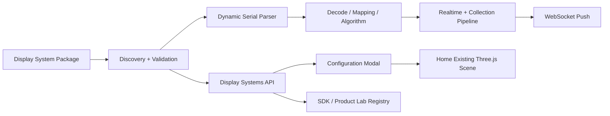
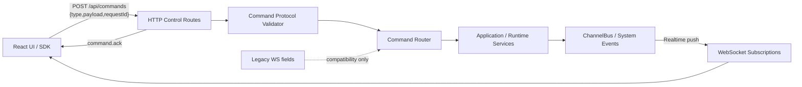

# 架构文档

> 最后更新于：2026-08-29

## 2026-08-29 `sensor.frame` 成为唯一传感器消息

用户确认不再保留旧 WebSocket 传感器消息格式。实时和回放的每一路传感器数据现在
都只发布一次，且 wire 上只有 `sensor.frame` schema v1：

```json
{
  "type": "sensor.frame",
  "schemaVersion": 1,
  "channelId": "human-body:left-arm",
  "displaySystemId": "human-body",
  "sensorId": "left-arm",
  "sensorType": "human-body",
  "outputChannel": "armLeft",
  "source": "realtime",
  "sequence": 1,
  "timestamp": 1234,
  "quality": "good",
  "payload": {
    "value": [],
    "stages": {
      "decoded": null,
      "normalized": null,
      "calibrated": null,
      "processed": [],
      "mapped": null
    },
    "metrics": {},
    "algorithmMetrics": {},
    "matrix": null,
    "orientation": null,
    "status": null,
    "temperature": null,
    "protocol": null,
    "history": null
  }
}
```

`channelId = displaySystemId:sensorId` 是订阅和消息身份，`outputChannel` 只是页面展示别名。
多个传感器不合并成一个大对象：它们在同一条 `19999` 连接上按各自 `channelId`
交错发送，各自维护 `sequence`，慢传感器不会阻塞快传感器。`GET /api/channels`
返回同一组规范身份，精确订阅不再使用 `sit/back/head/armLeft` 这类别名。


```mermaid
flowchart LR
  Device[多个物理传感器] --> Serial[SerialManager 多串口会话]
  Serial --> Parser[协议解码]
  Parser --> Runtime[线序 / 标定 / 算法]
  Runtime --> Storage[采集与历史存储]
  Runtime --> Gateway[sensor.frame 唯一封装]
  Storage --> Playback[回放帧]
  Playback --> Gateway
  Gateway --> WS[单 WebSocket :19999]
  WS --> Dispatch[按 channelId 订阅/分发]
  Dispatch --> Web[网页渲染]
```

网络边界已删除顶层 `sitData/backData/headData/*Data` 以及额外 `_pressure` 帧。现有主页为了
不与协议切换同时重写数十个 renderer，仅在浏览器进程内把规范帧适配为它的旧状态形状；
该适配不是公开消息格式。系统状态、授权与命令确认仍保持各自的低频对象。本轮没有修改
SDK 源码、Electron 固定入口、硬件协议、线序/标定或历史数据格式。
因本轮遵守“不改 SDK”边界，`/api/sdk/contract` 中的静态 telemetry 形状和默认 `sit`
订阅说明尚未升级，它不得被当作当前 `sensor.frame` wire 契约；这项需在后续 SDK 迁移中单独处理。

## 2026-08-29 WebSocket 控制面归位与目录收敛

`backend/kernel/platform/websocket/` 已从 10 个生产 JavaScript 文件收敛为 5 个，只保留共享
`19999` Server 的装配、心跳/JSON 解码、动态通道发布、订阅管理和连接入口。原先放在该目录的
通用命令路由与运行控制 handler 迁入 `platform/commands/`，历史差值与框选/曲线统计迁入
`kernel/playback/`，旧 handler 的运行态 accessor 适配迁入 `platform/runtime/`；心跳和 JSON
解析两个单一职责小文件合并为 `websocketTransportService.js`。

控制面和实时面现在按用途分开：串口、传感器、采集、回放控制、历史维护与 CSV 导出优先走
HTTP，WebSocket 负责实时订阅、压力/回放帧、系统事件和旧扁平命令兼容。JQBed 的
`get/set/resetJqbedAlgorithmConfig` 仍是当前前端唯一直接走旧 WebSocket 的控制例外；本轮没有
改变它的消息格式或时序，后续需先补等价 HTTP API 再迁移。

该次物理归位本身没有改变当时的业务 payload；同日后续已在用户确认后收敛为
本页上方的唯一 `sensor.frame` 契约。Electron 固定入口、SDK、硬件协议、线序/标定和历史格式
在两次修改中都未改变。

## 2026-08-28 单 WebSocket 端口与统一多串口编排

对照 `E:\shroom` 后确认，它的“多串口”并不是让多个设备共用一个 `SerialPort`，而是只创建
一份 `SerialManager`，再由该管理器维护多个物理串口会话；每个真实 COM 口仍必须有自己的
`SerialPort` 实例。`shroom1` 的 SDK 底层本来已经采用这一模型，本轮没有复制第二套 manager，
也没有修改 SDK。应用侧把之前同时存在于 `server.js` 和
`kernel/serial/serialPortOrchestrator.js` 的打开规则收回统一编排器：经典 `sit/back/head/sensor`
和 manifest 自定义角色都调用同一 manager，协议、波特率和 parser channel 继续由当前展示系统
manifest 决定。

动态角色的控制入口也不再依赖四角色枚举：HTTP `serial.open` / `serial.close` 以及通用
`/api/commands` 在应用后端把非旧角色适配为 `channelPorts` / `channelClose`，再进入同一串口
控制服务；角色未在当前 manifest 声明时返回 `INVALID_COMMAND`，不会猜协议或接受请求中的
临时波特率覆盖。动态角色关闭只接受当前 manifest 声明或 SerialManager 已登记的角色；切换
展示系统会关闭管理器中的全部物理串口并禁用旧角色重连。批量打开先完整校验全部角色，同步
失败时关闭本批已经启动的串口，避免只执行前半批。`seat` 仍归一化为 `sit`。旧四角色继续走
原 SDK 命令转换，SDK 文件本身未修改。

本轮只借鉴统一管理和统一编排边界，没有复制 `E:\shroom` 中按波特率猜设备类型、向设备发送
AT 指令读取标识、按固定帧长硬分支的实现。多个现有设备会共用相同波特率，直接照搬会误判设备，
还可能改变硬件协议和历史数据语义；自动扫描、协议探测、稳定打开重试和持久设备标识映射需在
录制帧与真机测试齐备后单独评审。

本地 Electron 后端的 WebSocket 从 `19999/19998/19997` 三个物理 Server 收敛为一个
`19999` Server。WebSocket 基础设施不再维护 `sit/back/head` 常量表或白名单；当前展示系统的
任意传感器身份由 manifest 和 SerialManager 已注册角色动态生成，例如新增 `armLeft`、
`armRight` 不需要再改后端通道代码。页面连接后默认订阅 `*`，接收所有规范
`sensor.frame`；精确订阅使用 `displaySystemId:sensorId`。系统状态、回放控制和授权事件仍使用
`main` scope。Electron 固定入口
`getWsServer(channel)` 与 SDK 地址保持不变，但任何仓外
旧客户端若仍直连 `19998/19997`，需要迁移到 `19999`。远端座椅 `23001` 和外部 CAN 页面
`29999` 是客户端连接的外部数据源，不是本地后端监听端口，本轮未改。

关闭流程现在只释放一次共享 WebSocket Server；`runtime.broadcastRealtime()` 保留公开签名，
内部改走订阅管理器、ChannelBus 和实时帧网关，避免单 Server 下绕过逻辑通道。新增测试锁定
单实例创建、单次关闭、默认通配订阅、`armLeft` 等动态精确订阅不串台/不重复投递、动态 HTTP
开关串口，以及自定义数据字段到规范 `sensor.frame` 的后端适配；同一
SerialManager 承接经典和 manifest 多路串口。未修改硬件协议、线序/点序、标定、历史数据格式、数据库结构、
Electron 固定入口或 SDK。

验证结果：后端 49 个测试文件、前端 31 个测试文件（384 项）、SDK 后端 smoke 10 项和前端
ESLint 均通过。尚未用真实多串口硬件验证同时连接，也未验证仓外旧客户端迁移；`build/` 与
`dist/` 本轮未重新生成。

## 2026-08-28 运行产物收拢与平台内部边界精简

根目录继续保留 `dist/`，它是安装包与更新清单构建产物，仍由 `.gitignore` 排除；
`build/`、`db/`、`pack-resources/`、`release-notes/` 和 `display-systems/` 也保持原位置。
开发态生成内容统一进入未跟踪的 `runtime/`：CSV 为 `runtime/exports/csv`、报告为
`runtime/exports/reports`、工具导出为 `runtime/exports/artifacts`、上传图片为 `runtime/uploads`，
日志和临时文件分别进入 `runtime/logs` 与 `runtime/temp`。Windows/macOS 打包态的 CSV、报告和
图片路径由回归测试锁定，未发生变化；11 个既有文件迁移前后逐个 SHA-256 一致。

无生产或测试引用的旧 `project/` 已移除：其中 15 个模型/纹理与正式资源逐个哈希相同，
其余 4 个旧原型引用不完整，仍可由 Git 历史恢复。`runtime/legacy/` 的人工串口/WebSocket
调试资料迁到 `test/manual/legacy-runtime/`，不再与运行产物混放。已有数据库、初始化库和
`dist/` 均未删除或移动。

同名目录的边界已经钉死：根 `runtime/` 是运行产物；`backend/runtime/index.js` 是不可变的
Electron 固定桥；`kernel/platform/runtime/` 是 server 进程状态源码；
`extension-host/runtime/` 是展示系统的通道规划、绑定和调度。平台运行态删除两个单调用方
工厂后由 9 个 JavaScript 文件减为 7 个；WebSocket 将串口命令纯转发、单调用方 server factory
和广播基础层收进真实调用方后由 13 个减为 10 个；共享端口只有 `SHARED_WEBSOCKET_PORT` 一个
常量，逻辑通道来自 manifest `outputChannel` 和 SerialManager 状态，不维护固定通道表。

`backend/extensions/`、`backend/extension-host/`、平台 runtime 与 WebSocket 均新增逐文件
职责说明。扩展宿主内部 factory 改为直接导入具体模块，并新增依赖边界测试，公共 `index.js`
出口保持不变。本轮没有修改 SDK、硬件协议、线序/点序/标定、历史数据格式、数据库结构、
Electron 固定入口或 WebSocket 消息/端口契约。

已知发布边界：当前 Electron Forge ignore 与 electron-builder `files` 规则没有显式排除根
`runtime/`。本轮遵守“生产/部署配置需人工确认”的规则，没有修改打包配置；下一次正式发版前
应单独确认加入 `runtime/**` 排除项，并检查 asar/安装包中不包含本机导出、报告或上传文件。

## 2026-08-28 扩展宿主分类与版本笔记单一来源

`backend/extension-host/` 的 JavaScript 文件均存在生产或测试调用，本轮不通过合并文件减少数字，
而是按变化原因重新分类。宿主根目录继续保留 `index.js` 与 `appRuntimeFactory.js` 两个稳定入口；
manifest 读取和校验、运行时发现和调度、用户工作区分别进入独立子目录。仅服务内置 legacy
传感器的 `sensorRuntimeRegistry.js` 回到 `backend/extensions/built-in-sensors/`，避免把扩展实现
误放在通用扩展宿主中。

```text
backend/extension-host/
├─ index.js                    # 统一公共出口，导出名保持不变
├─ appRuntimeFactory.js        # 应用装配入口，路径保持不变
├─ manifest/                   # manifest、文件校验、坐标与展示定义
├─ runtime/                    # 发现、规划、绑定、调度与帧处理
├─ workspace/                  # 用户展示系统工作区
└─ README.md
```

版本历史弹窗不再维护一份只到 `1.1.9` 的硬编码数组。Vite 在前端构建阶段通过
`import.meta.glob` 读取 `release-notes/windows/*.md`，由
`client/src/components/updater/releaseNoteHistory.js` 解析文件名版本、正文和语义版本顺序，
再把静态结果编译进网页；Electron 运行时无需访问仓库文件。文件名作为版本权威来源，因此
历史 Markdown 标题写错不会把条目归到错误版本，`1.1.33.md` 的已知标题错误也已修正。

这只修复应用内“版本历史”页面。自动更新弹窗仍取决于发布服务器 `latest.yml` 中的
`releaseNotes` 字段；现有 `1.1.35` 清单缺少该字段，而当前源码版本仍为 `1.1.34`。
统一 Windows 发版入口、校验版本、补 `1.1.35` 说明并重新上传同批安装包属于生产发布流程，
按高风险变更规则等待人工确认，本轮没有修改 `package.json`、打包脚本或线上文件。

用户确认迁移后，`.gitignore` 已覆盖 CSV、上传图片、报告、通用输出、运行时临时文件、
测试状态和本地 worktree 恢复目录。开发态导出已按类型收进 `runtime/exports/` 与
`runtime/uploads/`，既有文件逐个哈希验证；打包态路径保持不变。`dist/` 按要求保留根路径。

验证覆盖完整后端 45 个测试文件、SDK 后端 smoke 10 项、扩展宿主 12 组定向测试、版本笔记
解析 5 项测试、相关 JavaScript 语法与相对引用扫描，以及不写入仓库 `build/` 的前端生产构建。

## 2026-08-28 按产品变化边界收拢仓库目录

本轮不再按零散技术名词继续拆目录，而是按“稳定内核、扩展宿主、扩展实现、历史兼容”完成
后端物理收拢。`backend/` 的一级目录从 22 个缩减为 7 个，文件从 205 个缩减为 168 个；
35 个 SDK 转发壳和旧目录兼容壳被删除，不再同时维护新旧两套路由。

当前后端结构为：

```text
backend/
├─ common/logger.js              # Electron 固定日志桥
├─ runtime/index.js              # Electron 固定后端入口
├─ kernel/                       # 平台、串口装配、存储、回放、CSV、实时与算法通道
├─ extension-host/               # 展示系统发现、校验、绑定与调度
├─ extensions/                   # 内置传感器运行时与 manifest 示例
├─ compatibility/                # 必须保留的历史数据工具
└─ tests/                        # 后端回归测试
```

`kernel/` 下按真实职责分为 `platform/`、`serial/`、`storage/`、`playback/`、`csv/`、
`realtime/` 和 `algorithm-channel/`。Electron 仍固定加载 `backend/runtime/index.js` 与
`backend/common/logger.js`，因此这两个目录是稳定桥，不是未完成的散乱分类。

前端把人体展示集中到 `client/src/visualization/human-body/`，把展示系统 Builder、运行时 UI、
画布组件和 API 集中到 `client/src/extensions/display-system/`，把 JQBed 配置 UI 放到
`client/src/extensions/jqbed/`，历史演示页统一放到 `client/src/legacy/demos/`。原
`page/displaySystemBuilder/DisplaySystemBuilder.jsx` 继续作为稳定路由转发入口；`runtime/`、
`renderers/`、`displays/`、`services/ws/` 等包含单例或注册副作用的前端基础设施保持原位。

这次只整理物理位置和依赖方向，没有修改 Electron 稳定壳、SDK、串口协议、线序语义、标定、
数据库结构或历史数据格式。串口、协议、采集、存储与通用处理的可复用实现仍以
`sdk/backend/` 为单一来源，应用后端只负责装配和产品运行时，不复制第二套。
仓库分类详见 `docs/repository-map.md`；其中也明确记录：当前 `build/` 只是安装包随附的出厂离线网页，
在线下载后的 `current/previous/factory` 版本化缓存、完整性校验、原子切换和失败回滚尚未实现。

## 2026-08-28 Revise 产品能力语义合并

本次以 `codeOpi` 为稳定内核，把 `Revise` 作为产品能力来源进行语义合并。Electron 仍由
`app/electron/index.js` 负责桌面壳与进程编排，后端仍由 `backend/` 分层装配，串口继续通过
统一的多端口管理器工作；未用 Revise 的根目录 `index.js`、`server.js` 或固定
`port1/port2` 链路覆盖现有内核。

合并范围集中在人体现实数据与优化模型展示、相关模型和点位资源、渲染辅助与性能修复、
国际化和本地语音提示，以及可隔离的 JQBed 算法配置能力。带内容哈希的 `build/` 不做
逐文件拼接，而是由合并后的 `client/` 源码重新生成。

JQBed 动态参数沿 `jqbedAlgorithmConfig`（校验与原子持久化）→
`jqbedAlgorithmProtocol`（主 WebSocket 隔离命令）→ `petCareRuntimeService`（运行时能力探测）
→ Python `getData(data, config=None)` 传递。原生算法不声明新参数 ABI、健康探测失败或配置不可用时，
服务会继续调用旧的 `getData(data)`，因此配置扩展不会强制替换现有算法运行时。Python 源码只增加
可选参数适配，本次没有改动 Python 打包流程或重新生成稳定内核资源。

参数快照写入 `<runtimeWritableRoot>/jqbed-algorithm-config.json`：开发态对应项目根目录，打包态对应
Electron `userData`。该运行态文件不进入版本库；首次运行和重置都使用代码内同一组默认值，避免把
开发机某次调参结果带入安装包，也避免开发态与安装态出现不同默认行为。

为保持稳定边界，本次不修改 SDK 公共接口、Electron 主入口、数据库结构、历史数据格式、
授权与发证逻辑，也不接入 Revise 中可能改变硬件行为的串口探测和 12B 协议实现。这些能力
需要独立兼容性评审、回放样本和实机验证后再进入稳定内核。

## 2026-08-26 授权门户单文件 HTML 特效原型

新增 `client/public/shroom-vision-home-effects.html`，把当前 Shroom Vision 授权首页导出为不依赖 React、WebSocket、构建器或外部资源的单文件视觉原型。页面保留品牌头部、访问密钥、四组行业方案、反馈入口和响应式布局；18 张实际使用的图标按界面分辨率压缩后以 Data URL 内嵌，文件可脱离仓库直接打开。

特效边界集中在同一文件内：CSS 变量负责颜色和强度，`initPressureField()` 负责底部压力点阵，精确指针设备支持轻量卡片倾斜；`prefers-reduced-motion` 下关闭持续动画。静态稿不连接生产授权服务，按钮只派发 `shroom:enter` / `shroom:sdk-customize` 自定义事件并显示本地反馈，防止原型被误当成生产入口。

## 2026-08-25 仓库行尾钉死（`.gitattributes`）

仓库此前既没有 `.gitattributes`，`core.autocrlf` 又是 `false` —— 等于把行尾完全交给
签出时那台机器上的工具。结果是某个 Windows 侧工具把整个工作区重写成了 CRLF，`git`
把 **575 个文件**判成改动（`132740 insertions(+) / 132740 deletions(-)`），而
`git diff --ignore-cr-at-eol --name-only` 是 **0 个文件** —— 一个字符的内容差异都没有。

范围里有 [build/assets/](build/assets/) 的 70 个构建产物、[display-systems/](display-systems/)
的 11 份 manifest、[licenseManager.js](licenseManager.js) 和 [docs/](docs/) 全部文档。
这种改动一旦被 `git add -A` 提交进去，blame 就废了，而且必然和并行分支冲突。

只丢弃一次治不了本 —— 那个工具下次跑还会再来一遍。所以加
[.gitattributes](.gitattributes)：

- `* text=auto eol=lf` —— 文本/二进制由 git 按内容判定，判为文本的一律以 LF 签出。
  仓库里**没有任何被跟踪的 `.bat` / `.cmd` / `.ps1`**，不存在必须保留 CRLF 才能执行
  的脚本，所以这条没有例外。
- 显式 `binary` 一批（`png` / `jpg` / `ico` / `icns` / `glb` / `gltf` / `fbx` / `obj` /
  `db` / `bin` / `dat` / `so` / `pyd` / `pyc`）—— 即便 git 的自动判定失手也不许改写。
  `build/model` 下 137 MB 的模型和几份 GB 级 db 快照被改一个字节就废了。

**留了一个已知尾巴**：`forge.config.js` 是全仓唯一一个**索引里就存着 CRLF** 的文本
文件（`git ls-files --eol` 显示 `i/crlf w/crlf`）。它现在不脏（索引与工作区字节一致），
但下一次谁编辑它并 `git add`，会连带一整份 LF 归一化的差异。它属于打包/部署配置，
不在本次改动范围内，等要动它时单独一条提交归一化。

## 2026-08-11 前端渲染器独立目录

`sdk/frontend` 的五类渲染实现已从顶层 `core/<renderer>` 与 `react/<renderer>` 抽离到
`sdk/frontend/renderers/`。目录按功能纵向组织：每个渲染器同时拥有 `core/` 纯算法与
`react/` 画面实现；框选、点选、点精灵贴图和 WebGL 工具集中在 `renderers/shared/`。

```text
sdk/frontend/
├─ core/                    # 契约、注册表、帧总线、配色和跨渲染器算法
├─ react/                   # RendererHost 与 useSceneFrame
└─ renderers/
   ├─ numMatrix/            # 2D 数字、3D 数字及三个 backend
   ├─ pointGrid/            # 3D 点图
   ├─ handPoints/           # 手部模型与 3D 点云
   ├─ blobHeatmap/          # Canvas 热力图
   ├─ webglHeatmap/         # WebGL 热力图
   └─ shared/               # Three/WebGL 渲染专用工具
```

`renderers/index.js` 是新入口，只静态导出纯逻辑命名空间和注册函数，React 组件仍由
`builtins.js` 动态加载，因此构建产物继续保留五类独立 chunk。旧的
`@shroom/frontend/core/<renderer>`、`@shroom/frontend/react/<renderer>/*`、
`react/three/*` 和 `react/webgl/*` 由 `package.json#exports` 映射到新位置，旧消费者不用
立即改导入，仓库内也没有重复代理文件。

该目录可整体迁入另一个总 SDK，但宿主必须同时提供 `core/contract.js`、`core/registry.js`、
帧数学、配色、阈值和坐标布局等公共契约。完整边界写在
`sdk/frontend/renderers/README.md`。结构测试锁定五个纵向模块、旧目录移除和兼容导出；
当前验证为 SDK 470 条测试、裸 Node 32 项 smoke，以及文档站、独立 example、主前端三套
生产构建全部通过。

## 2026-08-11 SDK 数字矩阵文档配置闭环

`sdk/frontend/docs/#/num-matrix` 不再只展示写死预设。页面现在按“设置形状 → 设置一帧数据 →
立即预览”组织：坐标 JSON 使用 `rows × cols × [x, y]` 格式，复用
`buildCoordinatePointLayout()` 校验并自动推导矩阵行列；数据接受一维数组或二维矩阵，点数必须与
坐标点数一致。默认方向校验帧由 `createDirectionCheckFrame()` 生成 `1..N`，可在送入
`RendererHost` 前选择 90° 旋转、180° 旋转或水平/垂直镜像，原始数组本身不被修改。

该页面仍挂载包内真实的 `numMatrix`，没有维护第二套预览渲染器。文档 demo 新增可选
`params`、`values` 与 `floor` 入参；方向校验将历史下限临时设为 0，保证第 1 点不会被过滤。
坐标缩略图只用于确认首末点和物理形状，不参与压力统计、串口帧归一化、回放或下载。
纯变换收在 `docs/src/lib/matrixConfigurator.js`，`2×3` 基准测试锁定六种方向的 row-major
顺序。桌面与 390px 移动端均采用同一套控件，页面宽度不会被旧全屏画布撑开。

## 2026-08-10 第三轮渲染实现进包（批 4/4）：两条斑点热力 —— 五条渲染通路全部进包

批 1 搬 `canvas2d` 后端、批 2 搬 `webgl` 后端、批 3 搬新渲染器 `handPoints`。本节是
**批 4**，也是这一轮的收尾：`webgl/Canvas4096WebGL.jsx`（187，壳）+
`webgl/WebGL.HeatMap copy 2.js`（953，真 WebGL 绘制核）合成渲染器 **`webglHeatmap`**，
`heatmap/canvas.jsx`（460，Canvas 2D）成为 **`blobHeatmap`**。包里的渲染器从 3 个变 5 个，
**主应用的五条渲染通路至此全部在包里，`client/src` 侧只剩壳与一个私有渲染器的挂点**。

### 为什么这两条**不**合成一个渲染器的两个后端

这是本批唯一一处真正的设计判断，而且结论与批 2 相反。批 2 那两份（`Num2D` /
`Num2Doriginal`）合成了一个后端，因为逐行比对后 `Num2Doriginal ⊃ Num2D` —— 差异全是追加。
`numMatrix` 的三个后端能共存，也是因为它们**吃同一份参数、暴露同一组方法**，换后端不用改
任何调用代码。这两条热力不满足那个前提：

| | `webglHeatmap` | `blobHeatmap` |
| :--- | :--- | :--- |
| 画法 | GPU 两趟：斑点强度 → 色带合成 | Canvas 2D：按 `globalAlpha` 分桶叠圆 → 查表上色 |
| 配色 | 8 段 + sRGB gamma（`heatBlobs`） | 6 段线性渐变，1024 格调色板 |
| 对外方法 | 4 个（含 `changeColor`） | 3 个 |
| 帧长门槛 | `minFrameLength`，`bed4096` 是 **4096**，短帧整帧丢弃且不报错 | 无，非空即画 |
| 占 WebGL 上下文 | 占 | **不占**（全包唯一） |

硬合成一个 id 等于造一个「一半字段在这条通路上是死的」参数表，而契约审计是按渲染器 id
做的 —— 它连 `numMatrix` 的 per-backend 方法集都表达不了（那条限制批 2 已经记进积压），
再往里塞一组不重合的参数只会让审计更没意义。`builtins.test.js` 有两条断言钉住这个分界
（方法集各是哪几个、两条都只声明 `SIT`）。

### 契约一项没加 —— 这是批 1 预扩的兑现，而且必须由测试来证

批 1 往 `RENDERER_METHODS` 补的 10 个方法名里就有 `changeColor` 与 `bthClickHandle`，
本批要的全部命中，**`RENDERER_METHODS` / `RENDERER_CAPABILITIES` / `RENDERER_PROPS`
三个对象一个字都没动**。

这件事不能靠眼看确认：`registerRenderer` 对契约外的方法名是**静默拒绝** ——
`validateRendererDescriptor` 收集错误、返回 `false`、**不抛**（坏插件不该让应用起不来），
现象只是「这个展示形式一片空白」加控制台一行 `console.warn`。所以
`builtins.test.js` 那条「声明的方法名全部在契约里」现在遍历五个渲染器，
`listRegistrationFailures()` 必须为空。

### 第 8 条配色：GLSL 里的色带第一次有了 JS 侧的对应物

那条 8 段色带（黑→蓝→青蓝→绿→黄→橙→红）原先**只以 GLSL 的形式存在**，躺在
`WebGL.HeatMap copy 2.js` 的模板字符串里 —— 这就是之前 18 处配色合并时扫不到它的原因
（`grep "function jet"` 找不到模板字符串里的东西），画布配置器的配色下拉里也选不到。
现在它是 `core/colormaps.js` 的第 8 条 `heatBlobs`，着色器改成**从 `HEAT_BLOB_STOPS`
发码**，色卡 / 数值采样 / 出图同一个出处 —— 与批 2 处理第 19 份 jet 阶梯是同一个手法。

`sampleHeatBlobsRgb` 复现了 GLSL 最后那句 `pow(c * 1.5, 1/2.2)` gamma 与 GL 的输出夹取。
不复现的话，色卡与实际出图就是两个颜色，而文档站那一页上下就摆着这两样。
`COLORMAPS` 是**追加在末尾**的第八条，前七条顺序一个没动（画布配置器的下拉直接遍历它，
插在中间会让用户的下拉顺序变）；`client` 侧 `colormaps.test.js` 有一条断言钉住这个顺序。

⚠️ 照代码搬带来一个可见的怪相：原件写的是
`vec3 c7 = vec3(1.0, 0.0, 0.0); /* 1.00 -> #FF1E42 */` —— 注释说偏粉的红，代码是纯红，
和 `c6` 一模一样，于是最后 16% 是一段恒定色。**按代码搬**，改成注释里那个颜色是一次
看得见的画面变化，记进积压。

### 清掉的重复与死码

| 在哪 | 是什么 | 处理 |
| :--- | :--- | :--- |
| `WebGL.HeatMap copy 2.js` | 私有的**第二份** `addSide` / `interp` / `interpSmall`，与 `create_shader` / `create_program` | 前三个改用 `core/frameMath.js`，后两个改用批 2 建的 `react/webgl/glUtil.js` |
| 同上 | 模块级可变状态 `var tplCanvas = document.createElement(…)` 与 `var map = {}` | 违反契约第 2 条，提进实例作用域 |
| `Canvas4096WebGL.jsx` | rAF 无条件每帧重画，哪怕一帧数据都没来过 | 加 `dirty` 标志。静态画面像素完全相同，差别只在不再空烧 GPU |
| `heatmap/canvas.jsx` | 每帧算一整套插值 + 补边 + 高斯（`bigArr` → `bigArrs` → `bigArrg`），**结果从没被读过**（取数循环读的是原始 `arr`） | 整段删掉，逐像素相同。代价是 `sitValue` 六个键里那四个本来就只喂这段死运算 |
| 同上 | 无参空调用 `const value = jet()`；写死的 `new Array(1024).fill(0)`（与 `carCol` 的 10×9 = 90 对不上） | 前者删，后者按实际尺寸算 |
| `assets/util/heatmapRect.js` | 76 行，零引用 | 删 |

`assets/util/heatmap.js` 与 `components/onestep/heatmap.js` **不动** —— 它们是旧 video
场景组件的画图工具，不是展示形式。

### 一处「改了但不是逐像素等同」的行为差异，而且它修的是 bug

`heatmap/canvas.jsx` 有模块级 `var canvas, context, data, options, isShadow` 加一句
`document.getElementById('heatmapcanvas')`。同页挂两块会互相覆盖，更要命的是那句
`if (props.matrixName == 'carCol')` 改的是**模块级** `options` —— **挂过一次 `carCol`
之后，同一次会话里后面所有实例的满值阈值都变成 300**，画面偏色。改成 `useRef` +
每实例参数之后这个串味没了。**这是本轮四批里唯一一处不逐像素等同的差异。**

顺带把 1024 格调色板从「每次渲染重建」改成按参数记忆化建一次（查出来的像素完全相同，
`core/blobHeatmap/intensity.test.js` 有一条断言钉住 created / fills / reads 都是 1）。

### 壳的策略：一个留、一个留、一个删

沿用「只在真有引用方时留壳」的规矩，三个原路径三种处理：

- `webgl/WebGL.HeatMap copy 2.js` **留壳**。文件名带 "copy 2" 但它不是死码 ——
  `hand.jsx` / `humanBody.jsx` / `robotLCF.jsx` / `robotSY.jsx` 四个 video 场景组件与
  `Home.jsx` 还在直接 `new WebGLCanvas(...)`，这五处一行没改。
- `heatmap/canvas.jsx` 留一个 75 行的**适配壳**（导出 `buildBlobHeatmapParams` + `Heatmap`）。
- `webgl/Canvas4096WebGL.jsx` **删**，唯一 importer 是 `Home.jsx`。

`Home.jsx` 三个渲染点（两个 `<Canvas4096WebGL>` + 一个 `<Heatmap>`）换成 `RendererHost`。

### 文档站 10 → 12 页

补 `HandPoints.jsx` 与 `Heatmap.jsx`。后者一页放两个渲染器、两块各自 `?raw` 的源码，
正文就是上面那张「为什么不是同一个渲染器的两个后端」对照表。契约页 / 配色页 / 一览页
**一行没改** —— 它们从 `core` 读，第 8 条配色和新方法自己就出现了。`render-check.mjs`
数的是 `ROUTES.length`，所以那里也不用改。

`HandPoints.jsx` 刻意**只给缩放预览、不给可交互块**：手部点云的框选在批 3 里补活了，但
仍然没有任何调用方传 `changeSelectFlag`，`controlsFlag` 恒为真 —— 真机上框选照样不触发，
摆一块「可交互」的预览是假承诺。

### 对账

| 项 | 结果 |
| :--- | :--- |
| `sdk/frontend` vitest | 22 文件 / **443 例**全绿（批 3 结束时 320 例） |
| `smoke-core.mjs` | **32 项**（批 3 结束时 28 项） |
| `client` vitest | **214 例**全绿；`App.test.jsx` 整个 suite 失败是既有的（缺 `@testing-library/react`） |
| `client` eslint | 0 error / 56 warning（与基线同） |
| `docs` `npm run check` | **12 页**全部 SSR 渲染通过 |
| 护栏构建 | `WebglHeatmapRenderer` 3.81 kB、`BlobHeatmapRenderer` 5.04 kB、`blobs` 7.79 kB **三个都是独立懒加载 chunk**，无 `dynamic import will not move module into another chunk`；`build/model` 仍是 20 个 / 137M，`git status --short build/` 为 0 |

### 还欠的（真机手测，本地做不了）

`bed4096` 的两个 WebGL 热力渲染点；`heatmap` 形式下 `foot` / `carCol` / `jqbed` /
`petCare` / `hand` / back / sit。公共项：侧栏读数与两条曲线、阈值滑块，以及
**反复切 10 次展示形式看 WebGL 上下文不累积** —— 本轮占上下文的渲染器从 2 个变成 4 个
（`blobHeatmap` 不占），而五个渲染器的 dispose 仍然都没有 `forceContextLoss()`，这条比
以前更要紧。

### 边界

- **运行期渲染器插件通道仍然没有。** `load: () => import()` 是构建期解析的，所以这一轮
  四批解决的始终是「新项目消费这个包」，**不是「已装机的客户端运行期加渲染器」**。五个
  渲染器全搬完之后，这成了积压里最大的一条。
- **前端契约仍然没有版本号。** 本批一项没加，但上一批加了 11 项，而没有任何机制拦住谁
  哪天去删。
- 本批不动那批未提交的 `backend/**` → `sdk/backend/**` staged rename，提交按路径 stage。


## 2026-08-07 第三轮渲染实现进包（批 2/4）：`webgl` 后端 —— 两份 2063 行的实现合成一个

批 1 把 `canvas2d` 搬进包，跑通了扩契约 / 后端可选口子 / 留壳三件贯穿事项。本节是**批 2**：
`num/Num2D.jsx`（860）与 `num/Num2Doriginal.jsx`（1203）**合并成一个 `webgl` 后端**，
`BACKENDS` 从两条变三条，`numMatrix` 的预设从 6 条变 **24 条**。

### 结论先写：这两份不是「漂移 935 行」，是纯追加

上一轮 `ARCHITECTURE.md` 里写的是「后两份已漂移 935 行近乎全文，须先逐行 diff」。**逐行
diff 做完了，那个判断是错的**：两份的片元着色器只差 **18 行**，每一行都是 `Num2Doriginal`
在往上加东西（`u_mask` / `u_useMask` / `u_texScale` / 零值显白）。JS 侧同理 ——
`Num2Doriginal ⊃ Num2D`，多出来的是分区布局（`renderRobotWebGL` / `drawRobotOverlay` /
`buildRobotLayout`）、POT 纹理尺寸（`nextPOT`）和裸数据转置（`RAW_TRANSPOSE_MATRIX_TYPES`）。

所以不存在「保哪一半」的选择题：**全保，做成开关**。合并后是一个后端 + 一个 `variant`
参数（`plain` = 原 `Num2D`，`original` = 原 `Num2Doriginal`）+ 四个独立开关。

| 开关 | `plain` | `original` |
| :--- | :--- | :--- |
| `useMask` | 无 `u_mask` | 掩码外显白（分区布局的留白） |
| `texScale` | `v_texCoord` 直用 | `v_texCoord * u_texScale`（配合 POT） |
| `whiteOnZero` | 0 值走配色 | `value < 0.5` 直接输出白 |
| `potTexture` | 纹理尺寸 = 矩阵尺寸 | `nextPOT()`（WebGL 1.0 的 LUMINANCE 纹理在 NPOT 下会 `GL_INVALID_OPERATION`，画面全白） |

### 拆出来的四个 core 模块：着色器源码为什么算「纯逻辑」

| 新文件 | 内容 | 为什么在这一层 |
| :--- | :--- | :--- |
| `core/numMatrix/layouts.js` | 147 点手套两变体 / 60 点足底散布 + 插值 / POT 取整 / 方阵转置 / 格子边长 | 纯数组变换 |
| `core/numMatrix/robotLayouts.js` | 三套分区表 + `buildRobotFrame`（拼纹理 + 掩码） | 同上 |
| `core/numMatrix/shaders.js` | 顶点/片元着色器**源码字符串**生成，4 个变体 | **发的是字符串**，拿 `gl` 去编译它是 react 层的事 |
| `react/webgl/glUtil.js` | `createShader` / `createProgram` / 亮度纹理上传 / 资源释放 | 入参有 `WebGLRenderingContext`，属 DOM 侧 |

这条界线是有收益的、不是审美：`shaders.test.js`（16 例）能在**没有 GL 上下文**的裸 Node 里
逐行比对两份原实现的 GLSL；`smoke-core.mjs` 的第 8 段（5 项）也因此能直接断言四个变体
的源码内容。分层线仍是那句「有没有 React / three / DOM」。

### 干掉第 19 份 jet 阶梯

`Num2D.jsx:91-132` 与 `Num2Doriginal.jsx` 的片元着色器里各躺着一份 GLSL `jet1()`，断点
（0.25 / 0.5 / 0.75）与线性斜率和 `core/jetLadder.js` **完全一致**。之前 18 份合并时漏掉
它，是因为它在模板字符串里 —— `grep "function jet"` 扫不到。

修法不是再抄一遍，是新增 `glslJetLadder()`：**从 `jetLadder.js` 的断点数据发出那段 GLSL
源码**。阶梯仍然只有一个出处，`smoke-core.mjs` 断言生成的源码里含 `0.25` 来证明它确实是
发码而不是手抄。保留的唯一行为差异写在注释里：GLSL 在 `dv == 0.0` 时返回 `vec3(0,0,1)`，
而 JS 的 `jetRgb` 同样输入下 `g` 是 `NaN` —— 按 GLSL 那份发码，**画面零变化**。

### 四处「改了但可证明画面相同」

搬家的规矩是界面零变化，所以每一处偏离都得能证明：

1. **统一的 POT 步长上传循环**（`texData.fill(0)` + 两级循环）替代 `Num2D` 的线性循环 ——
   对 `plain` 变体逐像素相同，因为它每条喂数据的通路都满足 `len === texW * texH`。
2. **`u_useMask` 在建上下文时定死**，不再逐帧设 —— 一个上下文要么是分区布局要么不是，
   中途不会变。
3. **窗口 resize 时格子尺寸没变就不重建上下文**（原实现无条件重建）。
4. **`reportStats` 在 `changeWsData147` 顶部无条件调用** —— 原实现在几个分支里各调一次，
   合并后提到入口，等价且少三处重复。

### 一处**没有**修的已知怪相

`webgl` 后端**只画 jet，不认 `colormap`** —— 两份原实现都把 jet 写死在 GLSL 里。这一批
保留了这个行为（改它是看得见的画面变化，属于另一件事），但那段 GLSL 现在是发码出来的，
要支持任意配色改 `core/numMatrix/shaders.js` 一处即可。已记积压，README 的「边界」也写了。

同类保留还有一条写在预设注释里：`robot1` 走「数字」那条通路时热场是**空的**
（`Num2D.changeWsData147` 的 else 分支只处理足底，机器人帧只更新侧栏读数），
`webglNumDefault` 保持 `robot.enabled: false` 就复现了这个空白。

### 契约没动，但暴露了它的模型缺陷

批 1 已经把 10 个方法名补进 `RENDERER_METHODS`，其中 `changeWsData147R` 本来就在契约里
（`core/contract.js:58`），所以**这一批一个契约项都没加**。

但 `optionalMethods` 的纸糊性质在这批显形了：`numMatrix` 的 `methods` 现在是 15 个，
可选的 11 个 —— `canvas2d` 给 10 个、`webgl` 给 4 个（三个与 `canvas2d` 重名）、
`sprite3d` 一个都不给。**审计按渲染器 id 做，而暴露面按 `params.backend` 变**，结果是
走 `webgl` 时那 7 个只有 `canvas2d` 才有的方法也算「合法缺席」。`builtins.test.js` 现在
用两个后端 `commandNames` 的**并集**对账，并单独断言「重名的确实只有那三个」，至少保证
名单不漂。模型问题仍在积压。

### 壳的策略：这一批**没有**留壳

规矩是「只在原路径确实还有 importer 时留壳」。批 1 的 `NumWs.jsx` 留了 60 行适配组件，
是因为 `App.jsx` 的 `/3Dnum` 路由确实还在渲染 `<Num3D />`。这一批 grep 完确认：
`Num2D.jsx` / `Num2Doriginal.jsx` 的**唯一** importer 就是 `Home.jsx:77-78` 那两行，
换成 `RendererHost` 之后归零（`components/num/daliegu.jsx` 里那个 `Num2D` 是它自己的
局部同名量，不是这个文件）。所以两个文件**直接删**，2063 行 —— 顺带带走 `Num2D.jsx:5`
那行死的 `hand0509.png` import（**1.37 MB**，全文再无引用）。

同时清掉 `sdk/frontend/src/display/DisplayRegistry.js` 的 `VIEW_RENDERERS` 里两条失效
组件名字符串（`matrix: 'Num2D'` / `raw2d: 'Num2DOriginal'`），改成注册表 id `numMatrix`
—— 这条上一轮记成了积压，本批到期。

### 对账

SDK vitest 144 → **217**（`layouts` 25 / `shaders` 16 / `robotLayouts` 21 / `jetLadder` 10
＋三条改写），`smoke-core.mjs` 18 → **23**，client **211 passed**（`App.test.jsx` 那条既有
失败仍在），eslint **0 error**，docs check **10 页**，构建 12.23s **无 chunk 塌包 warning**，
Home chunk 925.61 → **883.49 kB**、`NumMatrixRenderer` 懒加载块 10.03 → **32.97 kB**
（正是那 2063 行从首屏挪进懒加载块的结果），`build/model` 20 个 / 137M 完好。

### 边界

- **界面零变化**，上面四处偏离逐条给了证明。真机手测（`num` / `numoriginal` 两条下的
  13 种矩阵，**重点是 `footVideo` 的单/双脚 1200ms TTL 布局探测器** —— 本轮唯一一处运行期
  状态机）本地做不了，仍欠。
- **`webgl` 后端只画 jet**，见上。
- **仍按视口而非按容器定尺寸** —— 新后端照抄了这个行为，`backends/webgl.js` 的 `bounds()`
  是将来改它时唯一要动的地方，注释已写明落点。
- 批 3（两份手部点云 `handPoints`）与批 4（两条热力图 + 文档站补两页）未动。

## 2026-08-06 第三轮渲染实现进包（批 1/4）：`numMatrix` 的第二个后端 `canvas2d`

前两轮把 `numMatrix`（三份 NumThreeColor，1568 行）和 `pointGrid`（953 行）搬进了
`@shroom/frontend`，但主应用里**还有约 5,300 行渲染实现没进包**：`num/NumWs.jsx`（517）、
`num/Num2D.jsx`（860）、`num/Num2Doriginal.jsx`（1203）、两份手部点云（993 + 1037）、
WebGL 热力图（187 + 953）、Canvas 斑点热力（460）。二开者装上包，拿到的只有精灵图数字
矩阵和三维点阵两种画法，其余仍然只能回主仓抄。这一轮分 4 批全搬，**每批单独提交**。
本节是**批 1**：`NumWs.jsx`（导出名 `Num3D`，其实是 Canvas 2D + CSS 透视，不是 WebGL）。

批 1 挑最小的那个，是为了先把三件贯穿四批的事跑通，而不是因为它最有价值。

### ① 扩契约：`RENDERER_METHODS` +10、`RENDERER_CAPABILITIES` +1

**这一步不做，后面三批一行代码都跑不起来。** `validateRendererDescriptor` 会过滤
`!(method in RENDERER_METHODS)`，命中就**返回 `false` 而不抛错** —— 坏插件不该让整个
应用起不来，代价是**注册失败时画面只是空白，控制台一条 warn 而已**。这批组件有 10 个
方法名不在契约里：`bthClickHandle` / `calibration` / `handZero` / `changeHandAngle` /
`drawContent` / `changeColor` / `changeType` / `changeBox` / `cancelSelect` /
`changaCamera`（**最后一个原拼写就少一个 e，照抄不改** —— 改它等于同时改 `Home.jsx`
的调用点，是另一件事）。`RENDERER_CAPABILITIES` 追加 `ARTICULATED`（关节/骨骼驱动的
布局），批 3 的 `handPoints` 是全仓唯一有这个能力的渲染器。

**`RENDERER_PROPS` 一个都没加** —— 往它加才是真正的 breaking：下游所有自研渲染器的
契约审计会立刻开始报「未实现」。往 `RENDERER_METHODS` 加是安全方向（删才危险）。
这条规矩写在 `sdk/frontend/README.md` 的「公开面」一节，本轮是它第一次被执行。

新增了一个可选描述符字段 **`optionalMethods`**，因为出现了契约模型没预料到的情况：
**`capabilities` / `methods` 是按渲染器 id 声明的，而 `numMatrix` 的暴露面是按后端变的**
—— `sprite3d` 4 个方法，`canvas2d` 14 个。`methods` 写并集（照常逐个校验在不在契约里），
`optionalMethods` 标出可以缺席的那十个，`auditRendererContract` 跳过它们，于是两个后端
的审计都干净。约束是**必须是 `methods` 的子集**（不在 `methods` 里的名字审计根本看不到），
不满足就注册失败。这是一层**纸糊**，不是修好：真正的模型问题（暴露面依赖后端）仍在积压。

### ② `NumMatrixRenderer.jsx` 必须动 —— 这是计划里写明要停下来汇报的一处

`BACKEND_FACTORIES` 那个扩展点的文件头注释写着「两个后端搬过来时只往这里加一行，本文件
其余部分不动」。**这句话不成立**：`canvas2d` 比 `sprite3d` 多三样东西 —— 10 个命令式方法、
自己算统计（`sprite3d` 的统计在壳里算）、以及要响应调参面板的实时改动。

没有顺手改，而是把后端契约**扩成三个通用可选口子**，`sprite3d` 一个都不实现、代码路径
一字未变：

| 新增 | 谁提供 | 干什么 |
| :--- | :--- | :--- |
| `commands` | 后端实例返回值上的一个对象 | 把后端自己的命令式方法透给壳的 `useImperativeHandle` |
| `factory.commandNames` | 挂在工厂函数上的数组 | 让 `builtins.js` 声明 `methods` 时不必静态 import 后端 |
| `applyTuning(changed)` | 后端实例上的可选方法 | 调参变更不重建场景 |
| `reportStats` | 工厂入参里多的一项回调 | 后端自己算完统计回吐给壳 |

`factory.commandNames` 是数组而 `builtins.js` 里那 10 个名字是**手抄的第二份** —— 这是
故意的：`builtins.js` 属于首屏，静态 import `backends/canvas2d.js` 会让懒加载 chunk
**静默塌回主包**（Rollup 只发 warning）。重复的代价用一条测试兜住：
`react/builtins.test.js` 断言 `optionalMethods` 与 `createCanvas2dMatrixBackend.commandNames`
**逐字相同**。这个文件还专门断言了「10 个方法名全在契约里」—— 因为漏一个的症状是白屏
加一行控制台日志，不是报错。

### ③ 壳只在真有引用方时留

`components/num/NumWs.jsx` **不能做成一行 re-export 壳**：`App.jsx:30` 为 `/3Dnum` 路由
懒加载它，渲染的是 `<Num3D />`，**一个 prop 都不传**。`export * from` 带不出 default，
且没有 params 会退回 sprite3d 默认值。所以它是一个 **约 60 行的适配组件**：把
`matrixName === 'carCol'` 映射成预设，其余转发给 `RendererHost`。517 → 60 行。

`Home.jsx` 两个渲染点（原 4684 / 4929）换成 `RendererHost` + `NUM_MATRIX_PRESETS.num3dDefault`，
`Home.jsx:80` 的静态 import 删掉（改走注册表懒加载）。

### 顺手删掉的三样死东西

- `insertInterpFlat`（NumWs:15，37 行）—— 计划里写的是「进 `core/numMatrix/pipeline.js`
  并补逐点测试」，实测**零调用点**，所以是删不是搬。同样零调用的还有 `pressData` /
  `interp` / `rotate90` 三个 import。
- `import hand from 'hand(1).png'`（**314 KB**）—— 全文再无引用。包里仍然只有 4.7KB 的
  `circle.png`。
- `client/src/assets/util/util.js` 的 `jetRound` 现在**零生产调用点**（只剩测试在引），
  因为 canvas2d 每个数字都走 `core/frameMath.js` 那份了。删它要连 `util.jet.test.js`
  一起动，记进积压。

### 一处「改了但可证明默认画面相同」的行为变化

两个 `Home.jsx` 渲染点现在传 `colormap={canvasColormap}`，而老的 `Num3D` **永远用 jet**。
`isClassicColormap(undefined)` 为真且 classic 是默认，所以默认渲染逐字节相同；差异只在
用户**显式选了别的配色**时出现 —— 那时 3D 数字会跟着变，和其余每一个 numMatrix 渲染点
的行为一致。这是对计划里「界面零变化」边界的一处**故意**的小偏离。

### 对账（每一项都跑过，不是估的）

| 检查 | 基线 | 现在 |
| :--- | :--- | :--- |
| `sdk/frontend` smoke（裸 Node） | 15 项 | **18 项** |
| `sdk/frontend` vitest | 131 例 / 6 文件 | **144 例 / 7 文件**（registry +1、新 `builtins.test.js` +7、pipeline +5） |
| `client` vitest | 211 passed | **211 passed**（`App.test.jsx` 那条既有失败仍在，缺 `@testing-library/react`） |
| `client` eslint | 0 error | **0 error**（触碰的文件 0 warning） |
| `docs npm run check` | 10 页 | **10 页**（数字矩阵页 8276 → 8869 字符，多了后端列） |
| build | — | 11.21s，**无 `dynamic import will not move module into another chunk`**；`NumMatrixRenderer` chunk 15.44 kB（canvas2d 在里面）；`build/model` 20 个 / 137M 完好 |

> ⚠️ `backend/tests/run-tests.js` **在开工前就是红的**（`Cannot find module '../common/logger'`），
> 原因是工作区有约 50 个未提交的 `backend/**` → `sdk/backend/**` staged rename —— 那是
> 并行进行中的后端 SDK 拆分，本轮一个字都不动，四次提交全部**按路径 stage**。

### 还欠的（批 1 的真机手测，本地做不了）

`num3D` 形式下手套四型 / `robot1` / `footVideo`：数字出不出、视角旋转
（`changePointRotation` / `changeGroupRotate`）、`reset` / `setFrontView`，外加
`/3Dnum` 路由（它现在走新的适配壳）。

### 批 2–4 的边界（未做）

`BACKENDS` 现在是 `['sprite3d', 'canvas2d']`，**webgl 后端还没搬**。批 1-B 的
`glslJetLadder()`（第 19 份 jet 阶梯，藏在着色器模板字符串里所以之前 18 份合并时漏了）
**推到批 2** —— 消费它的着色器那时才落地，提前加就是一段没人调的死码。

## 2026-08-04 渲染器层拆成可安装的前端 SDK 包（第一轮：core + numMatrix + 可跑 demo）

目标消费者是**新项目的开发者**：`npm i` 之后能起一个小 demo、看到画面。做这件事之前做不到 ——
渲染器层锁在 `client/src/` 里，没有包边界。

### 先说一个必须知道的事实：这件事已经做过一次，而且分叉了

`sdk/frontend/` 早就存在（8 文件 / 1091 行），但 `package.json` 只有
`{ type: "module", private: true }` —— **没有 `name`，装不了**；`client/src` 里 grep
`from '...sdk'` 为空，`vite.config.js` 也没有 sdk 别名，**主应用一行没接**；唯一消费者是
`backend/tests/sdk/frontendDisplayRegistry.test.js`（后端测试在测一个前端不用的模块）。
它立项时（2026-06-11）写的初衷是「为后续拆出 `Home.jsx` 的 `matrixName` 渲染分支提供注册表
基础」，而**那件事后来是在 `client/src/renderers/` 做的，不在 SDK 里**。

分叉的根因是**它是一份平行副本，没人 import**。所以本轮第一原则：**搬，不抄。** 每个搬走的
模块在原路径留一行 re-export 壳，`client/src` 的 import 一行不改 —— 这是 `util.js` re-export
`jetRgb` 已经验证过的做法。

### 分层线：有没有 React / three / DOM

这条线不是审美，它同时决定**谁能消费**和**能不能在裸 Node 里加载**。`pipeline.js` 能做 785 点
逐点比对正因为它是纯的；同一个性质让它能进零依赖层。一个性质两个收益。

| 入口 | 内容 | 依赖 |
| :--- | :--- | :--- |
| `@shroom/frontend` | 传输 / 帧存储 / 展示系统定义，**并全量转出 `core`** | 无 |
| `@shroom/frontend/core` | 契约、注册表、帧管线、配色、阈值、坐标布局（14 文件） | 无 |
| `@shroom/frontend/react` | `RendererHost`、`useSceneFrame`、`builtins`、`numMatrix` | peer: react ≥18 + three ≥0.127 |
| `@shroom/frontend/styles/canvas.css` | 6 行 | 无 |

**根出口刻意不含 `react/`** —— 一旦含了，`SensorClient` 的裸 Node 消费者（后端测试里就有一个）
连 import 都做不到。**`builtins.js` 必须在 react 层而不是 core**：它的
`load: () => import('...NumMatrixRenderer.jsx')` 会拉进 JSX，放 core 里就毁掉「裸 Node 可加载」。
**`react/index.js` 刻意不静态导出 `NumMatrixRenderer`** —— 那会把懒加载 chunk 塌回主包，
要取它走 `loadRenderer('numMatrix')`。**`three` 的 peer 范围必须宽到 `>=0.127`**，主应用 pin 的是
`^0.127.0`（2021 年的版本），写 `^0.170` 会让主应用装不上。

### 拆包新增的三件必做事，漏一件就崩

| 事 | 漏了会怎样 |
| :--- | :--- |
| `client/vite.config.js` 加 `resolve.dedupe: ['react','react-dom','three']` | symlink 的真实路径向上找 node_modules 走到仓库根，**那里既没 react 也没 three** —— 包内裸 import 解析不到；就算解析到也是第二份，两份 React 让 hooks 直接崩、两份 three 让 `instanceof THREE.Xxx` 全部失效 |
| 混淆器 `exclude` 补 `sdk/frontend` 整目录 | symlink 解析后的真实路径**匹配不上 `node_modules/**`**，`stringArray`/`splitStrings` 会改写 `import()` 的路径字面量，Rollup 无法静态分析，**懒加载 chunk 塌回主包** |
| `core/` 里每条相对 import 都写 `.js` 扩展名、不在模块顶层读 `localStorage` | 打包器和 vitest 都会补扩展名、都有 localStorage 垫片，所以**单元测试证明不了这条**；表现是「在 client 里跑得好，装到新项目里就崩」 |

第三条由新增的 `sdk/frontend/scripts/smoke-core.mjs` 守着 —— **裸 Node、无垫片、无打包器**
import 整个 `core/` 并跑通 12 项主要通路。它是包边界的守卫，不是补充测试。

### 搬了什么

`core/` 14 个文件（`contract` / `registry` / `frameBus` / `sceneFrame` / `colormaps` /
`jetLadder` / `displayThresholds` / `coordinatePointLayout` / `bed4096numParams` /
`numMatrix/{params,pipeline}` + 两个 barrel），`react/` 5 个（`RendererHost.jsx` /
`useSceneFrame.js` / `builtins.js` / `numMatrix/NumMatrixRenderer.jsx` /
`numMatrix/backends/sprite3d.js`），`styles/canvas.css`（scss → 普通 css，SDK 不能假设消费者装了
sass）。

**新建 `core/frameMath.js`** 收三个纯函数：`util.js` 1440 行里的 `findMax`（7 行）与 `jet`（20 行）、
`line.js` 的 `press`（51 行，自足，不用 `rotate`/`findMax`）。原位改成 re-export，**80 多个消费者的
导入路径与对外接口不变**，并配一条身份断言 `expect(jet).toBe(jetFromSdk)` —— 没有它，将来有人
图省事在 `util.js` 里再写一份函数体，不会有任何测试失败。唯一的行为变化：`press` 那句每帧
`console.log(colArr)` 在搬过去的那份里去掉了，返回值逐字节相同。

`client/src` 留了 **13 个 re-export 壳**，按引用方数量排：`runtime/displayThresholds.js`（52）、
`displaySystem/colormaps.js`（8）、`assets/util/bed4096numParams.js`（5）、
`coordinatePointLayout.js` / `jetLadder.js` / `frameBus.js` / `sceneFrame.js`（各 3）等。

**`RendererHost.jsx` 是唯一不能做纯壳的一个。** `Home.jsx` 直接 import `RendererHost` 与
`registry`，从不经过 `renderers/index.js`，所以纯转发会让只有 SDK 那份 `builtins` 跑过、
`pointGrid` 没人注册 —— `matCol` / `carCol` 静默失效。它改成薄包装：转发组件与两个审计函数，
并在模块加载时调一次本地 `registerBuiltinRenderers()`（现在只剩 `pointGrid`）。

### 从零装 tarball 查出一处越界（记进积压，本轮不修）

`src/client/commands.js` 第一行是 `import schema from '../../../../shared/commandSchema.json'` ——
四级向上，**跑出了包的根目录**。仓库里（`file:` / `npm link`）它解析到 `<repo>/shared/`，所以主应用
和 demo 都正常；tarball 装出来之后四级向上是 `node_modules/`，**整个根 barrel 在 import 时就抛**。

| 入口 | `file:` / monorepo | tarball |
| :--- | :---: | :---: |
| `/core`（含全部子路径）、`/styles` | ✓ | ✓ |
| `/react` | ✓ | ✓（需打包器，裸 Node 认不了 `.jsx`） |
| 根出口（含 `SensorClient`） | ✓ | ✗ |

这是拆包**之前**就存在的问题（`src/client/` 本轮按计划没动），暴露出来是因为加了「从零装 tarball」
这一步验证 —— 这也说明为什么这一步值得加。真正的修法是一个**归属决定不是一行补丁**：
`shared/commandSchema.json` 有 5 个消费者（两个 backend contracts、两个 client services、这里），
得先定「这份契约归后端还是归 SDK」。渲染器那条路（`/core` + `/react`）不受影响。

### 验证

| 项 | 结果 |
| :--- | :--- |
| `cd sdk/frontend/example && npm i && npm run dev` | **画面出来** —— 32×32 数字矩阵 + 游动高斯斑，控制台零 error / 零 warning / 零失败请求 |
| 三个控件（7 条配色下拉 / `size` / `decimalScale`） | 逐个切过都生效；**连切 5 次 canvas 数始终 1**，WebGL 上下文不累积 |
| 「连真后端」开关（后端没起） | 状态栏「已断开（退回合成帧）」，画面继续跑合成帧 |
| 用例对账 | client 221 passed / 11 套件（`App.test.jsx` 是既有失败）+ SDK 121 passed / 5 文件 = **342 = 341 基线 + 1 条新增身份断言** |
| `node sdk/frontend/scripts/smoke-core.mjs` | 12 / 12 |
| `cd backend && node tests/run-tests.js` | 38 / 38，含 `frontendDisplayRegistry` 与 `displayProfileRuntime`（后者经新壳做裸 Node ESM 加载） |
| `npm pack` | 32 文件 / 66.5 kB，含 `core/ react/ styles/ src/ scripts/`，**无 `example/`、无 `*.test.js`** |
| `npx eslint src --max-warnings=0` | 0 error，65 条既有 warning，改动过的文件里 0 条 |
| `npx vite build --outDir ../tmp/build-check` | 通过；`build/model` 仍 20 个 / 137M，`git status build/` 0 行；`NumMatrixRenderer` 与 `PointGridRenderer` 都仍是独立懒加载 chunk（混淆器 exclude 生效的证据） |

### 边界

- **界面零变化。** 本轮是搬家 + 加包装。真机手测清单（9 项，含 `matCol`/`carCol` 与 52 个
  `displayThresholds` 引用方）见 `plans/` 里的本轮计划，**尚未在设备上跑过**。
- **不搬 pointGrid**（`PointGridRenderer` 633 + `params` 186 + `pipeline` 74）、`SelectionHelper`、
  `threeUtil1` —— 它们额外拖进框选 / 点位拾取 / 视角旋转的手测项，第二轮。
- **不动 `sdk/frontend/src/{client,store,display}/`。** `DisplayRegistry` 管「展示系统」（设备定义），
  渲染器注册表管「把一帧画出来的实现」，两者合法共存。它的 `VIEW_RENDERERS` 里 `'Num2D'` /
  `'Num2DOriginal'` 是失效的组件名字符串（那两个组件已参数化进 `numMatrix`），只在 manifest 没写
  `view.renderer` 时兜底，不影响在跑的通路 —— 记进积压，README 已写明。
- **不删任何文件**，搬走的原路径全留壳。**不 `npm publish`**，`private: true` 保留。
- **`sideEffects` 刻意不写进 package.json** —— 一份写错的安全名单会让打包器丢掉模块加载时的注册
  副作用，收益（边际的 tree-shaking）远小于风险。
- **前端契约仍然没有版本号。** 这是拆 SDK 比内部收敛多出来的真实成本：后端有
  `SDK_CONTRACT_VERSION = '2026-07-14'` 与「纯追加不升版本」的规矩，前端 `RENDERER_PROPS` /
  `RENDERER_METHODS` 一个都没有。本轮不定版本策略，但 README 已写明「这两个对象是公开面，
  改它是 breaking change」—— 否则下次往里补一个 prop（像上轮补 `colormap` / `coordinateMap`）
  就会静默破坏下游。
- **渲染器是构建期解析的**（`load: () => import()` 由打包器静态分析），所以**装机之后加不了新渲染器**。
  二开的两条路里本包解决的是「新项目消费」，不是「装机后插件化」—— 后者仍在积压。

## 2026-08-04 合并数字矩阵渲染器（二）：接线、六个渲染点收成三处、−7 文件 / −8685 行

上一节把三份 `NumThreeColor` 证明成同一个渲染器并搬进了 `renderers/numMatrix/`，但**没有接线** ——
`Home.jsx` 仍静态 import 那三份原文件，新渲染器只有注册表和测试在用它。所以那一轮的成果用户
看不到，二开的人打开 `components/three/` 看到的还是三份拷贝。这一节把线接上并删掉旧文件。

### 接线前先修掉一处自己引入的发散

`params.js` 的 `smallBed12B` 预设写了 `textureValueMax: 2550`，**与原实现不符**。原式子是
`props.textureValueMax || (decimalScale > 1 ? valuej1 * decimalScale : 255)`，而 grep 全仓确认
**没有任何调用方传过 `textureValueMax` 这个 prop** —— 所以它走的一直是右边那支（默认 200×10 = 2000）
并且 `valuej` 变化时跟着重烘纹理。写死 2550 会改掉 `classicTint` 的分母：数值 1000 原本映射到
r = 0.5，写死后成 0.39，是 smallBed12B 上**看得出来的配色变化**。

这一处是在动手接线前核对预设出处时查出来的，不是测试报出来的 —— `pipeline.test.js:339` 当时
断言的正是 `toBe(2550)`，等于把发散钉住了。等价性测试只能证「实现符合基准」，基准本身抄错
它看不出来，所以搬运常量时逐个回查出处这一步省不掉。现在预设不设该项（0 = 自动），
参数仍保留给 manifest 显式锁量程用，测试改断言 0 并写明原因。

### 六个渲染点收成三处

| 位置 | 原来 | 现在 |
| :--- | :--- | :--- |
| `numoriginal` + `bed4096num` | `<Fast256 size={1}>` | `params={{ ...fast256, size: 1 }}`，`64/size` 推出 64×64 |
| manifest / hand / minzhen / smallBed | `<Fast1024 matrixName matrixWidth matrixHeight manageSidebar>` | `buildNumMatrixParams(matrixName, definition)` |
| `fast256` / `normalFast` / `fast1024` / `fast1024sit` **四条分支** | 四个 `matrixName == 'xxx' ?` 三元 | 一张 `NUM_MATRIX_SCENES` 表 + 一条分支 |

第三行那四条里，`normalFast` 与 `fast1024` **原本是两个完全相同的分支**指向同一份文件。收成表之后
加一种数字矩阵只需在表里加一行，这也是后面懒加载 54 个场景组件的前置条件 —— 三元链没法按需 import。

**`manageSidebar` 是这一步唯一容易错的地方。** 原守卫是
`props.manageSidebar !== false && props.matrixName !== 'minzhen'`（`NumThreeColor1024.jsx:167`），
**两个条件的 AND**，而 `Home.jsx` 只传了前者、后者藏在组件内部。渲染器参数化后不再认识
`matrixName`，所以 minzhen 那一项必须在调用点折进 `manageSidebar`：漏掉的话 minzhen 的侧栏会被
渲染器和外层同时回写。同理 `smallBed12B` 的三处 `matrixName` 分支（`getDecimalScale` /
`getPressureChartPadding` / 合力取 max）折成「基础预设取 `smallBed12B`」一件事。

`gridWidth` / `gridHeight` 只在 manifest 那一路有值，缺省 0 让渲染器退回 `64 / size`，与原实现的
`matrixWidth > 0 ? matrixWidth : 64 / size` 一致。`colormap` 与 `coordinateMap` 仍走 props 而不是
params（前者是用户在画布配置器里的实时选择，后者是数据），由 `RendererHost` 的 `...contractProps`
原样透传；配色变化由渲染器自己的 `colormapKey` 进 `useEffect` 依赖重建场景，**不需要外层再给 key**。

### 顺带补上已有 manifest 分支漏掉的两个 prop

`Home.jsx` 那条已经跑在生产上的 manifest `RendererHost` 分支**没有传 `colormap` 与 `coordinateMap`**。
今天没人踩到是因为它只服务 `pointGrid`，而 `pointGrid` 两项都不读；接线后一个声明 `numMatrix` 的
manifest 会静默丢掉配色与坐标表。补齐后两条分支一致。

### 删除

| 删除 | 行数 | 理由 |
| :--- | ---: | :--- |
| `three/NumThreeColor copy.jsx` | 515 | 被 `numMatrix` 的 `fast256` 预设替代 |
| `three/NumThreeColor1024.jsx` | 611 | 被 `fast1024` / `smallBed12B` 预设替代 |
| `three/NumThreeColor1024sit.jsx` | 442 | 被 `fast1024sit` 预设替代 |
| `page/home/Home.jsx.bak` | 3870 | 死文件，最后改动 `bbabe07`（2026-03-25） |
| `components/title/Title.jsx.bak` | 1690 | 同上 |
| `components/num/Num2Doriginal.jsx.bak2` | 1089 | 同上 |
| `components/num/NumWs.jsx.bak` | 468 | 同上 |
| **合计** | **8685** | **−7 文件** |

4 个 `.bak` 全部已入库，删掉可从 git 恢复；它们对二开的人是纯噪音（`Home.jsx.bak` 里还留着
三份 `NumThreeColor` 的 import 和五个 `<FastNNN>` 渲染点，全文搜索会把人引到死代码上）。
另外 7 个文件名带 " copy" 的**都是活文件**（生产代码起了误导性的名字），一个都没动。

### 边界

- **界面零变化**，第 0 步那次修正正是为了保住这一点。手测清单见 `plans/` 里的本轮计划。
- **不搬 canvas2d / webgl 两个后端**（`num/NumWs.jsx` 517 行、`num/Num2D.jsx` 860 行、
  `num/Num2Doriginal.jsx` 1203 行）。它们没有基准测试，且后两份已漂移 935 行近乎全文，
  必须先逐行 diff 判断哪些差异是有意的。`BACKENDS = ['sprite3d']` 与那条「待接 canvas2d」的注释原样保留。
- **只收 numMatrix 那 4 个分支**，三元链其余部分与 `components/three/4096`（`Bed4096`）没动。
- Home chunk 943 kB → 925.61 kB，`NumMatrixRenderer` 成为 10.03 kB 的独立懒加载块。
  减得少是因为三份原文件的体量主要在 three.js 共享依赖里，真正的收益是懒加载入口从此存在。

## 2026-08-04 合并数字矩阵渲染器（一）：三份 NumThreeColor 是同一个渲染器，证明它

### 结论先写：它们的布局公式代数等价

`components/three/` 下三份 NumThreeColor（Fast256 / Fast1024 / Fast1024sit，共 1568 行（抽掉 jet 与阈值块前是 1701 行））逐行比对后的结论比预想的乐观：**不是三套算法，是同一套算法的三种写法**。

| 文件 | 位置公式（原文逐字） | 化简 | 格子尺寸 |
| :--- | :--- | :--- | :--- |
| `NumThreeColor copy`（size=4） | `(x - (32/size - 0.5)) / 32 * size` | `(x - 7.5) × 0.125` | `0.032*size` = 0.128 |
| `NumThreeColor1024`（通用） | `(x - (gw-1)/2) * worldCellSize`，`worldCellSize = 2/max(gw,gh)` | 同上 | `worldCellSize * 1.024` |
| `NumThreeColor1024sit`（grid 23） | `(x - (23/2 - 0.5)) / (23/2)` | `(x - 11) × 2/23` | `2.048/23` |

通用式 `(x - (gw-1)/2) * 2/max(gw,gh)` 三份都满足；格子尺寸三个写法逐位相同。**这个「代数等价」不是断言，是算出来的**：`numMatrix/pipeline.test.js` 把三份的位置公式**逐字抄成参照实现**（带行号引用），在 16×16 的 256 点与 23×23 的 529 点上**逐点比对，共 785 次**。容差取 `toBeCloseTo(..., 12)` —— 三个写法只差乘除顺序，可能差 1 ulp，而 1e-12 在 `[-1,1]` 的世界坐标里远低于一个像素。

参照实现刻意写成「抄」的样子而不是复用 `pipeline.js` —— 这条是 `pointGrid/pipeline.test.js` 立下的规矩：两边共享同一份代码，测试就退化成自我验证。

### 真实差异只有五个开关

| 差异 | 只有谁不一样 | 收成什么参数 |
| :--- | :--- | :--- |
| 画布边长占视口高度 | 1024sit 是 0.5 / 0.65，另两份 0.6 / 0.8 | `canvasHeightRatio` |
| 分压重分配 `press(...)` | **只有** 1024sit 启用，另两份注释掉了 | `pressureRedistribution` |
| 阈值变化重烘精灵图 | 1024sit 的纹理写死 `jet(0, 30)`，**拖颜色滑块画面不动** | `retintOnThresholdChange: false` |
| 滚轮缩放 / 拖拽平移 | 1024sit 没装 | `cameraControls` |
| 阈值对象是否共享 | `copy` 用 `bed4096numParams` 那个模块级单例 | `sharedTuningKey: 'bed4096'` |

第三条是**照抄的 quirk 不是修好的 bug**：1024sit 上颜色滑块无效，参数化后仍然无效，要不要修单独决定。第五条是 Fast256 与 Bed4096「切换展示形式时调参不重置」的来源，写成声明式的键而不是让外层传对象进来 —— 后者没法在 manifest 里表达。

另有四个按 `matrixName` 字符串写死的分支一并改成声明式，二开的人加一个矩阵名不必再回来改渲染器：`getDecimalScale('smallBed12B') → 10` ⇒ `decimalScale`、`getPressureChartPadding('smallBed12B') → 5` ⇒ `chartPadding`、`matrixName === 'smallBed12B' ? max : press` ⇒ `totalMetric`、`matrixName !== 'minzhen'` 才回写侧栏 ⇒ `manageSidebar`。这四个值就是第四条预设 `smallBed12B`。

### 三层切分，为的是另两个后端不用重写这一层

```
NumMatrixRenderer.jsx   阈值来源、侧栏统计、命令式接口   ← 与画法无关
backends/sprite3d.js    three.js 精灵图 InstancedMesh    ← 只管画
pipeline.js             纯帧运算                          ← 可测
```

`BACKEND_FACTORIES` 现在只有一个条目，标的是扩展点：`canvas2d`（`num/NumWs.jsx`）与 `webgl`（`num/Num2D.jsx` + `Num2Doriginal.jsx`）搬过来时只加一行。`params.js` 的 `backend` 填了未知值**退回 `sprite3d` 而不报错** —— 手写 manifest 拼错后端名时，看到画面出来比看到白屏更容易发现自己写错了。

### 搬运时修掉的五处结构问题（都不是顺手优化，都是多实例/卸载的硬伤）

1. **模块级状态收进实例。** 原文件的 `ndata1` / `animationRequestId` / `materialRef` 是模块级，两个实例互相踩。
2. **顶点属性建一次、每帧只置 `needsUpdate`。** 原实现在**逐实例循环体内**调 `geometry.setAttribute(..., new THREE.InstancedBufferAttribute(...))`，1024 点 × 60fps ≈ 每秒 12 万个临时对象。
3. **实例矩阵只算一次。** 原实现每帧重跑 `setMatrixAt` 却从不置 `instanceMatrix.needsUpdate`，那批计算根本没到 GPU —— 每帧白算。
4. **卸载真的释放**（geometry / material / texture / renderer / 监听器）。浏览器活跃 WebGL 上下文上限约 16 个，反复切换展示形式会撞上。
5. **容器由 props 注入**，不再 `document.querySelector('.canvasNum')`；峰值读数走 `peakRef` 而不是 `.maxNum` 全局选择器（两个实例才不会写到同一个 div）。仍然直接改 DOM 不进 state —— 那是 60Hz 的读数。

另有三处小订正：`clampTextureValue` 现在总是生效（1024sit 用的是裸 `data[i]`，越界即取到错格）；`Math.max(...res)` 换成单趟 `findPeak` 循环（65536 点时展开参数会爆栈）；删掉每帧的 `console.log('分压')` 与一个建了却从未 append 的 `Stats` 面板。

**片元着色器里的 `pow(color * 1.5, 1/2.2)` 原样保留** —— 它不是标准 sRGB（多乘了 1.5），但它就是用户现在看到的亮度。

### 契约补了两项，都是既有事实不是新口子

`RENDERER_METHODS` 加 `changeWsDataRaw: 11`。它一度被 `validateRendererDescriptor` 判成「契约外方法」，根因是**那张计数表只统计了 `Home.jsx`，漏掉了 `page/home/util.js`** —— 后者那 5,564 行里的 `that.com.current?.changeWsDataRaw(...)` 用的是同一个 ref（`that` 就是 Home 实例），只是调用点写在 util.js 侧，共 11 处，而 Home.jsx 侧 0 处。按契约自己写明的规则（「取的是暴露面的并集而非当前调用点的集合」）它本就该在表里。补这一项时没有回头重算其余各项，所以那些数字现在应当读作「至少这么多次」，文件头已注明。

`RENDERER_PROPS` 加 `colormap` 与 `coordinateMap`。契约写着「不得引入契约之外的 prop」，而这两个是既有的事实约定：`ManifestDisplayRenderer.jsx` 早就在透传，`hand.jsx` / `NumThreeColor1024.jsx` 早就在读，`RendererHost` 通过 `...contractProps` 原样转发。与其留一处静默偏离，不如把约定写进契约。

### 边界

**这一节写完时还没有接线**，`Home.jsx:21-23` 仍静态 import 三份 `NumThreeColor` —— 等价性证完与换 `RendererHost` 分成两件事走。接线在同一天完成，见下一节「合并数字矩阵渲染器（二）」。

## 2026-08-03 串口协议预设库：10 份协议文档 + 6 份可加载预设 + 用户可扩展目录

### 为什么不是新发明一套格式

需求是「输出几份串口协议文档，让系统能直接按它读，用户不用点太多设置」。动手前先确认了一件事：
**协议的声明格式早就存在** —— `backend/displaySystems/displaySystemProtocol.js` 定义的
`baudRate` / `framing` / `decoding` / `validation` 四段，`serialParserManager.createParserFromProtocol()`
直接消费它。所以预设库存的就是那四段的原文，一份预设的 `protocol` 块可以整段粘进
`display-system.json` 而不需要任何转换，`validateProtocolConfig()` 也就是预设的校验器 ——
没有第二套 schema、没有第二个校验实现。

### 十份协议，六份能完整声明

从运行时源码里逐个挖出来的协议是 **10 种**（不是最初估的 9 种，第 10 种是 bigBed 的 1025 字节分片帧）：

| 协议 | 状态 | 说明 |
| :--- | :--- | :--- |
| `standard-1024` | ✅ 有预设 | `AA 55 03 99` 分隔，1024 × uint8，1000000 baud，32×32 |
| `small-bed-12b` | ✅ 有预设 | `AA 00 55 00 03 00 99 00` 分隔，1024 × uint16LE，1500000 baud |
| `bed-4096` | ✅ 有预设 | 与标准帧**同一个分隔符**，靠 4096 点帧长区分，3000000 baud |
| `matrix-256` | ✅ 有预设 | 256 × uint8，921600 baud，16×16 |
| `low-density-72` / `low-density-144` | ✅ 有预设 | 72 / 144 × uint8，矩阵形状不由协议决定（`matrix: null`） |
| bigBed 1025 字节分片 | ⚠️ 只有文档 | 单片能声明，但一片只有半张矩阵 —— schema 没有跨帧拼装 |
| 手套整包 274 / 手套 262 | ⚠️ 只有文档 | 帧里是「压力区 + IMU 区」混合，`decoding` 只能声明**一种** valueType |
| 手套双包 | ❌ 只有文档 | 两个串口两个包对拼成一只手 |
| minzhen 文本协议 | ❌ 只有文档 | 文本行协议，schema 只有二进制入口 |

**刻意不给 ⚠️/❌ 那四种发预设。** bigBed 单片技术上声明得出来，但选中它会静默得到半张矩阵，
这正是「宁可没有，也不要半成品预设」的那种情况；三个 schema 缺口逐条写在各自的 md 里
（`## schema 缺口` 段），写明缺什么、要加什么才能补上，而不是含糊地说「暂不支持」。

**`low-density-72-144` 拆成了两份 JSON。** 原计划一份文件覆盖两种点数，但一份 JSON 只能有
一个 `valueCount`，所以是两份预设共用一份 md。

### 预设从哪来：内置 + 用户目录，同 id 用户赢

```
backend/serial/protocols/*.json          内置，跟着安装包走
<runtimeWritableRoot>/serial-protocols/*.json   用户自己丢的，打包之后也能加
```

后者是这一轮对「打包之后能二开」的直接贡献：改一个波特率、加一种自研传感器的协议，
放一份 JSON 进可写目录就行，不需要构建工具链，也不用改源码。三条健壮性规则写进了 loader
和测试：目录不存在**不是错误**（用户目录默认就不存在）；一个 JSON 写坏**只影响它自己**
（带着原因进 `invalid`，其余预设照常返回）；`readdirSync` 抛异常降级成一条 `invalid`，不炸整次加载。

### 两条出口：HTTP 接口和「新建传感器」的模板卡片

`GET /api/serial/protocols` 返回 `{protocols, invalid, directories}` —— `directories` 也返回，
因为用户排错时第一个问题就是「系统到底在哪找预设」。`GET /api/sdk/contract` 里同步加了
`serial.protocolPresets` 摘要（只有 id/label/summary/doc，**不含** `protocol` 段：contract 是能力
快照不是数据源）。

真正让「不用点太多设置」落地的是第二条出口：**Builder 的模板卡片改为由预设库喂**。
`buildDisplaySystemBuilderCatalog()` 原来硬编码 3 份 `serialTemplates`，现在接受
`serialProtocolPresets` 参数，把每份预设翻译成 Builder 表单的扁平字段
（`framingType` / `delimiter` 十六进制串 / `dataBits` / `bytesPerValue`）。前端**一行没改** ——
`DisplaySystemBuilder.jsx` 早就有 `serialTemplate` 卡片和 `applySerialTemplate`，
卡片从 3 张变 9 张，选中即把 `protocol` 段填好。

三处必须说明的翻译细节：

1. **同 id 时预设覆盖内置模板**，与 loader 里「用户预设覆盖内置预设」同一套规则；三份内置模板
   id 一个都没删，旧 manifest 的 `metadata.builder.serialTemplate` 仍然找得到自己。
2. **`bytesPerValue` 走宽度表，不靠 `valueType.includes('16')` 猜** —— 为此从
   `displaySystemProtocol.js` 导出了 `PROTOCOL_VALUE_TYPE_WIDTHS`。猜的写法遇到
   uint32/float32 会把定长帧长算成一半。
3. **波特率档位并进预设用的值** —— 大床的 3000000 原来不在 7 个固定档位里，不并进去的话选中
   预设后波特率下拉框会显示成一个没有对应选项的裸数字。

`dataBits` 只有 8/12 两档（前端是写死的 `Segmented`），所以四字节类型在界面上会显示成
8 Bit —— 帧长由 `bytesPerValue` 决定所以算得对，但显示口径是现有组件的表达能力上限。

### 依赖方向

`displaySystems` 层**不反向依赖 `serial` 层**：`buildDisplaySystemBuilderCatalog()` 收一个纯数组，
读文件的事在 `appRuntimeFactory` 做（它本来就知道 `runtimeWritableRoot`），并且
`getCatalog()` 每次调用都重新读一遍 —— 用户丢完 JSON 刷新页面就能看到，不用重启服务。
预设目录路径只在 `appRuntimeFactory` 拼一次，HTTP 层从 `appRuntime.serialProtocolDirectories`
取，避免两处拼法漂移。

## 2026-08-03 行为修正：采集计时改成真正的秒表，不再用帧数推算

### 原来那个式子是什么意思，为什么站不住

Title 上「采集/停止」后面那个数字，原来是 `client/src/page/home/Home.jsx` 里的
`this.title.current?.changeNum(num / 12 * hz)`。三个量各自是：

| 量 | 来源 | 真实含义 |
| :--- | :--- | :--- |
| `num` | 模块级变量，每收到一帧 `sitData` 就 `num++`；`colValueFlag` 为假时归 0 | **收到的实时帧数**，不是秒 |
| `hz` | 模块级变量默认 12，由 `jsonObject.hz` 覆盖；后端那头是 `colHZ`（`sit1024FrameProcessor.js` 等处随帧下发） | **用户设定的采集频率**，默认 12（`backend/services/collection/collectionService.js` 的 `DEFAULT_COLLECTION_FREQUENCY_HZ`），并非传感器帧率 |
| `12` | 写死的常量 | 「传感器每秒推 12 帧」这个**假设** |

所以原意是：`num / 12` 当成「过了几秒」，再 `× hz` 换成「按采集频率算这几秒该入库多少行」。
显示时套一层 `Math.ceil`（`components/title/Title.jsx` 的采集按钮）。

站不住的地方在那个 12：实时下发**根本不限频**，
`backend/services/realtime/frameOutputPipelineService.js` 的 `publishSit/Back/Head` 每帧都
`publishRealtimeChannel`，`num` 的增长速率就是传感器真实帧率；而真实帧率这份代码自己就在量
（`wsData` 里的 `realHz = realHzFrameCount * 1000 / 间隔`，还显示在界面上）。正确的除数一直在手边，
式子里用的却是常量 12。真实帧率一旦不是 12，这个数既不是秒也不是入库行数，偏差正好是
`realHz / 12` 倍 —— 100Hz 的传感器上秒表快 8 倍多。

### 修法：记时间戳，定时器驱动

靠帧数推算是错的路子：帧率会抖、会丢帧、串口卡一下就少算。改成记开始时刻、按墙上时间算，
与帧率和采集频率都无关。计时的起停挂在 `Home.jsx` 的 `setColValueFlag` 上 —— 它是采集开关的
唯一入口（`Title.jsx` 的 `startCollectionWithOptions` 传 true、`stopCollection` 传 false）：

- 新增 `startCollectionTimer()`：记 `colStartAt = Date.now()`，先 `changeNum(0)`，再挂一个 1 秒
  `setInterval` 写 `Math.floor((Date.now() - colStartAt) / 1000)`。
- 新增 `stopCollectionTimer()`：清 interval，**不清零显示** —— 与改动前一致（以前停止采集只把
  `num` 归 0、并不调 `changeNum`，数字停在最后一个值上，正好能看到这次采了多久）。
- `componentWillUnmount` 里补 `stopCollectionTimer()`，避免往已卸载的 ref 上写。

两个必须点明的实现细节：

1. **必须用定时器，不能再蹭帧。** 没有帧进来（串口卡住、传感器没数据）时秒表也该照走 ——
   这正是旧实现做不到的另一半。
2. **传给 `changeNum` 的是取整后的整数秒。** `Title.jsx` 显示时套 `Math.ceil`，而 `setInterval`
   有几毫秒漂移，直接传 `1.003` 会被 ceil 成 2、第一秒就跳到 2。先 `Math.floor` 成整数，
   `Math.ceil` 就成了空操作。

顺带删掉了 `ws1Data` 里的第二个计数器（`isCar(matrixName) && !sitFlag` 时 `changeNum(num)`，
显示帧数、无 `/12*hz`，走靠背通道）。上一节说过「不动它」，这次改变主意的理由是它和坐垫那个写的是
**同一个 `changeNum` 槽位**：秒表接管之后两者会互相盖写，车类传感器上数字会在秒数和帧数之间跳。
删掉后这个数字全局统一由秒表驱动。模块级 `num` 至此在 `Home.jsx` 内已无引用，一并移除
（函数内那些同名的 `let num` 是局部累加变量，与此无关）。

### 本节的明确边界

- **这是有意的语义变化，不是等价改造**：那个数字从「按 12Hz 假设折算出的行数估算」变成了
  **真实经过秒数**。默认 12Hz、真实帧率恰好也是 12 的场景下两者读数接近，其它场景会明显不同。
- **没改 `Title.jsx` 的显示与文案**（仍是 `Math.ceil(this.state.num)`，仍不带单位）。
- **没动 `client/src/page/home/util.js` 里那 8 个 `changeNum(num)`**：那些点显示的是帧数，且该文件
  的第三份 `colValueFlag` 自 `e0c637a`（2026-03-23）起从未被置真，整段是死代码，仍挂账。
- **没动 `hz` / `colHZ` 本身**：采集频率该怎么用（限流入库）没变，只是不再被拿去当计时乘数。
- `client/src/page/home/HomeFun.jsx` 全仓无人 import（死文件），未跟着改。

### 验证

客户端 `npx vitest run` → 303 passed / 15 suites（`App.test.jsx` 为既有失败套件，缺
`@testing-library/react`，非本次引入）；`npx eslint src/page/home/Home.jsx` 干净；
`npx vite build --outDir ../tmp/build-check --emptyOutDir` 通过（17.08s），
`build/model` 137MB / 20 个 fbx 未被触碰，`git status --short build/` 为 0。

## 2026-08-03 缺陷修复：显示系统传感器的采集计时数字不动（本次重构引入的回归）

### 现象与定位

新建显示系统传感器、点开始采集之后，Title 上「停止」后面那个数字一直是 0 不变
（它是采集计时，旧传感器上是正常走的）。

`Home.jsx` 的 `wsData` 里有一处**提前 return**：manifest 类型的展示形式先交给
`handleManifestSceneFrame`，处理掉或帧带 `displaySystemId` 就 `return` —— 旧场景不能
消费带身份的帧，这个 return 本身是对的。问题是采集计数那段代码原来在 `realHz` 统计旁边、
**在这个 return 之后**，于是 manifest 帧永远走不到，`num` 不增、`changeNum` 不调。

**这是本次重构谱系引入的回归**，不是历史遗留：`git show` 逐个提交比对，
`6710e5e`（2026-07-21）还没有这个提前 return，`42773c4`（渲染器插件化那次提交）起才有。

### 修法

把计数那段提到 return 之前，两条路径共用同一份计数，旧位置删掉（避免重复计数）。
计时是全局采集状态，跟画谁、怎么画无关，本来就不该待在旧场景的处理链里。

**只提计数，没有把 `if (jsonObject.hz != null)` 那段一起提上来** —— 不需要：带 `hz` 的是
纯配置消息，不含压力数据，`hasPressureFrame` 为假，走不到那个 return，`hz` 照样能更新。
`num` / `colValueFlag` / `hz` 三个都是模块级变量（`Home.jsx:392` / `:400` / `:838`），
提前引用没有作用域问题；`this.state.matrixName != 'car10'` 守卫原样保留。

### 顺手查明但**没有**修的两处

1. **`page/home/util.js:116` 有第三份 `colValueFlag`，全文件没有一处给它赋 true。**
   该文件里 8 个 `changeNum` 调用点因此全是死代码。这份是模块级私有变量，
   `Title` 的 `setColValueFlag` 只接到 `Home.jsx:3942` 和 `HomeFun.jsx:124` 两份上。
   `git log -S` 显示这行自 `e0c637a`（2026-03-23）起就没被赋过值 —— **历史遗留，不是本次引入**，
   而且要修得先弄清那 8 个调用点分别服务哪个 matrixName，超出本次范围，挂账。
2. **`ws1Data` 里第二个计数器**（`Home.jsx:2619`，`isCar(matrixName) && !sitFlag` 时
   `changeNum(num)`，注意**没有** `/12*hz`）走的是靠背通道，与显示系统无关，原样不动。

### 本节的明确边界

- **没有改那个 `num / 12 * hz` 公式**。它是否真的等于秒数是另一个问题（`hz` 默认 12 时
  它就等于帧数），这次只恢复「数字会动」，不重新设计计时语义。
- **没有动提前 return 本身**，也没有动 `handleManifestSceneFrame`。
- **没有修上面挂账的那两处。**

## 2026-08-03 缺陷修复：采集开关在新帧管线里没人读，串口一通就落库

### 现象与定位

现场现象是两条：新建传感器接上串口后连报三次 `database or disk space is insufficient`；
以及**没有点开始采集，数据库文件却一直在变大**。两条是同一个根因。

`backend/services/collection/collectionFrameStorageService.js` 的 `canStore()` 原来只问两件事
—— 采集频率限流、磁盘剩余空间 —— **唯独没问采集开关开没开**。而它的调用方
`frameOutputPipelineService` 的 `publishSit` / `publishBack` / `publishHead` 是**实时下发路径**，
每帧都会走到，于是实际语义变成「串口一有数据就落库」。

对照老路径 `backend/sensors/runtime/legacySerialFrameRuntime.js` 写的是
`ctx.flag && ctx.shouldStoreCollectionFrame(...) && ctx.hasEnoughCollectionDiskSpace()`
—— `ctx.flag` 打头。新管线迁移时把这个条件漏了。定位时的决定性证据是一次 grep：
**全仓 `getCollectionState('flag')` 的读取处为零**，这个开关只有人写、没有人读。

### 三个连带缺陷，一起修

1. **采集开关没人读**（主因）。`canStore()` 补 `isCollecting?.()` 并排在最前，
   由 `framePipelineFactory` 从 `server.js` 注入 `() => Boolean(getCollectionState('flag'))`。
2. **磁盘满时停不下来**。`stopCollectionForStorageError` 执行的
   `setCollectionState('flag', false)` 以前停不住任何东西（没人读 flag），所以报了错还在写。
   第 1 条修完这条急停链路自动接通 —— 它一直是**设计好了但没接上**的。
3. **磁盘守卫每秒漏 999 毫秒**。`createCollectionDiskSpaceGuard.hasEnoughSpace()` 在
   1000ms 节流窗口内直接 `return true`，等于空间真不够时每秒只有第一帧被拦住。
   改成窗口内沿用上次结果（新增 `lastResult`）。**代价写明**：空间腾出来后最多要等一个
   检查周期（1 秒）才恢复入库 —— 比漏写划算。回调仍只在真正检查的那一次触发，
   所以日志不会被刷屏（现场那「三条」正对应三秒）。

「探测不到剩余空间时按够处理」的原语义保留：`statfs` 不可用时不该把采集停了。

### 测试

- `backend/tests/server/framePipelineFactory.test.js` 加回归段：`collecting = false` 时
  三个通道 `store*` 全返回 `false` 且入库队列长度不变。
- `backend/tests/collection/collectionDiskSpaceGuard.test.js`（新建，此前该守卫**零覆盖**）：
  空间充足/不足/探测失败三条分支 + 节流窗口内不许放行 + 回调只触发一次。
  不注入假 fs（`getDirectoryFreeBytes` 内部用默认 `require('fs')`，注不进去），
  改用真实目录配 `minFreeBytes: 0` 与 `Number.MAX_SAFE_INTEGER` 两个极端阈值驱动分支，
  这样不依赖跑测试的机器上还剩多少空间。

两条新测试都**先拿 HEAD 的旧实现跑过一遍确认会失败**（旧实现下 `storeSit` 返回 `true`、
节流窗口内放行），不是写完就算。后端 35 → 36 个测试文件全通过。

### 本节的明确边界

- **没有改采集频率、降采样、入库队列批量策略**，只补条件判断。
- **没有改 `COLLECTION_MIN_FREE_BYTES`（2GB）这个阈值**，也没有改它的
  `SHROOM_MIN_COLLECTION_FREE_BYTES` 环境变量覆盖口。
- **没有动 `legacySerialFrameRuntime` 的老路径** —— 它本来就是对的，这次是拿它当基准。
- 磁盘本身满了是运维问题，不在代码修复范围。

## 2026-08-03 横切共用层（二）：47 个阈值声明块收成一个 store

### 这一块是「55 份复制粘贴」的正主

`renderers/pointGrid/PointGridRenderer.jsx` 的文件头点名过一个根因，指的就是它：54 个文件顶部都有同一段模块级声明，形状逐字如下（抄自 `three/hand.jsx:40-51`）：

```js
var valuej1 = localStorage.getItem('carValuej') ? JSON.parse(localStorage.getItem('carValuej')) : 200,
  valueg1 = localStorage.getItem('carValueg') ? JSON.parse(localStorage.getItem('carValueg')) : 2,
  … 一共 12 行 …
```

**47 个可解析的声明块 / 2206 个读写点。** 现在收进 `client/src/runtime/displayThresholds.js` 一个模块，六个键（`carValuej` / `carValueg` / `carValue` / `carValuel` / `carValuef` / `carValueInit`）在全仓只有这一个读取出口。

### 消费方式是解构，不是取对象 —— 这是刻意的

```js
var { valuej1, valueg1, value1, valuel1, valuef1, valuelInit1,
      valuej2, valueg2, value2, valuel2, valuef2, valuelInit2 }
  = createThresholdState(DUAL_CHANNEL_DEFAULTS);
```

解构出来的是**普通局部绑定**，所以每个文件里那个 `sitValue(prop)` 照样能 `valuej1 = prop.valuej` 直接改，**2206 个读写点一个字都没动**。改成 `t.valuej1` 那种「更干净」的写法，就得动 2206 处没有任何测试覆盖的 legacy 代码 —— 风险和这一步的收益不成比例。`sitValue` 里 `if (prop.valuej)` 那个真值守卫（**传 0 会被忽略**）也因此原样保留，它是个 quirk，但改它属于修 bug，不属于抽公共层。

### 计划里的「模块加载时读一次存快照」是错的，没有照做

动手前先数了一遍作用域，发现 47 个块**并不统一**：

- **23 个在模块顶层** —— 所有实例共享，冻结在该模块被 import 的时刻；
- **24 个在 `React.forwardRef((props, refs) => {` 的函数体内** —— 本来就是每实例、每次挂载重读。

共享快照对**两种**作用域都不等价：函数内那 24 个今天切走再切回会拿到新阈值，模块顶层那 23 个因为场景是懒加载的、「改完阈值再切到一个还没加载过的展示形式」也会读到新值。一个模块级快照会把两者一起冻结在**第一个消费者**加载的时刻。所以实现成 `createThresholdState()` 里现读 —— 调用点就是原来的声明处，时机逐字相同。这条有测试守着（`displayThresholds.test.js` 的「每次调用都现读 localStorage，不用模块级共享快照」）。

**作用域一律保持原样**：原来模块级共享的仍是共享，原来每实例的仍是每实例。把那 23 个也改成每实例需要 `stateRef`（见 `PointGridRenderer` 的 `createTuningState`），那是各文件被改写成渲染器时顺带做的事。

### 默认值按变量名给，因为通道之间都能不一样

计划里说「默认值不统一是最容易踩的坑」，实际比预想的更深 —— **六个键全都有离群值**，不是只有 `carValuej`：

| 键 | 默认值分布 |
| :--- | :--- |
| `carValuej` | 200 ×84、335 ×2、255 ×2、600 ×1、2655 ×1 |
| `carValueg` | 2 ×86、3.6 ×2、4 ×1、3.3 ×1 |
| `carValue` | 2 ×87、2.1 ×1、2.08 ×1 |
| `carValuel` | 2 ×88、4 ×1、1 ×1 |
| `carValuef` | 2 ×89、**0** ×1 |
| `carValueInit` | 2 ×87、2000 ×2、2001 ×1、500 ×1 |

而且 `three/wholeChair.jsx` 的**两个通道默认值不对称**（`valueg1` 是 4 而 `valueg2` 是 2、`value1` 是 2.1 而 `value2` 是 2、`valuel1` 是 1 而 `valuel2` 是 2）。所以默认值按**变量名**给（`valueg1` / `valueg2` 各是一条），不能按 localStorage 键给 —— 按键给的话这三处会被静默改掉首屏表现，而且不会有任何测试失败。

`carValuef` 的那个 **0** 是同类陷阱的另一面：它是个真实默认值，不是「没设」，不能让它回落到 2。

三条预设 `DUAL_CHANNEL_DEFAULTS`（37 份）/ `SINGLE_CHANNEL_DEFAULTS`（7 份）/ `SECOND_CHANNEL_DEFAULTS`（2 份），三个离群文件用 `{ ...DUAL_CHANNEL_DEFAULTS, valuej1: 335, … }` 覆盖。

### 只有后缀 2 的那两个文件

`three/4096.jsx` 与 `three/NumThreeColor copy.jsx` 只声明 `value*2`。它们的后缀 1 侧不是本地变量，而是 `assets/util/bed4096numParams.js` 那个**共享调参对象**（文件里以 `const p = bed4096numParams` 别名出现），为的是「Bed4096 与 Fast256 切换模式时调参不重置」。所以 `bed4096numParams` 这个模块留着 —— 它的价值不在读取（读取已经收走了），而在那个**模块级单例**语义：两个模式拿到同一个引用。各自 `createThresholdState()` 就会各读各的，正是这里要避免的。

### 四个手工改的消费方

脚本批量换了 39 个块，剩下四处形状特殊，手工改：

- **`three/Short.jsx`** —— 块中间**夹着一行 `ymax1`**（读 `ymax` 键，不属于这六个），拆出来单放。通道 1 走的是 `2655 / 3.3 / 2.08 / 4 / 0`（与 `util.js` 的 `initValue` 同源），通道 2 才是 200 / 2。
- **`heatmap/canvas.jsx`** —— 没有 `valuej1` 变量，同一个 `carValuej` 键在这里读成了 `options.max`，**默认值 600**（全仓唯一）。另外四个阈值和 `canvas, context` 挤在同一条 `var` 里。
- **`page/home/HomeFun.jsx`** —— 六个 `useState(localStorage.getItem(...))` 初值。`useState(x)` 只在首帧用这个 x，但表达式每帧都求值，原来是每帧 12 次 `getItem`，现在一次调用读六个键。
- **`assets/util/util.js` 的 `initValue`** —— 全仓第三份读取。它的 `valuelInit1` 默认 **500**，与别处都不同；后面四个键（`valueMult` / `compen` / `press` / `ymax1`）不是这六个阈值，另有主人，原样留着。

`PointGridRenderer.jsx` 自己那份 `readStoredNumber` + `createTuningState` 也一并删了 —— 那份实现就是这个 store 的原型，现在改成直接调，行为逐字相同。store 里 `globalThis.localStorage?.` 这个写法也是从它那儿继承的，为的是能在非浏览器环境被导入。

### 与老写法唯一的两处差异：坏数据不再让页面打不开

老写法 `getItem(k) ? JSON.parse(getItem(k)) : d` 有两个真实缺陷，测试里是**证出来的**而不是断言的：

- `getItem` 返回 `"abc"` → **在模块加载期抛异常**，整个页面打不开（`expect(() => legacyDualBlock()).toThrow()`）；
- 返回 `"null"` → 把 `null` 当阈值用（`expect(legacyDualBlock().valuej1).toBe(null)`）。

新实现 try/catch + `Number.isFinite` 判定，这两种情况回落默认值。**正常值逐字相同 —— 包括 `"0"`**（非空字符串为真，老写法取到 0 而不是默认值，这个 quirk 保留了）。

### 本节的明确边界

- **只收「启动时的初值从哪来」。** 写入侧不动：`Title.jsx` 的滑块 `setItem` 之后走 `pushSitBack(...)` → 各文件的 `sitValue(prop)` 直接改内存绑定，不重读 localStorage。
- **不动 2206 个读写点，不动 `sitValue` 的真值守卫。**
- **不改任何块的作用域。**
- **`carValuePress` 不在这一刀里。** 它是第七个键，只在 `demo/` 9 个文件里出现（各两处：模块级声明 + 函数内重读），形状和这六个一样但主人不同，挂账。

## 2026-08-03 横切共用层（一）：18 份 jet 收成一条阶梯

### 为什么先做这个

上一轮把 `matCol` / `carCol` 合成了 `pointGrid` 的两条预设，但那只解决了「同源组件」。盘点前端渲染方式时冒出来的数字更要紧：**9 种互不相干的渲染机制，只有 2 种有声明式契约**，而「在格子里画一个数字」这件事有 **4 套毫不相干的实现**。

直接去合那 4 套实现是走不通的 —— 它们代码量里将近一半是同一批横切重复件（`jet` / 阈值块 / `layoutData` / 高斯模糊），不先抽掉，合并的 diff 里就分不清哪些是真实差异。所以顺序定成**先抽横切共用层，再合数字渲染器**。共用层这一步的好处是对全部 9 种渲染方式立刻生效，不只服务数字矩阵这一路。

| 横切重复件 | 份数 | 状态 |
| :--- | ---: | :--- |
| `function jet(min, max, x)` | 18 | ✅ 本节 |
| 模块级六键阈值块 + `sitValue` | 51 个文件 / 180 处读取 | 待做 |
| `layoutData(dataArr)` | 8 | 待做 |
| `boxesForGauss` / `gaussBlur_2` / `boxBlur_2` | 5 | 待做 |

### 18 份不是同一个函数，是一条阶梯 + 四个出口

按空白与注释归一化后取 md5，18 份分成四组 —— **它们的分支阶梯逐字节相同，差异全在最后的取整与返回形状上**：

| 出口 | 份数 | 返回 |
| :--- | ---: | :--- |
| `jet` | 14（util.js 自己 + `demo/` 9 个 + `NumThreeColor` 3 个 + `num/Num` + `foot/Num32DetectLocal`） | `parseInt(255 * r + '')` 整数三元组 |
| `jetRgba` | 2（`heatmap/canvas.jsx`、`onestep/heatmap.js`） | 不取整，且多一个写死的 `rgba[3] = 1` |
| `jetRound` | 1（`num/NumWs.jsx`） | `Math.round`，且 `dv === 0` 时返回白 |
| `jetRgb` | 1（util.js 自己） | 就是那条阶梯，0..1 浮点分量 |

**计划里原本要新建的 `jetUnit` 是多余的** —— `assets/util/util.js` 早就有 `jetRgb`，分支结构与 `jet` 逐字相同，只是不取整。所以最终形态是**已有的 `jetRgb` 当唯一阶梯，上面挂三个薄出口**，没有新增第四个函数。阶梯本体后来因为一条运行时约束搬去了 `assets/util/jetLadder.js`（见下文「阶梯为什么不在 util.js 里」），`util.js` 原样 re-export，对外的导入路径没变。

`num/Num.jsx` 与 `foot/Num32DetectLocal.jsx` 写的是 `parseInt(255 * r)`（少个 `+ ''`），理论上等价 —— 但那是推理不是事实，所以在测试里单列一份基准和 `jet` 一起比。

### 三个出口的差异刻意全部保留

`Math.round(178.5) = 179` 而 `parseInt(178.5) = 178`，差 1/255 肉眼无别。但「本轮界面零变化」的承诺比顺手统一值钱，所以 `jetRound` 保住 `NumWs` 的原样输出，要不要收敛留给以后单独决定。`util.jet.test.js` 里有一条断言守着这个差异：哪天想把 `jetRound` 并回 `jet`，那条断言会失败，提醒那不是无损合并。

### 顺带查出一个既有 bug：`parseInt` 撞上科学计数法

写等价性测试时先断言「三个出口互相最多差 1」，结果失败在 `expected 7 to be less than or equal to 1`。查下去是 14 份 canonical 副本一直存在的缺陷：

```
x = 49.9999999999993 在 [0, 100] 上 → blue ≈ 2.8e-14
255 * blue = 7.105427357601002e-12
parseInt('7.105427357601002e-12') === 7   ← 在 'e' 处停下，取了尾数
Math.round(7.105427357601002e-12) === 0   ← 正确答案
```

也就是 `jet` 在四个段界附近会把某个通道输出成 7 而不是 0。现象是黑色里掺一点点蓝，实际看不出来，但确实是错的。**按「界面零变化」的约定没有去修**（修它会同时动 14 处配色，属于「统一取整策略」那件单独的事），改为写一条断言把它钉住并注明是 bug，别让后人以为是设计。

### `as jet` 别名：15 个消费文件的 diff 是 2 行

替换时把导入写成 `import { jetRgba as jet }` / `jetRound as jet`，并把 `jet` 按字母序并进各文件**已有**的 `assets/util/util` 具名导入列表（全仓已有 80 个文件从这里导入，零路径成本）。于是每个文件的改动就是「删掉一个函数块 + 改一行导入」，**所有调用点逐字节不变**。

`onestep/heatmap.js` 是唯一没有任何 `import` 语句的文件（头部是一行巨大的 `export let arr = [...]`），批量脚本的导入锚点在它身上没匹配到，单独插在文件首行。

### 附带查明：`onestep/heatmap.js` 的那次 jet 调用是死的

它的调用点是 `context.fillStyle = \`rgb(${jet(value)})\``，而 `value` 来自 `createCircle(size, value)` —— 全文件唯一的调用处是 `createCircle(options.size)`，**第二个参数从来没传**。于是 `jet(undefined)` 走进 `dv = NaN` 的 else 分支，产出 `rgb(255,NaN,0,1)`：一个非法 CSS 颜色，赋值被 canvas 忽略，圆点用默认黑色画出来。这恰好是这张热力图需要的 —— 它先画黑色 alpha 蒙版，颜色由后面的 `colorize(pixels, gradient)` 上。

所以这处 jet 是死代码。**没有改**：换成 `jetRgba` 之后它继续产出同一个非法字符串，行为一致；真去修它反而会把图改掉。

### jet 成为第 7 条 colormap

`components/displaySystem/colormaps.js` 原来注册了 classic/thermal/viridis/inferno/grayscale/iceFire 六条，**jet 不在其中** —— `classic` 是 `hsl(195 - ratio * 195, 88%, 42% + ratio * 8%)`，和 jet 毫无关系。而 `NumThreeColor1024` / `hand` 的 classic 分支调的恰恰是各自的 `jet()`。也就是说在此之前**jet 只能靠「不选配色」隐式命中，选不到**。

现在按 `classic` 立好的先例补上第七条（公式逐字走 `jetRgb` + `sampleRgb` 孪生函数 + 注释锁死数值），排在既有六条之后 —— 画布配置器的配色下拉直接遍历 `COLORMAPS`，插在中间会让用户的下拉顺序变。

两处有意的决定：

- **配色栏这条通路用 `Math.round`，不是老场景那个 `parseInt`。** 这是新通路，没有观感要保，所以从一开始就用正确的取整，不把上面那个 sci-notation bug 带进来。
- **`isClassicColormap({ id: 'jet' })` 必须是 `false`。** 显式选 jet 和「没选配色」是两条不同通路：后者还额外走逐实例 `(r, 0.2, 1-r)` 染色。判成 classic 就等于把老展示系统的观感换掉了。

### 后端也有一份配色白名单，只登记前端会让「保存」拒掉 jet

`backend/displaySystems/displaySystemCanvasCatalog.js` 里的 `CANVAS_COLORMAPS` / `CANVAS_COLORMAP_IDS` 是前端 `COLORMAPS` 的**重复清单**，`displaySystemPage.js` 用它做两件事：归一（未知 id 静默回落 `classic`）和校验（未知 id 直接报错）。所以只在前端登记 jet 的话，画布配置器能选到、预览也对，但一按**保存**（`PATCH /api/display-systems/:id/display`）就会被后端判成非法配色。

于是同步在后端目录里追加同一条，并把 `configValidation.test.js` 里那句期望的错误串（两处：`display.canvas.colormap.id` 与 `display.chartAppearance.colormap.id`）更新成含 `jet` 的版本。**两份清单的顺序必须一致** —— 零件栏按后端目录渲染下拉。这份重复本身是笔账，前后端共享一份配色定义是以后的事。

### 阶梯为什么不在 util.js 里

`colormaps.js` 一开始是直接 `import { jetRgb } from '../../assets/util/util'` 的，后端测试当场红了：

```
ERR_MODULE_NOT_FOUND: Cannot find module 'E:\shroom1\client\src\assets\util\util'
  imported from ...\colormaps.js
```

原因是 `backend/tests/sdk/displayProfileRuntime.test.js` 用 `await import(pathToFileURL(modulePath).href)` **裸 Node ESM** 加载前端模块，没有 Vite 的解析器。这带来两条硬约束，`util.js` 两条都不满足：

1. **导入必须写全 `.js` 扩展名**（Node ESM 不做扩展名补全），而 `util.js` 内部写的是 `from "./color"` / `from "./value"`。这也正是 `colormaps.js` / `displayProfileRuntime.js` / `displayDraftState.js` / `manifestSceneAdapter.js` 这一圈文件的导入本来就都带 `.js` 的原因 —— 之前没写下来，所以踩了。
2. **不能在模块顶层读 `localStorage`**，而 `util.js` 顶层就有（`initValue`），裸 Node 下直接抛。

三条出路里选了第三条：① 让 `colormaps.js` 抄一份公式 —— 那就是第 19 份拷贝，正好是本节要消灭的东西；② 改造 `util.js` 去满足两条约束 —— 动 80 个消费文件的公共依赖，风险与收益不成比例；③ **把阶梯单独放进零依赖、零副作用的 `assets/util/jetLadder.js`**，`util.js` 与 `colormaps.js` 各自 import 它。

`util.js` 里于是只剩 `export { jetRgb };` 一行 re-export，对外接口不变。`util.jet.test.js` 补了一条 `expect(jetRgb).toBe(jetRgbFromLadder)` —— 防的是有人图省事在 `util.js` 里再写一份函数体：那样「全仓唯一一条阶梯」又变成两条，而在没有这条断言时**不会有任何测试失败**。

### 本节的明确边界

- 只碰 `jet` / `jetRgb` 两个函数。util.js 里另外 7 个 jet 家族函数（`jetWhite` / `jetWhite1` 是**不同的**阶梯，断点在 0.01/0.3/0.8；`jetWhite2/3/4` / `jetgGrey` / `jetWhite2Back` 是查 `rainbowColors` / `garyColors` 之类的 LUT）一律不动。
- 不统一三个出口的取整差异，不修 `parseInt` 的 sci-notation bug。
- 不改用户可见的任何文案。

## 2026-07-31 渲染器插件与三条通道

### 起点：一个写完了但没接线的渲染器

`client/src/renderers/` 这套插件机制（`registry.js` / `RendererHost.jsx` / `contract.js` / `pointGrid/`）早就写完，`pointGrid` 连逐帧一致性测试（`pointGrid/pipeline.test.js`）都有，但 `grep -rn pointGrid` 在生产代码里一处都搜不到 —— `Home.jsx` 渲染的仍然是 `<MatCol>` 和 `<Carcol>`。`registry.js` 的文件头自己写着它为什么存在：Home 静态导入了几十个场景组件，全部打进同一个 chunk，而运行时只用得到其中一个。

所以这一轮不是设计新架构，是**把停在半路的那条路走完**。核查出的数字：

| 事实 | 改前 | 改后 |
| :--- | ---: | ---: |
| `components/three/` 场景组件 | 45 个 / 47,661 行 | 38 个 |
| `Home.jsx` 静态导入的场景组件 | 35 | 33 |
| `Home.jsx` 行数 | 5,655 | ~5,340 |
| 同一束 7 个 prop 在 render 里重复 | 60 处 | 0 |
| render 里的 `.bind(this)` | 125 处 | 0 |
| `build/assets/Home-*.js` | 978 KB | 974 KB + 独立 12 KB 懒加载块 |

### `ref.current` 的耦合到底在哪

「`current` 感觉不够组件化、耦合性太强」这个判断是对的，但**「改成 props」这个直接解法会造成性能倒退**。`Home` 每帧不 `setState`：数据走两条命令式 ref 通道（`this.com` 给 3D 场景、`this.data` 给侧栏），`CanvasCom.shouldComponentUpdate`（**定义在 `Home.jsx` 里，没有独立的 `CanvasCom.jsx`**）只放行几个**稳定字符串**键，其余 prop 一律挡住。这堵墙是故意砌的 —— 它保证 30–100Hz 的数据不会触发 React 对 5,000 多行 render 树的调和。把帧数据改成 prop 就是正面撞它。

真正的耦合不是「用了 ref」，而是**Home 必须知道每个场景组件的私有方法名和私有数据形状**：

```js
this.com.current?.changeWsData147([...newArr])            // 映射点
this.com.current?.changeWsData256([...rawData])           // 原始 16×16
this.com.current?.changeWsDatafinger(newArr)              // 手指
this.com.current?.changeWsData147R({ left: [...newArr] }) // 左右手
```

**把依赖方向反过来就解耦了**：Home 只发布一帧规范数据，渲染器自己订阅、自己挑自己那条通道。数据在物理上仍然绕开 React，但 Home 不再需要知道 `changeWsData147` 这个名字存在。

### 三条通道，按性质分流

145 个 `this.com.current.xxx()` 调用点按语义分成三类，各走各的路。**明说：不是 145 处都能消灭。**

| 类别 | 处数 | 走哪条 | 落点 |
| :--- | ---: | :--- | :--- |
| **每帧数据**（`sitData` / `changeWsData147` / `changeWsData256` / `changeWsDatafinger` / `changeWsData147R` …） | 72 | **帧总线** | `runtime/frameBus.js` + `RendererHost` 的 `frameChannel` prop |
| **视图状态**（`changeGroupRotate` / `setFrontView` / `changeSelectFlag` / `sitValue` …） | 41 | **props** | `CanvasCom` 新增 `viewKey` 稳定字符串键 |
| **真命令**（`calibration` / `handZero` / `resetHand` / `handL` …） | 18 | **保留 ref** | 但收成 `descriptor.methods` 声明并校验过的窄契约 |

「现在归零标定」是一次性副作用，不是状态。硬塞进 props 要靠 `nonce` 递增之类的花招，比 ref 更难懂 —— 这 18 处该留就留，只是暴露面从 25 个各叫各名的方法收成声明过的契约。

### 帧总线为什么不进 React state

`runtime/frameBus.js` 照抄 `components/aside/formulaChartStore.js` 已有的惯用法：`Set` 存 listener、`notify` 时逐个 try/catch，一个订阅者抛异常不带塌其余。两点专门的设计：

- **订阅时同步补发 `lastFrame`。** 渲染器是懒加载的，挂上来那一刻上一帧已经发完了；不补发的话画面要空白到下一帧才出来。补发过程中抛的异常被吞掉，保证订阅本身仍然注册成功。
- **总线本身不是 React state，一帧都不触发重渲染。** `RendererHost` 订到帧之后直接调渲染器的命令式方法，和旧的 ref 推送性能等价，区别只在依赖方向。

配套的 `runtime/useSceneFrame.js` 把 handler 存在 ref 里，所以每帧换 handler 也不会重订阅。**刻意不叫 `useFrame`** —— 避开 react-three-fiber 的同名 API。

### 规范帧：900 行阶梯其实是三份拷贝

`runtime/sceneFrame.js` 收的是 `Home.jsx` ws handler 里那段约 900 行的 `if (matrixName == ...)` 阶梯。逐段读下来它是**同一条阶梯的三份拷贝**（单手 / 左手 / 右手），每份里四个 `numMatrixFlag` 分支又只有注释不同 —— 真正不同的整形只有 `padThumbGap`（拇指位补三个 0）和 `toRaw256`（取原始 16×16）两种，全是纯函数。`sceneFrame.test.js` 的每一组都先把旧的内联代码**逐字抄一遍**当基准再比对，抄的时候不做任何顺手优化，否则比的就不是等价性而是对旧代码的理解了。

两处**有意偏离**旧实现，都写了测试钉住：

1. `padThumbGap` 返回新数组、不改入参。旧代码原地改 `newArr`，而那个数组在补零**之前**已经作为 hand 通道推出去了 —— 渲染器留了引用就会读到补零后的数据。
2. `toRaw256` 给 `JSON.parse` 包了 try/catch。旧代码没有，一帧坏数据会打断整个 `onmessage`。

**不收的东西：遥操的五点折弯量与标定不在规范帧里。** 那条链算的是机械手要弯多少度、不是要画什么，还带着跨帧累积状态（`bendArr[i] += (value - bendArr[i]) / 3`）。混进来会让「帧」同时意味着两件事，它属于命令通道。

### `descriptor.methods` 从注释变成契约

`builtins.js` 里的 `methods: [...]` 字段一直存在但从来没人校验 —— 它是注释。`RendererHost.auditRendererContract` 给它加上牙齿：**声明了却没实现** → `console.error`（这是最难查的一类 bug：宿主侧全是 `?.` 可选链，方法名对不上只会静默 no-op，现象是"这个展示形式没数据"）；**实现了却没声明** → `console.warn`，说明契约在漂移。

**刻意不做的事：不把未声明的方法挡掉。** 挡掉会引入一个新的静默失败模式（descriptor 漏写一行，功能就没了），比现在更难查。只报不挡，每个渲染器只报一次不刷屏。

### 绞杀者模式：两条路并存是必要状态

`publishFrame(buildSceneFrame(...))` 插在原有的 `sitTypeEvent[matrixName]({...})` **之后、和它并行，不是替代**。已迁到 `renderers/` 的渲染器传 `frameChannel` 就能自己订到帧；还留在 `components/three/` 的场景组件继续走 `sitTypeEvent` → `util.js` → `this.com.current.xxx()` 那条老路。一组一组往总线上搬，每搬完一组就从老路上摘一段，不需要一次性切换。`componentDidUpdate` 里换 `matrixName` 时 `clearLastFrame()` —— 不丢的话下一个渲染器挂上来会先收到一帧属于上一台设备的数据。

`frameChannel` 是**显式 opt-in** 而不是「有 `values` 就自动订阅」，因为前者可 grep、后者是隐式行为。

### 同源组件合并：`matCol` 与 `carCol` 是同一个渲染器的两条预设

这两个文件逐行 diff 只差 `sit.num1`（16 / 9）与 `sit.order`（2 / 4）两个数字。所以它们不是两个渲染器，是 `pointGrid` 的两条预设，挂在 `descriptor.presets` 上（`LEGACY_PRESETS`）。原文件已删除，历史在 git 里。`Home.jsx` 只 import `pointGrid/params.js`（纯函数、无 three.js），渲染器本体仍由 `RendererHost` 懒加载，不进 Home 的 chunk。

`PointGridRenderer.jsx` 的文件头写着这套三步配方，后续每一组照办：写死的常量参数化进 `params` → 模块级状态收进 `stateRef`（文件头明说模块级状态正是复制粘贴的根因）→ 补上真正的卸载清理。**帧运算逐字搬运，等价性由 `pipeline.test.js` 证完之前不做任何优化。**

### 本轮的明确边界

- **界面与交互零变化。** 这是结构改造，用户看得出区别就是 bug。
- **不引入 react-three-fiber。** 47,661 行重写不该在任何一次范围内。
- **不动 `this.data`（侧栏通道）**、**不动 `page/home/util.js`**（5,564 行 / 23 个 matrixName 分支，本轮只读不改）。
- **数字精灵组、hand 组、car/bed/box 组约 32 个文件本轮未合并**，用同一份配方跟进。`hand0205` 与 `hand0205 copy` 已漂移 509/1119 行，合并前必须逐行比对并当面确认哪份是对的。
- **`Home.jsx` 里嵌套三元链换 `matrixName → {rendererId, params}` 查找表本轮未做** —— 它是 Home 剩下最大的一处重构，应当单独一步。

## 2026-07-31 草稿层与三个动作（撤销 / 保存 / 另存为）

### 缺的不是层次，是动作

零件栏做到上一轮，用户能拖出很多东西，却回不去也带不走：`displayProfileStorage.js` 只有读和写、**没有 clear**，配置器里也没有任何「恢复默认」入口 —— 拖坏了只能一个零件一个零件拖回去，或者去开发者工具删 localStorage。另一头更要紧：拖出来的成果全在 localStorage 里，**不在展示系统目录里**，换台电脑就没了，交给客户也带不走。而 `display-systems/<id>/` 本来就是那个「可传递的文件夹 = 一个新的小展示模块」。

层次本来就是对的。解析优先级 `manifest 的 display.canvas` ＜ `profile.canvas` ＜ 用户偏好 `selection.canvas` 是逐字段合并，用户偏好**盖住** manifest 但没有**改掉** manifest。所以这一轮只加动作，不动解析：

| | 存在哪 | 谁写 |
| :--- | :--- | :--- |
| **基线** | 文件夹里的 `display-system.json` 的 `display` 段 | 保存 / 另存为 |
| **草稿** | `display-profile:<id>` + `shroom.formulaCharts.v1.<matrixName>` 两个 localStorage 键 | 拖零件 |

零件栏上方多一条状态带，**只在有未保存改动时出现**：`● 有未保存的改动　撤销 / 保存 / 另存为`。

### 脏判定看解析结果，不看键在不在

`displayDraftState.js` 是一组纯函数（不碰 DOM、不碰 localStorage）。`describeDisplayDraft` 把同一个 `resolveDisplayProfile` 跑两遍 —— 一遍传只含 `profileId`/`rendererId`/`algorithmId` 的 `viewOnly` 得到基线，一遍传完整 selection 得到当前 —— 再比较解析结果。**不能看「localStorage 键在不在」**：用户把配色拖走又拖回原值，键在但语义没变，那就不该一直亮着「有未保存的改动」。基线复用同一条解析通路，所以这里没有第二套解析逻辑，也不会和真正的渲染通路漂移。

`changes` 直接就是确认框的文案（`配色：热成像 → 经典蓝红` / `移除叠加层：网格线` / `恢复图表卡片：原始数据总和`）。「移除」是撤掉用户加的，「恢复」是把 manifest 声明过、被用户关掉的那份放回来 —— 撤销是**回到基线**而不是清空。

### 撤销绝不整键删除

`display-profile:<id>` 里除了 `canvas` / `charts` 还有 `profileId` / `rendererId` / `algorithmId`，那是「我在看哪个模式」，不是「它长什么样」。整键 `removeItem` 会把用户的视图也切走 —— 撤销一个配色不该有这种副作用。所以 `clearDisplayDraftSelection` 只删两个字段，再由 `persistDisplaySelection(..., { replace: true })` 整体覆盖写回（默认的合并语义删不掉字段）。图表卡片走 `resetFormulaCharts(matrixName, page.chartCards)`，同样是**重置到基线**而不是清空。

撤销对谁都成立，包括那约 55 个写死的老展示系统 —— 它们没有文件夹，没东西可写回也没东西可复制，所以**只有撤销**。而撤销正是用户最急的那半件事。

### 保存绝不走 Builder 的 `save()`

`displaySystemWorkspaceService.save()` 内嵌了 Builder 的单传感器向导假设：强制 `schemaVersion: 2`、重写 `sensor.matrix` 和 `protocol.decoding`、把 `files` 压成扁平路径、重建 `algorithm` 段。拿一份 v3 多传感器 manifest（`sensors[]` + `cushion/line-order.json` 这种嵌套路径）过一遍它，只为了加一个配色，**会把 manifest 改坏**。所以另开一条只动 `display` 段的窄通路 `saveDisplaySection`：读原文 → 只合并 `canvas` / `chartAppearance` / `chartCards` 三段 → 原子写回，其余字段逐字保留（测试里有一份手写的 v3 manifest 专门守这件事）。

三段的合并语义是 **`undefined` = 这次不改，`null` = 删掉**。所以前端 `buildDisplaySectionPayload` 在没有卡片时给的是 `[]`（清空）而不是 `undefined`（不动）。

**先校验、后归一。** 合并完先跑 `validateDisplayConfig`，让显式写错的东西（比如往 `chartAppearance.overlays` 里写 `legend`）报错而不是被静默丢弃；通过之后再对三段做归一，把 `"iceFire"` 这种字符串简写展开成 `{ id, reverse }` 的标准形。落盘的是归一后的形态 —— 这个文件是给做二开的人读的，磁盘上就该是规范写法。唯一的例外是 **`canvas.widgets` 要显式删掉**：它缺省的含义是「跟随 `display.widgets`」，解析时被填成了当时那份清单，照原样写回去就冻成一份写死的显式清单，以后改 `display.widgets` 画布反而跟不上了。前端打包请求体和后端归一两处**都**做了这一步。

**保存 = 写基线 + 清草稿**，所以「脏」不会在保存之后永远为真；再点撤销回到的是**刚保存的样子**，不是出厂样子。**保存失败时绝不清草稿** —— 后端没起来、目录只读，用户的改动凭空消失比保存失败严重得多。

### 另存为 = 目录逐文件复制

`duplicate` 递归复制整个源目录（必须递归，v3 有 `cushion/` 这类子目录）到 `writableRoot/<newId>/`，只重写 manifest 的 `id` / `name` / `metadata` / `display` 段。不做 JSON 往返重写，于是 v1/v2/v3、多传感器子目录、`algorithm.js` / `algorithm.py`、`assets/` 全都自动正确 —— 语义上就是用户说的那句「把这个文件夹复制一份传出去」。

`metadata.origin` 必须**显式改成 `'user'`**。`classifyDisplaySystemAccess` 把它当最高优先级的判据，自带系统那份写着 `'system'`，照抄过来的话副本明明躺在可写目录里也会被判成不可编辑，用户再也保存不了第二次。同时记一条 `metadata.derivedFrom` 留住来源。

**两个动作的权限方向不同，别写反：**

| | 检查什么 | 自带展示系统 |
| :--- | :--- | :--- |
| `saveDisplaySection` | `existing.editable === true` | 拒绝（`DISPLAY_SYSTEM_READ_ONLY`） |
| `duplicate` | 目标 id 有没有被占 | **允许** —— 另存为是它唯一的保存出路 |

另存为成功后**留在原地**，只弹一句「已另存为「XXX」，可在顶部传感器菜单里切换过去」。不做 `sensor.switch`：现场正在采数据时突然切展示系统会中断串口和采集。新定义就地 `registerRuntimeDisplayDefinition` 并派发 `shroom-display-systems-updated`（`Title.jsx` 已在监听），顶部菜单立刻多一项。

### manifest 新增的两个字段

保存要落地的其实是三样东西，而 manifest 原来只有 `display.canvas` 一个对应字段：

| 草稿里的东西 | 存在哪 | manifest 字段 |
| :--- | :--- | :--- |
| 画布外观 | `selection.canvas` | `display.canvas`（已有） |
| 侧栏曲线外观 | `selection.charts` | `display.chartAppearance`（新增） |
| 图表卡片清单 | `shroom.formulaCharts.v1.<matrixName>` | `display.chartCards`（新增） |

**刻意不叫 `display.charts`。** 那个名字对得上 `selection.charts`（外观），却会被直觉理解成「卡片清单」，是个必踩的坑。

`resolveChartAppearance` 因此从 `(selection)` 改成 `(model, selection)`，manifest 层在下、偏好层在上逐字段合并，和 `canvas` 一模一样的写法。卡片是**替换语义而不是合并** —— 一条条带公式的定义合并没有意义：`hasFormulaCharts()` 为假（键根本不存在）才用 `page.chartCards` 播种，为真就用本机那份，所以用户主动删空六张卡片不会在下次进页面时被重新播回来。

后端**不校验公式本身**：AST 解析器 `formulaChartRuntime.js` 是前端 ESM 模块，在后端复制一份会立刻变成两份漂移的白名单。后端只检查「是非空字符串」，真正的关卡是绘制时的 `compileFormulaChartExpression`（坏公式返回 0）。

### 两条新路由

| 路由 | 用途 |
| :--- | :--- |
| `PATCH /api/display-systems/:id/display` | 保存 —— 只写 `display` 段 |
| `POST /api/display-systems/:id/duplicate` | 另存为 —— 复制目录并写 `display` 段 |

错误码映射抽成 `respondDisplaySystemWriteError` 三条路由共用：`DISPLAY_SYSTEM_EXISTS` → **409**，`DISPLAY_SYSTEM_READ_ONLY` → **403**，其余 → 400。只读不是 400 —— 请求本身没问题，是目标不许写，前端要靠这个区别决定提示语（「这是自带展示系统，请用另存为」而不是「参数有误」）。前端客户端在 `client/src/services/displaySystemApi.js`，`DisplaySystemApiError` 带上 `code` 供调用方分支。

### 这也是接 AI 的前置条件

一个人手拖零件一次改一个，拖坏了自己知道哪步坏的；AI 一句话改十个，出问题时用户根本不知道刚才发生了什么。没有草稿层和撤销，AI 生成展示配置这件事不能上。

> 状态带由 prop 驱动是否出现：没传 `onRevert` 就一行都不渲染（Builder 里配置器的 value 本身就是 manifest 草稿，状态带在那儿没有意义）；没传 `onSave` 就不画保存按钮，自带系统因此天然只有「撤销 / 另存为」。这条纪律和既有的 `onChartWidgetAdd` 完全一致。

## 2026-07-29 主界面接入画布零件栏

### 为什么要补这一刀

上一轮把零件栏接在了 `ManifestDisplayRenderer` 上，而那个组件在 2026-07-23 的「配置器与运行展示解耦」里已经从 `Home.jsx` 摘掉、**当前没有任何地方挂载**。主界面真正在渲染 manifest 帧的是 `buildManifestSceneFrame` → `NumThreeColor1024`（Home 里叫 `Fast1024`）这条 Three.js 通路，所以零件栏虽然写完了、测试也过了，用户在主界面上根本看不到。这一轮把它接进主界面实际在跑的那条链。

### overlay 形态：固定在场景底部

`.canvasNum` 是 `height: 100vh`，3D 场景占满视口，零件栏不能像 Builder 那样堆在画布下方（会被推到屏幕外）。`DisplayCanvasConfigurator` 因此新增 `variant` 形态：

- `inline`（缺省，Builder 用）—— 画布作为 `children` 排在零件栏上方，行为与上一轮完全一致。
- `overlay`（主界面用）—— 零件栏 `position: fixed` 贴在视口底部浮在场景上，带一个收起/展开按钮；拖放区是一层 `inset: 0` 的全视口透明层。**默认收起**，因为展开的栏会盖住场景左下角的最大值读数（`.maxNum` 是 `bottom: 5%`），平时只在右下角留一个入口按钮。

那层全视口拖放层**只在拖拽进行中才挂载** —— 常驻会吞掉整个界面的点击。组件在 `document` 上听 `dragstart` / `dragend` / `drop`（零件方块的拖拽事件会冒泡到这里）来开关它。

### 3D 场景换配色

场景的颜色来自 `createDigitSpriteSheetWithJet` 生成的**数字精灵图**：第 `i` 格代表数值 `i`，背景是 `jet()` 采样、黑色描边、白色数字，每个实例用 `uvOffset` 挑格子，再在片元着色器里乘上 `instanceColor`。所以换配色要同时改两处，而且精灵图只在挂载时生成一次：

- **精灵图格子** —— `classic` 与不传 `colormap` 走原来的 `jet(0, colorMax, value)`；其它配色走 `sampleColormapRgb`（`colormaps.js` 新增的数值三元组通路，与既有 CSS 字符串通路同源，`colormaps.test.js` 断言两者给出同一个颜色）。
- **逐实例 tint** —— `classic` 保留原来的 `(r, 0.2, 1-r)` 渐变叠加；其它配色恒为白色 `(1,1,1)`，否则会把用户挑的色带压暗成另一条。因为是常量，`colorArray` 挂载时填一次，animate 循环里不再逐帧重算。

「重新生成精灵图」靠 `CanvasCom` 已有的 `variantKey` 机制：Home 把配色 id 与 `reverse` 并进 `variantKey`，值一变整场重建，不去 628 行的场景组件里做外科手术式的纹理替换。老场景（非 manifest）两项都为空，`variantKey` 仍是 `undefined`，重建时机与改动前一致。

### 偏好读写与 Home 是 class 组件

`Home` 是 class 组件用不了 hook，所以 `localStorage` 读写抽成 `displayProfileStorage.js`（`readDisplaySelection` / `writeDisplaySelection` / `displaySelectionStorageKey`），`ManifestDisplayRenderer` 一并改用它 —— 两处共用一段逻辑，键名和容错行为不会只改一处。Home 在构造时就把偏好读出来（避免首帧按 `classic` 渲染完再因偏好不同重建一次场景），换展示系统时在 `componentDidUpdate` 里重载。存储 id 取 `displaySystemId → definition.type → matrixName`，所以每个展示系统一个键、配色互不串味（见下面「补」一节）。

解析链与 `ManifestDisplayRenderer` 完全相同（`buildDisplayProfileModel` + `resolveDisplayProfile`），保证配置器里预览到的效果和主界面一致。前端 `displays/registry.js` 的 `definition.page` 补上 `canvas: metadata.canvas || null` —— 之前没有转发，manifest 声明的画布默认值到不了前端。

### 主界面上的零件栏范围（刻意收窄）

- **类别** —— 只列「配色方案」和「叠加层」，通过新增的 `categoryIds` 收窄。3D 场景只有一块画布、没有 widget 网格，列出「画布组件」会让用户拖进一张没人渲染的卡片。
- **叠加层** —— 只列「图例」，通过新增的 `overlayIds` 收窄。图例是零件栏自己画在 DOM 上的，与是哪个场景组件无关。其余几个落不了地：`valueLabels` 和 `gridLines` 是数字精灵图本身画上去的、一直都在（`CanvasHand` 是点云，压根没有格子），`axes` 在 3D 里没有对应物，`peakMarker` 需要改逐帧循环。这四个仍是二维 widget（Builder / `ManifestDisplayRenderer`）那条链的能力。两个收窄参数都在全部过滤掉时退回完整清单，坏配置不会让某一类变成空栏。

### 补：老场景（CanvasHand）也能换配色

上面那一刀只覆盖了 `numMatrixFlag == "numoriginal"` 那条 `Fast1024` 分支。用户在 `32*32(检测点)` + `3D模型`（`matrixName: handSinglePoint`，`numMatrixFlag: normal`）这个页面上看不到零件栏 —— 它走的是 legacy 的 `CanvasHand`（`components/three/hand.jsx`），既不是 manifest 系统也不是 `Fast1024`。这一节把那条链也接上。

**两类场景换色的代价完全不同**，所以用两个不同的 prop 驱动，而不是一个：

| | `Fast1024`（`NumThreeColor1024`） | `CanvasHand`（`hand.jsx`） |
| :--- | :--- | :--- |
| 颜色来源 | 挂载时**烘焙**的数字精灵图 + 逐实例 tint | 每帧在渲染循环里 `jet(0, valuej1, smoothBig[l])` 现算 |
| 换色代价 | 必须重新生成精灵图 → **整场重建** | 改一个值即可 → **原地生效** |
| 驱动 prop | `variantKey`（进 `childBaseKey`，换 key 重挂） | `colormapKey`（只放行一次 re-render，key 不变） |
| 相机视角 | 重建后回到初始视角 | **保留** |

`CanvasCom.shouldComponentUpdate` 原来只比 `matrixName` / `local` / `variantKey`，任何新 prop 都到不了子组件 —— 这是这条链的实际拦路虎。现在多比一个 `colormapKey`。两个 key **都必须是稳定字符串**：`resolveDisplayProfile` 每次返回的都是新对象，直接比对象会让这个 `shouldComponentUpdate` 形同虚设。`classic`（= 改动前的样子）一律不进 key，于是没动过配色的展示系统拿到的 `variantKey` 与改动前逐字一致，重建时机一点没变。

`hand.jsx` 侧：逐帧的 `render` 闭包是挂载那一次建立的（`useEffect` 依赖为 `[]`），拿不到新 props，所以用 `colormapRef` 兜住当前配色 —— ref 对象跨渲染稳定，旧闭包读到的是新值。是否 `classic` 在每帧的循环**外**判断一次，循环内只走一个三元分支，不给 60fps × 4096 点的循环加负担。**框选外的灰化 `jetgGrey` 不动** —— 那是「弱化」而不是数据色带，跟着换色就分不出选区内外了。

「什么算 classic」这条规则收进 `colormaps.js` 的 `isClassicColormap`，两个场景组件和 Home 共用一份，不各写一遍 `id === 'classic'`。它把 `{id:'classic', reverse:true}` 也判成 classic —— 3D 场景的 classic 走各自原有的 `jet()`，本来就没有 reverse 这一说，判成非 classic 会让它掉进色标采样、观感当场变掉。

**现在哪些页面有零件栏**（`renderCanvasRail()` 的 5 个挂载点）：

| 分支 | 场景组件 |
| :--- | :--- |
| `numMatrixFlag == "numoriginal"` 且 manifest / `hand` / `handSinglePoint` / MINZHEN / `smallBed` / `smallBed12B` | `Fast1024` |
| `hand` / `handSinglePoint` / `handBlue` / `sit` | `CanvasHand` |
| `normal` | `CanvasHand` |
| `sitCol` | `CanvasHand` |
| `petCare` / `petCareMini` | `CanvasHand` |

挂载点**只加在场景组件真的认 `colormap` 的分支上** —— 摆一排拖上去没反应的方块比没有零件栏更糟。其余约 50 个 legacy scene 组件（`Box100`、`MatCol`、`CanvasnewHand`、`SmallBed` 等）各有自己的上色写法，要接零件栏得逐个改，本轮没做。

顺带把两处判空去掉：`buildDisplayProfileModel(undefined)` 本来就返回全默认（`classic` + 无叠加层），所以 `canvasProfileModel` / `canvasProfile` 对任何展示系统都成立，不必再用 `source === 'manifest'` 把老场景挡在外面。存储 id 多一层 `matrixName` 兜底，因为 `normal` 这类连 `displays/registry.js` 的注册表条目都没有，原来会退化成共享的 `unknown` 键。

### 补：侧栏压力曲线也能拖零件

用户接着提出「图表这块应该也需要这样的」。这里的图表是侧栏 `Aside` 的 **Pressure Data / Pressure Area** 两条曲线（另有一条 `myChart3`，它的 `<canvas>` 在 JSX 里已经不存在，只剩绘制代码，本轮不管）。它们全部经过**同一个** `drawChart({ctx, arr, max, canvas, index, color, normalize})`：`quadraticCurveTo` 平滑折线 + `strokeStyle = color` + `lineWidth = 2`，没有网格、刻度、标记。`FormulaChartPanel` 的自定义公式图是另一条 SVG 通路，有自己的颜色表单，不在本轮范围内。

**图表和画布是两块独立表面。** 换压力图的配色不该顺手把侧栏曲线也换掉，所以偏好分成 `selection.canvas` 和 `selection.charts` 两个字段，存在同一个 `display-profile:<id>` 键里。`resolveChartAppearance(selection)` 复用 `normalizeColormap` / `normalizeOverlays`，因此「归一丢弃坏值」的纪律两块表面共用一份。返回值刻意和画布配置同构（多一个空的 `widgets`），能直接喂给零件栏，不必再写一套零件应用逻辑。

manifest 目前**没有**声明图表默认外观的字段，所以图表只有「用户偏好」一层，缺省就是改动前的样子。

**一条零件栏，两块表面。** 不新开一条栏 —— overlay 形态的栏是右下角固定入口，两条会打架。`PART_CATEGORIES` 增加 `chartColormap` / `chartOverlay` 两类，零件带 `chart` 前缀的 kind；`partSurface(part)` 决定它落到哪个 value 上，`applySurfacePart` / `isSurfacePartActive` 把前缀去掉后复用既有的 `applyCanvasPart` / `isCanvasPartActive` —— 两块表面的零件语义本来就一样（配色是替换、叠加层是开关），不该有两套。配置器新增 `chartValue` / `onChartChange` / `chartOverlayIds` 三个 prop；不传 `chartOverlayIds` 就一个图表零件都不列，`PartRail` 也会把零件为空的类别按钮隐掉，避免点进去是一片空白。

**曲线怎么换色**（`components/aside/chartAppearance.js`）：

| 叠加层 | 曲线上的样子 |
| :--- | :--- |
| `gridLines` | 4 横 6 竖的浅色网格，画在曲线**之前** |
| `axes` | 左上角标最大值、左下角标最小值 |
| `peakMarker` | 峰值点一个实心点 + 一个描边环 |
| `valueLabels` | 右上角标末值 |
| `legend` | **不列** —— 300×150 的画布放不下色带，画上去只会盖住曲线 |

配色：`classic`（含没选过）继续用公式自己那个纯色，`resolveChartStroke` 连 `createLinearGradient` 都不调，观感逐像素不变；其它配色换成**纵向**渐变（`createLinearGradient(0, height, 0, 0)`），因为曲线的高度就是压力大小，低在下高在上才和压力图的色带含义对齐。峰值标记的横坐标必须沿用 `drawChart` 的 `gap * (i + 1)` 排布，算错就飘到曲线外面去了。所有叠加层都用 `save()` / `restore()` 包住，否则样式会泄给它后面那条虚线游标。

**props 怎么到得了 Aside。** `Aside` 外面同样包着 `CanvasCom`，`shouldComponentUpdate` 会拦掉一切 re-render，所以增比一个稳定字符串 `chartKey`（配色 id + reverse + 叠加层拼成）。它**不进 `childBaseKey`** —— `Aside` 持有全部实时读数，重挂等于把侧栏清空。曲线本来只在收到数据时才重画，暂停或回放停帧时换零件会看不出变化，所以 `componentDidUpdate` 比较 `chartAppearance` 的对象身份，变了就用 `_pendingChart` / `_pendingArea` 缓存立刻重画一次。

> 图表零件跟着 `renderCanvasRail()` 的 5 个挂载点走，所以只有上面那张表里的页面能拖。侧栏在几乎所有展示系统上都在，但零件栏不在 —— 把栏挂到 `Aside` 那一层能覆盖全部页面，代价是要把 5 条渲染分支的条件复制成一个判定式（判断该页的场景组件认不认 `colormap`），容易和分支本身漂移。本轮没做。

### 补：图表卡片本身也是零件

上一节做的是「给已有的两条曲线换皮」。用户接着说的是另一件事：

> 我想的是这个图表模块 一拖动可以直接在页面上去展示 跟 Pressure Area 并列

也就是拖一个零件出来**页面上真的多一张图表**，而且这张图在侧栏里和 Pressure Area 是对等的一张大卡片。这才是 neal.fun 那个交互的核心动作。

**没有新造图表系统。** 这件事九成的能力已经在 `FormulaChartPanel` 里跑着了（新建 / 编辑 / 删除 / 上限 6 张 / 按 `matrixName` 本机持久化 / 安全公式编译 / 逐帧求值），只是入口是一个 `+` 号弹窗。这一轮加的是**一个拖放入口和一套大卡片长相**：零件用 `formulaChartTemplates.js` 里已有的 6 个模板（它们本来就带中文名、说明和缩略曲线点），新卡片就是一条普通的公式图表定义，只多一个 `templateId` 字段。

**`chartWidget` 是第三块表面。** 配色和叠加层是**纯值变换**，写的是 `display-profile:<id>`；而加一张图表是**写另一个 localStorage 键**（`shroom.formulaCharts.v1.<matrixName>`）。硬塞进 `selection.charts.widgets` 会造出两套真相，所以 `partSurface(part)` 多返回一个 `'chartWidget'`，`applySurfacePart` / `isSurfacePartActive` 遇到它**原样返回 / 返回 false**，由配置器交给 `onChartWidgetAdd` 回调。上面两块表面因此一行没改。

**清单下沉成一个 store**（`components/aside/formulaChartStore.js`）。零件栏在 `Home` 里（要高亮）、卡片画在 `Aside` 上（要实时曲线）、编辑弹窗在 `FormulaChartPanel` 里，三处要看同一份清单，中间还隔着 `CanvasCom.shouldComponentUpdate` 那道闸。所以这个键只有一个主人，读写走它，外加一个模块级 `Set` 做 `subscribe` —— 谁改了谁通知。`Home` 和 `Aside` **各自直接订阅 store**，不靠 props 穿闸；`Aside` 的构造函数是 `super()` 不带 props，所以首次加载放在 `componentDidMount`。容错沿用 `displayProfileStorage.js` 的纪律：读坏了返回空数组，写失败只丢持久化。

**加是幂等的，删走卡片。** 拖一个已经在侧栏的零件 = 一条 `message.info`，什么都不做。理由不是对称性而是：用户可能已经进弹窗改过这张图的公式和名字，「再拖一次当删除」等于静默毁掉他的编辑。删除只有两个明确入口 —— 卡片上的 Popconfirm 删除按钮，以及把卡片拖到底部零件栏上（`.canvas-overlay-bar` 兼作回收区，收 `{kind:'placedChartWidget', id}`）。那个 drop 处理器**只在真的删掉了东西时才 `preventDefault`/`stopPropagation`**，否则这条 `z-index: 1210` 的栏会把落到画布上的普通零件也吞掉。

**防重复添加靠两级匹配。** 新定义带 `templateId`，按 id 命中；早先用 `+` 号弹窗建的老定义没有这个字段，回退到 `formulasMatch`（比较 `extractFormulaChartExpression` 归一后的表达式）。少了这一级，同一张图会被拖出第二份、零件方块也不会高亮。反过来，一旦带了 `templateId` 就**只**按 id 匹配，所以用户把公式改成别的之后，这张卡片仍然属于那个模板。

**卡片由 `Aside` 画，Panel 只管算和编辑。** 完全照抄已经在跑的 `onBuiltinSeries` 通路，多一个 `onCustomSeries(series)`：`pushFrame` 算完历史值 emit 给 `Aside`，`Aside` 用**自己的** `drawChart` 画。这样新卡片免费获得上一节的图表配色和四个叠加层，曲线和 Pressure Area 逐像素同源。两处副产品：

- 自定义图表的历史值从 `useState` 移到 `customHistoriesRef` —— 原来那份 state 会让 Panel 以 10Hz re-render，而它现在只剩一个按钮和一个弹窗。卡片上的当前值放在 `Aside` 的 state 里，那里本来就在以 10Hz 重渲染，多一个字段是免费的。
- 卡片的 `<canvas>` **不写 width/height 属性**，沿用 300×150 的固有 backing store —— `drawChart` 的 `gap = canvas.width / (data.length + 1)` 依赖它。

`FormulaChartPanel` 随之删掉自己那段 SVG 小曲线列表（`.formulaChartList` 等 7 组样式一并清掉），只留常显的「添加公式图表」入口和编辑弹窗，并通过 `useImperativeHandle` 多暴露一个 `openEdit(id)` 给卡片标题调。原来用 `+` 号建的图表因此一并升级成大卡片，不留两套长相。

> 卡片不支持拖动换序，顺序就是添加顺序；上限仍是 6 张，和弹窗新建的共享额度。零件跟着零件栏走，所以 `foot` / `jqbed` / `carCol` 这些没挂零件栏的页面仍然只能用 `+` 号弹窗建图表。

## 2026-07-28 展示画布配置器（display.canvas）

### 一段配置，两处共用

「画布长什么样」以前散在三个地方：颜色硬编码在 `ManifestDisplayRenderer.jsx` 的两处 `hsl(...)` 里，卡片布局由 Builder 的 `showStats` 复选框写死成两项，叠加显示层根本不存在。现在收敛成 manifest 的可选段 `display.canvas`：`{ colormap: {id, reverse}, overlays: string[], widgets: [...] }`，整段不声明时行为与引入前完全一致。

同一个受控组件 `DisplayCanvasConfigurator` 服务两处，因此「配置时看到的」和「运行时看到的」是同一套渲染代码：

- **Builder 的显示验证步骤** —— `value/onChange` 挂在隐藏 Form.Item `canvasConfig` 上，保存时写进 manifest 的 `display.canvas`，同时 `display.widgets` 直接取 `canvas.widgets`（`showStats` 复选框已移除，避免两套真相；模板的默认值经 `buildDefaultCanvasConfig` 翻译成画布 widget）。
- **运行时 `ManifestDisplayRenderer`** —— `onChange` 走既有的 `updateSelection`，落进 `localStorage['display-profile:<displaySystemId>']` 的 `selection.canvas`，不新开存储键。顶部三个 Select（展示方案 / 渲染方式 / 可视算法）保持不变，配置器作为底部栏加在 widget 网格下方。

### 交互：拖零件到画布

底部零件栏按三个类别（配色方案 / 叠加层 / 画布组件）横向排列方块，用**原生 HTML5 拖放**（`dataTransfer` 自定义 MIME `application/x-display-part` + `text/plain` 兜底），不引入任何 DnD 依赖。三类零件语义不同：配色是**替换**、叠加层是**开关**、画布组件是**追加**；已放置的卡片拖到零件栏即删除，拖到另一张卡片上即换序。每个方块同时可点击、每张卡片带 `×`，拖放是加分项不是唯一通路。

这些变换全部是 `canvasParts.js` 里的纯函数（`applyCanvasPart` / `removeCanvasWidget` / `moveCanvasWidget` / `isCanvasPartActive`），拖放与点击两条通路共用一段逻辑，测试也不需要 DOM —— vitest 跑在 `environment: "node"`，本来无法渲染 React。

预览**只用真实数据**：Builder 的画布通过既有 `useMainWebSocket` 接实时帧，没有模拟兜底；无帧时显示「未收到数据」空状态和一个跳回数据接入步骤的按钮。模板卡片格里的小号 `DisplayTemplatePreview` 保留，那本来就是「还没选模板」时的示意图。

### 配色与叠加层

> 后续变化：2026-08-03 补进第 7 条 `jet`（老场景一直在用、但在此之前列表里选不到），详见本文档顶部那一节。下面写的六套是本节当天的状态。

`colormaps.js` 是新增的唯一领域概念：六套方案（`classic` / `thermal` / `viridis` / `inferno` / `grayscale` / `iceFire`），首项 `classic` **逐字复刻**改动前的硬编码公式 `hsl(195 - ratio * 195, 88%, 42% + ratio * 8%)`，`colormaps.test.js` 有一条断言专门守「既有展示系统观感零变化」这件事，改公式必须先改那条断言。其余按 stop 数组线性插值；`previewCss` 直接给零件栏色卡当背景，不必逐格采样。

叠加层是白名单：`valueLabels` / `gridLines` / `legend` / `axes` / `peakMarker`，全是纯绘制，不碰 `values`，采集、回放、CSV 和压力统计一律不受影响。

`MatrixWidget` / `CoordinatePointWidget` / `StatsWidget` 从 `ManifestDisplayRenderer.jsx` 平移到 `displaySystem/widgets/`，Builder 与运行时共用同一份；widget 作用域的 CSS 一并抽到 `widgets/widgets.css`，由三个组件各自 import，`ManifestDisplayRenderer.css` 只留展示外壳的规则。

### 解析与校验

前端 `displayProfileRuntime.js` 仍是选择状态的唯一解析点：`buildDisplayProfileModel` 增加 `canvas` 段，`resolveDisplayProfile` 返回 `colormap` / `overlays`（`Set`）/ `canvasWidgets`，优先级 **manifest 顶层 < `profile.canvas` < `selection.canvas`**，逐字段合并。用户在运行时拖上画布的 widget 会并进 `visibleWidgetIds`，否则会被 profile 的可见性过滤悄悄吃掉。

后端 `displaySystemPage.js` 的 `normalizeCanvasConfig` 做同一件事：`canvas.widgets` 缺省时回落到顶层 `display.widgets`，所以 v1/v2/v3 manifest 都拿到同构结构。坏值的两种待遇刻意分开 —— **归一丢弃**未知配色 id 与未知叠加层名（一个过期的 localStorage 键不能让界面打不开），**校验报错**显式写错的值（Builder 保存时就看到问题，而不是保存成功却静默变回默认外观）。可选值目录由新增的 `displaySystemCanvasCatalog.js` 单独持有，`buildDisplaySystemBuilderCatalog()` 通过 `colormaps` / `overlays` 下发 id + 中文名；色值实现留在前端，后端只管白名单，两边不会漂移。

> 范围外：非 manifest 的 legacy 场景组件（约 55 个）不动；渲染器插件契约（`renderers/registry.js`）不改，只是被零件栏列成可拖零件。
>
> 更正：本节原写「legacy `Home.jsx` 那条链不动」，但 `Home.jsx` 才是主界面实际渲染 manifest 帧的地方，`ManifestDisplayRenderer` 当时已无人挂载 —— 上一轮的零件栏因此在主界面上看不见。见 2026-07-29 那节。

## 2026-07-27 Display System Manifest v3 多传感器与帧校验

### sensors[] 多传感器 schema

`display-system.json` 升到 `schemaVersion: 3`，一个展示系统可以声明多个传感器，每个条目自带 `protocol`、`matrix`、`files`（线序 / 点位 / 坐标）和 `algorithm`。链路上的键统一为 `${systemId}:${sensorId}`：一个 `sensors[]` 条目对应一个 parser 通道、一个串口和一个输出通道。

`displaySystemConfigValidator.js` 是唯一的归一化点：v1/v2 的单数 `sensor` + 顶层 `protocol`/`files`/`algorithm` 会按 `sensor.ports` 展开成等价的 `sensors[]`，因此下游只见 `sensors[]`；校验结果同时保留 `sensor`/`files`/`protocol`/`algorithm` 作为首个条目的别名，既有调用方和前端注册表不受影响。`sensors[].id` 与 `outputChannel` 都要求系统内唯一。

### 输出路由与串口开启

`displaySystemRuntimeBinder.resolveOutputPublisher` 由三个写死的 if 改为按 `outputChannel` 解析：`sit`/`back`/`head` 仍走原 publisher（实时 + 入库 + 原有频率与高斯规则），其它通道走新增的 `frameOutputPipelineService.publishAux`，**只有实时推送，不入库**（`collectionFrameStorageService` 只有这三路的记录构造器和数据表）。改动前第四路拿不到 publisher，绑定停在 `registered` 并被 dispatcher 静默过滤。

串口开启改为 manifest 驱动：`appRuntimeFactory.listSerialChannels(sensorType)` 列出全部声明通道，`server.js` 新增 `openManifestSerialPort(serialRole, portPath, reason)` 按通道声明的波特率和 parser 通道开口，未声明的角色只告警而不猜波特率。控制命令新增 `channelPorts: { "armLeft": "COM7" }` 与 `channelClose: ["armLeft"]`，旧的 `sitPort`/`backPort`/`headPort`/`sensorPort` 字段保持可用。

### 协议层帧校验与数据类型

`displaySystemProtocol.js` 的数值类型改为读取表驱动，新增 `uint32le/be`、`int32le/be`、`float32le/be` 和按位展开的 `bit`（低位在前）。新增可选的 `protocol.validation`：`header`（`"AA 55"` 或字节数组）与 `checksum`（`sum8` / `xor8` / `crc16-modbus`，`byteOffset` 与 `range` 支持负数从帧尾倒数，`range` 可写数组或 `{start, end}`）。`validateFrame` 在解码之前调用，失败帧直接丢弃并累加 `metrics.droppedFrames` / `metrics.lastDropReason`；`reason` 是稳定短码（`header` / `checksum` / `length`），`detail` 供日志。未声明 `validation` 的 manifest 行为完全不变。

### 前端

`ManifestDisplayRenderer` 的 `getChannelFromSource` 先按 `definition.sensors[].outputChannel` 精确匹配，再退回 `sit/back/head/sensor` 前缀规则；widget 使用自己那一路的矩阵，避免多传感器系统按第一路的行列数摆放。配置器目录新增 `outputChannelSuggestions`（标注哪几路入库）和 `checksumTypes`，`valueTypes` 改为直接取协议层支持列表以免漂移；串口步骤新增帧头与校验和表单。

> 本轮未做：一通道多帧型分派、多包组帧（有状态拼接）、非 sit/back/head 通道的采集入库，以及配置器的多传感器条目编辑（多传感器系统目前需手写 manifest 放入用户目录，由升格规则接住）。

## 2026-07-14 Display System Manifest v2

### 展示系统配置文件

- 开发环境中，页面新建的展示系统写入 `E:\shroom1\display-systems\<系统ID>\`。
- 打包环境中，配置写入 Electron `app.getPath('userData')/display-systems/<系统ID>/`；Windows 默认通常是 `%APPDATA%\Shroom\display-systems\<系统ID>\`。
- 每个目录固定包含 `display-system.json`、`line-order.json` 和 `point-order.json`；需要按真实传感器形状绘图时增加 `coordinate-map.json`，选择 JSON 后端算法时增加 `algorithm-data.json`。
- `coordinate-map.json` 保存 `rows × cols × [x, y]` 物理坐标矩阵，是传感器几何形状和矩阵尺寸的优先数据源；配置器会根据它自动生成 row-major 默认点序，不再要求用户手填行列数。
- `point-order.json` 只描述解析值落入矩阵单元的顺序，可直接提供 `[[row, col], ...]`，也可提供 `{ "points": [...] }`。旧系统没有物理坐标文件时，仍由该文件推导规则矩阵尺寸。
- 保存服务会分别规范化物理坐标和点序，校验两者矩阵一致，再回写 `display-system.json` 的 `sensor.matrix` 与 `protocol.decoding.valueCount`。物理坐标必须是有限数值并具有非零宽高，点序坐标必须是非负整数且不能重复。
- `display.sidebar` 定义左侧压力数据和受压区域面板，包括可见性、标题、主指标、指标集合、有效点阈值、单点面积及面积单位。统计输入使用协议解码、线序和点位归一化后的原始矩阵，不使用前端可视算法处理后的绘制数组。

### 快速模板

- 配置器采用“传感器列表 / 当前步骤 / 配置摘要”三栏工作台，并把原来的长表单收敛为“数据接入 → 传感器映射 → 显示验证”三步。数据接入负责经典协议模板与通信参数，传感器映射负责身份、形状坐标、线序和后端数据算法，显示验证负责展示模板、渲染器、可视算法、页面组件和指标。
- 串口模块顶部先展示三个经典配置卡片，选择后自动填充波特率、数据精度、分帧方式及帧尾/帧长度；下方始终提供对应输入控件，模板只提供初始值，不限制继续修改。
- 渲染模块使用带真实界面示意的缩略图卡选择热力图或数字矩阵，并在参数区同步显示较大的实时预览；预览只表达布局和渲染类型，真实主界面仍由现有场景读取坐标和实时矩阵绘制。
- “新建展示系统”使用轻量弹窗收集名称、传感器类型、系统 ID 和串口角色，不再要求填写矩阵行列；确认后在主编辑区导入 `rows × cols × [x, y]` 坐标 JSON，页面只读显示自动矩阵、点数和物理宽高比。
- 主软件标题栏的配置入口不再跳转页面，而是在 `Home` 上方打开完整配置器弹窗；`Home`、WebSocket 和当前实时画面保持挂载。`#/display-systems` 仅保留为可直接访问的独立调试入口。
- 配置器采用“保存并显示”单步流程：保存配置并热加载 Display Systems runtime 后，调用 `sensor.switch`，将新传感器应用到 `Home` 并立即关闭配置弹窗；`license.refresh` 在后台执行，不再阻塞返回主界面。主界面直接渲染新系统，不显示“配置已保存/加载到软件”二级确认弹窗。
- 主页面从 `localStorage.file` 恢复最近激活的传感器；后端使用 `currentSensorType` 单独广播当前 runtime 类型，`file/selectFlag` 只保留密钥授权语义。前端更新当前系统时不再改写 `allowedTypes`，避免加载自定义系统后覆盖密钥授权列表。
- 传感器下拉框由“密钥允许的内置系统 + 本机安装的外部 Display Systems”组合而成。外部系统不会被写入密钥授权范围；配置保存后会立即注册 runtime definition，并通过 `shroom-display-systems-updated` 事件热刷新标题栏清单。
- 版本、运行模式、字节偏移、自动采样点数、线序和后端算法进入串口模块的“高级数据处理”；左侧指标及算法命名输出进入渲染模块的“渲染与指标细节”。物理坐标文件属于主流程，自动生成的默认点序不再暴露为重复输入项。
- 页面右侧固定配置摘要实时显示三步完成状态、自动矩阵尺寸、采样点数、串口角色、波特率、数据精度、预计单帧字节数、分帧方式和展示模板；窄屏下三栏改为纵向布局，摘要自动移动到主表单下方。
- 串口解析提供三个经典模板：`pressure-fixed-length` 是默认经典 8 Bit 协议，使用 1000000 baud、不分包，并按点位文件中的采样点数自动计算完整 `uint8` 帧长度；`pressure-u8-tail` 是 921600 分包协议，使用 `AA 55 03 99` 帧尾和 `uint8`；`pressure-adc16-tail` 使用 1500000 baud、`AA 00 55 00 03 00 99 00` 帧尾和 `uint16le`。
- 页面将 12 Bit 选择映射为项目现有的 `uint16le` 两字节承载格式；固定长度模式在坐标点数或数据精度变化时自动同步 `frameLength`，`valueCount` 始终等于点序数量。
- 配置编辑器读取帧分隔符时兼容历史十六进制字符串与标准字节数组；Workspace 保存服务统一将协议写成规范化字节数组，避免编辑旧配置时出现字符串 `.map()` 异常。
- 数据展示模板固定为 `heatmap-overview` 热力图总览和 `numeric-matrix` 数字矩阵。配置页缩略图及实时预览只负责帮助用户选择，模板本身仍只填充现有 manifest 字段，不新增运行时分支，主项目和 SDK 继续消费同一份 `display-system.json`。

### 左侧算法输出

- 后端算法返回值兼容原有 `number[]`，并新增 `{ data: number[], metrics: Record<string, number|string|boolean> }`。命名指标通过实时帧的 `algorithmMetrics` 发布，同时保存在 `metrics.algorithm` 便于 SDK 和采集数据读取。
- 页面安全算法可在 `algorithm-data.json.metrics` 中配置 `sum/average/max/min/activeCount/activeRatio` 聚合、阈值、乘数和偏移，不执行用户表达式或动态代码。
- 用户新建的展示系统还可选择 JavaScript 或 Python 代码算法。统一函数契约为 `calculate(rawData, context)` / `calculate(raw_data, context)`：首个参数是协议解码后的原始一维数据，`context.normalizedData` / `context["normalized_data"]` 是完成线序和点位映射后的标准矩阵。
- JavaScript 代码在受限 VM 中同步执行；Python 代码通过常驻 Python worker 异步执行，并采用“最多一帧执行中、只保留最新等待帧”的背压策略。两者都属于本机可信扩展能力，不是面向不可信代码的安全沙箱。
- `display.sidebar.algorithmMetrics` 定义指标显示名称、单位和小数位；面板的 `pressure.metrics`、`area.metrics` 和 `primaryMetric` 通过 `algorithm.<id>` 引用算法输出。
- 内置压力指标继续基于协议解析、线序和点位映射后的 `normalizedData` 计算；只有显式选择的 `algorithm.<id>` 才展示算法结果，避免可视算法污染基础统计。
- 展示系统采集帧以对象格式保存通道矩阵、`normalizedData`、`algorithmMetrics` 和 `metrics`；历史回放识别该格式并恢复同一 payload，因此左侧算法指标在实时展示与回放中保持一致。没有 `displaySystemId` 的旧设备仍保存原数组格式。

### 展示系统编辑权限与矩阵变换

- runtime discovery 根据资源目录、用户可写目录以及 builder 来源标记，把系统分为 `origin: system` 和 `origin: user`；系统内置配置只读，前端禁用表单和保存按钮，后端保存接口再次拒绝覆盖。
- 扫描目录中出现重复 ID 时系统内置配置始终优先，用户目录中的同名 manifest 不会覆盖内置系统，冲突会进入 Display Systems 发现错误列表。
- 用户新建的系统可独立修改串口协议、算法语言与代码、渲染器、可视算法和矩阵展示方式。当前矩阵展示支持原始点位、2/4 倍双线性插值、1/2 或 1/4 区域平均缩小。
- 插值和缩小只作用于前端绘制矩阵及坐标映射；左侧压力、面积、公式指标、采集、回放和导出继续使用未经过显示变换的标准矩阵，防止视觉分辨率改变业务结果。

### 主界面公式图表

- `client/src/components/aside/FormulaChartPanel.jsx` 在主界面左栏提供公式图表的新建、点击编辑和删除能力，每个传感器最多保存 6 张图表，每张保留最近 60 个趋势点。
- 新建或编辑公式图表时可从 6 个模板开始：原始数据总和、原始数据平均值、峰值压力、有效点数、有效点占比和中心区域压力。模板会整体填充名称、公式、单位、小数位和曲线颜色，用户仍可继续修改。
- 公式编辑器以中文计算方式为主信息：6 个模板提供业务化说明，自定义公式则复用安全表达式 AST 生成中文解释；变量和函数按基础统计、标准原始矩阵、数学与条件、算法输出分组。
- 新建和重新保存的公式使用固定 `function calculate(rawData) { return ...; }` 函数契约，支持 `rawData[index]` 读取原始值。运行时只提取唯一的 `return` 表达式交给白名单 AST，不执行任意 JavaScript；旧版无参函数和纯表达式仍可直接运行。
- 公式编辑弹窗的标签、输入框、代码区、数值控件、颜色控件、按钮和变量下拉菜单使用局部深色样式；聚焦、禁用、错误和选中状态均限制在 `formulaChartEditorModal` 与专用下拉类内，不影响其它 Ant Design 页面。
- 编辑器右侧展示当前帧的尺寸、点数、帧序号和前 128 个原始值，并可复制包含完整 `rawData`、标准矩阵、基础 `metrics` 和 `algorithmMetrics` 的 JSON。Display System 帧优先提供协议解码后的 `rawData`；没有该字段的旧传感器回退到标准矩阵。
- 图表定义按传感器类型保存到浏览器本地配置 `shroom.formulaCharts.v1.<sensorType>`，切换传感器时自动加载对应图表，不修改展示系统 manifest 和后端算法文件。
- `formulaChartRuntime.js` 使用白名单词法与表达式解析器，不执行 `eval`、`Function` 或用户 JavaScript。公式支持 `total/avg/max/points/area/frame`、`point(index)`、`sum(start,end)`、`average(start,end)`、`countAbove(threshold)`、条件和常用数学函数。
- 原始矩阵计算新增 `rawLength/rows/cols`，以及 `raw()`、`sum()`、`average()`、`rawMax()`、`stddev()`、`percentile()`、`rowSum()`、`columnSum()`、`regionSum()` 和 `regionAverage()`；编辑器使用当前实时帧即时显示公式结果。
- Display System 公式的 `rawData` 输入来自协议解码结果，矩阵行列和基础压力指标继续来自线序、点序处理后的 `normalizedData`，算法指标通过 `algorithm_<id>` 变量进入作用域；公式不读取 Three.js 插值、颜色或显示滤波数据。
- 公式图表前端不直接执行任意 Python。需要 Python 时，应在 Display System 后端算法层处理标准矩阵并返回命名 `algorithmMetrics`，图表再引用 `algorithm_<id>`；当前 manifest 已保留 `python` runner 契约，但在专用 runner、超时、背压和进程隔离完成前不开放页面代码执行。
- 原有 `Pressure Data` 与 `Pressure Area` Canvas 也由同一公式运行时驱动，默认公式分别为 `total` 和 `points`；用户可以点击标题编辑图标或曲线本身修改公式、单位、小数位和颜色。
- 两张内置图表的覆盖配置按传感器保存到 `shroom.formulaCharts.builtin.v1.<sensorType>`。内置公式历史会优先进入旧 `handleCharts/handleChartsArea` 绘制入口，避免被旧实时曲线再次覆盖。
- 公式计算和图表刷新限制为 10Hz，避免高频串口帧触发过量 React 重绘。没有自定义图表时只显示一条弱化的“添加公式图表”入口，不再占用整张空状态卡片。

- 新增 `#/display-systems` 展示系统配置器，页面可新建或选择已有系统，并配置矩阵/端口、串口分帧与解码、线序、点位、后端 JSON 算法、渲染器、可视算法和默认展示方案。
- `displaySystemWorkspaceService` 将页面输入限制写入 `userData/display-systems/<safe-id>/`，支持 `none/json/js/python` 算法；代码分别保存为 `algorithm.js` 或 `algorithm.py`，保存后 runtime discovery、channel registry、parser binding 和 dispatcher 原地重载。
- Display Systems HTTP 增加 catalog、editor、save、reload 接口，SDK `SensorClient.displaySystems` 暴露同样的管理能力。
- Manifest 页面契约新增渲染器目录、可视算法目录和展示 profiles；主前端的方案菜单可以整体切换 renderer、visualization algorithm 和 widgets，也允许分别覆盖渲染方式与算法，并将选择按展示系统持久化。
- `identity/normalize/threshold/smooth` 只处理绘制数组，原始压力统计、采集、回放和 CSV 保持使用后端标准矩阵，避免显示调节污染业务数据。
- Display System runtime 采用逐插件故障隔离；动态 parser 或算法初始化失败只生成带错误原因的 binding，不中断其他系统和后端启动。
- Display System 配置升级到兼容 v1 的 schema v2，同一 manifest 统一描述 `protocol`、线序、点位、算法、页面 layout/widgets/controls 和运行模式。
- `displaySystemProtocol.js` 负责协议规范化、校验和字节解码，支持 delimiter/fixedLength 分帧及 8/16 位大小端数值；`serialParserManager` 可按 manifest 注册动态 parser channel。
- 串口打开时，主后端按当前 `sensor.type + role` 查询 manifest runtime channel，优先使用配置的波特率和 parser channel；未声明 protocol 的旧系统继续使用原 parser。
- `displaySystemFrameProcessorFactory` 按“协议解码 → 线序 → 点位 → 算法”处理帧，同时生成 `rawData/normalizedData/data/metrics`。JSON 算法内置，JavaScript 算法在禁用 `require/process` 且带超时的 VM context 中执行；Python 算法由常驻 worker 执行并支持异步帧处理。
- 主前端启动后从 `/api/display-systems` 注册外部系统。配置器只承担编辑，保存后 `Home` 直接复用现有 `NumThreeColor1024` Three.js 数值场景；`manifestSceneAdapter` 将 Display System 帧适配到旧场景接口，`coordinatePointLayout` 将 `coordinate-map.json` 的真实 `[x, y]` 转换成保持物理宽高比的世界坐标，无坐标文件时回退等距规则矩阵。前端 SDK 同步暴露坐标 metadata。
- Display System 绘图数据使用后端算法输出 `data`，左侧压力统计和趋势图使用线序、点序归一化后的 `normalizedData`。带 `displaySystemId` 的实时帧只允许进入对应的当前场景，避免并行系统相互污染。
- `sensor.switch` 更新当前运行时类型后会重绑 Display Systems dispatcher，使刚保存的 parser、line-order、point-order 和 algorithm 链路无需重启即可开始接收串口帧。
- 打包态会创建并扫描 `userData/display-systems/`，因此用户可在不修改 asar 的情况下放入新配置，重启后加载。


```mermaid
flowchart LR
    PACKAGE["Display System Package"] --> DISCOVERY["Discovery + Validation"]
    DISCOVERY --> PARSER["Dynamic Serial Parser"]
    PARSER --> PROCESSOR["Decode / Mapping / Algorithm"]
    PROCESSOR --> PIPELINE["Realtime + Collection Pipeline"]
    PIPELINE --> WS["WebSocket Push"]
    DISCOVERY --> API["Display Systems API"]
    API --> CONFIG["Configuration Modal"]
    CONFIG --> HOME["Home Existing Three.js Scene"]
    API --> SDK["SDK / Product Lab Registry"]
```

## 2026-07-13 统一 Command 与通信边界

- `shared/commandSchema.json` 是前端、后端与 SDK 共用的 command 清单，统一信封为 `{ type, payload, requestId }`。
- 前端控制面统一通过 `client/src/services/command/commandClient.js` 调用 `POST /api/commands`；`Home`、授权页、回放/串口 Hook 和 SDK 不再通过主 WebSocket 发送新控制命令。
- 后端 `commandProtocol` 负责 schema 校验、标准命令到旧 handler 字段的单向转换；旧字段仅允许从 legacy WebSocket 兼容入口进入。
- HTTP command 响应统一返回 `command.ack`，包含 `requestId`、`commandType`、`status`、`ok`、`code` 和可选 `data`。无效命令、未知命令、授权不足和执行失败使用稳定错误码及对应 HTTP 状态。
- WebSocket 只承担实时帧、系统事件和 `subscribe/unsubscribe/getSubscriptions`；通过 WebSocket 提交新 command 会返回 `TRANSPORT_NOT_ALLOWED` ACK，旧字段暂时继续兼容。
- 浏览器侧 Command Client 和前端 SDK 通过 `Reflect.apply(fetchImpl, globalThis, args)` 调用原生 `fetch`，满足 Electron `Window.fetch` 的接收者约束；授权页在 HTTP command 失败时统一退出等待状态并显示错误。


```mermaid
flowchart LR
    UI["React UI / SDK"] -->|"POST /api/commands\n{type,payload,requestId}"| HTTP["HTTP Control Routes"]
    HTTP --> PROTOCOL["Command Protocol Validator"]
    PROTOCOL --> ROUTER["Command Router"]
    ROUTER --> SERVICES["Application / Runtime Services"]
    HTTP -->|"command.ack"| UI
    SERVICES --> BUS["ChannelBus / System Events"]
    BUS -->|"Realtime push"| WS["WebSocket Subscriptions"]
    WS --> UI
    LEGACY["Legacy WS fields"] -. "compatibility only" .-> ROUTER
```

## 2026-07-09 Client WebSocket Boundary Split

- Added `client/src/services/ws/messages.js` to centralize frontend WebSocket command builders, JSON send/parse helpers, license message classification, license scope storage updates, sensor type list extraction, and license status mapping.
- Added `client/src/services/ws/useMainWebSocket.js` as the application-level main WebSocket hook on top of `client/src/hooks/useWebSocket.js`, exposing `connected`, `submitLicenseKey`, `requestSensorTypes`, and `refreshLicense` so pages no longer hand-roll the same connection/send code.
- Refactored `LicensePortal.jsx`, `Date.jsx`, and `License.jsx` to consume the shared hook and message helpers. These pages now keep UI state and navigation locally while connection lifecycle, command payload shape, and response classification live under `services/ws`.
- Started reducing `Home.jsx` coupling by moving the main local WS URL, JSON send helper, and common startup commands to the shared WS service layer while preserving the existing realtime frame parsing paths.
- Stabilized the default `channels` dependency in `useWebSocket.js` to avoid unnecessary reconnects when callers do not subscribe to explicit channels. Verification: `npm run lint` and `npm run build` in `client` complete with no errors.
- Added `client/src/components/demo/collectionValue.js` and migrated demo CSV collection rows away from `eval(name)` / `eval(objArea)` to explicit field lookup. Demo components that collect from WebSocket callbacks now keep the latest collection labels in refs, avoiding stale React state closures without reconnecting sockets. Client lint warnings dropped from 106 to 78; the only remaining `eval` warning is the explicit formula editor in `handDemoPress.jsx`.
- Added `client/src/services/ws/controlMessages.js` and moved Home control-channel message parsing, command-list expansion, 10x10 row summaries, and collection row building out of inline `wsControl.onmessage` handlers. `Home.jsx` now uses one `connectControlSocket` / `handleControlMessage` path for both initial `localCar` control and `changeWs`, and closes `wsControl` on unmount.
- Added `client/src/components/demo/formulaEvaluator.js` and replaced the remaining `handDemoPress.jsx` formula `eval` with a constrained formula compiler that only exposes `y` and a small Math allowlist. Client lint warnings are now 77, with no remaining `no-eval` warning and no Vite `eval` build warning.

## 2026-07-09 Client/Backend Optimization Pass

- Client routing now uses `React.lazy` and `Suspense` in `client/src/App.jsx`, splitting heavy pages and 3D/display modules out of the initial route bundle. The production build main app chunk dropped from roughly 1.7 MB minified to roughly 244 KB, with `Home` emitted as an on-demand chunk.
- Added `client/eslint.config.js` for ESLint 9 flat config. The lint gate now runs successfully against active JS/JSX sources, ignores the unused legacy `HomeFun.jsx` and TS declaration files until TypeScript linting is configured, and reports remaining `eval` and hook dependency risks as warnings.
- Cleaned client build warnings by removing duplicate inline style keys, normalizing WebSocket URL literals that had leading spaces, and fixing several `pointerup` listener cleanup typos in Three.js components.
- Backend HTTP app creation now installs a JSON body parse error middleware in `backend/server/httpAppFactory.js`, returning stable JSON `400` / `413` responses for malformed or oversized request bodies instead of Express defaults.
- Added HTTP coverage in `backend/tests/http/displaySystemsApi.test.js` for malformed JSON handling. Verification: `npm run lint` in `client`, `npm run build` in `client`, and root `npm test` all complete with no errors.

## 2026-07-08 Backend SDK Demo

- Added `sdk/src/backend/BackendSdkClient.js`, a thin SDK client for the stable backend HTTP/WS contract.
- Added `sdk/examples/backend-sdk-demo.js` and `npm run sdk:demo` for a read-only demo that loads `/api/sdk/contract`, reads serial/display-system status, and subscribes to realtime frames.
- Added `backend/tests/sdk/backendSdkClient.test.js` to cover contract loading, HttpResult unwrapping, serial open request shape, display-system detail routing, and realtime frame events.
- Added `sdk/examples/serial-chain-demo.js` and `npm run sdk:serial-demo` for the local SDK serial chain: SerialPort -> DelimiterParser -> ProtocolRegistry -> ZeroCalibrator -> frame event -> MemoryCaptureStore.

## 2026-07-08 Server Bootstrap Recovery

- Restored `backend/server/server.js` bootstrap imports and legacy runtime state declarations that are still required during module load.
- Recovered sensor registry constants, zero-state accessors, history frame transform helpers, minzhen port helpers, realtime throttling helpers, and legacy matrix caches.
- Added a mock-load verification path for `server.js` that bypasses the local Node/better-sqlite3 ABI mismatch and validates bootstrap wiring reaches HTTP startup.

## 2026-07-08 Sensor Runtime Factory Split

- Added `backend/server/sensorProcessorFactory.js` to assemble `sit1024FrameProcessor` and `backHead1024FrameProcessor` outside `server.js`.
- Added `backend/server/smallBedRuntimeFactory.js` to assemble the small-bed 12B runtime outside the bootstrap file.
- Added `backend/server/handRuntimeFactory.js` to assemble hand full-packet and double-packet runtime handlers.
- `backend/server/server.js` now keeps only the high-level runtime wiring for these modules, not their detailed dependency maps.
- Added factory tests for sensor processors, small-bed runtime, and hand runtime; `npm test` now covers 22 test files.

## 2026-07-08 Store-backed 状态写入与 Display Systems 边界收紧

- `backend/server/runtimeStatePatchFactory.js` 支持后绑定 `RuntimeStateStore`，`file`、`baudRate`、`localFlag`、`nowDate`、`db/db1/db2` 的命令写入优先经过 store-backed accessor，再回写旧变量。
- `backend/server/server.js` 为上述旧状态补齐 `runtimeStateStore` accessor，减少 command handler 直接持有旧变量写入规则。
- 新增 `backend/displaySystems/displaySystemRuntimePolicy.js`，默认保护 `sit/back/head/sensor` legacy parser channel；manifest 只有显式设置 `metadata.runtimeMode: "parallel"` 才允许与旧 runtime 并行消费同一 parser。
- `displaySystemRuntimeDispatcher` 状态增加 skipped binding 明细，并保证 `stop()` 移除 parser listener、重复 `start()` 不重复挂载 listener。
- 新增 `backend/displaySystems/examples/jqbed-manifest-demo/` 和 `backend/displaySystems/examples/hand-glove-manifest-demo/`，作为真实传感器迁移到 manifest 的模板，当前标记为 `runtimeMode: "template"`，只校验不接管生产实时链路。
- 新增 `backend/tests/run-tests.js`，`npm test` 收敛为统一测试入口，新增 runtime policy 和 dispatcher 生命周期覆盖。

## 2026-07-08 Server Runtime Factory 继续拆分

- 新增 `backend/server/displaySystemRuntimeFactory.js`，集中管理 Display Systems runtime binding、dispatcher 创建、重复绑定时旧 dispatcher stop 和关闭入口。
- `backend/server/appRuntimeFactory.js` 退回到 discovery + 状态聚合层，不再直接知道 Display Systems dispatcher 的创建细节。
- 新增 `backend/server/runtimeStateStoreFactory.js`，集中管理 legacy runtime 初始 state、store-backed key 清单，以及 `runtimeStatePatchers.bindRuntimeStateStore(...)` 绑定规则。
- `backend/server/server.js` 不再直接维护 `firstBlueData/lastBlueData/newArr` 初始状态清单，也不再直接维护 `file/baudRate/localFlag/nowDate/db/db1/db2` 的 store-backed key 列表。
- 新增 `backend/tests/server/displaySystemRuntimeFactory.test.js` 和 `backend/tests/server/runtimeStateStoreFactory.test.js`，覆盖 Display Systems dispatcher 重绑清理和 store-backed 状态装配。

## 2026-07-08 Legacy OpenWeb 归档与 Runtime Mode 扩展

- `backend/processing/openWeb.js` 已迁移到 `backend/legacy/openWeb.js`，processing 目录不再放旧算法大文件。
- processing 回归测试改为从 `backend/legacy/openWeb.js` 读取旧输出基线，生产运行时仍不依赖 legacy openWeb。
- 新增 `backend/legacy/README.md`，明确 legacy 目录只保留历史兼容和回归基线文件。
- Display Systems runtime mode 扩展为 `template`、`parallel`、`shadow`、`active`、`disabled`。
- `shadow` 模式会执行 frame processor 但不发布到 `frameOutputPipeline`；`active` 模式必须由启动侧显式开启 `allowActiveDisplaySystem` 才能接管 legacy parser channel。

## 2026-07-08 Runtime Context 与 Frame Pipeline 下沉

- 新增 `backend/server/runtimeContextFactory.js`，旧状态读取优先走 `RuntimeStateStore`，store 未就绪时回退闭包变量。
- 新增 `backend/server/framePipelineFactory.js`，集中创建 `collectionFrameStorage` 和 `frameOutputPipeline`。
- `server.js` 中串口打开、WebSocket runtime、实时发布、小床 runtime、Display Systems 绑定和 frame pipeline 开始改用 `runtimeContext`。
- 新增 `runtimeContextFactory` 和 `framePipelineFactory` 测试，覆盖 store 优先读取、闭包兜底和三路数据库映射。

> 最新维护：2026-08-26。授权门户已输出为可脱离项目直接打开的单文件 HTML 特效原型。

## 当前维护记录

| 日期 | 类型 | 说明 |
| :--- | :--- | :--- |
| 2026-08-26 | 新增功能 | 新增 `client/public/shroom-vision-home-effects.html`：复刻当前授权门户首页并内嵌 18 张压缩图标，提供响应式布局、压力点阵背景、轻量卡片交互、减少动态效果适配和静态事件挂点；不连接授权后端。桌面 1440×1000 与移动 390×844 验证无横向溢出、无图片失败、无控制台错误。 |
| 2026-08-25 | 配置变更 | 新增 `.gitattributes` 钉死行尾。起因：仓库既无 `.gitattributes` 又 `core.autocrlf=false`，某个 Windows 工具把整个工作区重写成 CRLF，`git` 判出 **575 个文件改动 / 132740 行**，而 `git diff --ignore-cr-at-eol --name-only` 是 **0** —— 纯行尾噪声，零内容差异。已丢弃那批噪声并加 `* text=auto eol=lf`（全仓无被跟踪的 `.bat`/`.cmd`/`.ps1`，无需 CRLF 例外）＋ 14 类显式 `binary`（防 `build/model` 137 MB 模型与 GB 级 db 快照被改写）。**已知尾巴**：`forge.config.js` 是全仓唯一索引里存 CRLF 的文本文件（`i/crlf w/crlf`），现在不脏，但下次编辑它会连带一整份归一化差异；它属打包配置，留待单独提交处理。 |
| 2026-08-11 | 新增功能 | `sdk/frontend/docs/#/num-matrix` 增加两步式矩阵配置台：坐标 JSON 自动识别行列并显示首末点，一维/二维帧数组严格校验，默认生成 `1..N`，支持 90°/180° 旋转和水平/垂直镜像；所有修改直接驱动包内 `RendererHost + numMatrix`。完成桌面、390px 移动端、真实 32×32 坐标文件和 WebGL 画布验证。 |
| 2026-08-10 | 优化重构 | **第三轮渲染实现进包，批 4/4：两条斑点热力 `webglHeatmap` + `blobHeatmap`（本包第四、五个渲染器）—— 至此主应用五条渲染通路全部进包，`client/src` 侧只剩壳。** `webgl/Canvas4096WebGL.jsx`（187，壳）+ `webgl/WebGL.HeatMap copy 2.js`（953，真 WebGL 绘制核）→ `webglHeatmap`；`heatmap/canvas.jsx`（460，Canvas 2D）→ `blobHeatmap`。**这两条刻意没合成一个渲染器的两个后端**：`numMatrix` 那三个后端能共存是因为吃同一份参数、暴露同一组方法，而这两条参数不重合、方法不重合（`webglHeatmap` 4 个、`blobHeatmap` 3 个）、连「一帧多长才算有效」都不同（前者 `minFrameLength` 4096，短帧整帧丢弃且不报错；后者非空即画）—— 硬合等于造一个「一半字段在这条通路上是死的」参数表，`builtins.test.js` 有两条断言钉住这个分界。**契约一项没加**：批 1 预先补的 10 个方法名里就有 `changeColor` / `bthClickHandle`，这一批全部命中 —— 而 `registerRenderer` 对契约外方法名是**静默拒绝**（返回 `false` 不抛，现象只是「这个展示形式一片空白」加控制台一行），所以「不用改契约」这件事由测试证、不靠眼看。**第 8 条配色 `heatBlobs` 第一次有了 JS 侧的对应物**：那条 8 段色带原先只以 GLSL 形式躺在 `WebGL.HeatMap copy 2.js` 的模板字符串里，之前 18 处配色合并扫不到它；现在进 `core/colormaps.js`，着色器改成**从 `HEAT_BLOB_STOPS` 发码**，色卡 / 数值采样 / 出图同一个出处，`sampleHeatBlobsRgb` 复现了 GLSL 那道 `pow(c*1.5, 1/2.2)` gamma 与输出夹取（不复现的话色卡与实际出图就是两个颜色）。**清掉的重复与死码**：绘制核里私有的第二份 `addSide` / `interp` / `interpSmall` 改用 `core/frameMath.js`，`create_shader` / `create_program` 改用批 2 建的 `react/webgl/glUtil.js`；`heatmap/canvas.jsx` 里**每帧算一整套插值+补边+高斯、结果从没被读过**（取数循环读的是原始 `arr`）整段删掉，逐像素相同 —— 代价是 `sitValue` 六个键里那四个本来就只喂这段死运算；无参空调用 `const value = jet()` 删；写死的 `new Array(1024)` 改成按实际尺寸算；零引用的 `assets/util/heatmapRect.js`（76 行）删。**本轮唯一一处不逐像素等同的差异，而且它修的是 bug**：`heatmap/canvas.jsx` 的 `carCol` 分支改的是**模块级** `options`，挂过一次之后同一会话里所有实例都变成 `max 300`；改成每实例参数后这个串味没了。另加 rAF 的 `dirty` 标志（没数据没参数变化就不重画，静态画面下像素完全相同）与调色板按参数记忆化（原来每次渲染重建 1024 格）。**旧路径按「真有引用方才留壳」的规矩分别处理**：绘制核那个文件**留壳**（`hand.jsx` / `humanBody.jsx` / `robotLCF.jsx` / `robotSY.jsx` 四个 video 组件与 `Home.jsx` 还在直接 `new WebGLCanvas(...)` —— 文件名带 "copy 2" 但它不是死码），`heatmap/canvas.jsx` 留 75 行适配壳，`Canvas4096WebGL.jsx` 删（唯一 importer 是 `Home.jsx`）。文档站 10 → 12 页（补 `HandPoints` 与 `Heatmap` 两页，后者一页放两个渲染器、两块各自 `?raw` 的源码）。对账：sdk vitest 443 例、smoke 32 项、client vitest 214 例（`App.test.jsx` 缺 `@testing-library/react` 是既有失败）、eslint 0 error / 56 warning、docs check 12 页、护栏构建下 `WebglHeatmapRenderer` 3.81 kB / `BlobHeatmapRenderer` 5.04 kB / `blobs` 7.79 kB **三个都是独立懒加载 chunk**（没有 `dynamic import will not move module into another chunk`），`build/model` 仍是 20 个 / 137M。**真机手测仍欠**：`bed4096` 的两个 WebGL 热力渲染点、`heatmap` 形式下 `foot`/`carCol`/`jqbed`/`petCare`/`hand`/back/sit，以及反复切 10 次展示形式看 WebGL 上下文不累积（本轮占上下文的渲染器从 2 个变 4 个）。 |
| 2026-08-07 | 优化重构 | **第三轮渲染实现进包，批 3/4：新渲染器 `handPoints`（本包第三个）** —— `three/hand0205Point.jsx`（993）与 `hand0205Point147.jsx`（1037）**合成一个渲染器三条预设**（`hand0205` / `hand0205Alt` / `hand0205_147`，第三条来自原文件里那行注释掉的 `glovesPoints = glovesPoints1` 死数据）。它是全仓唯一有 **`ARTICULATED`** 能力的渲染器：GLTF 手模 + IMU 四元数驱动的手指关节旋转，`pointGrid` 没有对应物。分层线照旧是「有没有 React / three / DOM」，纯度做到了 `core/handPoints/quaternion.js` —— 原实现用 `THREE.Quaternion`，但只用到 `clone`/`invert`/`multiplyQuaternions`/`lengthSq` 四个方法，**手写十几行代数换来「在裸 Node 里逐点可测」**（连 `THREE.Quaternion.invert()` **其实是共轭而不是真逆**这一点也照抄：不除以 `lengthSq`，所以喂非单位四元数两次得到 `w = lengthSq(q)` 而不是 1，有测试钉住）。另新增 `core/rainbowLadder.js`（第 3 条阶梯表：26 级**离散查表**彩虹 + `jetWhite3`，与连续插值的 `jetRgb` 不是一回事，别互换），`client` 侧 `color.js` / `util.js` 在原路径 re-export。**⚠️ 计划文本里那条「147 那份本地 26 行 `interp` 直接删、改用 `core/frameMath.js` 的 `interpSmall`」被证伪** —— 全仓有**三份互不相同**的 `interp`：`util.js:190` 居中稀疏就地写、`frameMath.js` 的 `interpSmall` 稀疏散点、147 那份**双向线性填斜坡**（实测同一帧 ramp 非零 4056 格 vs interpSmall 1004 格）。替换即画面变化，所以逐字搬成 `interpRamp`，并用 `pipeline.test.js` 一个 `describe` 块 + 一条 smoke 检查把这条反证钉死，防止哪天有人「顺手去重」。**修好了一整套哑掉的框选**：原实现 import 了 `SelectionHelper`、声明了 `selectHelper`、`changeBox()`/`cancelSelect()` 都在读它，**但全文没有一处给它赋过值** —— 两个方法一调就是 `TypeError`，`sitMatrix` 恒为 `[]`、`checkRectangleIntersection` 永远返回 `null`、能置假 `controlsFlag` 的 `changeFlag()` 压根不在 `useImperativeHandle` 里。补 `new SelectionHelper(...)` + 按 `pointGrid` 的做法现算 `sitMatrix` + 把 `changeSelectFlag`（本来就在契约里）补进对外方法，`BOX_SELECT` 这条能力才是真的；**主应用画面零变化**，因为没有调用方给手部点云传过 `changeSelectFlag`。其余结构性改动同前两批的配方：8 个模块级可变量（尤其是四元数基准 —— 同页挂两块手套会互相覆盖零位）收进 `stateRef`、卸载时真清 WebGL 上下文/几何体/材质/贴图/GLTF 手模（原 cleanup 只有 `cancelAnimationFrame` 加一句对着 `undefined` 调的 `selectHelper?.dispose()`）、`circle.png` 从运行期相对 URL 改成打包资源并从 `react/pointGrid/` 挪到两者共用的 `react/three/`。删掉三行死代码：两处 `TextureLoader().load('./hand.jpg')` 赋给再没人读的局部 `const`（521 KB × 2 次纯浪费的网络请求）、一个从别处抄来但全文没创建过任何 tween 的 `TWEEN.update()`（留着等于让本包平白多一个 peer 依赖）。**这一批也没留壳**：grep 确认两个原文件唯一的 importer 就是 `Home.jsx:29-30`，换成 `RendererHost` 后归零，两文件直接删 2030 行。**测试期间纠正了四条自己上一轮写错的文档事实**（都是靠 `node -e` 实测而不是靠读代码猜出来的）：147 点表是 **147** 项不是 155；两张手套关节表是 **96** 项、分区是 `3×10 + 2×8 + 5×10` 而不是「10 行 × 10 列 100 项」（第 4、5 行只有 8 项，字面量排版骗了人）；掩码盖点循环**确实一处边界检查都没有**但两张随包点表**实测都不会踩到**（508 次写入的行范围 0..27、列 2..28，全在 32×32 内），所以代价只落在自带点表的消费者身上；以及 pipeline 头部声称「保留了原实现那个算了不用的 `colValue`」其实**没保留**（它是纯读、删掉逐点等价）。对账：SDK **217 → 320** 例（+103：quaternion 13 / layout 19 / pipeline 21 / params 31 / rainbowLadder 13 / builtins +6），client **211 → 212**（+1，`index.test.js` 的「每个渲染器都能真加载」参数化多一项），smoke-core **23 → 28** 项，eslint 0 error，docs check 10 页；构建走护栏，`HandPointsRenderer` 独立成 14 kB chunk（没有 `dynamic import will not move module` 告警），`build/model` 20 个 / 137M 完好、`git status --short build/` 为 0 |
| 2026-08-07 | 优化重构 | **第三轮渲染实现进包，批 2/4：`numMatrix` 的第三个后端 `webgl`** —— `num/Num2D.jsx`（860）与 `num/Num2Doriginal.jsx`（1203）**合并成一个后端**，`BACKENDS` 变 `['sprite3d','canvas2d','webgl']`，预设 6 → **24** 条。**先纠正上一轮写在本文档里的一个错判**：那里写的是「后两份已漂移 935 行近乎全文」，逐行 diff 做完后结论相反 —— 两份的片元着色器只差 **18 行**，且每一行都是 `Num2Doriginal` 在**追加**（`u_mask`/`u_useMask`/`u_texScale`/零值显白），JS 侧同理（分区布局 + `nextPOT` + 裸数据转置）。`Num2Doriginal ⊃ Num2D`，所以不存在「保哪一半」的选择题，全保做成 `variant` + 四个开关。拆出四个新模块，界线仍是「有没有 React / three / DOM」：`core/numMatrix/layouts.js`（点位铺排）、`core/numMatrix/robotLayouts.js`（三套分区表 + 拼纹理/掩码）、`core/numMatrix/shaders.js`（着色器**源码字符串**生成 —— 发字符串是纯逻辑，拿 `gl` 编译它才是 DOM 侧）、`react/webgl/glUtil.js`。这条界线的收益是实的：`shaders.test.js` 16 例能在**没有 GL 上下文**的裸 Node 里逐行比对两份原实现的 GLSL。**干掉第 19 份 jet 阶梯**：两份着色器里各躺着一份 GLSL `jet1()`，断点与 `core/jetLadder.js` 完全一致，18 份合并时漏掉它是因为它在模板字符串里（`grep "function jet"` 扫不到）—— 新增 `glslJetLadder()` **从断点数据发码**而不是再抄一遍。**四处「改了但可证明画面相同」**：①统一的 POT 步长上传循环（对 `plain` 逐像素相同，因为它每条喂数据通路都满足 `len === texW*texH`）②`u_useMask` 建上下文时定死（一个上下文要么是分区布局要么不是）③resize 时格子尺寸没变就不重建上下文 ④`reportStats` 提到 `changeWsData147` 入口无条件调。**一处故意不修的怪相**：`webgl` 后端**只画 jet、不认 `colormap`**（两份原实现都把 jet 写死在 GLSL 里），改它是看得见的画面变化属于另一件事 —— 但那段 GLSL 现在是发码的，要支持任意配色改一处即可，已记积压。同类保留：`robot1` 走「数字」通路时热场是**空的**（原 `changeWsData147` 的 else 只处理足底），预设注释写明了。**契约一项没加** —— `changeWsData147R` 本来就在 `core/contract.js:58`；但 `optionalMethods` 的纸糊性质显形了：`methods` 15 个、可选 11 个，`canvas2d` 给 10 / `webgl` 给 4（三个重名）/ `sprite3d` 给 0，**审计按渲染器 id 做而暴露面按 `params.backend` 变**，走 `webgl` 时那 7 个 canvas2d 专属方法也算「合法缺席」；`builtins.test.js` 改用两个后端 `commandNames` 的并集对账 + 一条「重名的确实只有那三个」兜住名单不漂，模型问题仍在积压。**这一批没留壳**：grep 确认 `Num2D.jsx`/`Num2Doriginal.jsx` 的唯一 importer 就是 `Home.jsx:77-78`，换成 `RendererHost` 后归零（`components/num/daliegu.jsx` 里那个 `Num2D` 是它自己的局部同名量），所以两个文件**直接删**共 2063 行，顺带带走 `hand0509.png` 死 import（**1.37 MB**）。同时清掉 `DisplayRegistry.js` 里 `VIEW_RENDERERS` 那两条失效组件名字符串（上一轮记的积压，本批到期）。对账：SDK 144 → **217**、client **211 passed**（既有 `App.test.jsx` 失败不变）、smoke-core 18 → **23**、eslint 0 error、docs check 10 页、build 12.23s 无塌包 warning、Home chunk 925.61 → **883.49 kB**、`NumMatrixRenderer` 块 10.03 → **32.97 kB**、`build/model` 20 个 / 137M 完好。真机手测仍欠，**重点是 `footVideo` 的单/双脚 1200ms TTL 布局探测器**（本轮唯一一处运行期状态机） |
| 2026-08-06 | 优化重构 | **第三轮渲染实现进包，批 1/4：`numMatrix` 的第二个后端 `canvas2d`**（原 `client/src/components/num/NumWs.jsx`，导出名 `Num3D`，其实是 2D canvas 逐格 `fillText` + CSS `perspective` 的伪三维，不是 WebGL）。先做三件贯穿四批的事：**扩契约** —— `RENDERER_METHODS` +10（`bthClickHandle`/`calibration`/`handZero`/`changeHandAngle`/`drawContent`/`changeColor`/`changeType`/`changeBox`/`cancelSelect`/`changaCamera`，最后一个**原拼写就少一个 e，照抄不改**）、`RENDERER_CAPABILITIES` +1（`ARTICULATED`），**`RENDERER_PROPS` 一个都不加**（往它加才是真 breaking，会让下游自研渲染器的契约审计立刻报「未实现」）。不扩契约后面三批一行都跑不起来：`validateRendererDescriptor` 撞到契约外的方法名**返回 `false` 而不抛**，症状是白屏 + 一条控制台 warn。**`NumMatrixRenderer.jsx` 必须动** —— 这是计划里写明「要停下来汇报」的一处：那个扩展点的注释写着「加一行、其余不动」，但 `canvas2d` 比 `sprite3d` 多 10 个命令式方法、自己算统计、还要响应调参面板。解法不是顺手改，是把后端契约扩成三个**通用可选**口子（`commands` / `applyTuning(changed)` / 工厂入参 `reportStats`）加一个 `factory.commandNames`，`sprite3d` 一个都不实现、代码路径一字未变。同时给描述符加可选字段 **`optionalMethods`**，因为暴露了一个契约模型问题：**`methods` 是按渲染器 id 声明的，而 `numMatrix` 的暴露面按后端变**（sprite3d 4 个 / canvas2d 14 个）—— `methods` 写并集、`optionalMethods` 标出可缺席的十个，必须是 `methods` 的子集否则注册失败。**这是纸糊不是修好**，模型问题仍在积压。`builtins.js` 里那 10 个方法名是**故意手抄的第二份**：它属于首屏，静态 import 后端会让懒加载 chunk **静默塌回主包**（Rollup 只 warning）—— 代价用新的 `react/builtins.test.js` 兜住，断言 `optionalMethods` 与 `createCanvas2dMatrixBackend.commandNames` 逐字相同，并断言 10 个名字全在契约里。`components/num/NumWs.jsx` **不能做成一行 re-export 壳**：`App.jsx:30` 为 `/3Dnum` 路由懒加载它并渲染 `<Num3D />`，**一个 prop 都不传**，`export *` 带不出 default 且没 params 会退回 sprite3d 默认值 —— 所以是 517 → 约 60 行的**适配组件**（`matrixName === 'carCol'` 映射成预设）。顺手删三样死东西：`insertInterpFlat`（37 行，计划本来要搬进 `pipeline.js` 并补测试，实测**零调用点**所以是删不是搬）、`hand(1).png` 死 import（**314 KB**）、`pressData`/`interp`/`rotate90` 三个死 import。**一处故意的行为偏离**：两个 `Home.jsx` 渲染点现在传 `colormap`，而老 `Num3D` 永远用 jet —— 默认（classic）渲染逐字节相同，只有用户显式选了别的配色才有差别，那时行为与其余每个 numMatrix 渲染点一致。对账：SDK vitest 131 → **144**（registry +1 / builtins.test.js +7 / pipeline +5），client 211 passed 不变（`App.test.jsx` 那条既有失败仍在），smoke-core 15 → **18**，eslint 0 error，docs check 10 页，build 11.21s **无 chunk 塌包 warning**、`NumMatrixRenderer` chunk 15.44 kB、`build/model` 20 个 / 137M 完好。⚠️ `backend/tests/run-tests.js` **开工前就是红的**（约 50 个未提交的 `backend/**` → `sdk/backend/**` staged rename），本轮一个字不动，四次提交全部按路径 stage。**批 1-B 的 `glslJetLadder()`（第 19 份 jet 阶梯，藏在着色器模板字符串里，18 份合并时漏了）推到批 2** —— 消费它的着色器那时才落地。`BACKENDS` 现在是 `['sprite3d','canvas2d']`，**webgl 后端还没搬**。新增积压：`assets/util/util.js` 的 `jetRound` 零生产调用点（删它要连 `util.jet.test.js` 一起动） |
| 2026-08-05 | 优化重构 | **第二轮：`pointGrid` 进包 + 给 `@shroom/frontend` 建了一个在线可预览的文档站。** 先说文档站为什么值得单独做一个 React 应用而不是上 VitePress：**唯一理由是「展示的代码必须是跑着的代码」** —— 同一个 demo 文件被 import 两次，一次真跑，一次 `?raw` 显示，两边不可能漂。同理，契约表 / 7 条配色 / 6 条预设 / 8 条通道**全部从 `core` 直接 import 渲染**，不手抄（两份 README 里的手抄表格才是这轮真正要解决的问题：`RENDERER_METHODS` 改一行，README 不会有任何报错）。实测契约面比计划里估的大：prop **9** 个、命令式方法 **22** 个、能力标记 7 项 —— 页面用 `Object.keys().length` 算，所以估错也不影响。`pointGrid` 搬包顺手修掉三处「主应用里不是 bug、进了包就是」：`circle.png` 从硬编码相对 URL（靠 `client/public/` 被 serve 在站点根）改成 `import` 打包资源（装进别人项目就是 404 → 点阵全白），`TrackballControls` 的 import 补 `.js`（three ≥0.150 的 exports map 是 `"./examples/jsm/*"` 通配，不带扩展名直接解析失败，而 peer 范围写的是 `>=0.127`），以及 `props.data.current` 上那三个未声明方法（`changeData`/`handleCharts`/`handleChartsArea`）**补声明不改代码**。**这一轮自己踩了一次它自己在教的坑**：`load: () => import('./HeatBarsRenderer.jsx')` 的懒加载被首屏模块的静态 import 作废，Rollup 只报 warning（`dynamic import will not move module into another chunk`），现象是**懒加载 chunk 静默塌回主包** —— 修法是把三处共用的参数归一化抽成零依赖的 `heatBarsParams.js`，分界线和包自己的一样：有没有 React / three / DOM。⚠️ **`sdk/` 此前没有被任何一层排除**，`sdk/frontend/example/` 连它的 `node_modules` 一直在装机包里，本轮 `build.files` 与 forge `packagerConfig.ignore` 各补一条把 `example/` + `docs/` 排掉。新增 `docs/render-check.mjs`（`npm run check`）：`npm run build` 只证明能打出包，页面里 `listRenderers()` / `deriveGrid()` / `validateRendererDescriptor()` 是**渲染时**才执行的，改一个 core 常量把表读崩了 build 照样绿 —— 它走 Vite 的 SSR 通道逐页 `renderToStaticMarkup`，10 页全过；**但只替代了「逐页点过」的一半**，证明不了 WebGL 真画出了东西。WebGL 上下文预算（浏览器上限约 8–16）用 `Live.jsx` 的 `IntersectionObserver` 懒挂载 + 全局活跃数上限 4 绕开，**没给两个渲染器加 `forceContextLoss()`** —— 那会动到主应用在跑的代码，要配一整轮真机回归，记进积压。用例对账：client 221 → 211（−10）、SDK 121 → 131（+10），差额就是 `pipeline.test.js` 从 client 侧搬到 SDK 侧，净额不降；backend 38/38；smoke-core 15/15；构建禁忌走护栏，`build/model` 20 个 / 137M 完好、`git status --short build/` 为 0 |
| 2026-08-04 | 优化重构 | **渲染器层拆成可安装的前端 SDK 包 `@shroom/frontend`（第一轮：core + numMatrix + 可跑 demo）。** 目标消费者是新项目的开发者：`npm i` 之后能起一个小 demo 看到画面。`sdk/frontend/` 其实 2026-06-11 就建过一次并且分叉了 —— `package.json` 没有 `name` 装不了、`client/src` 一行没 import、唯一消费者是一个后端测试，根因是**它是一份平行副本**。所以本轮第一原则是**搬，不抄**：19 个模块搬进包里，原路径留 13 个 re-export 壳，`client/src` 的 import 一行没改。分层线画在**「有没有 React / three / DOM」**，这条线同时决定谁能消费和能不能在裸 Node 里加载 —— `/core` 14 文件零依赖、`/react` peer react ≥18 + three ≥0.127、`/styles/canvas.css` 6 行、根出口刻意不含 `react/`（否则 `SensorClient` 的裸 Node 消费者连 import 都做不到）。新建 `core/frameMath.js` 收 `findMax`/`jet`/`press` 三个纯函数并配身份断言 `expect(jet).toBe(jetFromSdk)`（没有它，将来有人在 `util.js` 里再写一份函数体不会有任何测试失败）。**拆包多出三件必做事，漏一件就崩**：`resolve.dedupe: ['react','react-dom','three']`（symlink 真实路径向上找不到你那份，且两份 React 崩 hooks、两份 three 让 `instanceof` 全失效）、混淆器 `exclude` 补包目录（否则改写 `import()` 字面量，懒加载 chunk 塌回主包）、`core/` 不许省扩展名或在模块顶层读 `localStorage`（打包器和 vitest 都会兜住，所以单元测试证明不了 —— 由新增的 `scripts/smoke-core.mjs` 裸 Node 无垫片守着，12/12）。`RendererHost.jsx` 是唯一不能做纯壳的：`Home.jsx` 直接 import 它而从不经过 `index.js`，纯转发会让 `pointGrid` 没人注册、`matCol`/`carCol` 静默失效，改成薄包装 + 本地注册。**从零装 tarball 查出一处越界**：`src/client/commands.js` 的 `'../../../../shared/commandSchema.json'` 跑出了包根，`file:` 下正常、tarball 下整个根出口 import 就抛（`/core` + `/react` 不受影响）—— 本轮不修，因为真正的修法是「`shared/commandSchema.json` 归后端还是归 SDK」这个归属决定，它有 5 个消费者。验收：`cd sdk/frontend/example && npm i && npm run dev` **画面出来**（32×32 数字矩阵 + 游动高斯斑，控制台零 error / 零 warning，连切 5 次 canvas 数始终 1）；用例对账 client 221 + SDK 121 = 342 = 341 基线 + 1 条新增身份断言；backend 38/38；`npm pack` 32 文件 66.5 kB 无 `example/` 无测试；带护栏的 client 构建通过且 `build/model` 20 个 / 137M 完好、懒加载 chunk 仍拆得出来。界面零变化，未删任何文件，`private: true` 保留 |
| 2026-08-04 | 优化重构 | **`numMatrix` 接进主界面，六个渲染点收成三处，删 7 个文件 / 8685 行。** 上一轮证完等价性但没接线，成果只有测试在用。接线前先修掉一处**自己搬运时引入的发散**：`params.js` 的 `smallBed12B` 预设写死了 `textureValueMax: 2550`，而原式子是 `props.textureValueMax || (decimalScale > 1 ? valuej1 * decimalScale : 255)` 且**全仓无人传过这个 prop**，所以原实现一直走右边那支（默认 200×10 = 2000）并随 `valuej` 重烘 —— 写死会改掉 `classicTint` 的分母（值 1000 从 r=0.5 变 0.39），是看得出来的配色变化。这一处是核对预设出处时查出来的**不是测试报出来的**：`pipeline.test.js:339` 当时断言的正是 `toBe(2550)`，等于把发散钉住了 —— 等价性测试只能证「实现符合基准」，基准抄错它看不出来，所以搬常量时逐个回查出处这一步省不掉。接线三处：`bed4096num` 那路 `<Fast256 size={1}>` → `params={{ ...fast256, size: 1 }}`（`64/size` 推 64×64）；manifest / hand / minzhen / smallBed 那路收进 `buildNumMatrixParams()`；`fast256`/`normalFast`/`fast1024`/`fast1024sit` **四条三元分支**（其中 `normalFast` 与 `fast1024` 原本完全相同、指向同一份文件）收成一张 `NUM_MATRIX_SCENES` 表 + 一条分支 —— 这也是后面懒加载 54 个场景组件的前置条件，三元链没法按需 import。**唯一容易错的是 `manageSidebar`**：原守卫是 `props.manageSidebar !== false && props.matrixName !== 'minzhen'`（`NumThreeColor1024.jsx:167`）**两个条件的 AND**，后者藏在组件内部，参数化后渲染器不再认识 `matrixName`，minzhen 那一项必须在调用点折进来，否则侧栏会被渲染器与外层同时回写；同理 `smallBed12B` 的三处字符串分支折成「基础预设取 smallBed12B」。`gridWidth`/`gridHeight` 只在 manifest 那路有值，缺省 0 退回 `64/size`，与原 `matrixWidth > 0 ? matrixWidth : 64/size` 一致；`colormap`/`coordinateMap` 仍走 props 由 `...contractProps` 透传，配色变化靠渲染器自己的 `colormapKey` 重建场景、**不需要外层给 key**。顺带补上已跑在生产上的 manifest 分支**漏掉的 `colormap` 与 `coordinateMap`** —— 它只服务 `pointGrid`（两项都不读）所以没人踩到，接线后一个声明 `numMatrix` 的 manifest 会静默丢掉配色与坐标表。删除：三份 `NumThreeColor`（515+611+442）+ 4 个已入库的死 `.bak`（`Home.jsx.bak` 3870 / `Title.jsx.bak` 1690 / `Num2Doriginal.jsx.bak2` 1089 / `NumWs.jsx.bak` 468），后者对二开是纯噪音 —— `Home.jsx.bak` 里还留着三份 import 与五个 `<FastNNN>` 渲染点，全文搜索会把人引到死代码上；另外 7 个名字带 " copy" 的**都是活文件**，一个没动。**不搬 canvas2d / webgl 两个后端**（`NumWs.jsx` 517 / `Num2D.jsx` 860 / `Num2Doriginal.jsx` 1203），无基准测试且后两份漂移 935 行近乎全文，须先逐行 diff。Home chunk 943 → 925.61 kB，`NumMatrixRenderer` 成 10.03 kB 独立懒加载块（减得少是因为三份原文件体量主要在 three.js 共享依赖里，真收益是懒加载入口从此存在）。前端 341 通过 / 17 套件、eslint 干净、后端 38 个测试文件全通过、`build/model` 137MB 未被触碰。 |
| 2026-08-04 | 优化重构 | **三份 NumThreeColor（1568 行）证明是同一个渲染器，收成 `renderers/numMatrix/`。** 位置公式与格子尺寸代数等价，不是断言而是算出来的：`pipeline.test.js` 把三份的公式逐字抄成参照实现（带行号），在 256 与 529 点上**逐点比对共 785 次**，容差 1e-12（三个写法只差乘除顺序，可能差 1 ulp）。真实差异只有五个开关（画布高度比例、分压重分配、纹理是否跟随阈值、有无缩放拖拽、阈值对象是否共享），另四个按 `matrixName` 写死的分支（`decimalScale` / `chartPadding` / `totalMetric` / `manageSidebar`）也改成声明式参数，四者取值即第四条预设 `smallBed12B`。1024sit「拖颜色滑块画面不动」是照抄的 quirk（`retintOnThresholdChange: false`），不是修好的 bug。分三层：壳（阈值 / 侧栏 / 命令式接口）+ `backends/sprite3d.js`（只管画）+ `pipeline.js`（纯帧运算），另两个后端搬过来时壳不重写。搬运时修掉五处多实例/卸载硬伤：模块级 `ndata1`/`animationRequestId`/`materialRef` 收进实例、顶点属性从**逐实例循环体内 new**（每秒约 12 万临时对象）改为建一次置 `needsUpdate`、实例矩阵每帧白算（从不置 `instanceMatrix.needsUpdate`）改为只算一次、补全 dispose（WebGL 上下文上限约 16）、容器与峰值读数改走 ref 不用全局选择器。契约补两项：`changeWsDataRaw`（计数表原来只统计 `Home.jsx`，漏了 `page/home/util.js` 的 11 处，被误判成契约外方法）与 `colormap` / `coordinateMap`（既有事实约定，`ManifestDisplayRenderer` 早在透传）。**本轮不接线** —— `Home.jsx` 仍静态 import 三份原文件，等价性证完但真机手测未做，换 `RendererHost` 与删旧文件分开走。前端 341 通过 / 17 套件。 |
| 2026-08-03 | 新增功能 | **串口协议预设库 + Builder 模板改由它喂。** 新建 `backend/serial/protocols/`：6 份 JSON 预设、11 份 md（10 种协议各一份 + 目录 README）、一个 loader。**不新发明格式** —— 预设存的就是 manifest 的 `protocol` 四段原文，`validateProtocolConfig()` 直接当校验器，预设块可整段粘进 `display-system.json`。协议实测是 **10 种不是 9 种**（第 10 种是 bigBed 的 1025 字节分片帧），其中 6 种当前 schema 能完整声明并发了预设，另 4 种只发文档并在各自 md 的 `## schema 缺口` 段写明缺什么：`decoding` 只能声明一种 valueType（挡住手套的「压力区 + IMU 区」混合帧）、没有跨帧拼装（挡住 bigBed 分片与手套双包）、没有文本协议入口（挡住 minzhen）。bigBed 单片技术上声明得出来但会静默给出半张矩阵，**刻意不发预设**。`low-density-72-144` 因一份 JSON 只能有一个 `valueCount` 拆成两份预设共用一份 md。用户预设目录 `<runtimeWritableRoot>/serial-protocols/`，同 id 覆盖内置 —— 打包之后加协议只需丢一份 JSON。出口两条：`GET /api/serial/protocols`（连 `directories` 一起返回，排错时要知道系统在哪找）+ `serial.protocolPresets` 进 SDK contract（只给摘要不给 `protocol` 段）；以及 `buildDisplaySystemBuilderCatalog()` 由硬编码 3 份模板改为接收预设数组，「新建传感器」的模板卡片 3 张变 9 张，**前端一行未改**（`applySerialTemplate` 早就在）。为此从 `displaySystemProtocol.js` 导出 `PROTOCOL_VALUE_TYPE_WIDTHS`：`bytesPerValue` 必须查表，靠 `valueType.includes('16')` 猜会把 uint32/float32 的定长帧长算成一半。依赖方向保持单向（`displaySystems` 不反向依赖 `serial`，读文件在 `appRuntimeFactory`，`getCatalog()` 每次现读所以刷新即生效）。后端 36 → 38 个测试文件全通过。 |
| 2026-08-03 | 行为修正 | **采集计时改成真正的秒表，不再用帧数推算。** 原来显示 `num / 12 * hz`：`num` 是收到的实时帧数，`hz` 是后端下发的采集频率 `colHZ`（默认 12），`12` 是写死的「传感器每秒 12 帧」假设，合起来意思是「按采集频率算这几秒该入库多少行」。站不住的是那个 12 —— 实时下发不限频（`frameOutputPipelineService.publishSit` 每帧都发），`num` 的增长速率就是真实帧率，而真实帧率同一份代码里的 `realHz` 正在现量。帧率不是 12 时该数既非秒也非行数，偏差 `realHz / 12` 倍。改法：`Home.jsx` 新增 `startCollectionTimer()` / `stopCollectionTimer()`，挂在采集开关的唯一入口 `setColValueFlag` 上，记 `colStartAt = Date.now()` 后用 1 秒 interval 写 `Math.floor((Date.now() - colStartAt) / 1000)`；必须定时器驱动而非蹭帧（无帧时秒表也要走），传整数秒是因为 `Title.jsx` 会套 `Math.ceil`、传 `1.003` 会跳成 2。停止时只停表不清零（与旧行为一致）。顺带删掉 `ws1Data` 里的第二个计数器 —— 它与坐垫那个写同一个 `changeNum` 槽位，秒表接管后会互相盖写。语义变化已明说，非等价改造。 |
| 2026-08-03 | 缺陷修复 | **显示系统传感器的采集计时数字不动（本次重构引入的回归）。** 新建显示系统传感器点开始采集后，Title 上「停止」后面那个数字一直是 0。`Home.jsx` 的 `wsData` 里 manifest 类型走 `handleManifestSceneFrame` 后有个**提前 return**（旧场景不能消费带 `displaySystemId` 的帧，这个 return 本身是对的），而采集计数那段原来在 `realHz` 统计旁边、**在 return 之后**，manifest 帧永远走不到。逐提交比对确认是**本次重构谱系引入的回归**：`6710e5e`（2026-07-21）还没有这个提前 return，`42773c4`（渲染器插件化那次提交）起才有。修法：把计数提到 return 之前、两条路径共用，旧位置删掉避免重复计数 —— 计时是全局采集状态，跟画谁怎么画无关，本不该待在旧场景处理链里。**没有把 `if (jsonObject.hz != null)` 一起提上来**（带 `hz` 的是纯配置消息、不含压力数据，`hasPressureFrame` 为假走不到 return，`hz` 照样更新）；`num`/`colValueFlag`/`hz` 都是模块级变量（`Home.jsx:392`/`:400`/`:838`），提前引用无作用域问题；`matrixName != 'car10'` 守卫原样保留。顺手查明但**没修**两处：①`page/home/util.js:116` 有**第三份 `colValueFlag`**，全文件无一处赋 true，该文件 8 个 `changeNum` 调用点全是死代码 —— `git log -S` 显示自 `e0c637a`（2026-03-23）起就没被赋过值，**历史遗留非本次引入**，要修得先弄清那 8 个点各服务哪个 matrixName，挂账；②`ws1Data` 里第二个计数器（`Home.jsx:2619`，`isCar && !sitFlag` 时 `changeNum(num)`，**没有** `/12*hz`）走靠背通道、与显示系统无关，原样不动。边界：没改 `num / 12 * hz` 公式（它是否真等于秒数是另一个问题，`hz` 默认 12 时就等于帧数），没动提前 return 本身和 `handleManifestSceneFrame`。客户端 303 passed / 15 suites（`App.test.jsx` 仍是既有失败套件，缺 `@testing-library/react`），`Home.jsx` eslint 干净，构建通过且 `build/model` 137MB 未被触碰。 |
| 2026-08-03 | 缺陷修复 | **采集开关在新帧管线里没人读，串口一通就落库。** 现场两条现象（新建传感器接串口后连报三次 `database or disk space is insufficient`；没点开始采集但数据库文件一直变大）同一个根因：`collectionFrameStorageService.canStore()` 只问了采集频率限流和磁盘剩余空间，**没问采集开关**，而它的调用方 `frameOutputPipelineService` 的 `publishSit/Back/Head` 是**实时下发路径、每帧都走**，实际语义就成了「串口一有数据就落库」。对照老路径 `legacySerialFrameRuntime.js` 的 `ctx.flag && ctx.shouldStoreCollectionFrame(...) && ctx.hasEnoughCollectionDiskSpace()`，是新管线迁移时漏了 `ctx.flag` 这个打头条件；决定性证据是**全仓 `getCollectionState('flag')` 读取处为零**，这个开关只有人写没有人读。一并修掉三个连带缺陷：①`canStore()` 补 `isCollecting?.()` 并排最前，由 `framePipelineFactory` 从 `server.js` 注入 `() => Boolean(getCollectionState('flag'))`；②磁盘满时 `stopCollectionForStorageError` 执行的 `setCollectionState('flag', false)` 以前**停不住任何东西**（没人读 flag），所以报了错还在写 —— 第 ① 条修完这条急停链路自动接通，它一直是设计好了但没接上的；③`createCollectionDiskSpaceGuard.hasEnoughSpace()` 在 1000ms 节流窗口内直接 `return true`，等于空间真不够时**每秒只有第一帧被拦住、剩下 999 毫秒照写**，改成窗口内沿用上次结果（新增 `lastResult`），**代价写明**：空间腾出来后最多等一个检查周期（1 秒）才恢复入库，比漏写划算；回调仍只在真正检查那一次触发，日志不会刷屏（现场那「三条」正对应三秒）。保留「探测不到剩余空间时按够处理」的原语义（`statfs` 不可用不该把采集停了）。测试：`framePipelineFactory.test.js` 加回归段（`collecting = false` 时三通道 `store*` 全返回 `false` 且入库队列长度不变）；新建 `backend/tests/collection/collectionDiskSpaceGuard.test.js`（该守卫此前**零覆盖**），覆盖空间充足/不足/探测失败三条分支 + 节流窗口内不许放行 + 回调只触发一次 —— 不注入假 fs（`getDirectoryFreeBytes` 内部用默认 `require('fs')`，注不进去），改用真实目录配 `minFreeBytes: 0` 与 `Number.MAX_SAFE_INTEGER` 两个极端阈值驱动分支，不依赖机器上还剩多少空间。两条新测试都**先拿 HEAD 的旧实现跑过确认会失败**才算数。边界：没改采集频率/降采样/入库队列批量策略，没改 `COLLECTION_MIN_FREE_BYTES`（2GB）及其 `SHROOM_MIN_COLLECTION_FREE_BYTES` 覆盖口，没动 `legacySerialFrameRuntime` 老路径（它本来就是对的，这次拿它当基准）。后端 35 → 36 个测试文件全通过。 |
| 2026-08-03 | 优化重构 | 横切共用层第二步：**47 个阈值声明块 / 2206 个读写点收成一个 store**（`client/src/runtime/displayThresholds.js`），六个键（`carValuej`/`carValueg`/`carValue`/`carValuel`/`carValuef`/`carValueInit`）在全仓只剩一个读取出口 —— 这就是 `PointGridRenderer.jsx` 文件头点名的「55 份复制粘贴的根因」。**消费方式是解构而非取对象**：`var { valuej1, … } = createThresholdState(DUAL_CHANNEL_DEFAULTS)` 拿到的是普通局部绑定，各文件的 `sitValue(prop)` 照样能 `valuej1 = prop.valuej` 直接改，**2206 个读写点一个字没动**（改成 `t.valuej1` 要动 2206 处零测试覆盖的 legacy 代码，风险与收益不成比例）；`if (prop.valuej)` 那个「传 0 被忽略」的真值守卫也原样保留。**计划里的「模块加载时读一次存快照」没有照做** —— 动手前数出这 47 个块作用域并不统一：**23 个在模块顶层**（实例共享、冻结在 import 时刻），**24 个在 `React.forwardRef((props, refs) => {` 函数体内**（本来就每实例、每次挂载重读）。共享快照对两种作用域都不等价（函数内那 24 个今天切走再切回会拿到新值；模块级那 23 个因场景懒加载、改完阈值再切到未加载过的展示形式也会读到新值），会把两者一起冻结在**第一个消费者**加载的时刻，所以实现成每次调用现读、调用点就是原声明处，并有测试钉住。作用域一律保持原样，把那 23 个也改成每实例需要 `stateRef`（见 `PointGridRenderer.createTuningState`），留给各文件改写成渲染器时顺带做。**默认值按变量名给而不是按 localStorage 键给**：实测**六个键全都有离群值**（`carValuej` 200×84/335×2/255×2/600×1/2655×1；`carValueg` 2×86/3.6×2/4×1/3.3×1；`carValue` 2×87/2.1×1/2.08×1；`carValuel` 2×88/4×1/1×1；`carValuef` 2×89/**0**×1；`carValueInit` 2×87/2000×2/2001×1/500×1），而且 `three/wholeChair.jsx` **两个通道默认值不对称**（`valueg1`=4 而 `valueg2`=2、`value1`=2.1 而 `value2`=2、`valuel1`=1 而 `valuel2`=2）—— 按键给会静默改掉这三处首屏表现且不会有任何测试失败；`carValuef` 的那个 **0** 是同类陷阱的另一面，是真实默认值而非「没设」。三条预设 `DUAL_CHANNEL_DEFAULTS`(37)/`SINGLE_CHANNEL_DEFAULTS`(7)/`SECOND_CHANNEL_DEFAULTS`(2)，离群三个文件用展开覆盖。`SECOND_CHANNEL_DEFAULTS` 存在是因为 `three/4096.jsx` 与 `three/NumThreeColor copy.jsx` 只声明 `value*2`，后缀 1 侧走 `assets/util/bed4096numParams.js` 那个**共享调参对象**（「切换模式时调参不重置」）—— 该模块保留，价值不在读取（已收走）而在**模块级单例**语义。脚本批量换 39 个块，四处形状特殊手工改：`three/Short.jsx`（块中间**夹着一行 `ymax1`**，读的是 `ymax` 键，拆出单放）、`heatmap/canvas.jsx`（没有 `valuej1` 变量，同一个 `carValuej` 键读成 `options.max` 且默认 **600**）、`page/home/HomeFun.jsx`（六个 `useState` 初值，原来每帧 12 次 `getItem`）、`assets/util/util.js` 的 `initValue`（`valuelInit1` 默认 **500**，另四个非阈值键 `valueMult`/`compen`/`press`/`ymax1` 原样留）。`PointGridRenderer.jsx` 自己那份 `readStoredNumber` + `createTuningState`（这个 store 的原型）一并删掉改为直接调；store 的 `globalThis.localStorage?.` 写法从它继承，为的是能在非浏览器环境导入。与老写法的差异只有两处坏数据，且是在测试里**证出来**而非断言的：`"abc"` 老写法**在模块加载期抛异常**（页面打不开，`expect(() => legacyDualBlock()).toThrow()`）、`"null"` 老写法把 `null` 当阈值用（`toBe(null)`），新实现 try/catch + `Number.isFinite` 回落默认值；**正常值逐字相同，包括 `"0"`**（非空字符串为真，取到 0 而非默认值，quirk 保留）。写入侧未动（`Title.jsx` 滑块 → `pushSitBack` → `sitValue` 改内存绑定，不重读 localStorage）。`carValuePress` 是第七个键、只在 `demo/` 9 个文件里、主人不同，不在这一刀里，挂账。 |
| 2026-08-03 | 优化重构 | 横切共用层第一步：全仓 18 份 `function jet(min, max, x)` 收成一条阶梯 + 三个薄出口。按空白/注释归一化取 md5 后确认这 18 份**分支阶梯逐字节相同、差异全在取整与返回形状**，分四组：`jet`（14 份，`parseInt(255*r + '')`）、`jetRgba`（2 份，不取整 + 写死的 `rgba[3]=1`）、`jetRound`（1 份，`Math.round` + `dv===0` 返白）、`jetRgb`（阶梯本身）。**计划里的 `jetUnit` 是多余的** —— `util.js` 早有 `jetRgb`，分支结构与 `jet` 逐字相同，直接当唯一阶梯用，没有新增函数。三个出口的差异（`Math.round(178.5)=179` vs `parseInt(178.5)=178`）**刻意全部保留**，有断言守着：想把 `jetRound` 并回 `jet` 时会失败，提醒那不是无损合并。消费文件的导入写成 `jetRgba as jet` / `jetRound as jet` 并按字母序并进各文件**已有**的 util 具名导入，所以**每个文件只改 2 行、调用点逐字节不变**；`onestep/heatmap.js` 是唯一没有任何 `import` 的文件（头部是一行巨大的 `export let arr`），单独插在首行。写等价测试时查出 14 份 canonical 副本的一个**既有 bug**：`x=49.9999999999993` 时 `255*blue = 7.105e-12`，`parseInt('7.105e-12') === 7` 而正确答案是 0 —— 段界附近某个通道会输出 7 而不是 0。**按「界面零变化」没有修**（修它会同时动 14 处配色），改为写一条断言钉住并注明是 bug。另查明 `onestep/heatmap.js` 的那次 jet 调用是**死代码**：`createCircle(size, value)` 全文件唯一调用处 `createCircle(options.size)` 没传第二个参数，`jet(undefined)` 产出非法 CSS `rgb(255,NaN,0,1)`、赋值被 canvas 忽略、圆点用默认黑画出 —— 而这正是这张图要的（黑 alpha 蒙版，颜色由后面的 `colorize` 上），所以没有改。顺带把 jet 注册成 `colormaps.js` 第 7 条（原来六条里**没有** jet，`classic` 是 `hsl(195-ratio*195, …)`，jet 只能靠「不选配色」隐式命中、选不到）：排在既有六条**之后**（下拉直接遍历 `COLORMAPS`，插中间会改用户的下拉顺序）；配色栏这条通路用 `Math.round` 而非老 `parseInt`（新通路没有观感要保，不把上面那个 bug 带进来）；`isClassicColormap({id:'jet'})` 必须为 `false` —— 显式选 jet 与「没选配色」是两条通路，后者还额外走逐实例 `(r, 0.2, 1-r)` 染色。util.js 里另外 7 个 jet 家族函数（`jetWhite`/`jetWhite1` 是**不同的**阶梯，断点 0.01/0.3/0.8；`jetWhite2/3/4`/`jetgGrey`/`jetWhite2Back` 是 LUT 查表）一律没动。**阶梯最终不在 `util.js` 而在新建的 `assets/util/jetLadder.js`**：`colormaps.js` 直接 import `util.js` 会让后端测试报 `ERR_MODULE_NOT_FOUND`，因为 `backend/tests/sdk/displayProfileRuntime.test.js` 用 `await import(pathToFileURL(...))` **裸 Node ESM** 加载前端模块 —— 没有 Vite 解析器，于是「导入必须写全 `.js` 扩展名」+「顶层不能读 `localStorage`」两条硬约束 `util.js` 都不满足（内部写的是 `from "./color"`，且顶层 `initValue` 就在读）。没选「在 colormaps.js 里抄一份公式」（那是第 19 份拷贝）也没选「改造 80 个文件的公共依赖 util.js」，而是把阶梯放进**零依赖零副作用**的 `jetLadder.js`，`util.js` 只留 `export { jetRgb };` 一行 re-export，对外接口不变；`util.jet.test.js` 补一条 `expect(jetRgb).toBe(jetRgbFromLadder)`，防的是有人在 `util.js` 里再写一份函数体 —— 那种情况下没有这条断言**不会有任何测试失败**。另外 `backend/displaySystems/displaySystemCanvasCatalog.js` 的 `CANVAS_COLORMAPS` 是前端 `COLORMAPS` 的**重复清单**（`displaySystemPage.js` 拿它归一 + 校验），只登记前端会让**保存**（`PATCH /api/display-systems/:id/display`）把 jet 判成非法配色，所以同步追加同一条并更新 `configValidation.test.js` 里两处期望错误串；两份清单顺序必须一致（零件栏按后端目录渲染下拉）。这份前后端重复是笔账，共享一份配色定义留待以后。 |
| 2026-07-31 | 优化重构 | 前端场景组件收敛成渲染器插件，并把 `this.com.current.xxx()` 那 145 个调用点按性质分成三条通道。新增 `client/src/runtime/`（`frameBus.js` 帧总线 + `useSceneFrame.js` + `sceneFrame.js` 规范帧）。**帧数据刻意不改成 props** —— `Home` 每帧不 `setState`，`CanvasCom.shouldComponentUpdate`（定义在 `Home.jsx` 里，**没有独立的 `CanvasCom.jsx`**）只放行稳定字符串键，那堵墙正是为了挡住 30–100Hz 的数据；总线也不进 React state，一帧都不触发重渲染，真正解耦的是依赖方向（Home 不再需要知道 `changeWsData147` 这个名字）。视图状态改走 props，`CanvasCom` 照 `colormapKey` / `chartKey` 的现成模式加 `viewKey`；18 处真命令（`calibration` / `handZero` 等一次性副作用）保留 ref，但收成 `descriptor.methods` 声明并由 `auditRendererContract` 校验的窄契约 —— **只报不挡**，挡掉会引入「descriptor 漏写一行功能就没了」这个更难查的静默失败。`sceneFrame.js` 有两处有意偏离旧实现并有测试钉住：`padThumbGap` 不再原地改那个已经推出去的数组，`toRaw256` 给 `JSON.parse` 补 try/catch。`publishFrame` 与旧的 `sitTypeEvent` **并行而非替代**（绞杀者模式，一组一组搬），换 `matrixName` 时 `clearLastFrame()` 免得下一个渲染器先收到上一台设备的末帧。`matCol.jsx` / `carCol.jsx` 逐行 diff 只差两个数字，合并成 `pointGrid` 的两条 `presets` 后删除。另删 5 个零引用场景文件与 6 个从未被消费的 hook。 |
| 2026-07-31 | 新增功能 | 草稿层的三个动作：**撤销 / 保存 / 另存为**。基线 = 文件夹里的 `display-system.json`，草稿 = 两个 localStorage 键；新增 `displayDraftState.js` 用双 `resolveDisplayProfile` 对比**解析结果**判脏（不看键在不在，否则拖走又拖回原值会一直报脏）。撤销只删 `canvas` / `charts` 两个字段并 `replace` 覆盖写回 —— 整键删掉会把 `profileId`/`rendererId`/`algorithmId` 即用户正在看的模式也带走；卡片走 `resetFormulaCharts` 回到 manifest 基线而非清空。保存另开 `saveDisplaySection` 窄通路只动 `display` 段，**不走 Builder 的 `save()`**（它强制 `schemaVersion: 2` 并压平 `files`，会改坏 v3 多传感器 manifest）；先校验后归一，`canvas.widgets` 显式删掉以保住「跟随 `display.widgets`」的语义；写失败绝不清草稿。另存为递归复制整个目录、只重写 `id`/`name`/`metadata`/`display`，`metadata.origin` 必须显式改 `'user'` 否则副本不可编辑；成功后留在原地只提示，不切换以免中断采集。 |
| 2026-07-31 | 新增功能 | manifest 新增 `display.chartAppearance` / `display.chartCards` 两段，补上侧栏曲线外观与图表卡片清单原来没有的落点（**刻意不叫 `display.charts`** —— 那个名字会被读成「卡片清单」）。`resolveChartAppearance` 从 `(selection)` 改成 `(model, selection)` 加上 manifest 基线层；卡片是替换语义，靠 `hasFormulaCharts()` 区分「键不存在」与「用户主动删空」，后者不再被重新播种。后端只校验公式是非空字符串 —— AST 解析器是前端 ESM，复制一份会变成两份漂移的白名单。 |
| 2026-07-31 | 新增功能 | 新增两条写路由 `PATCH /api/display-systems/:id/display` 与 `POST /api/display-systems/:id/duplicate`，错误码映射抽成 `respondDisplaySystemWriteError` 三条路由共用（`DISPLAY_SYSTEM_EXISTS` → 409、`DISPLAY_SYSTEM_READ_ONLY` → **403** 而非 400 —— 请求没问题、是目标不许写，前端靠这个区别决定提示语）。两个动作的权限方向刻意不同：保存要求 `editable === true`，另存为**不检查源能不能写**，自带展示系统正是要能被另存为。新增前端客户端 `client/src/services/displaySystemApi.js`。 |
| 2026-07-30 | 新增功能 | 图表卡片本身成为零件：拖一个模板方块，侧栏立刻多一张和 Pressure Area 同款的实时曲线大卡片。`chartWidget` 是**第三块表面** —— 它写的是 `shroom.formulaCharts.v1.<matrixName>` 而不是 `display-profile:<id>`，所以 `applySurfacePart` / `isSurfacePartActive` 遇到它原样返回，改由 `onChartWidgetAdd` 回调处理。清单下沉成 `formulaChartStore.js`（一个键一个主人 + 模块级 `subscribe`），`Home` 与 `Aside` 各自订阅、不靠 props 穿 `shouldComponentUpdate` 那道闸。加是幂等的（用户可能已改过公式，再拖一次不能当删除），删只走卡片按钮或把卡片拖回零件栏。 |
| 2026-07-29 | 新增功能 | 侧栏 Pressure Data / Pressure Area 曲线接入零件栏：新增 `chartAppearance.js`（纵向渐变描边 + 网格 / 刻度 / 峰值 / 末值四个叠加层，不含放不下的图例），偏好独立存在 `selection.charts`，与画布互不影响。零件栏增加 `chartColormap` / `chartOverlay` 两类，`partSurface` 决定零件落到哪块表面。`chartKey` 只解锁 `Aside` 的 re-render 不进 `childBaseKey`（重挂会清空实时读数），暂停/停帧时由 `componentDidUpdate` 用上一帧缓存补画一次。 |
| 2026-07-29 | 新增功能 | 零件栏覆盖到 legacy 的 `CanvasHand`（`handSinglePoint` + `3D模型` 等 4 条分支）。`hand.jsx` 逐帧算色，因此换配色**原地生效、相机视角保留**：`CanvasCom.shouldComponentUpdate` 增比一个稳定字符串 `colormapKey`（不进 `childBaseKey`，故不重挂），与 `Fast1024` 必须整场重建的 `variantKey` 分开。`jetgGrey`（框选外灰化）不动。 |
| 2026-07-29 | 优化重构 | `isClassicColormap` 收进 `colormaps.js` 供两个场景组件与 Home 共用；`canvasProfile` 不再按 `source === 'manifest'` 判空（`buildDisplayProfileModel(undefined)` 本就返回全默认），零件栏挂不挂改由各渲染分支自己决定；偏好存储 id 增加 `matrixName` 兜底，避免 `normal` 这类无注册表条目的展示系统共用 `unknown` 键。 |
| 2026-07-29 | 修复缺陷 | 上一轮的零件栏接在无人挂载的 `ManifestDisplayRenderer` 上、主界面看不见；改为接进 `Home.jsx` 实际在跑的 Three.js 场景：配置器新增 `overlay` 形态（底部固定栏 + 仅拖拽时挂载的全视口拖放层），`Fast1024` 接 `colormap`，配色并进 `CanvasCom` 的 `variantKey` 触发重建。 |
| 2026-07-29 | 优化重构 | `localStorage` 偏好读写抽成 `displayProfileStorage.js` 供 class 组件 `Home` 与函数组件 `ManifestDisplayRenderer` 共用；`colormaps.js` 增加数值三元组通路 `sampleColormapRgb` 供 canvas 精灵图使用；`displays/registry.js` 补转发 `page.canvas`。 |
| 2026-07-28 | 新增功能 | 新增 manifest 可选段 `display.canvas`（配色 / 叠加层 / 卡片布局）与共享的 `DisplayCanvasConfigurator` 拖放配置器；Builder 显示验证步骤改为真实实时帧预览，运行时偏好落在既有 `display-profile:<id>` 键。 |
| 2026-07-28 | 新增功能 | 新增 `colormaps.js` 六套配色（`classic` 逐字复刻原硬编码公式并有断言守护）与 `valueLabels`/`gridLines`/`legend`/`axes`/`peakMarker` 五个纯绘制叠加层；`MatrixWidget`/`CoordinatePointWidget`/`StatsWidget` 抽到 `displaySystem/widgets/` 供配置器与运行时共用。 |
| 2026-07-27 | 新增功能 | Manifest 升到 `schemaVersion: 3` 的 `sensors[]` 多传感器 schema，v1/v2 在校验入口自动升格；输出路由按 `outputChannel` 解析并新增 `publishAux`，串口开启改为按 manifest 声明驱动。 |
| 2026-07-27 | 新增功能 | 协议层新增可选帧校验（帧头 + `sum8`/`xor8`/`crc16-modbus`，位置支持从帧尾倒数），失败帧在解码前丢弃并计入 `droppedFrames`；数值类型补齐 uint32/int32/float32 与按位展开的 `bit`。 |
| 2026-07-24 | 架构优化 | 公式图表从裸表达式升级为固定 `function calculate() { return ...; }` 契约；只解析单一返回表达式，拒绝额外语句和任意 JavaScript，旧配置在编辑时自动升级。 |
| 2026-07-24 | 交互优化 | 公式图表把中文计算方式提升为主信息；内置模板提供业务说明，自定义表达式由同一安全 AST 自动解释，变量与函数菜单按业务类别分组。 |
| 2026-07-24 | 交互优化 | 统一公式图表编辑器的标签、输入框、代码区、数值控件、颜色控件、按钮和变量下拉菜单配色，并补齐悬停、聚焦、禁用和错误状态。 |
| 2026-07-23 | 公式图表增强 | 新增 6 个计算模板、标准原始矩阵预览与复制、当前帧结果验证，以及行、列、区域、标准差和百分位聚合函数；Python 继续限定在后端算法 runner 边界。 |
| 2026-07-23 | 协议模板修正 | 经典 8 Bit 模板改为默认 `1000000 baud + fixedLength + uint8`；`921600 baud + AA 55 03 99` 独立命名为分包协议，保留原模板 ID 兼容已有配置。 |
| 2026-07-23 | 配置器重构 | 展示系统生成界面拆为“串口数据配置 / 渲染配置”两个模块；经典协议模板置顶并保留全部参数编辑，渲染模板提供缩略图选择、实时预览和页面组件开关。 |
| 2026-07-23 | 架构审计 | 按软件运行图逐项对照串口发现、协议分帧、矩阵映射、算法、渲染、框选、采集和下载，明确 Legacy 专用能力与 Display System 通用能力的差距。 |
| 2026-07-23 | 文档更新 | 新增 `业务流程.md`，以非思维导图的分阶段流程图描述从串口连接到主场景、侧栏统计和公式图表渲染的完整链路，并列出每一步的输入、处理、输出与核心文件。 |
| 2026-07-23 | 交互优化 | 无自定义图表时改为弱化的单行添加入口；Pressure Data 与 Pressure Area 的标题和 Canvas 均可打开公式编辑器。 |
| 2026-07-23 | 数据链路优化 | 内置趋势图默认使用 `total`/`points`，公式历史接管旧 Canvas 绘制入口，并按传感器持久化覆盖配置。 |
| 2026-07-23 | 兼容性修复 | Home 实时消息同时接受字符串和对象 payload，并阻止复用 `sitData` 的控制对象进入旧压力矩阵解析链路。 |
| 2026-07-23 | 新增功能 | 主界面左栏新增自定义公式图表，支持新建、点击图表编辑、删除、颜色/单位/小数位设置和按传感器本地持久化。 |
| 2026-07-23 | 安全优化 | 新增白名单公式解释器，支持标准压力变量、矩阵点位/区间函数和算法指标，不执行动态 JavaScript；实时趋势按 10Hz、60 点窗口更新。 |
| 2026-07-23 | 架构优化 | 配置器与运行展示解耦：配置弹窗保存后退出，Manifest 实时帧通过 `manifestSceneAdapter` 进入 Home 现有 `NumThreeColor1024` 场景，不再挂载独立展示容器。 |
| 2026-07-23 | 渲染优化 | `coordinate-map.json` 转换为 Three.js 世界坐标并保持物理宽高比；算法输出负责绘图，`normalizedData` 独立驱动左侧统计。 |
| 2026-07-23 | 运行时修复 | `sensor.switch` 完成状态切换后立即重绑 Display Systems dispatcher，保存的新 parser、映射和算法无需重启即可生效。 |
| 2026-07-23 | 交互优化 | 展示系统配置改为“保存并显示”：写入、热加载、传感器切换、授权刷新和主界面更新一次完成，成功后自动关闭配置弹窗。 |
| 2026-07-23 | 优化重构 | `Home.applyCurrentSensorType` 统一处理 WebSocket 切换事件和配置器主动激活，避免关闭弹窗后仍停留在旧展示画面。 |
| 2026-07-22 | 修复缺陷 | WebSocket 新增 `currentSensorType` 表示当前 runtime，`file/selectFlag` 保持授权语义；传感器切换不再覆盖浏览器中的 `allowedTypes`。 |
| 2026-07-22 | 架构优化 | 标题栏分别组合授权内置系统和本机外部 Display Systems，保存配置后立即注册定义并热刷新清单，无需重启软件。 |
| 2026-07-22 | 新增功能 | Display Systems 新增可选 `coordinate-map.json`，支持直接读取 `rows × cols × [x, y]` 物理坐标矩阵，独立于数据映射使用的 `point-order.json`。 |
| 2026-07-22 | 交互优化 | 配置主流程改为导入传感器形状坐标，自动生成默认 row-major 点序并展示矩阵、采样点数和真实宽高比，不再显示大段点序 JSON。 |
| 2026-07-22 | 渲染优化 | Manifest 热力图、数字矩阵和原始二维图统一按物理坐标绘制 SVG 点图；`111` 已接入 32×32、1024 点坐标文件，旧系统保持规则矩阵回退。 |
| 2026-07-22 | 修复缺陷 | 修复已配置系统的字符串分隔符被编辑器当作数组调用 `.map()`；前端兼容旧格式，后端后续保存统一持久化为字节数组。 |
| 2026-07-22 | 架构优化 | `point-order.json` 成为矩阵尺寸和采样点数的唯一数据源；Workspace 保存服务自动推导、规范化并回写 manifest，支持稀疏矩阵点位。 |
| 2026-07-22 | 交互优化 | 新建弹窗和主配置移除矩阵行列输入，主流程改为导入/粘贴点位 JSON，并只读展示自动矩阵、采样点数和矩阵单元数。 |
| 2026-07-22 | 优化重构 | 主软件标题栏的展示系统配置入口改为大弹窗，配置期间不卸载 Home 和实时连接；配置器内部新建仍使用轻量二级弹窗。 |
| 2026-07-22 | 新增功能 | 展示系统新建入口改为基础信息弹窗；保存结果明确区分继续配置与加载到软件，加载操作复用 HTTP `sensor.switch`。 |
| 2026-07-22 | 修复缺陷 | 主界面恢复最近激活的传感器，后端切换后广播当前类型，并让新 WebSocket 连接优先返回 runtime 类型，避免自定义配置重新进入后被旧类型覆盖。 |
| 2026-07-21 | 优化重构 | 传感器配置器重排为三步主流程，串口解析成为核心区域；高级配置改为三个标签页，并新增实时配置摘要和桌面/移动响应式布局。 |
| 2026-07-14 | 新增功能 | 新增页面展示系统配置器和可写 HTTP API，可从串口协议一直配置到渲染方案，保存后立即重建 Display Systems runtime。 |
| 2026-07-14 | 优化重构 | 展示系统配置器改为串口解析模板与数据展示模板优先，详细协议、映射、算法和左栏参数折叠为高级配置。 |
| 2026-07-14 | 优化重构 | 串口配置收敛为传输形式、是否分包、波特率、分隔符和 8/12 Bit 五项，并以经典 8 Bit、921600 分包协议和经典 12 Bit ADC 组成三个协议模板。 |
| 2026-07-14 | 新增功能 | 左侧数据面板支持算法命名输出；后端算法可返回 `{data, metrics}`，页面安全算法可配置常用聚合指标。 |
| 2026-07-14 | 优化重构 | 展示系统采集与回放保留 `normalizedData` 和算法命名指标，回放左侧面板与实时数据保持一致；旧设备数组存储格式不变。 |
| 2026-07-14 | 新增功能 | Display System 新增可选择展示方案，支持从菜单组合渲染方式、可视算法和页面 widgets；SDK 同步提供 profile 查询接口。 |
| 2026-07-14 | 优化重构 | Display System 升级为兼容 v1 的 manifest v2，新增协议分帧/解码、结构化页面、动态 parser、受限 JavaScript 算法 runner 和 SDK manifest 注册。 |
| 2026-07-14 | 新增功能 | 主前端从 `/api/display-systems` 加载外部展示系统，传感器列表自动加入 manifest 系统，并通过通用页面容器渲染热力矩阵、数字矩阵和压力统计 widget。 |
| 2026-07-14 | 测试完善 | 增加 v2 配置校验、固定长度/自定义分隔符 parser、协议数值解码、JavaScript 算法和前端 SDK manifest 注册测试。 |
| 2026-07-13 | 修复缺陷 | 修复 Electron 渲染进程中 Command Client 将原生 `fetch` 作为实例方法调用导致的 `Illegal invocation`；同步修复前端 SDK，并为授权页补充 HTTP 命令失败反馈。 |
| 2026-07-13 | 优化重构 | 新增共享 command schema、前后端协议适配器和统一 HTTP command client；WS 仅保留实时订阅与旧字段兼容。 |
| 2026-07-13 | 测试完善 | 新增 command router 新协议、HTTP ACK/错误码、WS 传输拒绝和前端 command client 测试，根测试入口增加 command API 回归。 |
| 2026-07-09 | 优化重构 | 新增 `client/src/components/demo/formulaEvaluator.js`，将 `handDemoPress.jsx` 的分压公式 `eval` 替换为受限公式编译器，移除前端最后一个 `no-eval` 警告。 |
| 2026-07-09 | 优化重构 | 新增 `client/src/services/ws/controlMessages.js`，合并 `Home.jsx` 中两套 `wsControl` 消息解析和采集写入逻辑，并在卸载时关闭控制通道连接。 |
| 2026-07-09 | 优化重构 | 新增 `client/src/components/demo/collectionValue.js`，将多个 demo 采集组件中的 `eval(name)` / `eval(objArea)` 替换为显式字段取值，并用 ref 修正 WS 回调里的采集标签闭包。 |
| 2026-07-09 | 优化重构 | 新增 `client/src/services/ws/messages.js` 和 `useMainWebSocket.js`，将授权、传感器类型请求、刷新授权和 JSON 发送等前端 WS 逻辑从页面中拆出。 |
| 2026-07-06 | 优化重构 | 新增 `backend/license/licenseKeyStore.js`，统一负责授权密钥的读取和写入；主 WebSocket 新连接时通过私有消息下发 `licenseKey` 给授权门户。 |
| 2026-07-03 | 优化重构 | 新增 `backend/runtime/zeroCommandService.js`，将旧 WebSocket `resetZero` 命令中的零点捕获和清空逻辑从连接层迁入 runtime 服务。 |
| 2026-07-03 | 优化重构 | `backend/server/webSocketHandlerFactory.js` 不再直接读写 `pointArr*zero`、`pointArr*RawZero` 和 `pointArr147zero` 等零点字段，只调用 `zeroCommandService.handleResetZero()`。 |
| 2026-07-03 | 优化重构 | 新增 `backend/server/bootstrapServer.js`，将启动串口扫描 `scanStartupSerialPorts` 和本地 HTTP 监听 `startLocalHttpServer` 从 `server.js` 迁出。 |
| 2026-07-03 | 优化重构 | `server.js` 底部启动流程改为调用 bootstrap helper，减少内联副作用代码，为后续完整 `bootstrapServer` 和 `appRuntimeFactory` 拆分做铺垫。 |
| 2026-07-03 | 优化重构 | 新增 `backend/runtime/webSocketContextAccessorFactory.js`，集中生成 WebSocket handler context 需要的历史回放、零点、串口扫描和旧变量状态 descriptor。 |
| 2026-07-03 | 优化重构 | `server.js` 中 `Object.defineProperties(webSocketHandlerContext, ...)` 从大块 getter/setter 收敛为 factory 调用，进一步减少启动编排文件里的兼容映射。 |
| 2026-07-03 | 优化重构 | 新增 `backend/runtime/legacyRuntimeAccessorFactory.js`，集中拼装 legacy 串口 runtime 需要的 collection/runtime/zero/serialManager 状态 accessor。 |
| 2026-07-03 | 优化重构 | `server.js` 的 `legacySerialFrameRuntimeAccessors` 从大对象收敛为 factory 调用，启动文件只保留尚未迁出的少量可变变量 accessor。 |
| 2026-07-03 | 优化重构 | `server.js` 移除 `port1/port2/portHead/portSensor` 顶层变量，端口实例统一通过 `serialManager.getPort(role)` 即时读取。 |
| 2026-07-03 | 优化重构 | 新增 `serialPortStateStore` 保存串口扫描候选列表 `serialport`，WebSocket context 和 command handlers 通过状态仓库读写扫描结果。 |
| 2026-07-03 | 优化重构 | 新增 `backend/runtime/zeroStateStore.js`，将 `pointArr*zero`、原始零点源帧和 legacy 映射缓存从 `server.js` 局部变量迁入零点状态仓库。 |
| 2026-07-03 | 优化重构 | `server.js` 中 WebSocket context、hand runtime、legacy runtime 和历史帧转换服务统一通过 `getZeroState/setZeroState/zeroStateAccessor` 访问零点状态。 |
| 2026-07-03 | SDK 契约优化 | 新增 `backend/contracts/sdkApiContract.js`，集中定义 HTTP 路由、串口角色、WebSocket 订阅消息类型、telemetry 指标/质量枚举和 `/api/sdk/contract` 快照，SDK 不再需要读取 `server.js` 或内部 runtime 才能理解后端能力。 |
| 2026-07-03 | HTTP 边界优化 | `backend/http/controlRoutes.js` 与 `backend/server/httpAppFactory.js` 改为复用 SDK 契约常量，并新增 `GET /api/sdk/contract`，方便前端、SDK 和自动化工具发现当前后端 API/WS/telemetry 契约。 |
| 2026-06-23 | 优化重构 | 将采集控制状态 `flag/saveTime/colHZ/collectOptions` 从 `server.js` 顶层变量迁入基于 `RuntimeStateStore` 的 `collectionStateStore`。 |
| 2026-06-23 | 优化重构 | 将历史回放状态 `localData/localDataBack/localDataHead/indexArr/nowIndex` 从 `server.js` 顶层变量迁入基于 `RuntimeStateStore` 的 `playbackStateStore`。 |
| 2026-06-23 | 优化重构 | 将 legacy 分段协议缓存 `firstBlueData/lastBlueData/newArr` 从 `server.js` 局部变量迁入 `runtimeStateStore` 内部 state，减少主服务文件直接持有的旧协议缓存。 |
| 2026-06-23 | 优化重构 | 新增 `backend/sensors/runtime/legacySerialRuntimeBinding.js`，将 legacy runtime 创建、五路 handler 注册和 `serialParserManager` 绑定从 `server.js` 迁入 sensors/runtime 层。 |
| 2026-06-23 | 优化重构 | 新增 `backend/serial/serialPortFilterService.js`，将 WCH/CH34x 串口识别、Windows/macOS 串口过滤和串口扫描日志摘要从 `server.js` 迁入 serial 层。 |
| 2026-06-23 | 优化重构 | 新增 `backend/services/history/historyFrameTransformService.js`，将历史 matrix 行解析、压力帧归一化、CSV 表头/文件名前缀、温度床/小床回放 payload 和清零入库存储 payload 从 `server.js` 迁出。 |
| 2026-06-23 | 文档更新 | 为 `backend/sensors` 下传感器注册表、协议解析、矩阵归一化和 runtime processor 补充中文模块职责与关键函数 JSDoc，清理整椅等模块旧错码注释。 |
| 2026-06-23 | 优化重构 | 新增 `backend/sensors/runtime/legacySegmentedFrameProcessor.js`，将 `legacySerialFrameRuntime.js` 中 130/142/146/158 字节分片压力帧处理迁出，覆盖 SIT/BACK/HEAD 的手、足、眼部旧协议。 |
| 2026-06-23 | 优化重构 | 新增 `backend/sensors/runtime/legacyGenericMatrixFrameProcessor.js` 和 `legacyBigBedFrameProcessor.js`，从 `legacySerialFrameRuntime.js` 拆出通用字节矩阵帧、bed4096 矩阵和 bigBed 双分片拼接逻辑。 |
| 2026-06-23 | 优化重构 | 新增 `backend/server/webSocketHandlerFactory.js`，将 `server.js` 中三路 WebSocket 的连接、订阅和旧消息处理挂载逻辑迁出，`server.js` 改为通过 `createWebSocketHandlerAttacher` 注入旧运行时上下文。 |
| 2026-06-23 | 文档更新 | 继续补充 `backend/server/server.js` 中服务注入、WebSocket 三端口连接、启动串口扫描、小床 runtime 回调、RuntimeStateStore 和 legacy runtime context 的中文说明。 |
| 2026-06-23 | 文档更新 | 为 `backend/server/server.js` 中仍保留的函数补充中文 JSDoc 注释，覆盖敏枕串口、历史回放、采集入库、串口生命周期、实时通道发布和兼容导出入口。 |
| 2026-06-23 | 修复缺陷 | 清理 `backend/server/server.js` 中残留的 mojibake 中文注释和少量用户可见乱码文案，并恢复被注释吞掉的 `const http = require('http')`，避免启动后调用 `http.get` 时出现未定义错误。 |
| 2026-06-22 | 文档更新 | 新增 `backend/BACKEND_ARCHITECTURE.md`，补充后端架构评价、Mermaid 架构图、数据流、控制流、目录职责、主要文件说明和后续拆分建议。 |
| 2026-06-22 | 优化重构 | 新增 `backend/sensors/runtime/legacySerialFrameRuntime.js`，将 SIT/SMALL_BED_12B/BACK/BIG_BED/HEAD 五个遗留串口帧 handler 从 `server.js` 迁入 runtime 模块，并通过 `SensorRuntimeRegistry` 注册。 |
| 2026-06-22 | 优化重构 | 新增 `backend/application/runtimeControlService.js` 和 `backend/application/serialControlService.js`，运行时控制、串口控制和传感器类型切换逻辑下沉到 application 层，WS handler 只保留注册转发。 |
| 2026-06-22 | 优化重构 | 新增 `backend/server/httpAppFactory.js` 和 `backend/server/webSocketServerFactory.js`，HTTP app 路由挂载和三路 WebSocket server 创建从 `server.js` 拆出。 |
| 2026-06-22 | 优化重构 | 新增 `backend/runtime/runtimeStateStore.js`，以 getter/setter accessor 方式接管手套 runtime 相关的 `file/pointArr/zeroFrame/port` 状态读写，为全量运行时状态外移打基础。 |
| 2026-06-22 | 优化重构 | 新增 `backend/sensors/runtime/sensorRuntimeRegistry.js`，将五个串口 runtime handler 先注册到 registry，再由 `bindSerialSensorRuntimes` 统一绑定 parser channel。 |
| 2026-06-22 | 优化重构 | 新增 `backend/http/reportRoutes.js`，将 `/getDbHeatmap` 和 `/uploadCanvas` 报告路由、canvas 上传和 PDF 生成逻辑从 `server.js` 拆出。 |
| 2026-06-22 | 优化重构 | 新增 `backend/application/controlCommandService.js`，HTTP control routes 和 WebSocket 命令入口统一通过 application service 执行控制命令，不再由入口层直接调用 `wsCommandRouter.handle`。 |
| 2026-06-22 | 优化重构 | 新增 `backend/sensors/runtime/handPacketRuntime.js`，将 handGloveFullPacket 和 handGloveDouble 的分包解析、左右手路由、零点扣除和实时 payload 输出从 `server.js` 拆出。 |
| 2026-06-22 | 优化重构 | 新增 `backend/sensors/runtime/bindSerialSensorRuntimes.js`，统一维护 SIT/BACK/HEAD/BIG_BED/SMALL_BED_12B 与 `serialParserManager.channels` 的绑定关系，`server.js` 不再直接调用 `serialParserManager.onData`。 |
| 2026-06-22 | 优化重构 | 新增 `backend/sensors/runtime/backHead1024FrameProcessor.js`，将 BACK/HEAD 1024 字节矩阵帧的线序转换、零点扣除和 payload 构造从 `server.js` 拆出，HEAD 主矩阵帧改为统一通过 `colOrSendData2` 进入 FramePipeline。 |
| 2026-06-22 | 优化重构 | 新增 `backend/sensors/runtime/sit1024FrameProcessor.js`，将 SIT 1024 字节矩阵帧的线序转换、零点扣除和实时 payload 构造从 `server.js` 拆出，保留原有 `colOrSendData` 输出语义。 |
| 2026-06-22 | 优化重构 | 新增 `backend/services/realtime/frameOutputPipelineService.js`，统一处理 sit/back/head 三路实时帧的 JSON 解析、采集入库和实时通道发布，`server.js` 保留 `colOrSendData*` 兼容包装函数。 |
| 2026-06-22 | 优化重构 | 新增 `backend/sensors/runtime/smallBed12BRuntime.js`，把小床 12B 的 buffer 解析、零点扣除、压力标定、实时帧状态同步和 sit 通道输出从 `server.js` 的 `serialParserManager.onData` 回调中拆出。 |
| 2026-06-22 | 文档更新 | 为 HTTP 控制面、WebSocket command router、runtime/serial command handlers 和前端 SDK HTTP 控制方法补充中文职责注释，明确 HTTP 控制与 WebSocket 实时订阅的边界。|
| 2026-06-22 | 优化重构 | 新增 `backend/http/controlRoutes.js`，将串口、传感器类型、采集、回放、历史加载和 CSV 导出暴露为 HTTP 控制 API；WebSocket 继续保留实时数据订阅和旧命令兼容。|
| 2026-06-22 | SDK 优化 | `sdk/frontend/src/client/SensorClient.js` 新增 HTTP 控制面方法，支持 `serial.open/close/status`、`sensor.setType`、`collection.start/stop`、`history.load`、`export.csv` 等 SDK 调用。|
| 2026-06-22 | 优化重构 | 新增 `backend/ws/registerSerialCommandHandlers.js`，将串口打开/关闭、传感器类型切换、local 回放切换、getTime 历史加载、串口刷新和手套自动连接从 WebSocket 回调迁入 command handler。|
| 2026-06-18 | 优化重构 | 新增 `backend/ws/webSocketCommandRouter.js` 和 `backend/ws/registerRuntimeCommandHandlers.js`，将播放、采集、下载、历史删除、显示配置等低风险 WebSocket 命令从 `server.js` 拆入 command handler。|
| 2026-06-18 | 优化重构 | 新增 `backend/services/petcare/petCareRuntimeService.js`，将 petCare/petCareMini 和 jqbed/smallBed 生命体征算法运行时、心率模拟、定时器逻辑从 `server.js` 拆出，主服务文件减少约 340 行。|
| 2026-06-18 | 优化重构 | 新增 `backend/services/realtime/realtimeTelemetryGateway.js`，集中处理 legacy 实时通道发布、telemetry normalizer 调用、标准 channel 发布和 WebSocket 精确订阅推送，`server.js` 只保留兼容入口。|
| 2026-06-18 | 优化重构 | 新增 `backend/normalizers/telemetryNormalizer.js`，将旧实时 payload 到标准 telemetry 帧的转换从 channel 定义服务中拆出，数据链路进一步接近 `Parser -> Normalizer -> ChannelBus`。|
| 2026-06-18 | 优化重构 | 串口重连职责下沉到 `backend/serial/serialManager.js`，新增 `reconnectAll/reconnectPort/startReconnectLoop/stopReconnectLoop/setReconnect`，`server.js` 不再手写 sit/back/sensor 的重连定时器。|
| 2026-06-18 | 优化重构 | `backend/serial/serialManager.js` 升级为注册式串口生命周期管理器，维护注册配置和运行 worker 两张表，提供 `registerPort/start/stop/getStatus`，并继续兼容旧 `open/close`。 |
| 2026-06-18 | 新增接口 | `/api/ws/status` 增加 `serial` 字段，返回当前串口角色的注册配置、运行状态、打开时间和最近错误，便于前端或调试工具追踪串口生命周期。 |
| 2026-06-18 | 优化重构 | 新增 `backend/channel/telemetryChannelService.js`，将旧实时 payload 转换为目标文档推荐的标准 telemetry 数据模型，并生成 `deviceId.metric` 风格的标准 channel 定义。 |
| 2026-06-18 | 优化重构 | `publishRealtimeFrame` 在保留旧 `sit/back/head` 通道的同时，额外向 ChannelBus 发布标准 telemetry 通道，并通过 `publishExact` 只推送给显式订阅标准通道的客户端，避免影响旧 `*` 页面。 |
| 2026-06-18 | 优化重构 | `backend/sensors/smallBed12B.js` 新增 `buildRealtimeFrameFromBuffer`，集中处理 12B 实时串口帧的 ADC 解析、线序变换、清零、压力标定和 16x16/32x32 payload 构造，`server.js` 只同步运行时状态并发送。 |
| 2026-06-18 | 优化重构 | 新增 `backend/services/websocketMessageService.js`，统一解析 WebSocket JSON 消息，非法 JSON 和非对象消息会被记录并丢弃，`server.js` 不再对同一条消息重复 `JSON.parse(message)`。 |
| 2026-06-18 | 优化重构 | `historyQueryService` 新增 `queryHistoryDates`，主 WebSocket 的 `local:true` 历史时间列表入口改为调用 `publishHistoryDateList()`，移除嵌套 `db.all/db1.all` 回调树。 |
| 2026-06-18 | 优化重构 | 新增 `backend/sensors/handGloveDouble.js`，集中解析触觉手套2的 130/146 字节分包协议，负责左右手半包缓存、256 点压力帧合成和 16 字节 IMU 提取；`server.js` 只保留清零、入库和通道发送。 |
| 2026-06-18 | 优化重构 | 新增 `backend/serial/serialManager.js`，集中管理 `sit/back/head/sensor` 串口角色的打开、关闭、重复端口互斥、parser/data handler 绑定和关停清理，`server.js` 不再直接调用 `createSerialPort` 或 `port.close()`。 |
| 2026-06-18 | 优化重构 | 新增 `backend/serial/serialParserManager.js`，集中创建和管理 `sit/back/head/bigBedSit/smallBed12B` 命名串口 parser，替换 `server.js` 中的 `parser/parser2/parser3/parser4` 编号式定义。 |
| 2026-06-18 | 优化重构 | 新增 `backend/services/export/csvDownloadService.js`，集中处理 CSV 导出目录校验、UTF-8 BOM 写入、导出进度、成功/失败消息和基础历史数据导出。 |
| 2026-06-18 | 优化重构 | 删除 `server.js` 中 `exportHistoryCsvStreaming(...); return;` 后不可达的旧 CSV 导出分支，主文件减少约 700 行历史包袱。 |
| 2026-06-18 | 优化重构 | 新增 `backend/services/history/historyMaintenanceService.js`，历史删除改为服务层参数化 SQL，避免 `date` 字符串拼接。 |
| 2026-06-18 | 优化重构 | 新增 `backend/services/playback/playbackFrameService.js`，将 robot、手套、足底、小床、整椅和温度床的历史回放帧 payload 构造从 `server.js` 拆出。 |
| 2026-06-18 | 优化重构 | 新增 `backend/services/playback/playbackTimerService.js`，播放/停止/调速统一通过定时器服务管理，`server.js` 不再持有回放 timer 句柄。 |
| 2026-06-18 | 优化重构 | 新增 `backend/services/websocketConnectionService.js`，主 WebSocket 连接心跳从业务入口中拆出，连接层职责独立维护。 |
| 2026-06-18 | 优化重构 | `sdk/src/ShroomSensorSDK.js` 与 `sdk/src/serial/SensorSession.js` 不再直接依赖 `serialport`，统一复用 `backend/serial/serialHelper.js` 的 `listPorts/createSerialPort`。 |
| 2026-06-18 | 优化重构 | 新增 `backend/services/history/historyPlaybackService.js`，将历史曲线抽样、同步回放长度计算和空白回放 payload 构造从 `server.js` 拆出，并删除 `getTime` 后不可达的旧 SQL 回调分支。 |
| 2026-06-18 | 优化重构 | 新增 `backend/services/collection/collectionFrameStorageService.js`，将 sit/back/head 三路采集帧的存储载荷构建和入队逻辑从 `server.js` 迁出。 |
| 2026-06-18 | 优化重构 | 将未被生产路径引用的旧 WebSocket/串口调试脚本迁入 `runtime/legacy`，避免 backend 主路径继续暴露旧广播和直连串口示例。 |
| 2026-06-18 | 优化重构 | 拆分 `server.js` 中 `colOrSendData*` 的职责：`storeSit/Back/HeadCollectionFrame` 专注采集入库载荷，`publishRealtimeChannel` 专注实时 channel 发布。 |
| 2026-06-18 | 优化重构 | 继续收口主 WebSocket 客户端遍历，活跃 `forEachMainWsClient` 循环已清零，系统事件统一通过 `publishSystemEvent` 发送。 |
| 2026-06-18 | 修复缺陷 | 恢复授权错误提示中文文案，避免旧编码导致的密钥错误信息乱码。 |
| 2026-06-18 | 优化重构 | 新增 `backend/channel/channelBus.js`，实时帧先发布到后端内部 ChannelBus，再由 WebSocket 订阅服务按 channel 推送。 |
| 2026-06-18 | 优化重构 | `server.js` 中直接 `server.clients.forEach`、`broadcast(server, ...)`、`new SerialPort`、`SerialPort.list()` 已继续收口为 `publishSystemEvent`、`publishRealtimeFrame`、`serialManager` 和 `listPorts`；串口实例创建只保留在 `backend/serial` 边界内。 |
| 2026-06-18 | 优化重构 | `client/src/hooks/useWebSocket.js` 和 `sdk/frontend/src/client/SensorClient.js` 增加 `channels`、`subscribe`、`unsubscribe`，前端统一入口开始支持按需订阅。 |
| 2026-06-18 | 优化重构 | 新增 `backend/services/websocket/websocketSubscriptionService.js`，集中管理 WebSocket 客户端订阅关系，支持 `subscribe/unsubscribe/getSubscriptions` 控制消息。 |
| 2026-06-18 | 优化重构 | `server.js` 的 sit/back/head 实时帧开始通过订阅服务发布；主端口默认使用 `*` 通配订阅兼容旧页面，独立端口默认订阅各自通道。 |
| 2026-06-18 | 新增接口 | OneStep 本地 HTTP 服务新增 `/api/channels` 和 `/api/ws/status`，用于查看实时通道元数据和当前订阅统计。 |
| 2026-06-18 | 修复缺陷 | 清理 `server.js` 中的 U+FFFD 替换符和残留 mojibake 注释，恢复授权提示、jqbed 变量说明、触觉手套兼容逻辑、CSV 保存和时间戳等中文说明。 |
| 2026-06-18 | 文档更新 | 记录本次编码治理结果，明确后端入口文件已按 UTF-8 保存并通过 Node 语法检查。 |

## 当前项目进度

| 日期 | 完成项 | 说明 |
| :--- | :--- | :--- |
| 2026-08-29 | WebSocket 传感器帧收敛为唯一契约 | 实时/回放均只发 `sensor.frame` schema v1，通道身份统一为 `displaySystemId:sensorId`，删除顶层旧数据字段、双发 `_pressure` 帧及其虚假通道元数据；前端在接收边界过渡。 |
| 2026-08-29 | WebSocket 目录收敛为纯传输边界 | 生产文件由 10→5；命令、历史分析和运行态适配分别归入 commands/playback/runtime，心跳与 JSON 解码合并。HTTP/WS 分工、端口、协议、SDK、Electron 入口和历史格式不变。 |
| 2026-08-28 | 运行产物归位并精简 platform runtime/WebSocket 内部层 | `dist` 保留；开发态导出与上传进入忽略的根 `runtime`，11 个文件迁移前后哈希一致；platform runtime 9→7、WebSocket 13→10，端口与消息契约不变，并补四类 runtime 和逐文件说明。 |
| 2026-08-28 | 扩展宿主完成职责分组，版本历史改用版本笔记源文件 | `extension-host` 根仅保留稳定出口与装配入口，内部按 `manifest/runtime/workspace` 分类；版本历史在构建时读取 32 份 Windows Markdown 并按语义版本排序。发布清单修复仍属于生产发布流程，已审计但等待确认。 |
| 2026-08-28 | 后端物理目录收拢完成 | `backend` 从 22 个一级目录收拢为 7 个、205 个文件缩减为 168 个，删除 35 个 SDK/旧路径转发壳；保留 Electron 的 `runtime` 与 `common/logger` 固定桥，SDK、协议、历史数据格式均未修改。 |
| 2026-08-28 | 仓库按稳定内核与可变能力完成一期归类 | 后端应用能力集中到 `backend/kernel` 并保留旧路径兼容；人体展示、展示系统、JQBed 配置和历史演示分别进入 `visualization`、`extensions`、`legacy`。Electron、SDK、硬件协议与历史格式均未改动。 |
| 2026-08-26 | 授权首页可作为单文件特效底稿 | 当前首页的品牌、密钥区、四类方案和反馈入口已整理为一个自包含 HTML；无需启动项目即可修改 CSS/JS 和查看效果，生产授权逻辑未被复制进原型。 |
| 2026-08-25 | 仓库行尾统一 | `.gitattributes` 落地，575 文件 / 132740 行的 CRLF 假改动清零，工作区回到干净状态；`git ls-files --eol` 复核后全仓只剩 `forge.config.js` 一个索引侧 CRLF 遗留，已记账。 |
| 2026-08-11 | SDK 文档页可以直接设置矩阵形状和一帧数据 | 用户可加载自己的坐标 JSON，页面自动识别行列和点数；随后直接粘贴或加载数组，并用 `1..N`、旋转和镜像核对真实方向。配置变化直接送进包内数字矩阵渲染器，不需要先改代码。 |
| 2026-08-10 | 剩下两种「热力斑点」画法也搬进了渲染包（四批里的最后一批，五种画法全搬完了） | 就是床垫那种一团一团发亮的图，还有各种小面积的热力图。这两种以前是两套完全不同的代码，一套用显卡画、一套用普通画布画，现在都进了渲染包，但**故意没有合成一种** —— 它们连「多长的一帧才算数」都不一样，硬合起来会造出一半参数是废的东西。顺手修了一个老 bug：以前只要显示过一次「汽车座椅」那种小热力图，同一次开机里后面所有热力图的满值阈值都会跟着变成它的，画面偏色，现在每一块图各管各的。另外删掉了一段「每帧都在算、算完从来没人用」的模糊运算（画面一个像素都没变，只是不白烧 CPU 了），和一个 76 行的零引用文件。文档站从 10 页变 12 页，新的两页可以直接在浏览器里看着画面读参数表。 |
| 2026-08-07 | 「手套点云」这种画法也搬进了渲染包（四批里的第三批） | 就是主界面上戴着手套、屏幕里跟着一起动的那只手。原本是两个文件、两千多行，其实只是同一种画法配了两套参数和两张不同的"传感点位置表"，现在合成一个、用预设切换。搬的过程中发现原来那套"框选"功能**从来就是坏的** —— 代码写了、按钮也在，但一点就报错，因为有个关键对象从头到尾没被创建过。顺手修好了。还删掉了每次打开这个画面都会白白下载一张 521KB 图片的两行废代码（图片下载完就扔，没人用）。界面看起来和以前一模一样 |
| 2026-08-07 | 「数字」和「原始数据」两种画法也搬进了渲染包（四批里的第二批） | 这两种就是主界面上格子里带颜色、格子上印着数字的那两屏。它们原本是两个文件、加起来两千多行，一直以为是「同一个东西被改分家了、得先弄清哪边对」；这次一行行对完发现不是 —— 后面那个就是前面那个**加了几样东西**（多了机器人的分区排布、给纹理补边、空白处显白），没有一处是互相矛盾的。所以两个文件合成了一个，多出来的那几样做成开关，两屏各自选自己的开关。合完之后**两个老文件直接删掉了**（确认过全项目再没有别处用它们），顺带带走一张 1.37MB、代码里引了却从来没显示过的图片。**界面看不出区别**，四处为了合并而改的写法都各自证明了画出来的每个像素相同。有一个老毛病这次**故意没修**：这两屏不管你选哪种配色都只画同一套颜色（原来就是这样，写死在显卡程序里的）—— 现在那段颜色代码改成从统一的一份配色表自动生成了，将来要支持换配色只改一处就行。剩下两批（手部点云、两种热力图）还没搬 |
| 2026-08-06 | 「3D 数字」这种画法也搬进了渲染包（四批里的第一批） | 软件里一共有六七种把数据画出来的方式，之前只有两种搬进了那个「别人也能装的包」。这一批搬的是「3D 数字」——就是每格显示数字、整片带一点立体倾斜的那种。搬完之后，别人装上包就能直接用这种画法，不用回来抄我们的代码。**界面上看不出区别**，只有一处是故意改的：以前 3D 数字不管你选哪种配色都是同一套颜色，现在会跟着你选的配色走，和其他画法保持一致（不选配色时和以前一模一样）。顺手删掉了三段没人用的代码和一张 314KB 的没人看的图片。剩下的三批（另外三种画法）还没搬 |
| 2026-08-05 | 给渲染包配了一个能在浏览器里直接看的说明网站 | 以前想知道「7 种配色长什么样」「两种预设差在哪」，只能自己写代码跑一遍。现在开一个网页，十页看完：讲解、能动的实时画面、还有「显示代码」按钮 —— **按钮里那份代码就是上面这块画面正在跑的那一份**，不是另抄的一份，所以永远不会说的和做的不一样。网页上的参数表、配色表也都是当场从代码里读出来的，改了代码网页跟着变，不用手工同步。启动方式：`npm run sdk:frontend-docs`。只跑本地和内网，暂不对外部署 |
| 2026-08-05 | 点阵热力图也搬进了渲染包 | 现在包里两种画法都齐了（数字矩阵 + 点阵热力）。搬的时候修掉三处「在我们自己软件里没事、别人装了就出问题」的地方，最要紧的是点阵那张小圆点贴图：以前是去网站根目录找，别人装到自己项目里就找不到，**点阵会整片全白**。界面一行没变 |
| 2026-08-05 | 装机包里塞进去的多余文件清掉了 | 之前 `sdk/` 整个目录没被排除，示例程序连它下载的一大堆依赖包都跟着进了安装包。这轮把示例和文档站两个目录排掉，只留真正要发布的代码 |
| 2026-08-04 | 渲染画面那套代码打包成了一个能装的「零件包」，新项目装上就能起 demo 看到画面 | 以前想拿这套渲染能力去做新项目，只能整份代码复制走 —— 复制出去的那份从此和主项目分家，谁也不会再同步。现在它是一个正式的包（`@shroom/frontend`），新项目一条 `npm i` 装上、喂一个数组进去，画面就出来了。包里自带一个能直接跑的示例，`npm run dev` 一条命令就有画面，不需要接硬件也不需要开后端。**主项目的界面一点没变**，因为不是抄了一份，是把原来的代码搬过去、在老位置留了个转发的指路牌，主项目每一处引用都照旧。顺带发现一处只在「装成压缩包」时才会暴露的路径越界（在项目里跑一直是好的），画面那条路不受影响，修它涉及一份配置文件归谁管的决定，先记下来 |
| 2026-08-04 | 主界面正式换上新的数字矩阵代码，删掉 7 个旧文件（8685 行），界面没有任何变化 | 上一步只是把三份重复代码合成了一份，主界面还在用旧的；这一步真的换过去了，并把被替代的三个旧文件、以及四个早就没人用的备份文件（`.bak`，最后一次改动在 3 月）一起删掉，一共少 8685 行。备份文件都在版本库里，需要时能找回来。换过去的同时还做了两件事：一是**换之前先查出并修掉一处自己搬错的数字** —— 小床垫 12 位那种传感器的颜色上限被写成了固定值，而原来是跟着「颜色」滑块动态算的，不修的话换过去当天颜色就会变（这处是靠回查原始代码发现的，测试查不出来，因为测试当时正是照着这个错值写的断言）；二是原本在这块区域的四个几乎一样的分支合成了一张表，以后想加一种数字矩阵的尺寸，在表里加一行就行。**还没搬**的是另外两种画数字的方式（下拉里的「3D数据」，以及两个 WebGL 版本），它们目前没有比对基准，其中两份文件已经互相差了 935 行，得先逐行核对清楚哪些差异是故意的，所以这一轮先不动。 |
| 2026-08-04 | 「格子里显示数字」那种画法从三份代码收成一份，界面没有任何变化 | 显示数字矩阵的展示形式原来有三份各自独立的代码（256 点、1024 点、坐垫 23×23），一共 1568 行。这一轮把它们逐行核对完，**发现三份算的是同一件事** —— 每个格子摆在哪、格子多大，三份写法不同但算出来的数字完全一样（这次是真的一个格子一个格子算过去比的，共比了 785 个点，不是「看着差不多」）。真正的区别只有五处，比如坐垫那一份画得小一点、多做一步「按列分摊压力」、没有滚轮缩放。现在收成一份代码 + 四组参数，以后想加一种新尺寸的数字矩阵，填几个数字就行，不用再复制一份文件。顺带修掉三处性能与稳定性问题：原来每一帧都在重复创建大量临时对象（1024 点时每秒约 12 万个）、有一批每帧都在算但根本没送到显卡的白工、切换展示形式时显卡资源不释放（切十几次会撞上浏览器上限、画面变黑）。**这一轮还没有把主界面切过去用新代码**，主界面走的仍是原来那三份文件，所以现在看不出任何区别；等真机上确认过数字、配色、缩放都一致，再换过去并删掉旧文件。 |
| 2026-08-03 | 新建传感器时能直接挑串口协议，不用一个个填参数了 | 「新建传感器」第一步的配置卡片从 3 张变成 9 张，把目前在用的常用协议都列出来了（标准 1024 点、小床 12 位、大床 4096 点、256 点矩阵、72 / 144 点低密度）。挑一张，波特率、分帧方式、帧尾、数据类型就自动填好，下面的输入框仍然可以改。每种协议还配了一份字节结构说明文档（`backend/serial/protocols/` 下的 md），写清楚一帧里每个字节是什么、接不上时先看哪里。**协议共整理了 10 种**，其中 4 种目前的配置格式还表达不了（两个包对拼成一只手的手套、按片传的大床、压力和姿态混在一帧里的手套、文本格式的轮椅协议），这 4 种只出文档不出预设 —— 缺什么、要加什么才能支持，都写在各自文档里，而不是先放一个只能用一半的选项进去。另外，装好之后想自己加一种协议不用再改程序：往用户数据目录的 `serial-protocols/` 文件夹里放一份 JSON，刷新页面就出现在卡片里；和内置协议同名时以你自己那份为准。写错一份文件只会让那一份不出现，其它协议照常可用。 |
| 2026-08-03 | 采集旁边那个数字现在是真的秒数了 | 以前是拿收到多少帧去折算的，还写死按「每秒 12 帧」算，所以传感器实际快一点慢一点，这个数就跟着不准（100Hz 的传感器上会快 8 倍多）。现在直接从点下「开始采集」那一刻开始掐表，跟帧率、采集频率都没关系；串口卡住没数据时秒表也照走，停止后数字停在最后的秒数上，能看出这次采了多久。 |
| 2026-08-03 | 用显示系统建的传感器，点开始采集后计时数字会走了 | 之前用「显示系统」新建的传感器，点了开始采集，采集按钮后面那个计时数字一直停在 0 —— 老传感器上是正常的。这是前一阵重构渲染方式时带出来的问题，已修好。计时本身的算法没有改动。 |
| 2026-08-03 | 没点「开始采集」时不会再偷偷往数据库里写数据了 | 之前只要传感器接上串口、界面上能看到实时数据，后台就已经在往数据库里存了 —— 没点开始采集也存。所以会出现「我什么都没做，数据库文件却一直在变大」，磁盘也就这么被占满的。现在必须点了开始采集才会存。连带修好的还有两件：一是磁盘快满时弹的「database or disk space is insufficient」以前**只是提示，并没有真的停下来**，现在会真的停；二是磁盘满了之后每秒仍会漏写将近一秒的数据，现在也堵住了。副作用只有一个，写明在这：磁盘腾出空间之后，最多要等 1 秒才会恢复存储。采集频率、降采样这些设置都没有变动。 |
| 2026-08-03 | 六个调参滑块的默认值现在只写在一个地方 | 界面和交互一点没变，改的是「改一个默认值要动多少文件」。原来 54 个展示形式各自在文件顶部抄了同一段读取代码（六个阈值 × 两个通道，共 47 份、2206 个使用点），要调某个形式的初始灵敏度就得翻进那个文件；现在这段读取收成一处，每个展示形式只留一行「我的默认值是多少」。清点时发现**六个滑块的默认值全都有例外**（不是只有主阈值），甚至有一个展示形式的两个通道默认值互不相同 —— 这些逐个原样保留了，清空浏览器数据后的首屏与改动前一致。顺带修掉一个真实故障：以前如果本地存的调参值坏了（被别的程序写脏、或手动改错），页面会**直接打不开**（读取时抛异常）；现在坏值自动回落到默认值。 |
| 2026-08-03 | 配色下拉多一条「彩虹 Jet」，界面其余一切不变 | 画布配置器和 manifest 渲染器的配色列表末尾多出「彩虹 Jet」，选中即生效，**按保存也能存进展示系统**（后端另有一份配色清单，漏登记会让保存被拒，已一并补上）—— 这套彩虹配色其实一直是主界面 3D 场景在用的那一套，但在此之前**只有「不选配色」时才会命中，列表里选不到它**。其余部分用户看不出任何区别：这一轮做的是把同一段配色代码的 18 份拷贝收成 1 份，所有页面的出图逐像素不变。顺带在测试里钉住了老代码的一个既有瑕疵（彩虹色带四个分界点附近，某个通道会算出 7 而不是 0，观感上是黑色里掺一丝蓝，看不出来）—— 这次刻意**没有修**，因为修它会同时改动 14 个页面的配色，要单独安排一次真机确认。 |
| 2026-07-31 | 展示形式从「复制一个文件」变成「加一条预设」 | 界面和交互一点没变 —— 这一轮改的是加新展示形式要花多少功夫。原来是复制一个上千行的场景文件、改里面几个数字，改完 45 个文件里就多一份漂移的拷贝（`matCol` 和 `carCol` 逐行只差两个数字，`hand0205` 和它的 copy 已经差了 509 行）；现在同源的形式共用一个渲染器、各自只是一条参数预设。渲染器改成按需加载，进主界面不再一次性拖上几十个用不到的 3D 场景。清掉了 5 个谁都没引用的场景文件和 6 个从未被调用的 hook。剩下 38 个老场景组件按同一份配方逐组跟进。 |
| 2026-07-31 | 改坏了能复原，改好了能留下 | 零件栏上方多一条状态带，只在有未保存的改动时出现。**撤销**弹确认框列清单（「配色：热成像 → 经典蓝红」「移除叠加层：网格线」「恢复图表卡片：原始数据总和」），确认后回到基线，顶部菜单选的方案 / 渲染方式 / 可视算法不受影响；**保存**把当前样子写进这个展示系统自己的 `display-system.json`，刷新、换电脑都还在，再点撤销回到的是刚保存的样子；**另存为**把整个文件夹复制成一个新的小展示模块（子目录和算法文件一并带走），顶部传感器菜单立刻多一项，当前测量与串口不中断。自带展示系统只有撤销和另存为 —— 另存为是它唯一的保存出路。约 55 个写死的老展示形式没有文件夹，只有撤销。 |
| 2026-07-30 | 拖一个零件多一张图表 | 零件栏多一类「图表卡片」，6 个方块各带一条缩略曲线；拖一个到页面上，侧栏立刻多一张和 Pressure Area 同款的实时曲线大卡片，刷新后还在，点标题进原有公式编辑器改公式，拖回零件栏或点删除按钮移除。新卡片走的是同一条 `drawChart`，所以图表配色和四个叠加层对它自动生效。原来用 `+` 号建的公式图表一并升级成这个长相。上限仍是 6 张，与弹窗新建共享额度。 |
| 2026-07-29 | 侧栏曲线可换外观 | Pressure Data / Pressure Area 两条曲线能拖零件了：换配色把 2px 纯色变成纵向渐变（低在下高在上，和压力图色带同向），网格 / 最大最小刻度 / 峰值标记 / 末值标签四个叠加层各自开关。图表和画布是两块独立表面，互不影响。零件跟着零件栏走，所以只在已挂零件栏的那几个页面能拖。 |
| 2026-07-29 | 零件栏覆盖 legacy 3D 场景 | `handSinglePoint`（`32*32(检测点)` + `3D模型`）、`hand`、`handBlue`、`sit`、`normal`、`sitCol`、`petCare` 这些走 `CanvasHand` 的页面也有零件栏了，且因为逐帧算色而**换配色不重建、相机视角保留**。其余约 50 个 legacy scene 组件各有自己的上色写法，仍需逐个改。 |
| 2026-07-29 | 主界面画布零件栏 | 主界面的 3D 场景底部固定一条零件栏，拖色卡即换配色（刷新后保留）；只列配色与图例两类 —— 3D 场景没有 widget 网格，数值和格线是精灵图本身画的，其余叠加层仍是二维 widget 的能力。 |
| 2026-07-28 | 展示画布配置器 | 底部零件栏拖放配置配色、叠加层和卡片布局；同一组件在配置器里决定 manifest 默认值、在主界面里决定本机偏好，`display.canvas` 缺省时老 manifest 行为不变。 |
| 2026-07-27 | 多传感器展示系统 | 一个 manifest 可声明多个传感器，各自独立的协议、矩阵、线序和算法；parser 通道、串口和输出通道统一按 `${systemId}:${sensorId}` 分配，v1/v2 配置自动升格。 |
| 2026-07-27 | 串口帧校验 | 协议支持可选帧头与 sum8/xor8/CRC16-Modbus 校验，位置可从帧尾倒数；坏帧在解码前丢弃并计入丢帧指标，配置器可直接填写。 |
| 2026-07-24 | 配置器三栏工作台 | 设置页重构为左侧传感器列表、中间三步配置、右侧实时摘要；经典协议、点位映射和显示验证各自聚焦，底部主操作保持可见。 |
| 2026-07-24 | 原始数据代码算法 | 用户展示系统支持 JavaScript/Python `calculate` 函数，首参为串口协议解码后的原始数组，并可访问标准矩阵上下文。 |
| 2026-07-24 | 展示系统只读边界 | 系统内置展示系统在前端、保存服务和运行时发现层均不可被用户配置覆盖；用户自建系统保持可编辑。 |
| 2026-07-24 | 显示矩阵变换 | 用户系统可选择原始矩阵、双线性插值或区域平均缩小，显示变换不影响压力统计、公式、采集和回放数据。 |
| 2026-07-24 | 安全计算函数契约 | 图表公式以完整 `calculate` 函数编辑和保存，实时计算仍由白名单表达式解释器执行；历史纯表达式无需迁移即可继续工作。 |
| 2026-07-24 | 公式中文语义解释 | 编辑图表时优先展示公式的中文业务含义；复杂区域、阈值、条件和算法指标公式也可根据 AST 实时解释，英文表达式降级为高级编码。 |
| 2026-07-24 | 公式图表编辑器视觉统一 | 编辑图表时所有表单控件与下拉选项使用一致的深色中性层级，输入文字、占位文字和状态反馈具有稳定对比度。 |
| 2026-07-23 | 原始矩阵公式模板 | 公式编辑器可选择 6 个模板，查看/复制当前标准矩阵，并通过点、区间、行列、矩形区域和分布统计函数直接计算实时数据。 |
| 2026-07-23 | 业务能力缺口与优先级 | 已确认主实时链完整；下一阶段重点是通用 PacketAssembler、ProcessingPipeline、RendererRegistry、ROI、采集/导出任务以及 diagnostics，而不是继续机械拆分文件。 |
| 2026-07-23 | 串口到渲染流程文档 | 已把控制命令、串口生命周期、parser 分帧、双 Runtime 路径、Frame Pipeline、WebSocket、Home 路由及主场景/侧栏/公式图表分支整理为可折叠业务流程。 |
| 2026-07-23 | 内置趋势图公式化 | Pressure Data 和 Pressure Area 已复用安全公式运行时，支持按传感器编辑并持续接管原有 Canvas；空配置只保留轻量添加入口。 |
| 2026-07-23 | 实时消息边界兼容 | WebSocket 字符串/对象事件统一解析，非矩阵控制对象不会再触发压力矩阵 `JSON.parse` 异常。 |
| 2026-07-23 | 可编辑公式趋势图 | 用户可在主界面为每个传感器维护多张公式图表，公式读取标准化矩阵、基础统计和命名算法指标，图表定义在本机持久化。 |
| 2026-07-23 | 配置系统接入现有主场景 | 配置弹窗只负责编辑；保存后返回 Home，复用现有 Three.js 数值场景按坐标矩阵绘制传感器形状，并保持原有左侧数据面板。 |
| 2026-07-23 | Display Systems 热重绑 | 当前传感器切换后重新计算并挂载动态 parser dispatcher，形成“保存配置 → 切换系统 → 串口解析 → 映射算法 → 主场景”的无重启链路。 |
| 2026-07-23 | 配置保存后直接展示 | 删除保存结果二级弹窗，配置成功后自动加载当前传感器并返回主界面，失败时保留配置器和错误提示。 |
| 2026-07-22 | 授权与运行状态解耦 | 当前传感器切换、密钥授权范围和本机扩展系统清单使用独立状态，加载自定义系统后仍保留全部密钥系统。 |
| 2026-07-22 | 物理坐标形状渲染 | 坐标文件贯通 Workspace 校验、runtime metadata、主前端注册表和通用 SVG 点图，SDK 注册表同步读取坐标 metadata。 |
| 2026-07-22 | 展示系统协议格式兼容 | 已配置系统可读取字符串或数组分隔符，重新保存后统一生成标准字节数组协议。 |
| 2026-07-22 | 主软件内配置弹窗 | 标题栏齿轮原位打开完整配置器，保存并加载后关闭弹窗，主页面路由和实时连接不重建。 |
| 2026-07-22 | 展示系统保存与加载闭环 | 新建弹窗生成草稿，保存只负责持久化和 runtime 热加载；用户确认后再切换传感器并进入主软件。 |
| 2026-07-21 | 传感器配置页层级优化 | 主流程聚焦传感器、串口解析和默认展示；次要参数分组折叠，右侧摘要实时反馈配置完整度与帧参数，保留原 manifest/API 契约。 |
| 2026-07-14 | 展示系统页面配置器 | 支持新建/编辑配置、自动或自定义线序点位、安全 JSON 算法、渲染方案选择和热加载。 |
| 2026-07-14 | 展示系统快速模板 | 支持选择通用 8 位/12-bit ADC 串口解析模板及热力图/数字矩阵展示模板。 |
| 2026-07-14 | 三种经典串口模板 | 支持 1000000 baud 经典 8 Bit、921600 baud 分包协议和经典 12 Bit ADC；固定帧长度随矩阵与数据精度自动计算。 |
| 2026-07-14 | 左侧算法指标 | 支持配置算法输出 Key、聚合方式、阈值、单位、小数位和左侧显示位置。 |
| 2026-07-14 | 算法指标采集回放 | 展示系统历史帧保存并恢复算法指标、基础统计和归一化矩阵，左侧自定义数据可随历史帧回放。 |
| 2026-07-14 | 可选择展示方案 | Manifest 可声明 renderer、可视算法和 widgets 组合，主前端与 SDK 使用同一 profile 契约。 |
| 2026-07-14 | 配置驱动展示系统 v2 | 同一展示系统目录可描述串口协议、线序、点位、算法数据、受限 JS 算法和页面 widgets；打包态从用户可写目录发现并接入主项目与 SDK。 |
| 2026-07-14 | 动态展示页面基础 | 主前端可加载 manifest 展示系统并按数据源渲染通用热力矩阵、原始矩阵和压力统计，为产品实验室复用页面定义建立运行入口。 |
| 2026-07-13 | 授权 Command 调用修复 | 浏览器 Command Client 保留原生 `fetch` 的全局调用上下文，恢复 `license.activate` HTTP 提交、ACK 和后续 WS 授权状态跳转，并增加接收者约束回归测试。 |
| 2026-07-13 | 前后端通信协议统一 | 控制命令统一使用 `{ type, payload, requestId }` 经 HTTP 执行，响应返回 `command.ack`；WebSocket 只负责实时推送和订阅。 |
| 2026-07-13 | 前端统一 Command Client | `Home`、授权、串口、回放和 SDK 控制入口统一走 command client，旧页面字段在前端过渡适配器中拆成标准命令。 |
| 2026-07-09 | Demo 分压公式安全化 | `handDemoPress.jsx` 的公式编辑器改用 `compileValueFormula`，只允许 `y` 和白名单 Math 表达式，移除剩余 `eval` 与打包警告。 |
| 2026-07-09 | Home 控制通道拆分 | 新增 `client/src/services/ws/controlMessages.js`，`Home.jsx` 的 `localCar` 初始化和 `changeWs` 复用同一套控制消息解析、控制列表生成和采集行写入方法。 |
| 2026-07-09 | Demo 采集 eval 收口 | `Block`、`Demo*`、`handDemo*`、`handLine*` 等 demo 采集组件改用 `buildCollectionRow` 生成 CSV 行，减少动态代码执行和打包警告。 |
| 2026-07-09 | 前端 WebSocket 边界拆分 | `LicensePortal.jsx`、`Date.jsx`、`License.jsx` 改用 `useMainWebSocket` 和 `services/ws/messages`，`Home.jsx` 的主 WS 地址、JSON 发送和启动命令开始收口到共享服务。 |
| 2026-07-03 | 零点命令服务化 | 新增 `zeroCommandService`，旧 WS resetZero 命令只做路由，零点捕获和清空由 runtime 服务统一处理。 |
| 2026-07-03 | Bootstrap helper 拆分 | 新增 `bootstrapServer.js`，启动期串口扫描和 OneStep HTTP 服务监听从 `server.js` 迁入 server 层 helper。 |
| 2026-07-03 | WebSocket context accessor factory | 新增 `webSocketContextAccessorFactory`，把 WS handler 旧状态映射从 `server.js` 拆到 runtime 层，保留旧前端 resetZero、历史框选和授权流程兼容。 |
| 2026-07-03 | Legacy accessor factory | 新增 `legacyRuntimeAccessorFactory`，把 legacy 串口 runtime 的状态映射从 `server.js` 拆到 runtime 层，减少启动编排文件里的兼容字段堆积。 |
| 2026-07-03 | 端口实例状态迁移 | `server.js` 不再缓存 `port1/port2/portHead/portSensor`，旧 runtime 通过 `getManagedSerialPorts()` 获取兼容快照，真实生命周期只由 `serialManager` 管理。 |
| 2026-07-03 | 零点状态迁移 | 新增 `zeroStateStore`，统一保存坐面、靠背、头枕、手套和 legacy 分段协议使用的零点基准帧、原始零点源帧和映射缓存。 |
| 2026-07-03 | SDK/API 契约层 | 新增 `backend/contracts/sdkApiContract.js` 和 `/api/sdk/contract`，将外部 SDK 需要依赖的 HTTP 路由、WS 订阅消息和 telemetry frame shape 从后端内部实现中抽离。 |
| 2026-07-03 | 前端 SDK 契约发现 | `sdk/frontend` 的 `SensorClient` 支持 `getContract()`，读取后端契约后动态使用路由和 WS 消息类型，减少硬编码路径和内部模块耦合。 |
| 2026-06-23 | 采集控制状态迁移 | `flag/saveTime/colHZ/collectOptions` 迁入 `collectionStateStore`，采集频率、入库时间和采集开关通过状态仓库读写。 |
| 2026-06-23 | 历史回放状态迁移 | `localData/localDataBack/localDataHead/indexArr/nowIndex` 迁入 `playbackStateStore`，历史加载、回放定时器和 WS command handler 通过状态仓库读写。 |
| 2026-06-23 | legacy 分段缓存状态迁移 | `firstBlueData/lastBlueData/newArr` 等 130+146 分包缓存迁入 `runtimeStateStore`，legacy runtime 通过状态仓库 accessor 读写。 |
| 2026-06-23 | legacy runtime 绑定拆分 | legacy runtime 创建、五路串口 handler 注册和 parser channel 绑定迁入 `legacySerialRuntimeBinding`，`server.js` 仅保留固定依赖和旧状态 accessor。 |
| 2026-06-23 | 串口过滤服务拆分 | WCH/CH34x 串口识别、平台过滤和扫描日志摘要迁入 `serialPortFilterService`，`server.js` 只保留 `getPort` 与 `logSerialPortList` 的编排调用。 |
| 2026-06-23 | 历史帧转换服务拆分 | `server.js` 中历史帧解析、回放 payload、CSV 表头/文件名前缀和清零入库存储格式迁入 `historyFrameTransformService`，主服务文件降到约 1960 行。 |
| 2026-06-23 | sensors 注释补充 | `backend/sensors` 下 16 个 JS 文件补充模块级说明和关键函数 JSDoc，覆盖注册表、协议解析、矩阵处理和 runtime 分发层。 |
| 2026-06-23 | Legacy 分片压力帧 processor 拆分 | `legacySerialFrameRuntime` 中 130/142 首包和 146/158 尾包分片压力帧迁入 `legacySegmentedFrameProcessor`，主 runtime 只更新旧状态并调用通道输出。 |
| 2026-06-23 | Legacy 通用矩阵 processor 拆分 | `legacySerialFrameRuntime` 中 72/144、256、bed4096 和 bigBed 1025 双分片处理迁入独立 processor，legacy runtime 继续收敛为协议分发和旧状态适配层。 |
| 2026-06-23 | WebSocket handler factory 拆分 | `openServer()` 的三端口 WebSocket 连接处理迁入 `backend/server/webSocketHandlerFactory.js`，主服务文件保留上下文适配和模块导出。 |
| 2026-06-23 | server.js 关键编排注释补充 | 补充主服务中依赖注入、WebSocket 连接入口、runtime accessor 和 legacy context 的迁移说明，明确哪些代码是兼容层、哪些代码后续应继续下沉。 |
| 2026-06-23 | server.js 函数注释补充 | 为主服务文件中的函数声明补齐中文职责说明、参数和返回值注释，降低继续拆分 `server.js` 时的理解成本。 |
| 2026-06-23 | server.js 乱码治理 | 修复敏枕矩阵置零、串口状态、历史回放、生命周期、采集配置、WebSocket 处理和 OneStep HTTP 服务等注释乱码，同时修正磁盘不足和检测点等中文显示文案。 |
| 2026-06-22 | 后端架构说明文档 | `backend/BACKEND_ARCHITECTURE.md` 描述当前后端分层、实时数据链路、控制命令链路、每个目录和主要文件职责，并标明剩余技术债。 |
| 2026-06-22 | LegacySerialFrameRuntime 接入 | 五个遗留串口帧 handler 从 `server.js` 迁入 `legacySerialFrameRuntime`，`server.js` 通过 context 注入旧状态并只向 registry 注册 runtime 方法。 |
| 2026-06-22 | 控制逻辑迁入 application 层 | `runtimeControlService` 承接采集、回放、显示配置、CSV 和历史维护控制；`serialControlService` 承接串口开关、file 切换、local 回放和自动连接逻辑。 |
| 2026-06-22 | 服务启动 factory 化 | `createHttpApp` 负责 HTTP 路由组装，`createWebSocketServers` 负责 sit/back/head 三个 WebSocket server 创建，主服务继续收敛为编排层。 |
| 2026-06-22 | RuntimeStateStore 接入 | 手套 runtime 的状态读写改为通过 `runtimeStateStore.snapshot/patch`，保留旧变量作为 accessor 适配层。 |
| 2026-06-22 | SensorRuntimeRegistry 接入 | SIT/BACK/HEAD/BIG_BED/SMALL_BED_12B 的 serial handlers 先进入 registry，再由绑定器注册到 parser manager。 |
| 2026-06-22 | ReportRoutes 拆分 | OneStep 热力图和 PDF 报告路由迁入 `backend/http/reportRoutes.js`，`server.js` 只保留路由注册。 |
| 2026-06-22 | ControlCommandService 过渡层 | HTTP 和 WebSocket 控制命令入口统一调用 `controlCommandService`，为后续把 command handlers 从 WS router 下沉做准备。 |
| 2026-06-22 | 手套分包 runtime 拆分 | 手套 full packet 和 double packet 的核心分包处理进入 `handPacketRuntime`，`server.js` 保留 `handleHandGloveFullPacket/handleHandGloveDoublePacket` 薄包装以兼容现有调用点。 |
| 2026-06-22 | 串口 runtime 绑定器 | 五个 parser channel 的 `onData` 注册改由 `bindSerialSensorRuntimes` 统一执行，为后续 SensorRuntimeRegistry 打基础。 |
| 2026-06-22 | BACK/HEAD 1024 帧处理器拆分 | 靠背和头枕主矩阵分支改为调用 `backHead1024FrameProcessor.processBackFrame/processHeadFrame`，`server.js` 只写回 `pointArr2/pointArr4` 和零点源帧，再交给 FramePipeline 输出。 |
| 2026-06-22 | SIT 1024 帧处理器拆分 | SIT 主矩阵分支改为调用 `sit1024FrameProcessor.processFrame`，返回 `pointArr/newData/zeroSourceFrame/jsonData` 后由 `server.js` 写回运行时状态并交给 FramePipeline。 |
| 2026-06-22 | FramePipeline 帧输出管线 | sit/back/head 三路输出改为通过 `frameOutputPipeline` 入库并发布实时通道，为继续拆分 SIT/BACK/HEAD sensor runtime 打基础。 |
| 2026-06-22 | SMALL_BED_12B runtime 拆分 | 小床 12B 实时串口帧处理迁入 `backend/sensors/runtime/smallBed12BRuntime.js`，`server.js` 只负责注入运行时状态并在 `onData` 中调用 `smallBed12BRuntime.handleFrame(data)`。 |
| 2026-06-18 | SerialManager 重连闭环 | 串口注册配置增加 `reconnect` 状态，管理器内部提供重连循环；手动关闭会关闭该端口重连，异常断开会按注册配置恢复。 |
| 2026-06-18 | Telemetry Normalizer 独立层 | 标准 telemetry 帧由 `backend/normalizers/telemetryNormalizer.js` 生成，`channel` 模块只保留通道元数据定义，降低后续新增传感器指标时对 WebSocket 和通道服务的耦合。 |
| 2026-06-18 | petCare 运行时服务化 | 宠物护理和 jqbed/smallBed 生命体征算法定时器迁入 `backend/services/petcare/petCareRuntimeService.js`，`server.js` 通过 getter/setter 注入运行时状态。 |
| 2026-06-18 | WebSocket Command Router | WebSocket 回调开始改为调用 command router，播放、采集、导出、删除和运行参数类命令已迁入 `backend/ws/registerRuntimeCommandHandlers.js`。 |
| 2026-06-18 | SerialManager 注册式接口 | 串口层从单纯 `open/close` 升级为 `registerPort/start/stop/getStatus`，为后续 PortWorker、重连策略和状态上报继续下沉打基础。 |
| 2026-06-18 | 标准 Telemetry 模型入口 | 实时矩阵帧开始同步生成 `{ channelId, deviceId, portId, metric, value, unit, timestamp, quality }` 标准数据，`/api/channels` 同时返回旧通道和标准通道。 |
| 2026-06-18 | smallBed12B 实时帧处理模块化 | 12B 的实时 buffer 解析和展示 payload 构造迁入传感器模块，主服务不再直接调用 `readAdcFrame` 或手写 ADC 到 kPa 的实时链路。 |
| 2026-06-18 | WebSocket 消息解析收口 | WebSocket 回调通过 `parseJsonMessage` 解析一次消息并复用 `getMessage`，避免重复解析和非法 JSON 直接打断连接处理。 |
| 2026-06-18 | 历史时间列表查询服务化 | 历史日期列表查询迁入 `historyQueryService.queryHistoryDates`，`server.js` 的本地回放入口只负责发布兼容旧前端的空帧和时间列表。 |
| 2026-06-18 | 触觉手套2 parser 模块化 | `hand0205Double` 的分包识别、左右手路由和半包合并迁入 `backend/sensors/handGloveDouble.js`，registry 将该类型挂载为传感器插件。 |
| 2026-06-18 | 串口 SerialManager | 串口生命周期统一走 `serialManager`，`server.js` 只表达打开/关闭坐垫、靠背、头枕和额外传感器角色，不再直接创建 `SerialPort`、关闭端口或手动 pipe parser。 |
| 2026-06-18 | 串口 Parser Manager | 串口 parser 创建和 pipe 入口统一走 `serialParserManager`，`server.js` 只按业务通道注册 `onData` 处理器。 |
| 2026-06-18 | CSV 下载服务化 | `server.js` 的下载分支只负责调用 `csvDownloadService.exportHistoryCsv`，导出目录、CSV 写入和状态消息由服务层处理。 |
| 2026-06-18 | 历史删除服务化 | 历史删除入口改为调用 `historyMaintenanceService.deleteHistory`，数据库删除语句使用 `WHERE date = ?` 参数化执行。 |
| 2026-06-18 | 历史回放帧服务化 | `server.js` 的手动跳帧、播放和调速逻辑改为调用 `publishPlaybackFrame`，具体传感器回放 payload 由 `playbackFrameService` 生成。 |
| 2026-06-18 | 回放定时器服务化 | 播放定时器生命周期迁移到 `playbackTimerService`，主文件只保留 `startPlaybackTimer/stopPlaybackTimer` 语义入口。 |
| 2026-06-18 | WebSocket 心跳服务化 | 主 WebSocket 连接使用 `attachHeartbeat` 挂载心跳检测，连接保活逻辑不再内联在业务消息处理前。 |
| 2026-06-18 | SDK 串口边界统一 | SDK 的端口扫描和会话打开逻辑改为调用统一串口 helper，业务层不再直接 `SerialPort.list()` 或 `new SerialPort()`。 |
| 2026-06-18 | 历史回放计算服务化 | `server.js` 通过 `historyPlaybackService` 生成历史趋势曲线和切换历史时的空白矩阵帧，历史选择入口不再保留不可达的旧 `db.all` 回调树。 |
| 2026-06-18 | 采集帧存储服务迁出 | `server.js` 通过 `collectionFrameStorage.storeSit/storeBack/storeHead` 调用采集入库服务，采集帧序列化策略集中到独立 service。 |
| 2026-06-18 | 旧调试入口隔离 | `localWs`、旧 `wsHelper` 和串口调试脚本迁入 `runtime/legacy`，生产后端目录只保留当前架构使用的 WS 订阅服务和串口 helper。 |
| 2026-06-18 | 采集入库与实时发布职责拆分 | `colOrSendData*` 不再直接混写入库和 WS 发送细节，改为调用独立的 collection frame builder/store 函数和统一实时发布函数。 |
| 2026-06-18 | 主 WebSocket 客户端遍历清零 | 活跃业务代码不再直接遍历主 WS 客户端，授权、下载、历史统计、手套复位和串口重扫等系统消息统一走 `publishSystemEvent`。 |
| 2026-06-18 | WebSocket 与串口主链路收口 | 后端主服务不再直接遍历 WebSocket 客户端、不再直接创建串口实例；实时数据进入 ChannelBus 后按订阅通道推送，为后续拆分存储、告警和前端页面订阅打基础。 |
| 2026-06-18 | WebSocket 订阅网关基础优化 | 将实时帧推送入口从直接广播升级为 `publishRealtimeFrame(channel, data)`，为前端按页面订阅 channel 和逐步下线全量推送打基础。 |
| 2026-06-18 | `server.js` 编码与注释清理 | 修复混合 GBK/UTF-8 导致的显示乱码，保留业务逻辑不变，并通过 `node --check backend/server/server.js`。 |

---

> 本文档由 Codex 自动生成和维护。最后更新于：2026-08-29

## 2026-07-07 Display Systems Runtime 定义与复杂线序迁移

- `backend/displaySystems/displaySystemDefinitionBuilder.js` 新增 manifest 到 runtime 定义的转换层，统一生成 `sensorDefinition`、`parserChannels` 和 `displayMetadata`。
- `backend/displaySystems/displaySystemRuntimeDiscovery.js` 发现配置后会附加 `runtimeDefinition`，`/api/display-systems` 状态可直接返回 runtime 定义快照。
- `backend/server/appRuntimeFactory.js` 新增应用运行时装配入口，`server.js` 不再直接创建 Display Systems runtime discovery。
- `backend/processing/lineOrders.js` 继续从旧 `openWeb.js` 迁出复杂线序：`carSitLine`、`carBackLine`、`wowSitLine`、`wowBackLine`、`footL`、`footR`、`footVideo` 已变成真实实现。
- 本轮迁移用固定样本对比旧 `openWeb.js` 输出，车座/车背、wow 座/背、脚部线序结果一致。
- `openWeb.js` 仍保留为未迁移函数的兼容仓库，主要剩余债务是插值/平滑算法以及其它零散视频映射函数。

## 1. 项目概述

Shroom1.0 是一个基于 **Electron** 的跨平台桌面应用程序，专用于**压力传感矩阵**的数据采集、实时可视化、存储与回放分析。系统通过串口（USB）与硬件传感器阵列连接，接收原始压力数据帧，经过线序映射、归零校准、高斯平滑等处理后，通过 WebSocket 推送至前端渲染进程，以 2D 热力图和 3D 模型的方式进行实时可视化呈现。

该系统支持多种传感器类型（汽车坐垫/靠背/头枕、床垫、手部、足底等），适用于人体工学研究、汽车座椅舒适性测试、医疗康复监测等场景。Max 分支在 main 分支基础上进行了全面的技术栈升级和架构重构，包括 Vite 构建工具迁移、React 19 升级、better-sqlite3 数据库替换、Electron 安全强化、InstancedMesh 3D 渲染优化、Zustand 状态管理引入以及自动更新集成。

## 2. 技术栈

| 分类 | 技术 | 版本/说明 |
| :--- | :--- | :--- |
| **应用框架** | Electron | ^31.3.0，跨平台桌面应用容器 |
| **前端框架** | React | ^19.0.0（从 17 升级），支持并发特性 |
| **前端构建** | Vite | ^6.0.0（从 Webpack 4 迁移），极速 HMR |
| **后端运行时** | Node.js | Electron 内置，主进程运行环境 |
| **数据库** | better-sqlite3 | ^11.0.0（从 sqlite3 迁移），同步 API + WAL 模式 |
| **编程语言** | JavaScript / TypeScript | 渐进式 TypeScript 引入（TS ^5.6.0） |
| **包管理器** | npm / yarn | 前后端分别管理依赖 |
| **状态管理** | Zustand | ^5.0.0，轻量级全局状态管理 |
| **实时通信** | WebSocket (`ws`) | ^8.14.2，前后端双向数据通信 |
| **硬件通信** | serialport | ^12.0.0，USB 串口数据读写 |
| **3D 渲染** | Three.js | **^0.127.0**（`client/package.json` 的实际 pin，2021 年的版本；本表此前写 ^0.170.0 是错的）。这个值是硬约束：`@shroom/frontend` 的 three peer 范围必须宽到 `>=0.127`，写 `^0.170` 会让主应用装不上 |
| **前端 SDK** | `@shroom/frontend` | 0.1.0，`private: true`，`client` 用 `file:../sdk/frontend` 装。`/core` 零依赖、`/react` peer react ≥18 + three ≥0.127，ships `numMatrix`（三个后端 `sprite3d` / `canvas2d` / `webgl`，24 条预设）+ `pointGrid` + `handPoints` + `webglHeatmap` + `blobHeatmap` **五个渲染器**（`blobHeatmap` 只要 react，是唯一不碰 three 也不碰 WebGL 的一个）。**装它必须同时开 `resolve.dedupe: ['react','react-dom','three']`**，且打包器要能处理 `.png` import |
| **SDK 文档站** | `@shroom/frontend-docs` | 手写 React 应用（React ^19 + Vite ^5.4.21 + prismjs），10 页 · 活预览 · `?raw` 显示正在跑的源码 · 表格从 `core` 读。`npm run sdk:frontend-docs`；`base: './'` 所以产物挂任意静态服务器 / 子路径都能开。**只跑本地 / 内网，不加 CI 与部署**；`docs/` 与 `example/` 都排出装机包 |
| **UI 组件库** | Ant Design (antd) | ^5.22.0，控制面板 UI |
| **图表库** | ECharts | ^5.5.0，数据图表可视化 |
| **国际化** | i18next + react-i18next | 多语言支持 |
| **打包工具** | Electron Forge + electron-builder | 应用打包与分发 |
| **自动更新** | electron-updater | ^6.3.0，无缝后台更新 |
| **授权加密** | crypto-js (AES-ECB) | ^4.2.0，授权文件加密与验证 |
| **数据导出** | csv-writer | ^1.6.0，CSV 格式数据导出 |
| **测试框架** | Vitest | ^2.1.0，前端单元测试 |
| **代码规范** | ESLint | ^9.0.0，代码质量检查 |
| **代码混淆** | javascript-obfuscator + rollup-plugin-obfuscator | 生产构建时对业务代码进行混淆保护 |

## 3. 目录结构

> 2026-06-17 更新：根目录业务文件已按模块迁移到 `app/`、`backend/`、`assets/`、`tools/`、`runtime/` 和 `docs/markdown/`。根目录仅保留项目级配置、入口说明和锁文件；Electron 主入口现在是 `app/electron/index.js`。

> 2026-08-28 更新：后端当前入口是 `backend/runtime/index.js`，真实服务装配位于
> `backend/kernel/platform/server.js`；展示系统能力位于 `backend/extension-host/` 与
> `backend/extensions/`。前端产品能力以 `client/src/visualization/`、`client/src/extensions/`
> 和 `client/src/legacy/` 为主。完整目录地图见 `docs/repository-map.md`。

```text
backend/
├─ common/             # Electron 固定 logger 桥
├─ runtime/            # Electron 固定后端入口
├─ kernel/             # 稳定产品链路
├─ extension-host/     # 可配置展示系统的宿主机制
├─ extensions/         # 内置传感器运行时与示例
├─ compatibility/      # 必须保留的历史兼容工具
└─ tests/              # 回归测试
```

下方大树是早期仓库历史快照，仅用于理解演进，不代表当前物理位置。

```
shroom1.0/
├── index.js                 # Electron 主进程入口（窗口管理 + IPC 桥梁）
├── preload.js               # Electron 预加载脚本（安全 IPC 通道）
├── server.js                # 后端核心（串口数据处理 + WebSocket 分发，约 4562 行）
├── package.json             # 后端依赖与构建配置
│
├── # ── 后端拆分模块 ──
├── wsHelper.js              # WebSocket 广播与消息路由工具
├── dbHelper.js              # better-sqlite3 数据库操作封装
├── logger.js                # 结构化日志模块（带文件输出和性能计时）
├── serialHelper.js          # 底层串口适配与端口扫描
├── serialManager.js         # 按 sit/back/head/sensor 角色管理串口生命周期
├── serialParserManager.js   # 按业务通道管理串口帧 parser
├── serial/protocols/        # 串口协议预设库：loader + 6 份 JSON 预设 + 10 份协议字节说明 md
├── channel/telemetryChannelService.js # 标准 telemetry 数据模型与通道定义
├── sensors/handGloveDouble.js # 触觉手套2双包协议 parser
├── services/websocketMessageService.js # WebSocket 消息解析与非法消息保护
├── licenseHelper.js         # 授权验证（AES 解密 + 在线时间校验）
├── configManager.js         # 统一配置中心
├── dataProcessor.js         # 传感器数据处理管线
├── csvHelper.js             # CSV 导出工具
├── autoUpdater.js           # 自动更新模块
│
├── # ── 后端业务模块 ──
├── openWeb.js               # 数据转换函数库（线序映射、矩阵变换）
├── aes_ecb.js               # AES-ECB 加解密
├── gen.js / genType.js      # 传感器类型生成与配置
├── parse.js                 # 串口数据帧解析
├── press.js                 # 压力计算与校准
├── util.js / utilMatrix.js  # 通用工具函数
├── localWs.js               # 本地 WebSocket 客户端
├── serialport.js            # 串口端口扫描
│
├── # ── 模块化拆分 ──
├── server/                  # 从 server.js 提取的独立模块
│   ├── index.js             # 模块入口，统一导出
│   ├── mathUtils.js         # 数学/数据处理纯函数（高斯模糊、插值、分压等）
│   └── dbManager.js         # 数据库初始化和管理
│
├── # ── 配置文件 ──
├── forge.config.js          # Electron Forge 打包配置
├── jsconfig.json            # 后端 JSDoc 类型检查配置
├── types.d.ts               # 后端 TypeScript 类型定义
├── .gitignore               # Git 忽略规则
│
├── client/                  # 前端 React 应用
│   ├── public/
│   │   └── shroom-vision-home-effects.html # 授权首页单文件特效原型（图标内嵌、无生产授权调用）
│   ├── package.json         # 前端依赖（React 19 + Vite + Zustand）
│   ├── vite.config.js       # Vite 构建配置
│   ├── index.html           # Vite 入口 HTML
│   ├── tsconfig.json        # 前端 TypeScript 配置
│   └── src/
│       ├── main.jsx         # Vite 入口（React 19 createRoot）
│       ├── App.js           # 路由配置（25+ 路由）
│       ├── constants.js     # 前端统一常量
│       ├── hooks/           # 自定义 Hook
│       │   └── useWebSocket.js        # WebSocket 连接管理（自动重连 + 心跳）
│       │                              # 唯一在用的 Hook，消费方是
│       │                              # services/ws/useMainWebSocket.js
│       ├── runtime/         # 运行时通道层（不含 UI）
│       │   ├── frameBus.js            # ⇢ 壳：re-export @shroom/frontend/core（实现已搬进 SDK）
│       │   ├── useSceneFrame.js       # ⇢ 壳：re-export @shroom/frontend/react
│       │   ├── sceneFrame.js          # ⇢ 壳：re-export @shroom/frontend/core
│       │   └── displayThresholds.js   # ⇢ 壳：re-export @shroom/frontend/core（52 个引用方不用改）
│       ├── renderers/       # 渲染器插件（一律动态 import 懒加载）
│       │   ├── registry.js            # ⇢ 壳：re-export @shroom/frontend/core
│       │   ├── contract.js            # ⇢ 壳：re-export @shroom/frontend/core
│       │   ├── RendererHost.jsx       # 薄包装：转发 SDK 组件 + 两个审计函数（不能做纯壳）
│       │   ├── builtins.js            # 一份描述符都不剩，只转调 SDK 的 registerBuiltinRenderers；
│       │   │                          #   留着是主应用注册自己私有渲染器的正式挂点（目前 0 个）
│       │   ├── pointGrid/params.js    # ⇢ 壳：re-export @shroom/frontend/core/pointGrid
│       │   └── numMatrix/            # 只剩两个壳；组件与三个后端都在 SDK
│       │       ├── params.js         # ⇢ 壳：re-export @shroom/frontend/core/numMatrix
│       │       └── pipeline.js       # ⇢ 壳：re-export @shroom/frontend/core/numMatrix
│       ├── store/           # Zustand 状态管理
│       │   ├── useAppStore.js         # 全局应用状态
│       │   └── usePressureStore.js    # 压力数据专用 Store
│       ├── types/           # TypeScript 类型定义
│       │   └── index.ts
│       ├── components/      # UI 组件
│       │   ├── three/       # 3D 渲染组件（38 个场景组件，正逐组迁往 renderers/）
│       │   ├── heatmap/     # 2D 热力图组件
│       │   ├── chart/       # ECharts 图表组件
│       │   ├── car/         # 汽车座椅专用组件
│       │   ├── aside/       # 侧边栏导航
│       │   ├── title/       # 标题栏
│       │   ├── updater/     # 应用更新通知组件（UpdateNotifier.jsx）
│       │   ├── foot/        # 足底分析组件
│       │   ├── footTrack/   # 足迹追踪组件
│       │   ├── num/         # 数值显示组件
│       │   ├── video/       # 视频组件
│       │   └── ...
│       ├── page/            # 页面级组件
│       │   ├── home/        # 主页（Home.jsx 约 5340 行 + util.js 5564 行）
│       │   ├── col/         # 数据采集页
│       │   ├── date/        # 历史数据页
│       │   └── license/     # 密钥配置可视化页面
│       │       ├── License.js    # 密钥生成/解析/管理页面
│       │       ├── License.css   # 页面样式
│       │       └── aesUtil.js    # 前端 AES-ECB 加解密工具
│       └── assets/          # 静态资源
│           ├── images/      # 图片资源
│           ├── json/        # JSON 配置
│           └── util/        # 前端工具函数
│
├── sdk/                     # 对外 SDK（二开入口）
│   ├── examples/            # 后端 SDK demo（backend-sdk-demo.js / serial-chain-demo.js）
│   └── frontend/            # @shroom/frontend —— 可安装的前端包（private，走 file: / npm pack）
│       ├── package.json     # name / exports / peerDependencies / files（排除 example 与测试）
│       ├── index.js         # 根出口 = 传输层 ∪ core（刻意不含 react/，见「已知缺口」）
│       ├── core/            # 零依赖层，裸 Node 可直接 import
│       │   ├── contract.js             # RENDERER_PROPS(9) / RENDERER_METHODS(22) —— 本包的公开面
│       │   ├── registry.js             # 注册 / 懒加载 / 从展示系统定义解析渲染器
│       │   ├── frameBus.js             # 帧总线（Set + notify，订阅时补发末帧）
│       │   ├── sceneFrame.js           # 规范帧组装 + padThumbGap / toRaw256（8 条通道）
│       │   ├── frameMath.js            # findMax / jet / press + addSide / gaussBlur_1 / interpSmall
│       │   ├── colormaps.js            # 8 条配色 + 采样（每条自带 previewCss）。第 8 条 heatBlobs
│       │   │                            #   原先只以 GLSL 形式活在热力图着色器里（2026-08-10 批 4）
│       │   ├── jetLadder.js            # jet 阶梯（全仓 18 处老配色用的那条）
│       │   ├── greyLadder.js           # garyColors + jetgGrey（点阵灰阶，照 jetLadder 的先例）
│       │   ├── displayThresholds.js    # 阈值持久化（globalThis.localStorage?.，裸 Node 不用垫片）
│       │   ├── coordinatePointLayout.js
│       │   ├── bed4096numParams.js
│       │   ├── numMatrix/{params,pipeline}.js   # 参数归一化 + 24 条预设 + BACKENDS 白名单 / 纯帧运算
│       │   ├── numMatrix/{layouts,robotLayouts}.js  # 手套/足底铺排 + POT + 转置 / 三套机器人分区表
│       │   ├── numMatrix/shaders.js           # 着色器**源码字符串**（4 变体；jet 阶梯从 jetLadder.js 发码）
│       │   ├── pointGrid/{params,pipeline}.js   # 同上（2026-08-05 第二轮搬入）
│       │   ├── rainbowLadder.js               # 第 3 条阶梯表：26 级离散彩虹 + jetWhite3
│       │   ├── handPoints/{params,layout,pipeline,quaternion}.js  # 手部点云（2026-08-07 批 3）
│       │   │                                    # quaternion.js 手写四元数代数，不引 three
│       │   ├── webglHeatmap/{params,pipeline,shaders}.js  # WebGL 斑点热力（2026-08-10 批 4）
│       │   │                                    # shaders.js 的 8 段色带从 HEAT_BLOB_STOPS 发码
│       │   └── blobHeatmap/{params,pipeline,intensity}.js  # Canvas 2D 斑点热力（同批）
│       │                                        # 两份同名的 frameStats 故意不互相依赖
│       ├── react/           # peer: react ≥18 + three ≥0.127
│       │   ├── RendererHost.jsx         # 宿主：懒加载 + 契约审计 + values / 帧总线两条通道
│       │   ├── useSceneFrame.js         # 订阅 hook —— 二开者消费帧的正式入口
│       │   ├── builtins.js              # 注册本包 ships 的五个渲染器（numMatrix / pointGrid /
│       │   │                            #   handPoints / webglHeatmap / blobHeatmap）
│       │   ├── numMatrix/NumMatrixRenderer.jsx  # 壳：阈值 / 侧栏 / 命令转发；后端只管画
│       │   ├── numMatrix/backends/sprite3d.js   # three InstancedMesh，一次 draw call 画完整片
│       │   ├── numMatrix/backends/canvas2d.js   # 2D canvas 逐格 fillText + CSS perspective 伪三维
│       │   ├── numMatrix/backends/webgl.js      # WebGL 亮度纹理热场 + 2d 叠加层（原 Num2D / Num2Doriginal 合一）
│       │   ├── pointGrid/PointGridRenderer.jsx  # three Points + TrackballControls，可框选
│       │   ├── handPoints/HandPointsRenderer.jsx # three Points + GLTF 手模 + IMU 四元数关节
│       │   ├── webglHeatmap/{WebglHeatmapRenderer.jsx,blobs.js}  # 壳（rAF + dirty 标志）+ 两趟
│       │   │                                    #   WebGL 绘制核（原 WebGL.HeatMap copy 2.js）
│       │   ├── blobHeatmap/BlobHeatmapRenderer.jsx  # 全包唯一不碰 three 也不碰 WebGL 的渲染器
│       │   ├── three/{SelectionHelper.js,pointPick.js,circle.png}  # 框选 + 坐标换算 + 点精灵
│       │   │                                    # 贴图进包，不再是运行期相对 URL；两个点云渲染器共用
│       │   └── webgl/glUtil.js            # 编译着色器 / 亮度纹理上传 / 资源释放
│       │                                    #   （numMatrix 的 webgl 后端与 webglHeatmap 共用）
│       ├── styles/canvas.css  # 6 行（scss → css，SDK 不能假设消费者装了 sass）
│       ├── src/{client,store,display}/  # 传输层：SensorClient / FrameStore / DisplayRegistry
│       ├── example/         # 可跑 demo（自带 package.json，file:.. 依赖本包；不进 npm files）
│       ├── docs/            # 在线可预览文档站（12 页 · 活预览 · ?raw 显示正在跑的源码）
│       │   ├── src/pages/           # 12 页；表格一律从 core 读，不手抄
│       │   ├── src/demos/           # 每个文件被 import 两次：一次跑，一次 ?raw 显示
│       │   ├── src/components/      # Live（WebGL 限流）/ DemoCard / CodeBlock / Prose
│       │   └── render-check.mjs     # 逐页 SSR 渲染一遍（build 绿 ≠ 页面能跑）
│       └── scripts/smoke-core.mjs       # 零依赖层的裸 Node 守卫（32 项）
│
├── docs/                    # 项目文档
│   ├── architecture_max.md
│   ├── optimization_report_max.md
│   ├── tech_optimization_proposal.md
│   └── *.png               # 架构图和数据流图
│
├── db/                      # SQLite 数据库文件（Git 忽略）
└── data/                    # 采集数据 CSV 文件（Git 忽略）
```

### 关键目录说明

| 目录/文件 | 主要功能 |
| :--- | :--- |
| `/app/electron/index.js` | Electron 主进程入口，窗口管理、IPC 桥梁、安全配置（contextIsolation + sandbox），开发模式下会从 Vite 输出中识别并校验真实本地地址，避免误连其他 `localhost:3000` 页面 |
| `/client/src/components/title/` | 顶部标题栏组件，负责品牌字标、传感器切换、采集/回放控制、语言切换与设置抽屉 |
| `/app/electron/preload.js` | Electron 预加载脚本，建立渲染进程与主进程之间的安全 IPC 通道 |
| `/backend/runtime/index.js` | Electron 固定后端桥，保持 `openServer`、`shutdownServer`、`getWsServer`、`handleCommand` 等稳定导出 |
| `/backend/kernel/` | 应用稳定链路：平台启动、串口装配、存储、回放、CSV、实时分发和算法通道 |
| `/backend/extension-host/` | 展示系统 manifest 的发现、校验、绑定、调度与工作区服务 |
| `/backend/extensions/` | 内置传感器运行时和可复制的展示系统示例，不承担 Electron 启动职责 |
| `/backend/compatibility/` | 仍被历史链路需要的数据工具；不是旧目录转发层 |
| `/client/src/hooks/` | 只剩 `useWebSocket`（连接管理，自动重连 + 心跳）。原先并列的 `usePressureData` / `useSerialControl` / `useThreeScene` / `usePlayback` / `useDeferredPressure` / `useInstancedMesh` 六个全仓从未被消费，已于 2026-07-31 删除 |
| `/client/src/store/` | Zustand 状态管理，分为全局应用状态和高频压力数据状态 |
| `/client/src/components/three/` | Three.js 3D 渲染组件与兼容入口，覆盖不同传感器类型和矩阵尺寸。剩 38 个，正按 `PointGridRenderer` 的三步配方逐组迁往 `renderers/` |
| `/client/src/runtime/` | 运行时通道层，不含任何 UI。**四个文件现在都只是一行 `export * from '@shroom/frontend/...'` 的壳**，实现已搬进 SDK（2026-08-04），所以主应用的 import 路径与语义一行没改。原有职责不变：`frameBus.js` 是帧总线（`Set` + `notify`，订阅时同步补发末帧；**不进 React state**，一帧都不触发重渲染），`useSceneFrame.js` 是订阅 hook，`sceneFrame.js` 把 `Home.jsx` 里约 900 行 per-matrix 整形收敛成规范帧，`displayThresholds.js` 是六个调参阈值（`carValuej` 等）在全仓的**唯一读取出口**（52 个引用方，原来 47 个文件各抄一段模块级声明）。**改行为要去 `sdk/frontend/core/` 改，别当成两份代码** |
| `/client/src/renderers/` | 渲染器插件层，现有 **5 个注册渲染器**（`pointGrid` 2 条预设 + `numMatrix` 24 条预设 / 3 个后端 + `handPoints` 3 条预设 + `webglHeatmap` 2 条 + `blobHeatmap` 2 条）。**五个全部在包里，这一层已经只剩壳与挂点** —— `builtins.js` 一份描述符都不剩，留着是主应用注册自己私有渲染器的正式挂点（目前 0 个）。**`numMatrix` 那一半已于 2026-08-04 搬进 `@shroom/frontend`，原路径留壳**（`registry.js` / `contract.js` / `numMatrix/{params,pipeline}.js` 都是一行 re-export；`RendererHost.jsx` 是薄包装而不是纯壳 —— `Home.jsx` 直接 import 它而从不经过 `index.js`，纯转发会让 `pointGrid` 没人注册、`matCol`/`carCol` 静默失效）。**`pointGrid` 那一半已于 2026-08-05 第二轮搬完**（`core/pointGrid/{params,pipeline}.js` + `core/greyLadder.js` + `react/pointGrid/` + `react/three/{SelectionHelper.js,pointPick.js}`，`builtins.js` 退化成只调 `registerSdkBuiltins()`；`threeUtil1.js` 与 `SelectionHelper.js` 原路径必须留壳 —— 各有 10+ 个旧场景组件在 import）。渲染器一律动态 `import` 懒加载，不进 Home 的 chunk；`RendererHost` 同时是懒加载入口、错误边界和三通道适配器（帧总线 / 视图 props / `descriptor.methods` 声明过的命令）。同源组件靠 `descriptor.presets` 合并，不再 fork 文件。**两个渲染器都已接进主界面**：`pointGrid` 走 matCol / carCol 两处，`numMatrix` 走 `Home.jsx` 三处（`NUM_MATRIX_SCENES` 查找表 + `buildNumMatrixParams` 一条 manifest/hand/minzhen/smallBed 支路 + `bed4096num` 一处），被替代的三份 `NumThreeColor`（1568 行）已删除。`numMatrix` 多一层 `backends/`：壳管阈值与侧栏、后端只管画、`pipeline.js` 是可测的纯帧运算。**`canvas2d` 后端已于 2026-08-06 第三轮批 1 搬入**（原 `num/NumWs.jsx` 517 行，导出名 `Num3D`，实为 2D canvas + CSS 透视），预设从 4 条变 6 条（`+num3dDefault` / `+num3dCarCol`）；原路径留的**不是纯壳而是约 60 行的适配组件** —— `App.jsx` 的 `/3Dnum` 路由渲染 `<Num3D />` 且一个 prop 都不传，`export *` 带不出 default。这一批也证伪了「后端搬过来时壳一行不用改」那句注释：`canvas2d` 比 `sprite3d` 多 10 个命令式方法、自己算统计、要响应调参，于是壳扩了三个**通用可选**口子（`commands` / `applyTuning` / 入参 `reportStats`）加 `factory.commandNames`，`sprite3d` 一个都不实现、代码路径一字未变。**`webgl` 后端已于 2026-08-07 第三轮批 2 搬入**（原 `num/Num2D.jsx` 860 行 + `num/Num2Doriginal.jsx` 1203 行，**两份合成一个后端**：逐行 diff 证伪了上一轮写在本文档里的「已漂移 935 行」判断 —— 片元着色器只差 18 行且全是追加，`Num2Doriginal ⊃ Num2D`，多出来的掩码 / POT 纹理 / 零值显白 / 分区布局 / 裸数据转置全部做成了 `params.webgl.*` 开关），预设 6 → **24** 条（`webglNum*` 5 + `webglRaw*` 13），`BACKENDS` 三条齐了。这一批**没留壳** —— grep 确认两个原文件唯一的 importer 就是 `Home.jsx` 那两行，换成 `RendererHost` 后归零（`daliegu.jsx` 里那个同名 `Num2D` 是它自己的局部量），留壳没有服务对象，两个文件连同死 import `hand0509.png`（1.37 MB）一并删除。顺带干掉了**第 19 份 jet 阶梯** —— 它躺在着色器模板字符串里，18 份合并时 grep 扫不到；现在由 `core/numMatrix/shaders.js` 从 `core/jetLadder.js` 的断点**发码**，不是又抄一份。**第三个渲染器 `handPoints` 已于 2026-08-07 第三轮批 3 搬入**（原 `three/hand0205Point.jsx` 993 行 + `hand0205Point147.jsx` 1037 行，**两份合成一个渲染器三条预设** —— 归一化空白与注释后净差 151 行，差的全是参数与两张写死的点表；第三条 `hand0205Alt` 来自原文件里那行注释掉的 `glovesPoints = glovesPoints1`）。它是全仓唯一有 `ARTICULATED` 能力的渲染器：GLTF 手模 + IMU 四元数驱动的手指关节旋转，`pointGrid` 没有对应物。这一批同样**没留壳**（唯一 importer 是 `Home.jsx:29-30`，换成 `RendererHost` 后归零），两个原文件直接删；顺带带走两行 `TextureLoader().load('./hand.jpg')` 死赋值（521 KB × 2 次无用网络请求）与一个从别处抄来、全文没创建过任何 tween 的 `TWEEN.update()`。**修好了一整套哑掉的框选**：原实现 import 了 `SelectionHelper`、声明了 `selectHelper` 变量、`changeBox()` / `cancelSelect()` 都在读它，但全文**没有一处给它赋过值** —— 两个方法一调就是 `TypeError`，`sitMatrix` 恒为 `[]`。补上 `new SelectionHelper(...)` 后 `BOX_SELECT` 这条能力才是真的，而主应用画面零变化（没有调用方给手部点云传过 `changeSelectFlag`）。⚠️ **计划文本里「147 那份本地 26 行 `interp` 直接删、改用 `core/frameMath.js` 的 `interpSmall`」被证伪**：全仓有三份互不相同的 `interp`（`util.js:190` 居中稀疏就地写、`frameMath.js` 的 `interpSmall` 稀疏散点、147 那份双向线性填斜坡），替换即画面变化 —— 147 那份按 `interpRamp` 逐字搬入，并由 `pipeline.test.js` 一个 `describe` 块 + 一条 smoke 检查把这条反证钉住 |
| `/sdk/frontend/` | **`@shroom/frontend`** —— 可安装的前端包，二开的「新项目消费」入口。`private: true`，分发走 `file:` 或 `npm pack` tarball，不发公共 registry。分层线是**「有没有 React / three / DOM」**，因为它同时决定谁能消费和能不能在裸 Node 里加载：`/core` 零依赖（由 `scripts/smoke-core.mjs` 用**裸 Node、无垫片、无打包器**守着），`/react` peer 依赖 react ≥18 + three ≥0.127（**范围必须宽到 0.127** —— 主应用 pin 的是 2021 年那个版本），`/styles/canvas.css` 6 行，根出口**刻意不含 `react/`**（否则 `SensorClient` 的裸 Node 消费者连 import 都做不到）。**消费者必须做四件事**：`resolve.dedupe: ['react','react-dom','three']`（symlink 的真实路径向上找不到你那份 react/three，且两份 React 让 hooks 直接崩、两份 three 让 `instanceof` 全部失效）、装齐 peer 依赖、混淆器把本包整目录排进 `exclude`（否则改写 `import()` 的路径字面量，懒加载 chunk 塌回主包）、**打包器要能处理 `.png` import**（第四条，2026-08-05 加的 —— `react/pointGrid/circle.png` 现在是 `import` 出来的打包资源；Vite 原生支持，webpack5 走 asset modules）。`example/` 是最短可跑路径也是验收标准：`cd sdk/frontend/example && npm i && npm run dev`；**`docs/` 是在线可预览文档站**（10 页，`npm run sdk:frontend-docs`）—— 它的立身之本是**不可能过期**：契约 / 配色 / 预设 / 通道表全部从 `core` 直接 import 渲染，代码样例用 `?raw` 显示**正在跑的那个文件本身**（这也是它是一个手写 React 应用而不是 VitePress 的唯一理由），`render-check.mjs` 逐页 SSR 渲染当守卫（`build` 绿证明不了页面能跑，那些表格调用是渲染时才执行的）。⚠️ **`example/` 与 `docs/` 两个目录必须排出装机包**（根 `package.json` 的 `build.files` 一条 + forge `packagerConfig.ignore` 一条；此前 `sdk/` 整个没被排除，`example/` 连它的 `node_modules` 一直在包里）。**2026-08-06/07 第三轮批 1+2+3**：`numMatrix` 三个后端到齐，`BACKENDS = ['sprite3d', 'canvas2d', 'webgl']`，预设 4 → 24 条；`core/numMatrix/` 多了 `layouts.js` / `robotLayouts.js` / `shaders.js`（着色器**源码字符串**归 core —— 发字符串是纯逻辑，拿 `gl` 编译它才是 DOM 侧，所以裸 Node 能逐行比对两份原 GLSL），`react/` 多了 `webgl/glUtil.js`；批 3 又加了第三个渲染器 `handPoints`（`core/handPoints/{params,layout,pipeline,quaternion}.js` + `core/rainbowLadder.js` + `react/handPoints/`，`circle.png` 从 `pointGrid/` 挪到两者共用的 `three/`）—— 其中 `quaternion.js` 是这条分层线最好的例子：原实现用 `THREE.Quaternion`，但只用到 `clone`/`invert`/`multiplyQuaternions`/`lengthSq` 四个方法，手写十几行换来「在裸 Node 里逐点可测」（连 `THREE.Quaternion.invert()` **其实是共轭而非真逆**这个行为也照抄，并有一条测试钉住：喂非单位四元数两次得到 `w = lengthSq(q)` 而不是 1）。`npm test` 144 → **320** 例，`smoke-core` 18 → **28** 项。公开面追加 11 项（`RENDERER_METHODS` +10 / `RENDERER_CAPABILITIES` +`ARTICULATED`，**`RENDERER_PROPS` +0**）外加可选描述符字段 `optionalMethods`（必须是 `methods` 的子集）—— 它只是纸糊了一个真实的模型问题：**`capabilities`/`methods` 按渲染器 id 声明，而 `numMatrix` 的暴露面按后端变**（sprite3d 4 个方法 / canvas2d 14 个 / webgl 8 个 —— 批 2 之后这个缺陷更明显：走 `webgl` 时那 7 个只有 `canvas2d` 才有的方法也算「合法缺席」，写错后端名导致的缺失审计看不出来）。**已知缺口**：① `src/client/commands.js` 有一条 `'../../../../shared/commandSchema.json'` 跑出了包根，所以**根出口在 tarball 装出来的包里加载不了**（`/core` + `/react` 不受影响，文档站因此只教这两条子路径），修法是先定 `shared/commandSchema.json` 的归属；② 三个内置渲染器都**按视口而不是按容器**定尺寸（`sprite3d.js:247` / `PointGridRenderer.jsx:319` / `HandPointsRenderer.jsx` 同源），主应用里每个展示形式独占整屏所以从没暴露过，嵌进小卡片只能用视口尺寸容器 + CSS `transform: scale()` 绕，代价是 `pointPick.js` 读 `window.innerWidth/Height`、缩放态下指针坐标对不上；③ 三个渲染器的 dispose 都**没有 `forceContextLoss()`**，浏览器可能把 WebGL 上下文拖到 GC 才归还（文档站用活跃数上限 4 绕开）；④ `props.data.current` 上的 `changeData` / `handleCharts` / `handleChartsArea` 是宿主注入的命令式 API，渲染器里全是 `?.` 可选调用 —— 已在文档站与 README 补声明，但 `RENDERER_PROPS` 里只有 `data` 这一项，**没有机制校验这三个方法**；⑤ 前端契约没有版本号（后端有 `SDK_CONTRACT_VERSION`）；⑥ `load: () => import()` 是**构建期**解析的，所以本包解决的是「新项目消费」，**装机之后加不了新渲染器**。详见 `sdk/frontend/README.md` 与文档站的「坑」页 |
| `/client/src/components/webgl/` | 现在只剩 `WebGL.HeatMap copy 2.js` 一个**壳**（2026-08-10 批 4：绘制核搬进 `@shroom/frontend/react/webglHeatmap/blobs.js`）。壳必须留 —— `hand.jsx` / `humanBody.jsx` / `robotLCF.jsx` / `robotSY.jsx` 四个 video 场景组件与 `Home.jsx` 还在直接 `new WebGLCanvas(...)`，文件名带 "copy 2" 但它不是死码。壳里那个 `Canvas4096WebGL.jsx` 已删（唯一 importer 是 `Home.jsx`，换成了 `RendererHost`） |
| `/client/src/page/home/` | 主页面组件（Home.js），系统核心交互界面 |
| `/docs/` | 架构文档、优化报告、技术优化建议，以及 EULA 最终用户许可协议文本 |
| `/scripts/` | 打包与发布脚本目录，包含 Python runtime 同步、更新说明注入，以及打包前清理和 `afterPack`/`afterComplete` 兜底移除 `config.txt` 的脚本 |
| `/python/app/` | Python 算法桥目录；`onbed_filter_example.py` 提供 JSON-line RPC，`oneStep/` 提供足压分析，`petCare/` 提供 `petCare` / `petCareMini` 算法二进制与调用文档 |
| `/db/` | SQLite 数据库文件，存储采集数据和配置信息（运行时生成，Git 忽略） |
| `/data/` | CSV 导出文件目录（运行时生成，Git 忽略） |

## 4. 核心模块与数据流

### 4.1. 模块关系图 (Mermaid)

```mermaid
flowchart LR
    HW[硬件传感器] --> SDKBACKEND[sdk/backend<br/>协议、串口、采集、存储、处理]
    SDKBACKEND --> EXT[backend/extensions<br/>传感器运行时]
    EXT --> HOST[backend/extension-host<br/>发现、校验、绑定]
    HOST --> KERNEL[backend/kernel<br/>稳定产品链路]
    KERNEL --> BRIDGE[backend/runtime<br/>Electron 固定桥]
    ELECTRON[app/electron<br/>稳定软件壳] --> BRIDGE
    KERNEL --> WS[kernel/platform/websocket]
    WS --> CLIENT[client/src<br/>页面与可视化]
    CLIENT --> FRONTSDK[@shroom/frontend<br/>渲染器与帧总线]
    KERNEL --> HISTORY[kernel/storage + playback + csv]
```

### 4.2. 主要数据流

1. **传感器数据采集流程**
    - 硬件传感器通过 USB 串口发送原始二进制数据帧 → `sdk/backend/serial` 与 `sdk/backend/protocol` 负责端口、切帧和解码 → `backend/extensions/built-in-sensors` 按现有传感器语义处理 → `backend/kernel/realtime` 进入稳定实时管线 → `backend/kernel/platform/websocket` 推送 → 前端页面和渲染器更新。协议、线序和通道含义未因目录迁移改变。
    - `smallBed12B`（小床检测 12B）使用 `1500000` 波特率和独立帧尾 `AA 00 55 00 03 00 99 00`，`@serialport/parser-delimiter` 按 8 字节帧尾切分后得到 2048 字节 payload；`server.js` 按 1024 个 `uint16LE` 解析为 32x32 ADC 矩阵，复用 `jqbed(pointArr)` 小床检测线序并清零后，立即调用 `estimatePointPressure` 将整帧转换为 kPa 压强矩阵并统一保留 1 位小数，后续 `sitData/rawSitData/pressureData`、左侧统计、回放、采集入库和 CSV 下载都使用这份 kPa 数据。该类型不加入 `jqbed/smallBed` 生命体征集合，因此前端 `Aside.jsx` 仅展示 Pressure Area 与 Pressure Data，不触发 Python 算法数据面板；左侧 Pressure Data / Pressure Area 统计使用 3D 插值和高斯处理前的 32x32 压强矩阵值。
    - `smallBed12B` 的标题栏新增 `展示设置`，实时矩阵可在 32x32 与 16x16 间切换；16x16 模式会按当前原始数据展示方向选择 2x2 块取点位置，前端通过 `smallBed12BDisplayOptions` 下发给后端，`server.js` 在串口入口转换为 kPa 后先把 32x32 转为原始数据显示方向，再从这份 32x32 展示矩阵按 2x2 抽点为 16x16，并用 `matrixOrientation: 'transposed'` 标记该帧已是展示方向；采集入库和 CSV 下载直接沿用实时展示尺寸与方向。12B 仅保留原始数据展示模式，前端切换到该系统时会强制使用 `numoriginal`，不再提供 3D 展示模式。`client/src/page/home/util.js` 的原始矩阵转置入口会按方阵长度自动识别 32x32 或 16x16；遇到已标记为展示方向的 12B 16x16 帧时不再二次转置。
    - `smallBed12B` 的采集按钮现在先打开 `Title.jsx` 采集配置弹窗；用户可设置采集名称、特征标签和入库频率。矩阵尺寸不再在采集弹窗里单独设置，而是跟随实时 `展示设置`，避免实时展示、采集入库和 CSV 下载尺寸不一致。
    - `handSinglePoint`（32*32(检测点)）沿用 `hand` 的单串口 32x32 / 1024 点协议和默认 `1000000` 波特率，实时串口数据通过 `@shroom/backend/processing` 中的 `handSinglePoint()` 按 1-based 点位表重排一次：先输出 481-992，每 32 点一行；再输出 449-1 的 15 行倒序块；最后输出 993-1024。WebSocket 展示、采集入库和 CSV 下载都使用这份后端处理后的 1024 点矩阵，前端不再参与线序转换；前端复用 `hand` 的 `CanvasHand` 渲染链路和 `normal` / `numoriginal` 模式，授权页和密钥脚本使用独立 key `handSinglePoint`，密钥配置页归入“精密”分组；CSV 下载按语言使用 `检测点` / `detection` 文件名前缀，并新增 `检测点` / `detectionPoint` 列写入 1024 点矩阵的最后一个点。
    - `smallBed12B` 使用独立的前端显示配置，不再复用通用 `bed` 颜色默认值；默认高斯为 `2`，3D 数字润滑为 `2`，颜色默认值为 `25`，过滤为 `0`，初始值为 `0`，高度默认值为 `0.1`。设置面板颜色滑块范围为 `5-30` 且步进为 `10`。`Home.jsx` 会通过通用 `syncDisplayRendererConfig()` 将进度条 state 同步到 3D/原始数据组件 ref，确保初始值、系统切换和滑块变更都会下发到渲染器内部变量。
    - 当系统类型为 `petCare` / `petCareMini` 时，`server.js` 先按 `jqbed` 线序将 32x32 数据重排，再以 50Hz（20ms）分别调用 `python/app/petCare/pet_care_wrapper` / `pet_care_wrappermini`；算法输出通过 `python/app/onbed_filter_example.py` 的 JSON-line RPC 回传给 Electron，前端 Title/Home/Aside/License 复用宠物看护链路展示呼吸率、姿态、体动、信号质量、模拟心率和压力系数；其中 `Aside.jsx` 会在前端层对 `petCareMini` 的离床状态（`petInBed=0` 或 `posture_state=0`）做展示归一化，强制将面板上的 `pressure_coefficient` 显示为 `0.00`，并依据呼吸频率在前端生成 `55-100` 区间的模拟心率替换原来的 SNR 展示；为避免心率跳变过快，模拟心率现在按 1 秒节拍更新一次，其余呼吸、姿态和质量数据仍保持实时刷新；同时 `server.js` 关闭了 `petCareMini` 的 `[petCareMini] algorithm result` 周期性信息日志，避免运行期刷屏。
    - 当系统类型为 `hand0205` / `hand0205Double` / `handGlove115200` / `handGloveFullPacket` 且前端处于普通 3D 遥操模式时，`Home.jsx` 使用模型渲染矩阵继续驱动手部姿态与手指弯曲，但 Aside 面板中的 `meanPres`、`maxPres`、`totalPres`、`point` 以及 Pressure Area / Pressure Data 图表改为直接基于原始 256 点矩阵（`realArr` / `rawPressureData`）计算和渲染，避免统计值被映射后的控制数据覆盖。
    - `hand0205Double`（触觉手套2）是独立于旧 `hand0205 copy.jsx` 的双手 3D 展示系统，前端使用新增 `client/src/components/three/hand0205Double.jsx`：左手继续沿用 `sitData/changeHandAngle/calibration` 旧手套接口，右手由 `backData` 分支调用 `rightData/changeRightHandAngle/calibrationRight` 驱动；右手模型从同一个 `hand1.glb` 克隆并设置镜像缩放，因此旧触觉手套系统和单手左右切换行为不受影响。`Title.jsx` 主传感器下拉与 `License.jsx` 授权配置页已恢复该系统入口；标题栏新增“一键连接双手套”，后端自动打开两个可用手套串口，并按每包第二个字节 `01=左手`、`02=右手` 将任意串口收到的数据路由到对应左右手通道。前端在双手模式下优先使用当前包的 `handSide` 区分左右手校准和姿态接口，`hand0205Double.jsx` 会把 147/256 点控制数据补成手形 32x32 渲染源，并在收到四元数/弯折数据时立即作用到左右手模型。
    - 触觉手套、触觉足底和 robot 类触觉上衣清零后，后端实时包会额外下发或优先保存 `rawPressureData` 作为清零后的压力矩阵；`Home.jsx` 的侧栏统计、Pressure Data 图表和 2D 数字模式优先读取该字段，右手 `backData` 清零后也会立即反映到前端显示。采集入库时，`server.js` 对 `hand0205` / `hand0205Double` / `handGlove115200` / `handGloveFullPacket` / `footVideo` / `robot*` 改为保存 `{ pressureData, rotate, zeroFrame }` 对象格式，其中 `pressureData` 是清零后的压力矩阵，`zeroFrame` 是用户点击清零时的基准帧；历史回放和 CSV 导出继续兼容旧数组格式。
    - 右手旧手套实时路径会在映射到 3D 模型前保留原始 256 点矩阵，并用独立的 `pointArr2RawZero` 作为右手 2D 数字/统计的清零基准；`Home.jsx` 只有在 `rawPressureData` 长度达到 256 时才使用该字段，否则回退到 `realArr`，避免右手 2D 数字误读 3D 映射数组后只显示少量点。
    - 手套类系统在 200Hz 采集时仍按原始采样频率写入 SQLite 历史数据，但 `server.js` 会把实时 WebSocket 展示推送限制到约 60fps，并移除手套高频路径上的逐帧 `console.log` / 入库成功日志，降低 Electron 主进程和前端渲染压力，避免采集时 UI 卡顿。
    - 当系统类型为 `handGloveFullPacket` 时，`server.js` 在 `AA 55 03 99` 分隔符后按 274 字节整包解析：前 2 字节为帧号与类型（当前按 `01` 右手、`02` 左手路由），中间 256 字节为手套压力矩阵，末尾 16 字节陀螺仪数据暂不参与渲染；解析后按整包协议专用的左右手 1-based 点位表映射到固定 `15x13`（195 点）数组：前 4 行为手指，第 5 行为指腹（非指腹格补 0），后 8 行为手掌（掌面空白格补 0）。`mappedArr195` 专用于原始数据视图的规则排布，`realArr` / `rawPressureData` 保留原始 256 点并继续供 `num` 2D 数字模式以 `16x16` 高速矩阵显示，`sitData` / `backData` 专用于旧手套 3D 模型并承载转换后的 32x32（1024 点）矩阵；前端会跳过整包手套的旧 `hand0205` 原始数据二次映射路径，避免 256/195/1024 三种数据形态互相覆盖。
    - 当系统类型为 `hand0205` / `handGlove115200` / `handGloveFullPacket` 且前端处于 3D `skin` 模式时，`client/src/components/video/hand.jsx` 继续沿用现有 `ndata1` 32×32 数据格式、`sitData/changeColor` ref 接口和 `CanvasTexture` 贴图链路，但热力图生成层由原来的 `HeatmapCanvas.changeHeatmap()` 切换为 `WebGLCanvas.render()`：为避免模型热力图全透明且保持原有 size 进度条语义不变，WebGL 输入改为复用旧 `HeatmapCanvas` 的强度缩放与补边预处理（包含固定 `*10` 强度放大和补零插值），并将滑杆 `size` 按旧 Canvas 圆形阴影扩散语义换算为 WebGL 半径后，再用单张离屏 WebGL canvas 生成 1024×1024 热力图并通过 `drawImage()` 回贴到原有手部纹理 canvas，以降低高频场景下的 CPU 逐帧绘制压力。

2. **数据存储与导出流程**
    - 用户点击“开始采集” → 前端通过 WebSocket 发送 `col` 指令 → `kernel/platform` 开启采集模式 → `@shroom/backend/collection` 按现有频率和队列规则写入由 `kernel/storage` 装配的 SQLite 数据库 → 用户点击“停止采集”结束录制。CSV 由 `kernel/csv` 从已有历史记录导出，不改变数据库记录格式。
    - `Title.jsx` 的采集入口改为开始采集时弹出配置 Modal；原设置抽屉里的特征标签选择移动到该 Modal，采集频率通过 `colHZ/collectOptions.frequencyHz` 下发。`server.js` 使用每个通道独立的入库时间戳按频率跳帧，避免坐垫、靠背、头枕共用一个 `oldTimeStamp` 互相影响。
    - CSV 导出的最左侧 `seconds` 列使用数据库帧时间戳计算真实相对秒数（当前帧 `timestamp` - 导出首帧 `timestamp`），仅在缺失时间戳时回退到采集频率估算，不再固定按 12Hz 用 `j / 12` 生成。
    - CSV 表头根据前端当前语言自动选择：`Title.jsx` / `useSerialControl.js` 在 `downloadOptions.language` 中传入当前语言；`server.js` 中文模式输出 `秒数/矩阵最大值/时间戳/矩阵大于 0 的点数/矩阵总和/矩阵数据/四元数/温度/平均温度/温度K值` 等中文表头，英文模式继续输出旧版 `seconds/max/time/area/press/data/quaternion/temperatureCelsius/temperatureAvg/temperatureK` 简写表头；所有 CSV 文件开头统一写入 UTF-8 BOM，便于 Windows Excel/WPS 直接双击打开时识别中文；`handSinglePoint` 额外输出 `检测点` / `detectionPoint` 列，取 CSV `data` 矩阵的最后一个点。
    - `smallBed12B` 的 CSV 文件名前缀使用系统简写 `12B`，例如 `12B2026-05-21...csv`；CSV `矩阵总和/press` 与选区矩阵总和按 kPa 压强数据求和并统一保留 1 位小数；其它系统保持既有 `file` 或通道名前缀。
    - 手套类 CSV 导出在保留整体 `data` 矩阵、`清零帧` 和 `quaternion` 姿态列的基础上，额外按左右手原始 256 点位表拆出 `小拇指`、`无名指`、`中指`、`食指`、`大拇指`、`指根`、`手掌` 七个 JSON 数组列；点位表为 1-based，代码读取时减 1 访问数组，`指根` 按小拇指到大拇指顺序写入 5 个弯折点。`hand0205`、`handGlove115200` 和 `handGloveFullPacket` 的 sit/back 导出都会写入这些部位列，但文件名前缀对用户改为左手 `left`、右手 `right`；`hand0205Double` 专用导出改为单个 `触觉手套2...csv` / `glove2...csv`，同一行同时写入左手和右手矩阵、统计、清零帧、四元数与分指数据；触觉足底和 robot 类触觉上衣也会写入 `清零帧`，但不会写入手套部位列。
    - `jqbed`、`smallBed`、`smallBedNoAlg` 与 `smallBed12B` 的原始数据展示和 CSV `data` 列会沿左上-右下对角线转置 32x32 矩阵，即 `(row, col)` 显示/导出为 `(col, row)`，用于匹配小床检测/监测系统原始矩阵方向；`jqbed/smallBed/smallBedNoAlg` 的前端原始 2D 数字矩阵兜底转置仍在，但入口已从 `Num2Doriginal.jsx` 换成 `numMatrix` 渲染器的 `webgl` 后端（2026-08-07 第三轮批 2，预设 `webglRawTransposed`；开关是 `params.webgl.rawTranspose`，且**只在方阵时转置** —— 原实现如此，四个键里实际走得到的只有 `jqbed`），`smallBed12B` 在 `util.js` 进入 `Fast1024` 前完成转置。
    - `smallBed12B` 的原始数据模式单独复用 `32*32高速` 的 `Fast1024` 渲染组件，进入组件前仍执行 32x32 对角线转置；该模式按压强值保留 1 位小数显示，颜色/数值上限按 `30` 处理，其它系统的原始数字矩阵颜色范围、配色逻辑和渲染组件保持原样。
    - 大体量历史 CSV 下载不再先把所有帧和所有 CSV 行放入数组；`server.js` 使用 `matrix(date,id)` 索引按 `id` 游标分批读取历史帧，并用 `csv-writer` stringifier 写入文件流，覆盖通用 sit/back/head、整椅、大小床、选区标签和触觉手套2合并导出，降低 90 万帧下载时主进程内存压力。导出过程中后端会按批次通过 WebSocket 发送 `csvDownloadProgress`，前端 `Title.jsx` 的 CSV 下载弹窗展示百分比、当前文件、已写行数和多文件序号。

3. **历史数据回放流程**
    - 用户在历史数据页选择记录 → 前端发送 `play` 指令 → `kernel/storage` 查询 SQLite 历史帧，`kernel/playback` 按现有格式转换和定时 → 通过稳定 WebSocket 链路逐帧推送 → 前端在 `Home.jsx` 和 `Title.jsx` 里管理播放状态（播放/暂停/变速/跳帧）。（曾计划抽成 `usePlayback` Hook，该文件从未被任何页面消费，已于 2026-07-31 删除。）
    - `smallBed12B` 回放兼容 32x32 原始采集和 16x16 缩小采集两种历史格式；`server.js` 会把对象格式历史帧还原为 `sitData` 并携带 `matrixWidth/matrixHeight`，32x32 采集按 32x32 回放，16x16 采集按 16x16 回放，不再把 256 点历史帧扩回 1024 点；`Home.jsx` 默认按标题栏 `展示设置` 初始化 12B 视图尺寸，`Title.jsx` 的回放/历史入口和历史时间选择都会同步 `smallBed12BDisplayOptions` 给后端，共享 WebSocket 消息入口会先应用该设置再处理 `getTime/loadSelectedHistory`，因此历史选择空帧也会按展示设置输出 16x16 或 32x32；前端只根据真实矩阵帧的 `matrixWidth/matrixHeight` 或历史回放帧的 `sitData` 方阵长度同步尺寸，控制/进度/切换清空类 WebSocket 消息不会再把尺寸回退到 32x32，避免默认展示和回放时反复重挂载闪烁。
    - 大体量历史记录（如几十万帧以上）选中时，`server.js` 不再一次性 `SELECT *` 加载全部帧到内存；改为先查询 `COUNT/MIN(id)/MAX(id)` 元信息、建立 `matrix(date,id)` 索引、生成最多约 2000 点的抽样压力/面积曲线，并通过懒加载代理在回放或拖动进度时按当前帧索引读取单帧，避免 90 万帧记录选中和回放时阻塞 Electron 主进程。

4. **授权验证流程**
    - 应用启动 → `backend/kernel/platform/license/licenseHelper.js` 读取外部 `config.txt`（打包后优先读取 exe 同级文件，兼容 `resources/config.txt`，开发态读取项目根目录） → 使用 AES-ECB 解密 → 通过 HTTPS 获取网络时间 → 比对授权有效期 → 若过期则限制功能。
    - 密钥 `file` 字段仍保留在密钥结构中用于兼容旧密钥和解析展示，但运行期不再用它锁定、切换或过滤当前传感器系统类型。
    - 前端 `Title.jsx` 始终展示完整系统类型下拉框，渲染不再受 `matrixTitle` / `allowedTypes` 控制；`Home.jsx` 会清除旧的 `allowedTypes` 本地缓存，并忽略空的 `file` 值，避免密钥类型与实际传感器类型不一致时导致传感器不可选、不可用或当前类型被置空。

6. **密钥配置管理流程**
    - 管理员访问 `/license` 页面 → 勾选授权的传感器类型（支持分组全选和快捷预设） → 设置有效天数 → 点击生成密钥 → 密钥通过 AES-ECB 加密后可复制分发 → 也可在「密钥解析」标签页粘贴密钥查看授权详情。

5. **自动更新流程**
    - 应用启动 30 秒后 → `autoUpdater.js` 检查自建服务器 `http://sensor.bodyta.com/shroom1` → 发现新版本后通过 `update-status` IPC 通道通知前端 → 前端 `UpdateNotifier` 组件弹出通知 → 用户点击「下载更新」后通过 `update-command` IPC 通道触发下载 → 下载过程中实时推送进度到前端 → 下载完成后弹窗询问是否立即安装并重启。
    - 若检查更新阶段遇到 `ERR_CONTENT_LENGTH_MISMATCH`，主进程会等待 1.5 秒后自动重试一次；若仍失败，则将归一化后的错误消息通过 `update-status` / `update-command` 返回给前端，提示优先排查更新服务器、CDN 或代理缓存的响应头与实际文件长度不一致问题。
    - 用户确认立即安装后，`autoUpdater.js` 会先调用主进程传入的 `beforeInstall` 清理钩子，关闭静态资源服务、WebSocket 服务、串口、数据库、Python worker 和 OneStep 报告 HTTP 服务，再触发 `quitAndInstall()`，避免 Windows NSIS 安装器因旧版进程未完全退出而弹出“Shroom 无法关闭”重试对话框。
    - IPC 通道：`update-command`（前端 → 主进程：checkForUpdate / downloadUpdate / installUpdate）、`update-status`（主进程 → 前端：checking / available / downloading / downloaded / error）。
    - 仅在打包后（`app.isPackaged`）启用自动更新，开发环境不触发。

## 5. API 端点 (Endpoints)

实时数据走 **WebSocket 消息协议**，新控制指令优先走 HTTP；旧 WebSocket 控制消息继续由兼容入口处理。展示系统的查询与写入另有一组 HTTP 路由（公共路径常量集中在 `sdk/backend/contract/sdkApiContract.js` 的 `HTTP_ROUTES`，应用装配位于 `backend/kernel/platform/http/`）。本地后端只运行 1 个 WebSocket 服务器：

| WebSocket 端口 | 用途 | 数据方向 |
| :--- | :--- | :--- |
| `19999` | 唯一共享传输端点；承载 manifest 动态 `outputChannel`（兼容 `sit/back/head`）、系统事件和旧控制指令 | 双向 |

### WebSocket 消息类型（前端 → 后端）

| 消息标识 | 描述 |
| :--- | :--- |
| `getMessage.index` | 切换传感器类型 |
| `getMessage.sitIndex` | 切换坐垫/靠背/头枕 |
| `getMessage.compen` | 设置压力补偿值 |
| `getMessage.resetZero` | 归零校准 |
| `getMessage.gauss` | 设置高斯平滑参数 |
| `getMessage.play` | 开始/停止历史回放 |
| `getMessage.date` | 提交密钥 / 查询历史数据列表 |
| `getMessage.delete` | 删除历史记录 |
| `getMessage.download` | 导出 CSV 数据 |
| `getMessage.exchange` | 矩阵行列交换 |
| `getMessage.variety` | 切换传感器变体 |
| `getMessage.up` / `getMessage.down` | 调整参数 |
| `getMessage.backIndex` | 靠背传感器索引 |
| `getMessage.history` | 历史数据查询 |
| `getMessage.serialReset` | 串口重置 |
| `getMessage.indexArr` | 批量索引设置 |

### HTTP 路由（展示系统）

| 方法 / 路径 | 描述 |
| :--- | :--- |
| `GET /api/display-systems` | 已发现的展示系统列表、扫描目录、运行时绑定与 dispatcher 状态 |
| `GET /api/display-systems/:id` | 单个展示系统的 manifest 解析结果 |
| `GET /api/display-systems/catalog` | 配置器可选目录：协议模板、算法、渲染器、配色 / 叠加层白名单、卡片上限、可写根目录 |
| `GET /api/display-systems/:id/editor` | 配置器需要的 manifest 原文与关联文件 |
| `POST /api/display-systems` | Builder 写入整份 manifest（含线序、点位、算法数据） |
| `PATCH /api/display-systems/:id/display` | **保存** —— 只写 `display` 段的 `canvas` / `chartAppearance` / `chartCards` |
| `POST /api/display-systems/:id/duplicate` | **另存为** —— 递归复制整个目录成一个新 id，并写入上述三段 |
| `POST /api/display-systems/reload` | 手工复制文件后重新发现与绑定 |

写接口的错误码：`DISPLAY_SYSTEM_EXISTS` → 409，`DISPLAY_SYSTEM_READ_ONLY` → 403，其余校验失败 → 400（`details` 里是逐条中文说明）。

### HTTP 路由（串口协议预设）

| 方法 / 路径 | 描述 |
| :--- | :--- |
| `GET /api/serial/protocols` | 可用的串口协议预设：`protocols`（每份带完整 `protocol` 段，可整段粘进 manifest）、`invalid`（写坏的预设各自带原因，不影响其余预设）、`directories`（实际扫过的目录，排错时要知道系统在哪找） |

预设来自两处：内置的 `sdk/backend/protocol/presets/*.json` 与用户的
`<runtimeWritableRoot>/serial-protocols/*.json`，**同 id 时用户那份覆盖内置**。字节结构说明在
`sdk/backend/protocol/presets/` 下的同名 md（10 种协议各一份 + 目录 README）。同一份预设列表也喂给
`GET /api/display-systems/catalog` 的 `serialTemplates`，所以「新建传感器」的模板卡片与这个接口永远同源；
`GET /api/sdk/contract` 的 `serial.protocolPresets` 是它的摘要（无 `protocol` 段）。

## 6. 外部依赖与集成

| 服务/库 | 用途 | 集成方式 |
| :--- | :--- | :--- |
| `serialport` + `@serialport/parser-delimiter` | 硬件传感器串口通信 | Node.js 原生模块 |
| `better-sqlite3` | 本地数据持久化（采集数据、配置） | Node.js 原生模块 |
| `ws` | 前后端实时双向通信 | WebSocket 协议 |
| `electron-updater` | 应用自动更新 | GitHub Releases API |
| `crypto-js` | 授权文件 AES-ECB 加解密 | 库调用 |
| `csv-writer` | 采集数据 CSV 格式导出 | 库调用 |
| `three` | 压力分布 3D 模型渲染 | WebGL 渲染 |
| `echarts` | 数据图表可视化 | Canvas 渲染 |
| `antd` | 控制面板 UI 组件 | React 组件库 |
| `i18next` | 多语言国际化支持 | React 插件 |
| `http` (Node.js 内置) | HTTP 请求（在线时间获取） | Node.js 原生模块（已从废弃的 `request` 包迁移） |

## 7. 环境变量

本项目为 Electron 桌面应用，生产默认值由应用配置管理；前端开发服务允许用 Vite 环境变量覆盖本地 API 地址。配置通过以下方式管理：

| 配置项 | 来源 | 描述 | 默认值 |
| :--- | :--- | :--- | :--- |
| WebSocket 端口 | `backend/kernel/platform/websocket/` | 主数据通道端口 | `19999` |
| 串口波特率 | `sdk/backend/sensors/registry.js` 与协议预设 | 随传感器/协议选择，不再由一个全局配置文件决定 | 默认运行态 `1000000` |
| 授权信息 | 外部 `config.txt`（AES 加密文件，不随安装包内置） | 授权有效期、设备标识 | 无 |
| 数据库路径 | `backend/kernel/platform/serverPathConfig.js` + `backend/kernel/storage/dbManager.js` | SQLite 数据库目录与运行时文件 | 开发态 `./db/` |
| CSV 导出路径 | `backend/kernel/platform/serverPathConfig.js` | 采集数据 CSV 导出目录 | 开发态 `./data/` |
| 在线时间校验 | `backend/kernel/platform/bootstrap/systemTimeSyncService.js` | 授权时间校验的网络同步 | 保持现有实现 |
| 展示系统 API | `VITE_API_BASE` | 开发或独立部署时覆盖展示系统配置器的后端地址 | `http://127.0.0.1:19245` |

## 8. 项目进度

> 记录项目从开始到现在已经完成的所有工作，每次新增追加到末尾。

| 完成时间 | 分支 | 完成的功能/工作 | 说明 |
| :--- | :--- | :--- | :--- |
| 2026-08-28 | codeOpi | 归位运行产物并收敛 platform runtime/WebSocket | 根 `dist` 保留；开发态 CSV/报告/上传和工具导出进入忽略的 `runtime`，11 个文件迁移前后 SHA-256 一致；移除无引用旧 `project`，人工 legacy runtime 迁入测试区；platform runtime 9→7、WebSocket 13→10，未改固定入口、SDK、协议或历史格式。 |
| 2026-08-28 | codeOpi | 扩展宿主二级归类并修复版本历史数据源 | 将 19 个 JavaScript 宿主模块按 `manifest/runtime/workspace` 分组，稳定入口与导出名不变；`VersionHistory` 构建时直接消费 `release-notes/windows/*.md`，新增解析与语义排序测试；补生成物忽略规则，已有报告随后在用户确认下迁移，数据库和发布产物未动。 |
| 2026-08-28 | codeOpi | 完成后端物理收拢并移除旧路径兼容层 | `backend` 一级目录从 22 个降到 7 个，稳定链路归入 `kernel`、扩展机制归入 `extension-host`、内置传感器归入 `extensions`、历史工具归入 `compatibility`；删除 35 个薄转发文件，Electron 固定入口和 SDK 保持不变。 |
| 2026-08-28 | codeOpi | 按产品变化边界完成一期目录归类 | 新增 `backend/kernel/{playback,csv,realtime,algorithm-channel}` 并保留旧路径兼容壳；前端人体展示、展示系统、JQBed 配置和历史 demo 分别收拢到 `visualization/`、`extensions/` 和 `legacy/`；新增 `docs/repository-map.md`，SDK 与 Electron 稳定入口未改。 |
| 2026-08-26 | codeOpi | 输出授权门户单文件 HTML 特效原型 | `client/public/shroom-vision-home-effects.html` 无 React 和外部资源依赖，内嵌 18 张压缩图标；包含当前首页完整布局、响应式断点、Canvas 压力点阵、卡片指针响应、反馈弹层和静态事件挂点。生产授权与 WebSocket 未接入。 |
| 2026-08-25 | codeOpi | 新增 `.gitattributes`，仓库行尾统一为 LF | 清掉 575 文件 / 132740 行的纯 CRLF 假改动（忽略行尾后内容差异为 0），并用 `* text=auto eol=lf` + 14 类显式 `binary` 防复发。遗留 `forge.config.js` 一个索引侧 CRLF 文件未归一化（属打包配置，单独处理）。 |
| 2026-08-11 | codeOpi | SDK 数字矩阵文档页完成形状与数据直接配置 | 支持坐标 JSON 自动推导行列、`1..N` 方向帧、一维/二维数组校验、旋转/镜像和真实 `numMatrix` 活预览；真实 32×32 坐标文件、桌面与 390px 移动端验证通过。 |
| 2026-08-10 | codeOpi | 第三轮渲染实现进包批 4/4：两条斑点热力 `webglHeatmap` + `blobHeatmap`（本包第四、五个渲染器，五条渲染通路全部进包） | `webgl/Canvas4096WebGL.jsx`（187）+ `webgl/WebGL.HeatMap copy 2.js`（953）→ `webglHeatmap`；`heatmap/canvas.jsx`（460）→ `blobHeatmap`。两条**刻意分成两个渲染器**而不是一个渲染器的两个后端（参数、方法、帧长门槛三样都不重合，`builtins.test.js` 两条断言钉住）。契约一项没加 —— 批 1 预扩的 10 个方法名全部命中。第 8 条配色 `heatBlobs` 从 GLSL 模板字符串里提出来进 `core/colormaps.js`，着色器改成从 `HEAT_BLOB_STOPS` 发码。清掉两份重复的帧运算/GL 样板、一段每帧算完没人读的死运算、一个无参空调用、一个 76 行零引用文件；修掉 `carCol` 分支改模块级 `options` 导致的跨实例串味（本轮唯一非逐像素等同处，修的是 bug）。旧路径按「真有引用方才留壳」处理：绘制核留壳（4 个 video 组件 + `Home.jsx` 在用），`heatmap/canvas.jsx` 留 75 行适配壳，`Canvas4096WebGL.jsx` 删。文档站 10 → 12 页。sdk vitest 443 / smoke 32 / client vitest 214 / eslint 0 error / docs 12 页；三个新 chunk 均独立懒加载。真机手测欠 `bed4096` 两个渲染点与 `heatmap` 形式七种矩阵。 |
| 2026-08-07 | codeOpi | 第三轮渲染实现进包批 3/4：新渲染器 `handPoints`（本包第三个，唯一有 `ARTICULATED` 能力），两份 2030 行的原实现合并为一并删除 | `three/hand0205Point.jsx`（993）+ `hand0205Point147.jsx`（1037）→ 一个渲染器三条预设（`hand0205` / `hand0205Alt` / `hand0205_147`，第三条来自原文件里注释掉的 `glovesPoints1` 死数据）。新增 `core/handPoints/{params,layout,pipeline,quaternion}.js` + `core/rainbowLadder.js` + `react/handPoints/HandPointsRenderer.jsx`；`circle.png` 从 `react/pointGrid/` 挪到两个点云渲染器共用的 `react/three/`。`core/` 的纯度做到了手写四元数代数（不引 three，裸 Node 可逐点测；`invert()` 是共轭而非真逆这个行为照抄并有测试钉住）。**计划里「删掉 147 那份本地 `interp`、改用 `interpSmall`」被实测证伪** —— 三份 `interp` 互不相同，替换即画面变化，逐字搬成 `interpRamp` 并用一个 `describe` 块 + 一条 smoke 检查钉住反证。**修好一整套哑掉的框选**（`selectHelper` 全文从没被赋值，`changeBox`/`cancelSelect` 一调就 `TypeError`），主应用画面零变化。删三行死代码：两处 521 KB 的 `hand.jpg` 死加载 + 一个没有任何 tween 的 `TWEEN.update()`。没留壳（唯一 importer 是 `Home.jsx:29-30`）。测试期间纠正了四条自己上一轮写错的文档事实（147 表是 147 项不是 155；手套关节表是 96 项 / `3×10+2×8+5×10` 分区不是 100 项 10×10；掩码没有边界检查但两张随包表实测都不越界；那个「保留了的」`colValue` 其实没保留）。SDK 217 → **320** 例，client 211 → **212**，smoke-core 23 → **28** 项，eslint 0 error，docs 10 页，构建走护栏（`HandPointsRenderer` 独立 14 kB chunk，无 chunk 塌回告警，`build/model` 20 个 / 137M 完好） |
| 2026-08-07 | codeOpi | 第三轮渲染实现进包批 2/4：`numMatrix` 新增 `webgl` 后端（`BACKENDS` 从 2 条变 3 条，预设 6 → 24 条），两份 2063 行的原实现合并为一并删除 | **先纠正上一轮写在本文档里的判断**：那里写「`Num2D` 与 `Num2Doriginal` 已漂移 935 行近乎全文，须先逐行 diff 判断哪些差异是有意的」。diff 做完了，**结论相反** —— 两份的片元着色器只差 **18 行**，且每一行都是 `Num2Doriginal` 在**追加**（`u_mask` / `u_useMask` / `u_texScale` / 零值显白）；JS 侧同理，多出来的是分区布局（`renderRobotWebGL`/`drawRobotOverlay`/`buildRobotLayout`）、POT 纹理（`nextPOT`）和裸数据转置（`RAW_TRANSPOSE_MATRIX_TYPES`）。`Num2Doriginal ⊃ Num2D`，**不存在「保哪一半」的选择题**，全保做成 `variant`（`plain` / `original`）+ 四个独立开关（`useMask` / `texScale` / `whiteOnZero` / `potTexture`）。⚠️ POT 那条不是洁癖：WebGL 1.0 的 LUMINANCE 纹理在 NPOT 尺寸下触发 `GL_INVALID_OPERATION`，现象是**分区布局整片全白**（这条 2026-03-23 修过一次，见更新日志）。**拆四个新模块，界线仍是「有没有 React / three / DOM」**：`core/numMatrix/layouts.js`（147 点手套两变体 / 60 点足底散布+插值 / POT 取整 / 方阵转置 / 格子边长）、`core/numMatrix/robotLayouts.js`（三套分区表 + `buildRobotFrame` 拼纹理与掩码）、`core/numMatrix/shaders.js`（**着色器源码字符串生成**，4 个变体）、`react/webgl/glUtil.js`（入参有 `WebGLRenderingContext`，属 DOM 侧）。**着色器源码归 core 是有收益的判断而非审美**：`shaders.test.js`（16 例）因此能在**没有 GL 上下文**的裸 Node 里逐行比对两份原实现的 GLSL，`smoke-core.mjs` 第 8 段（5 项）同理。**干掉第 19 份 jet 阶梯**：两份着色器里各躺着一份 GLSL `jet1()`，断点（0.25/0.5/0.75）与线性斜率和 `core/jetLadder.js` 完全一致 —— 18 份合并时漏掉它是因为它在模板字符串里，`grep "function jet"` 扫不到。修法是新增 `glslJetLadder()` **从断点数据发出 GLSL 源码**，不是再抄一遍；`smoke-core.mjs` 断言生成的源码里含 `0.25` 来证明它确实是发码。保留的唯一行为差异写进注释：GLSL 在 `dv == 0.0` 时返回 `vec3(0,0,1)` 而 JS 的 `jetRgb` 同参数 `g` 是 `NaN`，按 GLSL 那份发码，画面零变化。**四处「改了但可证明画面相同」**：①统一的 `texData.fill(0)` + POT 步长两级上传循环替代 `Num2D` 的线性循环 —— 对 `plain` 变体逐像素相同，因为它每条喂数据的通路都满足 `len === texW*texH`；②`u_useMask` 在建上下文时定死而非逐帧设（一个上下文要么是分区布局要么不是，中途不变）；③窗口 resize 时格子尺寸没变就不重建上下文（原实现无条件重建）；④`reportStats` 提到 `changeWsData147` 顶部无条件调用（原实现在几个分支里各调一次，等价且少三处重复）。**一处故意不修的怪相**：`webgl` 后端**只画 jet、不认 `colormap`** —— 两份原实现都把 jet 写死在 GLSL 里，改它是看得见的画面变化、属于另一件事；但那段 GLSL 现在是发码出来的，要支持任意配色改 `shaders.js` 一处即可。已记积压，两份 README 的「边界」都写了。同类保留：`robot1` 走「数字」那条通路时热场是**空的**（`Num2D.changeWsData147` 的 else 分支只处理足底，机器人帧只更新侧栏读数），`webglNumDefault` 保持 `robot.enabled: false` 就复现了这个空白，预设注释写明「这不是搬漏了」。**契约一项都没加** —— `changeWsData147R` 本来就在 `core/contract.js:58`。但 `optionalMethods` 的纸糊性质在这批显形：`numMatrix` 的 `methods` 现在 15 个、可选 11 个，`canvas2d` 给 10 / `webgl` 给 4（`changeWsData147`/`changeWsData147R`/`changeWsData256`/`drawContent`，除第二个外三个与 canvas2d 重名）/ `sprite3d` 给 0 —— **审计按渲染器 id 做，暴露面按 `params.backend` 变**，走 `webgl` 时那 7 个 canvas2d 专属方法也算「合法缺席」，写错后端名导致的缺失审计看不出来。`builtins.test.js` 改用两个后端 `commandNames` 的**并集**对账，并新增一条「重名的确实只有那三个」，至少保证名单不漂；模型问题仍在积压。**这一批没留壳** —— 规矩是「只在原路径确实还有 importer 时留」：批 1 的 `NumWs.jsx` 留了 60 行适配组件是因为 `App.jsx` 的 `/3Dnum` 路由确实还在渲染 `<Num3D />`；这批 grep 确认 `Num2D.jsx`/`Num2Doriginal.jsx` 的唯一 importer 就是 `Home.jsx:77-78` 那两行，换成 `RendererHost` 后归零（`components/num/daliegu.jsx` 里那个 `Num2D` 是它自己的局部同名量，不是这个文件），所以两个文件**直接删**共 2063 行，顺带带走 `Num2D.jsx:5` 那行死的 `hand0509.png` import（**1.37 MB**，全文再无引用）。`Home.jsx` 两个渲染点换成 `RendererHost` + 两个模块级 `buildWebgl{Num,Raw}Params(matrixName)` 查找函数（把原来散在组件内部的 12+ 类 `matrixName` 分支收成预设选择）。同时清掉 `sdk/frontend/src/display/DisplayRegistry.js` 的 `VIEW_RENDERERS` 里两条失效组件名字符串 `matrix: 'Num2D'` / `raw2d: 'Num2DOriginal'`，改成注册表 id `numMatrix`（上一轮记的积压，本批到期），README 里那段积压注记一并删掉。对账：SDK vitest 144 → **217**（`layouts` 25 / `shaders` 16 / `robotLayouts` 21 / `jetLadder` 10 ＋三条既有断言改写：`BACKENDS` 白名单、`optionalMethods` 并集、`methods` 并集）、client **211 passed**（`App.test.jsx` 那条既有失败仍在，缺 `@testing-library/react`）、smoke-core 18 → **23**、eslint **0 error**、docs check **10 页**、build 12.23s **无 chunk 塌包 warning**、Home chunk 925.61 → **883.49 kB**、`NumMatrixRenderer` 懒加载块 10.03 → **32.97 kB**（正是那 2063 行从首屏挪进懒加载块的结果）、`build/model` 20 个 / 137M 完好、`git status --short build/` 为 0。⚠️ backend 测试仍是开工前就红的（未提交的 `backend/**` → `sdk/backend/**` staged rename 所致），本批一个字不动，提交按路径 stage。**明说的边界**：真机手测本地做不了、仍欠，**重点是 `footVideo` 的单/双脚 1200ms TTL 布局探测器**（本轮唯一一处运行期状态机，要单脚→双脚→单脚来回切着看）；新后端也照抄了「按视口而非按容器定尺寸」，`backends/webgl.js` 的 `bounds()` 是将来改它时唯一要动的地方（注释已写明落点）；批 3（两份手部点云 `handPoints`）与批 4（两条热力图 + 文档站补两页）未动 |
| 2026-08-06 | codeOpi | 第三轮渲染实现进包批 1/4：`numMatrix` 新增 `canvas2d` 后端（`BACKENDS` 从 1 条变 2 条）+ 契约追加 11 项 + `optionalMethods` | 前两轮搬进包的是 `numMatrix`（三份 NumThreeColor，1568 行）和 `pointGrid`（953 行）；主应用里**还有约 5,300 行渲染实现没进包**，二开者装上包只有两种画法可用。这一轮分 4 批全搬，每批单独提交。批 1 搬 `num/NumWs.jsx`（517 行，导出名 `Num3D`，实为 2D canvas + CSS 透视）作为 `numMatrix` 的第二个后端 —— 挑最小的那个是为了先跑通三件贯穿四批的事，不是因为它最有价值。**① 扩契约（不做后面三批一行跑不起来）**：`RENDERER_METHODS` +10、`RENDERER_CAPABILITIES` +`ARTICULATED`、`RENDERER_PROPS` **+0**。`validateRendererDescriptor` 撞到契约外的方法名**返回 `false` 而不抛错**（坏插件不该让应用起不来），代价是**症状只有白屏 + 一条控制台 warn** —— 所以新建 `react/builtins.test.js` 专门断言这 10 个名字全在契约里。`changaCamera` 少的那个 e 是**原拼写，照抄不改**（改它等于同时改 `Home.jsx` 的调用点）。**② `NumMatrixRenderer.jsx` 必须动 —— 计划里写明「要停下来汇报」的那一处**：`BACKEND_FACTORIES` 的注释写着「加一行、其余不动」，实测不成立（canvas2d 多 10 个命令、自己算统计、要响应调参）。没有顺手改，而是把后端契约扩成三个**通用可选**口子 `commands` / `applyTuning(changed)` / 入参 `reportStats` 加一个 `factory.commandNames`，**`sprite3d` 一个都不实现、代码路径一字未变**。**③ 新可选字段 `optionalMethods`**，因为暴露了一个契约模型问题：`capabilities`/`methods` 按**渲染器 id** 声明，而 `numMatrix` 的暴露面按**后端**变（sprite3d 4 个方法 / canvas2d 14 个）—— `methods` 写并集、`optionalMethods` 标出可缺席的十个（必须是 `methods` 子集，否则注册失败），两个后端的审计因此都干净。**这是纸糊不是修好**，模型问题记进积压。`builtins.js` 里那 10 个名字是**故意手抄的第二份**：它属于首屏，静态 import 后端会让懒加载 chunk **静默塌回主包**（Rollup 只 warning，这是上一轮已经踩过一次的坑）—— 用测试断言它与 `factory.commandNames` 逐字相同来兜住。`components/num/NumWs.jsx` **不能做纯壳**：`App.jsx:30` 为 `/3Dnum` 路由渲染 `<Num3D />` 且**一个 prop 都不传**，`export *` 带不出 default、没 params 会退回 sprite3d 默认值 —— 做成 517 → 约 60 行的**适配组件**。删三样死东西：`insertInterpFlat`（37 行，计划本来要搬进 `pipeline.js` 补测试，实测零调用点 → 删）、`hand(1).png`（314 KB 死 import）、`pressData`/`interp`/`rotate90`。**一处故意的行为偏离**：`Home.jsx` 两个渲染点现在传 `colormap`，老 `Num3D` 永远用 jet —— 默认（classic）逐字节相同，只有显式选了别的配色才有差别，那时与其余每个 numMatrix 渲染点一致。对账：SDK 131 → **144**、client **211 passed**（既有 `App.test.jsx` 失败不变）、smoke-core 15 → **18**、eslint 0 error、docs check 10 页、build 11.21s 无塌包 warning、`build/model` 20 个 / 137M 完好。⚠️ backend 测试**开工前就是红的**（约 50 个未提交的 `backend/**` → `sdk/backend/**` staged rename），本轮不动，四次提交全部按路径 stage。**明说的边界**：批 1-B 的 `glslJetLadder()`（第 19 份 jet，藏在着色器模板字符串里所以 18 份合并时漏了）**推到批 2**，消费它的着色器那时才落地；webgl / handPoints / 两条热力图仍未搬；真机手测（`num3D` 下手套四型 / `robot1` / `footVideo` + `/3Dnum` 路由）本地做不了，仍欠 |
| 2026-08-05 | codeOpi | `@shroom/frontend` 在线可预览文档站 `sdk/frontend/docs/`（10 页）+ 第二轮 `pointGrid` 进包 + 打包排除 | 起因是第一轮拆完包**文档没跟上**：只有两份手抄 README（11.1 kB + 14.6 kB）和一个 292 行 `example/`，参数表 / 方法清单 / 预设名全是手抄的，`RENDERER_METHODS` 改一行 README 不会有任何报错。所以这个站的立身之本是**不可能过期**：契约 / 配色 / 预设 / 通道表全部从 `core` 直接 import 渲染，代码样例用 Vite 的 `?raw` **把跑着的那个文件本身显示出来**（同一份源码 import 两次，一次跑一次显示）—— 这也是选「单个 React 应用」而不是 VitePress 的**唯一理由**。10 页：`Intro`/`QuickStart`（`?raw` 跨目录引 `example/src/main.jsx`，需 `server.fs.allow`）/`NumMatrix`/`PointGrid`/`Gallery`/`WriteRenderer`/`FrameBus`/`Contract`/`Api`/`Pitfalls`。**`WriteRenderer` 是这个站真正的产出** —— 全仓在此之前关于「怎么写自己的渲染器」只有一句「用 `validateRendererDescriptor` 自查」，唯一可抄的样例在 `react/builtins.js` 的源码里；它写了一个约 140 行的 Canvas 2D 渲染器走完整条正式路径，同时是**回归测试**（改 `RENDERER_PROPS`/`RendererHost` 破坏第三方渲染器 → 白屏或控制台契约审计告警），顺手示范了两个内置渲染器都没做对的一件事：**按容器尺寸画而不是按视口**（`sprite3d.js:247` / `PointGridRenderer.jsx:319`，主应用里每个展示形式独占整屏所以从没暴露过；`Live.jsx` 只能用视口尺寸容器 + CSS `transform: scale()` 绕，代价是 `pointPick.js` 读 `window.innerWidth/Height`，缩放态下指针坐标对不上）。`FrameBus` 页给了 `useSceneFrame` 第一个消费者（此前 0 个），并纠正了一处**自己写错的教学示范**：卸载时该调 `clearLastFrame()` 而不是 `resetFrameBus()` —— 后者踢掉**全局所有订阅者**是给测试用的，而 `subscribeFrames` **同步补发末帧**，不清就是下一个渲染器先画一帧上一个矩阵的数据。`pointGrid` 搬包修三处包边界：`circle.png` 硬编码相对 URL → `import` 打包资源（**第四条消费者义务：打包器要能处理 `.png` import**）、`TrackballControls` 补 `.js`（three ≥0.150 exports map 通配不带扩展名解析失败，而 peer 写的是 `>=0.127`）、`data.current` 三个方法补声明。新增 `core/pointGrid/{params,pipeline}.js` + `core/greyLadder.js` + `frameMath.js` 追加 `addSide`/`gaussBlur_1`/`interpSmall`，`react/{pointGrid,three}/`，原路径全部留壳（`threeUtil1.js`/`SelectionHelper.js` 各有 10+ 个旧场景组件在 import）。⚠️ **`sdk/` 此前没被任何一层排除**（`build.files` 无 `!sdk/**`、forge `ignore` 无 `^/sdk`），`example/` 连 `node_modules` 一直在装机包里 —— 本轮各补一条排掉 `example/` + `docs/`。**踩了一次自己在教的坑**：懒加载被首屏静态 import 作废，Rollup 只 warning（`dynamic import will not move module into another chunk`），现象是 chunk **静默塌回主包**；修法是抽零依赖 `heatBarsParams.js`，并把这条连 Rollup 原文一起写进 `WriteRenderer` 的 ⓪ 段。新增 `docs/render-check.mjs`（`npm run check`）逐页 SSR 渲染 —— `build` 绿证明不了页面能跑（表格调用是渲染时执行的），10 页全过，**但只替代「逐页点过」的一半**。对账：client 221 → 211（−10）/ SDK 121 → 131（+10），差额 = `pipeline.test.js` 换边，净额不降；backend 38/38；smoke-core 12 → 15；eslint 0 error；构建走护栏，`build/model` 20 个 / 137M 完好。**明说的边界**：不加 CI / 部署（`base: './'` 只为以后挂哪都不用改代码）、不加 `forceContextLoss()`（用活跃数上限 4 绕开，记进积压）、根出口 tarball 缺陷仍不修（文档站只教 `/core` + `/react` 绕开它）、前端契约仍无版本号（后端有 `SDK_CONTRACT_VERSION`，前端一个都没有，标注了「改它是 breaking change」但**没有机制拦住**）、**装机后仍加不了新渲染器**（`load: () => import()` 是构建期解析的，本轮解决的是「新项目消费」而不是「装机二开」） |
| 2026-08-04 | codeOpi | 渲染器层拆成可安装的前端 SDK 包 `@shroom/frontend`（第一轮：core + numMatrix + 可跑 demo） | 目标消费者是新项目的开发者。`sdk/frontend/` 2026-06-11 建过一次且分叉了（没 `name` 装不了、`client/src` 一行没 import），根因是**它是一份平行副本**，所以本轮原则是**搬不抄** —— 19 个模块搬进包、原路径留 13 个 re-export 壳、主应用 import 一行没改。分层线是「有没有 React / three / DOM」：`/core` 14 文件零依赖（`scripts/smoke-core.mjs` 用裸 Node 无垫片守着，12/12）、`/react` peer react ≥18 + three **≥0.127**（主应用 pin 的就是 0.127，写 ^0.170 会让主应用装不上）、根出口刻意不含 `react/`。新增 `core/frameMath.js`（`findMax`/`jet`/`press`）+ 身份断言防止将来有人再写一份函数体。拆包新增三件必做事：`resolve.dedupe`、混淆器 `exclude` 补包目录、`core/` 不省扩展名不在顶层读 `localStorage`。`RendererHost.jsx` 做薄包装而非纯壳（`Home.jsx` 绕过 `index.js` 直接 import 它，纯转发会让 `matCol`/`carCol` 静默失效）。**验收标准已过**：`cd sdk/frontend/example && npm i && npm run dev` 画面出来，控制台零 error / 零 warning，连切 5 次 canvas 数始终 1。对账 client 221 + SDK 121 = 342（= 341 基线 + 1 新增断言），backend 38/38，`npm pack` 32 文件无 `example/`，构建后 `build/model` 137M 完好。**已知缺口记进积压**：`src/client/commands.js` 的 `'../../../../shared/commandSchema.json'` 跑出包根，tarball 装出来根出口加载不了（`/core`+`/react` 不受影响），修法是先定这份 schema 的归属 |
| 2026-08-04 | codeOpi | 合并数字矩阵渲染器（二）：接进主界面，六个渲染点收成三处，−7 文件 / −8685 行 | 接线前先修掉一处搬运引入的发散：`smallBed12B` 预设写死的 `textureValueMax: 2550` 与原实现的 `props.textureValueMax \|\| (decimalScale > 1 ? valuej1 * decimalScale : 255)` 不符（全仓无人传该 prop），会改掉 `classicTint` 的分母；`pipeline.test.js:339` 原本断言的正是这个错值，所以它是回查出处查出来的、不是测试报出来的。`Home.jsx` 三处接线：`bed4096num` → `{...fast256, size: 1}`；manifest/hand/minzhen/smallBed → 新增 `buildNumMatrixParams()`（把 `NumThreeColor1024.jsx:167` 那个 `manageSidebar && matrixName !== 'minzhen'` 的 AND 折进调用点，把 `smallBed12B` 三处字符串分支折成基础预设选择）；四条 `fast*` 三元分支 → 新增 `NUM_MATRIX_SCENES` 查找表 + 一条分支。顺带补上已有 manifest 分支漏掉的 `colormap` / `coordinateMap`。删除三份 `NumThreeColor`（1568 行）与 4 个已入库的死 `.bak`（7117 行）。Home chunk 943 → 925.61 kB，`NumMatrixRenderer` 成 10.03 kB 独立懒加载块。前端 341 通过 / 17 套件、eslint 干净、后端 38 个测试文件全通过、`build/model` 137MB 未被触碰。 |
| 2026-08-04 | codeOpi | 合并数字矩阵渲染器（一）：三份 NumThreeColor → `renderers/numMatrix/` | 1568 行三份文件证明是同一个渲染器：位置公式与格子尺寸代数等价，`pipeline.test.js` 把三份公式逐字抄成参照实现后在 256 与 529 点上逐点比对共 785 次（容差 1e-12）。真实差异只有五个开关，另四个 `matrixName` 字符串分支改成声明式参数，合起来是四条预设。新增 `numMatrix/{params.js, pipeline.js, pipeline.test.js, NumMatrixRenderer.jsx, backends/sprite3d.js}`，`builtins.js` 注册渲染器数 1 → 2；契约补 `changeWsDataRaw`（计数表漏统计 `page/home/util.js` 的 11 处）与 `colormap`/`coordinateMap` 两个既有事实 prop。搬运时修掉模块级状态、逐实例循环内 new 顶点属性、每帧白算的实例矩阵、缺失的 dispose、全局 DOM 选择器五处硬伤。**本轮不接线**，`Home.jsx` 仍走三份原文件。前端 341 通过 / 17 套件。 |
| 2026-08-03 | codeOpi | 新增功能：串口协议预设库（文档 + 可加载 JSON + 用户目录 + Builder 接线） | 新建 `backend/serial/protocols/`（loader `index.js`、6 份 JSON 预设、11 份 md）。预设格式复用 manifest 的 `protocol` 四段，`validateProtocolConfig()` 当校验器，不另立 schema。10 种协议里 6 种发预设、4 种只发文档并写明 schema 缺口（单一 valueType / 无跨帧拼装 / 无文本入口）。新增 `GET /api/serial/protocols` 与 contract 的 `serial.protocolPresets`；`buildDisplaySystemBuilderCatalog()` 改为吃预设数组，Builder 模板卡片 3 → 9 张，前端未改。`displaySystemProtocol.js` 导出 `PROTOCOL_VALUE_TYPE_WIDTHS`。新增 `tests/serial/serialProtocolPresets.test.js` 与 `tests/http/serialProtocolsApi.test.js`，`workspaceService.test.js` 补目录翻译断言，后端 36 → 38 个测试文件全通过。 |
| 2026-08-03 | codeOpi | 行为修正：采集计时改成真正的秒表 | `Home.jsx` 弃用 `num / 12 * hz`（帧数 ÷ 写死的 12Hz 假设 × 采集频率 `colHZ`），改为 `setColValueFlag` 上挂 `startCollectionTimer()` / `stopCollectionTimer()`，按 `Date.now() - colStartAt` 每秒更新整数秒；顺带删掉 `ws1Data` 里抢同一个 `changeNum` 槽位的第二个帧数计数器。 |
| 2026-08-03 | codeOpi | 缺陷修复：显示系统传感器的采集计时不动（重构回归） | `Home.jsx` 的 `wsData` 里 manifest 类型走 `handleManifestSceneFrame` 后**提前 return**，而采集计数那段在 `realHz` 统计旁边、位于 return **之后**，于是显示系统传感器点开始采集后 Title 上那个计时数字一直是 0。逐提交比对确认是本次重构谱系引入（`6710e5e` 无、`42773c4` 起有）。把计数提到 return 之前、两条路径共用，旧位置删除避免重复计数；`hz` 那段不用一起提（纯配置消息不含压力数据，走不到 return）。顺手查明未修两处并挂账：`page/home/util.js:116` 第三份 `colValueFlag` 永不为 true（8 个 `changeNum` 全死，自 2026-03-23 `e0c637a` 起如此，历史遗留）、`ws1Data` 靠背通道那个计数器与显示系统无关。未改 `num / 12 * hz` 公式。 |
| 2026-08-03 | codeOpi | 缺陷修复：采集开关在新帧管线里没人读 | `collectionFrameStorageService.canStore()` 只问采集频率限流和磁盘剩余空间、**不问采集开关**，而调用方 `frameOutputPipelineService.publishSit/Back/Head` 是实时下发路径每帧必走，于是「串口一通就落库」——「没点开始采集但数据库一直变大」和「连报三次 `database or disk space is insufficient`」是同一个根因。老路径 `legacySerialFrameRuntime.js` 的 `ctx.flag && …` 是对的，新管线迁移时漏了；定位证据是全仓 `getCollectionState('flag')` **读取处为零**。修：`canStore()` 补 `isCollecting?.()` 排最前，`framePipelineFactory` 从 `server.js` 注入 `() => Boolean(getCollectionState('flag'))`；磁盘满时的 `setCollectionState('flag', false)` 急停链路随之接通（此前设计好但没接上）；`createCollectionDiskSpaceGuard.hasEnoughSpace()` 节流窗口内由 `return true` 改为沿用 `lastResult`（原来每秒只拦第一帧、剩 999ms 照写；代价是空间腾出后最多等 1 秒恢复）。测试：`framePipelineFactory.test.js` 加「采集关着时三通道全不入队」回归段；新建 `backend/tests/collection/collectionDiskSpaceGuard.test.js`（该守卫此前零覆盖），两条都先拿 HEAD 旧实现验证过会失败。后端 35 → 36 个测试文件全通过。 |
| 2026-08-03 | codeOpi | 横切共用层（二）：47 个阈值声明块 / 2206 个读写点收成一个 store | 新建 `client/src/runtime/displayThresholds.js`（`STORAGE_KEYS` / `storageKeyOf` / `readStoredNumber` / `DUAL_CHANNEL_DEFAULTS` 37 份 / `SINGLE_CHANNEL_DEFAULTS` 7 份 / `SECOND_CHANNEL_DEFAULTS` 2 份 / `createThresholdState`），六个键在全仓只剩这一个读取出口。消费方式是**解构**：`var { valuej1, … } = createThresholdState(PRESET)` 给出普通局部绑定，`sitValue(prop)` 的 `valuej1 = prop.valuej` 照旧可写，**2206 个读写点与真值守卫 `if (prop.valuej)` 一字未动**。**没有照计划做「模块加载时读一次快照」** —— 先数出 47 个块作用域不统一（23 个模块顶层 / 24 个在 `forwardRef` 函数体内），共享快照对两者都不等价，改为每次调用现读、调用点即原声明处，作用域全部保持原样。默认值按**变量名**给：实测六个键全有离群值，且 `three/wholeChair.jsx` 两通道默认值不对称（`valueg1`=4/`valueg2`=2、`value1`=2.1/`value2`=2、`valuel1`=1/`valuel2`=2），按 localStorage 键给会静默改掉首屏且无测试会失败。脚本换 39 个块，四处手工：`three/Short.jsx`（块中夹一行读 `ymax` 键的 `ymax1`，拆出单放；通道 1 是 `2655/3.3/2.08/4/0`、`valuelInit1` 为 2001）、`heatmap/canvas.jsx`（`carValuej` 在这里读成 `options.max`，默认 **600**）、`page/home/HomeFun.jsx`（六个 `useState` 初值，原每帧 12 次 `getItem` → 一次调用）、`assets/util/util.js` 的 `initValue`（`valuelInit1` 默认 **500**；非阈值的 `valueMult`/`compen`/`press`/`ymax1` 原样保留）。`assets/util/bed4096numParams.js` 改为 `createThresholdState(SINGLE_CHANNEL_DEFAULTS)` 但**保留模块**（它的价值是模块级单例，两个模式共享引用以「切换模式时调参不重置」）。`renderers/pointGrid/PointGridRenderer.jsx` 删掉自己那份 `readStoredNumber` + 12 行 `createTuningState`（本 store 的原型），改为直接调；store 的 `globalThis.localStorage?.` 写法即从它继承（非浏览器环境可导入）。新增 `displayThresholds.test.js` 42 例：`legacyDualBlock` / `legacySingleBlock` / `legacyWholeChairBlock` 三份基准逐字抄自被删的原声明块，6 个 localStorage 场景（全空 / 全设 / 部分 / **全 0** / 小数负数 / 空串）× 三组等价性，三个离群文件的 per-file 默认值，以及两条把老写法缺陷**证出来**的断言 —— `expect(() => legacyDualBlock()).toThrow()`（存 `"abc"` 时老写法在模块加载期抛异常，页面打不开）与 `expect(legacyDualBlock().valuej1).toBe(null)`（存 `"null"` 时把 `null` 当阈值用），新实现两种都回落默认值；另有一条「每次调用都现读 localStorage，不用模块级共享快照」钉住上面那个设计决定。**正常值逐字相同，含 `"0"` 取到 0 而非默认值这个 quirk。** `carValuePress`（第七个键，`demo/` 9 文件）不在本刀内。测试：前端 **303 通过 / 15 套件**（`App.test.jsx` 仍是既有的缺 `@testing-library/react`），后端 35/35，`src/renderers` / `src/runtime` / `util.js` / `bed4096numParams.js` / `heatmap/canvas.jsx` eslint `--max-warnings=0` 通过（`Short.jsx` 的 exhaustive-deps 告警经比对 HEAD 版本确认为既有，`HomeFun.jsx` 在 eslint ignore 列表内）；`npx vite build --outDir ../tmp/build-check` 通过，`git status --short build/` 仍是 85。 |
| 2026-08-03 | codeOpi | 横切共用层（一）：jet 收敛 + 注册成第 7 条 colormap | 新建 `client/src/assets/util/jetLadder.js` 存放全仓唯一那条分支阶梯 `jetRgb`（**零依赖零副作用** —— `colormaps.js` 会被后端测试用裸 Node ESM 加载，import 不了 `util.js`：内部导入没写 `.js` 扩展名，且顶层就在读 `localStorage`），`util.js` 改为 import 后 `export { jetRgb }` 原样 re-export，对外接口与导入路径不变（**没有新建计划中的 `jetUnit`**，`jetRgb` 本就是那条 0..1 阶梯）；`jet` 改为委托它并新增 `jetRgba` / `jetRound` 两个出口。15 个消费文件删掉本地 `function jet` 块、按字母序把 `jet` / `jetRgba as jet` / `jetRound as jet` 并进各自已有的 util 具名导入，调用点逐字节不变。`components/displaySystem/colormaps.js` 新增第 7 条 `{ id: 'jet', label: '彩虹 Jet' }`（`sampleJetRgb` 走 `jetRgb` + `Math.round`，排在既有六条之后）；`backend/displaySystems/displaySystemCanvasCatalog.js` 的 `CANVAS_COLORMAPS` 同步追加同一条 —— 那是前端 `COLORMAPS` 的重复清单，只登记前端会让保存路由把 jet 判成非法配色。新增 `util.jet.test.js`（72 例，四份原实现逐字抄进测试当基准 + 19 个取样点 + 0.5 步长密扫 + 一条钉住 `parseInt` 科学计数法 bug 的断言 + 一条 `jetRgb === jetLadder.jetRgb` 的身份断言防再抄一份）；`colormaps.test.js` 补 6 例（含一条把「与老 `jet()` 差 >1 的唯一例外必须是那个 bug」写成可执行断言的检查）；`backend/tests/displaySystems/configValidation.test.js` 更新两处期望错误串。测试：前端 261 通过 / 14 套件（`App.test.jsx` 仍是既有的缺 `@testing-library/react`），后端 35/35，改动文件 eslint 零告警。 |
| 2026-07-31 | codeOpi | 前端渲染器插件化与三条通道 | 新增 `client/src/runtime/`（`frameBus.js` / `useSceneFrame.js` / `sceneFrame.js`）；`RendererHost.jsx` 加宽成三通道宿主并新增 `frameChannel` 显式 opt-in 与 `auditRendererContract` 契约审计；`CanvasCom.shouldComponentUpdate` 增比 `viewKey`；`Home.jsx` 接总线（与 `sitTypeEvent` 并行的绞杀者模式）、60 处重复 prop 束收敛成两条 `sceneChartProps`、125 处 `.bind(this)` 提到构造函数；`matCol.jsx` / `carCol.jsx` 合并成 `pointGrid` 的两条 `presets` 后删除；另删 5 个零引用场景文件与 6 个未被消费的 hook。 |
| 2026-07-06 | Codex | 后端阅读导航层 | 新增 `backend/README.md`，提供核心数据流图、控制命令流图、模块阅读入口、命名约定和剩余迁移说明；`server.js` 顶部增加阅读路线注释。 |
| 2026-07-06 | Codex | 历史会话与关闭流程服务化 | 新增 `backend/services/history/historySessionService.js` 和 `backend/server/serverShutdownOrchestrator.js`，把历史日期列表、历史加载、趋势曲线、空白回放帧以及服务关闭流程从 `server.js` 拆出。 |
| 2026-07-06 | Codex | 串口与 legacy runtime 编排继续拆分 | 新增 `backend/serial/serialPortOrchestrator.js`、`backend/sensors/runtime/legacySerialContextFactory.js` 和 `backend/services/realtime/realtimeFrameDispatchService.js`，把串口打开规则、legacy accessor 拼装和旧实时发送函数适配从 `server.js` 继续下沉。 |
| 2026-07-06 | Codex | WebSocket Context Factory 拆分 | 新增 `backend/server/webSocketContextFactory.js`，把 WebSocket handler context 创建和旧变量 accessor 规范化从 `server.js` 中抽出，`server.js` 只保留依赖注入和旧运行态变量绑定。 |
| 2026-06-17 | Codex | 根目录模块化重组 | 将根目录业务文件按功能迁移到 `app/electron`、`app/update`、`backend/*`、`assets/*`、`tools/generators`、`runtime/*` 和 `docs/markdown`，并同步更新 Electron 入口、打包图标路径、后端 require 路径、SDK 线序加载路径和测试授权工具路径。 |
| 2026-06-17 | Codex | 核心函数中文注释补充 | 为 Electron 主入口、Python worker 桥接、后端关键传感器解析、历史数据归一化、采集配置和服务关闭链路补充中文 JSDoc 注释，说明职责、参数和返回值。 |
| 2026-06-17 | Codex | 传感器注册表抽取 | 新增 `backend/sensors/registry.js`，集中维护传感器类型常量、分类判断、矩阵取值工具和默认串口波特率；`backend/server/server.js` 改为从 registry 读取这些能力，为后续传感器插件化拆分打基础。 |
| 2026-06-17 | Codex | smallBed12B 传感器模块化 | 新增 `backend/sensors/smallBed12B.js`，将 12B 的帧尾/帧长、uint16LE 帧解析、ADC→kPa 标定、16x16/32x32 实时载荷、缩小采集入库载荷和下采样工具从 `server.js` 抽出；`server.js` 仅保留串口事件、清零状态和采集时机编排。 |
| 2026-06-17 | Codex | 后端模块非 Electron 加载保护 | `server.js` 与 `backend/server/modules/dbManager.js` 增加 Electron app 安全回退，普通 Node 环境下使用项目根目录作为资源/写入根目录，并跳过 `app.getAppPath()` 专属候选路径。 |
| 2026-06-17 | Codex | 后端 runtime 门面与命令路由 | 新增 `backend/runtime/`，提供 `openServer/shutdownServer/getWsServer/handleCommand` 运行时门面、`CommandRouter` 命令路由和 WebSocket 广播工具；Electron 主进程改为依赖 runtime，不再直接依赖 `backend/server/server.js`。 |
| 2026-06-17 | Codex | 前端展示注册表骨架 | 新增 `client/src/displays/registry.js`，集中登记 `smallBed12B`、`minzhen`、`wholeChair`、`hand0205` 的矩阵尺寸、默认模式和能力；`constants.js` 的 `getSensorMatrix()` 开始优先读取展示注册表。 |
| 2026-06-17 | Codex | minzhen 传感器模块化 | 新增 `backend/sensors/minzhen.js`，将敏枕/轮椅的附加传感器文本帧解析、串口文本缓冲切帧、矩阵点位屏蔽和后端高斯处理从 `server.js` 抽出；`server.js` 保留串口打开/关闭和 WebSocket 发送编排。 |
| 2026-06-17 | Codex | 全类型传感器元数据收口 | 扩展 `backend/sensors/registry.js` 为全类型注册表，统一维护主要传感器的矩阵尺寸、通道、波特率、能力分类、存储策略判断和插件引用；扩展 `client/src/displays/registry.js` 覆盖前端主要展示系统的矩阵、默认模式、通道和能力。 |
| 2026-06-17 | Codex | WebSocket 广播服务抽取 | 新增 `backend/services/websocketBroadcastService.js`，统一提供载荷序列化、在线客户端判断、连接数统计和广播能力；`backend/runtime/websocketHub.js` 与 `server.js` 的 CSV 下载、采集错误、历史选择广播开始复用该服务。 |
| 2026-06-17 | Codex | WebSocket 通道与生命周期服务抽取 | 新增 `backend/services/websocketChannelService.js` 管理 `sit/back/head` 三路通道、实时广播和客户端统计；新增 `backend/services/lifecycle/serverLifecycleService.js` 管理超时关闭、串口关闭、HTTP 关闭和 WebSocket 关闭，`runtime` 与 `server.js` 改为调用服务层。 |
| 2026-06-17 | Codex | 采集与历史查询服务抽取 | 新增 `backend/services/collection/collectionService.js`、`collectionInsertQueueService.js` 和 `historyQueryService.js`，将采集频率/配置归一化、按通道采集限频、磁盘空间保护、批量入库队列、历史查询 prepared statement 缓存、索引保障和懒加载历史行代理从 `server.js` 抽出。 |
| 2026-06-18 | Codex | 回放定时器停止函数恢复 | 恢复 `server.js` 中被历史查询拆分误删的 `stopPlaybackTimer()`，确保历史加载、回放切换、服务关闭和播放速度切换时能正确停止并清空回放定时器。 |
| 2026-06-18 | Codex | 整椅与整包手套传感器模块化 | 新增 `backend/sensors/wholeChair.js` 和 `backend/sensors/handGloveFullPacket.js`，将整椅 sit/back/head 线序、方向、高斯处理，以及整包手套 15x13 点位映射、1024 点模型矩阵和 274 字节整包解析从 `server.js` 抽出。 |
| 2026-06-18 | Codex | server.js 变量中文注释补充 | 为 `backend/server/server.js` 的关键全局变量组补充中文说明，覆盖传感器常量、串口/回放状态、历史统计、运行路径、生命周期定时器、授权与数据库句柄、采集配置、WebSocket 三通道、实时协议缓存、双手套分包缓存和 OneStep 报告服务状态。 |
| 2026-06-16 | Codex | 小床检测 12B 主回放连接设置顺序修复 | `server.js` 主 WebSocket 入口现在会在处理 `getTime/loadSelectedHistory` 前优先应用 `smallBed12BDisplayOptions`，避免应用重启后实时 16x16 切到回放时历史空帧仍按服务端默认 32x32 输出。 |
| 2026-06-16 | Codex | 小床检测 12B 实时切回放尺寸保持 | `Title.jsx` 的回放/历史按钮和历史时间选择消息会携带 `smallBed12BDisplayOptions` 并同步前端 12B 视图尺寸；`server.js` 在 WebSocket 消息入口优先应用该设置，再加载历史数据，避免实时 16x16 切换到回放时历史空帧按旧默认 32x32 下发。 |
| 2026-06-16 | Codex | 小床检测 12B 回放入口默认尺寸跟随展示设置 | `Home.jsx` 在点击回放进入本地模式时立即按 `smallBed12BRealtimeMatrixMode` 设置 12B 视图尺寸并同步 `smallBed12BDisplayOptions`；`server.js` 的历史选择空帧不再固定发 1024 点，而是按展示设置发送 16x16/32x32 和尺寸元数据。 |
| 2026-06-16 | Codex | 小床检测 12B 默认展示跟随展示设置 | `Home.jsx` 将 12B 默认矩阵尺寸计算收敛到展示设置，系统切换时直接按 `smallBed12BRealtimeMatrixMode` 初始化视图并把 `smallBed12BDisplayOptions` 与 `file` 合并发送给后端；实时无尺寸清空帧不再覆盖展示设置。 |
| 2026-06-16 | Codex | 小床检测 12B 回放尺寸闪烁修复 | `Home.jsx` 的 12B 矩阵尺寸同步不再对缺少 `matrixWidth/matrixHeight` 的非矩阵消息默认使用 32x32；只有真实 `sitData` 帧或明确尺寸元数据才会更新 `smallBedMatrixWidth/smallBedMatrixHeight`，避免回放 16x16/32x32 时视图尺寸来回切换。 |
| 2026-06-16 | Codex | 小床检测 12B 回放尺寸保持采集尺寸 | `server.js` 移除 12B 历史回放中 256 点扩回 1024 点的逻辑；对象格式和旧数组格式的 256 点历史帧都会按 `16x16` 下发，32x32 采集仍按 `32x32` 下发，前端按 `matrixWidth/matrixHeight` 重挂载原始矩阵视图。 |
| 2026-06-16 | Codex | 小床检测 12B 16x16 抽点基准修正 | `server.js` 将 12B 16x16 实时缩小改为先把 32x32 压强矩阵转为原始数据显示方向，再按用户选择的 2x2 位置抽点；新 256 点帧保存 `matrixOrientation: 'transposed'`，前端和 CSV 导出据此跳过二次转置，保证实时、采集、下载方向一致。 |
| 2026-06-16 | Codex | 小床检测 12B 实时矩阵展示设置 | `Title.jsx` 为 `smallBed12B` 增加展示设置弹窗，支持 32x32/16x16 和 2x2 取点位置；`Home.jsx` 将 12B 强制锁定为原始数据模式并按尺寸重挂载 `Fast1024`；`server.js` 在串口压强入口按 `smallBed12BDisplayOptions` 下发 32x32 或 16x16 kPa 矩阵，采集入库和 CSV 下载直接使用同一尺寸。 |
| 2026-06-16 | Codex | 小床检测 12B 16x16 实时方向修正 | `client/src/page/home/util.js` 将原始矩阵转置函数从固定 32x32 改为按方阵长度自动识别，16x16 实时缩小矩阵现在会像 32x32 一样经过同一左上-右下方向转置，避免实时展示沿对角线翻转。 |
| 2026-06-16 | Codex | CSV Excel 乱码方案入 QA | 新增 `QA.md`，记录 Windows Excel 直接打开中文 CSV 乱码的原因、项目内统一写 UTF-8 BOM 的解决方式，以及老版本 Excel 使用“从文本/CSV”按 UTF-8 导入的排查步骤。 |
| 2026-06-16 | Codex | CSV 中文编码兼容 | `server.js` 将流式 CSV 导出和旧 `writeRecords` 导出统一改为 UTF-8 BOM 文件输出，降低中文表头和中文文件内容在其它 Windows 电脑上用 Excel/WPS 直接打开时乱码的概率。 |
| 2026-06-16 | Codex | 小床检测 12B 矩阵总和精度统一 | `server.js` 为 `smallBed12B` 增加矩阵总和格式化入口，整帧 CSV 下载、选区下载和历史曲线抽样中的压强矩阵总和统一保留 1 位小数，其它展示系统继续沿用原来的总和格式。 |
| 2026-06-16 | Codex | 小床检测 12B 串口入口统一压强化 | `server.js` 将 `smallBed12B` 的 ADC→kPa 标定前移到串口解析入口，线序与清零后立即把整帧转换为压强并保留 1 位小数；实时 `sitData/rawSitData/pressureData`、采集入库、缩小采集、历史回放、选区统计和 CSV 下载都使用 kPa 数据，并通过 `pressureUnit: 'kPa'` 兼容新存储格式，旧 ADC 历史帧仍会自动标定后展示/导出。 |
| 2026-06-16 | Codex | 回放右侧滑块 hover 时间修复 | `server.js` 在历史数据选中后额外广播覆盖完整回放范围的 `historyTimeArr` 抽样时间轴，`Home.jsx` 单独缓存并传入 `Progress.jsx`；右侧结束滑块 hover 现在优先按 `historyTimeArr` 和当前手柄位置换算对应时间，避免误用历史日期列表或起始时间样本导致右侧显示不准。 |
| 2026-06-16 | Codex | 回放范围滑块 hover 时间索引修复 | `Home.jsx` 将历史 `timeArr` 缓存并传给 `Progress.jsx`；`Progress.jsx` 改为按左右手柄当前像素位置换算帧索引后读取对应时间，并用自定义 hover 提示显示，`progress/util.js` 同步修正最大帧索引换算，避免左右手柄都显示最初时间。 |
| 2026-06-16 | Codex | 小床检测 12B 左侧压强文案 | `Aside.jsx` 针对 `smallBed12B` 保持左侧面积卡片标题为 Pressure Area，并将数据卡片文案切换为压强数据，明细只展示平均压强和最大压强；`smallBed.jsx` 与 `NumThreeColor1024.jsx` 在 12B 模式下不再把压力总和写入左侧主数值和压力曲线，改用最大压强。 |
| 2026-06-16 | Codex | 小床检测 12B 原始/3D 左侧图表小数一致 | `smallBed.jsx` 针对 `smallBed12B` 取消 3D 模式左侧统计的压力取整，Pressure Data 曲线改为写入最大压强小数值，列均值可视化保留 1 位小数；`smallBed.jsx` 与 `NumThreeColor1024.jsx` 将 12B 曲线缩放从旧 ADC 大范围改为按压强小数动态缩放，避免原始数据 0.7 在 3D 视图中显示为 0。 |
| 2026-06-16 | Codex | 小床检测 12B 默认显示参数重置 | `Home.jsx` / `Title.jsx` 将 `smallBed12B` 默认参数重置为高斯 `2`、3D 数字润滑 `2`、颜色 `25`、过滤 `0`、初始值 `0`，并把旧的 `30/80/2205/4000` 颜色缓存和 `5` 润滑缓存自动回退；`NumThreeColor1024.jsx` 缩小 12B 一位小数贴图字号，避免 `10.0` 以上数字被单元格裁切。 |
| 2026-06-16 | Codex | 小床检测 12B 左侧统计与原始矩阵显示修复 | `smallBed.jsx` 将 `smallBed12B` 左侧 Pressure Data/Area 的统计阈值改为 0，并把 12B 整帧过滤阈值从旧 ADC 场景的 500 回退为 0，使左侧统计与原始矩阵展示同源；`NumThreeColor1024.jsx` 针对 12B 原始矩阵保留 1 位小数，并按 30 作为颜色/数值上限。 |
| 2026-06-16 | Codex | 小床检测 12B 压强显示全 0 修复 | `smallBed12B` 压强展示改用 kPa 后，前端默认过滤阈值从旧 ADC 场景的 `6` 降为 `0`，并兼容旧缓存回退；`smallBed.jsx` 的参数传入判断改为允许 `0` 生效，避免低压强点被渲染前全部扣成 0。 |
| 2026-06-16 | Codex | 小床检测 12B 压强标定展示 | `server.js` 接入 `util/pressureCalibration_V2.7.54.js` 的 `estimatePointPressure`，实时展示、历史回放和曲线统计会将 `smallBed12B` 每个点由 ADC 转为 kPa 压强；`Home.jsx` / `Title.jsx` 将 12B 默认颜色上限切换到 kPa 范围，并兼容旧 ADC 色阶缓存。 |
| 2026-06-15 | Codex | 回放范围滑块时间提示 | `Progress.jsx` 为播放控件左右范围滑块增加 hover 时间提示，拖动范围时同步维护左右帧索引，并从历史 `time` 数组按索引显示对应时间。 |
| 2026-06-15 | Codex | 回放滑块时间提示修复 | `Progress.jsx` 缓存历史时间轴数组，避免播放中单帧 `time` 覆盖左右范围滑块的时间来源，并兼容数字时间戳和已格式化时间字符串。 |
| 2026-06-15 | Codex | 采集数据库满盘保护 | `server.js` 在采集入库前检查数据库所在磁盘剩余空间，低于阈值或遇到 `SQLITE_FULL/database or disk is full` 时自动停止采集并广播错误；`Home.jsx` 收到 `collectionStorageError` 后弹出提示。 |
| 2026-06-15 | Codex | Windows 安装器协议编码修复 | `package.json` 将 NSIS 协议文件切换为 `docs/EULA.nsis.txt`，并新增 `scripts/prepare-nsis-license.js` 在打包前从 `docs/EULA.txt` 生成带 UTF-8 BOM 的安装器专用协议文本，避免中文许可证协议乱码。 |
| 2026-06-12 | Codex | 小床检测 12B 原始方向恢复 | `server.js`、`util.js` 和 `Num2Doriginal.jsx` 恢复 `smallBed12B` 原始矩阵与 CSV `data` 的小床转置规则，取消上一轮按 `Fast1024` 行优先直接显示的方向调整。 |
| 2026-06-12 | Codex | CSV 下载进度条 | `server.js` 在流式 CSV 导出批量写入后广播 `csvDownloadProgress`，`Home.jsx` 转发进度事件，`Title.jsx` 的下载弹窗新增进度条、当前文件、已写行数和多文件序号展示。 |
| 2026-06-12 | Codex | 小床检测 12B 缩小采集取点方向定义 | `server.js` 将 `smallBed12B` 缩小采集弹窗中的取点位置按当前原始数据展示方向解释，入库前把显示方向的右上/左下换算为未转置矩阵的左下/右上，并在元数据中同时保存显示取点与实际取点。 |
| 2026-06-12 | Codex | 小床检测 12B 256 点还原方位修正 | `server.js` 在 12B 256 点历史帧回放扩回 1024 点时，按采集时的 `matrixDownsample.samplePoint` 原样放回每个 2x2 块，避免选择右上却回放到左下；CSV 下载仍保留真实采集的 256 点数据。 |
| 2026-06-12 | Codex | 小床检测 12B 256 点回放还原 | `server.js` 在 `smallBed12B` 回放中检测到 256 点历史帧时，按采集时 `matrixDownsample.samplePoint` 的 2x2 取点位置还原为 32x32/1024 点矩阵，其余位置补 0；缺少元数据的旧 256 帧默认按左上点还原，CSV 下载保持 256 点。 |
| 2026-06-12 | Codex | 小床检测 12B 缩小采集 CSV 保持 256 点 | `server.js` 将 `smallBed12B` 缩小采集数据的 CSV 下载改为保留数据库中的 16x16/256 点矩阵，回放仍单独扩回 32x32/1024 点用于展示采样位置。 |
| 2026-06-12 | Codex | 小床原始数据展示对齐手部检测 | `Home.jsx` 将 `smallBed` / `smallBedNoAlg` / `smallBed12B` 原始数据模式改为复用 `hand` 的 `Fast1024` 32x32 高速方阵展示；`smallBed12B` 进入高速方阵前仍按既有小床矩阵方向转置。 |
| 2026-06-12 | Codex | 小床检测 CSV 表头对齐手部检测 | `server.js` 将 `smallBed` / `smallBedNoAlg` / `smallBed12B` / `smallBed1` 小床矩阵类 CSV 导出改为复用手部检测的通用表头 `seconds/max/time/area/press/data`，不再额外导出 `realInitData`、`pressuremmgH` 和 `algorData` 表头。 |
| 2026-06-12 | Codex | 小床检测(数据)采集入库异常修复 | `server.js` 修复 `smallBedNoAlg` / 小床矩阵类采集入库分支引用未定义 `realArr` 的问题，采集保存改为从当前帧 `sitData/backData/headData` 安全取矩阵数组，避免长时间采集时后端因 `ReferenceError` 中断。 |
| 2026-06-12 | Codex | 采集频率模式 | `Title.jsx` 的采集配置 Modal 将采集频率改为“跟随串口频率”和“自定义保存频率”两种模式；`server.js` 在跟随串口模式下每帧入库，在自定义模式下按目标 Hz 跳帧保存。 |
| 2026-06-12 | Codex | 采集特征标签分行说明 | `Title.jsx` 的采集配置 Modal 将特征标签1和特征标签2改为上下两行展示，并分别说明主标签用于采集对象/分组、副标签用于姿态/状态/场景。 |
| 2026-06-12 | Codex | 采集特征标签说明与弹窗配色收敛 | `Title.jsx` 在采集配置 Modal 的特征标签下方补充用途说明，`title.scss` 将 Modal 从多强调色改为深色背景、白字和灰紫边框的克制配色。 |
| 2026-06-12 | Codex | 采集配置弹窗样式统一 | `Title.jsx` 的采集配置 Modal 增加独立样式类，`title.scss` 将其输入框、下拉、分段按钮和底部按钮调整为与标题栏/设置抽屉一致的深色主题。 |
| 2026-06-12 | Codex | 采集配置弹窗与 12B 缩小采集 | `Title.jsx` 将采集参数移入 Modal，支持特征标签、采集频率和 `smallBed12B` 32x32→16x16 抽点入库；`server.js` 按通道独立频率入库并保存 16x16 帧元数据，`Home.jsx` 回放时按历史帧尺寸重挂载小床渲染。 |
| 2026-06-11 | Codex | 大历史记录回放懒加载 | `server.js` 的历史记录选中流程改为元信息查询、抽样曲线和单帧懒加载，避免 90 万帧级记录在选中或回放时一次性读入内存导致软件无响应。 |
| 2026-06-11 | Codex | 大历史记录 CSV 流式导出 | `server.js` 的历史 CSV 下载改为按 `id` 游标分批读取 SQLite，并用文件流逐批写入 CSV，避免 90 万帧导出时同时持有全部数据库行和 CSV 行。 |
| 2026-06-05 | Codex | 触觉手套2实时遥操修复 | `Home.jsx` 双手模式改为按当前包 `handSide` 选择左右手校准和模型接口；`hand0205Double.jsx` 补齐 147/256 点到 32x32 手形点阵的渲染归一化，并让四元数和弯折数据到达后立即应用到左右手模型。 |
| 2026-06-05 | Codex | 触觉手套2模型位置收窄 | `hand0205Double.jsx` 将左右手模型分组从 `x=±220` 调整为 `x=±80`，保持与普通触觉手套相同的相机、模型位置和缩放基准，使双手模型落在同一中心视野附近。 |
| 2026-06-05 | Codex | 触觉手套2近景视角修正 | `hand0205Double.jsx` 的渲染相机改为与 `hand0205.jsx` 一致的近景位置 `0,-1000,-50` 和旋转 `2.5,0,0`，并避免 `TrackballControls.update()` 每帧覆盖该视角，使触觉手套2进入 3D 遥操后不再显示为远处小模型。 |
| 2026-06-05 | Codex | 触觉手套2双手自动连接与单 CSV | `Title.jsx` 为 `hand0205Double` 增加“一键连接双手套”，`server.js` 自动打开两个手套串口并按包内第二个字节 `01/02` 分流左右手；`hand0205Double.jsx` 恢复单手套可见视角和 5 倍模型缩放；CSV 下载改为单个 `触觉手套2...csv` / `glove2...csv` 同时包含左右手数据。 |
| 2026-06-05 | Codex | 恢复触觉手套2入口 | `Title.jsx` 主传感器下拉重新展示 `hand0205Double` / 触觉手套2，`License.jsx` 精密分组和模块配置同步恢复该授权项；双手 3D 渲染、后端协议和 CSV 链路继续复用已有实现。 |
| 2026-06-05 | Codex | 隐藏触觉手套2展示入口 | `Title.jsx` 从主传感器下拉、手套展示类型集合和专属一键连接按钮移除 `hand0205Double`，`Home.jsx` 过滤授权/切换输入并将直接切换到该 key 的请求回退到 `hand0205`，保留后端协议和历史兼容逻辑。 |
| 2026-06-05 | Codex | 新增后端 SDK 骨架 | 新增 `sdk/` 后端能力包，将授权、系统配置、串口识别/读取、协议解析、清零、采集入库、历史回放、CSV 导出和报告生成适配拆成独立模块；SDK 暂不改动现有 `server.js` 主运行链路，可供新孵化系统直接接入。 |
| 2026-06-10 | Codex | SDK 接入线序函数 | 新增 `LineOrderRegistry` 和项目线序注册模块，SDK 可复用 `openWeb.js` / `utilMatrix.js` 中的 `jqbed`、`handSinglePoint`、手套、汽车座椅、小床等线序/矩阵转换函数，并支持 profile 通过 `lineOrder` 自动调用。 |
| 2026-06-11 | Codex | 新增前端展示 SDK 骨架 | 新增 `sdk/frontend/` 浏览器安全 ESM 包，抽出 `SensorClient`、标准命令、旧后端消息适配、`FrameStore`、统一 frame 归一化、`DisplayRegistry` 和现有展示系统 metadata，为后续逐步拆出 `Home.jsx` 中的大量 `matrixName` 渲染分支提供注册表基础。 |
| 2026-06-05 | Codex | 轮椅原始数据模式隐藏动画切换栏 | `Title.jsx` 中轮椅 `minzhen` 的“整体/座椅”动画切换菜单仅在 `normal` 3D 模型模式显示，切到 `numoriginal` 原始数据模式时隐藏，避免原始数据页出现无效动画入口。 |
| 2026-06-05 | Codex | 轮椅渲染颜色默认值按模式拆分 | `minzhen` 在 `normal` 3D 模型模式下颜色默认值为 `415`，在 `numoriginal` 原始数据模式下颜色默认值为 `25`；`Home.jsx` 与 `Title.jsx` 的模式配置同步更新，并兼容旧默认 `1205` 的本地缓存迁移。 |
| 2026-06-05 | Codex | 轮椅模型打包资源修复 | 将 `client/public/model/minzhen/chair.gltf` 及原始素材中的中文 `.bin` 引用改为 ASCII 文件名 `chair.bin`，Vite 构建后 `build/model/minzhen` 会稳定带出模型二进制、贴图和 glTF 资源，避免打包后 GLTFLoader 无法加载中文 buffer URI。 |
| 2026-06-10 | Codex | Wheelchair temperature/gyroscope serial display | `server.js` adds a dedicated `sensorPort` entry for `minzhen`, fixed at `115200` baud, parsing text frames containing `gyroscope` and `thermistor` into `tempObj`; `Title.jsx` shows a wheelchair-only temperature/gyroscope serial selector, `Home.jsx` tracks `portnameSensor`, and `minzhen.jsx` renders the sensor panel on the right side of the screen. |
| 2026-06-10 | Codex | Wheelchair gyroscope timestamp parsing fix | `server.js` now searches each semicolon-delimited sensor segment for the actual `yroscope` / `thermistor` key before splitting, so serial monitor prefixes such as `[12:17:11.663]...` no longer cause the gyroscope field to be dropped. |
| 2026-06-10 | Codex | Wheelchair sensor partial-frame guard | `parseMinzhenSensorFrame` now scans the whole text frame for known sensor field markers and only emits `tempObj` after `gyroscope` has been parsed, preventing temperature-only partial frames from overwriting accelerometer/gyroscope display data. |
| 2026-06-10 | Codex | Wheelchair matrix dead-point mask and gyro display | `server.js`, `client/src/page/home/util.js`, and `client/src/components/three/minzhen.jsx` now zero Minzhen matrix indexes `384` and `416` during frame normalization / realtime send; the right sensor panel formats accelerometer and gyroscope values as fixed three-value groups so missing or clipped values are visible. |
| 2026-06-10 | Codex | Wheelchair sensor stream framing fix | `server.js` now treats `yroscope:` as the extra-sensor frame start and `humidity:<number>` as the frame completion point, preserving possible split frame headers in the buffer and avoiding mixed previous-tail / next-head parsing when serial chunks are split or concatenated. |
| 2026-06-10 | Codex | Wheelchair thermistor raw passthrough | `server.js` keeps Minzhen `thermistor0` / `thermistor1` / `thermistor2` as the raw numeric values parsed from the serial frame; it no longer converts Kelvin-like values to Celsius and no longer applies the previous `1.5` degree outlier mask. |
| 2026-06-10 | Codex | Wheelchair raw Other Data panel | `Home.jsx` caches the latest `tempObj` so the `numoriginal` Fast1024 raw-data mode also renders the right-side Other Data panel, and the panel icons are hidden from the wheelchair sensor display. |
| 2026-06-10 | Codex | Wheelchair temperature and humidity display | The Minzhen right-side Other Data panel displays one Temperature value calculated as the average of raw `thermistor0` and `thermistor1`, plus raw Humidity, in both 3D model mode and raw-data mode. |
| 2026-06-11 | Codex | Wheelchair backend Gaussian | `server.js` applies a fixed `0.5` Gaussian to Minzhen pressure frames at the shared realtime/storage send path; the `normal` 3D point scene keeps its adjustable frontend Gaussian, while `numoriginal` raw-data mode keeps no frontend Gaussian slider. |
| 2026-06-11 | Codex | License key rules documentation | `docs/license-key-values.md` now documents the license payload, AES-ECB generation parameters, WebSocket write format, startup loading behavior, runtime validation rules, and current authorization key/module mappings. |
| 2026-06-05 | Codex | Minzhen 3D 点图方向调整 | `client/src/components/three/minzhen.jsx` 仅在 3D 模型模式的点云坐标投影中逆时针旋转 90 度并做左右镜像，原始数据、CSV、左侧统计、串口解析和模型变换保持不变。 |
| 2026-06-05 | Codex | Minzhen 显示名称改为轮椅 | 前端 `sensorMinzhen` 中文显示名改为“轮椅”、英文显示名改为 `Wheelchair`，授权配置页标签同步为“轮椅”；内部系统 key 仍为 `minzhen`，协议、模型路径和数据链路不变。 |
| 2026-06-05 | Codex | 32*32(检测点) 下拉顺序调整 | `Title.jsx` 主传感器下拉框中将 `handSinglePoint` / 32*32(检测点) 移到 `fast1024` / 32*32高速 后面，系统 key、授权分组和渲染逻辑保持不变。 |
| 2026-06-05 | Codex | 32*32(检测点) CSV 命名与检测点列 | `server.js` 中 `handSinglePoint` CSV 下载按语言输出 `检测点...csv` / `detection...csv` 文件名前缀，并在该系统 CSV 中新增 `检测点` / `detectionPoint` 列，值来自 1024 点矩阵最后一个点。 |
| 2026-06-05 | Codex | 新增 32*32(检测点) | 新增 `handSinglePoint` 系统类型，沿用 `hand` 的单串口 1024 点协议和默认波特率；线序只在后端按用户提供的 1-based 表重排一次，展示、入库和 CSV 下载都使用同一份后端处理后的矩阵；前端复用手部检测 3D 点阵/原始数据展示，并补齐授权页和密钥脚本入口。 |
| 2026-06-03 | Codex | CSV 表头中英文自适配 | 前端下载请求携带当前 `i18n.language`，后端按语言输出中文表头或旧版英文简写表头；手套部位列和 `清零帧` 也同步跟随语言。 |
| 2026-06-03 | Codex | 清零帧入库与 CSV 导出 | 触觉手套、触觉足底和 robot 类触觉上衣采集保存改为记录清零后的压力矩阵和 `zeroFrame` 基准帧；CSV 下载新增 `清零帧` 表头，历史回放和旧数组数据继续兼容。 |
| 2026-06-03 | Codex | 手套 CSV 左右手文件命名 | `server.js` 的手套类 CSV 导出将内部 sit/back 通道文件名前缀映射为 `left` / `right`，便于按物理左右手查找下载文件；其它系统仍保留原前缀。 |
| 2026-06-02 | Codex | 修复触觉手套右手 2D 数字点数异常 | `server.js` 为右手手套保留清零后的原始 256 点 `rawPressureData`，不再把 3D 映射后的数组交给 2D 数字矩阵；`Home.jsx` 增加长度校验，只在 `rawPressureData >= 256` 时使用该字段。 |
| 2026-06-02 | Codex | 隐藏触觉手套2并修复手套清零保存 | `Title.jsx` / `License.jsx` 暂时移除 `hand0205Double` 入口；手套实时包新增清零后的 `rawPressureData`，前端统计和 2D 数字优先读取该字段，后端采集入库改为保存清零后的 256 点压力矩阵加四元数。 |
| 2026-06-02 | Codex | 修复触觉手套2初始化报错 | `hand0205Double.jsx` 的点云位置赋值补充分号，避免 `particles.position.x = 8.55` 与下一行分组挂载表达式被 JS 解析成 `8.55(...)` 函数调用。 |
| 2026-06-02 | Codex | 新增触觉手套2双手展示 | 新增 `hand0205Double` / “触觉手套2” 系统类型，保留旧触觉手套组件不变，单独使用 `hand0205Double.jsx` 在同一 3D 视窗中渲染左右两只手；右手模型按 `scale.x = -1` 镜像，并由右侧串口 `backData` 的姿态和弯折数据驱动。 |
| 2026-05-29 | Codex | 手套 200Hz 采集卡顿优化 | `server.js` 保持手套采集数据按原始频率入库，但将手套实时 WebSocket 展示推送限频到约 60fps，并移除手套解析和入库路径上的逐帧日志，降低高频采集时的主进程和前端渲染压力。 |
| 2026-05-29 | Codex | 手套 CSV 左右手部位顺序修正 | `server.js` 的手套部位拆分改为直接使用用户给定的左右手 1-based 原始点位表读取 256 点数组，修正小拇指到大拇指方向反的问题，`指根` 按小拇指到大拇指写入 5 个弯折点。 |
| 2026-05-29 | Codex | 手套 CSV 部位字段拆分 | `server.js` 在手套类历史 CSV 导出中新增 `小拇指`、`无名指`、`中指`、`食指`、`大拇指`、`指根`、`手掌` 七个部位列，沿用现有手套线序映射拆分压力数据，并同步更新 `csv-shroom.md` 字段说明。 |
| 2026-05-29 | Codex | CSV 下载配置与文件定位增强 | `Title.jsx` 新增 CSV 下载配置/进度弹窗，支持自定义保存路径、导出格式选择、路径可写性预检查、导出完成文件列表、打开 CSV 文件和打开下载文件夹；`server.js` 支持 `downloadOptions.path/format` 并回传生成文件路径。 |
| 2026-05-29 | Codex | CSV 字段逻辑文档补充 | `csv-shroom.md` 新增字段计算逻辑章节，补充 `seconds/time/max/area/press/data/algorData/quaternion/temperature*` 等字段的来源、计算方式和各系统差异。 |
| 2026-05-29 | Codex | CSV 下载实现文档整理 | 新增 `csv-shroom.md`，基于用户提供的 `csv.md` 通用说明，结合本项目 WebSocket 下载入口、后端 `csv-writer` 导出分支、真实秒数列、线序处理和提示机制整理当前实现文档。 |
| 2026-05-29 | Codex | OneStep PDF 成功提示对齐 CSV 通道 | `client/src/page/home/Home.jsx` 将 `message.useMessage()` 创建的 `messageApi` 传给 `Title`，OneStep PDF 导出成功后改用与 CSV 下载一致的 `messageApi.success()` 提示。 |
| 2026-05-29 | Codex | OneStep PDF message 全局配置恢复 | `client/src/components/title/Title.jsx` 在 OneStep PDF 导出前恢复 `message.config` 的默认 `ant-message` 前缀，并在导出成功后销毁 loading 再延迟弹出成功提示，避免被其他模块的 message 配置覆盖。 |
| 2026-05-29 | Codex | OneStep PDF message 提示稳定性修正 | `client/src/components/title/Title.jsx` 将 OneStep PDF 导出流程的 loading/success/error 提示统一使用同一个 message key，成功或失败时直接替换加载提示，避免成功提示被关闭逻辑覆盖。 |
| 2026-05-29 | Codex | OneStep PDF 成功提示补充 | `client/src/components/title/Title.jsx` 在 OneStep PDF 导出成功后新增 `message.success` 轻提示，同时保留原有包含保存路径的通知弹窗。 |
| 2026-05-29 | Codex | Windows 打包态 OneStep 报告目录调整 | `server.js` 为 Windows 打包态单独指定 `process.resourcesPath/OneStep` 作为 OneStep PDF 输出目录，开发环境继续使用项目根目录 `oneStepPdf`。 |
| 2026-05-29 | Codex | OneStep PDF 输出目录调整 | `server.js` 将 OneStep 报告输出目录从 `OneStep` 调整为项目根目录下的 `oneStepPdf`，导出的 PDF/JSON 报告产物集中保存到该目录。 |
| 2026-05-29 | Codex | OneStep PDF 导出信息弹窗 | `client/src/components/title/Title.jsx` 将 OneStep 导出 PDF 的姓名、年龄、性别输入从标题栏内联控件改为导出前弹窗填写，确认后再执行热力图上传和报告生成流程。 |
| 2026-05-29 | Codex | OneStep PDF 导出修复 | 修正 `Title.jsx` 中 OneStep 导出 PDF 使用通用 heatmap 工具但未传 canvas 参数的问题，改为直接复用 `client/src/components/onestep/heatmap.js` 的 `bthClickHandle()` 生成 PNG，并补齐后端业务错误提示。 |
| 2026-05-28 | Codex | 人体全身可视化默认值二次调整 | 将 `humanBody` 可视化调节默认大小改为 `31`、颜色默认值改为 `1555`，颜色滑块最大值继续保持 `5000`，并兼容迁移旧默认缓存。 |
| 2026-05-28 | Codex | 人体全身可视化默认参数调整 | 将 `humanBody` 可视化调节默认大小从 `60` 改为 `20`，颜色上限默认值和颜色滑块最大值改为 `5000`，并兼容迁移本地缓存中的旧默认值。 |
| 2026-05-28 | Codex | 人体全身 WebGL 热力图稳定性修复 | `humanBody.jsx` 将人体全身离屏 WebGL 热力图源图恢复为 `128x2048`，避免 `512x8192` 在部分显卡上导致 shader 创建失败；同时移除固定 244 测试数据覆盖并增加渲染异常保护。 |
| 2026-05-27 | Codex | EULA 协议与安装器接入 | 新增 `docs/EULA.md` / `docs/EULA.txt` 中文最终用户许可协议初稿，并将 electron-builder NSIS `license` 指向 `docs/EULA.txt`，让 Windows 安装流程展示协议确认页。 |
| 2026-05-27 | Codex | OneStep 左侧压力图表修复 | `Canvas4096WebGL` 在接收 4096 原始矩阵时同步计算平均压力、最大压力、有效点数和总压力，并向左侧 Pressure Data / Pressure Area 图表推送最近 20 帧数据。 |
| 2026-05-26 | Codex | 整椅 2D 三路分发修正 | 修正 `wholeChair` 在 `2D数字` 模式下 sit/back 仍依赖隐藏的 `carState` 菜单才更新的问题，三路数据现在直接分发到 `WholeChairNum2D` 的 head/back/sit 独立面板。 |
| 2026-05-26 | Codex | 整椅 head CSV 下载修正 | 修正三串口导出时 head CSV 复用 back 行缓存的问题，head 导出现在使用独立缓存并基于 head 自身数据计算面积、压力和最大值。 |
| 2026-05-26 | Codex | 整椅后端方向修正 | 在 `server.js` 的 `wholeChair` 统一线序输出中追加 back 上下翻转和 head 上下翻转，实时、回放和 CSV 下载保持一致方向。 |
| 2026-05-26 | Codex | 整椅 head 方向追加修正 | 在 `wholeChairHeadLine` 中取消 head 左右翻转，仅保留上下翻转，确保 head 10x10 数据方向符合实际安装方向。 |
| 2026-05-26 | Codex | 整椅 head 后端数值缩放 | 在 `wholeChairHeadLine` 后端统一输出阶段将 head 10x10 数据除以 2，实时、回放和 CSV 下载共享同一缩放结果。 |
| 2026-05-26 | Codex | 整椅后端小高斯 | 在 `wholeChair` 的 sit/back/head 原始 1024 帧后端线序转换出口追加半径 0.5 的高斯平滑，新采集、回放旧原始帧和 CSV 下载共用平滑后的数据。 |
| 2026-05-26 | Codex | 整椅过滤值生效修正 | 修正 `wholeChair` 过滤滑块未作用于 3D 点图和 2D 数字的问题：3D 在插值/高斯前按 `valuef` 过滤，2D 数字保存原始矩阵并按当前过滤值派生显示。 |
| 2026-05-26 | Codex | 整椅 2D 数字展示取消 | 移除 `wholeChair` 的 2D 数字模式入口和专用渲染分支，整椅展示固定回到 `normal` 3D 模型/点图模式。 |
| 2026-05-27 | Codex | 整椅可视化默认值调整 | 调整 `wholeChair` 默认可视化参数：颜色 25、过滤 6、高度 15、数据连贯性 4、润滑/平滑程度 2。 |
| 2026-05-26 | Codex | 整椅 3D 靠背点图上下翻转 | 在 `wholeChair.jsx` 的 3D 点图渲染入口仅对 back 矩阵做前端显示层上下翻转，neck/sit 保持原方向，不影响后端数据、2D 数字和 CSV 下载。 |
| 2026-05-26 | Codex | 整椅展示 2D 数字视图 | 新增 `WholeChairNum2D` 专用组件，`wholeChair` 的 `2D数字` 模式同屏展示 head 10x10、back 16x16、sit 16x16 三路矩阵；Title 中移除整椅展示右侧整体/靠背/座椅/头枕切换入口。 |
| 2026-05-26 | Codex | 整椅展示线序后端化 | 将 `wholeChair` 的 sit/back/head QXline 线序从前端迁移到 `server.js` 串口解析、回放读取和 CSV 下载链路，下载与回放统一使用线序后的 16x16/10x10 数据，并保留旧 1024 原始历史帧兼容。 |
| 2026-05-26 | Codex | 整椅展示可视化调节 | 将 `wholeChair` 纳入可视化调节白名单和渲染参数同步链路，支持高斯、颜色、过滤、高度、一致性和初始值参数从 Title 抽屉实时下发到整椅 Three.js 组件。 |
| 2026-05-26 | Codex | 整椅展示系统 | 新增 `wholeChair` 整椅展示类型，接入 sit/back/head 三串口、1000000 波特率 1024 帧协议、QXline 线序映射和独立 Three.js 渲染组件。 |
| 2026-05-21 | Codex | 小床检测(12B)硬件协议与展示类型 | 新增 `smallBed12B` 传感器类型：后端使用 `1500000` 波特率并按 `AA 00 55 00 03 00 99 00` 帧尾解析 2048 字节 payload 为 1024 个 `uint16LE` 压力点，随后复用 `jqbed(pointArr)` 小床线序；前端加入定制授权分组、系统下拉、模式选择、3D 小床展示和原始数据展示；该类型只走 Pressure Area / Pressure Data，不接入 jqbed/smallBed Python 生命体征面板，左侧统计使用插值/高斯前的原始矩阵 |
| 2026-05-21 | Codex | 小床检测原始矩阵方向统一 | `smallBed` 原始数据展示和 CSV 导出 `data` 列改为沿左上-右下对角线转置 32x32 矩阵，与 12B 小床检测保持一致 |
| 2026-05-21 | Codex | 小床检测原始展示转置入口收敛 | `smallBed` 原始数据展示的 32x32 转置集中到 `Num2Doriginal.jsx`，`smallBed12B` 原始高速渲染则在 `util.js` 进入 `Fast1024` 前转置；同时补齐 `smallBed` 专用 CSV 导出分支的 `data` 列转置 |
| 2026-05-21 | Codex | 小床监测原始矩阵方向补齐 | 将界面“小床监测”对应的 `jqbed` 纳入原始数据展示与 CSV `data` 列的 32x32 对角线转置规则 |
| 2026-05-21 | Codex | 小床检测(12B)颜色范围扩展 | `smallBed12B` 从通用 `bed` 显示配置拆出独立默认值，当前默认高斯为 `2`、颜色上限为 `2205`、颜色滑块范围为 `5-4000` 且步进为 `10`、高度默认值为 `0.1` |
| 2026-05-21 | Codex | 小床检测(12B)渲染参数同步 | 将 12B 纳入 `Home.jsx` 的渲染器参数同步逻辑，进度条默认值会在首次挂载、系统切换、模式切换和滑块变更时同步到 3D 组件 |
| 2026-05-21 | Codex | 小床检测(12B)原始高速渲染 | 仅将 `smallBed12B` 的原始数据模式切到 `Fast1024` 32x32 高速渲染组件，并使用 `0-1024` 数字材质/颜色范围；其它系统保持原有渲染路径 |
| 2026-05-18 | Codex | 密钥默认系统修正 | `server.js` 在读取或更换非 all 密钥时将当前 `file` 设为密钥授权列表第一个系统；`Home.jsx` 对同时包含 `file/selectFlag` 的授权消息由 `selectFlag` 统一切换，避免默认展示到密钥外系统 |
| 2026-05-18 | Codex | 温度全床 CSV 温度格式 | `server.js` 的温度全床 CSV 导出将 `temperatureData` 和 `temperatureAvg` 格式化为 1 位小数，实时展示和落库数据不变 |
| 2026-05-18 | Codex | Windows 换密钥系统列表刷新 | `server.js` 恢复从密钥 `file` 字段生成 `selectFlag`，`Home.jsx` 根据 `selectFlag` 写入并恢复 `allowedTypes`，`Title.jsx` 按 `allowedTypes` 过滤系统下拉；新密钥不包含当前系统时自动切到第一个授权系统 |
| 2026-05-18 | Codex | 温度全床 CSV 导出温度 | `server.js` 的温度全床 CSV 导出在压力矩阵外追加公式转换后的 `temperatureData`、`temperatureAvg` 和 `temperatureK`，不导出原始温度 ADC |
| 2026-05-18 | Codex | 温度全床 3D 行优先铺点修正 | `tempFullBed.jsx` 内部改为按 `lineInterp()` 输出的行优先顺序铺点，坐标使用 `x=列/z=行`，并同步修正 `bigArrg1New` 扩展索引和列向曲线统计索引，避免 3D 点图行内数据不连续 |
| 2026-05-18 | Codex | 温度全床 3D 取消额外处理 | `util.js` 的 `tempFullBed` 3D 分支取消转置处理，3D 点图直接使用后端 `12行x15列` 原始矩阵；`Home.jsx` 传入 `matrixWidth=15/matrixHeight=12`，`tempFullBed.jsx` 使用列向 x2、行向 x4 插值 |
| 2026-05-18 | Codex | 温度全床 3D 数据转置 | `util.js` 中 `tempFullBed` 仅在 3D 点图分支把原始 `12行x15列` row-major 数据转置为点图入参需要的 `15行x12列`，原始 2D 数字展示继续使用未转置数据 |
| 2026-05-18 | Codex | 温度全床 3D 插值系数对调 | `tempFullBed.jsx` 在 3D 点图入参调整为 `matrixWidth=12/matrixHeight=15` 后，同步将插值系数改为 `sitInterp=4/sitInterp1=2`，即 12 方向插值 4 倍、15 方向插值 2 倍 |
| 2026-05-18 | Codex | 温度全床导出与点图方向调整 | `server.js` 下载 CSV 的通用导出分支对 `tempFullBed` 使用回放载荷中的 `sitData` 作为压力数组，避免对象执行 `reduce()`；`Home.jsx` 中温度全床 3D 点图入参调整为 `matrixWidth=12/matrixHeight=15` |
| 2026-05-18 | Codex | 温度全床矩阵方向重置 | `openWeb.tempFullBed()` 重新固定为先走小床检测线序，再抽取行 `20-31`、列 `13-19/21-28`，直接输出 `12行x15列` row-major 压力矩阵；前端矩阵配置和 3D 组件同步为 `matrixWidth=15/matrixHeight=12`，3D 按 `12行x4`、`15列x2` 插值 |
| 2026-05-18 | Codex | 温度全床压力矩阵阈值 | `openWeb.tempFullBed()` 对温度全床压力矩阵增加 `<20` 清零处理，温度 ADC 点仍从原始线序数据中读取；`server.js` 回放旧历史帧时也按同一阈值输出和统计 |
| 2026-05-18 | Codex | 温度全床回放历史兼容 | `server.js` 的历史统计解析新增 `normalizeHistoryPressureData()`，兼容温度全床新对象存储格式 `{ sitData, temperatureData, ... }` 和旧数组格式，避免回放统计时对对象执行 `reduce()` |
| 2026-05-18 | Codex | 温度全床原始矩阵展示 | `Num2DOriginal` 中 `tempFullBed` 的原始数字矩阵展示改为 `12行x15列`，即 `width=15/height=12`；3D 点图插值链路保持 `12*4/15*2` 不变 |
| 2026-05-18 | Codex | 温度全床 3D 插值倍率 | `tempFullBed.jsx` 的 3D 点图插值倍率调整为 `12` 维 `x4`、`15` 维 `x2`，在 `12x15` 展示矩阵上生成 `48x30` 点图网格 |
| 2026-05-18 | Codex | 温度全床链路重置 | `openWeb.tempFullBed()` 恢复先执行小床检测线序，再按行 `20-31`、列 `13-19/21-28` 抽取 `12x15` 压力矩阵，并在后端转置为前端展示用 `15行x12列`；温度继续取线序后的第 `14/15/16` 行第 `20` 列 |
| 2026-05-18 | Codex | 温度全床 12x15 展示 | 前端 `rotateTempFullBedMatrix90()` 改为按后端原始 `15x12` 读取并旋转输出 `12x15` 展示矩阵；`Home`、`Num2DOriginal` 和 `SENSOR_MATRIX_MAP` 同步切换到 `12x15` |
| 2026-05-18 | Codex | 温度全床前端矩阵旋转 | `tempFullBed` 后端继续保持原始抽取，前端 `sitTypeEvent.tempFullBed` 新增 `rotateTempFullBedMatrix90()`，按 `12x15` 源矩阵顺时针旋转为 `15x12` 展示矩阵，使原 12 列变成行后再下发给 2D 数字和 3D 点图 |
| 2026-05-18 | Codex | 温度全床 3D 回退 carSofa 处理 | `tempFullBed.jsx` 取消 3D `group` 视觉旋转，恢复参考 `carSofa.jsx` 的矩阵创建方式：`lineInterp(ndata1, sitnum2, sitnum1, sitInterp1, sitInterp)`，补边/高斯按交换后的宽高处理，铺点坐标按 `x=iy/z=ix` |
| 2026-05-18 | Codex | 温度全床后端原始线序 | `openWeb.tempFullBed()` 取消后端小床线序整理，不再交换/搬移 32x32 行数据；压力矩阵和温度 ADC 都直接从串口原始 32x32 帧按指定行列索引抽取，前端 3D 仍只做视觉旋转 |
| 2026-05-18 | Codex | 温度全床 3D 视觉旋转 | 温度全床数据链路和矩阵尺寸保持原始 `15x12`，仅在 `tempFullBed.jsx` 中通过 `group.rotation.y = Math.PI / 2` 将 3D 点图整体旋转 90 度，避免修改点图输入数据 |
| 2026-05-18 | Codex | 温度全床展示旋转回退 | 移除 `tempFullBed` 前端展示层的 `15x12 -> 12x15` 旋转，2D 数字矩阵和 3D 点图都直接使用后端原始 `15x12` 顺序；矩阵配置和 `Num2DOriginal` 尺寸同步恢复为 `15x12` |
| 2026-05-18 | Codex | 温度全床 3D 方向修正 | 温度全床数字矩阵继续按展示层旋转为 `12x15`，但 3D 点图改回使用原始 `15x12` 输入，避免点图整体旋转；3D 插值同步调整为 `15` 维 `x2`、`12` 维 `x4` |
| 2026-05-18 | Codex | 温度全床展示方向调整 | `tempFullBed` 后端和采集落库继续保留原始 `15x12` 矩阵方向；前端展示时再统一旋转 90 度为 `12x15`，2D 原始数字和 3D 点图使用同一展示方向；采集数据保留三路温度 raw ADC、转换温度、平均温度和温度系数 |
| 2026-05-18 | Codex | 温度全床 3D 插值倍率调整 | `tempFullBed.jsx` 以旋转后的 `12x15` 为输入，3D 点图对 `12` 维做 `x4`、对 `15` 维做 `x2`，渲染矩阵为 `48x30` |
| 2026-05-18 | Codex | 温度全床 12 维插值调整 | `tempFullBed.jsx` 将 3D 点图插值改为仅对 `12` 这一维做 `x2`，`15` 这一维保持原始采样，渲染矩阵由 `12x15` 变为 `24x15` |
| 2026-05-18 | Codex | 温度全床独立 3D 组件 | 新增 `client/src/components/three/tempFullBed.jsx`，不再复用 `smallBed.jsx` 渲染温度全床 3D 点图；组件参考 `carSofa.jsx` 使用 `lineInterp -> addSide -> gaussBlur` 创建矩阵，并按 `x=列 / z=行` 映射坐标 |
| 2026-05-18 | Codex | 温度全床 3D 转置排布测试 | `tempFullBed` 的 3D 点图在不插值基础上仅做 `15x12 -> 12x15` 转置后送入 `SmallBed`，用于修正同一行数据在 3D 中斜向展开的问题；2D 原始数字仍直接显示 `15x12` |
| 2026-05-18 | Codex | 温度全床 3D 取消插值试验 | `tempFullBed` 的 3D 点图暂时直接使用后端 `15x12` 原始矩阵渲染，不再在前端行向两倍插值，用于排查 3D 点图线序问题；2D 原始数字展示保持不变 |
| 2026-05-18 | Codex | 温度全床 3D 非方阵线序修正 | 修正 `SmallBed` 在 `tempFullBed` 这类非方阵点图下调用 `addSide/gaussBlur` 时宽高参数反置的问题，避免 3D 点图内部按错误行宽重排；原始 2D 数字展示继续保持 `15x12` |
| 2026-05-18 | Codex | 温度全床原始数据展示调整 | `tempFullBed` 的 `numoriginal` 原始 2D 数字视图直接展示后端保存的 `15x12` 原始矩阵，不再插值；仅 `normal` 3D 点图渲染时行向两倍插值并转置为 `24x15` |
| 2026-05-18 | Codex | 新增温度全床系统 | 新增 `tempFullBed` 系统类型：串口 1024 字节帧协议复用小床检测，后端先执行 `jqbed` 线序整理，再按行 `20-31`、列 `13-19/21-28` 抽取并保存原始 `15x12` 矩阵；前端仅渲染 3D 点图时再行向两倍插值并转置为 `24x15`；三路温度按 `((10/6)*adc_raw + 2/3) * k` 转换后下发，右侧 `Aside` 展示温度与平均温度，License 定制分组加入该类型 |
| 2026-05-08 | Codex | 触觉手套整包取消包内类型左右判断 | `handGloveFullPacket` 保留左手/右手两个串口选择；后端整包点位映射和数据发送均不再由包内 `packetType` 决定，而是按实际选择的左/右串口入口决定，使接到左手串口就按左手表、接到右手串口就按右手表展示 |
| 2026-05-08 | Codex | 人体全身原始数据展示 | `humanBody` 增加 `numoriginal` 原始数据模式，新增 `HumanBodyRawData.jsx` 按 `BACK_IDX/CHEST_IDX/RIGHT_ARM_IDX` 等 10 个模型部位索引矩阵绘制 2D 数值网格，并兼容实时 `sitData` 1024 点载荷、`jsonObject.data` 字符串、嵌套 `data`、大小写字段和直接数组载荷；原始数据展示中左/右肩臂、胸部、后背横向翻转，后裤左右纵向翻转 |
| 2026-05-08 | Codex | 修复整包手套默认 2D 展示空白 | `Home.jsx` 对 `handGloveFullPacket` 增加模式兜底，确保只进入 `num/numoriginal`；`Num2D.jsx` 在整包手套首屏主动渲染 16x16 全 0 数组，避免无串口数据时白屏 |
| 2026-05-08 | Codex | 限制整包手套展示模式并固定背景网格 | `humanBody.jsx` 的方向键旋转不再调用 `TrackballControls` 同步逻辑，只直接修改 human 模型自身旋转；`Title.jsx` 将 `handGloveFullPacket` 模式限制为 `num` 和 `numoriginal` 两项，隐藏旧手套校准入口 |
| 2026-05-08 | Codex | 修复人体全身键盘旋转联动背景 | `humanBody.jsx` 将左右方向键监听改为捕获阶段处理，并阻止事件继续传给 `TrackballControls`，避免键盘旋转 human 模型时相机/背景同步旋转 |
| 2026-05-08 | Codex | 人体全身模型键盘旋转 | `client/src/components/video/humanBody.jsx` 为 `humanBody` 增加左右方向键旋转模型能力，按键会修改模型 `rotation.y`，并在输入框聚焦时跳过以避免影响表单输入 |
| 2026-05-08 | Codex | 彻底取消系统类型筛选显示依赖 | `Title.jsx` 无条件渲染完整系统类型下拉框，不再受 `matrixTitle` 控制；`Home.jsx` 对空 `file` 下发做兜底，避免取消筛选后当前系统类型被置空 |
| 2026-05-07 | Codex | 取消密钥类型对传感器系统的锁定 | `server.js` 不再用密钥 `file` 字段覆盖当前系统类型，统一下发 `selectFlag='all'`；`Home.jsx` 和 `Title.jsx` 不再按 `allowedTypes` 隐藏或过滤系统类型，下拉框始终可选所有传感器 |
| 2026-05-07 | Codex | 对调整包手套左右手路由 | `server.js` 将 `handGloveFullPacket` 的包内类型解释改为 `type=01` 右手、`type=02` 左手，使点位映射和 `sitData/backData` 发送方向整体互换 |
| 2026-05-07 | Codex | 恢复整包手套 2D 数字 16x16 高速显示 | `Home.jsx` 在 `handGloveFullPacket` 的 `num` 模式下改回读取 `realArr` / `rawPressureData` 256 点并调用 `changeWsData256()`；`Num2D.jsx` 初始化尺寸恢复为 16x16，13x15 仅保留给 `numoriginal` 的规则排布视图 |
| 2026-05-07 | Codex | 修正整包手套左右手原始视图点位顺序 | `server.js` 将 `handGloveFullPacket` 的 15x13 映射表按用户给定明细重排：左手按大拇指到小拇指拼成 `65 66 67 / 38 69 70 / ...`，右手按 `190 191 192 / 187 188 189 / ...` 到小拇指，指腹与手掌按明细补 0 |
| 2026-05-07 | Codex | 修复整包手套数据形态混用 | `server.js` 将 `handGloveFullPacket` 的 15x13 映射数据转换为旧手套模型需要的 32x32 渲染矩阵，并把原始 256 点改由 `realArr` / `rawPressureData` 承载；`Home.jsx` 跳过整包手套旧 `hand0205` 二次映射，修正模型、统计和数字视图数据源错位 |
| 2026-05-07 | Codex | 整包手套 195 点数据字段显式化 | `server.js` 为 `handGloveFullPacket` 实时包新增 `mappedArr195` 字段；`Home.jsx` 优先读取该字段并只把 195 点识别为整包手套映射数据；`Num2DOriginal` 按 15x13 处理 |
| 2026-05-07 | Codex | 触觉手套整包映射扩展为 189 点 | `handGloveFullPacket` 不再裁剪掌面点位，完整保留 114 个掌面点；前端实时分支允许 189 点映射数据进入手套处理链路，回放分支也使用整包专用映射 |
| 2026-05-07 | Codex | 触觉手套整包原始布局改为 15x13 | `handGloveFullPacket` 映射输出改为固定 195 点：4 行手指、1 行指腹、8 行手掌，指腹和掌面空白位置补 0；`Num2DOriginal` 按 15x13 显示 |
| 2026-05-07 | Codex | 触觉手套整包原始视图对齐 15x13 | `Home.jsx` 在 `numoriginal` 模式下对 `handGloveFullPacket` 显示已按规则重排的 195 点；`Num2DOriginal.jsx` 对整包手套按 15x13 平铺渲染 |
| 2026-05-07 | Codex | 对齐整包手套模型输入顺序 | 调整 `handGloveFullPacket` 左右手手指与掌面输出顺序：前 147 点按旧手套模型兼容排列，新增 42 个掌面点追加，避免手指、手掌与模型坐标错位 |
| 2026-05-07 | Codex | 更新触觉手套整包点位映射 | `server.js` 为 `handGloveFullPacket` 新增左右手专用点位表，按包内 `type=01/02` 自动路由左/右手数据，并将 256 点压力数据映射为手套渲染数组 |
| 2026-05-07 | Codex | 新增触觉手套整包系统类型 | 新增 `handGloveFullPacket` / “触觉手套(整包)” 系统类型；后端支持 274 字节整包协议并复用原手套映射、存储和回放链路，前端 Title/Home/Aside/License/数字视图复用现有手套渲染模式 |
| 2026-04-24 | Codex | 宠物看护心率公式下沉到后端 | `server.js` 为 `petCare` / `petCareMini` 的 runtime 新增心率模拟状态机，在广播算法结果前按呼吸频率、RSA 振幅、趋势项、事件扰动和高斯噪声生成 `heart_rate`，并限制为每秒更新一次；`client/src/components/aside/Aside.jsx` 同步改为优先使用后端下发的 `heart_rate`，前端只保留缺省兜底 |
| 2026-04-24 | Codex | 宠物看护心率改为随呼吸变化触发 | `server.js` 继续保留 `petCare` / `petCareMini` 的 1 秒心率更新上限，但新增 `lastBreathRate` 记忆：只有当归一化后的 `breath_rate` 相比上一拍发生有效变化时，后端才会重新计算并下发新的 `heart_rate`；若呼吸率未变，则持续复用上一拍心率，避免心率脱离呼吸单独跳动 |
| 2026-04-24 | Codex | 宠物看护心率改为与呼吸同拍更新 | `server.js` 去掉 `petCare` / `petCareMini` 在呼吸变化后的额外 1 秒门限，改为只按归一化后的 `breath_rate` 是否变化来决定是否重算 `heart_rate`；这样呼吸显示值一变，心率就会立刻跟着更新，呼吸稳定时则保持上一拍心率 |
| 2026-04-24 | Codex | 宠物看护心率与呼吸显示节奏强制对齐 | `server.js` 为 `petCare` / `petCareMini` 的心率模拟器新增 `lastBreathDirection` 和记数值对齐逻辑：当呼吸显示值已变化、但公式重算后的整数 `heart_rate` 仍与上一拍相同时，会按呼吸变化方向强制推一拍，避免“后端已重算但前端整数心率没变”造成的视觉不同步 |
| 2026-04-24 | Codex | 宠物看护心率触发条件改为按 1 位小数显示值比较 | `server.js` 将 `petCare` / `petCareMini` 的呼吸变化判断从数值归一化改为直接使用 `Number(breath_rate).toFixed(1)` 的显示值：只有当呼吸在保留 1 位小数后的展示结果发生变化时，才重算并下发新的 `heart_rate`，确保后端触发条件与前端显示完全一致 |
| 2026-04-24 | Codex | 宠物看护心率改为等待 1 位小数呼吸稳定后触发 | `server.js` 为 `petCare` / `petCareMini` 的后端心率模拟器新增 `pendingBreathRate / pendingBreathCount`：呼吸在保留 1 位小数后的新值需要连续稳定 5 个采样周期后，才会提交为新的 `lastBreathRate` 并触发 `heart_rate` 重算，从而滤掉相邻帧之间的 0.1 来回抖动 |
| 2026-04-24 | Codex | 宠物看护心率回退为固定 1 秒更新 | `server.js` 将 `petCare` / `petCareMini` 的心率逻辑回退为最简单的固定节奏：满足在床且躯干姿态时，仅按 1 秒间隔重算一次 `heart_rate` 并缓存上一拍，其余时间直接复用；前面临时加入的按呼吸变化、显示值对齐和稳定帧触发逻辑均已撤回 |
| 2026-04-24 | Codex | 宠物看护心率固定刷新去除姿态抖动重置 | `server.js` 进一步放宽 `petCare` / `petCareMini` 的 1 秒心率刷新条件：不再要求 `posture_state === 2` 才保留缓存，而是只要 `petInBed=1` 且 `breath_rate` 有效，就继续沿用 1 秒缓存；这样实时姿态在 `2/3` 等状态间抖动时，不会反复重置心率模拟器并导致看起来像实时更新 |
| 2026-04-24 | Codex | 宠物看护心率改回按呼吸变化更新 | `server.js` 为 `petCare` / `petCareMini` 的后端心率模拟器恢复 `lastBreathRate` 记忆，改成只有当 `breath_rate`（当前仍按 `toFixed(1)` 归一）相对上一拍发生变化时，才重算并下发新的 `heart_rate`；呼吸值未变时持续复用上一拍心率，不再按固定 1 秒节奏刷新 |
| 2026-04-24 | Codex | 小床检测接入生命体征心率面板 | `server.js` 将 `smallBed` 纳入现有 `jqbed` 的 `getData` 检测定时器条件，使小床数据也能回传 `rate / heart_rate / stateInBbed / onBedTime`；`client/src/components/aside/Aside.jsx` 同步把 `smallBed` 纳入生命体征面板分支，和 `jqbed` 一样显示呼吸与心率 |
| 2026-04-24 | Codex | 小床检测心率增加后端公式兜底 | `server.js` 为 `jqbed` / `smallBed` 新增独立的后端心率模拟状态机；当 Python `getData()` 返回的 `heart_rate` 无效或为 `0` 时，改为按当前呼吸率在后端生成每秒一拍的兜底心率，仅在 `stateInBbed=1` 且呼吸有效时生效，离床或检测中会自动归零 |
| 2026-04-24 | Codex | 宠物看护模拟心率改为 1 秒刷新 | `client/src/components/aside/Aside.jsx` 在宠物看护心率模拟器内部新增 `lastHeartRate / lastHeartRateAt` 状态，将呼吸驱动的模拟心率更新频率限制为每秒一次；其余实时呼吸、姿态、信号质量和压力系数展示仍沿用原有实时刷新节奏 |
| 2026-04-24 | Codex | 宠物看护左侧卡片改为模拟心率展示 | `client/src/components/aside/Aside.jsx` 为 `petCare` / `petCareMini` 新增前端呼吸驱动的模拟心率生成器：按呼吸频率推进相位、RSA 振幅、趋势项、事件扰动和高斯噪声，输出 `55-100` 范围内的心率；左侧第一张卡片移除 SNR 显示，改为显示基于当前呼吸频率推导的心率，离床或无有效呼吸时重置状态并显示 `0` |
| 2026-04-23 | Codex | 关闭 mini看护算法结果刷屏日志 | `server.js` 在 `logPetCareResult()` 入口对 `petCareMini` 提前返回，停止输出 `[petCareMini] algorithm result` 周期性信息日志；`petCare` 原有算法结果日志保留不变 |
| 2026-04-23 | Codex | mini看护离床时前端压力系数归零 | `client/src/components/aside/Aside.jsx` 为 `petCareMini` 新增前端面板归一化：根据 `petInBed` 或 `posture_state` 识别离床状态，在 `changeData()` 进入 Aside state 前将 `pressure_coefficient` 覆写为 `0`，并在渲染层继续兜底显示 `0.00`；该改动只影响前端展示，不修改后端算法结果 |
| 2026-04-23 | Codex | 修复 petCareMini 动态库导出名不匹配 | `python/app/onbed_filter_example.py` 为 `petCareMini` 新增按文件路径加载扩展模块的兼容层：由于 `pet_care_wrappermini.cp311-win_amd64.pyd` 内部仍导出 `PyInit_pet_care_wrapper`，现在改为按文件路径加载并临时占用原始初始化名，再在加载后恢复 `sys.modules`，从而允许 `petCare` 与 `petCareMini` 在同一进程中先后切换使用 |
| 2026-04-23 | Codex | Add petCareMini system | Mirror the existing `petCare` flow for `petCareMini`: add Title/Home/Aside/License entries, reuse the same renderer configuration path, add server-side `jqbed` preprocessing plus an independent 50Hz Python timer, and package `pet_care_wrappermini.cp311-win_amd64.pyd` with the runtime |
| 2026-04-23 | Codex | 人体全身持久化补齐并提高颜色滑杆上限 | `client/src/components/title/Title.jsx` 将 `humanBody` 的设置缓存改为在 `skin` mode key 之外同步写入基础 `humanBody` key，补齐切换/刷新场景下的 size 持久化；同时把人体全身颜色滑杆的上限从通用 `1000` 提高到 `3000`，便于更高压力区间的可视化调节 |
| 2026-04-23 | Codex | 人体全身 WebGL 热力图连续性优化 | `client/src/components/video/humanBody.jsx` 将人体各部位 WebGL 热力图输入的默认 padding 和插值密度提升到 `3`，并开启 `drawImage()` 的高质量平滑；`client/src/components/webgl/WebGL.HeatMap copy 2.js` 为圆形扩散新增可选 `blurFactor` 参数，人体全身默认使用更柔和的 `0.72`，减少多个圆相加时的“颗粒感”和断裂边缘 |
| 2026-04-23 | Codex | 人体全身可视化 size 滑杆改为独立默认值并持久化 | `client/src/components/title/Title.jsx` 将 `humanBody` 的 size 滑杆独立改为 `50-200` 区间、默认 `60`，并在拖动时同步写入 `valueConfig` 与页面 state；`client/src/page/home/Home.jsx` 为人体全身新增 `sizeValue` 配置与 state 透传，同时对历史缓存的 `sizeValue` 做 `50-200` 区间归一化；`client/src/components/video/humanBody.jsx` 也把默认渲染半径改为 `60`，确保切换传感器、切换模式和刷新后都能恢复人体全身的 size 设置 |
| 2026-04-23 | Codex | WebGL 热力图 tile 尺寸改为可传参且默认兼容旧调用 | `client/src/page/home/robotUtil.js` 将 `genWebglData()` 改为支持可选参数 `canvasWidth/canvasHeight`，默认仍保持旧版 `128x128` 分块尺寸；`client/src/components/video/humanBody.jsx` 则显式传入 `WEBGL_TILE_SIZE`，使人体全身可以单独提升到更高分辨率而不影响机器人和其他既有调用方 |
| 2026-04-23 | Codex | 人体全身 human2.glb 手臂与肩膀 UV 区间微调 | `client/src/components/video/humanBody.jsx` 按最新 `64x64` UV 布局微调 `human2.glb` 的 4 个关键区域：右手臂改为 `22-30 / 28-33`、右肩膀改为 `31-36 / 29-35`、左手臂改为 `49-58 / 28-33`、左肩膀改为 `44-49 / 29-35`，其余后背、前胸和裤片区域保持上一版映射不变 |
| 2026-04-23 | Codex | 人体全身切换到 human2.glb 并更新 UV 分区 | `client/src/components/video/humanBody.jsx` 将人体模型资源切换为 `human2.glb`，并把后背、前胸、左右手臂、左右肩膀、前后裤片的 `64x64` UV 网格区间改为新模型对应布局；同时新增 `createUvRegionFromGrid()`，统一按 `1024 / 64 = 16px` 的比例把网格坐标换算成纹理像素区域，避免后续再手工维护整组像素值 |
| 2026-04-23 | Codex | 人体全身材质改为更强磨砂质感 | `client/src/components/video/humanBody.jsx` 为 `human.glb` 材质统一新增磨砂处理：在保留热力图贴图的前提下关闭环境反射、清漆层、高光和镜面反射，并将 `specular` 压黑，使人体模型从“略发亮”收敛为更哑光的磨砂观感 |
| 2026-04-23 | Codex | 人体全身控制器对焦到模型本体 | `client/src/components/video/humanBody.jsx` 在 `human.glb` 加载后通过包围盒中心同步 `TrackballControls.target` 和 `camera.lookAt(...)`，并在模型位姿调整后自动重设控制中心，使旋转/缩放/平移围绕人体模型本身而不是世界原点进行 |
| 2026-04-23 | Codex | 人体全身默认光照与材质高光收敛 | `client/src/components/video/humanBody.jsx` 将人体全身场景的点光源默认强度下调到 `0.22`，并在 `human.glb` 贴图材质上统一设置 `metalness=0 / roughness=1`，减少强高光把热力图和底色整体冲成发白的现象 |
| 2026-04-23 | Codex | 人体全身默认位姿更新为实测对位值 | `client/src/components/video/humanBody.jsx` 与 `client/src/components/title/Title.jsx` 的人体默认位姿同步改为 `Pos X=0 / Pos Y=26 / Pos Z=-9.5 / Rot X=-140 / Rot Y=0 / Rot Z=-180`，并将位置滑杆步进调整为 `0.5`，便于按实测结果做半格精度对位 |
| 2026-04-23 | Codex | 人体全身模型临时位姿滑杆 | `client/src/components/title/Title.jsx` 为 `humanBody` 设置面板新增位置 `Pos X/Y/Z` 与旋转 `Rot X/Y/Z` 六个临时滑杆，并提供 `Reset Human` 按钮；`client/src/components/video/humanBody.jsx` 通过 `changeModelTransform()` ref 接口实时应用 `human.glb` 的位置与角度，方便在不改模型文件的前提下做临时对位 |
| 2026-04-23 | Codex | 人体全身 `sitData` 改为保留原始帧 | `client/src/components/video/humanBody.jsx` 的 `sitData()` 不再在接收阶段按 `valuef/valuelInit` 直接清零 `ndata1`，改为保留 WebSocket 原始 32×32 数值帧，仅在 `buildPartHeatmapInput()` 生成 WebGL 各部位数据时再按当前过滤阈值裁剪，便于定位通讯链路并避免有值帧在组件入口处被抹成全 0 |
| 2026-04-23 | Codex | 人体全身 WebGL 默认参数与界面滑杆同步 | `client/src/components/video/humanBody.jsx` 的单 WebGL 热力图源默认改为使用人体页面实际默认渲染值 `max=1205 / size=20 / filter=6`，并由 `client/src/page/home/Home.jsx` 在挂载 `HumanBodyCanvas` 时同步传入当前 `valuej1/valuef1`，修复保留 `128x2048` 指数幂源尺寸后 WebGL 调试画布整张发白、无色阶输出的问题 |
| 2025-02-03 | main | 核心数据采集系统 | 串口通信、数据解析、WebSocket 分发、SQLite 存储 |
| 2025-02-03 | main | 多传感器类型支持 | 汽车坐垫/靠背/头枕、床垫、手部、足底等 10+ 种传感器 |
| 2025-02-03 | main | 2D 热力图可视化 | Canvas 热力图渲染，支持高斯平滑和颜色映射 |
| 2025-02-03 | main | 3D 模型可视化 | Three.js 3D 压力分布渲染，47 个传感器类型组件 |
| 2025-02-03 | main | 历史数据回放 | SQLite 历史数据查询、逐帧回放、速度控制 |
| 2025-02-03 | main | CSV 数据导出 | 采集数据导出为 CSV 格式 |
| 2025-02-03 | main | 授权验证系统 | AES-ECB 加密授权文件 + 在线时间校验 |
| 2025-02-03 | main | 多语言支持 | i18next 国际化框架集成 |
| 2025-02-03 | main | Electron 桌面打包 | Electron Forge + electron-builder 打包分发 |
| 2026-03-01 | Max | 后端模块拆分 | 从 server.js 拆分出 wsHelper、dbHelper、logger、serialHelper、licenseHelper |
| 2026-03-01 | Max | 前端 Hook 化 | 创建 useWebSocket、usePressureData、useSerialControl 等自定义 Hook |
| 2026-03-01 | Max | 配置中心化 | 创建 configManager.js 和 constants.js，消除硬编码 |
| 2026-03-02 | Max | Electron 安全强化 | 启用 contextIsolation + sandbox，创建 preload.js 安全 IPC 通道 |
| 2026-03-02 | Max | Webpack → Vite 迁移 | 前端构建工具从 Webpack 4 迁移到 Vite 6，开发启动提速 10-100 倍 |
| 2026-03-02 | Max | React 17 → 19 升级 | 升级到 React 19，引入 useDeferredValue 并发特性 |
| 2026-03-02 | Max | sqlite3 → better-sqlite3 | 数据库迁移到同步 API + WAL 模式，性能提升 5-10 倍 |
| 2026-03-02 | Max | 3D InstancedMesh 优化 | 引入 InstancedMesh 渲染模式，Draw Call 从 O(n) 降至 O(1) |
| 2026-03-02 | Max | TypeScript 渐进式引入 | 添加 tsconfig.json、types.d.ts、types/index.ts 类型定义 |
| 2026-03-02 | Max | Zustand 状态管理 | 引入 Zustand，创建 useAppStore 和 usePressureStore |
| 2026-03-02 | Max | 自动更新集成 | 集成 electron-updater，支持 GitHub Releases 自动更新 |
| 2026-03-02 | Max | 密钥多类型授权 | 密钥 file 字段从 all/单个 升级为支持数组格式的多类型组合授权 |
| 2026-03-02 | Max | 密钥配置可视化页面 | 新增 /license 页面，支持传感器多选、时间设置、一键生成密钥、密钥解析 |
| 2026-03-04 | test | Windows 打包修复 | 修复缺失的 better-sqlite3 依赖并完成 `npm run make`，生成 Windows x64 分发包 |
| 2026-03-04 | test | 打包资源路径修复 | 统一打包态资源路径到 `process.resourcesPath`，并通过 `extraResource` 打入 `build/db/data/config.txt` |
| 2026-03-04 | test | 打包精简（DB/Data） | 打包仅携带 `db/init.db` 模板，`data` 目录改为应用启动时自动创建空目录 |
| 2026-03-04 | test | 配置路径修复 | `config.txt` 运行时路径固定为 `resources/config.txt`，不再回退到 `app.asar/config.txt` |
| 2026-03-04 | test | 打包资源归位（init.db） | 新增打包前同步脚本，仅将 `init.db` 打入 `resources/db/init.db`，不再落到 `resources/init.db` |
| 2026-03-04 | test | 配置文件加载策略调整 | 启动时仅在 `resources/config.txt` 存在时读取，不再自动复制或创建 `config.txt` |
| 2026-03-04 | update | 远程自动更新完整集成 | 主进程集成 AppUpdater、preload.js 添加 update-command/update-status IPC 通道、前端 UpdateNotifier 组件（通知+进度+安装） |
| 2026-03-04 | update | 更新源切换为自建服务器 | 从 GitHub Releases 切换到 generic provider，更新地址 http://sensor.bodyta.com/shroom1 |
| 2026-03-05 21:23 | test | 小型样品传感器支持 | 新增 smallSample 传感器类型，10×10 数值矩阵显示，单串口选择，Excel 点位映射 |
| 2026-03-05 21:23 | test | 下载通知弹窗修复 | 使用 message.useMessage() + HOC 包装解决 antd v5 在 Electron 中 CSS-in-JS 渲染问题 |
| 2026-03-05 21:47 | test | 全传感器类型清零功能 | 移除 Drawer 抽屉中清零按钮的传感器类型限制，所有类型均可使用清零/取消清零 |
| 2026-03-05 22:33 | test | 200Hz 高速渲染优化 | Num2D/Num2DOriginal/NumWs 组件使用 RAF 节流，移除数据路径 console.log，提升高速数据下渲染流畅性 |
| 2026-03-05 22:53 | test | WebGL 高速热力图渲染 | Num2D 组件从 1024 个 div DOM 渲染改为 WebGL 纹理+Shader 颜色映射，Canvas 2D overlay 绘制数字和网格 |
| 2026-03-04 23:05 | test | NumWs Canvas 2D 渲染 | NumWs（3D数字）从 1024 个 div DOM 渲染改为 Canvas 2D fillText 模拟 3D 柱状效果，RAF 节流 60fps |

| 2026-03-05 15:33 | test | Static build path compatibility fix | Main process static server now resolves build root from resources/build then app.asar/build to avoid Not Found in electron-builder package |

| 2026-03-05 15:51 | test | electron-builder static resources packaging | Add ./build to electron-builder extraResources, so resources/build is present and static server can serve frontend files |
| 2026-03-15 20:22 | fix-3d-renderer-mount | 3D renderer remount compatibility | Replace conditional `appendChild(renderer.domElement)` mounting with `container.replaceChildren(renderer.domElement)` in the affected robot, glove, hand and scene components so React dev-mode double mounts no longer leave a stale empty canvas on screen |
| 2026-03-16 11:00 | sync-robot-scene-transforms | Robot scene transform sync with test branch | Restore the `robot` and `robot1` scene orientation and original material presentation to match the test-branch baseline while preserving the `replaceChildren(renderer.domElement)` remount fix that keeps the active Three.js canvas visible |
| 2026-03-16 11:06 | fix-robot-scene-remount-sy-lcf | Robot scene remount fix for SY/LCF | Apply the same `replaceChildren(renderer.domElement)` remount strategy used for the visible Unitree robot scene to the `robotSY` and `robotLCF` canvases so React dev-mode remounts do not leave those 3D scenes detached from the DOM |
| 2026-03-16 16:19 | fix-smallbed-renderer-remount | Small-bed 3D visibility and controls fix | Remount the active Three.js renderer into `smallBed` canvas containers and clean up stale pointer/keyboard listeners so bed particle scenes keep updating and Trackball controls remain attached after React development remounts |
| 2026-03-16 16:36 | fix-smallbed-single-surface | Small-bed particle duplication fix | Align `smallBed` bed-monitoring rendering with the backend 32x32 sensor frame by removing the extra X-axis particle duplication path, shrinking the scene width back to a single surface, and reusing a single pressure field for smoothing and chart sampling |
| 2026-03-16 16:51 | sync-smallbed-display-to-test | Small-bed display sync with test branch | Restore the `smallBed` 3D presentation parameters to the test-branch baseline so the bed canvas remains a long rectangular surface again, while keeping the newer renderer remount and listener cleanup fixes that prevent stale canvases and broken controls |
| 2026-03-16 16:58 | fix-smallbed-single-field-stretch | Small-bed single-field rectangular rendering | Replace the duplicated-width `smallBed` pressure field with a single 72x72 smoothed surface and stretch only the X-axis spacing so the bed scene keeps its long rectangular shape without rendering each pressure column twice |
| 2026-03-16 17:09 | add-python-requirements-file | Python dependency manifest | Add `python/requirements.txt` with the currently used `numpy`, `openpyxl`, and `pyinstaller` versions so the Python tooling under `python/` can be recreated with a single pip install command |
| 2026-03-16 17:18 | fix-smallbed-rectangular-single-grid | Small-bed rectangular single-grid rendering | Keep the `smallBed` test-branch visual proportions without duplicating particle fields by generating a single widened rectangular interpolation grid and reading it with proper rectangular row-major indexing during chart aggregation and particle rendering |
| 2026-03-17 17:34 | disable-react-strictmode-for-3d-runtime | React runtime stability for legacy 3D scenes | Remove `React.StrictMode` from the frontend entrypoints so legacy Three.js/FBX scene components that rely on one-shot `useEffect` initialization and async model loaders are not double-invoked during development, preventing duplicate model and point-cloud scene setup after serial-port connection starts streaming data |
| 2026-03-17 18:24 | fix-windows-python-bridge | Windows algorithm bridge and packaging fix | Add the missing `breath_th` default input for `onbed_filter`, keep the Python stdout channel JSON-only, surface Python-side errors immediately in `pyWorker`, and package the `python/` runtime assets into Forge and electron-builder outputs so Windows can load the algorithm consistently |
| 2026-03-17 18:37 | merge-cross-platform-pyworker | Cross-platform algorithm bridge merge | Resolve the Windows/macOS `pyWorker.js` conflict by combining macOS resource-root and interpreter path discovery with the Windows-tested Python error propagation, packaged-runtime fallback, and worker shutdown handling so one bridge implementation works across both development and packaged builds |
| 2026-03-18 11:21 | Max | Windows bundled Python runtime packaging | Add `scripts/build-python-runtime.js` to build `python/dist/onbed_server` before Windows packaging, keep `prepare-pack-resources` syncing the generated runtime into `pack-resources/python`, and make packaged `pyWorker.js` reject falling back to system Python while leaving the macOS packaging flow unchanged |
| 2026-03-18 11:44 | Max | Versioned Windows release notes | Bump the app version to `1.1.1`, add `scripts/inject-release-notes.js` plus `release-notes/windows/<version>.md`, append the release notes into `dist/latest.yml` after Windows builds, and render release notes as plain text in `UpdateNotifier.jsx` so users can see what changed during auto-update |
| 2026-03-18 12:03 | Max | Packaged frontend rebuild before installers | Add shared `build-client` and `prepare-build-assets` packaging steps so Electron Forge, electron-builder, and the macOS share build all rebuild `client` into the root `build/` directory before packaging, preventing stale renderer assets from being shipped |
| 2026-03-18 12:39 | Max | Release version bump to 1.1.2 | Update `package.json` and `package-lock.json` to `1.1.2`, and add `release-notes/windows/1.1.2.md` as the next Windows build's release-notes source file so packaging can proceed without a missing-notes error |
| 2026-03-23 | Max | Release version bump to 1.1.6 | Update `package.json` and the root `package-lock.json` to `1.1.6`, add the Chinese release notes file `release-notes/windows/1.1.6.md`, and rebuild the Windows installer artifacts so the updater can publish a fresh version without reusing the mismatched `1.1.5` payload |
| 2026-03-23 | Max | Windows export path rollback | Keep packaged macOS CSV exports on the desktop, but route packaged Windows CSV exports back to `process.resourcesPath/data` so historical workflows that read files from `Shroom\\resources\\data` continue to work |
| 2026-03-19 | Max | 配置文件外置化打包 | 打包配置显式排除 `config.txt`，运行时优先从 exe 同级外部文件读取，兼容旧的 `resources/config.txt` 路径 |
| 2026-04-16 | Codex | npm run build 配置兜底清理 | 为 `electron-builder` 的 Windows 构建链路增加 `out/dist` 预清理、`afterPack` 钩子删除，以及 `files` / `extraResources` 的 `config.txt` 显式排除，避免历史产物或额外资源把授权文件带进安装包 |
| 2026-04-16 | Codex | 打包态授权路径候选收紧 | `licenseHelper.js` 在打包态不再把 `app.asar/config.txt` 纳入候选列表，仅保留 `userData/config.txt`、exe 同级 `config.txt` 和兼容旧包的 `resources/config.txt` |
| 2026-03-18 12:52 | Max | Windows installer default path on D drive | Add `scripts/installer.nsh` and point `build.nsis.include` at it so the NSIS assisted installer defaults the installation directory to `D:\Shroom` instead of the system drive while still allowing users to change it |
| 2026-03-06 11:03 | optimization-cleanup | 代码全面优化清理 | 删除 20 个 copy 文件、8 个未使用组件、13 个未使用 3D 模型；后端 console.log 替换为 logger；var 全部替换为 let/const；移除废弃依赖 request；修复定时器内存泄漏；server.js 模块化拆分（提取 mathUtils + dbManager） |
| 2026-03-15 18:32 | fix-client-runtime | 前端运行时兼容修复 | 恢复 Home 页面缺失的 copy 组件兼容入口、补充 WebGL 热力图兼容模块、修复重复 state 键，恢复 client 的 Vite 构建与开发运行 |
| 2026-03-15 18:37 | fix-electron-preload | Electron 启动链路修复 | preload 改为自包含告警实现，移除对 `./logger` 的本地依赖；同时修复 Title 的 Select 废弃回调与 Aside 列表 key 警告 |

| 2026-03-18 13:59 | Max | Playback renderer stabilization and numeric layout cap | Reduce `Num2D` and `Num2DOriginal` to a 40% page-width budget, and wrap the hand/foot numeric playback renderers with `CanvasCom` so replay updates no longer trigger flashing from repeated parent rerenders |

| 2026-03-18 14:08 | Max | Playback message routing fix | Route replay-only numeric renderer updates by payload ownership so `wsData` consumes `sitData` frames and `ws1Data` consumes `backData` frames, preventing alternating overwrite flashes during playback |

| 2026-03-18 14:18 | Max | Right-hand numeric replay/data binding fix | Route right-hand hand-sensor `num` / `numoriginal` updates through the right-hand imperative path and let `Num2D` / `Num2DOriginal` reuse the hand renderer for right-side payloads, so the aside charts and numeric canvases refresh for realtime and playback |

| 2026-03-18 14:31 | Max | Playback history curve fallback fix | Generate replay `pressArr` / `areaArr` / `time` from whichever hand history is actually available, so right-hand-only playback still loads the aside history curves and timeline instead of emitting empty arrays |

| 2026-03-18 14:37 | Max | Replay stop-on-realtime switch | Stop the replay timer when the app switches back to realtime and make the client explicitly send `play:false` on the “now” action, so playback frames do not continue leaking into realtime mode |

| 2026-03-18 14:43 | Max | Canvas remount on mode switch | Force `CanvasCom` to remount wrapped visualizers when `matrixName/local` changes so playback-to-realtime transitions rebuild long-lived render loops with fresh props and resume aside curve updates |
| 2026-03-18 16:09 | Max | Foot single-side numeric layout fix | Track recent left/right foot frames in `Num2D` and `Num2DOriginal`, keep single-foot sessions on the primary canvas, and only split into dual canvases when both feet are actively streaming so right-foot-only realtime and replay views no longer show an empty left panel or a distorted right panel |
| 2026-03-18 16:26 | Max | Numeric renderer TDZ fix | Remove `scheduleRender` from the early foot-layout effect dependency arrays in `Num2D` and `Num2DOriginal`, preventing the renderer from reading a later-declared callback during render and throwing a `ReferenceError` before mount |
| 2026-03-18 16:33 | Max | Foot right-side numeric source fix | Change the `backTypeEvent.footVideo` numeric branch to forward `jsonObject.newArr147` instead of the interpolated `backData` matrix, so right-foot `2D数字` and `原始数据` receive the same 60-point payload format as the left side instead of a mismatched large matrix |
| 2026-03-18 | Max | Robot/foot raw-256 data storage | Change `colOrSendData` / `colOrSendData1` / `colOrSendData2` to store `realArr` (raw 256-point) + `rotate` (quaternion) for robot types (robot1/robotSY/robotLCF) and `realArr` for footVideo, update replay logic with old/new format compatibility, fix `getHistorySeries` to strip quaternion tail, and update CSV export to separate pressure data from quaternion for both left and right foot/hand/robot channels |
| 2026-03-23 06:55 | Max | Robot NPOT 纹理修复 | 修复 Num2Doriginal.jsx robot 渲染全白问题：WebGL 1.0 LUMINANCE 纹理在 NPOT 尺寸下触发 GL_INVALID_OPERATION，通过 nextPOT() 将纹理 pad 到 2 的幂次方并添加 u_texScale uniform 解决 |
| 2026-03-24 07:10 | Max | Aside 10Hz 节流 | Aside 组件所有更新方法（changeData/handleCharts/handleChartsArea/handleChartsBody）添加 100ms 节流，将左侧图表和数据变化频率限制为 10Hz |
| 2026-03-24 | Max | 回放模式切换 matrixName 数据残留修复 | 前端 changeMatrix 切换时停止回放、清空 Aside/图表/时间选择框/进度条数据、回放模式下自动重新获取新 db 时间列表；后端 file 切换时 stopPlaybackTimer 并重置 nowIndex/localData/localDataBack/localDataHead/indexArr |
| 2026-03-24 | Max | 播放时切换 matrixName 时序修复 | 统一由 changeMatrix 发送 play:false → file:e 保证后端先停播再切换 db；Progress 新增 resetPlay() 重置 playFlag 和滑块 DOM 位置；使用 wasLocal 缓存旧 state 避免异步 setState 读取问题 |
| 2026-03-24 | Max | 版本历史组件 | 新增 VersionHistory.jsx 组件，在更新 icon 旁边添加紫色版本历史 icon，点击弹出 Timeline 时间线展示历史版本更新信息，顶部显示当前版本号 |
| 2026-03-24 | Max | 串口关闭修复 | 修复切换系统类型和关闭串口时无法关闭当前串口的问题：server.js 关闭串口时清除 com/com1/comhead 变量阻止自动重连，添加 port.close() 错误回调，file 切换时也设置 headClose=true；前端 changeMatrix 先发送关闭所有串口命令再切换 file，并清空 portname 状态 |

| 2026-03-27 14:35 | Max | Dev Vite 误连修复与标题字标替换 | `index.js` 从 Vite 输出中识别真实本地地址并校验 HTML 标题/入口，只加载当前应用前端，避免误连其他 `localhost:3000` 页面；`Title.jsx` 用 `shroom-wordmark.svg` 替换 `JQTOOLS-robot` 文案 |
| 2026-03-27 14:43 | Max | util.js jqbed 语法修复 | 修复 `client/src/page/home/util.js` 中 `xiyueReal1` 与 `jqbed` 两个对象方法之间丢失的逗号，消除 `Unexpected identifier 'jqbed'` 运行时报错 |
| 2026-03-31 19:28 | merge-conflict | 合并冲突按线上版本解决 | 将 `.gitignore`、`client/src/components/title/Title.jsx`、`client/src/constants.js`、`client/src/page/home/Home.jsx`、`client/src/page/license/License.jsx`、`openWeb.js` 统一切换到远端版本，并清理 `client/yarn.lock` 中线上遗留的冲突标记以恢复有效锁文件 |
| 2026-04-02 14:13 | fix-heatmap-runtime | HeatmapCanvas 兼容导出恢复 | 在 `client/src/assets/util/heatmap.js` 保留 1.1.15 新增热力图导出逻辑的同时，补回旧版 `HeatmapCanvas` 兼容实现，恢复 hand/robot/video 等页面对共享热力图模块的历史调用，消除运行白屏并恢复 Vite 构建通过 |
| 2026-04-02 16:20 | fix-foot-report-import | 足压分析模板依赖降级 | 将 `python/app/Comprehensive_Indicators_4096_modify_input3.py` 中缺失的 `OneStep_template` 改为可降级的可选依赖，恢复 `get_peak_frame` 和足压分析链路的导入可用性，并让基础 PDF 生成在模板缺失时仍可继续执行 |
| 2026-04-02 16:44 | fix-python-requirements | Python 依赖清单修正 | 修正 `python/requirements.txt` 中无效的 `asynciob` 包名，并将 `reportlab` 固定到当前 Windows + Python 3.11 可直接安装的 `4.4.9`，恢复 `pip install -r python/requirements.txt` 可执行 |
| 2026-04-02 17:02 | fix-pdf-json-encoding | PDF 导出文本编码兜底 | 在 `python/app/Comprehensive_Indicators_4096_modify_input3.py` 为导出链路新增非法 surrogate 字符清洗，统一在用户字段和 JSON 序列化前替换异常码位，避免 `json.dump(..., encoding='utf-8')` 因脏输入直接崩溃 |
| 2026-04-02 17:13 | resolve-python-merge-conflict | Python 报告模块冲突收敛 | 解决 `python/app/Comprehensive_Indicators_4096_modify_input3.py` 的合并冲突并以上方当前改动为准，保留 `OneStep_template` 可降级导入、文本编码清洗和现有入口逻辑，恢复文件为可执行状态 |
| 2026-04-02 17:18 | move-foot-report-import | 足压报告模块路径切换 | 将 `python/app/onbed_filter_example.py` 中的足压报告导入从旧的 `Comprehensive_Indicators_4096_modify_input3` 切换到 `oneStep.Comprehensive_Indicators_4096_modify_input3`，对齐你迁移后的 `python/app/oneStep/` 目录结构并保留相对导入可用 |
| 2026-04-02 17:26 | fix-onestep-json-encoding | OneStep 导出编码兜底同步 | 将非法 surrogate 字符清洗逻辑同步到 `python/app/oneStep/Comprehensive_Indicators_4096_modify_input3.py`，在新目录下的报告模块里同样对用户字段和 JSON 递归序列化做文本净化，避免迁移路径后再次触发 `UnicodeEncodeError` |
| 2026-04-03 14:32 | fix-windows-python-encoding | Windows Python UTF-8 report bridge | Force the Electron/Node to Python worker bridge onto UTF-8 on Windows with `PYTHONUTF8`, `PYTHONIOENCODING`, `-X utf8`, and Python-side stdio reconfiguration, and decode multipart `gender` fields before report generation so Chinese names and gender survive the upload-to-report chain |
| 2026-04-17 16:45 | pet-care-integration | 宠物看护算法接入 | 新增 `petCare` 系统类型与 License 关怀分组选项；后端按 jqbed 线序处理 32x32 数据并以 50Hz 调用 `python/app/petCare` 算法，前端支持展示宠物呼吸/姿态/体动/离床等算法结果，PyInstaller 同步打入 `pet_care_wrapper` 二进制 |
| 2026-04-17 17:18 | pet-care-line-order-fix | 宠物看护线序修正 | 将 `petCare` 的后端预处理线序从 `handLine` 改为 `jqbed`，对齐新的传感器数据实际排布，保证送入 Python 宠物看护算法的 32x32 矩阵方向正确 |
| 2026-04-17 17:32 | pet-care-single-render-source | 宠物看护渲染去重 | 调整 `client/src/page/home/Home.jsx`：`petCare` 视图不再在通用 `sitData` 分支里更新 3D/2D 组件，而是只跟随算法回传的 `matrix_origin` 刷新，避免 raw 数据和算法结果双路推送造成同一组件连续重绘 |

| 2026-04-17 18:06 | ld | petCare 算法结果日志打印 | 在 `server.js` 为 `petCare` Python 算法结果新增 1 秒节流日志，终端可直接查看实时输出，同时避免 50Hz 持续刷屏 |

| 2026-04-20 | Codex | 手套 3D 遥操统计回切原始 256 数据 | `Home.jsx` 新增触觉手套原始矩阵解析与统计同步逻辑，使普通 3D 遥操模式下的平均压力、最大压力、压力总和直接来自原始 16x16 压力矩阵，同时保持手势控制与其它展示模式不变 |
| 2026-04-20 | Codex | 手套 Pressure Area / Pressure Data 侧栏切换到原始 256 统计 | `Aside.jsx` 将手套侧栏首屏从 `Index Finger Angle` 切换为 `Pressure Data`，显示值改为 `totalPres`；`Pressure Area` 点数与面积沿用原始 256 点统计结果，配合 `hand0205 copy.jsx` 的图表采样一起统一为原始 16x16 压力矩阵 |
| 2026-04-20 | Codex | 手套 Pressure Data 副标题修正 | 为手套侧栏新增 `bendAngle` 翻译项，`Pressure Data` 下方副标题改为“弯折角度 / Bending Angle”，仅修正文案，不改变 3D 遥操手指动画继续使用原有 5 点控制数组的逻辑 |
| 2026-04-20 | Codex | 手套弯折角度显示回接食指角度 | `Aside.jsx` 将手套 `Pressure Data` 区块中的大号数值回接到原有 `indexAngle` 字段，继续显示食指弯折角度；下方压力图表和 Pressure Area 点数仍保持使用原始 256 点压力统计 |
| 2026-04-20 | Codex | 手套弯折角度仅限 3D 遥操模式显示 | `Aside.jsx` 新增 `isGloveRemoteControl` 判定，仅在手套 `numMatrixFlag === 'normal'`（3D 遥操）时显示 `indexAngle` 与“弯折角度 / Bending Angle”；手套其它模式统一回退为压力总和文案与数值 |
| 2026-04-20 | Codex | 修复 Aside 模式切换不刷新问题 | `Home.jsx` 中 Aside 外层 `CanvasCom` 改为使用 `matrixName:numMatrixFlag` 作为刷新键，避免手套从 3D 遥操切到其它模式后侧栏继续停留在弯折角度显示，保证 Pressure Data 的文案和数值随模式切换实时生效 |
| 2026-04-21 | Codex | 串口列表详情日志输出 | `server.js` 新增统一串口枚举日志，在应用启动和 `serialReset` 刷新时打印 `path`、`manufacturer`、`vendorId`、`productId`、`serialNumber`、`pnpId`、`friendlyName`、`locationId`，便于按设备特征筛选目标串口 |
| 2026-04-22 | Codex | 手套左右手校准值改为固定保存 5 指采样 | `Home.jsx` 为左右手分别缓存实时 5 指原始采样值，采集校准数据时仅将这 5 个数写入 `fingerArrL` / `fingerArrR`；同时清理旧的异常缓存格式，避免把整帧矩阵误存成手指校准数据 |
| 2026-04-22 | Codex | Windows 串口白名单筛选 | `server.js` 在发送串口列表到前端前，对 Windows 平台按 `vendorId=1A86` 且 `productId` 属于 `7523/55D3` 的 WCH CH340 / CH343 设备做白名单过滤，避免无关串口进入前端下拉列表 |
| 2026-04-22 | Codex | Windows 串口筛选放宽到 WCH 厂商级别 | `server.js` 将 Windows 串口筛选从固定 `PID_7523/55D3` 放宽为 WCH 厂商特征匹配：优先接受 `vendorId=1A86`，缺失时回退到 `pnpId`、`manufacturer`、`friendlyName` 的 WCH/CH34/USB-SERIAL 识别，减少兼容设备被误过滤 |
| 2026-04-22 | Codex | 更新检查长度不匹配错误兜底 | `autoUpdater.js` 为 `ERR_CONTENT_LENGTH_MISMATCH` 新增归一化错误提示，并在检查更新阶段自动延迟 1.5 秒重试一次，减少更新源缓存或代理层瞬时异常直接导致前端更新检查失败 |
| 2026-04-22 | Codex | 标题栏模式选择 JSX 语法修复 | `client/src/components/title/Title.jsx` 修复显示模式下拉 `options` 末尾 ternary 分支误写成坏掉字符串的问题，改为空数组兜底，恢复 `hand0205`/`handGlove115200` 校准弹窗附近整段 JSX 的正常解析与前端构建 |
| 2026-04-22 | Codex | 授权下发广播拼写错误修复 | `server.js` 修复密钥写入成功分支里 `server.clients.forEachh` 的拼写错误，恢复 `all`/多类型/单类型密钥激活后向前端下发授权信息的正常广播，避免被误记为“密钥无效” |
| 2026-04-22 | Codex | 人体全身模型切换为 human.glb | `client/src/components/video/humanBody.jsx` 将人体全身视图从 `OBJLoader + robot05-g.obj` 切换为 `GLTFLoader + human.glb`，避免 OBJ 文件末尾线段记录导致 Three.js 将整模解析成 `LineSegments`，并沿用现有 UV Canvas 热力贴图逻辑 |
| 2026-04-22 | Codex | 人体全身 skin 模式对齐 hand 单热力图链路 | `client/src/components/video/humanBody.jsx` 删除按背部/胸部/手臂/裤腿拆分的 10 组 HeatmapCanvas 与分区贴图回写，改为和 `client/src/components/video/hand.jsx` 相同的单 `handHeatmapRef` + 单次 `ctx.drawImage(...)` 更新方式，保留 `sitData` / `changeColor` / `changeFlag` 对外接口不变以降低整帧更新开销 |
| 2026-04-22 | Codex | 人体全身热力图恢复专用 UV 分区映射与线序整理 | `client/src/components/video/humanBody.jsx` 恢复人体模型背部/胸部/手臂/裤腿的分区索引矩阵与 UV 区域绘制逻辑；`server.js` 将 `humanBody` 实时串口数据改为先经过 `jqbed` 线序整理再下发，避免 `changeHeatmap()` 读取到整块 0 数据导致人体贴图不渲染 |
| 2026-04-22 | Codex | 人体全身改回 hand skin 单热力图并明确前端传值 | 按用户要求撤销 `humanBody` 的线序整理与分区索引路径：`server.js` 恢复人体全身原始 32×32 数据直传，`client/src/page/home/util.js` 在 `sitTypeEvent.humanBody` 中显式把 `wsPointData/valuef/valuelInit` 传入 `HumanBodyCanvas.sitData()`，`client/src/components/video/humanBody.jsx` 切回和 `hand.jsx` 一致的单 `changeHeatmap(ndata1)` + 单次 `drawImage()` 更新链 |
| 2026-04-22 | Codex | 人体全身模式状态修复为自动 skin 并放通数据调用 | `client/src/page/home/Home.jsx` 新增 `getDefaultModeForMatrix()`，在切换或接收 `humanBody` 类型时自动将 `numMatrixFlag` 设为 `skin` 并加载对应配置；`client/src/components/title/Title.jsx` 将 `humanBody` 纳入模式下拉显示条件；`client/src/page/home/util.js` 去掉 `sitTypeEvent.humanBody` 对 `skin` 的额外门槛，确保 `that.com.current?.sitData(...)` 能实际调用到 `HumanBodyCanvas` |
| 2026-04-22 | Codex | 人体全身 GLB 贴图 UV 方向与边缘取样修正 | `client/src/components/video/humanBody.jsx` 在将 `CanvasTexture` 绑定到 `human.glb` 时显式设置 `flipY = false`，并把 `wrapS/wrapT` 从 `RepeatWrapping` 收紧为 `ClampToEdgeWrapping`，降低 glTF 贴图 V 方向颠倒和 UV 岛边缘重复采样造成的人体热力图错位感 |
| 2026-04-23 | Codex | 人体全身切换为单 WebGL 热力图源加 UV 分发 | `client/src/components/video/humanBody.jsx` 恢复人体原始点位矩阵 `BACK_IDX/CHEST_IDX/...`，改为用 `genWebglData()` + `WebGLCanvas.render()` 先生成一张纵向拼接的 WebGL 热力图源，再按 10 个部位的 `UV_REGIONS` 用 `ctx.drawImage(...)` 裁切复制到 `human.glb` 的对应 UV 岛，替代逐帧整张 32×32 直铺带来的错位和性能压力 |
| 2026-04-23 | Codex | 人体全身 WebGL 热力图半径按 tile 尺寸缩放 | `client/src/components/video/humanBody.jsx` 新增 `WEBGL_RADIUS_SCALE = WEBGL_TILE_SIZE / UV_CANVAS_SIZE`，将人体 WebGL 源图的 `radius` 从 UI 侧 `size` 按 `1024 -> 128` tile 比例缩小后再传给 `WebGLCanvas.render()`，避免胸背等高密度部位在 `128x128` tile 上因点半径过大而整块饱和成红色，同时移除临时 `console.log(ndata1)` 调试输出减少无效开销 |
| 2026-04-23 | Codex | 人体全身 WebGL 源图增加阈值裁剪与动态上限 | `client/src/components/video/humanBody.jsx` 在构造人体各部位 WebGL 输入时使用当前 `filter` 作为阈值裁剪，将低于阈值的点直接置零；同时基于激活点的 `98%` 分位数动态抬高 `renderMax`，并用 `WEBGL_RADIUS_DENSITY_FACTOR` 进一步压缩 WebGL 半径，降低胸背高密度部位在单张源图中整体发红的问题 |
| 2026-04-23 | Codex | 人体全身 WebGL 源图恢复原始参数并改为指数幂尺寸 | 根据排查结论将 `client/src/components/video/humanBody.jsx` 的人体 WebGL 参数恢复为原始 `radius/max/filter` 配置，撤销临时加入的阈值裁剪、动态上限和额外半径压缩；同时把 WebGL 源画布尺寸调整为 `128x2048`（均为 2 的指数幂），仍保持按 `128` 高度切片复制到人体各个 UV 区域的分发方式 |

| 2026-04-24 | Codex | 宠物看护前端只对实时包处理心率展示 | `client/src/components/aside/Aside.jsx` 为 `petCare` / `petCareMini` 新增 `PET_CARE_REALTIME_FIELDS` 白名单，只有收到包含 `heart_rate/breath_rate/posture_state/petInBed/quality/pressure_coefficient` 等实时字段的包时，才允许走心率归一化逻辑；纯 `meanPres/maxPres/point/totalPres` 这类前端统计更新不再覆写后端下发的 `heart_rate` |
| 2026-04-24 | Codex | 宠物看护心率队列状态增加结构化日志打印 | `server.js` 在 `petCare` / `petCareMini` 的两帧 `breathRateQueue` 判断点新增 `[systemKey] heart queue` 日志，实时打印原始呼吸值、归一化呼吸值、队列快照、动作类型（`init/recompute/reuse/reset`）以及最终 `heart_rate`，便于直接排查队列是否正确触发重算 |
| 2026-04-24 | Codex | 宠物看护心率状态拆分为纯队列触发与生命体征定时缓存 | `server.js` 将心率模拟状态拆成两类：`petCare` / `petCareMini` 使用仅包含 `breathRateQueue` 的纯队列状态，只保留“两帧呼吸不同才重算”的触发逻辑；`jqbed` / `smallBed` 继续使用独立的 `lastHeartRateAt` 定时缓存状态，避免两套策略共用同一结构造成误判 |
| 2026-04-24 | Codex | 宠物看护心率只保留两帧呼吸队列触发 | `server.js` 进一步收敛 `petCare` / `petCareMini` 的心率更新分支：去掉 `lastHeartRateAt` 在宠物看护链路中的参与，仅保留前后两帧 `breathRateQueue` 比较；首帧初始化一次心率，后续只有两帧呼吸值不同才重算，否则始终复用上一拍心率 |
| 2026-04-24 | Codex | 宠物看护心率改为比较前后两帧呼吸队列 | `server.js` 为 `petCare` / `petCareMini` 的心率运行时新增 `breathRateQueue`，每次只缓存前后两帧 `Number(breath_rate).toFixed(1)` 后的呼吸值；只有两帧不同才调用心率函数重算 `heart_rate`，两帧相同则继续复用上一拍心率，离床或呼吸无效时同步清空队列 |

| 2026-04-27 | Codex | 手套 3D skin 热力图切换为 WebGL 渲染层 | `client/src/components/video/hand.jsx` 将 `hand0205` / `handGlove115200` 的 3D `skin` 模式从 `HeatmapCanvas.changeHeatmap()` CPU 逐帧生成改为 `WebGLCanvas.render()` 生成离屏热力图，再回贴到原有 `CanvasTexture`；同时保留旧 `HeatmapCanvas` 的强度缩放与补边预处理，维持 `ndata1` 数据格式、`sitData/changeColor` 接口和现有贴图链路不变 |
| 2026-05-26 | Codex | Windows 自动更新安装前退出清理 | `autoUpdater.js` 在 `quitAndInstall()` 前调用主进程清理钩子，`index.js` 统一等待静态服务和后端服务关闭，`server.js` 将串口、WebSocket、数据库和 OneStep 报告 HTTP 服务关闭流程 Promise 化，避免 NSIS 安装器提示旧版 Shroom 无法关闭 |
| 2026-07-24 | Codex | Display System 可编程算法 | 新建展示系统可编写 JavaScript 或 Python `calculate` 函数，以协议解码原始数组为首参；Python 接入常驻 worker 和有界帧背压。 |
| 2026-07-24 | Codex | 展示系统权限与显示矩阵 | 内置系统只读且不能被同 ID 用户 manifest 覆盖；用户系统支持双线性插值和区域平均缩小，业务统计保持读取标准矩阵。 |
| 2026-07-24 | Codex | 展示系统配置器三栏化 | 设置页改为传感器列表、三步配置和固定摘要三栏；桌面保持高密度编辑，窄屏自动纵向排列，运行时与 Manifest 契约不变。 |
| 2026-07-28 | codeOpi | 展示画布配置器 | 新增 `display.canvas` 配置段与共享的拖放式配置器：底部零件栏按配色 / 叠加层 / 画布组件三类排列方块，拖进画布生效、拖出画布删除、拖到卡片上换序，点击与 `×` 作为无鼠标兜底。配置器里的画布只渲染真实实时帧（无数据时给出跳回数据接入步骤的空状态），保存后写进 manifest；主界面的同一组件把选择存进既有 `display-profile:<id>` 偏好键。配色新增 6 套方案，`classic` 逐字复刻原硬编码公式以保证既有系统观感零变化；叠加层为 5 个纯绘制层，不影响采集、回放、CSV 与压力统计。 |
| 2026-07-29 | codeOpi | 主界面画布零件栏 | 把零件栏接进主界面实际在跑的 Three.js 场景（上一轮接在了无人挂载的 `ManifestDisplayRenderer` 上）。配置器新增 `overlay` 形态：零件栏固定在视口底部浮在 100vh 场景上，全视口拖放层只在拖拽进行中挂载以免吞掉点击。`Fast1024` 接 `colormap`，精灵图格子与逐实例 tint 两处分支，缺省和 `classic` 保持原 `jet` + `(r, 0.2, 1-r)` 通路不变；配色并进 `CanvasCom` 的 `variantKey` 触发整场重建。偏好读写抽成 `displayProfileStorage.js` 与 `ManifestDisplayRenderer` 共用。主界面只列配色与图例，其余叠加层在 3D 场景里无处落地。 |
| 2026-07-29 | codeOpi | 零件栏覆盖 legacy 3D 场景 | 零件栏从 `Fast1024` 一条分支扩到 5 条，把用户实际在看的 `32*32(检测点)` + `3D模型`（`handSinglePoint`，走 legacy `CanvasHand`）也覆盖进来，另含 `hand` / `handBlue` / `sit` / `normal` / `sitCol` / `petCare`。`hand.jsx` 逐帧现算颜色而非烘焙纹理，因此换配色**原地生效、相机视角保留** —— 用一个稳定字符串 `colormapKey` 参与 `CanvasCom.shouldComponentUpdate` 但不进 `childBaseKey`，与 `Fast1024` 必须整场重建的 `variantKey` 分作两条通路；组件内用 `colormapRef` 让挂载时建立的逐帧闭包读到新配色，classic 判定在循环外做一次。框选外的灰化 `jetgGrey` 保持不动。挂载点只加在真的认 `colormap` 的分支上，其余约 50 个 legacy scene 组件未接。 |
| 2026-07-29 | codeOpi | 侧栏图表接入零件栏 | 零件栏从「只管画布」扩成两块表面：`selection.charts` 与 `selection.canvas` 同构、同键、互不影响，由 `resolveChartAppearance` 解析（复用同一套归一丢弃逻辑；manifest 暂无图表默认外观字段，故只有用户偏好一层）。`PART_CATEGORIES` 增加 `chartColormap` / `chartOverlay`，`partSurface` / `applySurfacePart` / `isSurfacePartActive` 三个纯函数把 `chart` 前缀剥掉后复用既有画布语义，两块表面的零件行为因此不会分叉；`PartRail` 隐藏零件为空的类别。新增 `components/aside/chartAppearance.js` 提供纵向渐变描边（`classic` 不调 `createLinearGradient`，逐像素不变）与网格 / 刻度 / 峰值 / 末值四个叠加层（不含图例 —— 300×150 的画布放不下色带）。`Aside` 的 `drawChart` 接 `chartAppearance` prop，网格画在曲线前、装饰画在曲线后并用 `save`/`restore` 包住以免污染后面的虚线游标；`CanvasCom.shouldComponentUpdate` 增比 `chartKey`（不进 `childBaseKey` —— `Aside` 持有全部实时读数，重挂等于清空侧栏），暂停 / 停帧场景由 `componentDidUpdate` 用 `_pendingChart` / `_pendingArea` 缓存补画一次。图表零件跟着 `renderCanvasRail()` 的 5 个挂载点走，其余页面的侧栏仍是原样。测试：新增 `chartAppearance.test.js` 14 例（用记录调用的假 2D 上下文断言「该画的画了、不该画的一笔没动」），`canvasParts.test.js` 补表面归属 6 例，后端 `displayProfileRuntime.test.js` 补图表偏好隔离与坏值归一（前端 95 通过，后端 34/34）。 |
| 2026-07-30 | codeOpi | 图表卡片本身也是零件 | 把 neal.fun 那个交互的核心动作补上：拖一个零件，页面上真的多一张图表。零件用 `formulaChartTemplates.js` 已有的 6 个模板，新卡片就是一条普通的公式图表定义（多一个 `templateId`），**没有新造图表系统** —— 生命周期、公式编译、逐帧求值全是 `FormulaChartPanel` 已经在跑的东西，这一轮加的是拖放入口和大卡片长相。`chartWidget` 作为**第三块表面**：它写 `shroom.formulaCharts.v1.<matrixName>` 而不是 `display-profile:<id>`，所以 `partSurface` 多返回一个 `'chartWidget'`，`applySurfacePart` / `isSurfacePartActive` 遇到它原样返回 / 返回 false，由配置器交给 `onChartWidgetAdd` 回调 —— 前两块表面一行未改。清单下沉成 `formulaChartStore.js`（一个 localStorage 键一个主人 + 模块级 `Set` 做 `subscribe`），`Home`（要零件高亮）与 `Aside`（要画卡片）**各自订阅**而不靠 props 穿 `CanvasCom.shouldComponentUpdate` 那道闸；`Aside` 的 `super()` 不带 props，故首载放在 `componentDidMount`，`Home.componentDidMount` 会被 `window.__wsReconnect` 重入所以订阅加了幂等守卫。防重复添加靠两级匹配：新定义按 `templateId`，老定义（`+` 号弹窗建的）回退到 `formulasMatch` 比较归一表达式 —— 少这一级会拖出第二份一模一样的卡片。加是幂等的（用户可能已改过公式，再拖当删除等于静默毁掉编辑），删只走卡片 Popconfirm 或把卡片拖回零件栏；那个 drop 处理器只在真删掉东西时才 `preventDefault`，否则 `z-index: 1210` 的底栏会吞掉落向画布的普通零件。卡片由 `Aside` 用自己的 `drawChart` 画（照抄 `onBuiltinSeries` 通路，多一个 `onCustomSeries`），因此免费获得上一轮的图表配色与四个叠加层、且与 Pressure Area 逐像素同源；canvas 不写 width/height 属性以保住 `drawChart` 的 `gap` 数学。自定义图表历史值从 `useState` 移到 ref，Panel 不再以 10Hz re-render，只剩常显入口与编辑弹窗（删掉自己那段 SVG 列表与 7 组死样式），`useImperativeHandle` 多暴露 `openEdit(id)`。测试：新增 `formulaChartStore.test.js` 19 例（坏 JSON、上限、幂等、订阅隔离与抛错容错、老定义公式回退匹配），`canvasParts.test.js` 补第三表面 2 例，`chartAppearance.test.js` 补 `buildSparklinePath` 3 例（前端 119 通过 / 10 套件，`App.test.jsx` 仍是既有的缺 `@testing-library/react`；后端 34/34；eslint 零告警）。 |
| 2026-07-31 | codeOpi | 草稿层与三个动作 | 把「改坏了想复原、改好了想保存」这半件事补齐。**基线 vs 草稿**两层：基线是文件夹里的 `display-system.json`，草稿是 `display-profile:<id>` + `shroom.formulaCharts.v1.<matrixName>` 两个 localStorage 键；层次本来就是对的（用户偏好盖住 manifest 但没改掉它），这一轮只加动作、不动解析。新增 `displayDraftState.js`（纯函数，不碰 DOM 与 localStorage）：`describeDisplayDraft` 把同一个 `resolveDisplayProfile` 跑两遍 —— 一遍传只含 `profileId`/`rendererId`/`algorithmId` 的 `viewOnly` 当基线 —— 对比**解析结果**判脏，而不是看键在不在（拖走又拖回原值不该一直报脏）；`changes` 直接就是确认框文案，「移除」是撤掉用户加的、「恢复」是把 manifest 声明过却被关掉的放回来。**撤销**只删 `canvas` / `charts` 两个字段并靠 `persistDisplaySelection(..., {replace:true})` 覆盖写回 —— 整键 `removeItem` 会把用户正在看的方案/渲染方式/可视算法一起带走；卡片走 `resetFormulaCharts(matrixName, page.chartCards)` 回到基线而非清空。**保存**另开 `saveDisplaySection` 窄通路（读原文 → 只合并三段 → 原子写回），**不走 Builder 的 `save()`**：那个函数强制 `schemaVersion: 2`、重写 `sensor.matrix` / `protocol.decoding`、把 `files` 压成扁平路径，拿一份 v3 多传感器 manifest 过一遍只为加个配色会把它改坏（测试里有一份手写 v3 manifest 专门守这条）。合并语义 `undefined` = 不改、`null` = 删，所以前端无卡片时给 `[]` 而不是 `undefined`；**先校验后归一**（显式写错的 `legend` 要报错而不是被静默丢弃，落盘的是归一后的规范形态，因为这个文件是给做二开的人读的），唯独 `canvas.widgets` 前后端都显式删掉以保住「跟随 `display.widgets`」的语义。保存 = 写基线 + 清草稿，失败时**绝不清草稿**。**另存为**递归复制整个源目录（v3 有 `cushion/` 这类子目录）只重写 `id`/`name`/`metadata`/`display`，不做 JSON 往返；`metadata.origin` 必须显式改 `'user'`，否则 `classifyDisplaySystemAccess` 会按最高优先级判据把副本判成不可编辑；成功后就地 `registerRuntimeDisplayDefinition` + 派发 `shroom-display-systems-updated`，**留在原地只提示**，不 `sensor.switch` 以免中断现场采集。manifest 补上 `display.chartAppearance` / `display.chartCards`（**刻意不叫 `display.charts`**），`resolveChartAppearance` 加 manifest 基线层，卡片按 `hasFormulaCharts()` 区分「键不存在」与「用户主动删空」。两条新路由 `PATCH /:id/display` 与 `POST /:id/duplicate`，权限方向刻意不同：保存要求 `editable === true`，另存为不检查源能不能写（那是自带系统唯一的保存出路）。边界：约 55 个写死的老展示形式没有文件夹，**只有撤销**。测试：`workspaceService.test.js` 补 v3 逐字保留与目录复制、`appRuntimeDisplaySystems.test.js` 补只读拒绝与副本可编辑、`displaySystemsApi.test.js` 补 403/409/404、`displayDraftState.test.js` 全新（前端 142 通过 / 11 套件，后端 35/35，eslint 零告警）。 |
| 2026-08-28 | codeOpi | 单 WebSocket 与统一多串口编排 | 对照 `E:\shroom`，确认并保留“一份 SerialManager 管多物理串口”的模型，把 `server.js` 重复串口打开规则收回 `serialPortOrchestrator`，经典与 manifest 通道继续共用现有 manager；本地 WebSocket 从三个物理 Server 收敛为唯一 `19999`，逻辑通道由 manifest `outputChannel` 与已注册串口动态生成，保留旧消息字段、Electron 固定入口和 SDK 默认地址。未复制波特率猜设备、AT 指令或硬编码协议分支。 |

## 9. 更新日志

| 时间 | 分支 | 变更类型 | 描述 |
| :--- | :--- | :--- | :--- |
| 2026-08-29 | codeOpi | 破坏性契约收敛 / 用户已确认 | WebSocket 传感器数据删除 `sitData/backData/headData/*Data` 与双发 `_pressure` 格式，唯一发布 `sensor.frame` schema v1；订阅键和通道 API 统一为 `displaySystemId:sensorId`。前端入口完成解码迁移；未修改 SDK、Electron 固定入口、硬件协议、线序/标定和历史格式。 |
| 2026-08-29 | codeOpi | 优化重构 / 职责归位 | WebSocket 生产目录由 10 个文件收敛为 5 个：控制命令归入 `platform/commands`，历史分析归入 `kernel/playback`，旧上下文适配归入 `platform/runtime`，心跳与 JSON 解码合并。保留单端口、订阅、实时/回放推送和旧命令兼容；未改 SDK、Electron 固定入口、硬件协议、线序/标定或历史格式。 |
| 2026-08-28 | codeOpi | 优化重构 / 传输收口 | WebSocket 后端只监听 `19999`，删除固定 `CHANNELS` 表，任意 manifest `outputChannel` 通过同一连接动态复用；runtime 广播改走订阅与 telemetry，shutdown 只关闭一次。应用侧串口规则统一进入 `serialPortOrchestrator`，仍由单一 SDK SerialManager 和 manifest 协议驱动；未改 SDK、硬件协议、线序、标定或历史格式。 |
| 2026-08-28 | codeOpi | 优化重构 / 目录治理 | 保留根 `dist`，将开发态 CSV、报告、上传、工具输出和临时状态收进忽略的 `runtime`；移除无引用且已核验重复/残缺的 `project`，人工 legacy runtime 归入测试区；platform runtime 由 9 文件减为 7，WebSocket 由 13 减为 10，扩展与平台目录补逐文件 README。45 个后端测试与 SDK smoke 10 项通过；未改 Electron 固定入口、SDK、硬件协议、历史格式或打包态路径。 |
| 2026-08-28 | codeOpi | 优化重构 / 修复缺陷 | `backend/extension-host` 按 manifest、runtime、workspace 分组，内置传感器 registry 回归扩展实现目录；版本历史由硬编码改为构建期读取 Windows release notes，并修正 1.1.33 标题；增加运行生成物忽略规则。未修改 Electron 稳定入口、SDK、协议、历史格式、版本号或发布脚本。 |
| 2026-08-28 | codeOpi | 优化重构 | 在用户确认高风险迁移后完成后端物理收拢：移除旧目录兼容层和 SDK 转发壳，生产代码与测试统一指向 `kernel`、`extension-host`、`extensions`、`compatibility`；保留 `backend/runtime/index.js` 与 `backend/common/logger.js` 两个 Electron 固定桥。未修改 SDK、硬件协议、历史数据格式或 Electron 入口。 |
| 2026-08-28 | codeOpi | 优化重构 | 仓库目录按稳定内核、可变扩展、可视化和历史兼容重新归类；后端生产装配指向 `backend/kernel`，旧路径继续转发；前端移动后同步修正导入与跨端测试路径，并新增目录地图。未修改 SDK、Electron、硬件协议或历史数据格式。 |
| 2026-08-26 | codeOpi | 新增功能 | 新增 `client/public/shroom-vision-home-effects.html`，将现有授权门户首页导出为约 751 KiB 的自包含静态原型；18 张图标缩放内嵌，加入压力点阵与卡片轻交互、移动端布局、`prefers-reduced-motion`、本地反馈和 `shroom:enter` / `shroom:sdk-customize` 事件接口。桌面/移动浏览器检查通过。 |
| 2026-08-25 | codeOpi | 配置变更 | 新增 `.gitattributes`：`* text=auto eol=lf` + `png`/`jpg`/`ico`/`icns`/`glb`/`gltf`/`fbx`/`obj`/`db`/`bin`/`dat`/`so`/`pyd`/`pyc` 共 14 类显式 `binary`。同时 `git checkout -- .` 丢弃 575 文件的 CRLF 假改动（`git diff --ignore-cr-at-eol` 验证零内容差异后才执行）。`ARCHITECTURE.md` 补本轮章节与四表记录。未改任何源码。 |
| 2026-08-11 | codeOpi | 新增功能 | `sdk/frontend/docs/src/pages/NumMatrix.jsx` 改为“设置形状 + 设置一帧数据”的直接配置页；`BasicNumMatrix.jsx` 支持外部 `params`/`values` 与方向校验下限；`styles.css` 增加配置台和移动端布局。 |
| 2026-08-10 | codeOpi | 优化重构 | 第三轮渲染实现进包**批 4/4**：新增 `sdk/frontend/react/webglHeatmap/{WebglHeatmapRenderer.jsx,blobs.js}`、`react/blobHeatmap/BlobHeatmapRenderer.jsx`、`core/webglHeatmap/{params,pipeline,shaders}.js`、`core/blobHeatmap/{params,pipeline,intensity}.js` 与各自的测试；`core/colormaps.js` 追加第 8 条配色 `heatBlobs`（+ `HEAT_BLOB_STOPS` 铺到 `core` 顶层，供着色器发码与文档站色卡共用）；`react/builtins.js` 注册数 3 → 5；`react/builtins.test.js` 计数改 5 并补两条热力的描述符断言（443 例）；`scripts/smoke-core.mjs` 32 项；文档站新增 `docs/src/pages/{HandPoints,Heatmap}.jsx` 与三份 demo，`routes.js` 10 → 12 页。删 `client/src/components/webgl/Canvas4096WebGL.jsx` 与 `client/src/assets/util/heatmapRect.js`；`components/webgl/WebGL.HeatMap copy 2.js` 与 `components/heatmap/canvas.jsx` 改成壳；`Home.jsx` 三个渲染点换 `RendererHost`。`sdk/README.md` 与 `sdk/frontend/README.md` 同步计数、目录树、边界与公开面记账。 |
| 2026-08-07 | codeOpi | 优化重构 | 第三轮渲染实现进包**批 3/4**：新增 `sdk/frontend/react/handPoints/HandPointsRenderer.jsx` 与 `core/handPoints/{params,layout,pipeline,quaternion}.js` + `core/rainbowLadder.js`，把 `client/src/components/three/hand0205Point.jsx`（993）与 `hand0205Point147.jsx`（1037）**合成一个渲染器三条预设并删除原文件**（2030 行）。本包 ships 的渲染器 2 → **3**，新增能力 `ARTICULATED`（GLTF 手模 + IMU 四元数驱动的手指关节）。`circle.png` 从 `react/pointGrid/` 挪到 `react/three/`（两个点云渲染器共用）；`client` 侧 `assets/util/color.js` 的 `rainbowTextColorsxy` 与 `util.js` 的 `jetWhite3` 改为从包里 re-export。`Home.jsx` 两个渲染点换 `RendererHost`，**没留壳**（唯一 importer 就是那两行 import）。修好了原实现里一整套从来没能用的框选（`selectHelper` 全文未赋值），删掉两处 521 KB 的 `hand.jpg` 死加载与一个没有任何 tween 的 `TWEEN.update()`。**证伪了计划里「147 的本地 `interp` 直接删」**：三份 `interp` 互不相同，逐字搬成 `interpRamp` 并加测试钉住。SDK 217 → 320 例，client 211 → 212，smoke-core 23 → 28 项 |
| 2026-08-07 | codeOpi | 优化重构 | 第三轮渲染实现进包**批 2/4**：新增 `sdk/frontend/react/numMatrix/backends/webgl.js`，把 `client/src/components/num/Num2D.jsx`（860）与 `Num2Doriginal.jsx`（1203）**合成一个后端并删除原文件**（2063 行，另带走 `hand0509.png` 死 import 1.37 MB）。`BACKENDS` 变 `['sprite3d','canvas2d','webgl']`，`NUM_MATRIX_PRESETS` 6 → **24** 条（`webglNum*` 5 + `webglRaw*` 13）。**上一轮「两份已漂移 935 行」的判断被 diff 证伪**：着色器只差 18 行且全是追加，`Num2Doriginal ⊃ Num2D`，故做成 `variant` + 四开关（`useMask`/`texScale`/`whiteOnZero`/`potTexture`）。新增 `core/numMatrix/{layouts,robotLayouts,shaders}.js` 与 `react/webgl/glUtil.js` —— 着色器**源码字符串**归 core（发字符串是纯逻辑，拿 `gl` 编译它才是 DOM 侧），因此 `shaders.test.js` 能在无 GL 上下文的裸 Node 里逐行比对两份原 GLSL。新增 `glslJetLadder()` 干掉**第 19 份 jet 阶梯**（藏在模板字符串里，18 份合并时 grep 不到）—— 从 `jetLadder.js` 断点**发码**而非再抄。四处「改了但可证明画面相同」：统一 POT 步长上传循环 / `u_useMask` 建上下文时定死 / resize 尺寸未变不重建 / `reportStats` 提到入口。**故意不修**：`webgl` 只画 jet 不认 `colormap`（原实现如此），`robot1` 在「数字」通路热场为空（同）。契约 **+0 项**（`changeWsData147R` 本就在契约里）；`optionalMethods` 11 个，`builtins.test.js` 改用两后端 `commandNames` 并集对账 + 新增「重名只有那三个」。**没留壳**（grep 确认唯一 importer 是 `Home.jsx:77-78`，换 `RendererHost` 后归零），`Home.jsx` 新增两个 `buildWebgl{Num,Raw}Params` 查找函数收 12+ 类分支。清掉 `DisplayRegistry.js` 的 `VIEW_RENDERERS` 两条失效组件名（改成注册表 id），README 积压注记删除。文档站数字矩阵页 `PRESET_ORIGIN` 补 18 条出处。对账：SDK 144 → **217**、client 211 passed、smoke-core 18 → **23**、eslint 0 error、docs check 10 页、build 无塌包 warning、Home chunk 925.61 → **883.49 kB**、`NumMatrixRenderer` 块 10.03 → **32.97 kB**、`build/model` 137M 完好 |
| 2026-08-06 | codeOpi | 优化重构 | 第三轮渲染实现进包**批 1/4**：新增 `sdk/frontend/react/numMatrix/backends/canvas2d.js`（原 `client/src/components/num/NumWs.jsx` 517 行，2D canvas + CSS 透视），`BACKENDS` 从 `['sprite3d']` 变 `['sprite3d','canvas2d']`，`core/numMatrix/params.js` 补 `CANVAS2D_DEFAULTS` + 两条预设 `num3dDefault`（32×32）/ `num3dCarCol`（10×9），`core/frameMath.js` 追加 `jetRound`/`rotate90CW`/`gaussBlur_2`。**契约追加 11 项**：`RENDERER_METHODS` +10（含原拼写错误的 `changaCamera`，照抄不改）、`RENDERER_CAPABILITIES` +`ARTICULATED`、**`RENDERER_PROPS` +0**；新增可选描述符字段 `optionalMethods`（必须是 `methods` 子集），解决「暴露面按后端变而 `methods` 按渲染器 id 声明」。`NumMatrixRenderer.jsx` 扩三个**通用可选**后端口子 `commands`/`applyTuning`/`reportStats` + `factory.commandNames`，`sprite3d` 路径一字未变。`Home.jsx` 两处渲染点换 `RendererHost`，`num/NumWs.jsx` 517 → 约 60 行**适配壳**（不能做纯壳：`App.jsx` 的 `/3Dnum` 路由渲染 `<Num3D />` 不传 prop）。删死码：`insertInterpFlat` 37 行、`hand(1).png` 314 KB import、`pressData`/`interp`/`rotate90`。新增 `react/builtins.test.js`（7 例，专抓「方法名不在契约里 → 静默拒绝注册 → 白屏」）。文档站数字矩阵页补「后端」列。对账：SDK 131 → 144、client 211 passed、smoke-core 15 → 18、eslint 0 error、docs check 10 页、build 无 chunk 塌包 warning、`build/model` 137M 完好；backend 测试开工前即红（未提交的 `sdk/backend/` rename 所致，本轮不动）。`glslJetLadder()` 推到批 2 |
| 2026-08-05 | codeOpi | 优化重构 | 新建 `@shroom/frontend` 在线可预览文档站 `sdk/frontend/docs/`（10 页 · 活预览 · `?raw` 显示正在跑的源码 · 表格从 `core` 读不手抄），并完成第二轮 `pointGrid` 进包：新增 `core/pointGrid/{params,pipeline}.js`、`core/greyLadder.js`、`react/{pointGrid,three}/`，`frameMath.js` 追加 `addSide`/`gaussBlur_1`/`interpSmall`，原路径全部留壳。搬包修三处包边界：`circle.png` → 打包资源（**第四条消费者义务：`.png` import**）、`TrackballControls` 补 `.js`、`data.current` 三方法补声明。⚠️ `build.files` + forge `ignore` 各补一条排除 `sdk/frontend/{example,docs}`（此前 `example/` 连 `node_modules` 一直在装机包里）；根 `package.json` 加 `sdk:frontend-docs{,-build}` 两条脚本。修掉一处自己踩的懒加载塌包（Rollup 只 warning，chunk 静默塌回主包 → 抽零依赖 `heatBarsParams.js`）和一处错的教学示范（`resetFrameBus()` → `clearLastFrame()`）。新增 `docs/render-check.mjs` 逐页 SSR 渲染守卫。对账：client 211 + SDK 131 = 342（`pipeline.test.js` 换边，净额不降），backend 38/38，smoke-core 15/15，eslint 0 error，`build/model` 137M 完好 |
| 2026-08-04 | codeOpi | 优化重构 | 渲染器层拆成可安装的前端 SDK 包 `@shroom/frontend`（第一轮）：`core/` 14 文件零依赖 + `react/` 5 文件（peer react ≥18 + three ≥0.127）+ `styles/canvas.css` + `example/` 可跑 demo + `scripts/smoke-core.mjs` 裸 Node 守卫。**搬不抄** —— `client/src` 留 13 个 re-export 壳，import 一行没改；新建 `core/frameMath.js` 收 `findMax`/`jet`/`press` 并配身份断言。`client` 侧接线三件事：`file:` 依赖、`resolve.dedupe: ['react','react-dom','three']`、混淆器 `exclude` 补包目录（否则懒加载 chunk 塌回主包）。**验收标准已过**：`cd sdk/frontend/example && npm i && npm run dev` 画面出来。client 221 + SDK 121 = 342，backend 38/38，smoke 12/12，`npm pack` 32 文件 66.5 kB。已知缺口：tarball 下根出口因 `commands.js` 的包根越界 import 加载不了（`/core`+`/react` 不受影响），已记积压 |
| 2026-08-04 | codeOpi | 优化重构 | 合并数字矩阵渲染器第二步：接进主界面，`Home.jsx` 六个渲染点收成三处，删 7 个文件 / 8685 行。**接线前先修掉一处上一步搬运引入的发散**：`params.js` 的 `smallBed12B` 预设写死了 `textureValueMax: 2550`，而原实现是 `props.textureValueMax \|\| (decimalScale > 1 ? valuej1 * decimalScale : 255)`，且全仓 grep 确认**没有任何调用方传过这个 prop** —— 走的一直是右边那支（默认 `valuej` 200 × 10 = 2000），拖阈值还会跟着重烘纹理。写死 2550 会改掉 `classicTint` 的分母（`r = d / textureValueMax`）：数值 1000 原本映射 r = 0.5、写死后成 0.39，是 smallBed12B 上看得出来的配色变化。**这个错值正是 `pipeline.test.js:339` 当时断言的内容** —— 差分测试只能证「实现与基准一致」，基准常量本身抄错时它会老老实实把发散钉住，所以逐条回查搬过来的常量出处这一步省不掉；预设删掉该行（0 = 自动），断言改成 `toBe(0)` 并在旁写明原因，`params.js:126` 的字段注释改为「缺省就该是 0，显式覆盖只为让 manifest 锁死量程」。接线三处：①`bed4096num` / `numoriginal` 那路 `<Fast256 size={1}>` → `<RendererHost rendererId="numMatrix" params={{...fast256, size: 1}}>`（`PARAM_RANGES.size.min` 是 1 不会被夹掉，`deriveGrid` 仍得 64×64 = 4096 实例；`fast256` 预设自带的 `sharedTuningKey: 'bed4096'` 保住了「Fast256 与 Bed4096 之间切换时调参不重置」）；②manifest / hand / handSinglePoint / minzhen / smallBed / smallBedNoAlg / smallBed12B 那一路 `<Fast1024>` → 新增模块级 `buildNumMatrixParams(matrixName, definition)`，把原来散在 props 与组件内部的四件事收成一次参数推导 —— `matrixWidth`/`matrixHeight` → `gridWidth`/`gridHeight`、`matrixName === 'smallBed12B'` 触发的 `getDecimalScale`/`getPressureChartPadding`/`totalMetric` 三处字符串分支 → 基础预设选 `smallBed12B` 而非 `fast1024`，**以及最容易漏的那一格**：`NumThreeColor1024.jsx:167` 的守卫是 `props.manageSidebar !== false && props.matrixName !== 'minzhen'` 两个条件的 AND，外层只传了前半、minzhen 那半藏在组件里，参数化后渲染器不再收 `matrixName`，故必须在调用点折成 `manageSidebar: !fromManifest && matrixName !== MINZHEN_MATRIX`，否则 minzhen 会开始重复回写已由外层接管的侧栏；③`fast256` / `normalFast` / `fast1024` / `fast1024sit` 四条三元分支（其中中间两条 JSX 完全相同）→ 模块级 `NUM_MATRIX_SCENES` 查找表 + 一条分支，约 40 行 → 约 12 行，**这张表同时是后面懒加载 54 个场景组件的前置条件**（嵌套三元链没法按需 import）。顺带补上已有 manifest 分支漏掉的 `colormap={canvasColormap}` 与 `coordinateMap` —— 今天没人踩到只是因为还没有 manifest 声明 numMatrix，接线后一个声明它的 manifest 会静默丢掉配色与坐标表。配色变化由 `NumMatrixRenderer` 自己的 `colormapKey` 进 `useEffect` 依赖重建场景，**外层不需要 `variantKey`/`key`**；`RendererHost` 只 destructure `rendererId/params/label/rendererRef/values/channel/frameChannel`，其余 `{...contractProps}` 原样透传，所以 `data` / `local` / `sceneChartProps` 一个字没改。删除：三份 `NumThreeColor`（`copy` 515 + `1024` 611 + `1024sit` 442 = 1568 行，唯一真实导入方就是 `Home.jsx:21-23`，其余 15 个提到它的文件都只是注释与测试里的文字引用）+ 4 个 `.bak`（`Home.jsx.bak` 3870 + `Title.jsx.bak` 1690 + `Num2Doriginal.jsx.bak2` 1089 + `NumWs.jsx.bak` 468 = 7117 行，`git ls-files` 确认全部已入库、最后改动是 `bbabe07`（2026-03-25），删掉可从 git 恢复）。`NumMatrixRenderer.jsx:5` 的「共 1701 行」改成 1568（那是横切共用层抽掉 jet 与阈值块之前的旧数）。边界：**界面零变化，看得出区别就是 bug**；未搬 `canvas2d`（`num/NumWs.jsx`）与 `webgl`（`num/Num2D.jsx` + `Num2Doriginal.jsx`，两者已漂移 935 行，得先逐行 diff）两个后端，`BACKENDS = ['sprite3d']` 原样；未动 `Home.jsx` 里 `<Bed4096>`（`components/three/4096`，另一个组件）与三元链其余部分；未动 `page/home/util.js`（5564 行）与任何 db 文件；真机手测（9 项，含 minzhen 侧栏不重复回写、smallBed12B 除 10 显示与取最大值合力、1024sit 拖颜色滑块画面不动、反复切 10 次 WebGL 上下文不累积）仍待用户在设备上执行。验证：`npx vitest run` → **341 passed / 16 套件**（`App.test.jsx` 仍是既有失败，缺 `@testing-library/react`；套件数少 1 是因为删掉的文件带走了一个）；`npx eslint src/renderers src/runtime src/page/home/Home.jsx --max-warnings=0` 干净；后端 `node tests/run-tests.js` 38 个测试文件全通过；`npx vite build --outDir ../tmp/build-check --emptyOutDir` 通过（10.88s），Home chunk **943.24 → 925.61 kB**、`NumMatrixRenderer-DveYPzQ6.js` 10.03 kB 独立懒加载块，`build/model` 137MB / 20 个 fbx 未被触碰、`git status --short build/` 为 0。 |
| 2026-08-04 | codeOpi | 优化重构 | 合并数字矩阵渲染器第一步：`components/three/` 三份 NumThreeColor（`copy` 515 + `1024` 611 + `1024sit` 442 = 1568 行；横切共用层抽掉 jet 与阈值块之前是 1701 行）**证明**是同一个渲染器，收成 `client/src/renderers/numMatrix/`。**等价性是算出来的不是断言的**：`pipeline.test.js`（33 例）把三份的位置公式逐字抄成参照实现并带行号引用（`referenceFast256Position` ← `NumThreeColor copy.jsx:445` 的 `(x - (32/size - 0.5)) / 32 * size`、`referenceFast1024sitPosition` ← `1024sit.jsx:375` 的 `(x - (gridSize/2 - 0.5)) / (gridSize/2)`、`referenceStats` ← `copy.jsx:97-111` 的 `sitData()` 统计段、`referenceShortQuantize` ← `copy.jsx:431` / `1024sit.jsx:361`、`referenceLongQuantize` ← `1024.jsx:520-524`），在 16×16 的 256 点与 23×23 的 529 点上**逐点比对共 785 次**，与通用式 `(x - (gw-1)/2) * 2/max(gw,gh)` 全部相符；容差 `toBeCloseTo(..., 12)` 是因为三个写法只差乘除顺序、可能差 1 ulp，而 1e-12 在 `[-1,1]` 世界坐标里远低于一个像素。格子尺寸同理：`0.032*size` = `2.048/gridSize` = `worldCellSize*1.024` 逐位相同（一条子测试在 `[[16,16],[23,23],[32,32],[64,16]]` 上钉住 1.024 的重叠比）。参照实现**刻意抄而不复用 `pipeline.js`** —— 这条规矩由 `pointGrid/pipeline.test.js` 立下：两边共享同一份代码，测试就退化成自我验证。真实差异只有五个：画布边长占视口高度（1024sit 0.5/0.65 vs 另两份 0.6/0.8）⇒ `canvasHeightRatio`；分压重分配 `press(ndata1, 23, 23, valuep, valueprop, 'col')` **只有 1024sit 启用**（另两份注释掉了）⇒ `pressureRedistribution`；纹理是否跟随阈值重烘 —— **1024sit 的精灵图写死 `jet(0, 30)`，拖颜色滑块画面不动** ⇒ `retintOnThresholdChange: false`（**照抄的 quirk，不是修好的 bug**）；滚轮缩放与拖拽平移（1024sit 没装）⇒ `cameraControls`；阈值对象是否共享（`copy` 用 `bed4096numParams` 那个模块级单例，是 Fast256 与 Bed4096「切换展示形式时调参不重置」的来源）⇒ `sharedTuningKey: 'bed4096'` —— 写成声明式的键而非让外层传对象进来，后者没法在 manifest 里表达。另四个按 `matrixName` 字符串写死的分支一并改成声明式（`getDecimalScale('smallBed12B') → 10` ⇒ `decimalScale`、`getPressureChartPadding('smallBed12B') → 5` ⇒ `chartPadding`、`matrixName === 'smallBed12B' ? max : press` ⇒ `totalMetric`、`matrixName !== 'minzhen'` 才回写侧栏 ⇒ `manageSidebar`），四者取值即第四条预设 `smallBed12B`；二开的人加一个矩阵名不再需要回来改渲染器。**以 `NumThreeColor1024` 为搬运基准**因为它是三者的代数超集。三层切分（壳 = 阈值来源/侧栏统计/命令式接口、`backends/sprite3d.js` = 只管画、`pipeline.js` = 纯帧运算）为的是 `canvas2d`（`num/NumWs.jsx`）与 `webgl`（`num/Num2D.jsx` + `Num2Doriginal.jsx`）搬过来时壳不用重写 —— `BACKEND_FACTORIES` 现在只有一个条目，标的是扩展点；`params.js` 的 `backend` 填未知值**退回 `sprite3d` 而不报错**（手写 manifest 拼错后端名时，看到画面出来比看到白屏更容易发现写错了）。搬运时修掉五处多实例/卸载硬伤，都不是顺手优化：①模块级 `ndata1` / `animationRequestId` / `materialRef` 收进 `stateRef`（原来两个实例互相踩）；②顶点属性建一次、每帧只置 `needsUpdate` —— 原实现在**逐实例循环体内**调 `geometry.setAttribute(..., new THREE.InstancedBufferAttribute(...))`，1024 点 × 60fps ≈ 每秒 12 万个临时对象；③实例矩阵只算一次 —— 原实现每帧重跑 `setMatrixAt` 却从不置 `instanceMatrix.needsUpdate`，**那批计算根本没到 GPU、每帧白算**；④补全 dispose（geometry / material / texture / renderer / 监听器；浏览器活跃 WebGL 上下文上限约 16，反复切展示形式会撞上），`retint()` 换纹理前先 dispose 旧的（原来每拖一次滑块漏一张 512×512、12 位时是 1024×2560）；⑤容器由 props 注入不再 `document.querySelector('.canvasNum')`，峰值读数走 `peakRef` 而非 `.maxNum` 全局选择器（两个实例才不会写同一个 div），仍直接改 DOM 不进 state —— 那是 60Hz 的读数。三处小订正：`clampTextureValue` 现在总是生效（1024sit 用裸 `data[i]`，越界即取错格）；`Math.max(...res)` 换成单趟 `findPeak`（65536 点时展开参数爆栈）；删掉每帧的 `console.log('分压')` 与一个建了却从未 append 的 `Stats` 面板。**片元着色器的 `pow(color * 1.5, 1/2.2)` 原样保留** —— 它不是标准 sRGB（多乘 1.5），但它就是用户现在看到的亮度。壳侧两处照抄的细节：下限过滤**做两遍**（壳里一遍不取整供浮点统计、后端画前再一遍取整），幂等，与原实现一致；`sitValue` 的守卫用 `!== undefined` 而非 `if (valuej)`，抄 `NumThreeColor1024` 那份（另两份的真值守卫会把 0 当没传）。契约补两项，都是既有事实不是新口子：`RENDERER_METHODS` 加 `changeWsDataRaw: 11` —— 它一度被 `validateRendererDescriptor` 判成「契约外方法」，根因是那张计数表**只统计了 `Home.jsx`、漏掉 `page/home/util.js`**（后者 5,564 行里 `that.com.current?.changeWsDataRaw(...)` 用的是同一个 ref，11 处；Home.jsx 侧 0 处），按契约自己写明的「取暴露面的并集而非当前调用点的集合」它本就该在表里，补这一项时未回头重算其余各项，故那些数字现在应读作「至少这么多次」，文件头已注明；`RENDERER_PROPS` 加 `colormap` 与 `coordinateMap`（`ManifestDisplayRenderer.jsx:276/289` 早在透传，`hand.jsx` / `NumThreeColor1024.jsx` 早在读，`RendererHost` 通过 `...contractProps` 原样转发 —— 与其留一处静默偏离不如写进契约）。`index.test.js` 的加载测试从只测 `pointGrid` 改成 `it.each(['pointGrid','numMatrix'])`，另加一条「注册表里每一项都能加载」（`Promise.all(listRenderers().map(loadRenderer))`，加了新渲染器忘补测试也拦得住）与 3 例 numMatrix（capabilities 恰为 `[SIT]`、四条预设按 `['fast256','fast1024','fast1024sit','smallBed12B']` 顺序且 size 4 / cameraControls false / decimalScale 10、manifest 解析补全出 `backend: 'sprite3d'` 与 `chartWindow: 20`）。`chartWindow` 默认取 20 是三份 NumThreeColor 的真实值，**不与别处那 8 份 `layoutData` 的 60 混同**。边界：**本轮不接线，一个用户可见行为都没变** —— `Home.jsx:21-23` 仍静态 import 三份原文件，六个 `Num*` 换 `RendererHost` 与删除旧文件都未做（等价性证完但真机手测未做，两件事分开走）；未动 `page/home/util.js`；未新增第二、三个后端。验证：`npx vitest run` → **341 passed / 17 套件**（`App.test.jsx` 仍是既有失败，缺 `@testing-library/react`）；`npx eslint src/renderers src/runtime --max-warnings=0` 干净；`npx vite build --outDir ../tmp/build-check --emptyOutDir` 通过（11.60s），`NumMatrixRenderer-CEOkZhhQ.js` 作为独立懒加载 chunk 产出、**没有并进 943.24 kB 的 Home chunk**，`build/model` 137MB / 20 个 fbx 未被触碰。 |
| 2026-08-03 | codeOpi | 新增功能 | 串口协议预设库：10 份协议文档 + 6 份可加载 JSON + 用户可扩展目录 + Builder 模板接线。**格式不新发明** —— `backend/displaySystems/displaySystemProtocol.js` 的 `baudRate` / `framing` / `decoding` / `validation` 四段本就是协议声明格式（`serialParserManager.createParserFromProtocol()` 直接消费），预设存的就是那四段原文，一份预设的 `protocol` 块可整段粘进 `display-system.json`，`validateProtocolConfig()` 即预设校验器；`loadSerialProtocolPresets()` 返回的是 `normalizeProtocolConfig()` 归一后的形状，而归一结果本身仍是合法 manifest 输入。新建 `backend/serial/protocols/index.js`（`BUILTIN_PRESET_DIRECTORY` / `PRESET_SOURCES` / `USER_PRESET_DIRECTORY_NAME` / `getSerialProtocolPreset` / `loadSerialProtocolPresets` / `normalizePreset` / `resolveUserPresetDirectory`）。协议逐个从运行时源码挖出来是 **10 种而非最初估的 9 种** —— 第 10 种是 bigBed 的 1025 字节分片帧（`chunkFlag` 在第 1024 字节，0 = 首片 / 1 = 末片 / 其余丢弃，两片按行交错拼成 32 行 × 64 列；它的判定是严格 `context.file !== 'bigBed'`，与 bed4096 的 `includes()` 不同）。6 份预设：`standard-1024`（`AA 55 03 99` / 1024 × uint8 / 1000000 / 32×32）、`small-bed-12b`（`AA 00 55 00 03 00 99 00` / 1024 × uint16LE / 1500000）、`bed-4096`（**与标准帧同一个分隔符**，只能靠帧长与类型名区分 / 3000000）、`matrix-256`（921600 / 16×16）、`low-density-72` 与 `low-density-144`（`matrix: null`，形状不由协议决定）。**`low-density-72-144` 拆成了两份 JSON** —— 计划里是一份文件覆盖两种点数，但一份 JSON 只能有一个 `valueCount`，改为两份预设共用一份 md。另 4 种只出文档不出预设，每份 md 带 `## schema 缺口` 段写明缺什么、要加什么：①`decoding` 是单字段的（一种 valueType 平铺整帧），挡住手套 274 / 262 的「压力区 + IMU 区」混合帧；②没有跨帧拼装，挡住 bigBed 分片与手套双包（两个串口两个包对拼成一只手）；③没有文本协议入口，挡住 minzhen。**bigBed 单片技术上声明得出来，刻意不发预设** —— 选中它会静默得到半张矩阵，属于「宁可没有也不要半成品预设」。每份 md 含字节布局图、带偏移的字段表、项/值表（分隔符 / 分帧 / payload / 类型 / 点数 / 波特率 / 校验）、代码位置表、排错表；README 是目录索引（10 行状态表 + 完整 `protocol` 字段表 + 13 种 valueType + 三行缺口表 + 「加自己的协议」说明）。用户预设目录 `<runtimeWritableRoot>/serial-protocols/*.json`，**同 id 覆盖内置**并在 `overrides` 留下被覆盖文件的路径 —— 这是本轮对「打包之后能二开」的直接贡献：改波特率、加自研协议都不用构建工具链。三条健壮性规则连测试一起钉住：目录不存在**不是错误**（用户目录默认不存在）、一个 JSON 写坏**只影响自己**（带原因进 `invalid`，其余照常返回）、`readdirSync` 抛异常降级成一条 `unable to read directory`。HTTP 侧：`sdkApiContract.js` 加 `serialProtocols: '/api/serial/protocols'`（`HTTP_ROUTES` 本身就嵌在 contract 的 `http.routes` 里，加进去即等于对 SDK 公开）与 `buildSdkContractSnapshot({protocolPresets})` → `serial.protocolPresets`（**只给 id/label/summary/doc，不给 `protocol` 段**：contract 是能力快照不是数据源），`SDK_CONTRACT_VERSION` 保持 `2026-07-14`（纯追加）；`controlRoutes.js` 挂 `GET /api/serial/protocols` 返回 `{protocols, invalid, directories}`（`directories` 也返回是因为排错第一问就是「系统在哪找预设」）；`httpAppFactory.js` 加 `serialProtocolDirectories` 参数与 `listSerialProtocolPresetSummaries()`（读失败整段兜底成空数组，contract 不能因此挂掉）。Builder 侧是「不用点太多设置」真正落地的地方：`buildDisplaySystemBuilderCatalog()` 原来硬编码 3 份 `serialTemplates`，现在签名变为 `({serialProtocolPresets = []} = {})`，把每份预设经 `buildSerialTemplateFromPreset()` 翻译成 Builder 表单的扁平字段（`transportType` / `baudRate` / `framingType` / `delimiter` / `dataBits` / `valueType` / `byteOffset` / `bytesPerValue`），卡片 3 张变 9 张、选中即填好 `protocol` 段，**前端一行未改** —— `DisplaySystemBuilder.jsx` 早有 `serialTemplate` 卡片网格与 `applySerialTemplate`（CSS 是 `repeat(3, minmax(0,1fr))`，9 张正好三行）。四处翻译细节：①同 id 时预设覆盖内置模板（与 loader 同一套规则），但三份内置模板 id 一个没删，旧 manifest 的 `metadata.builder.serialTemplate` 与 `inferSerialTemplate()` 的回落目标仍然找得到；②`bytesPerValue` 走新导出的 `PROTOCOL_VALUE_TYPE_WIDTHS`（由 `VALUE_TYPE_READERS` 的 `width` 派生），**不靠 `valueType.includes('16')` 猜** —— 猜的写法遇到 uint32/float32 会把定长帧长算成一半；`dataBits` 只有 8/12 两档（前端写死的 `Segmented`），四字节类型显示成 8 Bit 是现有组件表达能力上限，帧长仍由 `bytesPerValue` 算对；③分隔符还原成 Builder 输入框的十六进制写法（大写补零两位、空格分隔），与三份内置模板逐字一致，否则同一协议在卡片里会有两种长相；④预设用的波特率并进 `baudRates` 档位并去重升序 —— 大床的 3000000 原来不在 7 个固定档位里，不并进去选中后波特率框是个没有对应选项的裸数字。描述文字优先用预设自己的一句话摘要（卡片下方本来就有一行 baud / 分帧 / 位宽 的事实条，不重复），没写摘要的用户预设才回落成参数拼接。依赖方向保持单向：`displaySystems` 层**不反向依赖 `serial` 层**，`buildDisplaySystemBuilderCatalog()` 收纯数组、不碰 fs，读文件由 `appRuntimeFactory` 注入的 `listSerialProtocolPresets`（`createDisplaySystemWorkspaceService` 新参数，默认 `() => []` 所以旧调用方不传也不炸），**`getCatalog()` 每次调用都重新读**（用户丢完 JSON 刷新页面即可见，不用重启），坏预设在这条路上 `logger.warn` 逐条报出、读失败退化成只有三份内置模板；预设目录路径只在 `appRuntimeFactory` 拼一次并从 `appRuntime.serialProtocolDirectories` 透出，`server.js` 改为取它而不再自己拼第二遍。测试：新建 `tests/serial/serialProtocolPresets.test.js`（内置预设全过 `validateProtocolConfig`、关键预设逐字节锁定、**端到端证明**「选中就能用」——`createParserFromProtocol` + `decodeProtocolValues` 切出 2 帧 1024 值、小床 `0x34,0x12 → 0x1234` 钉住 uint16LE 字节序、`normalizePreset` 八条错误路径、注入 fs 的用户目录覆盖 / 坏文件 / 缺目录 / readdir 抛异常四组）与 `tests/http/serialProtocolsApi.test.js`（真 `http.createServer` + `fetch` + mkdtemp 用户目录，一个好预设一个坏预设，断言 `source` 分类、`invalid` 只有一条且列表不空、`directories` 含用户目录、contract 两处字段）；`tests/displaySystems/workspaceService.test.js` 补目录翻译一组（三份内置模板不许消失、分隔符格式、双字节 `bytesPerValue`、3000000 进档位且升序去重、同 id 覆盖只留一份、uint32le 的宽度走表、无预设时退化成 3 份、`getCatalog()` 每次现读）。后端 36 → 38 个测试文件全通过。边界：未改任何解码实现与 `serialParserManager`，未改前端任何文件，未改 `SDK_CONTRACT_VERSION`，未给 ⚠️/❌ 四种协议发预设，未动 `serialTemplates` 三份内置模板的 id 与 defaults。 |
| 2026-08-03 | codeOpi | 行为修正 | 采集计时改成真正的秒表，不再用帧数推算。原式 `num / 12 * hz`（`client/src/page/home/Home.jsx`）三个量：`num` 是每帧 `sitData` 累加的**实时帧数**、`hz` 是后端随帧下发的采集频率 `colHZ`（默认 12，见 `backend/services/collection/collectionService.js` 的 `DEFAULT_COLLECTION_FREQUENCY_HZ`）、`12` 是写死的「传感器每秒推 12 帧」假设，合起来的原意是「`num / 12` 当秒数 × 采集频率 = 这几秒该入库多少行」。站不住的是那个 12：实时下发根本不限频（`backend/services/realtime/frameOutputPipelineService.js` 的 `publishSit/Back/Head` 每帧都 `publishRealtimeChannel`），`num` 的增长速率就是传感器真实帧率，而真实帧率同一份代码里的 `realHz`（`realHzFrameCount * 1000 / 间隔`）一直在现量 —— 正确的除数在手边，式子里用的却是常量，帧率不是 12 时该数既非秒也非行数，偏差 `realHz / 12` 倍（100Hz 传感器上快 8 倍多）。改法：计时起停挂在采集开关的唯一入口 `setColValueFlag`（`Title.jsx` 的 `startCollectionWithOptions` 传 true、`stopCollection` 传 false），新增 `startCollectionTimer()` 记 `colStartAt = Date.now()` 并挂 1 秒 `setInterval` 写 `Math.floor((Date.now() - colStartAt) / 1000)`、`stopCollectionTimer()` 清 interval，`componentWillUnmount` 一并清理。两处实现细节：①**必须定时器驱动、不能蹭帧** —— 串口卡住没帧时秒表也该走，这正是旧实现做不到的另一半；②**传整数秒** —— `Title.jsx` 显示套 `Math.ceil`，`setInterval` 有毫秒漂移，直传 `1.003` 会 ceil 成 2、第一秒就跳 2，先 `Math.floor` 让 ceil 变空操作。停止时只停表**不清零**，与旧行为一致（旧实现停止只把 `num` 归 0、不调 `changeNum`）。顺带删掉 `ws1Data` 里的第二个计数器（`isCar(matrixName) && !sitFlag` 时 `changeNum(num)`，显示帧数、无 `/12*hz`，走靠背通道）—— 上一节曾说不动它，改主意的理由是它与坐垫那个写**同一个 `changeNum` 槽位**，秒表接管后车类传感器上数字会在秒数与帧数间跳；删后模块级 `num` 在 `Home.jsx` 已无引用，一并移除（函数内同名 `let num` 是局部累加变量，无关）。边界：**这是有意的语义变化、非等价改造**（从「按 12Hz 假设折算的行数估算」变成真实秒数）；未改 `Title.jsx` 显示与文案；未动 `page/home/util.js` 那 8 个 `changeNum(num)`（显示帧数，且该文件第三份 `colValueFlag` 自 `e0c637a`（2026-03-23）起从未置真，整段死代码，仍挂账）；未动 `hz`/`colHZ` 的限流入库语义；`HomeFun.jsx` 全仓无人 import（死文件）故未跟改。验证：`npx vitest run` → 303 passed / 15 suites（`App.test.jsx` 既有失败，缺 `@testing-library/react`）；`npx eslint src/page/home/Home.jsx` 干净；`npx vite build --outDir ../tmp/build-check --emptyOutDir` 通过（17.08s），`build/model` 137MB / 20 个 fbx 未被触碰，`git status --short build/` 为 0。 |
| 2026-08-03 | codeOpi | 缺陷修复 | 显示系统传感器的采集计时数字不动 —— **本次重构谱系引入的回归**。`client/src/page/home/Home.jsx` 的 `wsData` 中，manifest 类型的展示形式先交给 `handleManifestSceneFrame`，处理掉或帧带 `displaySystemId` 就 `return`（旧场景不能消费带身份的帧，该 return 本身正确）；而采集计数那段代码原来在 `realHz` 统计旁边、**位于该 return 之后**，manifest 帧永远走不到，`num` 不增、`this.title.current?.changeNum(...)` 不调，Title 上「停止」后面那个计时数字恒为 0。逐提交比对定性：`6710e5e`（2026-07-21）无此提前 return，`42773c4`（渲染器插件化提交）起才有 —— 属回归而非历史遗留。修法：把 `if (jsonObject.sitData != null && this.state.matrixName != 'car10') { if (colValueFlag) { num++; changeNum(num / 12 * hz) } else { num = 0 } }` 提到该 return 之前，新旧两条路径共用同一份计数，原位置删除以免重复计数（计时属全局采集状态，与画谁、怎么画无关，本不该待在旧场景处理链内）。未把 `if (jsonObject.hz != null)` 一起前移 —— 带 `hz` 的是纯配置消息、不含压力数据，`hasPressureFrame` 为假不会触发 return，`hz` 仍能正常更新；`num`/`colValueFlag`/`hz` 均为模块级变量（`Home.jsx:392`/`:400`/`:838`），前移无作用域问题。顺手查明但**未修**、已挂账两处：①`client/src/page/home/util.js:116` 存在**第三份** `colValueFlag`，全文件无任何赋 true 之处，该文件 8 个 `changeNum` 调用点全为死代码（`Title.setColValueFlag` 只接到 `Home.jsx:3942` 与 `HomeFun.jsx:124` 两份上），`git log -S` 显示自 `e0c637a`（2026-03-23）起即如此，历史遗留，修前需先厘清那 8 个点各服务哪个 matrixName；②`ws1Data` 中第二个计数器（`Home.jsx:2619`，`isCar(matrixName) && !sitFlag` 时 `changeNum(num)`，**无** `/12*hz`）走靠背通道、与显示系统无关。边界：未改 `num / 12 * hz` 公式本身（其是否真等于秒数是另一个问题，`hz` 默认 12 时该式即等于帧数），未动提前 return 与 `handleManifestSceneFrame`。验证：客户端 `npx vitest run` → 303 passed / 15 suites（`App.test.jsx` 为既有失败套件，缺 `@testing-library/react`，非本次引入）；`npx eslint src/page/home/Home.jsx` 干净；`npx vite build --outDir ../tmp/build-check --emptyOutDir` 通过且 `build/model` 137MB / 20 个 fbx 未被触碰。 |
| 2026-08-03 | codeOpi | 缺陷修复 | 采集开关在新帧管线里没人读，串口一通就落库。`collectionFrameStorageService.canStore()` 原来只有「采集频率限流 && 磁盘剩余空间」两个条件，缺了采集开关，而调用方 `frameOutputPipelineService.publishSit/publishBack/publishHead` 是实时下发路径、每帧都走 —— 现象就是「没点开始采集，数据库文件却一直变大」，以及磁盘被写到只剩 2GB 后连报三次 `database or disk space is insufficient`。老路径 `sensors/runtime/legacySerialFrameRuntime.js` 写的是 `ctx.flag && ctx.shouldStoreCollectionFrame(...) && ctx.hasEnoughCollectionDiskSpace()`，新管线迁移时漏了打头的 `ctx.flag`；定位的决定性证据是全仓 `getCollectionState('flag')` 读取处为零（只有人写、没有人读）。三处修改：①`canStore()` 补 `isCollecting?.()` 并排在最前，`framePipelineFactory` 新增同名依赖，`server.js` 注入 `() => Boolean(getCollectionState('flag'))`；②磁盘满时 `stopCollectionForStorageError` 的 `setCollectionState('flag', false)` 急停链路随第 ① 条自动接通（此前设计好但没接上，所以报了错还在写）；③`collectionService.createCollectionDiskSpaceGuard.hasEnoughSpace()` 新增 `lastResult`，1000ms 节流窗口内由无条件 `return true` 改为沿用上次判断 —— 原来空间不够时每秒只有第一帧被拦、剩下 999 毫秒照写，代价是空间腾出后最多等一个检查周期（1 秒）恢复入库；`onInsufficientSpace` 仍只在真正检查那一次触发，日志不刷屏。保留「探测不到剩余空间（`statfs` 不可用）时按够处理」的原语义。测试：`tests/server/framePipelineFactory.test.js` 新增回归段（`collecting = false` 时三通道 `store*` 全返回 `false` 且入库队列长度不变）；新建 `tests/collection/collectionDiskSpaceGuard.test.js` 并登记进 `run-tests.js`，覆盖空间充足/不足/探测失败三分支、节流窗口内不许放行、回调只触发一次 —— 不注入假 fs（`getDirectoryFreeBytes` 内部用默认 `require('fs')`），改用真实目录配 `minFreeBytes: 0` 与 `Number.MAX_SAFE_INTEGER` 驱动分支。两条新测试均先拿 `git show HEAD:` 的旧实现跑过确认会失败。边界：未改采集频率/降采样/入库队列批量策略，未改 `COLLECTION_MIN_FREE_BYTES`（2GB）及其 `SHROOM_MIN_COLLECTION_FREE_BYTES` 环境变量覆盖口，未动 `legacySerialFrameRuntime` 老路径。后端 35 → 36 个测试文件全通过。 |
| 2026-08-03 | codeOpi | 优化重构 | 横切共用层第二步：47 个阈值声明块 / 2206 个读写点 → 一个 store。新建 `client/src/runtime/displayThresholds.js`：`STORAGE_KEYS`（六个变量名前缀 → localStorage 键，通道后缀 1/2 共用同一个键）、`storageKeyOf`（名字不在六个里**当场抛**，拼错要立刻知道而不是静默 `undefined`）、`readStoredNumber`（`globalThis.localStorage?.getItem` + try/catch + `Number.isFinite`）、三条预设与 `createThresholdState(defaults)`（返回键与传入默认值键**完全一致**，漏写一个得到 `undefined` 而不是静默的 200）。消费方式刻意是**解构而非取对象**：`var { valuej1, … } = createThresholdState(DUAL_CHANNEL_DEFAULTS)` 拿到普通局部绑定，各文件 `sitValue(prop)` 的 `valuej1 = prop.valuej` 照旧生效，**2206 个读写点逐字节不变**；改成 `t.valuej1` 需动 2206 处零测试覆盖的 legacy 代码，风险与本步收益不成比例。`if (prop.valuej)` 那个「传 0 被忽略」的守卫按计划照抄未改。**计划里的「store 在自己模块加载时读一次存快照」没有采纳** —— 动手前统计出这 47 个块作用域并不统一：23 个在模块顶层（`indent 0`，实例共享、冻结在 import 时刻），24 个缩进 2 格在 `React.forwardRef((props, refs) => {` **函数体内**（本来就每实例、每次挂载重读，`car10.jsx` forwardRef@18/块@35、`hand0205.jsx` forwardRef@91/块@122 逐个核过）；共享快照对两种作用域都不等价（函数内那 24 个今天切走再切回拿到新值，模块顶层那 23 个因场景懒加载、改完阈值再切到未加载过的展示形式也读到新值），会一起冻结在第一个消费者加载的时刻，故实现为每次调用现读、调用点即原声明处，并以「每次调用都现读 localStorage，不用模块级共享快照」一条测试钉住。**所有块的作用域保持原样**，模块级那 23 个改成每实例需要 `stateRef`（见 `PointGridRenderer.createTuningState`），留给各文件改写成渲染器时顺带做。默认值按**变量名**给不按键给：实测**六个键全都有离群值** —— `carValuej` 200×84/335×2/255×2/600×1/2655×1、`carValueg` 2×86/3.6×2/4×1/3.3×1、`carValue` 2×87/2.1×1/2.08×1、`carValuel` 2×88/4×1/1×1、`carValuef` 2×89/**0**×1、`carValueInit` 2×87/2000×2/2001×1/500×1 —— 且 `three/wholeChair.jsx` **两通道不对称**（ch1 `255/4/2.1/1/2`，ch2 `255/2/2/2/2`），按键给会静默改掉这三处首屏表现且**不会有任何测试失败**；`carValuef` 的 `0` 是真实默认值而非「没设」。`SECOND_CHANNEL_DEFAULTS` 这条预设的存在是因为 `three/4096.jsx` 与 `three/NumThreeColor copy.jsx` 只声明 `value*2`（后缀 1 侧是 `const p = bed4096numParams` 那个共享对象），批量脚本第一次跑到这里以「变量名集合与预设不符」中止，补了预设与对应的等价测试后才过。`assets/util/bed4096numParams.js` 改为 `createThresholdState(SINGLE_CHANNEL_DEFAULTS)` 但**模块保留** —— 读取已收走，它剩下的价值是**模块级单例**语义（Bed4096 与 Fast256 拿同一个引用，「切换模式时调参不重置」），各自 `createThresholdState()` 就会各读各的。四处手工改：`three/Short.jsx`（块中间夹一行 `ymax1 = … 'ymax' … : 251`，不属于六个键，拆成独立语句；通道 1 走 `util.js initValue` 同源的 `2655/3.3/2.08/4/0`、`valuelInit1` 为 2001）、`heatmap/canvas.jsx`（无 `valuej1` 变量，`carValuej` 在这里读成 `options.max` 且默认 **600**，另四个阈值与 `canvas, context` 挤在同一条 `var` 里，拆开）、`page/home/HomeFun.jsx`（六个 `useState(localStorage.getItem(…))`，`useState(x)` 只在首帧用 x 但表达式每帧求值，原来每帧 12 次 `getItem`，现改为一次 `createThresholdState` 读六个键，首帧取值逐字相同）、`assets/util/util.js` 的 `initValue`（全仓第三份读取，`valuelInit1` 默认 **500** 为全仓唯一；`valueMult`/`compen`/`press`/`ymax1` 四个非阈值键原样保留）。`renderers/pointGrid/PointGridRenderer.jsx` 删掉自己那份 `readStoredNumber` 与 12 行 `readStoredNumber('carValuej', 200)` 式的 `createTuningState` —— 那份实现正是本 store 的原型，改为 `createThresholdState(DUAL_CHANNEL_DEFAULTS)` 一行，行为逐字相同；store 里 `globalThis.localStorage?.` 的写法亦从它继承（裸 `localStorage` 只靠 try/catch 兜太隐晦，显式可选链才是「没有宿主环境」这一种情况的正解）。批量替换脚本本身踩了两个坑并修掉：一是导入被插在**全文件最后一条 import 之后**，在 import 排在块之后的文件里会落到使用点下方，改为「插在第一个块之前的最后一条 import 后面」，事后对全部 83 个改动文件逐个校验 `import 行号 < 首个调用行号`；二是重跑时会二次改写已完成的文件，加了 `'displayThresholds' in src` 跳过。新增 `client/src/runtime/displayThresholds.test.js` 42 例：`legacyDualBlock`（抄自 `three/hand.jsx:40-51`）/ `legacySingleBlock`（抄自 `num/NumWs.jsx:6-11`）/ `legacyWholeChairBlock`（抄自 `three/wholeChair.jsx:123-134`）三份基准逐字抄自被替换的原块，6 个 localStorage 场景（全空 / 六键全设 / 部分设 / **全 0** / 小数与负数 / 空字符串）× 双通道 · 单通道 · 后缀 2 三组等价性，三个离群文件的 per-file 默认值（含「wholeChair 在全空时两通道默认值确实不同」与「Short 的 `valuef1` 默认值是 0」两条），坏数据组把老写法的缺陷**证出来而非断言**（`expect(() => legacyDualBlock()).toThrow()` —— 存 `"abc"` 时老写法在**模块加载期**抛异常、整个页面打不开；`expect(legacyDualBlock().valuej1).toBe(null)` —— 存 `"null"` 时把 `null` 当阈值用；新实现两种都回落默认值），以及 `Infinity`/`NaN` 回落、localStorage 本身抛异常（隐私模式/配额）不炸、`valuelInit` 不被误当成 `valuel`+后缀、变量名拼错当场抛。**与老写法的差异只有那两种坏数据；正常值逐字相同，包括 `"0"` 取到 0 而不是默认值这个 quirk。** 写入侧未动（`Title.jsx` 滑块 `setItem` → `pushSitBack` → `sitValue` 改内存绑定，不重读 localStorage）。`carValuePress` 是第七个键、只出现在 `demo/` 9 个文件（各两处）、主人不同，不在本刀内。测试：前端 **303 通过 / 15 套件**（`App.test.jsx` 仍是既有的缺 `@testing-library/react`），后端 35/35，`src/renderers` / `src/runtime` / `util.js` / `bed4096numParams.js` / `heatmap/canvas.jsx` 在 `--max-warnings=0` 下零错误零告警（`Short.jsx` 那条 exhaustive-deps 告警拿 `git show HEAD:` 的版本单独跑过 eslint，确认是既有的、行号只因本次 +3 行而位移；`HomeFun.jsx` 命中 eslint ignore 规则，无法纳入门禁）；`npx vite build --outDir ../tmp/build-check --emptyOutDir` 通过、`git status --short build/` 仍是 85。 |
| 2026-08-03 | codeOpi | 优化重构 | 横切共用层第一步：18 份 `jet` → 一条阶梯 + 三个出口，并注册成第 7 条 colormap。新建 `assets/util/jetLadder.js`：**零依赖、零副作用**，只放那条唯一的分支阶梯 `jetRgb`（**不新建计划中的 `jetUnit`** —— `jetRgb` 分支结构与 `jet` 逐字相同，本就是那条 0..1 阶梯），文件头写明它为什么不能留在 `util.js` 里。`assets/util/util.js` 改为 `import { jetRgb } from './jetLadder.js'` + `export { jetRgb };` 原样 re-export（80 个消费文件的导入路径与对外接口都不变），`jet` 改为 `const { r, g, b } = jetRgb(...)` 后走原来的 `parseInt(255 * r + '')`，新增 `jetRgba`（不取整 + 写死 `rgba[3] = 1`）与 `jetRound`（`Math.round` + 夹取后 `dv === 0` 返白）。15 个消费文件删本地 `function jet` 块并把名字按字母序并进各自**已有**的 util 具名导入：`jet` → `demo/{Block,Demo,Demo1010,Demo1016,Demo2419,handDemo,handDemoPress,handLine0116,handLine0123}.jsx` + `three/{NumThreeColor copy,NumThreeColor1024,NumThreeColor1024sit}.jsx` + `num/Num.jsx` + `foot/Num32DetectLocal.jsx`；`jetRgba as jet` → `heatmap/canvas.jsx`、`onestep/heatmap.js`（后者全文无 `import`，单独插首行）；`jetRound as jet` → `num/NumWs.jsx`。**别名保证所有调用点逐字节不变，每文件 diff 2 行。** `components/displaySystem/colormaps.js` 新增 `sampleJetRgb` / `sampleJet` 与第 7 条 `{ id: 'jet', label: '彩虹 Jet' }`，`import { jetRgb } from '../../assets/util/jetLadder.js'`；排在既有六条**之后**，且 `sampleJetRgb` 用 `Math.round` 而非老 `parseInt`。**这个导入一开始写的是 `util.js`，后端测试当场报 `ERR_MODULE_NOT_FOUND`** —— `backend/tests/sdk/displayProfileRuntime.test.js` 用 `await import(pathToFileURL(...))` 裸 Node ESM 加载前端模块，没有 Vite 解析器：`util.js` 内部写的是 `from "./color"`（Node ESM 不补全扩展名）且顶层 `initValue` 就在读 `localStorage`。三条出路（在 colormaps.js 抄一份公式 / 改造 util.js / 拆出阶梯）里选了拆阶梯，`util.jet.test.js` 因此多一条 `expect(jetRgb).toBe(jetRgbFromLadder)` 身份断言 —— 若有人图省事在 `util.js` 里再写一份函数体，没有这条断言不会有任何测试失败。`backend/displaySystems/displaySystemCanvasCatalog.js` 的 `CANVAS_COLORMAPS` 同步追加 `{ id: 'jet', label: '彩虹 Jet' }`：它是前端 `COLORMAPS` 的**重复清单**，`displaySystemPage.js` 拿它归一（未知 id 静默回落 classic）与校验（未知 id 报错），只登记前端的话配置器能选能预览、但一按保存（`PATCH /api/display-systems/:id/display`）就被判非法；顺序必须与前端一致（零件栏按后端目录渲染下拉），`backend/tests/displaySystems/configValidation.test.js` 两处期望错误串（`display.canvas.colormap.id` / `display.chartAppearance.colormap.id`）一并更新。新增 `client/src/assets/util/util.jet.test.js` 72 例：`legacyJet` / `legacyJetNoCoerce`（`num/Num.jsx` 那份少 `+ ''` 的变体，等价性是推理故必须打断言）/ `legacyJetRgba` / `legacyJetRound` 四份基准逐字抄自被删的原实现，19 个取样点覆盖 `x<min` / `x=min` / `1e-12` / 四段分界 / `x=max` / `x>max` / `min<0` / 真实阈值默认值 2·200·2655，外加 `[-10,110]` 上 0.5 步长密扫，以及一条把 `jet(0,100,49.9999999999993) === [0,255,7]` 与 `jetRound(...) === [0,255,0]` 写死的**既有 bug 锁定**断言（`parseInt('7.105e-12')` 在 `'e'` 处停下取尾数，14 份 canonical 副本一直如此，按「界面零变化」没修）。`colormaps.test.js` 补 6 例：四段分界颜色、与 `jetRound(0,1,ratio)` 逐点相等、`isClassicColormap({id:'jet'}) === false`、`COLORMAPS` id 顺序、reverse/夹取，以及一条「与老 `jet()` 差 >1 的唯一例外必须是那个 sci-notation bug（`ratio = 0.5000000000000002` 处 red 分量 `8.88e-16`）」的分类断言。附带查明 `onestep/heatmap.js` 的 `jet(value)` 是死代码（`createCircle(options.size)` 从不传第二参 → `rgb(255,NaN,0,1)` 非法、赋值被忽略、圆点用默认黑画出，正是这张 alpha 蒙版图要的），**未改**。util.js 另外 7 个 jet 家族函数未动。测试：前端 261 通过 / 14 套件（`App.test.jsx` 仍是既有的缺 `@testing-library/react`），后端 35/35，`jetLadder.js` / `util.js` / `colormaps.js` / 两个测试文件 / 15 个消费文件 eslint 零错误、无新增告警。 |
| 2026-07-31 | codeOpi | 优化重构 | 前端场景组件收敛成渲染器插件 + 三条通道。新增 `client/src/runtime/frameBus.js`（`subscribeFrames` / `publishFrame` / `getLastFrame` / `clearLastFrame` / `resetFrameBus`，`Set` + 逐个 try/catch 的 notify，订阅时同步补发 `lastFrame`）、`useSceneFrame.js`（handler 存 ref，故意不叫 `useFrame`）、`sceneFrame.js`（`SCENE_CHANNELS` 八条通道 + `padThumbGap` + `toRaw256` + `buildSceneFrame`，通道按需生成）与 `frameBus.test.js`（11 例）/ `sceneFrame.test.js`（22 例，每组先逐字抄旧内联代码当基准）。`RendererHost.jsx` 新增 `frameChannel` prop 订阅总线（显式 opt-in，可 grep）与 `auditRendererContract` / `resetContractAudit`（声明未实现 → `error`，实现未声明 → `warn`，**不挡**，每渲染器只报一次）。`builtins.js` 的 `pointGrid` descriptor 挂上 `normalizeParams` 与 `presets: LEGACY_PRESETS`。`Home.jsx`：删 `matCol` / `carCol` 两个静态 import，3 处 JSX 换成 `<RendererHost rendererId="pointGrid" params={POINT_GRID_PRESETS.x}>`；ws handler 里在 `sitTypeEvent` 之后并行 `publishFrame(buildSceneFrame(...))`；`componentDidUpdate` 换 `matrixName` 时 `clearLastFrame()`；`CanvasCom.shouldComponentUpdate` 增比 `viewKey`；构造函数 hoist `handleChartsBody` / `handleChartsBody1` / `changeWs` / `colPushData` / `delPushData` / `changeCalibration` / `colFingerData` 并新增 `sceneChartProps` / `sceneChartPropsBasic` 两条组合（分两条是因为仓库里本来就有 10 处刻意不传 `changeStateData`）。删除 `components/three/matCol.jsx`（953 行）、`carCol.jsx`（956 行）、`box100_2.jsx`、`daliegu.jsx`、`carY.jsx`、`robot.jsx`、`NumThreeColor2.jsx` 与 `hooks/` 下 6 个未被消费的 hook 及死 barrel。`renderers/index.test.js` 补 presets 1 例与「`descriptor.methods` 是真契约」7 例。测试：前端 183 通过 / 13 套件（`App.test.jsx` 仍是既有的缺 `@testing-library/react`），eslint 零告警；`Home-*.js` 978.18 kB → 974.27 kB，`PointGridRenderer` 拆成独立 12.28 kB 懒加载块，`git status --short build/` 仍是 85。 |
| 2026-07-31 | codeOpi | 新增功能 | 展示系统草稿层的三个动作。新增 `client/src/components/displaySystem/displayDraftState.js`（`describeDisplayDraft` / `buildDisplaySectionPayload` / `clearDisplayDraftSelection`）与 `displayDraftState.test.js`；`client/src/services/displaySystemApi.js` 新建（`DisplaySystemApiError` 带 `code` / `status` / `details`，`saveDisplaySection` / `duplicateDisplaySystem`）；`formulaChartStore.js` 增加 `hasFormulaCharts` / `resetFormulaCharts`；`displayProfileRuntime.js` 的 `resolveChartAppearance` 改签名加 manifest 基线层；`DisplayCanvasConfigurator` 增加 `draft` / `onRevert` / `onSave` / `onSaveAs` / `saveHint` 五个 prop 与 `.canvas-draft-bar` 状态带（无 `onRevert` 则一行不渲染）；`Home.jsx` 接线 `revertDisplayDraft` / `saveDisplayDraft` / `saveDisplayDraftAs` / `duplicateCurrentDisplaySystem` 与卡片基线播种 `seedFormulaChartsFromManifest`。后端 `displaySystemCanvasCatalog.js` 增加 `CHART_OVERLAYS`（画布白名单减去 `legend`）与 `DISPLAY_CHART_CARD_LIMIT`；`displaySystemPage.js` 增加 `normalizeChartAppearanceConfig` / `normalizeChartCardsConfig` 与对应校验分支；`displaySystemWorkspaceService.js` 增加 `saveDisplaySection` / `duplicate` 与共用的 `buildDisplaySection`（合并 → 校验 → 归一）；`appRuntimeFactory.js`、`httpAppFactory.js`（含共用的 `respondDisplaySystemWriteError`）、`sdkApiContract.js`、`server.js` 接线两条新路由。测试：新增 `displayDraftState.test.js` 4 组，`workspaceService.test.js` / `appRuntimeDisplaySystems.test.js` / `displaySystemsApi.test.js` / `formulaChartStore.test.js` 各有补充（前端 142 通过 / 11 套件，`App.test.jsx` 仍是既有的缺 `@testing-library/react`；后端 35/35；eslint 零告警）。 |
| 2026-07-30 | codeOpi | 新增功能 | 图表卡片本身成为零件：拖一个模板方块，侧栏立刻多一张和 Pressure Area 同款的实时曲线大卡片。新增 `client/src/components/aside/formulaChartStore.js`（`shroom.formulaCharts.v1.*` 的唯一主人 + `subscribeFormulaCharts` / `addFormulaChartFromTemplate` / `removeFormulaChart` / `findChartByTemplate` / `listFormulaChartTemplateIds`）与 `formulaChartStore.test.js`；`chartAppearance.js` 增加 `buildSparklinePath`（零件方块与模板卡片共用一份路径数学）；`canvasParts.js` 增加 `chartWidget` 类别与第三块表面路由（`applySurfacePart` / `isSurfacePartActive` 对它原样返回）；`PartTile` 用内联 SVG 画缩略曲线；`DisplayCanvasConfigurator` 增加 `chartTemplates` / `chartWidgetIds` / `onChartWidgetAdd` / `onChartWidgetRemove`，底栏兼作回收区收 `placedChartWidget`；`Aside.jsx` 订阅 store 并渲染大卡片（`buildFormulaDrawInput` 从内置专用泛化成共用，canvas 走 ref map 而非 `getElementById`）；`FormulaChartPanel.jsx` 存储下沉到 store、历史值改 ref、emit `onCustomSeries`、暴露 `openEdit`、删掉自有列表渲染；`Home.jsx` 接线零件高亮与添加/删除；`aside.scss` 清掉 7 组随列表消失的规则。测试：新增 19 例、补 5 例（前端 119 通过，后端 34/34，eslint 零告警）。 |
| 2026-07-29 | codeOpi | 新增功能 | 侧栏 Pressure Data / Pressure Area 曲线接入零件栏。新增 `client/src/components/aside/chartAppearance.js`（`resolveChartStroke` 纵向渐变 + `drawChartGrid` / `drawChartDecorations` 四个叠加层，`classic` 与既有观感逐像素一致）；`displayProfileRuntime.js` 新增 `resolveChartAppearance` 解析 `selection.charts`（与 `selection.canvas` 同构同键、互不影响）；`canvasParts.js` 增加 `chartColormap` / `chartOverlay` 两类零件与 `partSurface` / `applySurfacePart` / `isSurfacePartActive` 路由；`DisplayCanvasConfigurator` 增加 `chartValue` / `onChartChange` / `chartOverlayIds` 三个 prop，`PartRail` 隐藏空类别；`Aside.jsx` 的 `drawChart` 接 `chartAppearance` 并在 `componentDidUpdate` 里为停帧场景补画；`Home.jsx` 的 `updateDisplayCanvas` / `updateChartAppearance` 收敛到 `persistDisplaySelection`，`CanvasCom` 增比 `chartKey`（不进 `childBaseKey`）。测试：新增 `chartAppearance.test.js` 14 例，`canvasParts.test.js` 补 6 例，后端 `displayProfileRuntime.test.js` 补图表隔离与坏值归一（前端 95 通过，后端 34/34）。 |
| 2026-07-29 | codeOpi | 新增功能 | 零件栏覆盖 legacy `CanvasHand`（`hand.jsx`）那条链，共 4 条渲染分支：`hand`/`handSinglePoint`/`handBlue`/`sit`、`normal`、`sitCol`、`petCare`/`petCareMini`。`hand.jsx` 新增 `colormap` prop + `colormapRef`，两处数据色带 `jet()` 改走 `sampleDataRgb`（classic 逐字不变，`jetgGrey` 不动）；`CanvasCom.shouldComponentUpdate` 增比 `colormapKey`（稳定字符串、不进 `childBaseKey`，故原地换色不重挂）；`colormaps.js` 导出 `isClassicColormap` 供两个场景组件与 Home 共用；`canvasProfile` 去掉 manifest 判空、偏好存储 id 增加 `matrixName` 兜底；5 个挂载点收敛成一个 `renderCanvasRail()`。测试：`colormaps.test.js` 补 classic 判定 3 例（前端 75 通过，后端 34/34）。 |
| 2026-07-29 | codeOpi | 修复缺陷 | 零件栏接进 `Home.jsx` 的 Three.js 场景：`DisplayCanvasConfigurator` 新增 `variant="overlay"` / `categoryIds` / `overlayIds`，`PartRail` 支持类别收窄，`canvasParts.buildCanvasParts` 支持 `overlayIds`；`NumThreeColor1024` 接 `colormap`（精灵图 + tint 两处分支，classic 逐字不变），`colormaps.js` 增加 `sampleColormapRgb`，`displayProfileStorage.js` 新建并被 Home 与 `ManifestDisplayRenderer` 共用，`displays/registry.js` 转发 `page.canvas`。测试：`colormaps.test.js` 补数值采样 4 例、`canvasParts.test.js` 补 `overlayIds` 1 例（前端 72 通过，后端 34/34）。 |
| 2026-07-28 | codeOpi | 新增功能 | 新增 `display.canvas`（配色 / 叠加层 / 卡片布局）、`colormaps.js` 六套配色、`canvasConfigurator/` 拖放配置器与共享 `widgets/`；后端新增 `displaySystemCanvasCatalog.js` 白名单和 `normalizeCanvasConfig` + 校验分支，Builder 显示验证步骤改为真实数据预览并移除 `showStats` 复选框。新增 `colormaps.test.js`、`canvasParts.test.js` 两个前端测试文件，后端 `configValidation` 与 `displayProfileRuntime` 测试补 canvas 用例。 |
| 2026-07-27 | codeOpi | 新增功能 | Manifest v3 `sensors[]` 多传感器 schema、按 `outputChannel` 的输出路由与 `publishAux`、manifest 驱动的串口开启（`channelPorts` / `channelClose`）。 |
| 2026-07-27 | codeOpi | 新增功能 | 协议层帧校验（帧头 + sum8/xor8/CRC16-Modbus）与 uint32/int32/float32/bit 数值类型；新增 `multiSensorManifest`、`protocolValidation` 两个后端测试并接入 run-tests 清单。 |
| 2026-07-24 | Codex | 交互优化 | 展示系统设置页采用简约深色三栏布局，并将编辑流程明确为数据接入、传感器映射和显示验证三步。 |
| 2026-07-24 | Codex | 新增功能 | Display System 算法增加 JavaScript/Python 代码模式，统一接收协议解码后的原始数组，并支持异步 Python runner。 |
| 2026-07-24 | Codex | 优化重构 | 增加系统/用户展示系统权限模型、重复 ID 内置优先规则，以及仅影响绘制层的矩阵插值和平均缩小。 |
| 2026-07-06 | Codex | 文档更新 | 新增 `backend/README.md` 作为后端短导航，补充实时数据流、控制命令流、文件阅读入口和命名规则；在 `server.js` 顶部标注主要逻辑所在文件。 |
| 2026-07-06 | Codex | 优化重构 | 新增 `historySessionService` 承接历史日期列表、历史加载和回放空白帧构造；新增 `serverShutdownOrchestrator` 承接定时器、串口、WebSocket、HTTP、数据库和 Python worker 关闭编排。 |
| 2026-07-06 | Codex | 优化重构 | 继续压缩 `server.js`：串口 sit/back/head 打开规则迁入 `serialPortOrchestrator`，legacy 串口 runtime context/accessor 拼装迁入 `legacySerialContextFactory`，旧 `colOrSendData*` 实时输出函数迁入 `realtimeFrameDispatchService`。 |
| 2026-07-06 | Codex | 优化重构 | 拆出 `backend/server/webSocketContextFactory.js`，集中创建 WebSocket handler context 和运行态 accessor，减少 `server.js` 对 WebSocket 上下文细节的直接维护。 |
| 2026-06-23 | Codex | 优化重构 | 继续压缩 legacy 传感器运行时：新增分片压力帧 processor，迁出 130/142/146/158 字节手、足、眼部旧协议处理。 |
| 2026-06-23 | Codex | 优化重构 | 继续拆分 legacy 传感器运行时：新增通用矩阵帧 processor 和 bigBed 分片 processor，减少 `legacySerialFrameRuntime.js` 中纯矩阵处理分支。 |
| 2026-06-22 | Codex | 优化重构 | 按 1/2/3 继续拆分：遗留串口帧 handler 迁入 `legacySerialFrameRuntime`；runtime/serial 控制命令迁入 application service；HTTP app 和三路 WebSocket server 创建迁入 server factory。 |
| 2026-06-17 | Codex | 优化重构 | 按模块重组根目录文件：Electron 主进程进入 `app/`，后端公共、串口、WebSocket、数据库、导出、授权、配置、Python 桥接和矩阵处理进入 `backend/`，图标/授权资源进入 `assets/`，生成脚本进入 `tools/`，日志和临时文件进入 `runtime/`。 |
| 2026-06-17 | Codex | 文档更新 | 补充核心模块函数级中文注释，覆盖 `app/electron/index.js`、`backend/python/pyWorker.js` 和 `backend/server/server.js` 的关键入口与复杂处理链路。 |
| 2026-06-17 | Codex | 优化重构 | 抽取后端传感器注册表：`server.js` 不再本地维护波特率和传感器分类判断，统一从 `backend/sensors/registry.js` 获取，为后续按传感器插件拆分解析、入库、实时载荷和 CSV 导出逻辑预留边界。 |
| 2026-06-17 | Codex | 优化重构 | 将 `smallBed12B` 做成第一个后端传感器模块：`backend/sensors/smallBed12B.js` 负责协议帧解析、压强标定、实时显示载荷和采集存储载荷，`server.js` 通过 registry 调用该模块，减少主服务内的传感器专属分支。 |
| 2026-06-17 | Codex | 修复缺陷 | 修复后端模块在普通 Node 环境加载时直接访问 Electron `app` 导致的崩溃；数据库模板候选路径在无 Electron app 时自动跳过 `app.getAppPath()`。 |
| 2026-06-17 | Codex | 优化重构 | 新增后端 runtime 层和 `CommandRouter`，Electron 入口改为调用 `backend/runtime`；旧 `server.js` 作为兼容适配层继续承接现有 WebSocket/串口逻辑。 |
| 2026-06-17 | Codex | 优化重构 | 新增前端展示注册表 `client/src/displays/registry.js`，开始把展示系统能力、矩阵尺寸和默认模式从散落判断收拢到集中注册表。 |
| 2026-06-17 | Codex | 优化重构 | 将 `minzhen` 做成第二个后端传感器模块：`backend/sensors/minzhen.js` 负责文本帧解析、缓冲切帧、矩阵屏蔽和高斯后处理，进一步减少 `server.js` 内的传感器专属逻辑。 |
| 2026-06-17 | Codex | 优化重构 | 后端 sensor registry 和前端 display registry 扩展到全类型元数据：`car/hand/foot/bed/robot/wholeChair/minzhen/tempFullBed/humanBody` 等主要类型的波特率、矩阵、通道和能力统一登记，减少新增传感器时继续散落硬编码。 |
| 2026-06-17 | Codex | 优化重构 | 新增 `backend/services/websocketBroadcastService.js` 横向服务层，`runtime/websocketHub.js` 改为兼容转发；CSV 导出进度、采集存储错误和历史选择结果广播开始统一调用该服务，减少 `server.js` 内重复遍历客户端发送逻辑。 |
| 2026-06-17 | Codex | 优化重构 | 继续扩展 `backend/services/`：新增 WebSocket 通道服务统一 `sit/back/head` 通道归一化、实时广播和客户端统计；新增 server 生命周期服务承接关闭超时、串口关闭、HTTP 关闭和 WebSocket 关闭，`server.js` 保留资源编排职责。 |
| 2026-06-17 | Codex | 优化重构 | 拆出采集与历史查询服务：`collectionService` 负责采集频率、配置、限频和磁盘 guard；`collectionInsertQueueService` 负责批量入库队列与事务写入；`historyQueryService` 负责历史查询、索引、statement 缓存和懒加载回放数据，进一步压缩 `server.js` 的基础设施职责。 |
| 2026-06-18 | Codex | 修复缺陷 | 修复服务层拆分后 `stopPlaybackTimer is not defined` 的运行错误，按旧实现恢复 `stopPlaybackTimer()`，统一清理 `timer` 并将 `playFlag` 置为 false。 |
| 2026-06-18 | Codex | 优化重构 | 继续压缩 `server.js` 传感器协议体积：`wholeChair` 的三路矩阵归一化迁入独立传感器模块，`handGloveFullPacket` 的左右手点位表、195 点映射、1024 点模型矩阵和整包解析迁入独立传感器模块。 |
| 2026-06-18 | Codex | 文档更新 | 为 `server.js` 中仍需保留的关键全局状态变量补充中文分组注释，降低继续拆分串口协议、采集、回放和报告服务时的理解成本。 |
| 2026-06-12 | Codex | 配置变更 | `smallBed12B` 缩小采集 CSV 下载保持真实采集的 256 点 `data`，不再为下载扩回 1024；回放链路仍会扩回 1024 并把未采样位置填 0。 |
| 2026-06-12 | Codex | 新增功能 | CSV 下载弹窗新增进度条；后端流式写入每批 CSV 记录后上报总进度，前端展示当前文件、已写行数/总行数和文件序号，适配百万级历史帧导出。 |
| 2026-06-12 | Codex | 配置变更 | `smallBed12B` 16x16 缩小采集的“左上/右上/左下/右下”按当前原始数据展示方向定义；由于展示链路会做对角线转置，后端入库时会把右上与左下互换为实际矩阵取点。 |
| 2026-06-12 | Codex | 配置变更 | 取消 `smallBed12B` 按 `Fast1024` 行优先直接显示的方向调整，恢复原始高速矩阵和 CSV 下载的既有小床转置顺序。 |
| 2026-06-12 | Codex | 配置变更 | `smallBed12B` 历史回放遇到 256 点缩小采集帧时，按原 2x2 采样点位置扩回 1024 点，未采样位置填 0；CSV 下载保留 256 点，便于拿到真实采集数据。 |
| 2026-06-12 | Codex | 配置变更 | 小床检测、小床检测（数据）和小床检测 12B 的原始数据视图改为与 `hand` 手部检测一致的 `Fast1024` 32x32 高速方阵展示；其中 12B 进入组件前仍按既有小床矩阵方向转置。 |
| 2026-06-12 | Codex | 配置变更 | 小床检测、小床检测（数据）和小床检测 12B 的 CSV 下载表头对齐手部检测通用表头，保留 `data` 列作为矩阵数据输出，移除专用原始矩阵和算法数据表头。 |
| 2026-06-12 | Codex | 修复缺陷 | 修复小床检测（数据）采集时 `colOrSendData` 报 `realArr is not defined` 的问题：小床矩阵类入库统一从当前帧 payload 读取对应通道矩阵，避免采集保存 Promise 未处理异常。 |
| 2026-06-12 | Codex | 配置变更 | 采集频率配置新增两种模式：跟随串口频率时每收到一帧就入库；自定义保存频率时用户输入目标 Hz，后端按该频率跳帧保存，适用于只采集小于串口实际 Hz 的历史数据。 |
| 2026-06-12 | Codex | 配置变更 | 采集配置 Modal 中的特征标签改为两行展示：特征标签1作为主标签用于对象/分组，特征标签2作为副标签用于姿态/状态/场景，解决选项内容较长时横向拥挤的问题。 |
| 2026-06-12 | Codex | 配置变更 | 采集配置 Modal 的“特征标签”增加用途简介，说明其用于标注采集记录、方便回放和 CSV 识别且不参与矩阵计算；同时减少弹窗强调色，只保留深色背景、白字和灰紫边框。 |
| 2026-06-12 | Codex | 配置变更 | 采集配置 Modal 使用与当前软件一致的深色背景、紫灰边框、青色标题和深色下拉层，避免默认 Ant Design 白色弹窗与主界面风格割裂。 |
| 2026-06-12 | Codex | 新增功能 | 采集按钮改为开始采集前弹出配置 Modal，特征标签从设置抽屉移入采集流程；新增采集频率下发和 `smallBed12B` 32x32→16x16 2x2 抽点入库，历史回放与 CSV 导出按帧元数据兼容 16x16 记录。 |
| 2026-06-11 | Codex | 修复缺陷 | `server.js` 历史记录选中不再对同一 `date` 执行全量 `SELECT *` 并构造完整 `pressArr/areaArr`；大记录改用 `COUNT/MIN(id)/MAX(id)`、`matrix(date,id)` 索引、约 2000 点抽样曲线和当前帧懒加载，降低 90 万帧回放导致主进程无响应的风险。 |
| 2026-06-11 | Codex | 修复缺陷 | `server.js` 历史 CSV 下载改为流式导出：通过 `matrix(date,id)` 索引分批读取历史帧并逐批写入 CSV 文件，避免下载大记录时 `db.all()` 和 `csvWriteData` 占用过多内存。 |
| 2026-06-05 | Codex | 修复缺陷 | 修复触觉手套2连接数据后 3D 遥操无明显反馈的问题：双手帧按 `handSide` 分流，右手数据入口不再为空，短控制数组会归一化成手形 32x32 点阵，姿态/弯折即时应用到模型。 |
| 2026-06-05 | Codex | 配置变更 | `hand0205Double.jsx` 收窄双手模型分组间距，左右手从 `x=±220` 改为 `x=±80`，让触觉手套2模型位置接近普通触觉手套默认视角。 |
| 2026-06-05 | Codex | 修复缺陷 | `hand0205Double.jsx` 同步普通触觉手套的近景相机位置和旋转，并取消每帧 Trackball 更新覆盖默认视角，修复触觉手套2打开后模型过小、距离过远的问题。 |
| 2026-06-05 | Codex | 新增功能 | `hand0205Double` / 触觉手套2新增一键连接双手套，后端自动打开两个可用手套串口，并按包内第二个字节 `01=左手`、`02=右手` 分流；双手套 CSV 下载改为一个文件同时包含左右手数据。 |
| 2026-06-05 | Codex | 修复缺陷 | 修复 `hand0205Double.jsx` 双手模型默认不可见或过小的问题：恢复单手套相机/Group 可见参数，并保持左右手模型 5 倍缩放与右手镜像。 |
| 2026-06-05 | Codex | 配置变更 | 恢复 `hand0205Double` / 触觉手套2 在主传感器下拉和授权配置页中的入口，模块配置与普通触觉手套保持一致。 |
| 2026-06-05 | Codex | 新增功能 | 新增 `sdk/` 后端 SDK：覆盖授权、系统配置、串口、协议、清零、采集、回放、导出和报告适配等后端操作域，作为新孵化系统的后端能力底座。 |
| 2026-06-10 | Codex | 新增功能 | SDK 新增线序函数注册和调用能力，`ProtocolRegistry.parse()` 可按 profile 的 `lineOrder` 自动转换压力矩阵，也可通过 `applyLineOrder()` 手动调用项目既有线序函数。 |
| 2026-06-11 | Codex | 新增功能 | 新增浏览器侧前端 SDK：统一 WebSocket 客户端、标准命令、旧协议命令转换、实时帧归一化、帧缓存和展示系统注册表，先以 metadata 方式承接现有展示系统，不直接迁移 Three.js 渲染组件。 |
| 2026-06-10 | Codex | 新增功能 | 轮椅 `minzhen` 新增温度/陀螺仪专用串口：前端新增“温度陀螺仪串口”下拉并发送 `sensorPort`，后端以 `115200` 波特率打开 `portSensor`，解析 `gyroscope` / `thermistor` 文本帧为 `tempObj`，并在 `minzhen.jsx` 右侧展示。 |
| 2026-06-10 | Codex | 修复缺陷 | 修复温度/陀螺仪串口文本前带时间戳时加速度和陀螺仪不显示的问题：后端不再按字段中的第一个冒号切 key，而是优先定位真实的 `yroscope:` / `thermistor:` 字段。 |
| 2026-06-10 | Codex | 修复缺陷 | 修复温度/陀螺仪串口半帧覆盖问题：后端改为整帧扫描字段，并且只有解析到 `gyroscope` 后才下发 `tempObj`，避免 WS 出现只有温湿度而没有加速度/陀螺仪。 |
| 2026-06-10 | Codex | 配置变更 | 轮椅 `minzhen` 矩阵在后端实时发送/入库和前端归一化时均固定将数组下标 `384` 和 `416` 置为 `0`，并优化右侧传感器面板的加速度/陀螺仪三轴数据显示宽度。 |
| 2026-06-10 | Codex | 修复缺陷 | 修复温度/陀螺仪串口分包/粘包导致 `yroscope` 读取混乱的问题：后端按 `yroscope:` 帧头和 `humidity:<number>` 帧尾切出完整帧后再解析，并保留可能被拆开的下一帧头残片。 |
| 2026-06-10 | Codex | 配置变更 | 轮椅温度解析改为原始数值透传：温度0/1/2 不再做开尔文转摄氏度，也不再执行温差离群清零过滤。 |
| 2026-06-10 | Codex | 配置变更 | 轮椅温湿度串口下发的 `thermistor0`、`thermistor1`、`thermistor2` 和 `humidity` 均保留原始解析数值；右侧 Other Data 面板展示 `thermistor0` 与 `thermistor1` 的平均温度和原始湿度。 |
| 2026-06-10 | Codex | 配置变更 | 轮椅温度/陀螺仪数据保留串口原始温湿度数值；`Home.jsx` 缓存最新 `tempObj`，使原始数据 `numoriginal` 模式也显示右侧 Other Data 面板，并去掉该面板的图标。 |
| 2026-06-10 | Codex | 配置变更 | 轮椅右侧 Other Data 面板在 3D 和原始数据模式下均展示单个温度平均值和湿度，温度为 `thermistor0` 与 `thermistor1` 的平均值。 |
| 2026-06-11 | Codex | 配置变更 | 轮椅压力矩阵在 `server.js` 实时发送/入库共同出口固定追加 `0.5` 后端高斯；`normal` 3D 点图仍保留可调前端高斯，原始数据 `numoriginal` 模式隐藏高斯滑块且 `Fast1024` 不做前端高斯。 |
| 2026-06-11 | Codex | 文档更新 | `docs/license-key-values.md` 补充密钥 payload、AES-ECB 生成参数、WebSocket 写入格式、启动加载行为、运行期校验规则，以及当前授权 key 和模块 key 对照表。 |
| 2026-06-05 | Codex | 配置变更 | 轮椅 `minzhen` 的“整体/座椅”动画切换栏改为仅在 3D 模型 `normal` 模式显示，原始数据 `numoriginal` 模式隐藏。 |
| 2026-06-05 | Codex | 配置变更 | 轮椅 `minzhen` 渲染颜色默认值按模式拆分：3D 模型 `normal` 为 `415`，原始数据 `numoriginal` 为 `25`，并对旧默认 `1205` 做本地缓存迁移。 |
| 2026-06-05 | Codex | 修复缺陷 | 修复轮椅系统打包后模型无法加载的问题：`chair.gltf` 的 buffer URI 从中文文件名改为 `chair.bin`，并同步重命名 `client/public/model/minzhen` 与原始素材目录中的 `.bin` 文件。 |
| 2026-06-05 | Codex | 配置变更 | `minzhen` 系统显示名称改为中文“轮椅”/英文 `Wheelchair`，授权页标签同步更新，内部 key、协议和数据链路保持不变。 |
| 2026-06-05 | Codex | 配置变更 | `minzhen` 3D 模型模式中的压力点图展示坐标改为逆时针旋转 90 度并左右镜像，未改动原始数据展示、CSV、统计或模型本体。 |
| 2026-06-05 | Codex | 配置变更 | 主传感器下拉框中 `handSinglePoint` / 32*32(检测点) 顺序调整到 `fast1024` / 32*32高速 后方。 |
| 2026-06-05 | Codex | 配置变更 | `handSinglePoint` / 32*32(检测点) CSV 下载文件名前缀改为随语言输出中文 `检测点` 或英文 `detection`，并新增 `检测点` / `detectionPoint` 表头列记录矩阵最后一个点。 |
| 2026-06-05 | Codex | 新增功能 | 新增 `handSinglePoint` / 32*32(检测点)：串口协议与 `hand` 保持一致，默认 `1000000` 波特率，线序只在后端重排一次，前端展示、采集入库和 CSV 下载复用同一份 1024 点矩阵；前端与授权配置复用手部检测普通 3D/原始数据模式。 |
| 2026-06-03 | Codex | 配置变更 | CSV 下载表头改为跟随界面语言：中文系统使用中文表头，英文系统保留旧版英文简写表头。 |
| 2026-06-03 | Codex | 修复缺陷 | 修复触觉足底和 robot 类触觉上衣清零后采集保存仍为清零前数据的问题，并为触觉手套、触觉足底、robot 类触觉上衣 CSV 新增 `清零帧` 列记录清零基准帧。 |
| 2026-06-03 | Codex | 配置变更 | 触觉手套 CSV 下载文件名从内部通道前缀 `sit` / `back` 改为物理方向前缀 `left` / `right`，不影响其它系统的 CSV 命名。 |
| 2026-06-02 | Codex | 修复缺陷 | 修复触觉手套右手 2D 数字只显示少量点的问题：右手 `rawPressureData` 改为清零后的原始 256 点，前端只接受 256 点以上的 `rawPressureData` 作为 2D 数字数据源。 |
| 2026-06-02 | Codex | 修复缺陷 | 暂时隐藏 `hand0205Double`（触觉手套2）入口；修复触觉手套右手清零和采集保存不一致问题：右手/左手实时包均下发清零后的 `rawPressureData`，前端显示优先读取它，手套入库也保存清零后的 256 点矩阵加四元数。 |
| 2026-06-02 | Codex | 修复缺陷 | 修复 `hand0205Double.jsx` 初始化时报 `8.55 is not a function` 的问题：点云 `position.x` 赋值后补充分号，避免自动分号插入把下一行挂载调用拼接成数字函数调用。 |
| 2026-06-02 | Codex | 新增功能 | 新增 `hand0205Double`（触觉手套2）：后端将其纳入手套协议、CSV 和实时限频类型；前端新增传感器选项、授权项、数字视图白名单和独立 `hand0205Double.jsx` 双手 3D 组件，右手模型使用 `scale.x = -1` 并由 `backData` 驱动。 |
| 2026-05-29 | Codex | 优化重构 | 优化触觉手套 200Hz 采集性能：采集入库仍保留原始帧率，实时 WebSocket 展示推送降到约 60fps，并移除手套高频路径逐帧日志和重复 JSON.parse，降低卡顿。 |
| 2026-05-29 | Codex | 修复缺陷 | 修正手套 CSV 部位列左右手手指顺序反的问题：不再从 15 列映射矩阵推断部位，改为按用户给定的左右手 1-based 原始点位表读取 256 点数据，`指根` 输出 5 个弯折点。 |
| 2026-05-29 | Codex | 新增功能 | 手套类 CSV 下载新增部位拆分列：`小拇指`、`无名指`、`中指`、`食指`、`大拇指`、`指根`、`手掌`，sit/back 导出均按现有手套线序生成对应 JSON 数组，并保留原 `data` 与 `quaternion` 列。 |
| 2026-05-29 | Codex | 新增功能 | 完善历史数据 CSV 下载：下载前打开配置弹窗，可自定义导出目录并预检查可写性，后端写入自定义路径并在 WebSocket 结果中回传 `downloadFiles/downloadDir`，前端进度窗口展示文件列表并支持打开 CSV 或下载文件夹。 |
| 2026-05-29 | Codex | 文档更新 | 补充 `csv-shroom.md` 的字段逻辑说明，明确 CSV 每个字段在当前项目中的数据来源、计算规则、系统分支差异和未写入 header 的内部统计字段。 |
| 2026-05-29 | Codex | 文档更新 | 新增 `csv-shroom.md`，将外部 CSV 下载通用文档改写为适配当前 Shroom 项目的 CSV 下载实现说明，并明确当前未实现的配置弹窗、字段选择、路径选择等能力。 |
| 2026-05-29 | Codex | 修复缺陷 | OneStep PDF 导出成功提示改为复用 Home 注入给 CSV 下载提示的 `messageApi` 实例，避免全局 `message` 配置导致成功提示不可见。 |
| 2026-05-29 | Codex | 修复缺陷 | 修复 OneStep PDF 导出成功后仍看不到 message 的问题：导出流程会先恢复 `ant-message` 全局前缀，成功后销毁 loading 并延迟弹出独立的 `PDF 导出成功` 提示。 |
| 2026-05-29 | Codex | 修复缺陷 | 修复 OneStep PDF 导出成功后看不到顶部 message 的问题：使用固定 `oneStepPdfExport` key 让成功/失败提示替换 loading 提示，不再由 `hideLoading()` 立即关闭。 |
| 2026-05-29 | Codex | 优化重构 | OneStep PDF 导出成功后新增 `PDF 导出成功` 的顶部 message 提示，避免用户只依赖通知弹窗判断导出状态。 |
| 2026-05-29 | Codex | 配置变更 | Windows 打包后 OneStep 报告保存目录改为 `resources/OneStep`，对应运行时 `process.resourcesPath/OneStep`；开发环境仍保存到 `E:\shroom1\oneStepPdf`。 |
| 2026-05-29 | Codex | 配置变更 | OneStep 报告保存目录改为 `oneStepPdf`：开发环境下对应 `E:\shroom1\oneStepPdf`，导出报告时后端以该目录作为 `pdfPath`。 |
| 2026-05-29 | Codex | 优化重构 | OneStep 导出 PDF 交互改为点击「导出PDF」后弹出报告信息窗口，在弹窗内填写姓名、年龄、性别并确认后才调用 `getDbHeatmap/uploadCanvas` 生成报告。 |
| 2026-05-29 | Codex | 修复缺陷 | 修复 OneStep 采集数据后点击「导出PDF」无反应的问题：前端改为直接使用 `client/src/components/onestep/heatmap.js` 生成报告热力图，并对 `getDbHeatmap/uploadCanvas` 的业务失败返回明确提示。 |
| 2026-05-28 | Codex | 配置变更 | 人体全身 `humanBody` 可视化默认值更新为大小 `31`、颜色 `1555`；颜色滑块最大值仍为 `5000`，旧默认缓存 `20/60` 和 `1205/5000` 会迁移到新默认。 |
| 2026-05-28 | Codex | 配置变更 | 调整人体全身 `humanBody` 可视化参数：大小进度条默认值为 `20`，颜色上限默认值与颜色滑块最大值为 `5000`，旧缓存中的 `60/1205` 会自动迁移到新默认值。 |
| 2026-05-28 | Codex | 修复缺陷 | 修复人体全身 WebGL 热力图在部分环境下 `createShader()` 返回空对象导致 `shaderSource` 抛错的问题：降低离屏源图尺寸并为渲染失败增加兜底，避免打断 3D 渲染循环。 |
| 2026-05-27 | Codex | 配置变更 | 新增 Shroom 中文 EULA 初稿，并配置 Windows NSIS 安装器使用 `docs/EULA.txt` 作为安装许可协议展示文件。 |
| 2026-05-27 | Codex | 修复缺陷 | 修复 OneStep (`bed4096`) WebGL 渲染组件只绘制热力图、不更新左侧压力统计的问题；`sitData` 现在收到帧数据后直接更新 Pressure Data 和 Pressure Area。 |
| 2026-05-26 | Codex | 修复缺陷 | 修复 `wholeChair` 2D 数字视图只有 head 面板刷新的问题：sit/back 在 `num` 模式下不再走旧的 carState 单块矩阵入口，而是直接调用整椅专用组件的 `sitData/backData`。 |
| 2026-05-26 | Codex | 修复缺陷 | 修复三串口系统导出 `head*.csv` 时混入 back 数据的问题：head 下载分支改用独立 `csvWriteHeadData`，避免 `seconds` 列随 back/head 拼接重复从 0 开始。 |
| 2026-05-26 | Codex | 配置变更 | `wholeChair` 后端线序方向调整：back 在输出 16x16 数据后上下翻转，head 在输出 10x10 数据后上下翻转，保证前端展示、历史回放和下载数据方向一致。 |
| 2026-05-26 | Codex | 配置变更 | `wholeChair` 的 head 后端输出取消左右翻转，仅保留上下翻转，实时、回放和下载 CSV 均使用调整后的 10x10 数据。 |
| 2026-05-26 | Codex | 配置变更 | `wholeChair` 的 head 后端输出数据统一除以 2，前端展示、历史回放和下载 CSV 不再单独缩放。 |
| 2026-05-26 | Codex | 配置变更 | `wholeChair` 的 sit/back/head 后端线序输出增加 `0.5` 小高斯；高斯只作用于原始 1024 帧转换阶段，避免已处理历史帧回放/下载时重复平滑。 |
| 2026-05-26 | Codex | 修复缺陷 | `wholeChair` 的过滤值现在同时作用于 3D 点图和 `WholeChairNum2D`：滑块值可为 0，低于阈值的数据会显示为 0，实时切换过滤值会立即刷新当前画面。 |
| 2026-05-26 | Codex | 配置变更 | 取消 `wholeChair` 的 `2D数字` 展示：标题栏不再提供该模式，历史状态若停留在 `num` 会自动恢复为 `normal`。 |
| 2026-05-27 | Codex | 配置变更 | `wholeChair` 在 `Title.jsx` 和 `Home.jsx` 中的默认渲染参数同步改为 `valuej1=25`、`valuef1=6`、`value1=15`、`valuel1=4`、`valueg1=2`。 |
| 2026-05-26 | Codex | 配置变更 | `wholeChair` 3D 点图显示层仅对靠背 back 增加上下翻转，neck/sit 不再翻转，避免改变后端落库、回放和下载数据。 |
| 2026-05-26 | Codex | 新增功能 | `wholeChair` 新增 `2D数字` 展示模式，直接渲染 head/back/sit 三个传感器二维数字矩阵，并取消整椅展示在标题栏的 carState 分区切换菜单。 |
| 2026-05-26 | Codex | 配置变更 | `wholeChair` 线序处理前移到后端：实时入库、回放和 CSV 下载都会按 QXline 输出整椅 sit/back/head 数据；前端仅在遇到旧 1024 原始历史帧时做兼容转换，避免新数据重复处理。 |
| 2026-05-26 | Codex | 配置变更 | `wholeChair` 整椅展示新增可视化调节默认参数，并接入 `displayRendererConfigMatrixArr` 与 Title 滑块白名单，切换系统和调节滑块时会同步更新 sit/back/head 渲染参数。 |
| 2026-05-26 | Codex | 新增功能 | 新增 `wholeChair` 整椅展示系统：前端下拉、授权配置、三串口选择、sit/back/head 数据分发、QXline 线序映射、Three.js 整椅渲染组件与后端三库 head 回放链路同步接入。 |
| 2026-05-26 | Codex | 修复缺陷 | 修复 Windows 自动更新安装器弹出“Shroom 无法关闭”的问题：安装前先释放主进程资源，并关闭此前未纳入退出清理的 OneStep 报告 HTTP 服务 `127.0.0.1:19245`。 |
| 2026-05-21 | Codex | 新增功能 | 新增 `smallBed12B` 小床检测(12B)：后端使用 `1500000` 波特率，增加 8 字节帧尾解析器并按 1024 个 `uint16LE` 解析后复用小床检测线序，输出通用压力矩阵；前端加入定制授权分组、传感器下拉、模式选择和小床 3D/原始数据展示，左侧仅保留压力与面积统计，不接入 Python 算法数据，且统计来源为原始 32x32 矩阵 |
| 2026-05-21 | Codex | 修复缺陷 | CSV 导出最左侧秒数列改为基于 SQLite 帧 `timestamp` 的真实相对秒数，避免固定 `j / 12` 导致非 12Hz 采集时秒数不准确 |
| 2026-05-21 | Codex | 配置变更 | `smallBed12B` CSV 导出文件名前缀改为系统简写 `12B`，不再使用通用 `sit` 前缀 |
| 2026-05-21 | Codex | 配置变更 | `smallBed12B` 原始数据展示和 CSV `data` 列新增沿左上-右下对角线的 32x32 转置，统一 12B 原始矩阵方向 |
| 2026-05-21 | Codex | 配置变更 | `smallBed` 原始数据展示和 CSV `data` 列同样沿左上-右下对角线转置 32x32 矩阵，统一小床检测原始矩阵方向 |
| 2026-05-21 | Codex | 修复缺陷 | 修复小床检测原始数据展示未生效的问题：转置逻辑改到 `Num2Doriginal.jsx` 最终渲染入口，并补齐 `smallBed` 专用 CSV 导出路径 |
| 2026-05-21 | Codex | 修复缺陷 | 补齐 `jqbed` 小床监测系统的原始数据展示和 CSV 导出方向转置，避免界面所选“小床监测”未命中 `smallBed` 规则 |
| 2026-05-21 | Codex | 配置变更 | 调整 `smallBed12B` 可视化默认参数：高斯 `2`、颜色 `2205`、颜色滑块最大值 `4000`、步进 `10`、高度 `0.1` |
| 2026-05-21 | Codex | 修复缺陷 | 修复 `smallBed12B` 打包后进度条显示默认值但 3D 图仍使用旧内部初始值的问题，统一由 `syncDisplayRendererConfig()` 下发当前 state |
| 2026-05-21 | Codex | 配置变更 | 仅 `smallBed12B` 原始数据模式复用 `32*32高速` 的 `Fast1024` 渲染方式，并将该模式数字材质/颜色范围设为 `0-1024`；其它系统不变 |
| 2026-05-18 | Codex | 修复缺陷 | 修复换密钥后默认展示系统可能不是密钥内系统的问题，非 all 授权默认进入授权列表第一个系统 |
| 2026-05-18 | Codex | 配置变更 | 温度全床下载 CSV 中公式转换后的温度值统一保留 1 位小数 |
| 2026-05-18 | Codex | 修复缺陷 | 修复 Windows 换密钥后系统下拉不变化：后端不再把授权范围固定下发为 `all`，前端恢复按授权类型过滤并持久化 `allowedTypes` |
| 2026-05-18 | Codex | 新增功能 | 温度全床下载 CSV 增加公式转换后的温度列：`temperatureCelsius`、`temperatureAvg`、`temperatureK`，不包含原始 ADC |
| 2026-05-18 | Codex | 修复缺陷 | 修复温度全床 3D 点图内部按列优先读取行优先插值结果的问题，点位坐标和数组索引统一为 `x=列/z=行` |
| 2026-05-18 | Codex | 配置变更 | 温度全床 3D 取消额外数据处理：不再在进入 3D 前转置，点图直接接收 `12行x15列` 原始矩阵，按 `lineInterp(raw, 15, 12, 2, 4)` 插值 |
| 2026-05-18 | Codex | 修复缺陷 | 修复温度全床 3D 点图线序：原始矩阵仍按 `12行x15列` 展示，但进入 3D 前单独转置为 `15行x12列` 以匹配 `matrixWidth=12/matrixHeight=15` |
| 2026-05-18 | Codex | 配置变更 | 温度全床 3D 点图插值系数跟随 12/15 入参对调，改为 `lineInterp(raw, 12, 15, 4, 2)` |
| 2026-05-18 | Codex | 修复缺陷 | 修复温度全床下载 CSV 时 `pressureData.reduce is not a function`：导出前先从温度全床对象帧解析压力数组；同时将 3D 点图 12/15 入参对调 |
| 2026-05-18 | Codex | 配置变更 | 温度全床方向重新统一为 `12行x15列`：后端不再转置抽取结果，前端 `SENSOR_MATRIX_MAP` 和 `TempFullBed` 入参改为 `width=15/height=12`，3D 使用 `lineInterp(raw, 15, 12, 2, 4)` 生成 `30列x48行` 插值点阵 |
| 2026-05-18 | Codex | 配置变更 | 温度全床压力矩阵新增阈值过滤：除三路温度 ADC 点外，`sitData/rawSitData` 中小于 `20` 的压力值清零；回放历史数据同样在发给前端和统计前应用该规则 |
| 2026-05-18 | Codex | 修复缺陷 | 修复温度全床回放时主进程 `sitData.reduce is not a function`：历史曲线和回放详情统计统一先从历史帧对象中提取压力数组，再计算总压和面积 |
| 2026-05-18 | Codex | 配置变更 | 温度全床 `numoriginal` 原始矩阵展示改为 `12行x15列`，仅调整 `Num2DOriginal` 的 `width=15/height=12` |
| 2026-05-18 | Codex | 配置变更 | 温度全床 3D 点图插值改为 `sitInterp=4/sitInterp1=2`，对应展示矩阵 `12x15` 的 `12*4` 与 `15*2` |
| 2026-05-18 | Codex | 配置变更 | 温度全床重新按最终线序规则实现：后端恢复小床线序预处理并转置抽取结果为 `matrixWidth=12/matrixHeight=15`，前端取消额外旋转，2D 原始矩阵和 3D 点图直接使用后端下发的 `15行x12列` |
| 2026-05-18 | Codex | 配置变更 | 温度全床矩阵展示改为 `12x15`：前端旋转函数以 `15x12` 为源矩阵，输出 `12x15`；2D 原始数字、矩阵配置和 3D 组件入参同步为 `width=12/height=15` |
| 2026-05-18 | Codex | 配置变更 | 温度全床在前端渲染入口重新增加矩阵 90 度旋转：`rotateTempFullBedMatrix90()` 按 `12` 列、`15` 行重排 `wsPointData`，输出仍为 `15x12`，统一供原始数字、数字矩阵和 3D 点图使用 |
| 2026-05-18 | Codex | 配置变更 | 温度全床 3D 回退到参考 `carSofa.jsx` 的数据处理：删除 `group.rotation.y = Math.PI / 2`，插值/补边/高斯使用交换后的宽高参数，点位坐标按 `carSofa` 的 `x=iy/z=ix` 方式生成 |
| 2026-05-18 | Codex | 配置变更 | 温度全床后端取消小床线序预处理：`tempFullBed()` 直接使用串口原始 32x32 帧抽取行 `20-31`、列 `13-19/21-28` 和温度列，`realArr` 保存原始帧，不再在后端旋转或搬移数据 |
| 2026-05-18 | Codex | 配置变更 | 温度全床 3D 点图改为场景层旋转：不改变 `wsPointData`、`lineInterp(raw, 15, 12, 2, 4)` 和矩阵配置，只给 Three.js `group` 增加 90 度 Y 轴旋转，重置视图时保留该旋转 |
| 2026-05-18 | Codex | 修复缺陷 | 温度全床前端取消所有展示旋转：删除 `rotateTempFullBedDisplay90` 调用，`num/numoriginal/normal` 均接收原始 `15x12`，避免 2D 和 3D 同时被旋转 |
| 2026-05-18 | Codex | 配置变更 | 温度全床矩阵方向分层：`openWeb.tempFullBed()` 和采集落库保持原始 `15x12`，前端 `sitTypeEvent.tempFullBed` 在展示前旋转为 `12x15`，`Num2DOriginal`、`SENSOR_MATRIX_MAP` 和 3D 组件采用展示方向 |
| 2026-05-18 | Codex | 配置变更 | `tempFullBed.jsx` 的插值系数调整为 `lineInterp(raw, 12, 15, 4, 2)`，即 `12` 维插值四倍、`15` 维插值两倍 |
| 2026-05-18 | Codex | 修复缺陷 | 温度全床 3D 点图取消展示层旋转：`sitTypeEvent.tempFullBed` 仅在数字矩阵模式旋转为 `12x15`，3D 继续接收原始 `15x12`，`tempFullBed.jsx` 改为 `lineInterp(raw, 15, 12, 2, 4)` |
| 2026-05-18 | Codex | 配置变更 | `tempFullBed.jsx` 增加独立插值系数，`lineInterp(raw, 15, 12, 1, 2)` 只把 `12` 这一维插值为两倍，避免 `15` 维也被同步放大 |
| 2026-05-18 | Codex | 新增功能 | 新增温度全床专用 3D 组件 `tempFullBed.jsx`：参考 `carSofa.jsx` 的矩阵创建方式，原始 `15x12` 数据不在 `util.js` 转置，组件内部按 `lineInterp(raw, 15, 12, ...)` 构造渲染矩阵 |
| 2026-05-18 | Codex | 配置变更 | `tempFullBed` 的 3D 点图改为先转置原始矩阵再渲染：前端将 `15x12` 转为 `12x15`，`SmallBed` 同步按 `matrixWidth=12/matrixHeight=15` 接收，避免单行点位斜向排布 |
| 2026-05-18 | Codex | 配置变更 | `tempFullBed` 的 3D 点图临时取消插值，`SmallBed` 改按 `15x12` 接收原始矩阵渲染，以便对照排查 3D 线序 |
| 2026-05-18 | Codex | 修复缺陷 | 修复 `SmallBed` 非方阵 3D 点图线序：`addSide/gaussBlur` 改用 `sitnum1` 作为宽、`sitnum2` 作为高，避免 `tempFullBed` 的 `24x15` 渲染数据被按 `15x24` 行宽处理 |
| 2026-05-18 | Codex | 配置变更 | 调整 `tempFullBed` 原始数据展示：`Num2DOriginal` 和矩阵配置回到 `15x12/180`，前端仅在 3D 点图路径对数据插值成 `24x15` |
| 2026-05-18 | Codex | 新增功能 | 新增 `tempFullBed` 温度全床系统：协议沿用小床 1024 字节帧，先经过 `jqbed` 线序整理，再按指定行列索引生成 `15x12` 原始矩阵；仅前端渲染 3D 点图时转换为 `24x15`，实时和回放都保留温度 ADC 与摄氏度字段 |
| 2026-05-08 | Codex | 修复缺陷 | `触觉手套(整包)` 取消包内 `type` 的左右判断但保留左右串口选择：`Title.jsx` 继续显示左手/右手两个串口入口；`server.js` 的整包点位映射和发送通道都按实际串口入口决定，`packetType` 只作为调试字段保留 |
| 2026-05-08 | Codex | 新增功能 | `humanBody` 人体全身系统新增 `原始数据` 展示：`Title.jsx` 增加模式入口，`Home.jsx` 将实时 `sitData` 或 `ALLBODY/BODY` 转换后的 1024 点数据分发给 `HumanBodyRawData`，组件按 10 个 human 模型部位 IDX 矩阵用 canvas 展示 2D 数值；同时修复 `jsonObject.data` 为字符串、嵌套 `data`、大小写字段或直接数组时不渲染真实数据、窄矩阵标题被裁剪，并按当前对位规则翻转肩臂/胸背/后裤展示方向 |
| 2026-05-08 | Codex | 修复缺陷 | `触觉手套(整包)` 默认展示模式增加兜底：若状态仍停在旧的 `normal/skin/num3D` 会自动切回 `num`；`Num2D` 首屏渲染 16x16 全 0，`Num2DOriginal` 首屏渲染 15x13 全 0，避免无数据时白屏 |
| 2026-05-08 | Codex | 修复缺陷 | `humanBody` 左右方向键旋转改为直接更新 human 模型自身 `rotation.y`，不再调用会同步控制器目标点的 `changeModelTransform()`；同时 `触觉手套(整包)` 系统只保留 `2D数字` 和 `原始数据` 两个展示模式，并移除旧手套校准/固定入口 |
| 2026-05-08 | Codex | 修复缺陷 | 修复 `humanBody` 左右方向键旋转时背景/相机也跟着动的问题：方向键事件现在在捕获阶段拦截，并阻止继续传播给 `TrackballControls`，只修改 human 模型自身 `rotation.y` |
| 2026-05-08 | Codex | 新增功能 | `humanBody` 人体全身视图新增键盘左右方向键旋转模型：左键逆时针、右键顺时针，每次 5 度；输入框、文本框、下拉框或可编辑元素聚焦时不拦截方向键 |
| 2026-05-08 | Codex | 修复缺陷 | 取消类型筛选后系统类型为空：`Title.jsx` 改为无条件渲染完整 `sensorArr`，`Home.jsx` 对空数组/空字符串 `file` 做兜底，不再让授权下发把当前系统类型清空 |
| 2026-05-07 | Codex | 配置变更 | 取消密钥 `file/selectFlag` 对系统类型下拉框和当前传感器类型的锁定：授权仍校验有效期，但不再因密钥类型与实际设备类型不同导致传感器不可选或不可用 |
| 2026-05-07 | Codex | 配置变更 | 对调 `handGloveFullPacket` 左右手路由：`type=01` 现在按右手点位表并走 `backData`，`type=02` 现在按左手点位表并走 `sitData` |
| 2026-05-07 | Codex | 修复缺陷 | 恢复 `handGloveFullPacket` 的 `num` 2D 数字模式为原始 256 点 `16x16` 高速显示：前端改读 `realArr` / `rawPressureData` 并调用 `Num2D.changeWsData256()`，`mappedArr195` 只用于 `numoriginal` 的 13x15 规则排布 |
| 2026-05-07 | Codex | 修复缺陷 | 修正 `handGloveFullPacket` 左右手原始视图排布：左手第 1 行输出 `65 66 67 38 69 70 71 72 73 74 75 76 77 78 79`，右手第 1 行输出 `190 191 192 187 188 189 184 185 186 181 182 183 178 179 180`，指腹行和手掌 8 行保持 15x13 补 0 规则 |
| 2026-05-07 | Codex | 修复缺陷 | 深排 `handGloveFullPacket` 数据异常：后端不再把原始 256 点直接塞给旧手套 3D 模型，而是下发 1024 点模型矩阵；前端统计和 2D 数字模式改读 `realArr` / `rawPressureData`，原始数据视图继续读 `mappedArr195` |
| 2026-05-07 | Codex | 修复缺陷 | 修正 `handGloveFullPacket` 实时渲染字段选择：后端额外下发 `mappedArr195`，前端优先使用该 195 点数组并收紧整包手套长度判断，避免旧 `newArr147` / 256 点原始矩阵路径造成空行、末列补 0 或尺寸误判 |
| 2026-05-07 | Codex | 配置变更 | 将 `handGloveFullPacket` 的映射输出从 147 点扩展到 189 点，完整保留掌面多出的 42 个传感点；实时接收和历史回放均按左/右手整包点位表生成映射数据 |
| 2026-05-07 | Codex | 配置变更 | 将 `handGloveFullPacket` 原始映射布局调整为固定 `15x13`：手指在顶部 4 行，指腹单独占 1 行，手掌占后 8 行，空白格补 0；前端 `numoriginal` 按 15x13 渲染 |
| 2026-05-07 | Codex | 修复缺陷 | 修正 `handGloveFullPacket` 的 `numoriginal` 原始数据视图：复用后端 15x13 映射数组，确保原始数据排布与手指/指腹/手掌规则一致 |
| 2026-05-07 | Codex | 修复缺陷 | 修正 `handGloveFullPacket` 的模型映射顺序：不再按图片表格行列直接输出，而是按旧触觉手套模型顺序排列前 147 点，并将新增掌面点追加在末尾，避免手指、手掌和 3D 模型位置不对应 |
| 2026-05-07 | Codex | 配置变更 | 更新 `handGloveFullPacket` 整包手套点位映射：左手使用 `type=01`、右手使用 `type=02`，`server.js` 按用户提供的左右手手指与掌面 1-based 点位表生成 `newArr147`，并按包内类型自动发送 `sitData` 或 `backData` |
| 2026-05-07 | Codex | 新增功能 | 新增 `handGloveFullPacket` 系统类型（触觉手套整包）：`server.js` 解析 `AA 55 03 99` 分隔后的 274 字节整包，取 2 字节帧信息、256 字节压力数据并暂忽略 16 字节陀螺仪；前端新增传感器选项、授权项、模式选择和手套渲染判断，继续复用 `hand0205` 的处理与显示链路 |
| 2026-04-27 12:18 | Codex | 修复缺陷 | `client/src/components/video/hand.jsx` 进一步对齐手套 `skin` 模式的 WebGL 热力图参数语义：保留界面上原有的 size 进度条取值不变，但内部将 `options.size` 按旧 Canvas 阴影扩散半径换算后再传给 `WebGLCanvas.render()`；同时将传入 WebGL 的点值缩放固定为 `*10` 常量，保持与旧 `HeatmapCanvas.changeHeatmap()` 的数值强度一致 |
| 2026-04-27 12:11 | Codex | 修复缺陷 | `client/src/components/video/hand.jsx` 修复手套 `hand0205` / `handGlove115200` 的 3D `skin` 模式切到 WebGL 后模型热力图不出图的问题：不再直接沿用机器人链路的通用 `genWebglData()`，而是把 WebGL 输入改回兼容旧 `HeatmapCanvas.changeHeatmap()` 的强度缩放与补边预处理（含 `*10` 强度放大和补零插值），再交给 `WebGLCanvas.render()` 离屏渲染后回贴到原有纹理 canvas，避免整层透明导致模型只剩底色 |
| 2026-04-27 11:59 | Codex | 优化重构 | `client/src/components/video/hand.jsx` 将手套 `hand0205` / `handGlove115200` 的 3D `skin` 热力图生成层从 `HeatmapCanvas.changeHeatmap()` 切换为 `genWebglData()` + `WebGLCanvas.render()`：继续复用现有 32×32 `ndata1` 数据、`sitData/changeColor` 接口和 `CanvasTexture` 贴图链路，只把离屏热力图改为单张 WebGL canvas 渲染后再 `drawImage()` 回纹理 canvas，以降低高频场景下的 CPU 逐帧绘制压力 |
| 2026-04-24 19:06 | Codex | 修复缺陷 | `client/src/components/aside/Aside.jsx` 修复宠物看护前端“心率乱跳”展示问题：新增 `PET_CARE_REALTIME_FIELDS` 判断，仅当 `changeData()` 收到真正的宠物实时检测字段时才会进入心率归一化分支；本地压力统计包（如 `meanPres/maxPres/point/totalPres`）不再触发前端心率补算，从而避免覆盖后端已正确下发的 `heart_rate` |
| 2026-04-24 19:02 | Codex | 配置变更 | `server.js` 为 `petCare` / `petCareMini` 的两帧 `breathRateQueue` 触发链路新增结构化调试日志：每帧都会打印 `[systemKey] heart queue`，包含 `breath_rate`、`effective_breath_rate`、当前两帧队列、动作类型（`init/recompute/reuse/reset`）和最终 `heart_rate`，用于直接观察队列状态与重算时机 |
| 2026-04-24 18:59 | Codex | 配置变更 | `server.js` 将心率模拟状态正式拆分为两套：`createPetCareHeartRateSimulatorState()` / `resetPetCareHeartRateSimulatorState()` 仅服务 `petCare` 与 `petCareMini` 的两帧 `breathRateQueue` 触发链路，不再携带 `lastHeartRateAt`；`createVitalSignsHeartRateSimulatorState()` / `resetVitalSignsHeartRateSimulatorState()` 则继续供 `jqbed` / `smallBed` 使用 1 秒缓存逻辑 |
| 2026-04-24 18:58 | Codex | 配置变更 | `server.js` 继续收敛 `petCare` / `petCareMini` 的心率更新条件，只保留两帧 `breathRateQueue` 触发：首帧初始化一次 `heart_rate`，后续仅当 `queue[0] !== queue[1]` 时才重算；相同则始终复用 `lastHeartRate`，不再让 `lastHeartRateAt` 参与宠物看护链路的判定 |
| 2026-04-24 18:51 | Codex | 配置变更 | `server.js` 将 `petCare` / `petCareMini` 的心率触发改为两帧 `breath_rate` 缓存队列：`createPetHeartRateSimulatorState()` 新增 `breathRateQueue`，实时处理时仅保留前后两帧归一化呼吸值，只有 `queue[0] !== queue[1]` 时才调用心率公式重算 `heart_rate`，否则持续复用上一拍心率；离床或呼吸无效时会同步清空队列与缓存 |
| 2026-04-24 02:14 | Codex | 配置变更 | `server.js` 将 `petCare` / `petCareMini` 的心率逻辑从固定 1 秒刷新改回按呼吸变化触发：新增 `lastBreathRate` 记忆，只有当前 `breath_rate`（按 `Number(...).toFixed(1)` 归一）和上一拍不同，才会重算并下发新的 `heart_rate`；呼吸值未变时继续复用上一拍心率 |
| 2026-04-24 02:03 | Codex | 配置变更 | `server.js` 放宽 `petCare` / `petCareMini` 的固定 1 秒心率缓存条件：去掉 `posture_state === 2` 的限制，只要 `petInBed=1` 且 `breath_rate` 有效，就继续复用上一拍心率直至满 1 秒后再重算，从而避免实时姿态抖动触发的频繁重置 |
| 2026-04-24 01:55 | Codex | 配置变更 | `server.js` 将 `petCare` / `petCareMini` 的心率更新逻辑回退为固定 1 秒一次：在 `petInBed=1` 且 `posture_state=2` 时，若距离上一拍未满 1 秒则直接复用缓存心率；满 1 秒后再按当前呼吸率重算一拍，前面临时加入的按呼吸显示值比较、稳定帧等待和强制对齐逻辑已移除 |
| 2026-04-24 01:48 | Codex | 配置变更 | `server.js` 进一步收紧 `petCare` / `petCareMini` 的心率触发条件：呼吸在保留 1 位小数后的新显示值需要连续稳定 5 个采样周期，才会提交为新的 `lastBreathRate` 并触发 `heart_rate` 重算；如果只是相邻帧之间的 0.1 抖动，则继续沿用上一拍心率 |
| 2026-04-24 01:38 | Codex | 配置变更 | `server.js` 将 `petCare` / `petCareMini` 的心率触发条件改为直接比较 `Number(breath_rate).toFixed(1)`：只有呼吸在保留 1 位小数后的显示值变化时，才会重算并下发新的 `heart_rate`，从而让后端更新判定和前端呼吸展示完全一致 |
| 2026-04-24 01:31 | Codex | 配置变更 | `server.js` 进一步收紧 `petCare` / `petCareMini` 的心率显示同步：新增 `lastBreathDirection` 和记数值对齐逻辑，当 `breath_rate` 显示值已经变化、但公式重算后的整数 `heart_rate` 恰好与上一拍相同，会按呼吸变化方向强制推一拍，避免视觉上出现“呼吸变了但心率没动”的不同频现象 |
| 2026-04-24 01:22 | Codex | 配置变更 | `server.js` 调整 `petCare` / `petCareMini` 的后端心率更新策略：移除“呼吸变化后仍需等待 1 秒”的额外门限，保留 `lastBreathRate` 比较；现在只要归一化后的 `breath_rate` 变化，`heart_rate` 就会立刻重算并下发，从而和呼吸显示节奏保持一致 |
| 2026-04-24 01:16 | Codex | 配置变更 | `server.js` 调整 `petCare` / `petCareMini` 的后端心率更新策略：在保留 1 秒更新上限的同时，新增 `lastBreathRate` 呼吸记忆，只有 `breath_rate` 发生新的有效变化后才重新计算 `heart_rate`；若呼吸未变，则继续沿用上一拍心率，避免心率在呼吸稳定时单独跳动 |
| 2026-04-24 01:02 | Codex | 修复缺陷 | `server.js` 为 `jqbed` / `smallBed` 新增后端心率兜底：当 Python `getData()` 返回的 `heart_rate` 为 `0` 或无效时，按当前 `rate` 在后端生成每秒一拍的模拟心率并透传给前端；仅在 `stateInBbed=1` 且呼吸有效时生效，离床、检测中或无效呼吸时自动重置为 `0` |
| 2026-04-24 00:31 | Codex | 配置变更 | `server.js` 为 `petCare` / `petCareMini` 的 runtime 新增后端心率公式状态机，在广播前按呼吸频率、RSA 振幅、趋势项、事件扰动和高斯噪声生成 `heart_rate` 并限制为每秒更新一次；`client/src/components/aside/Aside.jsx` 改为优先使用后端下发的 `heart_rate`，不再覆盖已存在的心率字段 |
| 2026-04-24 00:22 | Codex | 新增功能 | `server.js` 将 `smallBed` 纳入现有 `jqbed` 的 `getData` 检测定时器条件，复用现有生命体征检测链路回传 `rate / heart_rate / stateInBbed / onBedTime`；`client/src/components/aside/Aside.jsx` 同步把 `smallBed` 纳入生命体征面板分支，和 `jqbed` 一样显示呼吸与心率 |
| 2026-04-24 00:13 | Codex | 配置变更 | `client/src/components/aside/Aside.jsx` 将 `petCare` / `petCareMini` 的模拟心率刷新频率限制为每 1 秒一次：新增 `lastHeartRate` 与 `lastHeartRateAt` 缓存，1 秒内重复收到呼吸数据时直接复用上一拍心率，避免在 50Hz 实时数据链路下心率数值跳变过快 |
| 2026-04-24 00:08 | Codex | 配置变更 | `client/src/components/aside/Aside.jsx` 将 `petCare` / `petCareMini` 左侧第一张信息卡的第三列从 SNR 改为心率：新增前端模拟心率生成器，按呼吸频率驱动 RSA 相位、慢变趋势、事件扰动和高斯噪声生成 `55-100` 的心率值；当离床、无有效呼吸或姿态不为躯干时自动重置模拟状态并显示 `0` |
| 2026-04-23 19:31 | Codex | 配置变更 | `server.js` 在 `logPetCareResult()` 中对 `petCareMini` 提前返回，停止打印 `[petCareMini] algorithm result` 周期性算法结果日志，避免 mini 看护运行时持续刷屏；`petCare` 原有日志不受影响 |
| 2026-04-23 19:24 | Codex | 修复缺陷 | `client/src/components/aside/Aside.jsx` 在前端展示链为 `petCareMini` 新增离床压力系数归零：当 `petInBed=0` 或 `posture_state=0` 时，`changeData()` 会先把 `pressure_coefficient` 归一化为 `0` 再写入 Aside state，渲染层也会兜底显示 `0.00`，从而避免 mini 看护离床后继续显示上一次在床压力系数 |
| 2026-04-23 19:18 | Codex | 修复缺陷 | Fix `petCareMini` Python import failure: `pet_care_wrappermini.cp311-win_amd64.pyd` does not export `PyInit_pet_care_wrappermini`, so `python/app/onbed_filter_example.py` now loads it by file path with the original init name `pet_care_wrapper`, restores `sys.modules` after load, and keeps `petCare` / `petCareMini` switchable in the same worker process |
| 2026-04-23 19:05 | Codex | 新增功能 | Add `petCareMini` / `Mini Care`: mirror `petCare` across Title/Home/Aside/License and slider defaults, add a dedicated server-side `jqbed` preprocessing + 50Hz Python timer chain, expose `pet_care_mini_*` RPCs in `python/app/onbed_filter_example.py`, and bundle `pet_care_wrappermini.cp311-win_amd64.pyd` in `python/build_exe.py` |
| 2026-04-23 18:19 | Codex | 配置变更 | `client/src/components/title/Title.jsx` 补齐人体全身 `humanBody` 设置的本地持久化：在保留 `humanBody__skin` mode 缓存的同时，也同步写入基础 `humanBody` key，使 size 等参数在切换和刷新后都能稳定恢复；同时将人体全身颜色滑杆上限从默认 `1000` 提高到 `3000`，便于高压区间可视化调节 |
| 2026-04-23 18:17 | Codex | 优化重构 | `client/src/components/video/humanBody.jsx` 提升人体全身 WebGL 热力图源的平滑度：默认把各部位 `order/interp1/interp2` 提升到 `3`，让 `genWebglData()` 生成更致密的中间点；同时在回贴 UV 时启用 `imageSmoothingQuality='high'`。`client/src/components/webgl/WebGL.HeatMap copy 2.js` 还将圆形扩散的硬编码 `blurFactory` 改为可配置的 `u_blurFactor`，人体页默认使用 `0.72`，降低多个圆叠加时边界发硬、层次断开的感觉 |
| 2026-04-23 18:04 | Codex | 配置变更 | `client/src/components/title/Title.jsx` 将人体全身 `humanBody` 的可视化 size 滑杆改为独立的 `50-200` 区间，并使用 `sizeValue` 作为受控值；`client/src/page/home/Home.jsx` 新增 `humanBody.sizeValue=60` 的默认配置并把该值透传给 `HumanBodyCanvas`，同时对历史缓存的 size 值做 `50-200` 区间归一化；`client/src/components/video/humanBody.jsx` 同步将默认 `size` 调整为 `60`，从而让人体全身视图的 size 默认值、滑杆显示和 `valueConfig` 本地持久化保持一致 |
| 2026-04-23 17:56 | Codex | 优化重构 | `client/src/page/home/robotUtil.js` 将 `genWebglData()` 重构为支持可选的 `canvasWidth/canvasHeight` 参数，默认仍回落到旧版 `128x128` tile 尺寸；`client/src/components/video/humanBody.jsx` 在人体全身视图中显式传入 `WEBGL_TILE_SIZE`，使提高 WebGL 源图分辨率时，热力图点位排布也同步按新 tile 尺寸放大，不再出现“画布变大但绘制仍停留在 128x128/128x2048 旧坐标系”的错位感 |
| 2026-04-23 17:46 | Codex | 配置变更 | `client/src/components/video/humanBody.jsx` 按用户最新提供的 `64x64` UV 表进一步微调 `human2.glb` 的肩膀与手臂映射范围：右手臂从 `22-31` 改为 `22-30`，右肩从 `32-36` 改为 `31-36`，左手臂从 `48-58` 改为 `49-58`，左肩从 `44-48` 改为 `44-49`；其余后背、前胸和裤片 UV 区域保持不变 |
| 2026-04-23 17:38 | Codex | 配置变更 | `client/src/components/video/humanBody.jsx` 将人体全身模型资源从 `human.glb` 切换为 `human2.glb`，并按用户提供的 `64x64` UV 网格区间重写 `UV_REGIONS`：后背 `6-20 / 6-26`、前胸 `5-21 / 35-60`、右手臂 `22-31 / 28-33`、右肩 `32-36 / 29-35`、左手臂 `48-58 / 28-33`、左肩 `44-48 / 29-35`、后裤左 `33-39 / 1-24`、后裤右 `46-52 / 1-24`、前裤左 `34-40 / 40-63`、前裤右 `45-50 / 40-63`；同时新增 `createUvRegionFromGrid()` 按 `64x64 -> 1024x1024` 自动换算纹理像素，避免继续手工维护整组像素坐标 |
| 2026-04-23 17:15 | Codex | 配置变更 | 将人体全身 `human.glb` 材质进一步收敛为磨砂风格：`client/src/components/video/humanBody.jsx` 在绑定 `CanvasTexture` 时新增 `applyMatteFinish()`，除原有 `metalness=0 / roughness=1` 外，再统一关闭 `envMapIntensity / clearcoat / sheen / reflectivity / shininess` 并将 `specular` 压成黑色，去除明显发亮感；同时移除 `canvasRenew()` 中的人体源图调试日志输出 |
| 2026-04-23 15:07 | Codex | 修复缺陷 | 将人体全身视图的 `TrackballControls` 控制中心改为 `human.glb` 模型本体：`client/src/components/video/humanBody.jsx` 新增 `syncControlsTargetToModel()`，通过 `Box3().setFromObject(chair)` 计算 `human.glb` 包围盒中心并同步给 `controls.target` 与 `camera.lookAt(...)`，在模型加载完成和位姿变更后都会重新对焦到模型本身，避免控制器仍围绕世界原点旋转 |
| 2026-04-23 11:57 | Codex | 配置变更 | 调整人体全身模型默认光照与材质高光，缓解“热力图在但整模过白”的观感：`client/src/components/video/humanBody.jsx` 将 27 个点光源的默认强度从 `1` 下调到 `0.22`，并在给 `human.glb` 绑定 `CanvasTexture` 时将材质统一收敛为 `metalness=0 / roughness=1`，避免过强镜面反射把热力图底色冲淡成发白 |
| 2026-04-23 11:51 | Codex | 配置变更 | 按用户提供的人体模型对位值更新 `humanBody` 默认位姿：`client/src/components/video/humanBody.jsx` 与 `client/src/components/title/Title.jsx` 的默认位置改为 `x=0, y=26, z=-9.5`，默认旋转改为 `x=-140, y=0, z=-180`；同时将人体位置滑杆步进从 `1` 调整为 `0.5`，便于精确落到 `-9.5` 这类半格位置 |
| 2026-04-23 11:46 | Codex | 新增功能 | 为人体全身 3D 模型新增临时位姿调节：`client/src/components/video/humanBody.jsx` 暴露 `changeModelTransform()` ref 接口，并在加载 `human.glb` 后统一应用位置 `x/y/z` 与旋转 `x/y/z`；`client/src/components/title/Title.jsx` 在 `humanBody` 设置抽屉中新增 6 个滑杆和 `Reset Human` 按钮，直接通过 ref 临时调节模型位置与角度，不写入本地持久配置 |
| 2026-04-23 11:31 | Codex | 修复缺陷 | 修复人体全身 `sitData()` 将有值帧清零的问题：`client/src/components/video/humanBody.jsx` 不再在接收 WebSocket 数据时用 `valuef/valuelInit` 直接把 `ndata1` 置零，而是仅做数值化保留原始 32×32 帧；对应的过滤阈值改为在 `buildPartHeatmapInput()` 构造 WebGL 各部位输入时再应用，避免排查链路时看到 `wsPointData` 有值但 `sitData()` 内部 `ndata1` 全 0 |
| 2026-04-23 11:09 | Codex | 修复缺陷 | 修复人体全身单 WebGL 热力图源全白问题：`client/src/components/video/humanBody.jsx` 将默认渲染参数改为与人体页面当前配置一致的 `max=1205 / size=20 / filter=6`，避免继续使用 `max=30000 / size=2 / filter=12` 将 alpha 压到不可见；`client/src/page/home/Home.jsx` 在挂载 `HumanBodyCanvas` 时同步把当前 `valuej1/valuef1` 传入组件，确保保留 `128x2048` 指数幂源尺寸的同时，WebGL 源热力图能按当前界面阈值直接出色阶 |
| 2026-04-23 11:03 | Codex | 修复缺陷 | 按用户确认的根因修正人体全身单 WebGL 热力图源：撤销 `humanBody.jsx` 中此前为压制整片发红临时加入的 `filter` 阈值裁剪、`98%` 分位动态 `renderMax` 与额外半径压缩逻辑，恢复原始 `radius/max/filter` 配置；同时将 `WebGLCanvas.render()` 的源尺寸改为 `128x2048` 这组 2 的指数幂值，解决人体单张 WebGL 源图在非指数幂高度下异常发红的问题，并保留 `128` 高切片到各 UV 岛的贴图方式 |
| 2026-04-23 10:59 | Codex | 修复缺陷 | 继续修正人体全身单 WebGL 热力图源整块发红的问题：`client/src/components/video/humanBody.jsx` 在 `buildPartHeatmapInput()` 中将当前 `filter` 真正用于 WebGL 输入前的阈值裁剪，避免低值噪声点参与人体各部位源图计算；同时新增 `getPercentile()` 基于激活值 `98%` 分位数动态计算 `renderMax`，并引入 `WEBGL_RADIUS_DENSITY_FACTOR` 将半径进一步压缩到适合人体高密度 tile 的范围，减少胸背与裤片区域整块饱和成纯红 |
| 2026-04-23 10:55 | Codex | 修复缺陷 | 修复人体全身切换到单 WebGL 热力图源后整块发红的问题：原因是 `humanBody.jsx` 仍沿用 `1024x1024` 画布时代的 `size=40` 作为 WebGL 点半径直接绘制到 `128x128` tile，导致高密度部位的模糊圆大面积重叠并把整块 tile 打满。现将 `radius` 按 `WEBGL_TILE_SIZE / UV_CANVAS_SIZE` 比例缩放并设置最小值 `4`，恢复人体各部位 WebGL 源图的层次感 |
| 2026-04-23 00:12 | Codex | 优化重构 | 重构 `client/src/components/video/humanBody.jsx` 的人体贴图链路：恢复后背、前胸、左右手臂、左右肩膀、前后裤片的原始点位矩阵，放弃当前“整张 32×32 热力图直接铺满整张人体材质”的方式，改为复用机器人项目中的 `WebGLCanvas.render()` + `genWebglData()` 方案，先生成单张纵向 WebGL 热力图源，再按人体 `64x64` UV 区域坐标把各部位切片复制到 `1024x1024` 纹理画布上后绑定到 `human.glb` |
| 2026-04-22 20:36 | Codex | 修复缺陷 | 修复 `human.glb` 动态热力贴图的 UV 方向与边缘采样设置：`client/src/components/video/humanBody.jsx` 在 `addCanvas()` 中为 `CanvasTexture` 设置 `flipY = false` 以匹配 glTF 的 UV 坐标系，并将 `wrapS/wrapT` 改为 `ClampToEdgeWrapping`，减少整张 32×32 热力图平铺到人体 UV 图集时的上下翻转与边缘拼缝偏移 |
| 2026-04-22 20:30 | Codex | 修复缺陷 | 修复人体全身 `sitData()` 未被调用的问题：根因是 `humanBody` 未被纳入 `Title.jsx` 的模式下拉显示条件，切换后 `numMatrixFlag` 仍停留在默认 `normal`，而 `sitTypeEvent.humanBody` 又只在 `skin` 下才下发数据。现通过 `Home.jsx` 的 `getDefaultModeForMatrix()` 在切换或接收 `humanBody` 时强制设为 `skin`，并在 `util.js` 中直接向 `HumanBodyCanvas.sitData()` 传递实时数据，恢复前端到组件的数据调用链 |
| 2026-04-22 20:24 | Codex | 优化重构 | 按“完全参考 hand 的 skin 写法”重新调整人体全身链路：`server.js` 取消 `humanBody` 的 `jqbed(pointArr)` 线序处理，恢复实时串口原始 32×32 数据透传；`client/src/page/home/util.js` 在 `sitTypeEvent.humanBody` 中显式向 `HumanBodyCanvas.sitData()` 下发 `wsPointData`、`valuef1` 和 `valuelInit1`；`client/src/components/video/humanBody.jsx` 删除部位索引提取与 `UV_REGIONS` 分区贴图回写，恢复为和 `client/src/components/video/hand.jsx` 一致的单热力图 `changeHeatmap(ndata1)` 渲染路径 |
| 2026-04-22 20:18 | Codex | 修复缺陷 | 修复人体全身 `skin` 模式热力图不显示的问题：将 `server.js` 中 `humanBody` 的实时 32×32 数据从原始透传改为先执行 `jqbed(pointArr)` 线序整理，再在 `client/src/components/video/humanBody.jsx` 恢复人体专用的部位索引矩阵和 `UV_REGIONS` 分区贴图回写逻辑，使传入 `changeHeatmap()` 的数据重新命中真实压力区域并映射到 `human.glb` 的对应 UV 岛 |
| 2026-04-22 20:08 | Codex | 优化重构 | 重写 `client/src/components/video/humanBody.jsx` 的 skin 渲染实现，使其真正对齐 `client/src/components/video/hand.jsx`：移除人体模型按部位拆分的 10 路 `HeatmapCanvas` 和逐块 UV 回写逻辑，改为单热力图 `changeHeatmap()` + 单次 `drawImage()` 的贴图刷新链，同时保留 `human.glb` 加载、现有 `sitData/changeColor/changeFlag` ref 接口与 Three.js 交互方式不变 |
| 2026-04-22 19:14 | Codex | 修复缺陷 | 调整 `client/src/components/video/humanBody.jsx` 的人体全身模型加载方式：移除 `OBJLoader` 对 `robot05-g.obj` 的加载，改用 `GLTFLoader` 直接读取 `client/public/model/human.glb`，并去掉原先为 OBJ 额外添加的 `rotation.x = -Math.PI / 2`，恢复 `humanBody` 视图以实体网格而非线段方式渲染 |
| 2026-04-22 19:02 | Codex | 修复缺陷 | 修复 `server.js` 中授权激活成功后的广播调用拼写错误：将 `server.clients.forEachh(...)` 改回 `server.clients.forEach(...)`，解决密钥页写入 `all` 授权后后端抛出 `server.clients.forEachh is not a function` 并误报 `Invalid license key` 的问题 |
| 2026-04-22 18:55 | Codex | 修复缺陷 | 修复 `client/src/components/title/Title.jsx` 中显示模式下拉 `options` 的 JSX 语法错误：将坏掉的末尾兜底字符串改为空数组，消除 `Unterminated string literal` 构建失败，并恢复后续手部校准 `Select` 片段的正常编译 |
| 2026-04-22 14:29 | Codex | 修复缺陷 | 调整 `autoUpdater.js` 的更新检查容错：将 `ERR_CONTENT_LENGTH_MISMATCH` 归一化为可读错误消息，并在 `checkForUpdates()` 阶段针对该错误自动延迟 1.5 秒后重试一次，便于缓解更新服务器/CDN/代理缓存导致的响应体长度不一致问题 |
| 2026-04-22 12:09 | Codex | 配置变更 | 放宽 `server.js` 的 Windows 串口过滤规则：不再限制 `PID_7523/55D3`，改为优先匹配 `VID_1A86`，并在缺失 VID 时回退到 `pnpId`、`manufacturer`、`friendlyName` 的 WCH 特征判断，使更多同厂商 USB 转串口设备能继续出现在前端串口列表里 |
| 2026-04-22 11:07 | Codex | 配置变更 | 调整 `server.js` 的 Windows 串口筛选逻辑：新增 `VID_1A86` + `PID_7523/55D3` 白名单判断，仅将 WCH CH340 / CH343 设备返回给前端串口列表；同时保留启动和 `serialReset` 刷新流程的统一日志，方便核对筛选结果 |
| 2026-04-22 10:46 | Codex | 修复缺陷 | 修复 `client/src/page/home/Home.jsx` 中手套左右手校准数据保存错误的问题：新增左右手最新 5 指原始采样缓存，`colFingerData()` 改为把当前手的 5 个采样值写入 `fingerArrL` / `fingerArrR`，不再误存 `wsPointDataSit` 的整帧矩阵；同时为本地缓存增加 5 位结构校验，发现旧的异常格式时自动清理并回退到默认校准值 |
| 2026-04-21 15:11 | Codex | 优化重构 | 调整 `server.js` 的串口枚举日志：抽出统一摘要方法，在应用启动和 `serialReset` 触发的刷新流程里打印 `path`、`manufacturer`、`vendorId`、`productId`、`serialNumber`、`pnpId`、`friendlyName`、`locationId`，方便按设备信息筛选目标串口，同时保持前端下拉框继续仅使用 `path` 作为选择值 |
| 2026-04-20 15:39 | Codex | 修复缺陷 | 修复 `client/src/page/home/Home.jsx` 中 Aside 面板切换模式不重渲染的问题：将 Aside 外层 `CanvasCom` 的比较键从仅 `matrixName` 调整为 `matrixName:numMatrixFlag`，使手套在 `normal` 以外模式下能及时恢复显示 `totalPres` 和“压力总和”，不再沿用 3D 遥操模式的弯折角度视图 |
| 2026-04-20 15:28 | Codex | 修复缺陷 | 调整 `client/src/components/aside/Aside.jsx` 的手套侧栏模式判断：新增 `isGloveRemoteControl` 条件，仅在 `hand0205` / `handGlove115200` 的 `numMatrixFlag === 'normal'`（3D 遥操）时显示食指 `indexAngle` 和“弯折角度”副标题；手套其它模式恢复显示 `totalPres` 和“压力总和” |
| 2026-04-20 15:20 | Codex | 修复缺陷 | 调整 `client/src/components/aside/Aside.jsx` 的手套侧栏主数值：在保留 `Pressure Data` 标题、原始 256 点压力统计图表和 Pressure Area 点数逻辑不变的前提下，将大号显示值从 `totalPres` 改回原有 `indexAngle`，使“弯折角度”与之前食指角度读数保持一致 |
| 2026-04-20 15:12 | Codex | 修复缺陷 | 调整 `client/src/components/aside/Aside.jsx` 与 `client/src/App.jsx` 的手套侧栏文案：为手套专门新增 `bendAngle` 国际化文案，并将 `Pressure Data` 下方副标题改为“弯折角度 / Bending Angle”；不改动 `Home.jsx` 中 3D 遥操手指弯曲动画继续使用原有 5 点 finger 控制数组的逻辑 |
| 2026-04-20 15:01 | Codex | 修复缺陷 | 调整 `client/src/components/aside/Aside.jsx` 中手套普通 3D 遥操模式的侧栏展示：将首屏标题由 `Index Finger Angle` 切换为 `Pressure Data`，展示值固定为 `totalPres`，副标题统一为 `allPress`；配合此前 `Home.jsx` / `hand0205 copy.jsx` 的改动，Pressure Area 点数、面积和压力图表均改为使用原始 256 点压力数据 |
| 2026-04-20 14:30 | Codex | 修复缺陷 | 调整 `client/src/page/home/Home.jsx` 中 `hand0205` / `handGlove115200` 的普通 3D 遥操模式统计逻辑：新增原始 256 点矩阵解析与同步方法，优先使用 `sitData` / `realArr` 更新 Aside 的 `meanPres`、`maxPres`、`totalPres`，不再让 147 点映射或 5 点手指控制数据覆盖这三项压力统计 |
| 2026-04-17 19:05 | ld | 修复缺陷 | 修复 `petCare` 实时展示时报 `that.com.current.chartReset is not a function` 的前端异常：`CanvasHand` 已将内部空实现的 `chartReset()` 通过 `useImperativeHandle` 暴露给 `ref`，从而兼容 `util.js` 中 `petCare` 分支的统一调用 |
| 2026-04-17 18:58 | ld | 配置变更 | 仅调整 `petCare` 的高度默认值：将前端独立默认参数中的 `value1` 从 `0.72` 调整为 `0.7`，其他系统默认值保持不变 |
| 2026-04-17 18:54 | ld | 配置变更 | 仅调整 `petCare` 的颜色默认值：将前端独立默认参数中的 `valuej1` 从 `1205` 提升到 `2900`，使宠物看护默认色阶与当前软件预期一致，其他系统默认值保持不变 |
| 2026-04-17 18:46 | ld | 配置变更 | 仅调整 `petCare` 的前端参数配置：颜色滑块上限提升到 `5000`，并为 `petCare` 增加独立默认参数（含 `valuelInit1=500`）；`Home.jsx` 在 `petCare` 激活时会将当前滑块参数同步到 3D/热力图/原始点图组件，保证渲染默认值与界面进度条一致 |
| 2026-04-17 18:20 | ld | 修复缺陷 | 移除 `petCare` 前端面板在床状态栏右侧的 `onBed/offBed` 图标，仅保留文字状态展示，避免宠物看护界面继续显示 logo |
| 2026-04-17 18:16 | ld | 修复缺陷 | 移除 `petCare` 前端面板中的“离床警告”单独展示项，仅保留姿态、体动、压力系数和在床状态展示，避免与 `posture_state` 派生状态重复 |
| 2026-04-17 18:12 | ld | 修复缺陷 | 将 `petCare` 前端在床/离床与离床告警判断统一改为仅依据 `posture_state`：`0` 视为离床告警，`1/2/3` 视为在床，`bed_exit_flag` 不再参与界面判断 |
| 2026-04-17 18:06 | ld | 配置变更 | 为 `petCare` 算法调用链增加 1 秒节流日志打印，并按文档约束将宠物呼吸值展示限制在 `posture_state === 2` 的躯干受力状态，便于调试实时算法数据并避免错误展示 |
| 2026-03-02 | Max | 初始化 | 创建项目架构文档（ARCHITECTURE.md） |
| 2026-03-02 | Max | 新增功能 | 密钥控制系统升级：支持多类型组合授权 + 密钥配置可视化页面（/license） |
| 2026-03-04 | test | 依赖升级 | 补装 better-sqlite3 依赖并重新执行 Electron Forge 打包，产物输出到 `out/make` |
| 2026-03-04 | test | 配置变更 | 调整 Electron Forge `packagerConfig`：新增 `extraResource`，修复打包后静态资源与数据库资源缺失问题 |
| 2026-03-04 | test | 配置变更 | 调整打包策略：仅打入 `init.db`，不再打入 `data` 内容，运行时自动创建空 `data` 目录 |
| 2026-03-04 | test | 修复缺陷 | 修复 `config.txt` 路径回退逻辑，确保打包后优先使用 `resources/config.txt` |
| 2026-03-04 | test | 配置变更 | 增加 `prepare-pack-resources` 脚本，固定将 `init.db` 打包到 `resources/db` 目录 |
| 2026-03-04 | test | 修复缺陷 | 去除启动时自动复制 `config.txt` 的逻辑，避免打包后首次启动自动生成配置文件 |
| 2026-03-04 | update | 新增功能 | 远程自动更新完整集成：主进程 AppUpdater 初始化、独立 IPC 通道、前端 UpdateNotifier 更新通知组件、dev-app-update.yml 开发配置 |
| 2026-03-04 | update | 配置变更 | 更新源从 GitHub Releases 切换为自建服务器 http://sensor.bodyta.com/shroom1（generic provider） |
| 2026-03-05 21:23 | test | 新增功能 | 添加小型样品（smallSample）传感器类型：server.js 协议处理 + Excel 点位映射 + smallSample.jsx 10×10 矩阵组件 + Title.jsx 单串口选择 |
| 2026-03-05 21:23 | test | 修复缺陷 | 修复 antd v5 message.info() 在 Electron 中不渲染的问题，使用 message.useMessage() + HOC 方案 |
| 2026-03-05 21:47 | test | 新增功能 | 为所有传感器类型添加清零功能：移除 Drawer 抽屉中清零按钮的传感器类型限制，清零功能仅保留在 Drawer 中 |
| 2026-03-05 21:47 | test | 文档更新 | 按新规范升级 ARCHITECTURE.md 格式：时间精确到分钟 + 添加 Git 分支列 |
| 2026-03-05 22:33 | test | 优化重构 | 200Hz 高速数据渲染优化：Num2D/Num2DOriginal/NumWs 引入 requestAnimationFrame 节流渲染（200Hz→60fps），移除前后端数据处理路径中的 console.log |
| 2026-03-05 22:53 | test | 优化重构 | Num2D 组件 WebGL 渲染升级：32×32 压力数据作为 LUMINANCE 纹理上传 GPU，Fragment Shader 实现 jet1 颜色映射，Canvas 2D overlay 叠加数字和网格线 |
| 2026-03-04 23:05 | test | 优化重构 | NumWs（3D数字）Canvas 2D 渲染升级：用 Canvas 2D fillText + Y 偏移模拟 3D 柱状效果，jet 颜色映射，保持 CSS perspective 透视，RAF 节流 60fps |
| 2026-03-05 15:33 | test | Bug fix | Fix packaged static asset root resolution: prefer resources/build and fallback to app.asar/build, preventing startup Not Found page |
| 2026-03-05 15:51 | test | Configuration change | electron-builder adds extraResources mapping ./build -> resources/build, fixing startup Not Found in installed package |
| 2026-03-15 19:02 | restore-3d-copy-scenes | Bug fix | Restore the historical implementations of the still-referenced `copy` 3D components (`hand0205`, `carnewTest`, `hand`, `robot`, `NumThreeColor`, `WebGL.HeatMap`) instead of proxy wrappers, recovering the glove scene and related 3D render paths |
| 2026-03-15 19:18 | fix-robot-model-loading | Bug fix | Update robot 3D scenes to load models from absolute `/model/...` paths, add loader failure diagnostics, and auto-fit the camera to the loaded FBX bounds so robot models remain visible after mount |
| 2026-03-15 20:22 | fix-3d-renderer-mount | Bug fix | Fix React dev-mode double-mount rendering regressions by remounting the active Three.js renderer into the shared canvas container for robot and hand scenes, restoring visible robot and glove 3D views |
| 2026-03-16 11:00 | sync-robot-scene-transforms | Bug fix | Sync the `robot` and `robot1` scene presentation back to the test-branch baseline by restoring the original model rotation and texture-material mapping while preserving the renderer remount fix; keep the current `/model/jiqirenGggg.fbx` path for `robot` because the historical `./model/jiqiren-ggg.fbx` asset is not present in this workspace |
| 2026-03-16 11:06 | fix-robot-scene-remount-sy-lcf | Bug fix | Apply the same renderer remount fix to `robotSY` and `robotLCF` by replacing conditional canvas append logic with `container.replaceChildren(renderer.domElement)`, preventing stale empty canvases after React development remounts |
| 2026-03-16 16:19 | fix-smallbed-renderer-remount | Bug fix | Fix `smallBed`-based bed monitoring 3D scenes by replacing conditional renderer mount logic with `container.replaceChildren(renderer.domElement)` and correcting cleanup for resize, keyboard and pointer listeners so particle updates and Trackball controls stay bound to the live canvas |
| 2026-03-16 16:36 | fix-smallbed-single-surface | Bug fix | Fix `smallBed`-based bed monitoring particle duplication by removing the extra horizontal copy path, changing the particle grid back to a single smoothed surface, and matching the auxiliary body-profile sampling to the backend 32x32 sensor layout |
| 2026-03-16 16:51 | sync-smallbed-display-to-test | Bug fix | Sync `smallBed` bed-monitoring 3D presentation back to the test-branch rectangular layout by restoring the original particle-grid width and chart sampling assumptions, while preserving the renderer remount and cleanup fixes that keep the active Three.js canvas and controls attached |
| 2026-03-16 16:58 | fix-smallbed-single-field-stretch | Bug fix | Fix `smallBed` bed-monitoring double-initialized-looking particle rendering by removing the duplicated X-axis pressure-field copy, restoring single-field chart sampling, and widening the scene through X-axis spacing so the bed remains a rectangle without drawing each column twice |
| 2026-03-16 17:09 | add-python-requirements-file | Dependency change | Add `python/requirements.txt` to pin the Python-side project dependencies (`numpy`, `openpyxl`, `pyinstaller`) for reproducible local setup and packaging |
| 2026-03-16 17:18 | fix-smallbed-rectangular-single-grid | Bug fix | Fix `smallBed` bed-monitoring rendering after removing duplicated particles by replacing the stretched square grid with a true single rectangular interpolation field and switching particle/body-chart reads to explicit `row * width + col` indexing |
| 2026-03-17 17:34 | disable-react-strictmode-for-3d-runtime | Bug fix | Fix duplicate 3D model and point-cloud initialization after serial-port connection by removing `React.StrictMode` from `client/src/main.jsx` and the retained legacy `client/src/index.jsx`, preventing development-only double execution of legacy Three.js scene effects and async loader callbacks |
| 2026-03-17 18:24 | fix-windows-python-bridge | Bug fix | Fix Windows on-bed algorithm invocation by adding the missing `breath_th` default parameter in `python/app/onbed_filter_example.py`, removing stdout debug output that can pollute the JSON line protocol, teaching `pyWorker.js` to surface Python errors immediately and detect packaged runtime paths more robustly, and packaging `python/` as an external runtime resource in both Electron Forge and electron-builder outputs |
| 2026-03-17 18:37 | merge-cross-platform-pyworker | Bug fix | Resolve the `pyWorker.js` merge conflict between the Windows-validated bridge and the macOS resource-path implementation by merging packaged resource-root discovery, dev interpreter fallbacks, process working-directory setup, Python error propagation, and manual-stop restart suppression into one cross-platform bridge |
| 2026-03-18 11:21 | Max | Bug fix | Remove the stray `.gitignore` merge markers, add a dedicated `build-python-runtime` packaging step for Windows that refreshes `python/dist/onbed_server` before `prepare-pack-resources`, keep macOS on its existing fallback flow, and make packaged `pyWorker.js` fail fast instead of silently using a system Python install |
| 2026-03-18 11:44 | Max | Configuration change | Bump the release version to `1.1.1`, add a versioned Windows release-notes source file plus `scripts/inject-release-notes.js` to write `releaseNotes` into `dist/latest.yml`, and switch `UpdateNotifier.jsx` from HTML injection to plain-text rendering so update descriptions display reliably in the app |
| 2026-03-18 12:03 | Max | Configuration change | Add `build-client` and `prepare-build-assets` scripts, route all installer packaging commands through them, and update `scripts/build-mac-share.js` to rebuild the Vite frontend before syncing Electron resources so packaged apps always ship the latest renderer bundle |
| 2026-03-18 12:39 | Max | Configuration change | Bump the source version to `1.1.2` and add a placeholder `release-notes/windows/1.1.2.md` so the next Windows build can inject release notes without additional setup |
| 2026-03-23 | Max | Configuration change | Bump the release to `1.1.6`, sync the root package metadata, add the Chinese release-notes source file `release-notes/windows/1.1.6.md`, and rebuild `dist/latest.yml` plus the Windows installer artifacts to avoid the stale `1.1.5` updater payload |
| 2026-03-23 | Max | Configuration change | Keep packaged macOS CSV exports on the desktop, but change the packaged Windows export root from `app.getPath('userData')` back to `process.resourcesPath`, restoring the historical `Shroom\\resources\\data` export location |
| 2026-03-19 | Max | Configuration change | Exclude `config.txt` from Electron Forge and electron-builder outputs, and resolve the license config from external paths with exe-adjacent priority plus legacy `resources/config.txt` fallback |
| 2026-04-16 | Codex | 配置变更 | `npm run build` 现在会先清理 `out/` 和 `dist/`，再执行 `electron-builder -w`；同时新增 `afterPack` 钩子并在 `files` / `extraResources` 中统一排除 `config.txt`，避免旧产物或额外资源把它打进 Windows 安装包 |
| 2026-04-16 | Codex | 修复缺陷 | 收紧打包态 `config.txt` 搜索路径，移除对 `app.asar/config.txt` 的候选回退，避免运行日志继续显示包内授权文件路径并与外置化策略冲突 |
| 2026-03-18 12:52 | Max | Configuration change | Configure electron-builder NSIS to include `scripts/installer.nsh`, and use a `preInit` macro that writes `InstallLocation` to `D:\Shroom` so the Windows installer opens with D drive as the default target path |
| 2026-03-06 11:03 | optimization-cleanup | 优化重构 | 删除 20 个 copy 文件、8 个未使用组件、13 个未使用 3D 模型、src1 目录、旧图标 |
| 2026-03-06 11:03 | optimization-cleanup | 优化重构 | 后端 118+ 处 console.log/error/warn 替换为 logger 模块，前端 Vite 配置生产环境自动移除 console |
| 2026-03-06 11:03 | optimization-cleanup | 优化重构 | 所有 var 声明替换为 let/const（server.js 66 处 + openWeb.js 28 处），修复 serialport 重复声明 |
| 2026-03-06 11:03 | optimization-cleanup | 依赖升级 | 移除废弃的 request 包（替换为内置 http 模块）、electron-squirrel-startup、electron-icon-maker |
| 2026-03-06 11:03 | optimization-cleanup | 修复缺陷 | 修复 Home.jsx componentWillUnmount 中定时器未清理的内存泄漏 |
| 2026-03-06 11:03 | optimization-cleanup | 优化重构 | server.js 模块化拆分：提取 server/mathUtils.js（10 个纯函数）和 server/dbManager.js（数据库初始化），server.js 从 4668 行减至 4308 行 |
| 2026-03-15 18:32 | fix-client-runtime | 修复缺陷 | 补齐 `client/src/components/three|video|webgl` 中被清理后仍被 Home/robot 页面引用的兼容模块，并移除 Home 初始 state 的重复 `press/length` 键，恢复 Vite 构建通过 |
| 2026-03-15 18:37 | fix-electron-preload | 修复缺陷 | 移除 `preload.js` 对 `./logger` 的本地 `require`，避免在 `contextIsolation + sandbox` 下 preload 加载失败；同步修复 Title/Aside 的前端运行期告警 |

| 2026-03-18 13:59 | Max | Bug fix | Reduce the `Num2D` / `Num2DOriginal` width budget from about 60% to 40%, and add `CanvasCom` render isolation around `num` / `num3D` / `numoriginal` / `skin` playback views to reduce flashing during replay |

| 2026-03-18 14:08 | Max | Bug fix | Filter replay `newArr` / `newArr147` handling by `sitData` vs `backData` ownership in `Home.jsx`, so the unified websocket no longer feeds the same numeric view with both payload streams and causes flashing |

| 2026-03-18 14:18 | Max | Bug fix | Make the right-hand hand-sensor realtime/replay path use `changeWsData147R` when available, and stop treating right-hand `Num2D` / `Num2DOriginal` updates as a no-op so the left-side aside metrics and numeric canvases follow right-hand data |

| 2026-03-18 14:31 | Max | Bug fix | Add a shared `getHistorySeries` helper in `server.js` and use it for replay initialization plus range refresh, so `localDataBack`-only hand recordings still populate the aside history curves and timestamps instead of sending empty history arrays |

| 2026-03-18 14:37 | Max | Bug fix | Add `stopPlaybackTimer()` in `server.js` and invoke it on `local:false` / `history:false`, while the client now sends `play:false` when switching to realtime, preventing replay timers from continuing after leaving playback |

| 2026-03-18 14:43 | Max | Bug fix | Update `CanvasCom` in `Home.jsx` to use a real local-prop presence check and clone wrapped children with a `matrixName + local` key, forcing visualizer remounts on playback/realtime transitions so stale render-loop closures no longer keep aside curves frozen |

| 2026-03-18 16:09 | Max | Bug fix | Replace the foot numeric renderers old `hasRightFoot` toggle with an active-foot layout state so `Num2D` / `Num2DOriginal` keep right-foot-only realtime and replay sessions on the primary canvas, bind the aside charts to the visible foot, and only mount the second canvas while both feet are actively streaming |

| 2026-03-18 16:26 | Max | Bug fix | Remove `scheduleRender` from the foot-layout `useEffect` dependency arrays in `Num2D` and `Num2DOriginal` so React no longer evaluates a not-yet-initialized callback binding during render and crashes the numeric view before mount |

| 2026-03-18 16:33 | Max | Bug fix | Fix the realtime right-foot numeric pipeline by making `backTypeEvent.footVideo` pass `jsonObject.newArr147` to `changeWsData147R` in `num` / `numoriginal` modes, avoiding the previous mismatch where the right side sent the interpolated `backData` matrix while the numeric renderers expected a 60-point foot payload |
| 2026-03-18 | Max | 数据格式变更 | Robot（宇树/松延/零次方）和 footVideo 采集数据存储从插值后数据改为原始 256 点 + 四元数格式；回放逻辑兼容新旧格式（256 点原始 vs 旧版插值）；`getHistorySeries` 增加 `file` 参数自动截取四元数尾部；CSV 导出分离压力数据和四元数列 |
| 2026-03-22 23:44 | Max | 前端代码混淆 | 安装 rollup-plugin-obfuscator + javascript-obfuscator，配置 Vite 生产构建混淆（控制流扁平化、死代码注入、字符串数组编码等） |
| 2026-03-22 23:44 | Max | 手部检测 Aside 原始数据计算 | 修改 hand.jsx sitRenew 函数，将左侧图表统计值从 bigArrg（插值+高斯模糊后）改为 ndata1（原始传感器数据），支持框选模式映射 |
| 2026-03-23 00:03 | Max | 传感器类型国际化 | App.jsx 添加 15 个传感器类型中英文翻译 key，Title.jsx allSensorArr 改用 t() 函数 |
| 2026-03-23 00:03 | Max | 14*20高速波特率输入框 | Title.jsx 波特率 Input 条件增加 daliegu，添加 placeholder 提示（中: 请输入波特率 / 英: Enter baud rate） |
| 2026-03-18 | Max | 新增功能 | 密钥过期提示弹窗：服务器发送 nowDate 给前端，前端比较 nowDate 与 endDate，已过期显示红色错误弹窗（7天内过期显示黄色警告弹窗）；弹窗样式适配暗色主题 |
| 2026-03-22 23:44 | Max | 新增功能 | 前端代码混淆：安装 rollup-plugin-obfuscator + javascript-obfuscator，在 vite.config.js 中配置控制流扁平化、死代码注入、字符串数组编码等混淆选项，仅对业务代码生效 |
| 2026-03-22 23:44 | Max | 优化重构 | 手部检测(hand)左侧图表改为原始数据计算：修改 hand.jsx 中 sitRenew 函数，将 Aside 统计值从基于 bigArrg（interp+gaussBlur 处理后数据）改为基于 ndata1（原始传感器数据） |
| 2026-03-23 00:03 | Max | 新增功能 | 传感器类型下拉列表国际化：allSensorArr 的 label 改为 t() 函数，切换中英文时传感器名称同步切换 |
| 2026-03-23 00:03 | Max | 新增功能 | 14*20高速(daliegu)添加波特率输入框，所有波特率输入框添加 placeholder 提示“请输入波特率” |
| 2026-03-23 02:07 | Max | 修复缺陷 | 修复3D点图卡顿：关闭 controlFlowFlattening/deadCodeInjection/numbersToExpressions/stringArrayEncoding base64，保留变量名混淆+字符串数组+字符串拆分；hand.jsx sitRenew 零分配优化（Set<number>替代Set<string>，for循环替代数组展开）；index.js 体积从1803kB降至1480kB(-18%) |
| 2026-03-23 03:27 | Max | 修复缺陷 | 统一所有模式的过滤逻辑：从 `a-valuef1<0?0:a-valuef1`（偏移归零）改为 `a-valuef1<0?0:a`（阈值过滤保留原值），涉及 34 个组件文件（three/video/car/foot 目录） |
| 2026-03-23 05:40 | Max | 优化重构 | Num2Doriginal.jsx 改为单离屏 WebGL + Canvas drawImage 复制架构：1 个离屏 WebGL canvas 渲染完整 16×16 热力图，各 robot 分区 Canvas 2D 通过 drawImage() 从离屏 WebGL 复制对应位置像素后叠加数字/网格线，减少 GPU context 数量（从 6 个降为 1 个） |
| 2026-03-23 05:40 | Max | 修复缺陷 | 修复 robot1（宇树）原始数据模式左臂无数据：handL 索引从错误的 [126,125,124,123,142,141,140,139] 修正为 [80,79,96,95,112,111,128,127]，同步修正左肩/右肩索引映射 |
| 2026-03-23 06:55 | Max | 修复缺陷 | 修复 robot 渲染全白问题：WebGL 1.0 LUMINANCE 纹理在 NPOT 尺寸（42×8）下触发 GL_INVALID_OPERATION；添加 nextPOT() 将纹理尺寸 pad 到 2 的幂次方（64×8），在 fragment shader 中添加 u_texScale uniform 正确映射纹理坐标，同步修改 renderWebGL/renderRobotWebGL 使用 POT 步长填充数据 |
| 2026-03-24 07:10 | Max | 优化重构 | Aside 组件 10Hz 节流：changeData/handleCharts/handleChartsArea/handleChartsBody 添加 100ms trailing-edge 节流，减少高频数据下的 React 重渲染和 Canvas 重绘 |
| 2026-03-24 | Max | 修复缺陷 | 回放模式下切换 matrixName 时数据残留：前端 Home.jsx changeMatrix 发送 play:false 停止回放、清空 Aside 数据和图表（changeData+initCharts）、清空 dataArr/dataTime/areaArr/pressArr state、若在回放模式则延迟 100ms 发送 local:true 重新获取新 db 时间列表；Title.jsx 切换传感器时清空内部 dataTime state；后端 server.js 收到 file 切换后调用 stopPlaybackTimer() 停止回放定时器、重置 nowIndex=0/localData=[]/localDataBack=[]/localDataHead=[]/indexArr=[0,0] |
| 2026-03-24 | Max | 修复缺陷 | 播放时切换 matrixName 时序问题：Title.jsx 移除 wsSendObj({file:e}) 由 changeMatrix 统一管理发送顺序（play:false → file:e）；Progress.jsx 新增 resetPlay() 方法通过 useImperativeHandle 暴露，重置 playFlag=false 和滑块/进度线 DOM 位置；Home.jsx changeMatrix 调用 progress.resetPlay() 并使用 wasLocal 缓存旧 state 避免异步 setState 读取问题 |
| 2026-03-24 | Max | 新增功能 | 版本历史组件：新增 VersionHistory.jsx，在 UpdateNotifier 更新 icon 旁边添加紫色版本历史 icon（HistoryOutlined），点击弹出 Modal 以 antd Timeline 时间线展示历史版本更新信息（1.1.1~1.1.6），顶部渐变卡片显示当前版本号（通过 electronAPI.getVersion() 获取） |
| 2026-03-24 | Max | 修复缺陷 | 串口关闭修复：server.js 关闭串口时清除 com/com1/comhead 变量阻止自动重连定时器用旧值重新打开串口，添加 port.close() 错误处理回调，file 切换时也设置 headClose=true 并清除所有 com 变量；Home.jsx changeMatrix 先发送 sitClose/backClose/headClose 关闭所有串口再发送 file 切换，并清空 portname 状态；Title.jsx 关闭串口按钮也清空前端串口选择状态 |
| 2026-03-24 | Max | 新增功能 | 新增 32*32 高速测试（normalFast）系统类型：与 fast1024 逻辑完全一致，使用相同的 Fast1024 3D组件、默认波特率 1000000、不做线序变换；涉及 App.jsx(翻译)、Title.jsx(下拉选项+波特率输入框)、Home.jsx(3D组件渲染)、util.js(数据处理)、License.jsx(许可证配置)、server.js(数据处理) |
| 2026-03-27 15:30 | Max | 手套原始数据16x16矩阵显示 | Num2Doriginal.jsx 添加 changeWsData256 方法支持16x16矩阵渲染256个原始数据点；Home.jsx 在 numoriginal 模式下手套传感器使用 sitData/backData 原始256数据而非 newArr147 映射数据；WebGL 纹理和 cellSize 初始化调整为16x16；兼容旧版数据（无 sitData 时回退到147映射显示） |

| 2026-03-27 15:30 | Max | 新增功能 | 手套 numoriginal 模式显示原始256数据（16x16矩阵）：Num2Doriginal.jsx 添加 changeWsData256 方法，Home.jsx 4个手套数据分支在 numoriginal 模式下使用 sitData/backData 原始256数据，WebGL 初始化调整为16x16，兼容旧版数据回退 |

| 2026-03-27 | Max | 功能调整 | 手套2D数字(num)改用16x16原始256数据显示，原始数据(numoriginal)恢复147映射显示：Num2D.jsx 添加 changeWsData256 方法(16x16矩阵)，computeCellSize/初始化纹理改为16x16；Num2Doriginal.jsx computeCellSize/初始化纹理恢复为15x10；Home.jsx 4个手套数据分支中 num 模式使用 sitData/backData 原始256数据调用 changeWsData256，numoriginal 模式恢复使用 wsPointData(147映射)调用 changeWsData147 |
| 2026-03-27 | Max | 修复缺陷 | 修复手套3D数字(num3D)模式报错 changeWsData256 is not a function：NumWs.jsx 添加 changeWsData256 方法支持16x16矩阵渲染256个原始数据点 |
| 2026-03-27 | Max | 新增功能 | 手部检测/正常测试/小床检测添加原始数据下拉框：Title.jsx 扩展模式选择下拉框到 hand/normal/smallBed/jqbed/daliegu/smallSample，支持“3D模型”和“原始数据”模式切换；Home.jsx numoriginal 渲染条件扩展到新增传感器类型；util.js 为 hand/daliegu/normal/smallBed/jqbed/smallSample 的 sitTypeEvent 添加 numoriginal 分支；Num2Doriginal.jsx 添加 daliegu(14x20) 和 smallSample(10x10) 矩阵尺寸配置 |
| 2026-03-27 | Max | 修复缺陷 | 修复密钥页面逻辑：Date.jsx 用 isFromSystem(检查 URL 参数 from=system) 和 isSubmitting ref 区分首次启动和手动更新密钥场景；首次启动时有效密钥自动跳转系统页，手动跳转时不自动跳转允许更新密钥，用户提交新密钥成功后才跳转；空密钥前端拦截，错误/过期密钥弹窗提示 |

| 2026-03-27 | Max | 修复缺陷 | 修复从系统页跳转到密钥页时自动跳回的问题：根因是 Title.jsx “输入密钥”按钮跳转到 /?a=b 但 Date.jsx 只检查 from=system；Title.jsx 改为 NavLink to='/?from=system'，Date.jsx 同时兼容 ?from=system 和旧版 ?a=b 参数，多重检测(param.search + window.location.hash + href)确保兼容 |
| 2026-03-27 | Max | 修复缺陷 | 修复手套3D数字(num3D)模式数据源变少问题：将 Home.jsx 中 `includes('num')` 拆分为精确匹配，num(2D数字)使用256原始数据+changeWsData256，num3D(3D数字)恢复使用147映射数据+changeWsData147（手形热力图），4个手套数据分支均已修改 |
| 2026-03-27 14:35 | Max | 修复缺陷 | 修复 Electron 开发模式误连其他 `localhost:3000` 页面：主进程改为从 Vite 输出中识别真实本地地址并校验预期标题/入口后再加载，同时将 Title 标题栏中的 `JQTOOLS-robot` 替换为 `shroom-wordmark.svg` 字标 |
| 2026-03-27 14:43 | Max | 修复缺陷 | 修复 `client/src/page/home/util.js` 中对象方法定义缺少分隔逗号的问题，将 `} jqbed(...)` 更正为 `}, jqbed(...)`，消除浏览器里的 `Unexpected identifier 'jqbed'` 语法错误 |
| 2026-03-31 19:28 | merge-conflict | 修复缺陷 | 解决合并冲突并以线上版本为准：同步 `.gitignore`、`client/src/components/title/Title.jsx`、`client/src/constants.js`、`client/src/page/home/Home.jsx`、`client/src/page/license/License.jsx`、`openWeb.js` 到远端内容，并清理 `client/yarn.lock` 中遗留的冲突标记 |
| 2026-04-02 14:13 | fix-heatmap-runtime | 修复缺陷 | 修复 1.1.15 集成新的 `client/src/assets/util/heatmap.js` 后丢失 `HeatmapCanvas` 兼容导出的问题，在保留 `bthClickHandle` / `Intensity` 新逻辑的同时补回旧版渲染入口，恢复 hand、robot、video 等页面运行并消除白屏 |
| 2026-04-02 16:20 | fix-foot-report-import | 修复缺陷 | 修复 `python/app/Comprehensive_Indicators_4096_modify_input3.py` 顶层强制导入 `OneStep_template` 导致整个足压分析模块不可用的问题；改为缺失时使用降级占位实现，使 `get_peak_frame` 不再报 `foot analysis modules not available`，并让模板缺失时仅跳过最终 OneStep 报告包装 |
| 2026-04-02 16:44 | fix-python-requirements | 依赖升级 | 修复 `python/requirements.txt` 中不存在的 `asynciob==3.11.10` 条目，保留标准库 `asyncio`；同时将 `reportlab` 版本从会在 Windows Python 3.11 下触发本地编译失败的 `3.5.59` 调整为已验证可安装的 `4.4.9`，恢复 Python 依赖一键安装 |
| 2026-04-02 17:02 | fix-pdf-json-encoding | 修复缺陷 | 修复足压 PDF 导出时用户输入含非法 surrogate 字符导致的 `UnicodeEncodeError`：新增 `sanitize_text_value()`，在用户字段进入报告流程和 `convert_to_serializable()` 递归序列化时统一替换异常码位，恢复 JSON 落盘与导出流程稳定性 |
| 2026-04-02 17:13 | resolve-python-merge-conflict | 修复缺陷 | 解决 `python/app/Comprehensive_Indicators_4096_modify_input3.py` 中的合并冲突并以上方当前改动为准，保留 `OneStep_template` 降级导入和编码清洗逻辑，去除冲突标记后恢复模块可运行状态 |
| 2026-04-02 17:18 | move-foot-report-import | 修复缺陷 | 修复足压报告调用路径仍指向旧模块的问题：将 `python/app/onbed_filter_example.py` 的导入改为 `oneStep.Comprehensive_Indicators_4096_modify_input3`，使新目录下的 `from . import OneStep_template` 相对导入生效并恢复报告链路 |
| 2026-04-02 17:26 | fix-onestep-json-encoding | 修复缺陷 | 修复迁移到 `python/app/oneStep/Comprehensive_Indicators_4096_modify_input3.py` 后仍沿用旧 JSON 序列化逻辑导致的 `UnicodeEncodeError`：为新模块新增 `sanitize_text_value()`，并在用户字段入口与 `convert_to_serializable()` 中统一清洗非法 surrogate 字符，恢复新路径下 PDF/JSON 导出稳定性 |
| 2026-04-03 14:32 | fix-windows-python-encoding | 修复缺陷 | 修复 Windows 下 Electron/Node 写入 Python worker stdin 默认按 GBK 解释导致中文姓名和性别乱码的问题：`pyWorker.js` 强制设置 `PYTHONUTF8` / `PYTHONIOENCODING` 并在 Windows 传入 `-X utf8`，`python/app/onbed_filter_example.py` 启动时将 stdin/stdout/stderr 统一重配为 UTF-8，同时 `server.js` 对 multipart `gender` 字段补充统一解码 |
| 2026-04-17 16:45 | pet-care-integration | 新增功能 | 新增 `petCare` 宠物看护系统类型：前端在系统类型与 License 关怀目录加入入口，后端按 jqbed 线序重排 32x32 数据并以 50Hz 调用 `python/app/petCare/pet_care_wrapper`，Aside 展示呼吸率、姿态、体动、SNR、质量、离床告警和压力系数，PyInstaller 同步打包宠物算法二进制 |
| 2026-04-17 17:18 | pet-care-line-order-fix | 修复缺陷 | 修正 `petCare` 送入算法前的线序处理：将 `server.js` 中 `file === 'petCare'` 分支从 `handLine(pointArr)` 改为 `jqbed(pointArr)`，使宠物看护系统与实际数据线序一致 |
| 2026-04-17 17:32 | pet-care-single-render-source | 修复缺陷 | 修复 `petCare` 3D 组件被双路数据连续刷新的问题：`Home.jsx` 中保留 raw `sitData` 的频率统计与计数逻辑，但跳过对 `sitTypeEvent.petCare(...)` 的二次调用，改为仅由 `jsonObject.petCare.matrix_origin` 驱动可视化更新 |
| 2026-04-17 18:46 | pet-care-slider-default-sync | 配置变更 | 仅针对 `petCare` 调整颜色滑块上限到 `5000`，并为 `petCare` 提供独立默认参数及渲染器参数同步逻辑，保证 3D/热力图/原始点图默认值与界面滑块一致 |
| 2026-04-17 18:54 | pet-care-color-default-2900 | 配置变更 | 仅调整 `petCare` 的颜色默认值，将其独立 `valuej1` 默认参数改为 `2900`，其他系统默认值保持不变 |
| 2026-04-17 18:58 | pet-care-height-default-07 | 配置变更 | 仅调整 `petCare` 的高度默认值，将其独立 `value1` 默认参数改为 `0.7`，其他系统默认值保持不变 |
| 2026-04-17 19:05 | pet-care-chart-reset-fix | 修复缺陷 | 为 `client/src/components/three/hand.jsx` 暴露 `chartReset` ref 方法，修复 `util.js` 中 `petCare` 正常 3D 展示分支调用 `that.com.current.chartReset()` 时的运行时异常 |

*变更类型：`新增功能` / `优化重构` / `修复缺陷` / `配置变更` / `文档更新` / `依赖升级` / `初始化`*

---

*此文档旨在提供项目架构的快照，具体实现细节请参考源代码。*
## 2026-06-04 Minzhen / Wheelchair Display System

- Added `minzhen` as a custom 32x32 / 1024-point display system.
- The user-facing display name is "轮椅" in Chinese and `Wheelchair` in English; the internal sensor key remains `minzhen`.
- Frontend entry points: `client/src/components/three/minzhen.jsx`, `client/src/page/home/Home.jsx`, `client/src/page/home/util.js`, `client/src/components/title/Title.jsx`, `client/src/page/license/License.jsx`, `client/src/constants.js`, `client/src/types/index.ts`.
- Runtime model asset: `build/model/minzhen/chair.gltf`.
- `minzhen.jsx` auto-centers/scales the loaded chair model; if `chair.gltf` fails because external `.bin` or texture files are missing, it logs the missing dependency and falls back to `model/chair3.glb`.
- `minzhen.jsx` keeps the Group/Point/Scale/Size transform defaults internally and persists them in `localStorage` under `minzhenPointTransformV4`, but the in-scene right-side transform panel is hidden in the runtime UI. The V4 key intentionally ignores older cached Minzhen point settings so the default loads as Group (3, 97, 92), Point (-1, -38, 12), Scale (0.0054, 0.0029, 0.0054), and Size 0.77.
- The `minzhen` data path updates the left Aside pressure and area panels from raw 32x32 pressure frames, including total pressure, point count, area, and the pressure/area trend canvases.
- `sitTypeEvent.minzhen` is the single source for left Aside pressure and area statistics in both 3D model mode and raw-data mode. The `minzhen.jsx` 3D renderer and the `Fast1024` raw-data renderer do not overwrite these Aside statistics, so both modes show the same chart values for the same hardware frame.
- Minzhen frame normalization masks matrix indexes `384` and `416` to `0` in `server.js` before realtime send/storage and again in frontend normalization before statistics, raw-data display, and 3D point rendering.
- The shared `Aside` panel has an explicit z-index, and the `minzhen` WebGL canvas is mounted at z-index 0, so the left pressure/area visualization remains visible above the 3D model canvas.
- In `minzhen` raw-data mode, `Home.jsx` routes the system through the same `Fast1024` renderer used by the existing hand detection raw-data mode. `sitTypeEvent.minzhen` normalizes incoming frames to 1024 numeric values and calls `changeWsDataRaw(...)`; in 3D model mode, the same normalized frame is passed to `minzhen.jsx` through `sitData(...)`.
- In `minzhen` 3D model mode, `minzhen.jsx` rotates only the seat pressure point-cloud coordinate projection counterclockwise by 90 degrees and mirrors it left-right through `getSitPointPosition(...)`; raw-data mode, CSV data, Aside statistics, serial parsing, and the chair model transform are unchanged.
- Main pressure serial port uses the same `jqbed` line order as the existing 1024 hand detection path.
- The `minzhen` title bar now exposes only the main seat pressure serial selector. The back serial selector remains available for other two-port systems but is hidden for `minzhen`.
- `minzhen.jsx` exposes `actionSit` / `actionAll` like the existing car-style 3D components. The title bar shows a simplified `all` / `sit` view menu for `minzhen`; `actionSit` animates the pressure point cloud from the previous/all-view Point transform into an isolated seat view at Point (2, 61, 147) and removes the chair model from the Three.js group, while `actionAll` stops any previous point tween, restores the saved all-view Point transform, and adds the chair model back to the group with all child nodes visible. The chair model is stored in `chairRef.current` instead of a render-local variable, so it remains available after `setPointTransform(...)` causes React to re-render. `actionSit` changes only Point position; Group, Scale, and Size remain at the default/current all-view values. The seat-view Point value is synchronized to the slider panel after animation completion but is not persisted to `localStorage`. The previous continuous pressure-center seat tilt animation is not used.
- Extra sensor text parsing now uses the wheelchair-only `sensorPort` path. `Title.jsx` sends the selected temperature/gyroscope port as `sensorPort`; `server.js` opens it as `portSensor` at `115200` baud, buffers incoming text, tolerates noisy prefixes around `gyroscope`, scans the whole text frame for known sensor field markers so timestamp prefixes such as `[12:17:11.663]` do not swallow the gyroscope field, and now frames the stream by `yroscope:` start plus `humidity:<number>` completion before parsing to avoid split/concatenated serial chunks mixing previous frame tails with the next frame. It parses `thermistor0` / `thermistor1` / `thermistor2` and `humidity` frames into `tempObj` as raw numeric serial values, and derives `angle_fb` / `angle_lr` from gyroscope values divided by `15000`. `tempObj` is emitted only after `gyroscope` has six numeric values and temperature/humidity fields are present, preventing partial frames from overwriting the accelerometer/gyroscope display. `minzhen.jsx` renders the right-side Other Data panel in 3D mode, and `Home.jsx` caches the latest `tempObj` so `numoriginal` raw-data mode renders the same panel beside `Fast1024`; the panel shows accelerometer, gyroscope, one Temperature value from the average of raw `thermistor0` and `thermistor1`, humidity, and front-back / left-right spine angles without the previous row icons. Accelerometer and gyroscope values are formatted as three-value groups, labels switch between Chinese and English through `react-i18next`, and values are blank until the first `tempObj` frame arrives.
- Wheelchair extra-sensor display now passes through raw parsed thermistor and humidity numbers: `thermistor0`, `thermistor1`, `thermistor2`, and `humidity` remain in `tempObj`, while the right-side Other Data panel displays the average of `thermistor0` and `thermistor1` plus raw `humidity` in both 3D model mode and raw-data mode. `server.js` no longer forces `thermistor2` to `0`, no longer converts Kelvin-like thermistor values to Celsius, and no longer applies the previous `1.5` degree outlier mask.
- Minzhen pressure frames now pass through a fixed backend Gaussian step at the shared send/storage path: `server.js` normalizes the 32x32 frame, masks indexes `384` and `416`, applies `gaussBlur_return(..., 32, 32, 0.5)`, then masks those two indexes again before broadcasting or storing `sitData`. The `normal` 3D point scene still keeps its adjustable frontend Gaussian in `minzhen.jsx`; `Title.jsx` hides the Gaussian slider in `numoriginal` raw-data mode, and `NumThreeColor1024.jsx` does not add any extra frontend Gaussian for the 2D numeric grid.

## 2026-06-10 Small Bed Detection Types

- Added `smallBedNoAlg` as the "小床检测(数据)" / `Small Bed Detection(Data)` system type.
- The existing `smallBed` key remains only for legacy compatibility and is not exposed as a selectable system entry.
- `smallBedNoAlg` reuses the existing `smallBed` serial protocol: one pressure serial port, default `1000000` baud, 1024 bytes per frame, 32x32 matrix, and the same `jqbed(pointArr)` line-order conversion.
- `smallBedNoAlg` reuses the existing `SmallBed` 3D renderer, Pressure Area chart, Pressure Data chart, and `normal` / `numoriginal` modes.
- `smallBedNoAlg` uses the same raw 32x32 pressure frame for left-side Pressure Data / Pressure Area statistics in both `normal` 3D mode and `numoriginal` raw-data mode. The 3D renderer no longer calculates these Aside values from interpolated or Gaussian-smoothed point data.
- `smallBedNoAlg` is intentionally excluded from `VITAL_SIGNS_SYSTEM_TYPES` and the `['jqbed', 'smallBed']` Python algorithm timer condition, so it does not call the algorithm package and does not show the vital-signs panel.
- Raw matrix display and CSV/raw-data handling treat `smallBedNoAlg` like `jqbed` / `smallBed`: 32x32 data is transposed on the raw display/export path to keep the small-bed matrix direction consistent.
- License configuration exposes `smallBedNoAlg` (`小床检测(数据)`) with `normal` and `numoriginal` module options; the legacy `smallBed` key is not listed as an authorization sensor entry.

## 2026-07-06 授权门户密钥回填

- 维护记录：合并前端授权门户的已保存密钥回填能力，`backend/license/licenseKeyStore.js` 统一读取和写入 `config.txt`。
- 项目进度：`backend/server/server.js` 将密钥读写入口注入 WebSocket 上下文，`backend/server/webSocketHandlerFactory.js` 在主 WebSocket 新连接时只向当前连接私有下发 `licenseKey`，提交新密钥时不再直接操作文件系统。
## 2026-07-06 授权校验服务化

- 新增 `backend/license/licenseValidationService.js`，统一处理授权密钥解密、JSON 解析、`file/selectFlag/moduleConfig` 运行态构建。
- `backend/server/server.js` 的启动期授权加载和授权门户提交激活现在复用同一套 `validateLicenseKey()` 规则。
- `backend/server/webSocketHandlerFactory.js` 不再直接解密密钥、写入 `config.txt` 或修改 `licenseFile/selectFlag/baudRate`，只调用 `activateSubmittedLicenseKey()` 并转发 payload。
## 2026-07-06 WebSocket Context 显式化

- `backend/server/webSocketHandlerFactory.js` 移除 `with (ctx)`，改为显式解构服务依赖、通过 `ctx.xxx` 访问运行态 getter/setter。
- WebSocket handler 的授权、历史回放、框选统计仍保持原行为，但依赖边界更清晰，后续可以继续拆 `historySelectionService`。
## 2026-07-06 WebSocket 历史命令服务化

- 新增 `backend/services/websocket/webSocketHistoryCommandService.js`，承接旧主 WebSocket 中的历史差值、回放跳帧、坐面/靠背框选统计和历史曲线统计。
- `backend/server/webSocketHandlerFactory.js` 现在只负责连接、订阅、授权入口和消息分发，历史/框选业务通过 `historyCommandService.handle()` 转交服务层。
## 2026-07-06 运行路径配置拆分

- 新增 `backend/server/serverPathConfig.js`，统一计算 `db/data/img/pdf/config.txt` 等运行期路径，并集中创建目录。
- `backend/server/server.js` 不再直接维护打包态 `resourcesPath/userData` 路径细节；打包态 macOS 导出路径改为通过 `electronApp.getPath('desktop')` 获取，避免旧代码里的未定义 `app.getPath` 隐患。

## 2026-07-06 WebSocket Context Factory 拆分

- 新增 `backend/server/webSocketContextFactory.js`，集中创建 WebSocket handler context，并把旧运行态变量 getter/setter 转换为统一 accessor。
- `backend/server/server.js` 不再直接调用 `createWebSocketContextAccessors(...)` 组装 WebSocket 上下文，只保留稳定服务依赖和旧变量绑定声明。
- WebSocket handler 仍通过显式注入依赖工作，授权、历史命令、回放、零点和串口状态访问边界进一步清晰，后续可以继续把剩余 legacy 变量迁入 runtime store。

## 2026-07-06 串口与 Legacy Runtime 继续拆分

- 新增 `backend/serial/serialPortOrchestrator.js`，集中维护 sit/back/head 串口的 parser channel、波特率、自动重连和敏枕文本 handler 选择规则。
- 新增 `backend/sensors/runtime/legacySerialContextFactory.js`，把 legacy 串口 runtime 的 baseContext 和旧变量 accessor 拼装从 `server.js` 下沉到传感器 runtime 层。
- 新增 `backend/services/realtime/realtimeFrameDispatchService.js`，承接旧 `colOrSendData/colOrSendData1/colOrSendData2` 函数名，把实时帧输出统一转交 `frameOutputPipelineService`。
- `backend/server/server.js` 继续收敛为启动编排层，当前保留兼容函数名和旧变量 getter/setter，后续迁移重点是历史 session、采集 orchestrator 和剩余 legacy 变量 store 化。

## 2026-07-06 历史会话与 Shutdown 编排拆分

- 新增 `backend/services/history/historySessionService.js`，承接 `publishHistoryDateList()`、`loadSelectedHistory()`、历史趋势曲线生成、历史空白帧 payload 和历史帧间隔推算。
- 新增 `backend/server/serverShutdownOrchestrator.js`，集中处理重复关闭保护、定时器清理、串口重连停止、WebSocket/HTTP/DB 关闭和 Python worker 停止。
- `backend/server/server.js` 保留旧函数名作为兼容入口，但历史会话和关闭生命周期的主要业务流程已经迁入独立服务，启动文件职责继续向“依赖装配层”收敛。

## 2026-07-06 后端阅读导航层

- 新增 `backend/README.md`，作为拆分后的后端短导航，说明“想看某个功能从哪里开始”。
- `backend/README.md` 补充实时数据流图、控制命令流图、模块入口表、命名规则和当前剩余迁移债务。
- `backend/server/server.js` 顶部增加阅读路线注释，明确该文件现在主要负责对象创建、依赖注入和旧兼容入口。

## 2026-07-06 Services 目录领域分组

本次调整把 `backend/services` 从平铺目录改成按领域分组的服务层目录，业务入口仍通过原有 service factory 注入依赖，运行链路不变。

| 子目录 | 放置内容 | 代表文件 |
| :--- | :--- | :--- |
| `backend/services/collection/` | 采集控制、采集入库、批量写入队列 | `collectionService.js`、`collectionFrameStorageService.js` |
| `backend/services/history/` | 历史查询、历史加载、历史帧转换、历史维护 | `historySessionService.js`、`historyFrameTransformService.js` |
| `backend/services/playback/` | 回放帧构造和回放定时器 | `playbackFrameService.js`、`playbackTimerService.js` |
| `backend/services/realtime/` | 实时帧管线、旧发送函数适配、telemetry 网关 | `frameOutputPipelineService.js`、`realtimeTelemetryGateway.js` |
| `backend/services/websocket/` | WebSocket 连接、消息、订阅、广播和旧历史命令 | `websocketSubscriptionService.js`、`webSocketHistoryCommandService.js` |
| `backend/services/lifecycle/` | 后端资源关闭和生命周期保护 | `serverLifecycleService.js` |
| `backend/services/petcare/` | 宠物看护生命体征算法运行时 | `petCareRuntimeService.js` |
| `backend/services/export/` | CSV 导出和下载状态消息 | `csvDownloadService.js` |

效果：`services` 根目录不再堆积文件，后续新增服务时先按业务领域落目录；如果一个目录继续变大，再在该领域内拆 `commands/queries/adapters` 等更细层级。

## 2026-07-06 System Time Sync 服务化

- 新增 `backend/server/systemTimeSyncService.js`，封装启动时远端系统时间同步逻辑。
- `backend/server/server.js` 不再内联 `http.get(.../getSystemTime)` 响应拼接和 JSON 解析，只负责传入 `setNowDate` 回写运行时状态。
- 该拆分降低启动入口副作用代码密度，也让时间同步逻辑后续可以单独测试和替换数据源。

## 2026-07-07 WebSocket Context 装配下沉

- `backend/server/server.js` 不再直接调用 `createWebSocketContextAccessors` 和 `Object.defineProperties` 拼装 WebSocket handler context。
- `backend/server/webSocketContextFactory.js` 统一负责把稳定依赖、旧运行态 getter/setter、回放状态、串口状态和零点状态挂载成 handler 可用上下文。
- 该调整进一步收敛 server 启动入口中的兼容映射逻辑，让 WebSocket 连接层和运行态 accessor 的边界更清晰。

## 2026-07-07 Shutdown 编排接入

- `backend/server/server.js` 不再直接依赖 `closeHttpServer/closeWithTimeout/closeWsServer` 等底层生命周期函数。
- `backend/server/serverShutdownOrchestrator.js` 统一负责停止回放定时器、停止串口重连、清理 jqbed/petCare 定时器、停止 Python worker、关闭 WebSocket/HTTP/SQLite 资源。
- `server.js` 保留一个懒加载的 `getShutdownOrchestrator()`，避免在串口管理器初始化前创建关闭编排器，同时保留旧 `shutdownServer()` 导出语义。

## 2026-07-07 Legacy Runtime Context 装配下沉

- `backend/server/server.js` 不再直接 import `createLegacySerialFrameRuntimeAccessors` 和 `createMutableAccessor`。
- `backend/sensors/runtime/legacySerialContextFactory.js` 统一负责把 legacy 串口 runtime 的固定上下文、旧变量 getter/setter、collection/runtime/zero 状态 accessor 拼成 binding 入参。
- `server.js` 只声明 legacy runtime 还需要哪些旧变量绑定，减少主启动入口对旧协议 accessor 细节的直接耦合。

## 2026-07-07 Display Systems 配置层

- 新增 `backend/displaySystems/`，作为“线序文件 + 点位顺序文件 + 算法数据文件生成展示系统”的后端基础层。
- `displaySystemConfigValidator.js` 定义展示系统 manifest 最小契约：`id/name/sensor.matrix/files.lineOrder/files.pointOrder/algorithm`。
- `displaySystemConfigLoader.js` 支持从目录发现 `display-system.json` 或 `system.json`，解析相对文件路径，并可校验线序、点位和算法文件存在。
- `displaySystemRegistry.js` 提供已校验展示系统配置的注册、查询、列表和快照能力。
- `contracts/sdkApiContract.js` 增加 `displaySystems` 契约说明，便于后续 SDK 和前端发现配置驱动能力。

## 2026-07-07 Display Systems HTTP 发现接口

- `backend/server/server.js` 在启动期扫描 `runtimeResourceRoot` 和 `runtimeWritableRoot` 下的 `display-systems/`、`displaySystems/` 目录，把通过校验的展示系统 manifest 注册到 `displaySystemRegistry`。
- `backend/server/httpAppFactory.js` 新增 `GET /api/display-systems`，返回当前发现到的展示系统数量、配置摘要、扫描根目录和加载错误，供前端授权门户、配置页面或后续 SDK 做能力发现。
- `backend/server/httpAppFactory.js` 新增 `GET /api/display-systems/:id`，按展示系统 id 返回单个 manifest 解析结果；不存在时返回 `404`。
- `backend/contracts/sdkApiContract.js` 的 `/api/sdk/contract` 快照现在包含 `displaySystems.routes`、`manifestFiles`、`schemaVersion` 和当前发现状态，SDK 不需要读取后端内部文件就能知道配置驱动展示系统能力。
- 这轮改造仍然是只读发现层，不直接接管现有串口 runtime 和实时数据链路；后续可以逐步把固定写死的传感器系统迁移成 manifest 注册。

## 2026-07-07 Legacy Runtime 显式依赖化

- `backend/sensors/runtime/legacySerialFrameRuntime.js` 移除 `with (ctx)`，所有旧运行时状态、服务和处理器依赖都改为显式 `ctx.xxx` 访问。
- 旧 runtime 仍保持五个串口 handler：`sit`、`smallBed12B`、`back`、`bigBedSit`、`head`，但依赖边界更清楚，后续可继续把剩余旧状态迁入 runtime store。
- `backend/displaySystems/displaySystemRuntimeDiscovery.js` 承接展示系统运行时扫描、注册表创建和 HTTP 状态查询函数，`server.js` 不再内联 display system 目录拼装和注册细节。
- `backend/runtime/index.js` 改为懒加载旧 `server.js` 兼容入口，避免 runtime 模块加载时立刻形成 `runtime -> server` 反向初始化依赖。

## 2026-07-07 Processing 分类入口层

- 新增 `backend/processing/index.js` 作为 processing 聚合入口，新代码优先从这里或具体分类模块引入能力。
- 新增 `lineOrders.js`、`matrixTransforms.js`、`pressureTransforms.js`、`interpolation.js`、`timeFormatters.js`、`webStaticServer.js`，先作为 `openWeb.js` 的分类 facade，保持旧算法实现不变。
- `backend/server/server.js` 改为从 `backend/processing` 聚合入口引入线序、压力、插值和静态服务能力。
- `backend/common/util.js` 改为从 `processing/timeFormatters.js` 引入时间格式化函数。
- `sdk/src/line/projectLineOrders.js` 改为从 `processing/lineOrders.js` 注册项目线序，SDK 不再直接读取整个 `openWeb.js`。
- `openWeb.js` 暂时保留为旧实现仓库；后续迁移时可逐个把实现移动到对应 facade，调用方无需再次大改。

## 2026-07-07 Processing 纯函数迁移

- `backend/processing/matrixTransforms.js` 已承接 `zeroLine`、`zeroLineMatrix`、`smallBedZero` 的真实实现，不再通过 `legacyOpenWebExports` 代理这三个矩阵清零函数。
- `backend/processing/timeFormatters.js` 已承接 `timeStampToDate`、`timeStampTo_Date`、`timeStampToDateNum` 的真实实现，不再通过 `legacyOpenWebExports` 代理时间格式化。
- 迁移时保留旧输出细节：`zeroLineMatrix` 继续使用历史固定阈值 `100/40`，`timeStampToDateNum` 继续保留旧隐式加法导致的 `number|string` 返回行为。
- `openWeb.js` 仍保留旧导出用于兼容和对比测试，但后端新入口已经优先使用分类模块里的真实实现。

## 2026-07-07 Processing 静态服务和压力工具迁移

- `backend/processing/webStaticServer.js` 已承接 `openWeb()` 的真实实现，静态页面 HTTP 服务不再通过 `legacyOpenWebExports` 加载算法大文件。
- `backend/processing/pressureTransforms.js` 已承接 `calPressArr`、`pressToN`、`carFitting`、`mmghToPress` 的真实实现。
- `pressToN` 保持旧公式输出，同时移除旧实现里未声明变量 `N` 带来的隐式全局副作用。
- `legacyOpenWebExports.js` 现在只服务尚未迁移的线序、插值和部分压力算法，后续迁移范围继续缩小。

## 2026-07-07 LineOrders 真实实现迁移

- `backend/processing/lineOrders.js` 已承接 `jqbed`、`newHand`、`tempFullBed` 的真实实现，减少对旧 `openWeb.js` 线序实现的依赖。
- `lineOrders.js` 同步承接 `tempFullBed` 需要的 `convertTempFullBedTemperature` 和 `normalizeTempFullBedPressure` helper，方便后续配置驱动展示系统复用。
- `sdk/src/line/projectLineOrders.js` 的 deny list 新增 `rotate90`、`convertTempFullBedTemperature`、`normalizeTempFullBedPressure`，避免内部 helper 被 SDK 当成可选线序注册。
- 已用固定矩阵对比 `jqbed`、`newHand`、`tempFullBed` 新旧输出，保持行为一致。

## 2026-07-07 LineOrder Definitions 数据化拆分

- 新增 `backend/processing/lineOrderMapper.js`，把 1 基 ADC 顺序抽取和坐标填点沉淀为通用 mapper，后续不再为每个传感器重复写点位填充循环。
- 新增 `backend/processing/lineOrderDefinitions/foot.js`、`hand.js`、`gloves.js`，把脚部、手部、手套的大点位表从执行逻辑里拆成数据定义。
- `backend/processing/lineOrders.js` 继续作为线序执行入口，但 `footL`、`footR`、`footVideo`、`handR`、`handL`、`handRVideo1470506`、`gloves`、`gloves1`、`gloves2`、`gloves0123` 已改为复用 definitions 和 mapper。
- `backend/server/server.js` 改为使用 `backend/server/serverPathConfig.js` 提供的路径配置，减少启动文件里的 packaged/dev 路径判断。
- 已用固定样本对比上述线序函数的新旧输出，保持行为一致。

## 2026-07-07 Processing 算法与视频映射继续迁移

- 新增 `backend/processing/interpolationAlgorithms.js`，真实承接 `interp`、`interp1016`、`addSide`、`gaussBlur_1`，`interpolation.js` 不再代理旧 `openWeb.js`。
- 新增 `backend/processing/smoothingAlgorithms.js` 和 `backend/processing/algorithmDefinitions/index.js`，为后续 Display Systems 通过 manifest 选择算法提供注册入口。
- 新增 `backend/processing/videoPointMappings.js`，集中承接 `smallM`、`smallM1`、`rect`、`short`、`matColLine`、`handBlue`、`handSinglePoint`、`carCol`、`gloves0123Res`、`footVideo1`、`footArrToNormal`、`rightEye` 等零散视频映射。
- 新增 `backend/ARCHITECTURE_MAP.md`，用数据流、目录职责和 legacy/new 分界解释当前后端架构，降低继续拆分后的阅读成本。
- 已用固定样本对比插值、平滑和视频映射函数的新旧输出，保持行为一致。

## 2026-07-07 OpenWeb Legacy 依赖继续收缩

- `backend/processing/lineOrders.js` 不再依赖 `legacyOpenWebExports.js`，已真实承接 `handLine`、`sit10Line`、`sit100Line`、`endiSit1024`、`yanfeng10sit`、`yanfeng10back`、`wowhead`、`xiyueReal1`。
- `backend/processing/videoPointMappings.js` 不再依赖 `legacyOpenWebExports.js`，已真实承接 `handVideo1_0416_0506` 和 `handVideoRealPoint_0506_3`。
- `backend/processing/pressureTransforms.js` 已真实承接 `press`、`press12`、`calculatePressure`、`calPress`、`car10Sit`、`car10Back`、`objChange`；当前 legacy 代理只剩小床系列 `smallBed/smallBed1/smallBedReal/smallBedReal1`。
- `backend/processing/matrixTransforms.js` 移除对旧视频映射函数的 re-export，避免覆盖 `videoPointMappings.js` 的新实现。
- `backend/displaySystems/displaySystemRuntimeChannelPlanner.js` 新增 runtime channel plan，manifest 现在能生成 serial role、parser channel、lineOrder、pointOrder、algorithm 的计划结构，但仍不直接打开串口。

## 2026-07-07 Processing 断开 OpenWeb 依赖

- `backend/processing/pressureTransforms.js` 真实承接 `smallBed`、`smallBed1`、`smallBedReal`、`smallBedReal1`，processing 聚合入口不再需要旧兼容代理。
- 删除 `backend/processing/legacyOpenWebExports.js`，运行时模块不再通过它加载 `openWeb.js`。
- 新增 `backend/processing/configMappingExecutor.js`，支持 JSON 风格 `line-order`、`point-order` 定义的通用执行。
- 新增 `backend/server/legacyStateBindingsFactory.js`，把 `server.js` 中一段旧 runtime state store 和 accessor 装配下沉到独立 factory。
- 新增 `backend/tests/processing/*.test.js` 和 `backend/tests/displaySystems/runtimeChannelPlanner.test.js`，并把 `npm test` 改为运行这些后端迁移回归测试。

## 2026-07-07 Server Runtime 装配继续下沉

- 新增 `backend/server/serialRuntimeFactory.js`，集中创建 `serialParserManager`、`serialManager` 和串口状态 store，`server.js` 不再直接创建串口 parser/manager。
- 新增 `backend/server/websocketRuntimeFactory.js`，集中创建三路 legacy WebSocket server、`wsSubscriptions`、`ChannelBus` 和 `RealtimeTelemetryGateway`。
- 新增 `backend/server/runtimeBindingsFactory.js`，把 legacy 串口 runtime context 创建和 parser 绑定合并为一个入口。
- `server.js` 继续保留启动、状态注入、旧兼容函数和关闭流程，但底层 runtime 装配细节进一步减少。

## 2026-07-07 Display Systems Runtime Binding

- 新增 `backend/displaySystems/displaySystemRuntimeRegistry.js`，manifest 生成的 runtime channel plan 会注册到运行时通道注册表，HTTP 状态中可见 `runtimeChannelRegistry`。
- 新增 `backend/displaySystems/displaySystemFrameProcessorFactory.js`，支持按 `line-order.json`、`point-order.json`、`algorithm-data.json` 创建通用帧处理器。
- 新增 `backend/displaySystems/displaySystemRuntimeBinder.js`，把 runtime channel plan 解析为 serial role、parser channel、frame processor 和 `frameOutputPipeline` 输出绑定。
- `backend/server/appRuntimeFactory.js` 现在负责 Display Systems discovery + runtime binding，`GET /api/display-systems` 会返回 `runtimeDefinitions`、`runtimeChannelRegistry` 和 `runtimeBindings`。
- 当前仍不自动打开物理串口；真实 COM 口生命周期继续由 `serialManager` 和现有串口控制命令负责。

## 2026-07-07 Display Systems 实时接管链路

- 新增 `backend/displaySystems/displaySystemRuntimeDispatcher.js`，把已绑定的 Display System runtime channel 自动挂到 `serialParserManager.onData(...)`。
- `appRuntimeFactory` 在 `bindRuntimeChannels()` 后会启动 dispatcher，parser 输出会先规范化为数组，再进入 Display System frame processor，最后输出到 `frameOutputPipeline`。
- `server.js` 的关闭流程会调用 `appRuntime.displaySystems.stopRuntimeDispatch()`，避免 parser 监听残留。
- Display System frame processor 现在同时输出 `data` 和通道兼容字段，例如 `sitData/backData/headData`，方便复用旧实时输出和采集管线。

## 2026-07-07 Display Systems 配置校验和 Demo

- 新增 `backend/displaySystems/displaySystemConfigFileValidator.js`，加载 manifest 时会校验 `line-order.json`、`point-order.json` 和 `algorithm-data.json`。
- 校验范围包括 line order 越界、point 坐标越界、matrix 尺寸不匹配、algorithm 参数类型和 operation 类型。
- `algorithm.type` 新增 `json`，用于纯配置化算法数据文件。
- 新增 `backend/displaySystems/examples/byte-matrix-demo/`，作为“manifest + line-order + point-order + algorithm-data”的完整样板。
- 新增 Display Systems dispatcher/config validation 测试和 WebSocket command router 契约测试，并纳入 `npm test`。

## 2026-07-08 Server 旧状态 Patch 下沉

- 新增 `backend/server/runtimeStatePatchFactory.js`，集中处理 runtime/serial command 返回的旧状态 patch。
- `server.js` 中两段重复的 `setRuntime(next)` 字段判断已改为 `runtimeStatePatchers.applyRuntimeCommandPatch` 和 `applySerialCommandPatch`。
- 这一步没有改变 `file/baudRate/localFlag/db/nowDate` 等旧变量的读写语义，但把“命令如何修改旧状态”的规则集中到独立 factory，后续迁到 RuntimeStateStore 时只需要改这一层。

## 2026-07-08 Legacy Runtime 继续拆分

- 新增 `backend/sensors/runtime/legacyGloveFrameProcessor.js`，把 `legacySerialFrameRuntime` 中 262 字节手套帧处理分支拆出。
- `legacySerialFrameRuntime` 对该分支只负责按帧长度分发，点位整理、手套映射和系统事件输出由 processor 承担。
- `server.js` 入口处补充清晰中文阅读说明，关闭状态块补充中文注释；历史乱码注释未做大面积删除，避免误伤业务代码。

## 2026-07-08 真实传感器 Manifest 模板和测试

- 新增 `backend/displaySystems/examples/small-bed-12b-manifest-demo/`，使用真实传感器类型 `smallBed12B`，作为现有小床 12B runtime 迁往 manifest 的配置模板。
- 模板包含 `display-system.json`、`line-order.json`、`point-order.json` 和 `algorithm-data.json`，当前只作为迁移样板，不替代生产小床 runtime。
- 新增 `runtimeStatePatchFactory`、runtime factories 和 `legacyGloveFrameProcessor` 测试，并把这些测试纳入 `npm test`。
## 2026-07-08 Runtime Context 读取覆盖扩大

- `backend/server/server.js` 中的历史回放加载、历史日期发布、CSV 导出、历史维护、HTTP 注入、WebSocket command runtime 快照、shutdown runtime 快照和 legacy 串口 runtime getter 已继续改为通过 `runtimeContext` 读取 `file/db/db1/db2/nowDate/localFlag/baudRate`。
- `runtimeContext` 仍然是迁移期桥接层：读取优先走 `RuntimeStateStore`，store 未就绪时回退旧闭包变量；setter 暂时保留旧闭包写入，避免破坏旧前端命令和旧 runtime 写入路径。
- 这轮之后，`server.js` 里剩余的 `file/db/nowDate/localFlag` 直接引用主要是初始化、fallback accessor 和 store 自身 accessor，后续可以再把变量本体迁成更纯的 store-native 结构。

## 2026-08-11 矩阵展示配置与方向校验

- `sdk/frontend/core/matrixDisplayModes.js` 是矩阵展示形式的统一目录。当前提供 2D 热力图、2D 数字、3D 点图、3D 数字和柔和热力图，配置页不再自行拼装各渲染器参数。
- 新建展示系统的基础流程收敛为：导入坐标矩阵 -> 自动推导行列和点位数 -> 生成 `[1, 2, ..., N]` 方向校验帧 -> 选择矩阵展示形式 -> 保存。收到串口实时帧后，预览自动从方向校验帧切换到实时数据。
- 新配置默认只保存一个占满 12 列的主矩阵组件；压力统计等业务指标继续由右侧摘要和高级设置承载，不再挤占方向校验画面。
- 显示验证页的基础操作固定为“设置形状”和“设置数据”：形状直接导入或更换坐标 JSON，数据由用户显式选择 `1..N` 测试帧或串口实时帧；展示方式使用紧凑选择器，高级显示与指标配置默认折叠。
- `pointGrid` 的基础 X/Z 坐标现在优先读取坐标文件中的 row-major 物理点位；没有有效坐标时才回退规则网格。渲染尺寸通过 `ResizeObserver` 跟随容器，配置页和运行时共用同一个渲染器。
- 数据边界保持不变：压力、面积和算法指标读取线序映射后的规范化原矩阵；插值、缩放、点高度和配色只属于显示层，不得回流到统计或采集链路。

## 2026-08-11 前端 SDK 统一矩阵样例

- `sdk/frontend/core/matrixDisplayModes.js` 新增 `createBuiltinMatrixRendererParams()`，把行列、坐标矩阵和量程统一转换为 `numMatrix`、`pointGrid`、`webglHeatmap`、`blobHeatmap` 的可运行参数。
- `sdk/frontend/docs/src/lib/matrixConfigurator.js` 统一提供 `8×8` 坐标矩阵与 `[1, 2, ..., 64]` 默认方向校验帧；数字矩阵、点阵热力和两条斑点热力文档页不再各自使用不同默认输入。
- 文档站新增默认首页“矩阵快速使用”，同屏只展示形状、数据、渲染方式和可复制的完整 React 样例；详细预设和历史说明继续留在各渲染器页面。
- 文档代码块增加复制能力，并兼容 Clipboard API 不可用的本地浏览器；移动端缩放舞台会居中按窗口高度生成的数字矩阵画布，避免右侧点位被截断。
- 手部点云继续保留关节点专用数据契约，不强行套用规则矩阵 helper。
