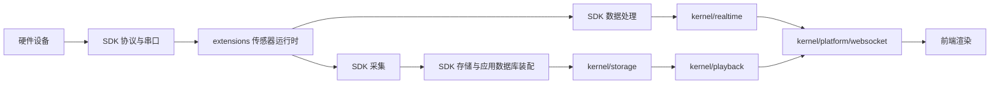
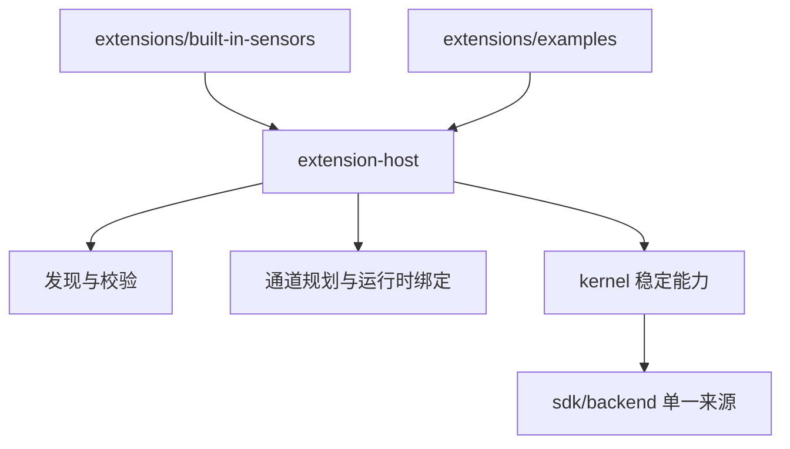

# 后端架构地图

> 最后更新：2026-08-28

这份地图用于快速判断数据如何流动、功能应该改在哪里，以及哪些边界必须保持稳定。

## 分层总览

| 层 | 目录 | 职责 |
| --- | --- | --- |
| Electron 固定桥 | `backend/common/`、`backend/runtime/` | 保留 Electron 已依赖的日志和后端启动入口 |
| 应用稳定内核 | `backend/kernel/` | 平台装配、串口编排、存储、回放、CSV、实时分发和简单算法通道 |
| 扩展宿主 | `backend/extension-host/` | 按 `manifest`、`runtime`、`workspace` 发现、校验、注册和调度展示系统扩展 |
| 扩展实现 | `backend/extensions/` | 内置传感器运行时和可复制的展示系统示例 |
| 兼容资料 | `backend/compatibility/` | 迁移基线和旧数据辅助函数，不作为新增功能入口 |
| 自动验证 | `backend/tests/` | 固定链路、扩展宿主和历史兼容测试 |
| 可复用核心 | `sdk/backend/` | 协议、串口底层、采集、存储、处理的唯一实现来源 |

`backend/` 一级目录只有 `common`、`runtime`、`kernel`、`extension-host`、`extensions`、`compatibility` 和 `tests`。旧路径兼容转发层已经移除。

## 核心数据流

目录改变只调整模块位置和引用关系，不改变协议帧、硬件通道语义、数据库结构或历史数据格式。

## `kernel` 能力地图

| 目录 | 负责 | 不负责 |
| --- | --- | --- |
| `kernel/platform/` | 服务启动、生命周期、命令、HTTP、WebSocket、授权、运行状态 | 具体硬件协议和页面渲染 |
| `kernel/serial/` | 应用侧串口控制、端口编排、运行时装配 | 串口底层实现与协议解析；这些来自 SDK |
| `kernel/storage/` | 数据库装配、历史会话、查询和维护 | 定义新的历史数据格式 |
| `kernel/playback/` | 历史帧转换和回放计时 | 采集写入协议 |
| `kernel/csv/` | 已有历史数据的 CSV 导出 | 修改源数据结构 |
| `kernel/realtime/` | 实时帧管线和输出通道 | 传感器协议解析 |
| `kernel/algorithm-channel/` | Display System、JQBed、宠物看护和 Python 调用通道 | 通用 SDK 算法库 |

## 扩展边界

`extension-host/` 根目录只保留 `index.js`、`appRuntimeFactory.js` 和说明文件；具体职责按以下三个子目录组织：

| 子目录 | 职责 |
| --- | --- |
| `manifest/` | 配置加载、schema/引用文件校验、坐标映射和展示定义 |
| `runtime/` | 运行通道规划、注册、绑定、策略、调度与帧处理 |
| `workspace/` | 用户展示系统配置的读取、保存和复制 |

- 新传感器的运行时实现放入 `extensions/built-in-sensors/`，协议、线序、点序和标定继续通过既有配置/SDK 契约表达。
- 新展示系统示例放入 `extensions/examples/`；真正的用户可写展示配置仍遵守当前 Display System 工作区规则。
- 扩展只能通过宿主和稳定能力接入，不应直接改 `backend/runtime/index.js` 或 Electron 入口。

## 修改入口

| 修改目标 | 首选入口 |
| --- | --- |
| 后端启动和退出 | `backend/runtime/index.js`、`backend/kernel/platform/bootstrap/` |
| HTTP 路由 | `backend/kernel/platform/http/` |
| WebSocket 命令与广播 | `backend/kernel/platform/websocket/` |
| 串口打开、关闭、端口编排 | `backend/kernel/serial/` |
| 协议解析、串口底层 | `sdk/backend/protocol/`、`sdk/backend/serial/` |
| 采集和通用存储 | `sdk/backend/collection/`、`sdk/backend/storage/` |
| 线序、点位映射、插值和平滑 | `sdk/backend/processing/` |
| 历史查询和回放 | `backend/kernel/storage/`、`backend/kernel/playback/` |
| CSV 下载 | `backend/kernel/csv/` |
| 实时输出 | `backend/kernel/realtime/` |
| 展示系统配置发现和校验 | `backend/extension-host/manifest/` |
| 展示系统运行通道和绑定 | `backend/extension-host/runtime/` |
| 展示系统工作区 | `backend/extension-host/workspace/` |
| 具体传感器运行时 | `backend/extensions/built-in-sensors/` |

## 依赖规则

1. `app/electron/` 只依赖固定桥，不直接穿透到扩展内部。
2. `runtime/index.js` 可以装配 `kernel`，但其路径和外部导出保持稳定。
3. `kernel` 使用 SDK 公共入口，不复制协议、串口、采集、存储或处理实现。
4. `extension-host` 可以调用 `kernel` 与 SDK；具体扩展通过宿主注册。
5. `compatibility` 不得成为新增业务依赖。
6. 任何影响硬件协议或历史数据兼容性的变化都必须单独评审，本次目录收拢不包含此类变化。
