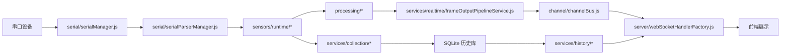
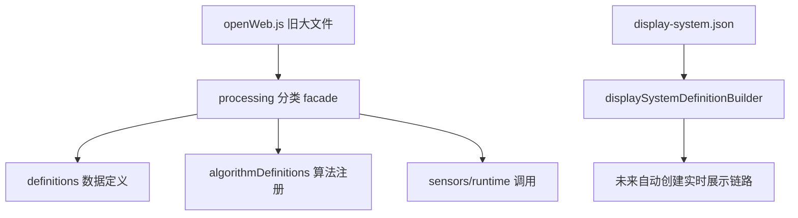

# 后端架构地图

这份文档只回答“数据怎么走、改哪里、哪些是新架构、哪些是 legacy”。

> **2026-08-06：下面提到的一批目录，实现已经搬进可安装包 `@shroom/backend`（`sdk/backend/`）。**
> `backend/` 里对应位置是一行转出壳，所以路径和 require 全部照旧能用，打开就知道搬去哪了。
> 搬走的是：`contracts/`、`processing/`（除 `webStaticServer.js`）、`sensors/` 的注册表和 5 个
> 协议插件、`serial/` 的 helper/manager/parser/filter 和 `protocols/`、`services/collection/`、
> `db/dbHelper.js`、`export/csvHelper.js`、`channel/channelBus.js`、
> `normalizers/telemetryNormalizer.js`、`common/logger.js`、`displaySystems/displaySystemProtocol.js`。
> 包总览见 `sdk/backend/README.md`。

## 核心数据流

## 想改某个功能从哪里开始

| 目标 | 入口文件 |
| :--- | :--- |
| 新增或修改串口打开、重连、端口筛选 | `serial/serialManager.js`、`serial/serialPortFilterService.js` |
| 修改串口数据切帧/parser | `serial/serialParserManager.js` |
| 查协议字节结构 / 加一种串口协议预设 | `serial/protocols/README.md`、`serial/protocols/*.json`、`serial/protocols/index.js` |
| 修改某类传感器实时解析 | `sensors/runtime/*` |
| 修改线序、点位映射 | `processing/lineOrders.js`、`processing/lineOrderDefinitions/*`、`processing/videoPointMappings.js` |
| 修改插值或平滑算法 | `processing/interpolationAlgorithms.js`、`processing/smoothingAlgorithms.js` |
| 修改实时帧输出到前端 | `services/realtime/frameOutputPipelineService.js` |
| 修改 WebSocket 命令 | `ws/registerRuntimeCommandHandlers.js`、`ws/registerSerialCommandHandlers.js` |
| 修改 HTTP 接口 | `server/httpAppFactory.js` |
| 修改历史查询/回放 | `services/history/*`、`services/playback/*` |
| 修改采集入库 | `services/collection/*` |
| 修改 Display Systems 配置发现 | `displaySystems/*` |

## 目录职责

| 目录 | 职责 |
| :--- | :--- |
| `server/` | 启动、HTTP/WebSocket 装配、进程生命周期、运行时路径配置。 |
| `serial/` | 串口发现、打开、关闭、重连、parser channel 管理。 |
| `sensors/` | 传感器类型定义和实时帧 runtime。 |
| `processing/` | 线序、点位映射、插值、平滑、压力换算、静态服务等纯处理能力。 |
| `services/` | 业务服务层，包括采集、历史、回放、实时输出、导出、生命周期。 |
| `ws/` | WebSocket 命令路由和命令 handler 注册。 |
| `displaySystems/` | 配置驱动展示系统的 manifest 发现、校验、runtime definition 生成。 |
| `contracts/` | SDK/HTTP/WebSocket 对外契约说明。 |
| `runtime/` | 旧变量到新 runtime store 的过渡状态容器。 |

上表里 `serial/`、`sensors/`、`processing/`、`contracts/` 以及 `services/collection/` 的实现
现在住在 `@shroom/backend`（`sdk/backend/`），`backend/` 侧只剩转出壳。剩下真正还在
`backend/` 里的是**应用装配和 legacy 兼容**：`server/`、`ws/`、`displaySystems/` 运行时、
`services/` 的 history / playback / realtime / websocket / lifecycle / petcare / export，
以及 `sensors/runtime/`。

## 新架构

- `processing/lineOrderDefinitions/*`：线序和点位表数据化。
- `processing/lineOrderMapper.js`：通用线序执行器。
- `processing/interpolationAlgorithms.js`：插值算法真实实现。
- `processing/smoothingAlgorithms.js`：平滑算法入口。
- `processing/videoPointMappings.js`：零散视频映射集中入口。
- `displaySystems/*`：打包后自定义展示系统的配置发现和 runtime definition。
- `services/*`：按领域拆分的业务服务。

## Legacy

- `legacy/openWeb.js`：旧算法仓库，当前仅保留为迁移对比和历史兼容文件，processing 聚合入口已不再依赖它。
- `processing/legacyOpenWebExports.js`：已删除，旧兼容代理不再参与运行时依赖。
- `sensors/runtime/legacySerialFrameRuntime.js`：旧串口实时处理兼容层。
- `server/server.js` 中的旧状态变量和 accessor：等待继续迁入 runtime store。

## 当前迁移方向

短期目标已经完成：processing 聚合入口断开旧 `openWeb.js` 依赖。中期目标是让 Display Systems manifest 决定 parser、lineOrder、pointOrder 和 algorithm；长期目标是 `server.js` 只负责启动、监听、关闭和依赖注入。
