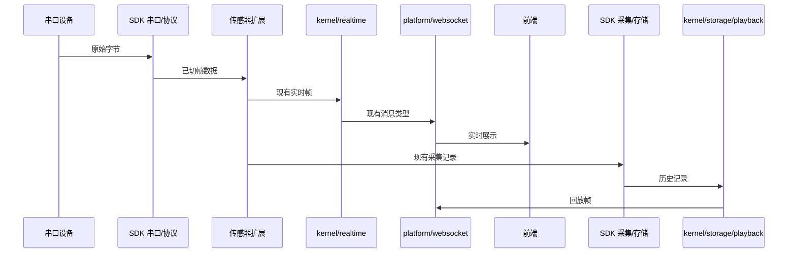

# Backend 架构说明

> 最后更新：2026-08-28

## 1. 架构目标

Shroom 后端分成三类责任：

1. **Electron 固定桥**：路径和导出稳定，避免应用壳随内部目录调整而变化。
2. **应用稳定内核**：承载本软件的启动、通信编排、历史、回放和算法集成。
3. **可变扩展**：让传感器运行时和展示系统在稳定内核之外演进。

协议、串口底层、采集、存储和通用数据处理属于可复用能力，以 `sdk/backend/` 为单一实现来源。`backend/` 不再保留对应 SDK 模块的转发副本。

## 2. 当前物理结构

```text
backend/
├─ common/
│  └─ logger.js
├─ runtime/
│  └─ index.js
├─ kernel/
│  ├─ platform/
│  │  ├─ bootstrap/
│  │  ├─ commands/
│  │  ├─ http/
│  │  ├─ license/
│  │  ├─ runtime/
│  │  ├─ websocket/
│  │  ├─ server.js
│  │  └─ serverPathConfig.js
│  ├─ serial/
│  ├─ storage/
│  │  └─ history/
│  ├─ playback/
│  ├─ csv/
│  ├─ realtime/
│  └─ algorithm-channel/
├─ extension-host/
├─ extensions/
│  ├─ built-in-sensors/
│  └─ examples/
├─ compatibility/
└─ tests/
```

一级目录由 22 个收拢为 7 个；后端文件由 205 个减少为 168 个。35 个旧路径或 SDK 转发壳已移除，后端不再同时维护新旧两套物理入口。

## 3. Electron 固定桥

### `backend/runtime/index.js`

这是 Electron 使用的后端门面。内部可以装配 `kernel/platform`，但文件路径和以下外部职责保持稳定：

- 启动本地后端服务；
- 关闭服务并释放资源；
- 获取 WebSocket 服务状态；
- 转发控制命令；
- 获取运行状态。

### `backend/common/logger.js`

这是 Electron 使用的日志桥。它保留在原路径，避免 Electron 主进程和更新器因后端内部分类变化而修改。

`app/electron/` 不直接依赖 `kernel`、`extension-host` 或具体扩展。该约束使 Electron 壳能够作为稳定发布边界。

## 4. 应用稳定内核

### 4.1 `kernel/platform`

负责应用平台装配，不包含具体传感器协议：

| 子目录 | 职责 |
| --- | --- |
| `bootstrap/` | 服务启动、生命周期、退出清理和系统时间同步 |
| `commands/` | 运行控制和命令路由 |
| `http/` | HTTP 应用、控制/报告路由和网页静态服务 |
| `license/` | 当前授权文件读取与校验 |
| `runtime/` | 运行态存储、旧状态绑定和归零状态 |
| `websocket/` | 连接、订阅、广播、命令和历史消息 |
| `server.js` | 后端主装配入口 |
| `serverPathConfig.js` | 开发态和打包态运行路径解析 |

### 4.2 `kernel/serial`

负责应用侧的串口控制、多个端口的通道编排和运行时工厂。串口设备访问、协议 framing/decoding、parser 和端口筛选的可复用实现仍来自 `sdk/backend/serial` 与 `sdk/backend/protocol`。

### 4.3 `kernel/storage`

负责应用数据库装配，以及历史会话、查询和维护。SQLite 兼容装配也在此层，但历史数据库表结构和磁盘数据格式没有改变。

### 4.4 `kernel/playback`、`kernel/csv` 与 `kernel/realtime`

- `playback/`：把已有历史记录转换为前端沿用的帧并控制回放节奏。
- `csv/`：按现有字段导出历史数据。
- `realtime/`：统一实时帧管线、分发和 telemetry 输出。

这些目录只重组现有职责，不重新定义采集数据或前端消息格式。

### 4.5 `kernel/algorithm-channel`

负责当前已有的 Display System 算法执行、JQBed 算法配置协议、宠物看护运行时和 Python worker 调用。它是应用集成通道，不取代 SDK 中的通用处理模块。

## 5. SDK 边界

| 可复用能力 | 单一来源 |
| --- | --- |
| 协议与帧定义 | `sdk/backend/protocol/` |
| 串口底层、parser、筛选与管理 | `sdk/backend/serial/` |
| 数据采集 | `sdk/backend/collection/` |
| 通用存储 | `sdk/backend/storage/` |
| 线序、点位映射、插值、平滑与压力处理 | `sdk/backend/processing/` |
| 契约与 telemetry | `sdk/backend/contract/`、`sdk/backend/telemetry/` |

应用代码通过 `@shroom/backend/...` 使用这些能力。此次物理迁移未修改 SDK，也未改变 SDK 公共 API。

## 6. 扩展宿主与扩展实现

### `extension-host`

该目录负责已有 Display System 能力的基础设施：

- 查找和读取 manifest；
- 校验配置文件与显示配置；
- 生成展示定义和坐标映射；
- 规划 parser channel；
- 绑定、启动、停止和注册运行时；
- 提供工作区读写服务。

它是扩展与稳定内核之间的边界，不包含某个具体传感器的协议实现。

### `extensions/built-in-sensors`

放随应用交付的现有传感器运行时，包括 1024 点、手套、小床和 legacy 矩阵处理器及其装配工厂。目录迁移没有改变帧解析、线序和通道语义。

### `extensions/examples`

放当前已有的 Display System 示例：byte matrix、hand glove、JQBed 和 small bed 12B。示例用于验证和复制，不表示所有扩展都已完全配置化。

## 7. 稳定数据链路



物理目录变化不允许跨越以下兼容边界：

- 不更改硬件协议字节结构、帧头帧尾或校验规则；
- 不更改传感器线序、点序和标定含义；
- 不迁移或重写历史数据库结构；
- 不改变 CSV 和 WebSocket 的现有业务字段；
- 不修改 Electron 固定入口或 SDK。

## 8. 路径与磁盘数据

模块文件移动后，依赖 `__dirname` 的组件必须仍解析到相同的运行资源：

- `serverPathConfig.js` 继续区分开发态与打包态目录；
- `webStaticServer.js` 继续读取应用网页资源；
- `licenseHelper.js` 继续读取既有授权位置；
- `pythonWorker.js` 继续定位项目内 Python 资源；
- `dbManager.js` 继续定位同一数据库与初始化文件。

这类路径调整只修正模块搬迁后的相对层级，不改变磁盘目录协议。

## 9. 新增能力的落点

### 新传感器

1. 优先复用或增加 SDK 协议预设；涉及协议兼容性时单独评审。
2. 将应用运行时放入 `extensions/built-in-sensors/`。
3. 通过 `extension-host` 或现有 runtime factory 注册通道。
4. 保持实时消息和历史写入契约兼容。
5. 增加无硬件单元测试，并使用真实设备做人工验收。

### 新算法

- 通用、可复用的纯数据处理放入 SDK；本次任务不修改 SDK。
- 仅属于 Shroom 应用集成的 Node/Python 通道放入 `kernel/algorithm-channel/`。
- 算法不得直接接管串口或绕过实时帧管线写入前端。

### 新展示方式

- 后端展示配置的发现、校验和运行绑定放入 `extension-host/`。
- 具体示例和随应用交付的配置放入 `extensions/examples/`。
- 页面渲染实现仍属于前端，不进入稳定后端内核。

## 10. 验证与未覆盖项

自动验证入口：

```powershell
npm test
npm run sdk:backend-smoke
```

单元测试可以验证模块引用、装配、历史转换和协议模拟，但不能替代以下人工验证：

- 真实串口设备与多端口并发；
- 用户既有历史数据库的完整回放；
- 打包后的 Electron 安装目录与离线网页加载；
- Python 环境和真实算法进程。

## 11. 本次物理收拢结果

- 后端一级目录从 22 个减少到 7 个。
- 后端文件从 205 个减少到 168 个。
- 移除 35 个旧路径或 SDK CommonJS 转发壳。
- 保留 `backend/runtime/index.js` 与 `backend/common/logger.js` 两个 Electron 固定桥。
- SDK、硬件协议、历史数据格式和 Electron 入口均未修改。
