# Backend 架构说明

## 2026-07-08 Backend SDK Demo

| File | Responsibility |
| :--- | :--- |
| `sdk/src/backend/BackendSdkClient.js` | Thin backend-facing SDK client over `/api/sdk/contract`, HTTP control routes, and realtime WebSocket subscriptions. |
| `sdk/examples/backend-sdk-demo.js` | Runnable SDK demo; defaults to read-only status checks and realtime subscription. |
| `sdk/examples/serial-chain-demo.js` | Runnable local serial-chain demo that reads a physical serial port through the SDK and emits parsed frames. |
| `backend/tests/sdk/backendSdkClient.test.js` | Contract, HTTP command shape, display-system route, and realtime event coverage for the SDK client. |
| `backend/tests/sdk/serialChainDemo.test.js` | Mock-frame coverage for the local serial-chain demo without requiring hardware. |

This gives the project a concrete SDK usage path without exposing internal `server.js`, parser, or runtime modules to SDK users.

## 2026-07-08 Server Bootstrap Recovery

| File | Change |
| :--- | :--- |
| `server/server.js` | Restored bootstrap-level `logger`, sensor constants, zero-state accessors, history transform helpers, realtime throttling helpers, minzhen port helpers, and legacy matrix state declarations. |
| Verification | Added mock-load validation during maintenance to catch module-load `ReferenceError` before Electron startup. |

This was a stability repair after slimming `server.js`: syntax tests can miss top-level variables that are only read during module execution, so bootstrap changes now need module-load verification in addition to `node --check` and unit tests.

## 2026-07-08 Sensor Runtime Factory Split

| File | Responsibility |
| :--- | :--- |
| `server/sensorProcessorFactory.js` | Assembles the 1024 sit/back/head processors and hides detailed processor dependencies from `server.js`. |
| `server/smallBedRuntimeFactory.js` | Assembles the small-bed 12B runtime and its legacy state bridge. |
| `server/handRuntimeFactory.js` | Assembles hand packet runtime handlers for full-packet and double-packet parser flows. |
| `server/server.js` | Imports server-level factories instead of directly importing low-level runtime constructors. |
| `tests/server/*Factory.test.js` | Covers the new server factory wiring so later slimming work can move safely. |

This step moves another group of sensor runtime assembly details out of the bootstrap file. The next high-value split is database runtime, legacy state bindings, and the remaining HTTP/WebSocket bootstrap wiring.

## 2026-07-08 本轮架构优化

| 文件/目录 | 变化 |
| :--- | :--- |
| `server/runtimeStatePatchFactory.js` | 支持把指定旧字段写入 `RuntimeStateStore`，再通过 accessor 回写旧变量，当前覆盖 `file`、`baudRate`、`localFlag`、`nowDate`、`db/db1/db2`。 |
| `server/server.js` | 为上述旧状态补齐 store accessor，并在 runtime store 创建后绑定到 patcher，减少命令层直接写旧变量。 |
| `displaySystems/displaySystemRuntimePolicy.js` | 新增 Display Systems 调度策略，默认保护 legacy parser channel，只有 `runtimeMode: "parallel"` 才允许并行监听。 |
| `displaySystems/displaySystemRuntimeDispatcher.js` | 增加 skipped binding 状态，`stop()` 移除 parser listener，重复 `start()` 不重复挂载 listener。 |
| `displaySystems/examples/jqbed-manifest-demo/` | 新增 jqbed 真实传感器 manifest 迁移模板，当前为 template，不接管生产实时链路。 |
| `displaySystems/examples/hand-glove-manifest-demo/` | 新增 hand glove manifest 迁移模板，覆盖 sit/back 双通道模板形态。 |
| `tests/run-tests.js` | 统一后端测试入口，`npm test` 不再维护超长命令串。 |

当前边界：Display Systems 已经能生成并绑定实时处理链路，但默认不抢 legacy 的 `sit/back/head/sensor` parser。要做并行验证，需要在 manifest 的 `metadata.runtimeMode` 显式设置为 `parallel`；要做模板沉淀，则保持 `template`。

## 2026-07-08 Server Runtime Factory 继续下沉

| 文件/目录 | 变化 |
| :--- | :--- |
| `server/displaySystemRuntimeFactory.js` | 新增 Display Systems runtime 控制器，统一处理 binding、dispatcher 创建、重复绑定前 stop 旧 dispatcher、关闭实时调度。 |
| `server/appRuntimeFactory.js` | 只保留 Display Systems discovery 和 HTTP 状态聚合，不再直接创建 dispatcher。 |
| `server/runtimeStateStoreFactory.js` | 新增 server runtime state store 装配层，集中维护 legacy 初始 state、store-backed key 清单和 patcher 绑定规则。 |
| `server/server.js` | 移除内联 legacy runtime 初始 state 和 store-backed key 列表，继续收缩启动编排细节。 |
| `tests/server/displaySystemRuntimeFactory.test.js` | 覆盖重复绑定时旧 dispatcher stop，避免 parser listener 叠加。 |
| `tests/server/runtimeStateStoreFactory.test.js` | 覆盖 store-backed key 绑定和 accessor 回写行为。 |

这一步继续把 `server.js` 从“装配细节持有者”推向“启动编排入口”。旧变量本体仍在迁移期保留，但初始化规则和写入绑定规则已经下沉到 factory。

## 2026-07-08 Legacy OpenWeb 归档与 Runtime Mode 权限模型

| 文件/目录 | 变化 |
| :--- | :--- |
| `legacy/openWeb.js` | 从 `processing/openWeb.js` 迁入 legacy 目录，只作为历史兼容和回归测试基线。 |
| `legacy/README.md` | 明确 legacy 目录不允许新业务代码依赖，只保留旧文件和迁移对比基线。 |
| `tests/processing/*.test.js` | 旧输出基线改为读取 `backend/legacy/openWeb.js`。 |
| `displaySystems/displaySystemRuntimePolicy.js` | runtime mode 扩展为 `template/parallel/shadow/active/disabled`。 |
| `displaySystems/displaySystemRuntimeBinder.js` | `shadow` 模式只执行 processor，不发布到 `frameOutputPipeline`。 |
| `displaySystems/displaySystemRuntimeDispatcher.js` | 透传 `allowActiveDisplaySystem`，active 接管必须由启动侧显式授权。 |

新的运行时模式边界：`template` 只校验不监听，`parallel` 并行监听并发布，`shadow` 并行监听但不发布，`active` 预留给真实接管 legacy 通道，`disabled` 显式关闭。当前生产启动没有开启 `allowActiveDisplaySystem`，所以不会误抢旧串口链路。

## 2026-07-08 Runtime Context 与 Frame Pipeline 下沉

| 文件/目录 | 变化 |
| :--- | :--- |
| `server/runtimeContextFactory.js` | 新增运行时读取上下文，提供 `getSensorType()`、`getDatabase(channel)`、`getNowDate()`、`getBaudRate()`、`isLocalPlayback()`，优先读取 `RuntimeStateStore`，store 未就绪时回退旧闭包变量。 |
| `server/framePipelineFactory.js` | 新增 frame pipeline 装配层，统一创建 `collectionFrameStorage` 和 `frameOutputPipeline`，三路数据库映射通过 runtime context 获取。 |
| `server/server.js` | 串口打开、WebSocket runtime、实时通道发布、Display Systems 绑定、小床 runtime 和 frame pipeline 等高频读取点开始改用 runtime context。 |
| `tests/server/runtimeContextFactory.test.js` | 覆盖 store 优先读取和旧闭包 fallback。 |
| `tests/server/framePipelineFactory.test.js` | 覆盖 sit/back/head channel 到数据库句柄的映射。 |

这一步是旧状态读取 store-native 化的过渡阶段：旧变量本体仍保留，但新调用点不再直接依赖 `file/db/nowDate/localFlag/baudRate` 闭包读取。

> 更新时间：2026-07-03
> 目的：说明 `backend/` 每个目录和主要文件的职责，帮助后续继续拆分 `server.js`、新增传感器、接入 HTTP/SDK 控制面和维护实时数据通道。

## 当前架构评价

当前后端已经从早期的“大量逻辑集中在 WebSocket 和 `server.js`”推进到分层架构：

| 维度 | 当前状态 | 评价 |
| :--- | :--- | :--- |
| 串口生命周期 | `serialManager` 负责打开、关闭、注册角色和状态查询 | 方向正确，串口资源边界已经比较清晰 |
| 串口解析绑定 | `serialParserManager` 创建命名 parser，`bindSerialSensorRuntimes` 统一绑定 `onData` | 比 `parser1/parser2/parser3` 编号式写法更可维护 |
| 传感器协议处理 | 1024 主矩阵、通用矩阵、bigBed 分片、130/146/142/158 分片压力帧已进入 `sensors/runtime/*Processor`，`legacySerialFrameRuntime` 主要保留分发和旧状态适配 | 模块化程度继续提升，剩余重点是少量 262 字节旧帧和运行时状态外移 |
| 实时数据通道 | `FrameOutputPipeline -> RealtimeTelemetryGateway -> ChannelBus -> WebSocketSubscription` | 基本符合目标文档的 Parser/Normalizer/Channel/Gateway 思路 |
| 控制命令 | HTTP 和 WS 统一通过 `controlCommandService`，具体控制逻辑下沉到 `application/*Service`，SDK 对外契约由 `contracts/sdkApiContract.js` 定义 | 方向正确，SDK 可以优先依赖 HTTP/WS 契约而不是读取后端内部模块 |
| HTTP/WS 边界 | HTTP 承担控制和查询，WS 承担实时推送和旧命令兼容 | 比全部放 WS 更合理 |
| 主服务文件 | `server/server.js` 约 2070 行，历史帧转换、串口过滤、legacy runtime 绑定、零点状态/命令、端口实例状态、legacy accessor、WebSocket context accessor 和部分启动动作已迁入独立模块 | 仍偏大，下一步应拆 app runtime factory 和更多启动编排 |

结论：当前大约处在“从大单体服务向模块化后端迁移的中后段”。核心边界已经建立，但还没有完全达到推荐架构里的“server 只做启动编排、所有业务都在 application/domain/service 层”的状态。

## 推荐目标图

```mermaid
flowchart LR
  Hardware["硬件传感器/串口设备"] --> SerialManager["serial/serialManager<br/>串口生命周期"]
  SerialManager --> ParserManager["serial/serialParserManager<br/>命名 parser"]
  ParserManager --> RuntimeRegistry["sensors/runtime<br/>runtime registry + processors"]
  RuntimeRegistry --> Normalizer["normalizers/telemetryNormalizer<br/>标准 telemetry"]
  RuntimeRegistry --> FramePipeline["services/realtime/frameOutputPipelineService<br/>采集入库 + 实时输出"]
  FramePipeline --> Storage["db/services<br/>SQLite + collection queue"]
  FramePipeline --> Gateway["services/realtime/realtimeTelemetryGateway"]
  Gateway --> ChannelBus["channel/channelBus"]
  ChannelBus --> WsSub["services/websocket/websocketSubscriptionService"]
  WsSub --> Frontend["前端页面/SDK 实时订阅"]

  Sdk["SDK"] --> SdkContract["contracts/sdkApiContract<br/>API/WS/telemetry 契约"]
  SdkContract --> HttpRoutes
  SdkContract --> WsSub

  HttpClient["HTTP 控制面/SDK"] --> HttpRoutes["http/controlRoutes"]
  LegacyWsCommand["旧 WS 命令"] --> WsRouter["ws/webSocketCommandRouter"]
  HttpRoutes --> ControlService["application/controlCommandService"]
  WsRouter --> ControlService
  ControlService --> RuntimeControl["application/runtimeControlService"]
  ControlService --> SerialControl["application/serialControlService"]
  RuntimeControl --> FramePipeline
  SerialControl --> SerialManager
```

## 运行时数据流

1. 硬件数据从串口进入 `serialManager` 管理的端口。
2. 端口数据交给 `serialParserManager` 中对应的命名 parser。
3. `bindSerialSensorRuntimes` 把 `sit/back/head/bigBedSit/smallBed12B` 等 channel 绑定到 runtime handler。
4. runtime handler 调用具体 processor，例如 `sit1024FrameProcessor`、`backHead1024FrameProcessor`、`smallBed12BRuntime`、`handPacketRuntime`。
5. 处理后的实时帧交给 `frameOutputPipeline`。
6. `frameOutputPipeline` 同时负责采集入库和实时发布。
7. 实时发布进入 `realtimeTelemetryGateway`，再进入 `ChannelBus`。
8. WebSocket 订阅服务按 channel 推送给前端。

## 控制命令流

1. 新控制面优先走 HTTP，例如串口开关、传感器类型切换、采集开始/停止、历史加载、CSV 导出。
2. 旧前端仍可通过 WebSocket command router 发送兼容命令。
3. HTTP 和 WS 都进入 `controlCommandService`。
4. 运行时控制进入 `runtimeControlService`。
5. 串口和传感器类型控制进入 `serialControlService`。
6. service 再调用 `serialManager`、历史服务、CSV 服务、采集服务等底层模块。

## 目录职责

| 目录 | 职责 |
| :--- | :--- |
| `application/` | 应用层控制服务。承接 HTTP/WS 入口传来的业务命令，避免入口层直接操作运行时状态或串口。 |
| `channel/` | 实时通道模型。维护 ChannelBus 和标准 telemetry channel 定义。 |
| `common/` | 通用工具、日志、HTTP 返回结构。 |
| `config/` | 配置文件读取、写入和路径管理。 |
| `contracts/` | 面向前端和 SDK 的稳定契约定义，包括 HTTP 路由、串口角色、WebSocket 消息类型和 telemetry frame shape。 |
| `db/` | 数据库 helper 和 sqlite 兼容层。 |
| `export/` | 导出相关基础工具，目前主要是 CSV helper。 |
| `http/` | HTTP API 路由。控制面和报告接口都在这里注册。 |
| `license/` | 授权、加密和授权文件路径处理。 |
| `normalizers/` | 把旧实时 payload 转为标准 telemetry 数据。 |
| `processing/` | 矩阵、压力、线序、算法处理函数集合，很多传感器 processor 依赖这里。 |
| `python/` | Python worker 桥接，用于调用外部算法。 |
| `runtime/` | 后端运行时入口、旧兼容 hub、命令路由、通用运行时状态仓库和零点状态仓库。 |
| `sensors/` | 传感器插件、协议解析和传感器类型 registry。 |
| `serial/` | 串口扫描、端口创建、生命周期管理和 parser 管理。 |
| `server/` | 服务启动编排层。当前仍包含主 `server.js`，以及 HTTP/WS factory 和 server 级工具模块。 |
| `services/` | 领域服务和基础设施服务。包含采集、历史、回放、CSV、WebSocket、生命周期、实时网关等。 |
| `ws/` | WebSocket 命令兼容层。目标是只保留消息解析、命令路由和旧协议适配。 |

## 主要文件说明

### `application/`

| 文件 | 职责 |
| :--- | :--- |
| `controlCommandService.js` | 控制命令统一入口。HTTP 和 WebSocket 都通过它执行命令。 |
| `runtimeControlService.js` | 处理显示配置、历史回放、采集开关、采集频率、CSV 导出和历史删除。 |
| `serialControlService.js` | 处理传感器类型切换、串口打开/关闭、local 回放切换、串口重扫和手套自动连接。 |

### `channel/`

| 文件 | 职责 |
| :--- | :--- |
| `channelBus.js` | 后端内部实时通道总线，负责 publish/subscribe 和统计。 |
| `telemetryChannelService.js` | 生成标准 telemetry channel 元数据，供 `/api/channels` 和前端订阅使用。 |

### `common/`

| 文件 | 职责 |
| :--- | :--- |
| `HttpResult.js` | HTTP 返回结构封装。 |
| `logger.js` | 后端统一日志入口。 |
| `util.js` | 通用工具函数，例如传感器类型判断和数组处理。 |

### `config/`

| 文件 | 职责 |
| :--- | :--- |
| `configManager.js` | 配置读取、保存和默认值管理。 |

### `contracts/`

| 文件 | 职责 |
| :--- | :--- |
| `sdkApiContract.js` | SDK/API 稳定契约源头。定义 HTTP 路由、串口角色、WS 订阅消息类型、telemetry 指标/质量枚举，并提供 `/api/sdk/contract` 的快照构造函数。 |

### `db/`

| 文件 | 职责 |
| :--- | :--- |
| `dbHelper.js` | 数据库基础 helper。 |
| `sqlite3-compat.js` | sqlite/better-sqlite3 兼容封装，降低迁移成本。 |

### `export/`

| 文件 | 职责 |
| :--- | :--- |
| `csvHelper.js` | CSV 写入和格式化基础工具。 |

### `http/`

| 文件 | 职责 |
| :--- | :--- |
| `controlRoutes.js` | HTTP 控制 API，包括串口、传感器、采集、历史、导出等控制命令；路由路径和串口角色复用 `contracts/sdkApiContract.js`。 |
| `reportRoutes.js` | OneStep 报告相关 API，包括热力图数据、canvas 上传和 PDF 生成。 |

### `license/`

| 文件 | 职责 |
| :--- | :--- |
| `aes_ecb.js` | 授权相关 AES 加解密。 |
| `licenseHelper.js` | 授权文件路径解析和候选路径管理。 |

### `normalizers/`

| 文件 | 职责 |
| :--- | :--- |
| `telemetryNormalizer.js` | 把旧实时 payload 归一化为 `{ channelId, deviceId, metric, value, timestamp }` 风格的标准 telemetry。 |

### `processing/`

| 文件 | 职责 |
| :--- | :--- |
| `dataProcessor.js` | 数据处理辅助逻辑。 |
| `openWeb.js` | 大量历史线序、矩阵转换、传感器映射和算法函数。 |
| `press.js` | 压力计算相关逻辑。 |
| `utilMatrix.js` | 矩阵工具和小床相关处理函数。 |

### `python/`

| 文件 | 职责 |
| :--- | :--- |
| `pyWorker.js` | Node 到 Python 算法 worker 的启动、调用和关闭。 |

### `runtime/`

| 文件 | 职责 |
| :--- | :--- |
| `commandRouter.js` | 通用命令路由基础实现。 |
| `index.js` | 后端运行时入口适配。 |
| `legacyRuntimeAccessorFactory.js` | legacy 串口 runtime accessor 拼装工厂。集中合并 collection/runtime/zero/serialManager 状态 accessor，并保留尚未迁出的旧变量 accessor 注入点。 |
| `runtimeStateStore.js` | 用 getter/setter accessor 和内部 state 管理旧运行时状态读写；当前已承接手套、零点、legacy 分段协议缓存、历史回放行缓存和采集控制状态。 |
| `webSocketContextAccessorFactory.js` | WebSocket handler context accessor 拼装工厂。集中生成旧 WS 兼容层需要的历史回放、零点、串口扫描和授权状态 descriptor。 |
| `zeroCommandService.js` | 零点命令服务。承接旧 WS `resetZero` 命令，统一执行零点捕获和清空，避免连接层直接操作零点字段。 |
| `zeroStateStore.js` | 零点状态仓库。统一保存 `pointArr*zero`、原始零点源帧和 legacy 映射缓存，供历史入库、WebSocket context、手套 runtime 和 legacy runtime 共享。 |
| `websocketHub.js` | 旧 WebSocket hub 兼容层。 |

### `sensors/`

| 文件 | 职责 |
| :--- | :--- |
| `registry.js` | 传感器类型、波特率、能力和模块注册中心。 |
| `smallBed12B.js` | 小床 12B 协议解析、压力标定、实时帧和采集存储载荷构造。 |
| `minzhen.js` | 敏振传感器文本协议解析和矩阵处理。 |
| `wholeChair.js` | 整椅类传感器三路矩阵归一化。 |
| `handGloveFullPacket.js` | 手套整包协议解析和模型矩阵映射。 |
| `handGloveDouble.js` | 手套双串口分包协议解析、左右手路由和 IMU 提取。 |

### `sensors/runtime/`

| 文件 | 职责 |
| :--- | :--- |
| `sensorRuntimeRegistry.js` | 传感器 runtime handler 注册表。 |
| `bindSerialSensorRuntimes.js` | 把 parser channel 和 runtime handler 统一绑定。 |
| `legacySerialRuntimeBinding.js` | 创建 legacy runtime、注册五路串口 handler，并绑定到 `serialParserManager`。 |
| `legacySerialFrameRuntime.js` | 遗留 SIT/BACK/HEAD/BIG_BED/SMALL_BED_12B 帧处理兼容层。当前主要负责协议分发、旧状态适配和少量未拆旧帧。 |
| `legacyGenericMatrixFrameProcessor.js` | 遗留 72/144、256、bed4096 等通用字节矩阵帧处理，负责字节读取、零点扣除、线序修正和 payload 构造。 |
| `legacyBigBedFrameProcessor.js` | bigBed 1025 字节双分片协议处理，负责上下半片缓存和 32x64 矩阵拼接。 |
| `legacySegmentedFrameProcessor.js` | 遗留 130/142 首包与 146/158 尾包分片压力帧处理，负责手、足、眼部线序映射、零点扣除和 payload 构造。 |
| `smallBed12BRuntime.js` | 小床 12B 实时串口帧运行时。 |
| `sit1024FrameProcessor.js` | SIT 1024 字节主矩阵帧处理。 |
| `backHead1024FrameProcessor.js` | BACK/HEAD 1024 字节主矩阵帧处理。 |
| `handPacketRuntime.js` | 手套 full packet 和 double packet 的实时处理运行时。 |

### `serial/`

| 文件 | 职责 |
| :--- | :--- |
| `serialHelper.js` | 串口扫描、串口实例创建和端口列表格式化。 |
| `serialManager.js` | 串口角色生命周期管理，包括注册、打开、关闭、状态查询和重连策略。 |
| `serialParserManager.js` | 命名 parser 创建、pipe 和 onData 绑定管理。 |
| `serialPortFilterService.js` | WCH/CH34x 串口识别、跨平台串口过滤和串口扫描日志摘要。 |

### `server/`

| 文件 | 职责 |
| :--- | :--- |
| `server.js` | 当前主编排文件。负责初始化状态、创建服务、连接各模块和保留旧兼容入口。仍是后续重点拆分对象。 |
| `bootstrapServer.js` | 启动编排 helper。当前承接启动串口扫描和本地 OneStep HTTP 服务监听，后续继续承接更多 bootstrap 流程。 |
| `httpAppFactory.js` | 创建 Express app 并挂载 HTTP 路由；同时暴露 `/api/sdk/contract`，方便 SDK 获取当前后端契约。 |
| `webSocketServerFactory.js` | 创建 sit/back/head 三个 WebSocket server。 |
| `webSocketHandlerFactory.js` | 挂载 sit/back/head 三个 WebSocket server 的连接、订阅和旧消息处理逻辑。 |
| `modules/dbManager.js` | server 旧模块中的数据库初始化逻辑。 |
| `modules/mathUtils.js` | server 旧模块中的数学和矩阵辅助函数。 |
| `modules/index.js` | server modules 聚合出口。 |

### `services/`

| 文件 | 职责 |
| :--- | :--- |
| `collectionService.js` | 采集频率、采集配置、存储时钟和磁盘保护。磁盘保护有 1 秒节流，**窗口内沿用上次判断结果**（不是无条件放行），空间腾出后最多等 1 秒恢复入库。 |
| `collectionInsertQueueService.js` | 采集数据批量入库队列。 |
| `collectionFrameStorageService.js` | sit/back/head 采集帧入库载荷构造和存储调度。 |
| `frameOutputPipelineService.js` | 实时帧输出管线，统一处理 JSON 解析、采集入库和实时发布。**每帧都会走到，入库与否由 `collectionFrameStorageService.canStore()` 判定**（采集开关 && 频率限流 && 磁盘空间）—— 别在这里加无条件写库。 |
| `csvDownloadService.js` | 历史 CSV 导出、进度上报和文件写入。 |
| `historyQueryService.js` | 历史日期、统计、帧数据和回放行查询。 |
| `historyPlaybackService.js` | 历史回放长度、曲线抽样和空白回放 payload 构造。 |
| `historyFrameTransformService.js` | 历史 matrix 行解析、压力帧归一化、CSV 表头/文件名前缀、回放 payload 和带清零信息的采集存储 payload 构造。 |
| `historyMaintenanceService.js` | 历史数据删除。 |
| `playbackFrameService.js` | 根据历史帧生成实时回放 payload。 |
| `playbackTimerService.js` | 历史回放定时器生命周期。 |
| `petCareRuntimeService.js` | 宠物看护和生命体征算法运行时。 |
| `realtimeTelemetryGateway.js` | 旧实时 payload 到标准 telemetry 和 ChannelBus 的桥接。 |
| `serverLifecycleService.js` | HTTP、WebSocket、数据库和串口关闭流程辅助。 |
| `websocketBroadcastService.js` | WebSocket 广播兼容服务。 |
| `websocketChannelService.js` | WebSocket channel 名称归一化。 |
| `websocketConnectionService.js` | WebSocket 心跳和连接保活。 |
| `websocketMessageService.js` | WebSocket JSON 消息解析和非法消息保护。 |
| `websocketSubscriptionService.js` | WebSocket 订阅关系管理和按 channel 推送。 |

### `ws/`

| 文件 | 职责 |
| :--- | :--- |
| `webSocketCommandRouter.js` | WebSocket 控制命令路由。 |
| `registerRuntimeCommandHandlers.js` | 注册运行时控制命令，实际逻辑转发到 `runtimeControlService`。 |
| `registerSerialCommandHandlers.js` | 注册串口控制命令，实际逻辑转发到 `serialControlService`。 |

## 维护记录

| 日期 | 类型 | 说明 |
| :--- | :--- | :--- |
| 2026-07-03 | 优化重构 | 新增 `runtime/zeroCommandService.js`，将旧 WS `resetZero` 命令的零点捕获和清空逻辑从 `webSocketHandlerFactory.js` 迁入 runtime 层。 |
| 2026-07-03 | 优化重构 | 新增 `server/bootstrapServer.js`，将启动串口扫描和本地 HTTP 服务监听从 `server.js` 迁出。 |
| 2026-07-03 | 优化重构 | 新增 `runtime/webSocketContextAccessorFactory.js`，将 WebSocket handler context 的旧状态 accessor 拼装从 `server.js` 迁入 runtime 层。 |
| 2026-07-03 | 优化重构 | 新增 `runtime/legacyRuntimeAccessorFactory.js`，将 legacy 串口 runtime 的状态 accessor 拼装从 `server.js` 迁入 runtime 层。 |
| 2026-07-03 | 优化重构 | `server.js` 移除 `port1/port2/portHead/portSensor` 顶层变量，实际端口实例统一由 `serialManager.getPort(role)` 提供，旧 runtime 只接收兼容快照。 |
| 2026-07-03 | 优化重构 | 新增 `serialPortStateStore` 管理串口扫描候选列表 `serialport`，避免扫描结果继续作为 `server.js` 散变量存在。 |
| 2026-07-03 | 优化重构 | 新增 `runtime/zeroStateStore.js`，将零点基准帧、原始零点源帧和 legacy 映射缓存从 `server.js` 局部变量迁入运行时状态仓库。 |
| 2026-07-03 | SDK 契约优化 | 新增 `backend/contracts/sdkApiContract.js`，集中定义 HTTP 路由、串口角色、WebSocket 订阅消息和 telemetry frame shape，并通过 `/api/sdk/contract` 暴露给 SDK。 |
| 2026-06-23 | 优化重构 | 将采集控制状态 `flag/saveTime/colHZ/collectOptions` 从 `server.js` 顶层变量迁入基于 `RuntimeStateStore` 的 `collectionStateStore`。 |
| 2026-06-23 | 优化重构 | 将历史回放状态 `localData/localDataBack/localDataHead/indexArr/nowIndex` 从 `server.js` 顶层变量迁入基于 `RuntimeStateStore` 的 `playbackStateStore`。 |
| 2026-06-23 | 优化重构 | 将 legacy 分段协议缓存 `firstBlueData/lastBlueData/newArr` 从 `server.js` 局部变量迁入 `runtimeStateStore` 内部 state，减少主服务文件直接持有的旧协议缓存。 |
| 2026-06-23 | 优化重构 | 新增 `legacySerialRuntimeBinding.js`，将 legacy runtime 创建、五路 handler 注册和 `serialParserManager` 绑定从 `server.js` 迁入 sensors/runtime 层。 |
| 2026-06-23 | 优化重构 | 新增 `serial/serialPortFilterService.js`，将 WCH/CH34x 串口识别、Windows/macOS 串口过滤和串口扫描日志摘要从 `server.js` 迁入 serial 层。 |
| 2026-06-23 | 优化重构 | 新增 `historyFrameTransformService.js`，将历史 matrix 行解析、压力帧归一化、CSV 表头/文件名前缀、温度床/小床回放 payload 和清零入库存储 payload 从 `server.js` 迁出，`server.js` 下降到约 1960 行。 |
| 2026-06-23 | 文档更新 | 为 `backend/sensors` 下传感器定义、协议解析和 runtime 文件补充中文模块职责与关键函数注释，并清理 `wholeChair.js` 等文件中的旧错码注释。 |
| 2026-06-23 | 优化重构 | 新增 `legacySegmentedFrameProcessor.js`，将 130/146/142/158 字节分片压力帧从 `legacySerialFrameRuntime.js` 迁出，覆盖 SIT/BACK/HEAD 三路旧协议。 |
| 2026-06-23 | 优化重构 | 从 `legacySerialFrameRuntime.js` 拆出 `legacyGenericMatrixFrameProcessor.js` 和 `legacyBigBedFrameProcessor.js`，将通用字节矩阵帧与 bigBed 分片拼接迁入独立 processor。 |
| 2026-06-23 | 服务层注释补充 | 为 `backend/services` 下 18 个服务文件补充中文模块职责与关键函数 JSDoc，覆盖采集、历史、回放、WebSocket、生命周期、实时网关和宠物看护等服务边界。 |

## 当前主要技术债

| 技术债 | 影响 | 建议 |
| :--- | :--- | :--- |
| `server/server.js` 仍偏大 | 已拆出历史帧转换、串口过滤和 legacy runtime 绑定，legacy 分段缓存、历史回放、采集控制状态、零点状态/命令、端口实例状态、legacy accessor、WebSocket context accessor 和部分启动动作已迁入明确模块；但运行时依赖图创建仍集中 | 后续继续拆 `createAppRuntime` 和更多 bootstrap 流程 |
| `legacySerialFrameRuntime.js` 仍是兼容层 | 已拆出 1024 主矩阵、72/144/256/4096 通用矩阵、bigBed 双分片和 130/142/146/158 分片压力帧；仍保留少量 262 字节旧手套帧、旧状态 accessor 和发送编排 | 继续把 262 字节旧帧、清零状态和发送编排迁入独立 runtime/service |
| `legacy/openWeb.js` 仍是历史算法基线 | 旧文件已离开 processing，但仍作为回归对比存在 | 继续把剩余算法按传感器类型和矩阵类型迁到 `sensors/*` 或 `processing/*`，最后只保留快照基线 |
| 运行时状态仍在 `server.js` 持有 | application/service 需要通过 getter/setter 访问旧状态 | 建立集中 `runtimeState` 对象，逐步移除散落变量 |
| WS 仍保留旧命令兼容 | 前后端长期容易出现 HTTP/WS 双入口 | 新功能只走 HTTP，WS 只保留实时订阅和旧版本兼容 |

## 下一步拆分顺序

1. 新增 `server/appRuntimeFactory.js`，把 `server.js` 中的 runtime 状态初始化、service 创建和依赖注入集中封装。
2. 已新增 `server/webSocketHandlerFactory.js`，把 `openServer()` 里的三个 WebSocket connection handler 拆出；后续继续缩小其中旧命令处理逻辑。
3. 继续拆 `legacySerialFrameRuntime.js` 中剩余的 262 字节旧手套帧和旧状态写回逻辑；1024 主矩阵、4096 通用矩阵、bigBed 双分片和 130/142/146/158 分片压力帧已迁出。
4. 新增 `server/appRuntimeFactory.js`，把 state store、service、processor、command handlers 的创建集中封装。
5. 明确“新 SDK 只走 HTTP 控制 + WS 订阅实时数据”，逐步冻结 WS 控制命令。

## 2026-07-06 Services 目录领域分组

本次调整把 `backend/services` 从平铺目录改成按领域分组的服务层目录，业务入口仍通过原有 service factory 注入依赖，运行链路不变。

| 子目录 | 放置内容 | 代表文件 |
| :--- | :--- | :--- |
| `backend/services/collection/` | 采集控制、采集入库、批量写入队列 | `collectionService.js`、`collectionFrameStorageService.js` |
| `backend/services/history/` | 历史查询、历史加载、历史帧转换、历史维护 | `historySessionService.js`、`historyFrameTransformService.js` |
| `backend/services/playback/` | 回放帧构造和回放定时器 | `playbackFrameService.js`、`playbackTimerService.js` |
| `backend/services/realtime/` | 实时帧管线、旧发送函数适配、telemetry 网关 | `frameOutputPipelineService.js`、`realtimeTelemetryGateway.js` |
| `backend/services/websocket/` | WebSocket 连接、消息、订阅、广播和旧历史命令 | `websocketSubscriptionService.js`、`webSocketHistoryCommandService.js` |
| `backend/services/lifecycle/` | 后端资源关闭和生命周期保护 | `serverLifecycleService.js` |
| `backend/services/petcare/` | 宠物看护生命体征算法运行时 | `petCareRuntimeService.js` |
| `backend/services/export/` | CSV 导出和下载状态消息 | `csvDownloadService.js` |

效果：`services` 根目录不再堆积文件，后续新增服务时先按业务领域落目录；如果一个目录继续变大，再在该领域内拆 `commands/queries/adapters` 等更细层级。

## 2026-07-06 System Time Sync 服务化

| 文件 | 职责 |
| :--- | :--- |
| `server/systemTimeSyncService.js` | 负责请求远端系统时间、解析响应、处理异常，并通过回调写回运行时 `nowDate`。 |
| `server/server.js` | 只在启动阶段调用 `syncSystemTime` 并注入 `http/logger/setNowDate`，不再内联 HTTP 请求细节。 |

## 2026-07-07 WebSocket Context 装配下沉

| 文件 | 职责变化 |
| :--- | :--- |
| `server/server.js` | 只声明 WebSocket handler 需要的稳定依赖和旧状态 getter/setter，不再直接挂载 accessor descriptor。 |
| `server/webSocketContextFactory.js` | 统一创建 WebSocket handler context，并调用 runtime 层的 `createWebSocketContextAccessors` 完成旧状态访问器挂载。 |
| `runtime/webSocketContextAccessorFactory.js` | 继续作为旧运行态 accessor descriptor 的底层工厂。 |

## 2026-07-07 Shutdown 编排接入

| 文件 | 职责变化 |
| :--- | :--- |
| `server/server.js` | 只暴露 `shutdownServer()` 兼容入口，并通过懒加载方式获取关闭编排器。 |
| `server/serverShutdownOrchestrator.js` | 统一关闭回放定时器、串口重连、业务定时器、Python worker、WebSocket/HTTP 服务和 SQLite 连接。 |
| `services/lifecycle/serverLifecycleService.js` | 继续提供底层 close/timeout helper，不再被主入口直接调用。 |

## 2026-07-07 Legacy Runtime Context 装配下沉

| 文件 | 职责变化 |
| :--- | :--- |
| `server/server.js` | 只提供 legacy runtime 的固定能力和旧变量 getter/setter 声明，不再直接创建底层 accessor。 |
| `sensors/runtime/legacySerialContextFactory.js` | 统一创建 legacy runtime context 和 accessors，并包装旧变量 mutable bindings。 |
| `runtime/legacyRuntimeAccessorFactory.js` | 继续作为底层 accessor 工厂，被 legacy context factory 间接使用。 |

## 2026-07-07 Display Systems 配置层

| 文件/目录 | 职责 |
| :--- | :--- |
| `displaySystems/displaySystemConfigValidator.js` | 校验展示系统 manifest 的身份、矩阵尺寸、线序文件、点位文件和算法声明。 |
| `displaySystems/displaySystemConfigLoader.js` | 从展示系统目录加载 manifest，解析相对文件路径，并可校验引用文件是否存在。 |
| `displaySystems/displaySystemRegistry.js` | 保存已校验的展示系统配置，提供注册、查询、列表和快照能力。 |
| `displaySystems/index.js` | 对外统一导出 displaySystems 能力。 |
| `contracts/sdkApiContract.js` | 增加 displaySystems manifest 契约描述，为 SDK/前端动态发现做准备。 |

该层当前不直接接管现有传感器 runtime，避免影响生产链路；后续可把现有固定传感器逐步迁移为 manifest 注册。

## 2026-07-07 Display Systems HTTP 发现接口

| 文件/目录 | 职责变化 |
| :--- | :--- |
| `server/server.js` | 启动时扫描 `runtimeResourceRoot`、`runtimeWritableRoot` 下的 `display-systems/` 和 `displaySystems/`，将校验通过的 manifest 注册到 `displaySystemRegistry`。 |
| `server/httpAppFactory.js` | 新增 `GET /api/display-systems` 和 `GET /api/display-systems/:id`，把展示系统发现结果作为 HTTP 查询接口暴露出来。 |
| `contracts/sdkApiContract.js` | 在 `/api/sdk/contract` 快照中补充 `displaySystems.routes`、`manifestFiles`、`schemaVersion` 和当前发现状态。 |
| `displaySystems/displaySystemConfigLoader.js` | 继续负责目录发现、manifest 读取、相对路径解析和引用文件存在性校验。 |
| `displaySystems/displaySystemRegistry.js` | 作为只读注册表向 HTTP 层提供列表、详情和快照。 |

当前边界：展示系统配置层只做发现、校验和查询，不直接接管串口打开、parser 绑定或实时帧处理。这样可以先把“打包后自定义添加展示系统”的配置入口建立起来，再逐步把已有固定传感器迁移到 manifest 驱动。

## 2026-07-07 Legacy Runtime 显式依赖化

| 文件/目录 | 职责变化 |
| :--- | :--- |
| `sensors/runtime/legacySerialFrameRuntime.js` | 移除 `with (ctx)`，旧状态和服务依赖全部通过显式 `ctx.xxx` 访问，降低隐式变量和运行时作用域风险。 |
| `displaySystems/displaySystemRuntimeDiscovery.js` | 新增运行时发现服务，负责构建扫描目录、加载 manifest、注册配置和提供 HTTP 查询所需状态。 |
| `server/server.js` | 不再内联 display system 根目录拼装、registry 创建和 discovery 结果组装，只保留对 runtime discovery 的注入和查询包装。 |
| `runtime/index.js` | 旧 server 兼容入口改为懒加载，减少模块初始化阶段的反向依赖和循环加载风险。 |

本轮优化继续保持行为兼容：串口 handler 名称、HTTP display system 查询接口和旧 runtime 对外入口不变，主要收敛隐式依赖和启动装配细节。

## 2026-07-07 Processing 分类入口层

| 文件/目录 | 职责变化 |
| :--- | :--- |
| `processing/index.js` | processing 聚合入口，统一导出静态服务、插值、线序、压力、矩阵和时间格式化能力。 |
| `processing/lineOrders.js` | 线序和点位映射 facade，供 server、sensor runtime 和 SDK 后续统一依赖。 |
| `processing/matrixTransforms.js` | 矩阵修正、清零和形状变换 facade。 |
| `processing/pressureTransforms.js` | 压力换算和压力帧归一化 facade。 |
| `processing/interpolation.js` | 插值和基础平滑 facade。 |
| `processing/timeFormatters.js` | 历史数据和导出使用的时间格式化 facade。 |
| `processing/webStaticServer.js` | 打包前端静态服务入口，和矩阵算法入口分离。 |
| `processing/legacyOpenWebExports.js` | 临时兼容层，集中代理旧 `openWeb.js` 实现，后续迁移实现时只改 facade。 |

`server/server.js`、`common/util.js` 和 `sdk/src/line/projectLineOrders.js` 已经不再直接依赖 `openWeb.js`。下一步可以按分类把 `openWeb.js` 中的具体函数实现逐步搬到这些 facade 内部。

## 2026-07-07 Processing 纯函数迁移

| 文件/目录 | 职责变化 |
| :--- | :--- |
| `processing/matrixTransforms.js` | 承接 `zeroLine`、`zeroLineMatrix`、`smallBedZero` 的真实实现，矩阵断线修补不再代理 `openWeb.js`。 |
| `processing/timeFormatters.js` | 承接 `timeStampToDate`、`timeStampTo_Date`、`timeStampToDateNum` 的真实实现，时间格式化不再代理 `openWeb.js`。 |
| `processing/legacyOpenWebExports.js` | 继续只作为尚未迁移函数的兼容代理。 |

本轮迁移保持旧输出兼容，并用固定样本对比了新旧函数结果。后续可以继续把线序映射和压力换算函数从 `openWeb.js` 迁出。

## 2026-07-07 Processing 静态服务和压力工具迁移

| 文件/目录 | 职责变化 |
| :--- | :--- |
| `processing/webStaticServer.js` | 承接 `openWeb()` 的真实实现，打包前端静态服务不再依赖 `openWeb.js` 算法仓库。 |
| `processing/pressureTransforms.js` | 承接 `calPressArr`、`pressToN`、`carFitting`、`mmghToPress` 的真实实现。 |
| `processing/legacyOpenWebExports.js` | 继续代理尚未迁移的线序、插值和部分压力算法，迁移范围进一步缩小。 |

`pressToN` 保持旧公式输出，同时移除未声明变量造成的隐式全局副作用。静态服务模块可以单独 require，不会加载 `backend/processing/openWeb.js`。

## 2026-07-07 LineOrders 真实实现迁移

| 文件/目录 | 职责变化 |
| :--- | :--- |
| `processing/lineOrders.js` | 承接 `jqbed`、`newHand`、`tempFullBed` 的真实实现，并导出温度床相关 helper。 |
| `sdk/src/line/projectLineOrders.js` | deny list 新增内部 helper，避免 `rotate90` 和温度转换函数被当成项目线序注册。 |
| `processing/legacyOpenWebExports.js` | 继续代理尚未迁移的其它线序函数，例如手套、脚垫和部分汽车座椅线序。 |

本轮迁移继续以固定矩阵做新旧输出对比，先迁出独立线序函数，再处理依赖更多旋转/断线辅助的复杂线序。

## 2026-07-07 Display Systems Runtime 定义层

| 文件 | 变化 |
| :--- | :--- |
| `displaySystems/displaySystemDefinitionBuilder.js` | 新增 manifest 到 runtime 定义的转换层，生成 `sensorDefinition`、`parserChannels` 和 `displayMetadata`。 |
| `displaySystems/displaySystemRuntimeDiscovery.js` | 发现配置后附加 `runtimeDefinition`，HTTP 状态可以直接看到 runtime 定义快照。 |
| `displaySystems/displaySystemRegistry.js` | 列表快照增加 parser channel 数量和默认视图，方便前端/SDK 判断展示系统能力。 |
| `displaySystems/index.js` | 统一导出 runtime 定义 builder，后续串口 manager 和 SDK 可以复用。 |
| `server/appRuntimeFactory.js` | 新增应用运行时装配入口，`server.js` 不再直接创建 Display Systems runtime discovery。 |

这一层仍然不直接打开串口、不消费实时帧；它把“可打包后自定义添加展示系统”的 manifest 进一步变成可执行 runtime 的中间契约。下一步应由串口 manager/runtime registry 按 `parserChannels` 建立数据入口。

## 2026-07-07 LineOrders 复杂线序继续迁移

| 已迁出函数 | 当前归属 |
| :--- | :--- |
| `carSitLine` / `carBackLine` | `processing/lineOrders.js`，保留旧车座/车背翻转、补点和旋转顺序。 |
| `wowSitLine` / `wowBackLine` | `processing/lineOrders.js`，复用 `matrixTransforms.zeroLine` 并保留旧 90 度旋转规则。 |
| `footL` / `footR` / `footVideo` | `processing/lineOrders.js`，脚部 ADC 顺序表和 64x32 展示插值逻辑从旧 `openWeb.js` 迁出。 |

已用固定样本对比新旧输出，结果一致。此处记录的手部/手套大点位表已在下一节继续拆成 definitions；剩余重点转向插值/平滑算法和其它零散视频映射函数。

## 2026-07-07 LineOrder Definitions 数据化拆分

| 文件/目录 | 职责变化 |
| :--- | :--- |
| `processing/lineOrderMapper.js` | 新增通用线序执行器，提供 1 基 ADC 顺序抽取和坐标填点能力。 |
| `processing/lineOrderDefinitions/foot.js` | 承接脚部 ADC 顺序和 64x32 视频展示坐标。 |
| `processing/lineOrderDefinitions/hand.js` | 承接左右手 ADC 顺序和 `handRVideo1470506` 展示坐标。 |
| `processing/lineOrderDefinitions/gloves.js` | 承接手套系列展示坐标表。 |
| `processing/lineOrders.js` | 继续作为线序执行入口，已迁出 `handR`、`handL`、`handRVideo1470506`、`gloves`、`gloves1`、`gloves2`、`gloves0123`，避免 `lineOrders.js` 继续堆大点位表。 |
| `server/server.js` | 使用 `serverPathConfig.js` 统一路径装配，减少启动文件里的 packaged/dev 路径判断和目录创建细节。 |

本轮迁移后，`openWeb.js` 剩余重点从“线序大点位表”转向插值/平滑算法和其它零散视频映射函数。下一步更适合新增 algorithm definitions，把插值和平滑参数数据化，而不是继续把实现复制进单个大文件。

## 2026-07-07 Processing 算法与视频映射继续迁移

| 文件/目录 | 职责变化 |
| :--- | :--- |
| `processing/interpolationAlgorithms.js` | 承接 `interp`、`interp1016`、`addSide`、`gaussBlur_1` 的真实实现，保留旧原地写入行为。 |
| `processing/smoothingAlgorithms.js` | 作为平滑算法入口，当前导出已迁出的 `gaussBlur_1`。 |
| `processing/algorithmDefinitions/index.js` | 新增算法注册表，后续 Display Systems manifest 可按 `category/id` 查找算法。 |
| `processing/videoPointMappings.js` | 承接零散视频映射和裁剪函数，减少 `lineOrders.js` 对旧 `openWeb.js` 的直接代理。 |
| `processing/index.js` | 统一导出算法定义和视频映射，调用方继续从 processing 聚合入口获取能力。 |
| `ARCHITECTURE_MAP.md` | 新增后端阅读地图，说明串口到前端的数据流、目录职责、新架构和 legacy 边界。 |

本轮等价性检查覆盖插值、补边、高斯模糊、`smallM/smallM1/rect/short/matColLine/handBlue/handSinglePoint/carCol/gloves0123Res/footVideo1/footArrToNormal/rightEye`。剩余较大的 `handVideo1_0416_0506` 和 `handVideoRealPoint_0506_3` 已集中在 `videoPointMappings.js` 代理，适合下一轮继续拆点位定义。

## 2026-07-07 OpenWeb Legacy 依赖继续收缩

| 文件/目录 | 职责变化 |
| :--- | :--- |
| `processing/lineOrders.js` | 真实承接 `handLine`、`sit10Line`、`sit100Line`、`endiSit1024`、`yanfeng10sit`、`yanfeng10back`、`wowhead`、`xiyueReal1`，不再依赖 `legacyOpenWebExports.js`。 |
| `processing/videoPointMappings.js` | 真实承接 `handVideo1_0416_0506` 和 `handVideoRealPoint_0506_3`，不再代理旧 `openWeb.js`。 |
| `processing/pressureTransforms.js` | 真实承接 `press`、`press12`、`calculatePressure`、`calPress`、`car10Sit`、`car10Back`、`objChange`；legacy 代理缩小到小床系列函数。 |
| `processing/matrixTransforms.js` | 移除旧视频映射 re-export，避免覆盖 `videoPointMappings.js` 的新实现。 |
| `displaySystems/displaySystemRuntimeChannelPlanner.js` | 新增 manifest 到实时链路计划的纯数据转换，输出 serial role、parser channel、lineOrder、pointOrder 和 algorithm 绑定。 |

当前 `processing` 中仍直接依赖 `legacyOpenWebExports.js` 的文件只剩 `pressureTransforms.js`，范围为 `smallBed`、`smallBed1`、`smallBedReal`、`smallBedReal1`。`handLine(arr, true)` 在旧 `openWeb.js` 中会因为 `press is not defined` 报错，本轮新实现修复为显式依赖 `pressureTransforms.press`。

## 2026-07-07 Processing 断开 OpenWeb 依赖

| 文件/目录 | 职责变化 |
| :--- | :--- |
| `processing/pressureTransforms.js` | 真实承接 `smallBed`、`smallBed1`、`smallBedReal`、`smallBedReal1`，不再依赖 `legacyOpenWebExports.js`。 |
| `processing/legacyOpenWebExports.js` | 已删除。processing 运行时入口不再通过兼容代理加载旧 `openWeb.js`。 |
| `processing/configMappingExecutor.js` | 新增 JSON 风格线序/点位配置执行器，支持 `order/adcOrder` 和 `points + matrix` 定义。 |
| `server/legacyStateBindingsFactory.js` | 新增旧 runtime state store/accessor 装配工厂，减少 `server.js` 中的状态绑定细节。 |
| `backend/tests/processing/` | 新增线序、视频映射、压力转换和配置化 mapper 回归测试。 |
| `backend/tests/displaySystems/` | 新增 runtime channel planner 结构测试。 |
| `package.json` | `npm test` 改为运行后端迁移回归测试。 |

本轮后，代码层面的 `processing -> legacyOpenWebExports -> openWeb.js` 链路已经断开。`openWeb.js` 仍可作为历史文件和迁移对比基线存在，但不再是 processing 聚合入口的运行时依赖。

## 2026-07-07 Server Runtime Factory 拆分

| 文件 | 职责 |
| :--- | :--- |
| `server/serialRuntimeFactory.js` | 创建串口 parser manager、serial manager 和串口状态 store，是 `server.js` 的串口运行时装配入口。 |
| `server/websocketRuntimeFactory.js` | 创建三路 legacy WebSocket server、订阅管理器、ChannelBus 和实时 telemetry 网关。 |
| `server/runtimeBindingsFactory.js` | 创建 legacy 串口 runtime context，并把 handler 绑定到 `serialParserManager`。 |

这一轮之后，`server.js` 不再直接创建串口 parser/manager、WebSocket server、WebSocket subscription manager、ChannelBus 或 legacy runtime binding。它仍然是启动编排层，但底层 runtime 装配已经继续下沉。

## 2026-07-07 Display Systems 进入 Runtime Registry

| 文件 | 职责 |
| :--- | :--- |
| `displaySystems/displaySystemRuntimeRegistry.js` | 保存 manifest 生成的 runtime channel plan，状态从纯 `planned` 前进到运行时注册表。 |
| `displaySystems/displaySystemFrameProcessorFactory.js` | 从 `line-order.json`、`point-order.json`、`algorithm-data.json` 创建通用帧处理器。 |
| `displaySystems/displaySystemRuntimeBinder.js` | 把 runtime channel 绑定到 serial role、parser channel、frame processor 和 `frameOutputPipeline` 输出函数。 |
| `server/appRuntimeFactory.js` | 统一承接 Display Systems discovery、runtime registry 和 runtime binding 状态。 |

当前 Display Systems 已经可以在 `/api/display-systems` 中看到 `runtimeDefinitions`、`runtimeChannelRegistry` 和 `runtimeBindings`。边界仍然是：不自动打开 COM 口，不替代现有串口控制命令；物理串口生命周期继续由 `serialManager` 管理。

## 2026-07-07 Display Systems 实时接管链路

| 文件 | 职责 |
| :--- | :--- |
| `displaySystems/displaySystemRuntimeDispatcher.js` | 把已绑定的 runtime channel 挂到 `serialParserManager.onData(...)`，让 parser 数据进入 Display System processor。 |
| `displaySystems/displaySystemConfigFileValidator.js` | 校验 `line-order.json`、`point-order.json`、`algorithm-data.json` 的结构和边界。 |
| `displaySystems/examples/byte-matrix-demo/` | 提供完整配置化展示系统样板，包含 manifest、线序、点位和算法数据。 |

当前实时链路已经变成：

Display Systems 仍不负责打开物理串口；它接管的是“parser 已经产生帧之后如何按 manifest 处理和输出”的链路。

## 2026-07-07 测试补强

| 测试文件 | 覆盖内容 |
| :--- | :--- |
| `tests/displaySystems/runtimeDispatcher.test.js` | Display System binding 自动挂 parser、Buffer 帧规范化和解绑。 |
| `tests/displaySystems/configValidation.test.js` | JSON 配置文件校验和 demo manifest 加载。 |
| `tests/ws/webSocketCommandRouter.test.js` | WS command router 命中、stop 中断和错误隔离。 |

## 2026-07-08 旧状态 Patch 与 Legacy Runtime 拆分

| 文件 | 职责 |
| :--- | :--- |
| `server/runtimeStatePatchFactory.js` | 统一处理 runtime/serial command 返回的旧状态 patch，减少 `server.js` 内重复字段判断。 |
| `sensors/runtime/legacyGloveFrameProcessor.js` | 承接 legacy 262 字节手套帧处理，负责点位整理、手套映射和系统事件输出。 |
| `displaySystems/examples/small-bed-12b-manifest-demo/` | 真实 `smallBed12B` 传感器 manifest 迁移模板。 |

当前 `server.js` 仍保留旧变量本体，但命令层对这些变量的写入规则已经集中到 `runtimeStatePatchFactory`。下一步可以逐个把 `file/baudRate/localFlag/db/nowDate` 等字段从闭包变量替换为 store-backed accessor。

## 2026-07-08 测试补强

| 测试文件 | 覆盖内容 |
| :--- | :--- |
| `tests/server/runtimeStatePatchFactory.test.js` | runtime/serial command patch 的字段分流和状态写入。 |
| `tests/server/runtimeFactories.test.js` | `serialRuntimeFactory`、`websocketRuntimeFactory` 和 `runtimeBindingsFactory` 装配边界。 |
| `tests/sensors/runtime/legacyGloveFrameProcessor.test.js` | legacy 262 字节手套帧拆分后的处理行为。 |
## 2026-07-08 Runtime Context 读取覆盖扩大

| 文件/目录 | 变化 |
| :--- | :--- |
| `server/server.js` | 历史回放、历史日期发布、CSV/历史维护服务、HTTP 注入、WS command runtime 快照、shutdown 快照和 legacy 串口 runtime getter 继续改为通过 `runtimeContext` 读取旧状态。 |
| `server/runtimeContextFactory.js` | 继续作为迁移期读取入口，统一暴露 `getSensorType()`、`getDatabase(channel)`、`getNowDate()`、`getBaudRate()` 和 `isLocalPlayback()`。 |

边界说明：setter 仍保留旧闭包写入，避免破坏旧前端命令和 legacy runtime 的状态回写；读取侧已经进一步 store-first 化。
