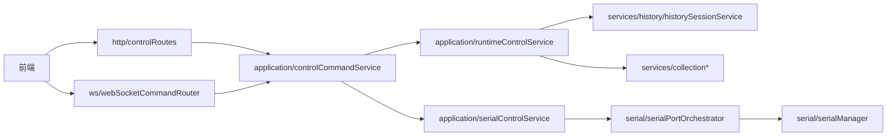

# 后端阅读入口

这份文档只回答一个问题：**现在代码拆开以后，应该从哪里看？**

长文档在 `backend/BACKEND_ARCHITECTURE.md`，这里是日常维护用的短导航。

## 一句话架构

后端现在是“启动编排层 + 串口层 + 传感器运行时 + 业务服务 + 实时通道”的分层结构。

`backend/server/server.js` 不是所有业务逻辑的归宿，它现在主要负责：

- 创建服务实例。
- 注入依赖。
- 保留旧前端/旧 WebSocket 的兼容入口。
- 把运行时变量临时桥接给已经拆出去的模块。

## 核心数据流

```mermaid
flowchart LR
  Sensor["硬件传感器"] --> SerialManager["serial/serialManager<br/>串口生命周期"]
  SerialManager --> ParserManager["serial/serialParserManager<br/>命名 parser"]
  ParserManager --> SensorRuntime["sensors/runtime<br/>传感器协议处理"]
  SensorRuntime --> Dispatch["services/realtime/realtimeFrameDispatchService<br/>旧发送函数适配"]
  Dispatch --> Pipeline["services/realtime/frameOutputPipelineService<br/>入库 + 实时输出"]
  Pipeline --> Storage["collection/database<br/>采集入库"]
  Pipeline --> Gateway["services/realtime/realtimeTelemetryGateway"]
  Gateway --> ChannelBus["channel/channelBus"]
  ChannelBus --> WsSub["services/websocket/websocketSubscriptionService"]
  WsSub --> Frontend["前端实时展示"]
```

## 控制命令流

## 想看某个功能从哪里开始

| 你想看什么 | 入口文件 |
| :--- | :--- |
| 后端启动和依赖装配 | `backend/server/server.js` |
| WebSocket 连接和旧消息入口 | `backend/server/webSocketHandlerFactory.js` |
| WebSocket 上下文怎么注入 | `backend/server/webSocketContextFactory.js` |
| WebSocket 历史/框选命令 | `backend/services/websocket/webSocketHistoryCommandService.js` |
| HTTP 控制接口 | `backend/http/controlRoutes.js` |
| 控制命令统一入口 | `backend/application/controlCommandService.js` |
| 串口打开/关闭规则 | `backend/serial/serialPortOrchestrator.js` |
| 串口实例生命周期 | `backend/serial/serialManager.js` |
| 串口 parser 通道 | `backend/serial/serialParserManager.js` |
| 传感器类型和元数据 | `backend/sensors/registry.js` |
| 旧串口协议主入口 | `backend/sensors/runtime/legacySerialFrameRuntime.js` |
| 1024 坐面矩阵处理 | `backend/sensors/runtime/sit1024FrameProcessor.js` |
| 靠背/头枕矩阵处理 | `backend/sensors/runtime/backHead1024FrameProcessor.js` |
| 小床 12B 处理 | `backend/sensors/runtime/smallBed12BRuntime.js` |
| 实时帧输出旧函数适配 | `backend/services/realtime/realtimeFrameDispatchService.js` |
| 实时帧入库和推送管线 | `backend/services/realtime/frameOutputPipelineService.js` |
| 历史日期和历史加载 | `backend/services/history/historySessionService.js` |
| 回放帧构造 | `backend/services/playback/playbackFrameService.js` |
| 回放定时器 | `backend/services/playback/playbackTimerService.js` |
| 采集频率/磁盘保护 | `backend/services/collection/collectionService.js` |
| 批量入库队列 | `backend/services/collection/collectionInsertQueueService.js` |
| CSV 下载 | `backend/services/export/csvDownloadService.js` |
| 授权密钥读取/写入 | `backend/license/licenseKeyStore.js` |
| 授权内容校验 | `backend/license/licenseValidationService.js` |
| 运行路径配置 | `backend/server/serverPathConfig.js` |
| 服务关闭流程 | `backend/server/serverShutdownOrchestrator.js` |

## 命名规则

| 后缀 | 含义 | 例子 |
| :--- | :--- | :--- |
| `Manager` | 管资源生命周期或注册表 | `serialManager` |
| `Orchestrator` | 编排多个服务和资源，不做底层算法 | `serialPortOrchestrator` |
| `Service` | 一个明确业务能力 | `historySessionService` |
| `Runtime` | 传感器协议处理或运行时状态 | `smallBed12BRuntime` |
| `Processor` | 处理一类帧/矩阵数据 | `sit1024FrameProcessor` |
| `Factory` | 创建上下文、server、app 或复杂对象 | `webSocketContextFactory` |
| `Store` | 保存运行时状态 | `runtimeStateStore` |

## 当前阅读建议

如果你只是想理解系统，不要从 `server.js` 一行一行往下看。

推荐顺序：

1. 先看本文件的两张图。
2. 看 `backend/server/server.js` 顶部的“阅读路线”注释。
3. 想看实时数据，就走 `serial -> sensors/runtime -> frameOutputPipeline -> websocketSubscription`。
4. 想看控制命令，就走 `http/ws -> controlCommandService -> application service`。
5. 想看历史回放，就从 `historySessionService` 开始。

## 还没完全完成的迁移

- `server.js` 仍保留一些旧变量，例如 `file`、`pointArr`、`db`、`localFlag`、`interval`。
- 一些模块通过 getter/setter 访问旧变量，这是迁移期的兼容桥。
- `backend/processing/openWeb.js` 仍然很大，后续应该按线序、矩阵变换、传感器映射继续拆。
- 部分旧注释存在编码乱码，后续应按模块逐步清理。

## Services 文件夹分类

`backend/services` 现在不再平铺业务文件，而是按领域拆成下面这些目录：

| 子目录 | 职责 |
| :--- | :--- |
| `collection/` | 采集频率、采集状态、磁盘保护、采集帧入库载荷和批量入库队列。 |
| `history/` | 历史日期查询、历史数据加载、历史回放会话、历史帧转换和历史数据维护。 |
| `playback/` | 回放帧 payload 构造、播放/停止/调速定时器管理。 |
| `realtime/` | 实时帧输出管线、旧实时发送函数适配、标准 telemetry 发布网关。 |
| `websocket/` | WebSocket 连接心跳、消息解析、订阅、广播和旧历史/框选命令兼容。 |
| `lifecycle/` | 后端关闭流程、超时保护、串口/HTTP/WebSocket 资源释放。 |
| `petcare/` | 宠物看护和 jqbed/smallBed 生命体征算法运行时。 |
| `export/` | CSV 下载、导出路径校验、导出进度和导出结果消息。 |

## 新增阅读入口

| 你想看什么 | 入口文件 |
| :--- | :--- |
| 系统时间同步 | `backend/server/systemTimeSyncService.js` |

## WebSocket 相关阅读入口

| 你想看什么 | 入口文件 |
| :--- | :--- |
| WebSocket 连接和旧消息入口 | `backend/server/webSocketHandlerFactory.js` |
| WebSocket 上下文装配 | `backend/server/webSocketContextFactory.js` |
| WebSocket 旧状态 accessor | `backend/runtime/webSocketContextAccessorFactory.js` |

## Legacy Runtime 相关阅读入口

| 你想看什么 | 入口文件 |
| :--- | :--- |
| Legacy runtime 上下文装配 | `backend/sensors/runtime/legacySerialContextFactory.js` |
| Legacy runtime 串口绑定 | `backend/sensors/runtime/legacySerialRuntimeBinding.js` |
| Legacy runtime 状态 accessor 底层工厂 | `backend/runtime/legacyRuntimeAccessorFactory.js` |

## Display Systems 相关阅读入口

| 你想看什么 | 入口文件 |
| :--- | :--- |
| 展示系统配置层 | `backend/displaySystems/README.md` |
| Manifest 校验 | `backend/displaySystems/displaySystemConfigValidator.js` |
| 配置目录加载 | `backend/displaySystems/displaySystemConfigLoader.js` |
| 展示系统注册表 | `backend/displaySystems/displaySystemRegistry.js` |
