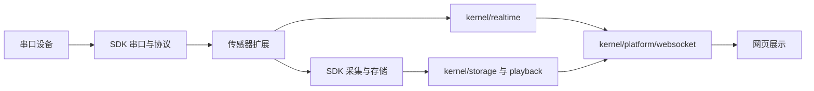

# Shroom 后端阅读入口

> 最后更新：2026-08-29

`backend/` 只保留 Electron 应用装配、稳定能力分层和应用扩展宿主。可复用的协议、串口、采集、存储与处理实现以 `sdk/backend/` 为单一来源，本次目录整理没有修改 SDK，也没有复制第二套实现。

## 当前目录

```text
backend/
├─ common/
│  └─ logger.js                 # Electron 固定日志桥
├─ runtime/
│  └─ index.js                  # Electron 固定后端桥
├─ kernel/
│  ├─ platform/                 # 启动、命令、HTTP、WebSocket、授权和运行态
│  ├─ serial/                   # 应用侧串口控制与编排
│  ├─ storage/                  # 应用侧数据库装配与历史查询
│  ├─ playback/                 # 历史帧构造与回放
│  ├─ csv/                      # CSV 导出
│  ├─ realtime/                 # 实时帧分发
│  └─ algorithm-channel/        # Node/Python 简单算法通道
├─ extension-host/              # 展示系统扩展宿主
│  ├─ manifest/                # 配置发现、校验与展示定义
│  ├─ runtime/                 # 通道规划、绑定、调度与帧处理
│  └─ workspace/               # 用户展示系统工作区
├─ extensions/
│  ├─ built-in-sensors/         # 随应用交付的传感器运行扩展
│  └─ examples/                 # 展示系统示例清单
├─ compatibility/               # 只读迁移基线与旧数据工具
└─ tests/                       # 后端测试
```

后端一级目录已经从零散技术目录收拢为以上七类。原 `backend/serial`、`backend/services`、`backend/server`、`backend/displaySystems` 等旧物理路径及其 CommonJS 转发层已经移除。

## 固定边界

- Electron 仍只通过 `backend/runtime/index.js` 启停后端，通过 `backend/common/logger.js` 记录日志；这两个入口路径和导出契约保持不变。
- `sdk/backend/` 是协议解析、串口底层、采集、存储和数据处理的单一来源；应用层通过 `@shroom/backend/...` 使用它。
- 硬件协议字节定义、线序语义、历史数据库结构和历史数据格式没有因目录迁移而改变。
- `extension-host/` 负责加载和校验扩展，`extensions/` 放具体传感器或展示系统交付物；扩展不得反向修改固定 Electron 入口。

## 多串口与单 WebSocket

- 一份 `SerialManager` 按 manifest `serialRole` 管理任意数量的物理串口；每个 COM 口仍有独立串口实例。
- HTTP `serial.open` / `serial.close` 接受当前 manifest 声明的动态角色，未声明角色会被拒绝；协议与波特率只取 manifest。
- 批量打开会先校验所有角色，展示系统切换会统一关闭旧系统的全部动态串口，避免部分执行或遗留重连。
- 本地只监听 `19999` 一个 WebSocket 端口，数据按 manifest `outputChannel` 动态订阅与发布，不维护 `sit/back/head` 固定通道表。
- `sit/back/head` 仅作为旧配置、旧数据字段和历史存储的兼容值继续存在。
- 串口、采集、回放、历史和导出控制优先使用 HTTP；WebSocket 负责实时帧、订阅、系统事件与旧命令兼容。

## 运行链路



## 从哪里开始修改

| 目标 | 入口 |
| --- | --- |
| Electron 启停后端 | `backend/runtime/index.js` |
| HTTP 路由、静态网页与进程生命周期 | `backend/kernel/platform/{http,bootstrap}/` |
| 传输无关控制命令和 handler 注册 | `backend/kernel/platform/commands/` |
| server 进程状态与 legacy 状态迁移 | `backend/kernel/platform/runtime/`，见其 `README.md` |
| 单端口 WebSocket 传输、逻辑通道订阅和兼容命令入口 | `backend/kernel/platform/websocket/`，见其 `README.md` |
| 应用侧串口打开、关闭与通道编排 | `backend/kernel/serial/` |
| 数据库装配与历史查询 | `backend/kernel/storage/` |
| 历史回放与框选/曲线分析 | `backend/kernel/playback/` |
| CSV 与实时输出 | `backend/kernel/{csv,realtime}/` |
| Display System 算法通道 | `backend/kernel/algorithm-channel/` |
| 新传感器运行时 | `backend/extensions/built-in-sensors/`，展示系统配置通过 `backend/extension-host/` 接入 |
| 展示系统 manifest、运行时与工作区 | `backend/extension-host/{manifest,runtime,workspace}/` |
| 协议、串口底层、采集、存储、处理复用能力 | `sdk/backend/` |

扩展实现、扩展宿主、平台运行态和 WebSocket 目录都提供逐文件 README。更多信息见
[ARCHITECTURE_MAP.md](./ARCHITECTURE_MAP.md) 和 [BACKEND_ARCHITECTURE.md](./BACKEND_ARCHITECTURE.md)。

## 验证

```powershell
npm test
npm run sdk:backend-smoke
```
