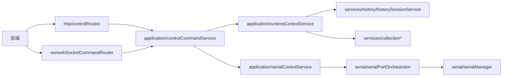

# 后端阅读入口

## 2026-08-03 串口协议预设库

| 想看什么 | 入口 |
| :--- | :--- |
| 目前支持哪些串口协议、一帧里每个字节是什么 | `backend/serial/protocols/README.md`（10 种协议各一份同名 md） |
| 可直接加载的预设（`protocol` 段可整段粘进 manifest） | `backend/serial/protocols/*.json` |
| 预设加载、用户目录覆盖、坏文件降级 | `backend/serial/protocols/index.js` |
| 用户自己加协议放哪 | `<runtimeWritableRoot>/serial-protocols/*.json`，同 id 覆盖内置 |
| 协议声明格式与校验（预设复用的就是它，没有第二套 schema） | `backend/displaySystems/displaySystemProtocol.js` |
| 列出预设的接口 | `GET /api/serial/protocols`（`backend/http/controlRoutes.js`） |
| 预设怎么变成「新建传感器」的模板卡片 | `backend/displaySystems/displaySystemWorkspaceService.js` 的 `buildSerialTemplateFromPreset` |
| 预设目录路径在哪拼、谁注入给 Builder 目录 | `backend/server/appRuntimeFactory.js` |
| 测试 | `backend/tests/serial/serialProtocolPresets.test.js`、`backend/tests/http/serialProtocolsApi.test.js` |

## 2026-07-08 Backend SDK Demo

| Need | Entry |
| :--- | :--- |
| Node SDK client for backend HTTP/WS | `sdk/src/backend/BackendSdkClient.js` |
| Runnable SDK demo | `sdk/examples/backend-sdk-demo.js` |
| Demo command | `npm run sdk:demo` |
| Local serial chain demo | `sdk/examples/serial-chain-demo.js` / `npm run sdk:serial-demo` |
| SDK client test | `backend/tests/sdk/backendSdkClient.test.js` |

The demo uses the public backend contract instead of importing `server.js` internals.

## 2026-07-08 Server Bootstrap Recovery

| Need | Entry |
| :--- | :--- |
| Bootstrap imports and legacy state bridge | `backend/server/server.js` |
| Sensor runtime factory split | `backend/server/sensorProcessorFactory.js`, `backend/server/smallBedRuntimeFactory.js`, `backend/server/handRuntimeFactory.js` |

This repair restored module-load dependencies that are still needed before the next store-native migration.

## 2026-07-08 Sensor Runtime Factory Entries

| Need | Entry |
| :--- | :--- |
| 1024 sit/back/head processor wiring | `backend/server/sensorProcessorFactory.js` |
| Small-bed 12B runtime wiring | `backend/server/smallBedRuntimeFactory.js` |
| Hand full-packet and double-packet runtime wiring | `backend/server/handRuntimeFactory.js` |
| Tests | `backend/tests/server/sensorProcessorFactory.test.js`, `backend/tests/server/smallBedRuntimeFactory.test.js`, `backend/tests/server/handRuntimeFactory.test.js` |

`server.js` now calls these factory entries instead of holding their detailed dependency maps directly.

## 2026-07-08 新增阅读入口

| 想看什么 | 入口 |
| :--- | :--- |
| 旧状态命令写入如何走 store-backed | `backend/server/runtimeStatePatchFactory.js` |
| Display Systems 和 legacy parser 的并行/保护策略 | `backend/displaySystems/displaySystemRuntimePolicy.js` |
| Display Systems parser listener 生命周期 | `backend/displaySystems/displaySystemRuntimeDispatcher.js` |
| jqbed manifest 迁移模板 | `backend/displaySystems/examples/jqbed-manifest-demo/` |
| hand glove manifest 迁移模板 | `backend/displaySystems/examples/hand-glove-manifest-demo/` |
| 后端测试总入口 | `backend/tests/run-tests.js` |

当前 Display Systems 默认不会抢 `sit/back/head/sensor` 旧通道。模板使用 `runtimeMode: "template"`；需要并行验证时才把 manifest metadata 改成 `runtimeMode: "parallel"`。

## 2026-07-08 Server Factory 新入口

| 想看什么 | 入口 |
| :--- | :--- |
| Display Systems runtime binding/dispatcher 生命周期 | `backend/server/displaySystemRuntimeFactory.js` |
| legacy runtime state store 初始化和 store-backed key 清单 | `backend/server/runtimeStateStoreFactory.js` |
| Display Systems runtime factory 测试 | `backend/tests/server/displaySystemRuntimeFactory.test.js` |
| runtime state store factory 测试 | `backend/tests/server/runtimeStateStoreFactory.test.js` |

## 2026-07-08 Legacy OpenWeb 归档

| 想看什么 | 入口 |
| :--- | :--- |
| 旧 openWeb 对比基线 | `backend/legacy/openWeb.js` |
| 旧文件归档说明 | `backend/legacy/README.md` |

`backend/processing/openWeb.js` 已经移走，processing 目录只保留新分类入口和真实迁出的实现。需要做新功能时不要再从 legacy 目录引入能力，只有回归测试可以把它作为旧输出基线。

## 2026-07-08 Runtime Context 新入口

| 想看什么 | 入口 |
| :--- | :--- |
| 旧状态读取如何 store 优先、闭包兜底 | `backend/server/runtimeContextFactory.js` |
| frame pipeline 如何获取当前传感器和三路数据库 | `backend/server/framePipelineFactory.js` |
| runtime context 测试 | `backend/tests/server/runtimeContextFactory.test.js` |
| frame pipeline factory 测试 | `backend/tests/server/framePipelineFactory.test.js` |

这份文档只回答一个问题：**现在代码拆开以后，应该从哪里看？**

长文档在 `backend/BACKEND_ARCHITECTURE.md`，这里是日常维护用的短导航。

## 一句话架构

后端现在是“启动编排层 + 串口层 + 传感器运行时 + 业务服务 + 实时通道”的分层结构。

`backend/server/server.js` 不是所有业务逻辑的归宿，它现在主要负责：

- 创建服务实例。
- 注入依赖。
- 保留旧前端/旧 WebSocket 的兼容入口。
- 把运行时变量临时桥接给已经拆出去的模块。

## 核心数据流

```mermaid
flowchart LR
  Sensor["硬件传感器"] --> SerialManager["serial/serialManager<br/>串口生命周期"]
  SerialManager --> ParserManager["serial/serialParserManager<br/>命名 parser"]
  ParserManager --> SensorRuntime["sensors/runtime<br/>传感器协议处理"]
  SensorRuntime --> Dispatch["services/realtime/realtimeFrameDispatchService<br/>旧发送函数适配"]
  Dispatch --> Pipeline["services/realtime/frameOutputPipelineService<br/>入库 + 实时输出"]
  Pipeline --> Storage["collection/database<br/>采集入库"]
  Pipeline --> Gateway["services/realtime/realtimeTelemetryGateway"]
  Gateway --> ChannelBus["channel/channelBus"]
  ChannelBus --> WsSub["services/websocket/websocketSubscriptionService"]
  WsSub --> Frontend["前端实时展示"]
```

## 控制命令流

## 想看某个功能从哪里开始

| 你想看什么 | 入口文件 |
| :--- | :--- |
| 后端启动和依赖装配 | `backend/server/server.js` |
| WebSocket 连接和旧消息入口 | `backend/server/webSocketHandlerFactory.js` |
| WebSocket 上下文怎么注入 | `backend/server/webSocketContextFactory.js` |
| WebSocket 历史/框选命令 | `backend/services/websocket/webSocketHistoryCommandService.js` |
| HTTP 控制接口 | `backend/http/controlRoutes.js` |
| 控制命令统一入口 | `backend/application/controlCommandService.js` |
| 串口打开/关闭规则 | `backend/serial/serialPortOrchestrator.js` |
| 串口实例生命周期 | `backend/serial/serialManager.js` |
| 串口 parser 通道 | `backend/serial/serialParserManager.js` |
| 传感器类型和元数据 | `backend/sensors/registry.js` |
| 旧串口协议主入口 | `backend/sensors/runtime/legacySerialFrameRuntime.js` |
| 1024 坐面矩阵处理 | `backend/sensors/runtime/sit1024FrameProcessor.js` |
| 靠背/头枕矩阵处理 | `backend/sensors/runtime/backHead1024FrameProcessor.js` |
| 小床 12B 处理 | `backend/sensors/runtime/smallBed12BRuntime.js` |
| 实时帧输出旧函数适配 | `backend/services/realtime/realtimeFrameDispatchService.js` |
| 实时帧入库和推送管线 | `backend/services/realtime/frameOutputPipelineService.js` |
| 一帧到底存不存（采集开关 / 频率 / 磁盘三个条件） | `backend/services/collection/collectionFrameStorageService.js` 的 `canStore()` |
| 历史日期和历史加载 | `backend/services/history/historySessionService.js` |
| 回放帧构造 | `backend/services/playback/playbackFrameService.js` |
| 回放定时器 | `backend/services/playback/playbackTimerService.js` |
| 采集频率/磁盘保护 | `backend/services/collection/collectionService.js` |
| 批量入库队列 | `backend/services/collection/collectionInsertQueueService.js` |
| CSV 下载 | `backend/services/export/csvDownloadService.js` |
| 授权密钥读取/写入 | `backend/license/licenseKeyStore.js` |
| 授权内容校验 | `backend/license/licenseValidationService.js` |
| 运行路径配置 | `backend/server/serverPathConfig.js` |
| 服务关闭流程 | `backend/server/serverShutdownOrchestrator.js` |

## 命名规则

| 后缀 | 含义 | 例子 |
| :--- | :--- | :--- |
| `Manager` | 管资源生命周期或注册表 | `serialManager` |
| `Orchestrator` | 编排多个服务和资源，不做底层算法 | `serialPortOrchestrator` |
| `Service` | 一个明确业务能力 | `historySessionService` |
| `Runtime` | 传感器协议处理或运行时状态 | `smallBed12BRuntime` |
| `Processor` | 处理一类帧/矩阵数据 | `sit1024FrameProcessor` |
| `Factory` | 创建上下文、server、app 或复杂对象 | `webSocketContextFactory` |
| `Store` | 保存运行时状态 | `runtimeStateStore` |

## 当前阅读建议

如果你只是想理解系统，不要从 `server.js` 一行一行往下看。

推荐顺序：

1. 先看本文件的两张图。
2. 看 `backend/server/server.js` 顶部的“阅读路线”注释。
3. 想看实时数据，就走 `serial -> sensors/runtime -> frameOutputPipeline -> websocketSubscription`。
4. 想看控制命令，就走 `http/ws -> controlCommandService -> application service`。
5. 想看历史回放，就从 `historySessionService` 开始。

## 还没完全完成的迁移

- `server.js` 仍保留一些旧变量，例如 `file`、`pointArr`、`db`、`localFlag`、`interval`。
- 一些模块通过 getter/setter 访问旧变量，这是迁移期的兼容桥。
- `backend/processing/openWeb.js` 仍然很大，后续应该按线序、矩阵变换、传感器映射继续拆。
- 部分旧注释存在编码乱码，后续应按模块逐步清理。

## Services 文件夹分类

`backend/services` 现在不再平铺业务文件，而是按领域拆成下面这些目录：

| 子目录 | 职责 |
| :--- | :--- |
| `collection/` | 采集频率、采集状态、磁盘保护、采集帧入库载荷和批量入库队列。 |
| `history/` | 历史日期查询、历史数据加载、历史回放会话、历史帧转换和历史数据维护。 |
| `playback/` | 回放帧 payload 构造、播放/停止/调速定时器管理。 |
| `realtime/` | 实时帧输出管线、旧实时发送函数适配、标准 telemetry 发布网关。 |
| `websocket/` | WebSocket 连接心跳、消息解析、订阅、广播和旧历史/框选命令兼容。 |
| `lifecycle/` | 后端关闭流程、超时保护、串口/HTTP/WebSocket 资源释放。 |
| `petcare/` | 宠物看护和 jqbed/smallBed 生命体征算法运行时。 |
| `export/` | CSV 下载、导出路径校验、导出进度和导出结果消息。 |

## 新增阅读入口

| 你想看什么 | 入口文件 |
| :--- | :--- |
| 系统时间同步 | `backend/server/systemTimeSyncService.js` |

## WebSocket 相关阅读入口

| 你想看什么 | 入口文件 |
| :--- | :--- |
| WebSocket 连接和旧消息入口 | `backend/server/webSocketHandlerFactory.js` |
| WebSocket 上下文装配 | `backend/server/webSocketContextFactory.js` |
| WebSocket 旧状态 accessor | `backend/runtime/webSocketContextAccessorFactory.js` |

## Legacy Runtime 相关阅读入口

| 你想看什么 | 入口文件 |
| :--- | :--- |
| Legacy runtime 上下文装配 | `backend/sensors/runtime/legacySerialContextFactory.js` |
| Legacy runtime 串口绑定 | `backend/sensors/runtime/legacySerialRuntimeBinding.js` |
| Legacy runtime 状态 accessor 底层工厂 | `backend/runtime/legacyRuntimeAccessorFactory.js` |

## Display Systems 相关阅读入口

| 你想看什么 | 入口文件 |
| :--- | :--- |
| 展示系统配置层 | `backend/displaySystems/README.md` |
| Manifest 校验 | `backend/displaySystems/displaySystemConfigValidator.js` |
| 配置目录加载 | `backend/displaySystems/displaySystemConfigLoader.js` |
| 展示系统注册表 | `backend/displaySystems/displaySystemRegistry.js` |

## Display Systems HTTP 发现接口

| 你想看什么 | 入口 |
| :--- | :--- |
| 展示系统列表 | `GET /api/display-systems` |
| 单个展示系统详情 | `GET /api/display-systems/:id` |
| SDK 能力快照 | `GET /api/sdk/contract` 里的 `displaySystems` 字段 |
| 运行时扫描目录 | `runtimeResourceRoot/display-systems`、`runtimeResourceRoot/displaySystems`、`runtimeWritableRoot/display-systems`、`runtimeWritableRoot/displaySystems` |

这个入口现在只负责发现和查询配置，不直接处理串口数据。实时数据仍然走 `serial -> sensors/runtime -> frameOutputPipeline -> websocketSubscription`。

## 本轮架构优化入口

| 你想看什么 | 入口 |
| :--- | :--- |
| 旧串口 runtime 显式依赖 | `backend/sensors/runtime/legacySerialFrameRuntime.js` |
| 展示系统运行时发现 | `backend/displaySystems/displaySystemRuntimeDiscovery.js` |
| runtime 旧 server 懒加载兼容入口 | `backend/runtime/index.js` |

当前重点变化：后端已经没有 `with (ctx)`，展示系统扫描细节也不再堆在 `server.js` 里。

## Processing 分类入口

| 你想看什么 | 入口 |
| :--- | :--- |
| processing 总入口 | `backend/processing/index.js` |
| 线序/点位映射 | `backend/processing/lineOrders.js` |
| 矩阵清零/形状变换 | `backend/processing/matrixTransforms.js` |
| 压力换算 | `backend/processing/pressureTransforms.js` |
| 插值/平滑 | `backend/processing/interpolation.js` |
| 时间格式化 | `backend/processing/timeFormatters.js` |
| 打包前端静态服务 | `backend/processing/webStaticServer.js` |

`openWeb.js` 现在仍是旧实现仓库，但后端和 SDK 新入口已经通过这些分类 facade 访问。

## Processing 已迁出的真实实现

| 能力 | 当前位置 |
| :--- | :--- |
| 32x32 断线修补 `zeroLine` | `backend/processing/matrixTransforms.js` |
| 任意正方矩阵断线修补 `zeroLineMatrix` | `backend/processing/matrixTransforms.js` |
| 小床固定坏列修补 `smallBedZero` | `backend/processing/matrixTransforms.js` |
| 时间格式化 `timeStampToDate` / `timeStampTo_Date` / `timeStampToDateNum` | `backend/processing/timeFormatters.js` |
| 打包前端静态服务 `openWeb` | `backend/processing/webStaticServer.js` |
| 区域压力统计 `calPressArr` | `backend/processing/pressureTransforms.js` |
| 压力换算 `pressToN` / `carFitting` / `mmghToPress` | `backend/processing/pressureTransforms.js` |
| 主床垫线序 `jqbed` | `backend/processing/lineOrders.js` |
| 新手部线序 `newHand` | `backend/processing/lineOrders.js` |
| 温度床线序和温度抽取 `tempFullBed` | `backend/processing/lineOrders.js` |

这些函数已经不是简单代理 `openWeb.js`，后续同类纯函数继续按这个方式迁出。

## 2026-07-07 本轮架构优化

| 优化点 | 结果 |
| :--- | :--- |
| Display Systems runtime 定义 | 新增 `backend/displaySystems/displaySystemDefinitionBuilder.js`，manifest 现在可以生成 `sensorDefinition`、`parserChannels` 和前端可读 `displayMetadata`。 |
| Display Systems 发现服务 | `displaySystemRuntimeDiscovery` 注册配置时会附带 `runtimeDefinition`，列表状态额外返回 `runtimeDefinitions`。 |
| server runtime 装配 | 新增 `backend/server/appRuntimeFactory.js`，`server.js` 不再直接创建 Display Systems runtime discovery。 |
| 复杂线序迁移 | `lineOrders.js` 继续承接 `carSitLine`、`carBackLine`、`wowSitLine`、`wowBackLine`、`footL`、`footR`、`footVideo` 的真实实现。 |
| `openWeb.js` 依赖收缩 | 车座/车背、wow 座/背和脚部线序不再通过旧文件执行；旧文件仍作为手套、手部视频映射和插值等未迁移函数的兼容仓库。 |

剩余重点：手套和手部视频线序中仍有大块点位表，下一步应拆成 `lineOrderDefinitions` 数据文件，再让 `lineOrders.js` 只保留映射执行器。

## 2026-07-07 线序数据定义拆分

| 优化点 | 结果 |
| :--- | :--- |
| 通用线序 mapper | 新增 `backend/processing/lineOrderMapper.js`，提供 1 基 ADC 顺序抽取和坐标填点能力。 |
| 点位定义目录 | 新增 `backend/processing/lineOrderDefinitions/`，把脚部、手部、手套的大点位表从执行逻辑里拆出来。 |
| 手部线序迁移 | `handR`、`handL`、`handRVideo1470506` 已从旧 `openWeb.js` 迁出，并复用 `lineOrderDefinitions/hand.js`。 |
| 手套线序迁移 | `gloves`、`gloves1`、`gloves2`、`gloves0123` 已从旧 `openWeb.js` 迁出，并复用 `lineOrderDefinitions/gloves.js`。 |
| server 路径装配 | `server.js` 改为使用 `serverPathConfig.js` 返回的路径配置，不再手写 packaged/dev 路径判断和目录创建。 |

这一轮后，`lineOrders.js` 的方向变成“执行器入口”，点位表逐步迁入 definitions；`openWeb.js` 剩余重点主要是插值/平滑算法和其它零散视频映射函数。

## 2026-07-07 算法与视频映射继续拆分

| 想改的内容 | 优先入口 |
| :--- | :--- |
| 插值算法 | `backend/processing/interpolationAlgorithms.js` |
| 平滑算法 | `backend/processing/smoothingAlgorithms.js` |
| manifest 可选算法注册 | `backend/processing/algorithmDefinitions/index.js` |
| 零散视频映射/裁剪 | `backend/processing/videoPointMappings.js` |
| 后端整体阅读路线 | `backend/ARCHITECTURE_MAP.md` |

`interpolation.js` 已不再代理旧 `openWeb.js`；`videoPointMappings.js` 已迁出一批小型映射函数，较大的手部视频映射函数先集中代理，后续继续拆点位定义。

## 2026-07-07 OpenWeb 依赖继续收缩

| 当前状态 | 说明 |
| :--- | :--- |
| `lineOrders.js` | 已不再依赖旧 `openWeb.js`。 |
| `videoPointMappings.js` | 已不再依赖旧 `openWeb.js`。 |
| `matrixTransforms.js` | 已移除对旧视频映射的 re-export。 |
| `pressureTransforms.js` | 已迁出小床系列和压力换算函数，不再依赖旧 `openWeb.js`。 |
| `displaySystems/displaySystemRuntimeChannelPlanner.js` | 已能从 manifest 生成实时链路计划，但还不执行串口绑定。 |

`processing` 聚合入口已经彻底断开对旧 `openWeb.js` 的直接依赖；如果继续瘦 `server.js`，优先拆 `runtimeBindingsFactory.js` 和 `serialRuntimeFactory.js`。

## 2026-07-07 测试与配置化执行器

| 新增内容 | 说明 |
| :--- | :--- |
| `backend/processing/configMappingExecutor.js` | 支持读取/执行 JSON 风格的 `line-order`、`point-order` 配置，为 Display Systems 从配置生成展示链路做准备。 |
| `backend/tests/processing/*.test.js` | 固化线序、视频映射、压力转换和配置化 mapper 的回归测试。 |
| `backend/tests/displaySystems/runtimeChannelPlanner.test.js` | 固化 manifest 到 runtime channel plan 的结构测试。 |
| `package.json` | `npm test` 改为运行后端迁移回归测试。 |

## 2026-07-07 新增阅读入口

| 想看什么 | 入口文件 |
| :--- | :--- |
| 串口运行时装配 | `backend/server/serialRuntimeFactory.js` |
| WebSocket 运行时装配 | `backend/server/websocketRuntimeFactory.js` |
| Legacy 串口 runtime 绑定装配 | `backend/server/runtimeBindingsFactory.js` |
| Display Systems runtime channel 注册表 | `backend/displaySystems/displaySystemRuntimeRegistry.js` |
| Display Systems JSON 帧处理器 | `backend/displaySystems/displaySystemFrameProcessorFactory.js` |
| Display Systems runtime 绑定 | `backend/displaySystems/displaySystemRuntimeBinder.js` |
| Display Systems HTTP 契约测试 | `backend/tests/http/displaySystemsApi.test.js` |

现在 `GET /api/display-systems` 不只返回 manifest 发现结果，也会返回 `runtimeChannelRegistry` 和 `runtimeBindings`。这表示配置已经进入运行时注册/绑定层，但仍不会自动打开物理串口。

## 2026-07-07 实时接管入口

| 想看什么 | 入口文件 |
| :--- | :--- |
| Display Systems parser 数据接管 | `backend/displaySystems/displaySystemRuntimeDispatcher.js` |
| Display Systems 配置文件校验 | `backend/displaySystems/displaySystemConfigFileValidator.js` |
| 配置化展示系统样板 | `backend/displaySystems/examples/byte-matrix-demo/` |
| WS command router 契约测试 | `backend/tests/ws/webSocketCommandRouter.test.js` |

现在 Display Systems 的状态分三层：

- `runtimeChannelRegistry`：manifest 生成的通道计划已经注册。
- `runtimeBindings`：通道计划已经解析到 parser、processor 和输出 pipeline。
- `runtimeDispatcher`：已绑定通道已经挂到 `serialParserManager.onData(...)`。

物理串口生命周期仍由 `serialManager` 管理；Display Systems 接管的是 parser 产出后的配置化处理链路。

## 2026-07-08 新增阅读入口

| 想看什么 | 入口文件 |
| :--- | :--- |
| 旧 runtime/serial command 如何写回状态 | `backend/server/runtimeStatePatchFactory.js` |
| 262 字节手套帧处理 | `backend/sensors/runtime/legacyGloveFrameProcessor.js` |
| smallBed12B manifest 迁移模板 | `backend/displaySystems/examples/small-bed-12b-manifest-demo/` |
| runtime factory 装配测试 | `backend/tests/server/runtimeFactories.test.js` |

这一轮没有把所有旧变量一次性迁到 store，而是先把 command 写状态的规则集中起来。这样后续替换 `file/baudRate/localFlag/db/nowDate` 时可以在一个 factory 内逐项迁移。
## 2026-07-08 Runtime Context 读取入口继续扩大

| 想看什么 | 入口 |
| :--- | :--- |
| 旧状态读取如何 store 优先、闭包兜底 | `backend/server/runtimeContextFactory.js` |
| 哪些 server.js 链路已改用 runtimeContext | `backend/server/server.js` 中历史回放、CSV/历史维护、WS command、shutdown、legacy 串口 runtime getter |
| runtime context 测试 | `backend/tests/server/runtimeContextFactory.test.js` |

当前策略是先统一读取入口，setter 暂时兼容旧闭包写入；等旧前端命令和 legacy runtime 进一步收缩后，再把变量本体迁成更纯的 store-native 状态。
