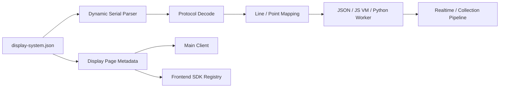

# Display Systems

## 2026-07-31 display.chartAppearance / display.chartCards 与两条写路由

`display` 段现在有三块外观配置，正好对应用户在主界面零件栏上能拖出来的三样东西：

| 字段 | 管什么 | 前端偏好键里的对应字段 |
| :--- | :--- | :--- |
| `display.canvas` | 主画布外观 | `selection.canvas` |
| `display.chartAppearance` | 侧栏 Pressure Data / Pressure Area 曲线外观 | `selection.charts` |
| `display.chartCards` | 侧栏图表卡片清单 | 另一个键 `shroom.formulaCharts.v1.<matrixName>` |

```json
"display": {
  "widgets": [{ "id": "main", "type": "heatmap", "source": "sitData" }],
  "canvas": { "colormap": { "id": "viridis", "reverse": false }, "overlays": ["legend"] },
  "chartAppearance": { "colormap": { "id": "inferno", "reverse": false }, "overlays": ["gridLines", "peakMarker"] },
  "chartCards": [
    { "templateId": "raw-peak", "name": "峰值压力", "formula": "rawMax()", "unit": "kPa", "decimals": 1, "color": "#4aa3ff" }
  ]
}
```

**为什么不叫 `display.charts`。** 那个名字对得上 `selection.charts`（外观），却会被直觉理解成「卡片清单」—— 两样东西挤一个名字是个必踩的坑，所以拆成两个各自望文生义的字段。

`chartAppearance` 与 `canvas` 结构同构，只是**没有 `widgets`**（曲线画布不是 widget 网格），且叠加层是画布白名单的**子集**：`gridLines` / `axes` / `peakMarker` / `valueLabels`，**不含 `legend`**（曲线画布只有 300×150，色带画上去会盖住曲线）。白名单在 `displaySystemCanvasCatalog.js` 的 `CHART_OVERLAYS`，由 `buildDisplaySystemBuilderCatalog()` 的 `chartOverlays` 字段下发。

`chartCards` 的每一条就是一张公式图表定义：`templateId`（对应 `formulaChartTemplates.js` 的模板）/ `name` / `formula` / `unit` / `decimals` / `color`。上限 `DISPLAY_CHART_CARD_LIMIT = 6`，与前端 `FORMULA_CHART_LIMIT` 同值。

坏值的两种待遇沿用 `display.canvas` 的既有纪律：

- **归一丢弃** —— 未知配色 id、未知叠加层名（`chartAppearance` 里的 `legend` 就属于未知）、缺 `formula` 的卡片条目；`decimals` 压到 0–6，超上限的卡片被截断。坏配置只该退回默认外观，不该把展示系统卡死。
- **校验报错** —— 显式写错的 `colormap.id`、非白名单叠加层成员、`chartCards` 不是数组、条目缺 `formula`、`decimals` 越界、`templateId` 重复。写错了要在保存时就知道，而不是保存成功却静默变回默认。

**后端不校验公式本身**，只检查它是非空字符串。AST 解析器 `formulaChartRuntime.js` 是前端 ESM 模块，在后端复制一份会立刻变成两份漂移的白名单；真正的关卡是绘制时的 `compileFormulaChartExpression`，它对坏公式已经返回 0。

两个字段都经 `displayMetadata` 转发到前端 `displays/registry.js` 的 `definition.page.chartAppearance` / `definition.page.chartCards`（`canvas` 当初漏过这一步，别再漏）。

### 两条写路由

| 路由 | 用途 |
| :--- | :--- |
| `PATCH /api/display-systems/:id/display` | 保存 —— 只改上面这三段 |
| `POST /api/display-systems/:id/duplicate` | 另存为 —— 递归复制整个目录成新 id，并写入这三段 |

**它们刻意不走 Builder 的 `POST /api/display-systems`（`workspaceService.save()`）。** 那个函数内嵌了配置器的单传感器向导假设：强制 `schemaVersion: 2`、重写 `sensor.matrix` 与 `protocol.decoding`、把 `files` 压成扁平路径（`'line-order.json'`）、重建 `algorithm` 段。拿一份 v3 多传感器 manifest（`sensors[]` + `cushion/line-order.json` 这种嵌套路径）过一遍它，只为了加一个配色，**会把 manifest 改坏**。所以 `saveDisplaySection` 是另一条窄通路：读原文 → 只合并 `display` 下那三段 → `writeJsonAtomic` 写回，其余字段逐字保留。

合并语义：字段是 `undefined` 表示**这次不改**，`null` 表示**删掉**。

**先校验、后归一。** 合并完先跑 `validateDisplayConfig`（显式写错的东西要报错），通过之后再归一（`"iceFire"` 这种字符串简写展开成 `{ id, reverse }`）。落盘的是归一后的规范形态 —— 这个文件是给做二开的人读的，磁盘上就该是规范写法。唯一的例外是 **`canvas.widgets` 要显式删掉**：它缺省的含义是「跟随 `display.widgets`」，前端解析时会把它填成当时那份清单，照原样写回去就冻成一份写死的显式清单，以后改 `display.widgets` 画布反而跟不上了。

`duplicate` 逐文件递归复制源目录（必须递归，v3 有 `cushion/` 这类子目录），不做 JSON 往返重写，于是 v1/v2/v3、`algorithm.js` / `algorithm.py`、`assets/` 全都自动正确。manifest 只重写四处：`id`、`name`、`display` 段、以及 `metadata` —— 其中 **`metadata.origin` 必须显式改成 `'user'`**，`classifyDisplaySystemAccess` 把它当最高优先级的判据，照抄自带系统那份 `'system'` 的话，副本明明躺在可写目录里也会被判成不可编辑；另记一条 `metadata.derivedFrom` 留住来源。

权限方向两条路由不同，别写反：

| | 检查什么 | 自带（只读）展示系统 |
| :--- | :--- | :--- |
| `saveDisplaySection` | `existing.editable === true` | 拒绝，抛 `DISPLAY_SYSTEM_READ_ONLY` |
| `duplicate` | 目标 id 有没有被占（`DISPLAY_SYSTEM_EXISTS`） | **允许** —— 另存为是它唯一的保存出路 |

HTTP 错误码由三条写路由共用的 `respondDisplaySystemWriteError` 映射：`DISPLAY_SYSTEM_EXISTS` → **409**，`DISPLAY_SYSTEM_READ_ONLY` → **403**（不是 400 —— 请求本身没问题，是目标不许写，前端要靠这个区别决定提示语），其余 → 400。

## 2026-07-28 display.canvas 画布配置

`display.canvas` 把「画布长什么样」收敛成一段配置：配色方案、叠加显示层、卡片布局。整段可选，不声明时行为与引入前完全一致。

```json
"display": {
  "widgets": [
    { "id": "main", "type": "heatmap", "label": "压力数据", "source": "sitData", "columnSpan": 8 }
  ],
  "canvas": {
    "colormap": { "id": "classic", "reverse": false },
    "overlays": ["valueLabels", "legend", "peakMarker"],
    "widgets": [
      { "id": "main",  "type": "heatmap",       "label": "压力数据", "source": "sitData", "columnSpan": 8 },
      { "id": "stats", "type": "pressureStats", "label": "压力统计", "source": "sitData", "columnSpan": 4 }
    ]
  }
}
```

字段：

- `colormap.id`：`classic` / `thermal` / `viridis` / `inferno` / `grayscale` / `iceFire` / `jet`。缺省 `classic`，它**逐字复刻**引入配色能力之前的硬编码公式 `hsl(195 - ratio * 195, 88%, 42% + ratio * 8%)`，既有展示系统的观感零变化（前端 `colormaps.test.js` 有一条断言专门守这件事）。`jet` 是老 3D 场景一直在用的那条四段彩虹阶梯（前端 `assets/util/jetLadder.js` 的 `jetRgb`），2026-08-03 才登记成可显式选择的配色 —— 在此之前它只能靠「不选配色」隐式命中。`colormap` 也可以直接写成字符串 `"viridis"`。
- `colormap.reverse`：翻转采样方向，色带的两端互换。
- `overlays`：白名单字符串数组 —— `valueLabels`（格内数值）/ `gridLines`（网格线）/ `legend`（底部色带 + min/max 刻度）/ `axes`（行列号）/ `peakMarker`（最大值描边环）。全是纯绘制，不改 `values`，采集、回放、CSV 和压力统计一律不受影响。
- `widgets`：与顶层 `display.widgets` 同构。**`canvas.widgets` 缺省时读顶层 `display.widgets`**，所以 v1/v2/v3 的老 manifest 都能拿到一份等价画布配置，前端不必再分版本。

坏值的两种待遇是刻意分开的：

- **归一（`normalizeCanvasConfig`）丢弃**未知配色 id 和未知叠加层名，并给 `overlays` 去重。坏配置只该退回默认外观，不该把展示系统卡死 —— 用户偏好存在 `localStorage['display-profile:<displaySystemId>']` 里，一个过期的键值不能让界面打不开。
- **校验（`validateDisplayConfig`）报错**：显式写错的 `colormap.id`、非白名单的 `overlays` 成员、`canvas` 不是对象、`overlays`/`widgets` 不是数组、`canvas.widgets` 里 id 重复，都会在 Builder 保存时就报出来，而不是保存成功却静默变回默认。

可选值目录由 `buildDisplaySystemBuilderCatalog()` 的 `colormaps` / `overlays` 两个字段下发（id + 中文名）。色值实现留在前端 `client/src/components/displaySystem/colormaps.js`，后端 `displaySystemCanvasCatalog.js` 只登记白名单，保证零件栏和校验用的是同一份清单。

三层覆盖在前端 `resolveDisplayProfile` 里解析，优先级 **manifest 顶层 `display.canvas` < `profile.canvas` < 用户偏好 `selection.canvas`**，逐字段合并（profile 只写了 `colormap` 时，`overlays` 仍取顶层）。用户在运行时拖上画布的 widget 会并进 `visibleWidgetIds`，不会被 profile 的可见性过滤吃掉。

### 2026-07-29 补：主界面能落地哪些字段

归一后的 `canvas` 经 `displayMetadata` 到前端 `displays/registry.js`，转发进 `definition.page.canvas`（2026-07-29 之前漏了这一步，manifest 声明的画布默认值到不了前端）。主界面的 3D 场景与二维 widget 支持的字段不同，写 manifest 时按这张表预期：

| 字段 | 二维 widget（Builder / `ManifestDisplayRenderer`） | 主界面 3D 场景 |
| :--- | :--- | :--- |
| `colormap.id` | 生效 | 生效 |
| `colormap.reverse` | 生效 | **不生效** —— 3D 场景的 `classic` 走各自原有的 `jet()`，没有 reverse 这一说；非 classic 配色的 reverse 生效 |
| `overlays: legend` | 生效 | 生效（底部零件栏里的色带，由零件栏自己画在 DOM 上） |
| `overlays: valueLabels` / `gridLines` | 生效 | `NumThreeColor1024` 恒为开（数值和格子描边是数字精灵图本身画上去的）；`hand` 是点云，不生效 |
| `overlays: axes` / `peakMarker` | 生效 | 不生效（3D 里没有对应物 / 未实现） |
| `widgets` | 生效 | 不生效 —— 3D 场景只有一块画布，没有 widget 网格 |

主界面的零件栏因此只列配色与图例两类，不把落不了地的选项摆给用户。

零件栏不是 manifest 系统独有的：主界面按**渲染分支**挂载，凡是场景组件真的认 `colormap` 的分支都有，老展示系统（`handSinglePoint`、`normal`、`petCare` 等）用 `display-profile:<definition.type>` 存自己的偏好、不写 manifest。当前认 `colormap` 的是 `NumThreeColor1024` 和 `hand` 两个场景组件；其余约 50 个 legacy scene 组件各有自己的上色写法，还没接。`display.canvas` 对它们只是"默认值无从声明"，运行时偏好照样能用。

### 2026-07-29 补：`selection.charts` 是纯前端字段

侧栏的 Pressure Data / Pressure Area 曲线也能拖零件了，偏好存在同一个 `display-profile:<id>` 键的 `charts` 字段里，结构与 `canvas` **完全同构**（`colormap` / `overlays` / 空的 `widgets`），由前端 `resolveChartAppearance` 解析。

对后端而言要记住的是：`display.canvas` 不会、也不该影响侧栏曲线，两块表面各写各的。当时 manifest 里还没有它的对应字段，图表外观只有"用户偏好"一层；**2026-07-31 补上了 `display.chartAppearance`**（白名单与归一分支见本文档顶部那一节），现在是 manifest 基线在下、用户偏好在上的两层，缺省仍是改动前的纯色曲线。

它的叠加层是画布那份白名单的**子集**：`gridLines` / `axes` / `peakMarker` / `valueLabels` 四个，**不含 `legend`**（曲线画布只有 300×150，色带画上去会盖住曲线）。坏值一律按画布的同一套规则归一丢弃，不报错。

覆盖范围同上：图表零件跟着零件栏的渲染分支走，没挂零件栏的页面侧栏仍是原样。

### 2026-07-30 补：图表卡片清单是**另一个键**

零件栏后来又多了一类「图表卡片」—— 拖一个模板方块，侧栏就多一张实时曲线卡片。这份卡片清单**不在 `display-profile:<id>` 里**，而是存在 `shroom.formulaCharts.v1.<matrixName>`（前端 `client/src/components/aside/formulaChartStore.js` 是它唯一的主人），和公式图表编辑器用的是同一个键、同一份额度（上限 6 张）。

两个键分开是有意的：`selection.canvas` / `selection.charts` 是**纯值变换**（换配色、开关叠加层），而加一张图表是**新增一条带公式的定义**。挤进同一个键会让「零件应用」这条纯函数通路被迫处理副作用。

当时的结论和上一节一样、只是更彻底：manifest 完全管不到它。**2026-07-31 起 `display.chartCards` 可以声明默认卡片**（上限 6 张，超出在归一时截断）。语义是**替换而不是合并** —— 一条条带公式的定义合并没有意义：前端靠 `hasFormulaCharts()` 区分「这个 `matrixName` 从没存过」（用 manifest 那份播种）和「用户主动删空了」（尊重空清单，不再播种）。播种之后这份清单仍然只有 `formulaChartStore.js` 一个主人，跟着 `matrixName` 走，换传感器就换一份。

## 2026-07-27 Manifest v3 多传感器与帧校验

一个展示系统可以声明多个传感器，每个传感器有自己的协议、矩阵、线序、点位和算法。`sensors[]` 是 v3 的唯一数据来源：

```json
{
  "schemaVersion": 3,
  "id": "chair-full",
  "name": "整椅系统",
  "sensors": [
    {
      "id": "cushion",
      "label": "坐垫",
      "outputChannel": "sit",
      "type": "chairFull",
      "matrix": { "rows": 32, "cols": 32 },
      "protocol": {
        "baudRate": 460800,
        "framing": { "type": "fixedLength", "frameLength": 1030 },
        "decoding": { "valueType": "uint8", "byteOffset": 4, "valueCount": 1024 },
        "validation": {
          "header": "AA 55",
          "checksum": { "type": "crc16-modbus", "byteOffset": -1, "range": [2, -2] }
        }
      },
      "files": {
        "lineOrder": "cushion/line-order.json",
        "pointOrder": "cushion/point-order.json",
        "coordinateMap": "cushion/coordinate-map.json"
      },
      "algorithm": { "type": "json", "dataFile": "cushion/algorithm-data.json" }
    },
    { "id": "armLeft", "matrix": { "rows": 1, "cols": 16 }, "protocol": { "…": "…" }, "files": { "…": "…" } }
  ]
}
```

规则：

- `sensors[].id` 在系统内唯一，它同时是 parser 通道键（`${systemId}:${sensorId}`）和串口角色名。
- `outputChannel` 缺省等于 `id`，同一系统内不允许重复。
- 每个条目都要有自己的 `files.lineOrder` 与 `files.pointOrder`；`matrix`、`protocol`、`algorithm` 同样按条目独立生效。
- **v1/v2 自动升格**：旧 manifest 的单数 `sensor` + 顶层 `protocol`/`files`/`algorithm` 会在校验入口按 `sensor.ports` 的每一项展开成 `sensors[]` 条目，逐字段继承顶层配置，行为与升格前完全一致。校验结果同时保留 `sensor`/`files`/`protocol`/`algorithm` 作为第一个条目的别名，既有调用方不受影响。
- 串口开启改为按 manifest 驱动：`appRuntime.displaySystems.listSerialChannels(sensorType)` 列出全部声明通道，控制命令用 `channelPorts: { "armLeft": "COM7" }` 和 `channelClose: ["armLeft"]` 打开/关闭任意路，旧的 `sitPort`/`backPort`/`headPort`/`sensorPort` 字段继续可用。

> ⚠️ **已知限制**：`outputChannel` 为 `sit`/`back`/`head` 的通道走原有 publisher，实时显示与历史入库都不变；其它通道走 `publishAux`，**只有实时显示，不入库、不参与历史回放**。原因是 `collectionFrameStorageService` 只有这三路的记录构造器和数据表。扩展采集存储是独立的一件事。

> ⚠️ **配置器现状**：页面配置器目前仍按单传感器向导产出 manifest（由上面的升格规则接住），多传感器系统需要手写 `display-system.json` 放进用户目录。配置器的多条目编辑另行安排。

帧校验（`protocol.validation`，整段可选，不声明时行为与引入前一致）：

- `header`：期望的帧头字节，写作 `"AA 55"` 或 `[170, 85]`；配合 `headerOffset` 指定起始位置。
- `checksum.type`：`sum8` / `xor8` / `crc16-modbus`（`crc16modbus` 等写法会被归一化）。
- `checksum.byteOffset`：校验字节位置，负数从帧尾倒数（`-1` 是最后一个字节）。
- `checksum.range`：参与计算的区间 `[起始含, 结束不含]`，也可写 `{ "start": 2, "end": -1 }`；缺省为帧头到校验字节之间。
- 校验失败的帧在解码之前就被丢弃，不进入线序映射和算法，并累加 `metrics.droppedFrames` / `metrics.lastDropReason`。`validateFrame` 返回的 `reason` 是稳定短码（`header` / `checksum` / `length`），`detail` 是给日志的说明。

## 2026-07-14 Manifest v2

页面新建配置的实际目录：

- 开发环境：`<projectRoot>/display-systems/<系统ID>/`。
- 打包环境：Electron `app.getPath('userData')/display-systems/<系统ID>/`；Windows 默认通常位于 `%APPDATA%/Shroom/display-systems/<系统ID>/`。
- 固定文件：`display-system.json`、`line-order.json`、`point-order.json`；按真实形状绘图时增加 `coordinate-map.json`，使用 JSON 后端算法时增加 `algorithm-data.json`，使用代码算法时增加 `algorithm.js` 或 `algorithm.py`。

`coordinate-map.json` 与 `point-order.json` 职责不同：前者保存 `rows × cols × [x, y]` 物理坐标，决定点图形状和宽高比；后者保存数据值落到矩阵单元的顺序。配置器导入物理坐标后会自动生成默认 row-major 点序。没有坐标文件的旧系统继续使用规则矩阵渲染。

`display.sidebar` 配置左侧可视化数据面板。`pressure` 可选择总压力、平均压力、最大压力、有效点数和面积，并指定主指标；`area` 可设置有效点阈值、单点面积和面积单位。该面板始终基于映射后的原始压力矩阵统计，不受 `normalize/threshold/smooth` 等前端可视算法影响。

页面配置器的串口主流程按传输形式、是否按分隔符分包、波特率、分隔符/完整帧字节数和 8/12 Bit 数据精度组织。协议模板提供经典 8 Bit 帧、921600 分包协议和经典 12 Bit ADC 三种选择：经典 8 Bit 使用 `1000000 baud + fixedLength + uint8`，帧长度按矩阵点数自动计算；921600 分包协议使用 `AA 55 03 99` 帧尾；12 Bit 使用 `uint16le` 两字节承载。数据展示继续提供热力图总览和数字矩阵。模板参数由 `GET /api/display-systems/catalog` 返回，选择后写入标准 `protocol`、`display` 和 `metadata.builder` 字段。

算法输出支持两种兼容返回值：旧算法继续返回 `number[]`；需要向页面暴露业务结果的算法返回 `{ data, metrics }`。`metrics` 只接受有限数字、字符串或布尔值，并通过实时帧的 `algorithmMetrics` 发布。页面 JSON 算法也可以在 `algorithm-data.json.metrics` 声明安全聚合指标，例如：

```json
{
  "metrics": [
    {
      "id": "supportRate",
      "operation": "activeRatio",
      "threshold": 20,
      "scale": 100
    }
  ]
}
```

左侧通过 `display.sidebar.algorithmMetrics` 定义标签、单位和精度，再使用 `algorithm.supportRate` 作为面板指标或主指标。

采集开启时，带 `displaySystemId` 的帧会以对象格式保存通道矩阵、`normalizedData`、`algorithmMetrics` 和 `metrics`。通用回放服务会恢复这些字段，因此算法指标可以在实时和历史模式下复用；旧设备的数组存储格式保持不变。

运行时按展示系统逐项绑定；协议注册或算法模块初始化失败时，该系统会进入 `error` 状态并记录原因，不会阻止其他展示系统和后端服务启动。

`display.renderers`、`display.visualizationAlgorithms` 和 `display.profiles` 构成可复用的展示方案目录。每个 profile 可以选择已有渲染器、可视算法和 widgets；主前端会显示方案/渲染方式/可视算法菜单，并按展示系统保存用户选择。内置可视算法为 `identity`、`normalize`、`threshold`、`smooth`，只作用于绘制数据，采集、回放、CSV 和压力统计继续使用后端标准矩阵。

`#/display-systems` 是页面配置器。它通过 `GET /api/display-systems/catalog` 获取可选协议、算法和渲染目录，通过 `POST /api/display-systems` 将 manifest、线序、点位和算法数据安全写入用户目录；保存后 discovery、runtime registry、parser binding 和 dispatcher 会原地重建，无需再次重启。

资源目录中的系统内置配置标记为只读，页面只允许查看，保存接口也会拒绝覆盖。用户目录中的自建配置保持可编辑；如果用户 manifest 与系统 manifest 使用相同 ID，运行时始终保留系统配置并报告冲突。

Manifest v2 在原有线序、点位和算法数据文件基础上，增加可执行串口协议、结构化页面和算法模块契约。v1 配置继续兼容；新系统应使用 `schemaVersion: 2`。

```text
custom-system/
  display-system.json
  line-order.json
  point-order.json
  coordinate-map.json      # 可选：真实物理点坐标
  algorithm-data.json
  algorithm.js             # algorithm.type=js 时使用
  algorithm.py             # algorithm.type=python 时使用
  assets/                  # 模型和纹理等可选资源
```

核心数据流：



`protocol` 当前支持：

- `framing.type=delimiter`：按字节序列分帧。
- `framing.type=fixedLength`：按固定字节长度分帧。
- `decoding.valueType`：`uint8/int8/uint16le/uint16be/int16le/int16be/uint32le/uint32be/int32le/int32be/float32le/float32be/bit`。`bit` 把每字节按位展开成 0/1，低位在前，用于开关量阵列。
- `decoding.byteOffset/valueCount`：从帧中选择压力数据区域。
- `validation`：可选的帧头与校验和，见顶部「Manifest v3 多传感器与帧校验」。

`display.views/widgets` 使用结构化定义，内置页面容器支持 `heatmap`、`matrix`、`raw2d` 和 `pressureStats`。复杂模型继续通过受信任 renderer 插件扩展，不允许 manifest 注入任意 React 代码。

算法执行规则：

- `none`：不执行算法。
- `json`：执行 `scale/offset/clamp/zeroBelow` 数值操作。
- `js`：加载 `algorithm.entry`，在无 `require/process` 的 VM context 中同步执行并限制超时；模块导出 `calculate(rawData, context)` 函数。
- `python`：通过常驻 Python worker 异步执行 `calculate(raw_data, context)`；每个算法最多保留一个执行中帧和一个最新等待帧，防止高频串口形成无界队列。
- 代码算法首参始终是协议解码后的原始一维数组；映射后的标准矩阵分别位于 `context.normalizedData` 和 `context["normalized_data"]`。返回值可以是数组，也可以是 `{ data, metrics }`。
- JavaScript VM 和 Python worker 都只面向本机可信扩展代码，不应当作多租户不可信代码沙箱。

`display.matrixTransform` 控制前端绘制矩阵，支持原始点位、2/4 倍双线性插值以及 1/2、1/4 区域平均缩小。矩阵变换同时更新坐标映射，但不修改后端 `normalizedData`，因此压力统计、公式、采集、回放和导出不受显示分辨率影响。

打包后自定义目录为 Electron `userData/display-systems/`。应用启动会创建并扫描该目录；通过页面配置器新增或修改时会立即重新发现和绑定，手工复制文件后可调用 `POST /api/display-systems/reload`。

## 2026-07-08 Runtime 调度策略

Display Systems 现在不会无条件监听 legacy parser channel。默认保护的通道是 `sit`、`back`、`head`、`sensor`，避免新 manifest runtime 和旧 `sensors/runtime` 同时消费同一帧导致重复入库、重复推送或状态竞争。

可用的 `metadata.runtimeMode`：

| 值 | 含义 |
| :--- | :--- |
| `template` | 只作为迁移模板参与发现和校验，不挂 parser listener。 |
| `parallel` | 允许与 legacy runtime 并行监听同一 parser，并正常发布输出，用于灰度验证。 |
| `shadow` | 允许监听同一 parser 并执行 processor，但不发布到 `frameOutputPipeline`。 |
| `active` | 准备接管 legacy parser channel；必须由启动侧显式开启 `allowActiveDisplaySystem` 才会生效。 |
| `disabled` | 显式禁用实时调度。 |

新增模板：

| 目录 | 用途 |
| :--- | :--- |
| `examples/jqbed-manifest-demo/` | jqbed 真实传感器迁移模板，使用 32x32 矩阵和 sit 通道。 |
| `examples/hand-glove-manifest-demo/` | hand glove 迁移模板，展示 sit/back 双通道 manifest 结构。 |

`backend/displaySystems` 是配置驱动展示系统的后端基础层。

目标不是立刻替换现有传感器 runtime，而是先定义一个稳定边界：以后新增展示系统时，可以把线序、点位顺序、算法数据和展示元数据放到一个目录里，由加载器统一发现、校验和注册。

## 目录约定

一个展示系统目录至少包含：

```text
my-system/
  display-system.json
  line-order.json
  point-order.json
  coordinate-map.json      # 可选：真实物理点坐标
  algorithm-data.json
```

`display-system.json` 示例：

```json
{
  "schemaVersion": 1,
  "id": "seat-64x64-demo",
  "name": "Seat 64x64 Demo",
  "version": "0.1.0",
  "sensor": {
    "type": "seat64x64",
    "matrix": {
      "rows": 64,
      "cols": 64
    },
    "ports": ["sit"]
  },
  "files": {
    "lineOrder": "line-order.json",
    "pointOrder": "point-order.json",
    "coordinateMap": "coordinate-map.json"
  },
  "algorithm": {
    "type": "none",
    "dataFile": "algorithm-data.json"
  },
  "display": {
    "views": ["heatmap"]
  }
}
```

## 模块职责

| 文件 | 职责 |
| :--- | :--- |
| `displaySystemConfigValidator.js` | 校验 manifest 的最小契约：系统身份、矩阵尺寸、线序文件、点位文件和算法声明。 |
| `displaySystemConfigLoader.js` | 从目录中发现 `display-system.json` 或 `system.json`，解析相对文件路径，并可校验引用文件是否存在。 |
| `displaySystemCoordinateMap.js` | 规范化和校验物理坐标矩阵，计算点数与真实坐标边界。 |
| `displaySystemRegistry.js` | 保存已校验的展示系统配置，提供注册、查询、列表和快照能力。 |
| `index.js` | 对外统一导出 displaySystems 能力。 |

## 后续接入顺序

1. 把现有固定传感器逐步生成对应 manifest。
2. 在 HTTP 层增加展示系统查询接口。
3. 前端根据 manifest 动态生成展示页面。
4. 打包后从外部用户目录加载自定义展示系统。

## 2026-07-07 运行时发现和 HTTP 入口

| 文件/接口 | 用途 |
| :--- | :--- |
| `displaySystemRuntimeDiscovery.js` | 运行时发现服务。负责拼装资源目录和可写目录下的扫描根、加载 manifest、注册配置，并向 HTTP/SDK 层提供状态快照。 |
| `GET /api/display-systems` | 查询当前已发现的展示系统列表、扫描目录和加载错误。 |
| `GET /api/display-systems/:id` | 查询单个展示系统 manifest 解析结果。 |
| `GET /api/sdk/contract` | 在 `displaySystems` 字段中暴露 manifest 版本、候选文件名、HTTP 路由和当前发现状态。 |

下一步迁移重点：让 manifest 进一步生成 runtime processor 绑定，再逐步替换固定写死的传感器展示系统。

## 2026-07-07 Runtime 定义生成

| 文件/能力 | 用途 |
| :--- | :--- |
| `displaySystemDefinitionBuilder.js` | 把 manifest 转成 `sensorDefinition`、`parserChannels` 和 `displayMetadata`，供后续串口 manager、parser channel 和前端动态展示复用。 |
| `displaySystemRuntimeDiscovery.js` | 发现 manifest 后会把配置增强为 `runtimeDefinition`，`GET /api/display-systems` 的状态中包含 `runtimeDefinitions`。 |
| `displaySystemRegistry.js` | 快照增加 `parserChannelCount` 和 `defaultView`，列表页可以直接看出每个展示系统会生成多少 parser channel。 |

当前仍不直接打开串口，也不接管实时帧处理；它已经从“配置发现层”前进到“runtime 定义生成层”。后续要做的是把这些定义交给串口 manager / runtime registry 执行。

## 2026-07-07 Runtime Channel Plan

| 文件/能力 | 用途 |
| :--- | :--- |
| `displaySystemRuntimeChannelPlanner.js` | 把 `runtimeDefinition.parserChannels` 转成可执行计划，明确 serial role、parser channel、lineOrder、pointOrder、algorithm 和 display metadata 之间的绑定关系。 |
| `runtimeDefinition.runtimeChannels` | HTTP 状态中可见的实时链路计划；当前状态为 `planned`，表示只规划、不打开串口、不消费实时帧。 |

这一步让 manifest 已经能描述“应该怎么接入实时链路”。真正执行计划的下一步应放在 serial manager / runtime registry，而不是 WebSocket handler 里。

## 2026-07-07 Runtime Registry 与 Binding

| 文件/能力 | 用途 |
| :--- | :--- |
| `displaySystemRuntimeRegistry.js` | 把 `runtimeDefinition.runtimeChannels` 注册成运行时通道记录，供后续串口绑定和状态查询使用。 |
| `displaySystemFrameProcessorFactory.js` | 读取 `line-order.json`、`point-order.json`、`algorithm-data.json`，生成通用帧处理器。 |
| `displaySystemRuntimeBinder.js` | 解析 serial role、parser channel、frame processor 和 `frameOutputPipeline` 输出函数，生成可执行绑定记录。 |
| `GET /api/display-systems` | 返回 `runtimeDefinitions`、`runtimeChannelRegistry` 和 `runtimeBindings`。 |

状态含义：

- `planned`：manifest 已经能描述实时链路，但还只是计划。
- `registered`：runtime channel plan 已进入运行时注册表。
- `bound`：该通道已经解析到 parser channel 和输出 pipeline，可以处理配置化帧。

当前仍不自动打开串口。Display Systems 的绑定层只建立“如果这个 serial role 有数据，应该使用哪个 parser、哪个 JSON mapper、输出到哪个 pipeline”的关系；COM 口打开、关闭、重连继续由 `serialManager` 和现有控制命令负责。

## 2026-07-07 实时 Dispatcher

Display Systems 现在已经不是只停留在 `planned` 状态。启动期会经历三步：

1. `displaySystemRuntimeChannelPlanner.js` 从 manifest 生成 `runtimeChannels`。
2. `displaySystemRuntimeRegistry.js` 注册 runtime channel plan。
3. `displaySystemRuntimeBinder.js` 解析 parser、processor 和输出 pipeline 后，由 `displaySystemRuntimeDispatcher.js` 挂到 `serialParserManager.onData(...)`。

实时数据流：


`displaySystemFrameProcessorFactory.js` 会把处理结果同时写入 `data` 和兼容字段：

- `sit` -> `sitData`
- `back` -> `backData`
- `head` -> `headData`

这样新配置化展示系统可以复用旧的实时输出和采集管线。

## 2026-07-07 配置校验

`displaySystemConfigFileValidator.js` 会在 manifest 加载时校验配置文件：

- `line-order.json`：必须是正整数顺序，不能超过矩阵总点数。
- `point-order.json`：矩阵尺寸必须匹配 sensor matrix，点坐标不能越界。
- `coordinate-map.json`：可直接使用三维数组或 `{ "coordinates": [...] }`；必须是规则矩形、每项为有限 `[x, y]`，并与 sensor matrix 一致且具有非零宽高。
- `algorithm-data.json`：数值参数必须是 number，operation 类型必须受支持。

`examples/byte-matrix-demo/` 是完整样板目录，包含 `display-system.json`、`line-order.json`、`point-order.json` 和 `algorithm-data.json`。

## 2026-07-08 真实传感器迁移模板

`examples/small-bed-12b-manifest-demo/` 是第一个真实传感器类型的 manifest 模板：

- `sensor.type` 使用现有 registry 中的 `smallBed12B`。
- `sensor.matrix` 保持真实的 `32 x 32`。
- `line-order.json`、`point-order.json`、`algorithm-data.json` 使用小样本子集，目的是固定配置格式和校验规则。
- 当前模板不替代 `backend/sensors/runtime/smallBed12BRuntime.js`，只作为后续真实迁移的起点。
