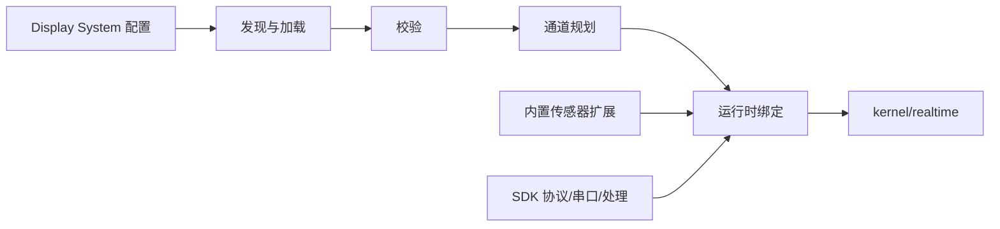

# 展示与传感器扩展宿主

> 最后更新：2026-08-28

`backend/extension-host/` 是稳定内核与可变展示系统之间的应用宿主。这里负责读取、校验、注册和调度扩展，不承载串口底层或通用协议实现。

## 目录职责

| 目录或入口 | 职责 |
| --- | --- |
| `manifest/` | 查找、读取和校验 manifest，解析坐标映射，构造展示定义与画布目录 |
| `runtime/` | 规划 parser channel，创建帧处理器，绑定、调度并登记展示系统运行时 |
| `workspace/` | 读取和写入用户展示系统工作区配置 |
| `appRuntimeFactory.js` | 将发现、工作区和运行时控制器装配为应用能力 |
| `index.js` | 保持扩展宿主的统一导出名和调用契约 |

根目录只保留宿主入口和说明文件。随应用交付的 `sensorRuntimeRegistry.js` 已与使用它的 legacy 传感器绑定代码一起放在 `backend/extensions/built-in-sensors/`，不再混入通用展示系统宿主。

## 扩展从哪里来

```text
backend/extensions/
├─ built-in-sensors/            # 随应用交付的传感器帧处理与 runtime factory
└─ examples/                    # Display System 示例 manifest 与配套 JSON
```

当前示例包括 byte matrix、hand glove、JQBed 和 small bed 12B。其中声明了 `sourceRuntime` 的示例指向 `backend/extensions/built-in-sensors/` 中的现有实现。

## 运行链路



1. 宿主从系统示例或现有工作区读取配置。
2. 校验 manifest、矩阵、协议字段和引用文件。
3. 将配置转换为展示定义，并规划需要的 parser channel。
4. 绑定扩展运行时；默认策略会保护已有 `sit`、`back`、`head`、`sensor` 通道，避免重复消费。
5. 处理后的帧进入 `backend/kernel/realtime/`，再由稳定 WebSocket 链路发送给前端。

## 配置能力边界

宿主已经支持现有 Display System 配置模型中的以下能力：

- 传感器矩阵和多通道声明；
- line order、point order 与 coordinate map 文件；
- canvas、chart appearance 和 chart cards 展示配置；
- Node/Python 算法文件引用；
- 展示配置保存与复制；
- 系统/用户工作区访问分类；
- 串口协议预设转换为 Builder 可选模板。

协议预设的真实来源是 `sdk/backend/protocol/`。宿主只把预设翻译为 Builder 字段，不在此目录维护第二份协议库。

## 稳定性规则

- `extension-host` 不直接修改 Electron 固定入口 `backend/runtime/index.js`。
- 串口、协议、采集、存储和通用处理通过 `@shroom/backend/...` 使用，SDK 是单一来源。
- 新扩展不得改变已有硬件帧格式、通道含义或历史数据格式。
- 默认不与 legacy parser channel 并行消费；需要并行时必须由现有 manifest 策略显式声明。
- 保存展示外观时只修改对应的 `display` 字段，不重建无关 manifest 内容。
- `compatibility/` 中的迁移基线不得作为新扩展依赖。

## 新增一个传感器展示

1. 在 SDK 既有协议能力或协议预设中表达 framing/decoding；若要改变公共协议，需单独评审。
2. 在 `backend/extensions/built-in-sensors/` 增加应用运行时，或先基于现有运行时配置示例。
3. 在 `backend/extensions/examples/<id>/` 准备 manifest 及其引用文件。
4. 通过当前校验器和 channel planner 接入，不在平台启动代码中硬编码新的传感器分支。
5. 增加无硬件测试，并用真实串口设备验证帧、线序、存储和回放兼容性。

## 验证

扩展宿主相关测试统一位于 `backend/tests/`，运行：

```powershell
npm test
```

测试不替代真实串口、多通道设备、用户历史数据库和打包后路径的人工验收。
