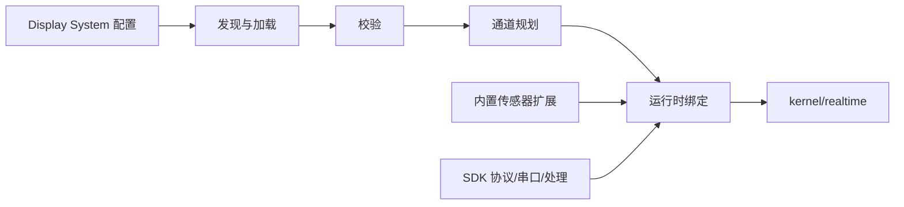

# 展示与传感器扩展宿主

> 最后更新：2026-09-01

`backend/extension-host/` 是稳定内核与可变展示系统之间的应用宿主。这里负责读取、校验、注册和调度扩展，不承载串口底层或通用协议实现。

## 目录职责

| 目录或入口 | 职责 |
| --- | --- |
| `manifest/` | 查找、读取和校验 manifest，解析坐标映射，构造展示定义与画布目录 |
| `runtime/` | 规划 parser channel，创建帧处理器，绑定、调度并登记展示系统运行时 |
| `workspace/` | 读取和写入用户展示系统工作区配置 |
| `agent-apps/` | 校验、原子安装、发现和解析沙箱 Agent 渲染包；只返回静态文件，不执行包内代码 |
| `appRuntimeFactory.js` | 将发现、工作区和运行时控制器装配为应用能力 |
| `index.js` | 保持扩展宿主的统一导出名和调用契约 |

根目录只保留宿主入口和说明文件。随应用交付的 `sensorRuntimeRegistry.js` 已与使用它的 legacy 传感器绑定代码一起放在 `backend/extensions/built-in-sensors/`，不再混入通用展示系统宿主。

## 扩展从哪里来

```text
backend/extensions/
├─ built-in-sensors/            # 随应用交付的传感器帧处理与 runtime factory
└─ examples/                    # Display System 示例 manifest 与配套 JSON
```

当前示例包括 byte matrix、hand glove、JQBed 和 small bed 12B。其中声明了 `sourceRuntime` 的示例指向 `backend/extensions/built-in-sensors/` 中的现有实现。

## 运行链路



1. 宿主从系统示例或现有工作区读取配置。
2. 校验 manifest、矩阵、协议字段和引用文件。
3. 将配置转换为展示定义，并规划需要的 parser channel。
4. 绑定扩展运行时；默认策略会保护已有 `sit`、`back`、`head`、`sensor` 通道，避免重复消费。
5. 处理后的帧进入 `backend/kernel/realtime/`，再由稳定 WebSocket 链路发送给前端。

## 配置能力边界

宿主已经支持现有 Display System 配置模型中的以下能力：

- 传感器矩阵和多通道声明；
- line order、point order 与 coordinate map 文件；
- canvas、chart appearance 和 chart cards 展示配置；
- Node/Python 算法文件引用；
- 展示配置保存与复制；
- 系统/用户工作区访问分类；
- 串口协议预设转换为 Builder 可选模板。
- Agent 渲染包 schema v1、默认不覆盖的原子安装、策略读取和静态文件边界。

协议预设的真实来源是 `sdk/backend/protocol/`。宿主只把预设翻译为 Builder 字段，不在此目录维护第二份协议库。

## 逐文件职责

当前共有 21 个 JavaScript 文件。它们都有生产或测试调用；文件数来自流水线阶段的拆分，
不是 21 套重复实现。

### 根入口

| 文件 | 作用 | 主要调用方 |
| --- | --- | --- |
| `appRuntimeFactory.js` | 装配发现服务、工作区服务、运行控制器和协议预设目录，向平台提供统一 façade | `kernel/platform/server.js` |
| `index.js` | 保持扩展宿主的公共导出契约；内部模块不应通过它反向互相依赖 | 平台装配与测试 |

### `manifest/`

| 文件 | 作用 | 为什么独立保留 |
| --- | --- | --- |
| `displaySystemCanvasCatalog.js` | 声明允许的配色、叠加层、图表卡片及数量限制 | 是 Builder 与校验器共享的白名单 |
| `displaySystemConfigFileValidator.js` | 校验线序、点序、坐标和 JSON 算法引用文件 | 纯文件内容校验，不负责目录扫描 |
| `displaySystemConfigLoader.js` | 扫描目录、读取 manifest、解析相对路径并组合校验结果 | 包含文件 IO，可独立注入和测试 |
| `displaySystemConfigValidator.js` | 校验 v1-v3 manifest，并把旧单传感器结构归一为 `sensors[]` | 承担 schema 兼容边界 |
| `displaySystemCoordinateMap.js` | 归一化并校验物理坐标和边界 | 坐标规则可脱离文件系统测试 |
| `displaySystemDefinitionBuilder.js` | 把已校验配置转成传感器定义、parser channel 和前端展示元数据 | 位于“配置”到“运行定义”的边界 |
| `displaySystemPage.js` | 归一化并校验 `display` 段的 view、widget、profile、canvas、sidebar 和 chart | 实际是展示配置 schema；后续可改更准确的文件名 |

### `runtime/`

| 文件 | 作用 | 为什么独立保留 |
| --- | --- | --- |
| `displaySystemFrameProcessorFactory.js` | 按顺序执行帧校验、协议解码、线序、点位映射、算法与指标计算 | 是数据处理编排器，后续可拆纯算法结果处理 |
| `displaySystemRegistry.js` | 保存已经发现且校验通过的展示系统配置 | 生命周期是“配置目录”，不是运行通道 |
| `displaySystemRuntimeBinder.js` | 把运行计划绑定到 parser、处理器和实时输出，但不打开串口 | 隔离绑定关系与串口生命周期 |
| `displaySystemRuntimeChannelPlanner.js` | 把运行定义转换为可绑定的 channel 计划 | 是定义到执行计划的独立阶段 |
| `displaySystemRuntimeDiscovery.js` | 扫描系统/用户目录、处理 ID 冲突、可写性并刷新两个 Registry | 管理发现与刷新生命周期 |
| `displaySystemRuntimeDispatcher.js` | 按策略挂载或卸载 parser 数据监听器 | 防止重复监听和重复消费 |
| `displaySystemRuntimeFactory.js` | 管理 Binder、Dispatcher 的启动、停止和重绑 | 对外提供稳定运行控制入口 |
| `displaySystemRuntimePolicy.js` | 保护 legacy channel，判断 active、parallel、shadow 是否允许 | 是兼容策略，不能下沉到通用 SDK |
| `displaySystemRuntimeRegistry.js` | 保存运行 channel 计划和当前运行状态 | 生命周期是“运行实例”，不能与配置 Registry 强并 |

### `workspace/`

| 文件 | 作用 | 优化方向 |
| --- | --- | --- |
| `displaySystemWorkspaceService.js` | 提供 Builder 目录、创建/复制展示系统、原子写文件、读取编辑数据和只保存 `display` 段 | 745 行，后续可拆 FileStore、Catalog、DisplaySection，并保留当前 Service 作为 façade |

### `agent-apps/`

| 文件 | 作用 | 边界 |
| --- | --- | --- |
| `agentAppService.js` | 校验 app.json/包内路径和权限，完成 staging 安装、回滚、发现、策略及静态路径解析 | 只处理用户数据文件，不 `require` 或执行 renderer 代码 |
| `index.js` | 导出 Agent App service 与 schema 常量 | 不承载业务逻辑 |

## 可安全执行的优化顺序

| 优先级 | 优化 | 边界 |
| --- | --- | --- |
| P0 | 内部模块改用直接导入，避免 `appRuntimeFactory` 和 RuntimeFactory 经 `index.js` 反向取内部实现 | 不删公共导出，不改行为 |
| P0 | 增加目录依赖边界测试 | 只锁定依赖方向 |
| P1 | 拆分 WorkspaceService，同时保留原文件、导出名和 façade | 原子写入与 v3 manifest 保护必须保持 |
| P1 | 将 `displaySystemPage.js` 改名为 `displaySystemDisplayConfig.js` | 只改内部路径，错误文本和归一结果不变 |
| P1 | 从 FrameProcessor 提取算法结果和指标纯函数 | 同步/异步算法、fallback 和输出字段不变 |
| P1 | 可选把配置 Registry 文件改名为 `displaySystemConfigRegistry.js` | 工厂导出名不变 |
| P2 | 评估坐标和纯数值处理是否进入 SDK | 属于公共 API 评审，本轮不做 |

不建议为了减少文件数合并 ConfigLoader 与 Validator、DefinitionBuilder 与 ChannelPlanner、
RuntimeFactory 与 AppRuntimeFactory，也不建议合并两个 Registry；这些模块虽然名字接近，
但输入、生命周期和清理责任不同。

## 稳定性规则

- `extension-host` 不直接修改 Electron 固定入口 `backend/runtime/index.js`。
- 串口、协议、采集、存储和通用处理通过 `@shroom/backend/...` 使用，SDK 是单一来源。
- 新扩展不得改变已有硬件帧格式、通道含义或历史数据格式。
- 默认不与 legacy parser channel 并行消费；需要并行时必须由现有 manifest 策略显式声明。
- 保存展示外观时只修改对应的 `display` 字段，不重建无关 manifest 内容。
- Agent App 只通过 `sensor.read` 的 iframe 消息读取清洗后的帧；不得接入串口、算法、存储、回放或 CSV 内部实现。
- `compatibility/` 中的迁移基线不得作为新扩展依赖。

## 新增一个传感器展示

1. 在 SDK 既有协议能力或协议预设中表达 framing/decoding；若要改变公共协议，需单独评审。
2. 在 `backend/extensions/built-in-sensors/` 增加应用运行时，或先基于现有运行时配置示例。
3. 在 `backend/extensions/examples/<id>/` 准备 manifest 及其引用文件。
4. 通过当前校验器和 channel planner 接入，不在平台启动代码中硬编码新的传感器分支。
5. 增加无硬件测试，并用真实串口设备验证帧、线序、存储和回放兼容性。

## 验证

扩展宿主相关测试统一位于 `backend/tests/`，运行：

```powershell
npm test
```

测试不替代真实串口、多通道设备、用户历史数据库和打包后路径的人工验收。

## 本目录文件

> 追加于 2026-08-29。上面各节说明职责与约束，这一节只列本目录直接包含的文件。

| 文件 | 作用 | 边界 |
| --- | --- | --- |
| `index.js` | 扩展宿主的公共门面。把 `manifest/`、`runtime/`、`workspace/`、`agent-apps/` 的能力和协议能力统一从一处导出 | **只做再导出，不含逻辑。** 外部应该只依赖这个门面，不要深挖子目录路径 |
| `appRuntimeFactory.js` | 应用级装配。把展示系统发现/工作区/运行控制器、Agent App service 和串口协议预设组装成统一对象 | 这是 `server.js` 唯一需要调的扩展宿主入口；新增能力优先挂在返回对象上 |

## 子目录逐文件说明

| 目录 | 文件数 | README |
| --- | --- | --- |
| `manifest/` | 7 | [manifest/README.md](./manifest/README.md) —— 声明、校验、翻译成运行时定义 |
| `runtime/` | 9 | [runtime/README.md](./runtime/README.md) —— 发现 → 计划 → 绑定 → 分发 → 处理 |
| `workspace/` | 1 | [workspace/README.md](./workspace/README.md) —— Builder 后端 |
| `agent-apps/` | 2 | [agent-apps/README.md](./agent-apps/README.md) —— 隔离渲染包安装与静态文件边界 |
