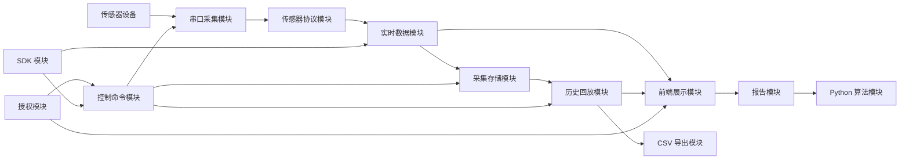
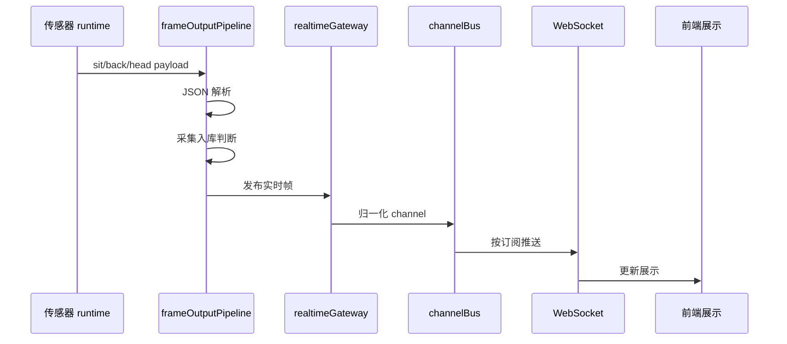
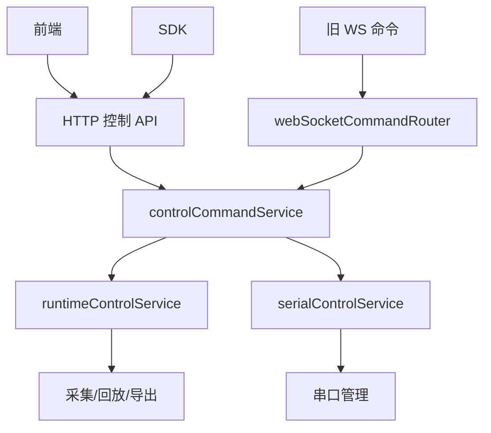
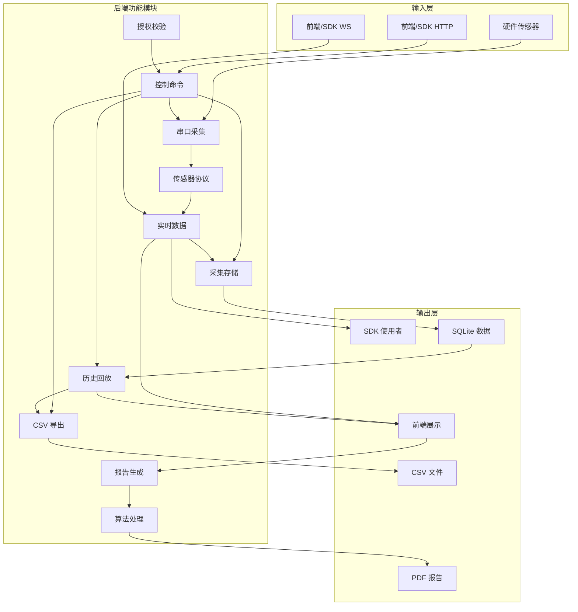

# Shroom 现有功能模块架构图

## 功能总览

## 串口采集模块

- 功能职责
	- 扫描串口
	- 打开串口
	- 关闭串口
	- 串口重连
	- parser 绑定
	- 角色管理
- 后端文件
	- `backend/serial/serialHelper.js`
		- 串口列表
		- 串口实例
		- 端口格式化
	- `backend/serial/serialManager.js`
		- 串口生命周期
		- 注册端口角色
		- 打开关闭端口
		- 重连循环
	- `backend/serial/serialParserManager.js`
		- 命名 parser
		- channel onData
		- parser pipe
	- `backend/serial/serialPortFilterService.js`
		- WCH 串口识别
		- 平台串口过滤
		- 扫描日志摘要
	- `backend/application/serialControlService.js`
		- 串口控制用例
		- 传感器类型切换
		- 自动连接
- 主要数据
	- portName
	- baudRate
	- channel
	- parser
	- isOpen

## 传感器协议模块

- 功能职责
	- 识别传感器类型
	- 解析原始帧
	- 线序转换
	- 零点扣除
	- payload 构造
	- 多通道路由
- 传感器定义
	- `backend/sensors/registry.js`
		- 类型注册
		- 默认波特率
		- 能力声明
		- 前端模块映射
- 协议文件
	- `backend/sensors/smallBed12B.js`
		- 小床 12B
		- 压力标定
		- 16x16/32x32
	- `backend/sensors/minzhen.js`
		- 敏枕/轮椅
		- 文本传感器
		- 矩阵遮罩
	- `backend/sensors/wholeChair.js`
		- 整椅
		- 坐垫
		- 靠背
		- 头枕
	- `backend/sensors/handGloveFullPacket.js`
		- 手套完整包
		- 压力点
		- 模型映射
	- `backend/sensors/handGloveDouble.js`
		- 手套双包
		- 分片拼接
		- IMU
- runtime 文件
	- `backend/sensors/runtime/sensorRuntimeRegistry.js`
		- runtime 注册表
		- channel 查找
	- `backend/sensors/runtime/bindSerialSensorRuntimes.js`
		- parser 到 runtime 绑定
	- `backend/sensors/runtime/legacySerialRuntimeBinding.js`
		- legacy runtime 创建
		- 五路 handler 注册
		- parser 绑定编排
	- `backend/sensors/runtime/legacySerialFrameRuntime.js`
		- 旧串口帧分发
		- 旧状态适配
	- `backend/sensors/runtime/sit1024FrameProcessor.js`
		- 坐垫 1024 点
	- `backend/sensors/runtime/backHead1024FrameProcessor.js`
		- 靠背 1024 点
		- 头枕 1024 点
	- `backend/sensors/runtime/smallBed12BRuntime.js`
		- 小床 12B 实时运行
	- `backend/sensors/runtime/handPacketRuntime.js`
		- 手套实时运行
	- `backend/sensors/runtime/legacySegmentedFrameProcessor.js`
		- 130/142/146/158 分段帧
	- `backend/sensors/runtime/legacyGenericMatrixFrameProcessor.js`
		- 通用矩阵帧
	- `backend/sensors/runtime/legacyBigBedFrameProcessor.js`
		- 大床分片帧

## 实时数据模块

- 功能职责
	- 接收协议 payload
	- 采集判断
	- 实时发布
	- telemetry 转换
	- channel 订阅
- 数据流

- 后端文件
	- `backend/services/frameOutputPipelineService.js`
		- 实时帧入口
		- 采集入库
		- 实时发布
	- `backend/services/realtimeTelemetryGateway.js`
		- legacy payload 桥接
		- telemetry 发布
	- `backend/channel/channelBus.js`
		- 内部通道总线
		- publish/subscribe
	- `backend/channel/telemetryChannelService.js`
		- 标准 channel 定义
	- `backend/normalizers/telemetryNormalizer.js`
		- payload 标准化
	- `backend/services/websocketSubscriptionService.js`
		- WebSocket 订阅关系
	- `backend/services/websocketBroadcastService.js`
		- 广播兼容
	- `backend/services/websocketConnectionService.js`
		- 心跳
		- 连接保活
	- `backend/services/websocketMessageService.js`
		- 消息解析
		- 非法消息保护

## 控制命令模块

- 功能职责
	- 串口开关
	- 类型切换
	- 开始采集
	- 停止采集
	- 历史加载
	- 回放控制
	- CSV 导出
	- 状态查询
- 推荐入口
	- HTTP 控制
	- WS 实时订阅
- 兼容入口
	- 旧 WebSocket 命令
- 控制流

- 后端文件
	- `backend/http/controlRoutes.js`
		- HTTP 控制路由
	- `backend/ws/webSocketCommandRouter.js`
		- WS 命令路由
	- `backend/ws/registerRuntimeCommandHandlers.js`
		- 运行时命令注册
	- `backend/ws/registerSerialCommandHandlers.js`
		- 串口命令注册
	- `backend/application/controlCommandService.js`
		- 控制统一入口
	- `backend/application/runtimeControlService.js`
		- 采集
		- 回放
		- 历史
		- 导出
		- 显示配置
	- `backend/application/serialControlService.js`
		- 串口
		- 传感器类型
		- local 回放

## 采集存储模块

- 功能职责
	- 采集开关
	- 采集频率
	- 磁盘保护
	- 帧入库
	- 批量队列
- 后端文件
	- `backend/services/collectionService.js`
		- 采集状态
		- 采集频率
		- 磁盘保护
	- `backend/services/collectionFrameStorageService.js`
		- sit 入库载荷
		- back 入库载荷
		- head 入库载荷
	- `backend/services/historyFrameTransformService.js`
		- 清零帧入库格式
		- 小床 12B 存储格式
	- `backend/services/collectionInsertQueueService.js`
		- 批量入库队列
	- `backend/db/dbHelper.js`
		- 数据库基础 helper
	- `backend/db/sqlite3-compat.js`
		- SQLite 兼容层
- 数据表语义
	- sit 数据
	- back 数据
	- head 数据
	- 时间索引
	- 采集日期

## 历史回放模块

- 功能职责
	- 查询历史日期
	- 查询历史帧
	- 回放定时器
	- 回放速度
	- 空白帧
	- 曲线抽样
- 后端文件
	- `backend/services/historyQueryService.js`
		- 日期查询
		- 帧查询
		- 统计查询
	- `backend/services/historyPlaybackService.js`
		- 回放数据组织
		- 曲线抽样
		- 空白 payload
	- `backend/services/historyFrameTransformService.js`
		- 历史帧解析
		- 压力帧归一化
		- 小床回放 payload
		- 温度床回放 payload
	- `backend/services/playbackFrameService.js`
		- 历史帧转实时 payload
	- `backend/services/playbackTimerService.js`
		- 回放 timer
		- 暂停
		- 调速
	- `backend/services/historyMaintenanceService.js`
		- 历史删除
- 输出位置
	- 前端实时展示
	- 历史曲线
	- CSV 导出

## CSV 导出模块

- 功能职责
	- 历史数据导出
	- 导出进度
	- 文件写入
	- UTF-8 BOM
	- 失败提示
- 后端文件
	- `backend/services/csvDownloadService.js`
		- 导出主流程
		- 进度上报
		- 历史数据读取
	- `backend/services/historyFrameTransformService.js`
		- CSV 表头
		- 文件名前缀
		- 导出压力归一化
	- `backend/export/csvHelper.js`
		- CSV 格式化
		- 文件写入
- 控制入口
	- HTTP export
	- SDK export
	- 旧 WS export 兼容

## 报告模块

- 功能职责
	- 热力图数据
	- canvas 上传
	- PDF 生成
	- OneStep 报告
	- Python 指标计算
- 后端文件
	- `backend/http/reportRoutes.js`
		- 报告 HTTP 路由
		- canvas 上传
		- PDF 入口
	- `backend/python/pyWorker.js`
		- Python worker
		- UTF-8 编码
		- 算法调用
- Python 目录
	- `python/app`
		- 报告算法
		- 指标计算
		- PDF 相关逻辑
	- `OneStep`
		- OneStep 模板
		- 报告资源

## 算法模块

- 功能职责
	- 宠物看护算法
	- 生命体征算法
	- 压力指标
	- Python 外部算法
- 后端文件
	- `backend/services/petCareRuntimeService.js`
		- petCare 运行时
		- 心率模拟
		- 体动指标
		- 姿态指标
	- `backend/python/pyWorker.js`
		- Node 调 Python
		- worker 生命周期
	- `backend/processing/openWeb.js`
		- 历史线序
		- 矩阵算法
		- 传感器映射
	- `backend/processing/press.js`
		- 压力计算
	- `backend/processing/utilMatrix.js`
		- 矩阵工具

## 授权模块

- 功能职责
	- 授权校验
	- 授权文件
	- 传感器入口控制
	- 页面可见性
- 后端文件
	- `backend/license/aes_ecb.js`
		- AES 加解密
	- `backend/license/licenseHelper.js`
		- 授权路径
		- 授权文件候选
- 前端文件
	- `client/src/page/license`
		- 授权页面
		- 系统入口控制
	- `client/src/constants.js`
		- 传感器常量

## 前端展示模块

- 功能职责
	- 系统选择
	- 串口选择
	- 3D 展示
	- 2D 原始矩阵
	- 压力统计
	- 历史回放
	- 报告展示
- 前端目录
	- `client/src/page`
		- 页面级功能
		- home
		- license
	- `client/src/components`
		- 展示组件
		- title
		- three
		- aside
	- `client/src/displays`
		- 展示系统
		- 传感器视图
	- `client/src/hooks`
		- WebSocket hook
		- 页面状态 hook
	- `client/src/store`
		- 前端状态
	- `client/src/types`
		- 类型定义
- 展示类型
	- 手套
	- 坐垫
	- 小床
	- 大床
	- 轮椅
	- 整椅
	- 宠物看护
	- 原始矩阵
	- 3D 模型

## SDK 模块

- 功能职责
	- HTTP 控制封装
	- WS 实时订阅
	- channel 管理
	- 历史查询
	- CSV 下载
	- 传感器会话
- 文件目录
	- `sdk/frontend`
		- 前端 SDK
		- SensorClient
		- HTTP 方法
		- WS 订阅
	- `sdk/src`
		- Node SDK
		- SensorSession
		- 串口 helper 复用
- 推荐使用
	- 控制类操作走 HTTP
	- 实时数据走 WS
	- SDK 不直接处理串口协议
	- SDK 只暴露稳定数据模型

## 配置与启动模块

- 功能职责
	- 服务启动
	- HTTP app 创建
	- WS server 创建
	- 生命周期关闭
	- 配置读写
- 后端文件
	- `backend/server/server.js`
		- 主启动编排
		- 旧兼容入口
		- runtime context
	- `backend/server/httpAppFactory.js`
		- Express app
		- HTTP 路由挂载
	- `backend/server/webSocketServerFactory.js`
		- 三路 WS server
	- `backend/server/webSocketHandlerFactory.js`
		- WS 连接处理
		- 订阅处理
		- 旧消息处理
	- `backend/services/serverLifecycleService.js`
		- 服务关闭
		- 资源清理
	- `backend/config/configManager.js`
		- 配置读取
		- 配置保存

## 现有业务闭环

- 实时展示闭环
	- 传感器
	- 串口采集
	- 协议解析
	- 实时管线
	- WebSocket 推送
	- 前端渲染
- 数据采集闭环
	- 开始采集
	- 实时帧入库
	- 批量写入
	- 磁盘保护
	- 停止采集
- 历史回放闭环
	- 查询日期
	- 读取历史帧
	- 定时回放
	- 转实时 payload
	- 前端复用展示
- 导出报告闭环
	- 历史数据
	- CSV 导出
	- 热力图
	- canvas 上传
	- PDF 报告
- SDK 调用闭环
	- HTTP 控制
	- WS 订阅
	- channel 数据
	- 历史导出

## 模块关系图

## 当前优化重点

- server.js 瘦身
	- 启动编排保留
	- 业务状态下沉
	- runtime context 收敛
- runtimeStateStore
	- 手套状态
	- 零点状态
	- legacy 分段缓存
	- 历史回放行缓存
	- 历史回放索引
	- 采集控制状态
	- 采集频率配置
	- 零点状态仓库
	- 零点命令服务
	- 端口实例状态
	- legacy accessor factory
	- WS context accessor factory
	- bootstrapServer
	- 后续拆分 appRuntimeFactory
- legacy runtime 收敛
	- 旧帧继续拆 processor
	- 旧状态写回集中
	- 旧 WS 命令冻结
- 传感器模块标准化
	- registry 定义能力
	- runtime 处理协议
	- processor 处理帧
	- normalizer 处理输出
- SDK 稳定化
	- HTTP 控制
	- WS 订阅
	- telemetry 数据模型
	- 示例工程
