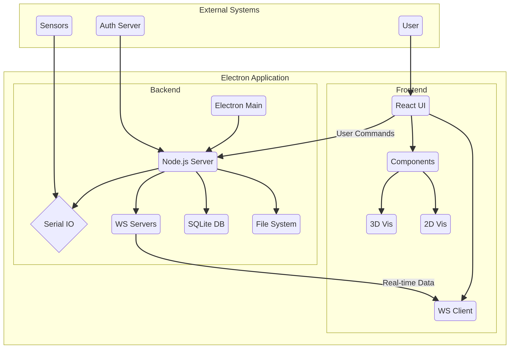
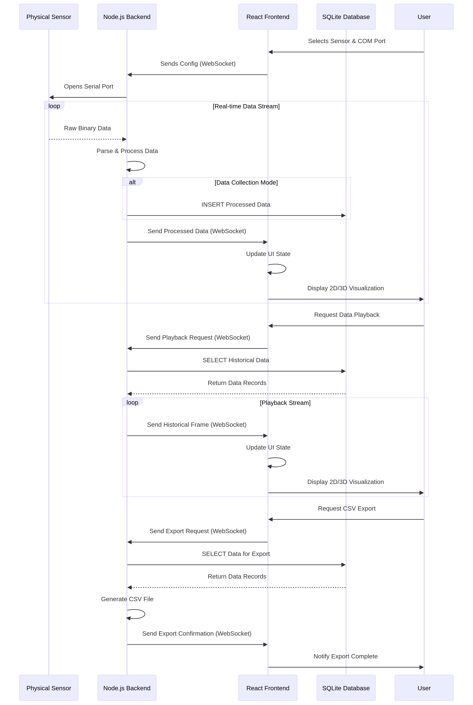

# Shroom1.0 项目架构文档

**版本:** 1.0
**日期:** 2026年2月28日
**作者:** Manus AI

[TOC]

## 1. 引言

### 1.1. 关键特性

- **多传感器支持:** 可通过简单的配置切换，无缝接入座椅、床垫、手套、足底等多种形态的压力传感器。
- **实时 2D/3D 可视化:** 提供热力图、数值矩阵、趋势图等 2D 视图，并结合 Three.js 实现与具体产品模型贴合的 3D 压力映射，支持自由旋转、缩放。
- **数据采集与回放:** 支持将实时数据流以时间标签的形式持久化存储到本地 SQLite 数据库，并能随时按标签精确回放历史数据。
- **授权与加密:** 内置基于时间的授权许可机制，通过 AES 加密保护配置文件，确保软件在授权期内使用。
- **跨平台部署:** 基于 Electron 和 Electron Forge，可打包为 Windows 和 macOS 平台的独立桌面应用。

### 1.2. 项目概述

Shroom1.0 是一个专用于压力传感矩阵数据采集、处理、可视化与分析的桌面应用程序。该系统通过连接多种物理传感器硬件（如座椅、床垫、手套等），实时捕捉压力分布数据，并提供丰富的 2D 和 3D 可视化界面，使用户能够直观地分析数据。此外，系统支持数据回放、存储和导出功能，适用于产品研发、生物力学研究、人体工程学评估等多种场景。

本文档旨在详细阐述 Shroom1.0 项目的整体技术架构、核心模块设计、数据流转机制及关键技术实现，为项目的后续开发、维护和迭代提供清晰、全面的技术参考。

### 1.3. 架构目标

该项目架构的设计旨在实现以下核心目标：

- **模块化与可扩展性:** 方便地接入新型号的传感器，并能独立更新或迭代前后端功能模块。
- **高性能与实时性:** 保证高波特率下串口数据的稳定接收和低延迟处理，并通过 WebSocket 将数据实时推送至前端进行可视化。
- **丰富的数据可视化:** 提供包括 2D 热力图、数值矩阵以及与具体应用场景（如汽车座椅、手套、足底）相结合的 3D 模型渲染，以满足不同分析需求。
- **数据持久化与可追溯:** 将采集的原始数据和处理后数据进行结构化存储，支持按时间或标签进行回放、分析和导出。

## 2. 整体架构

Shroom1.0 采用基于 **Electron** 的混合桌面应用架构。该架构整合了 **Node.js** 作为后端（主进程），负责硬件交互、数据处理和核心业务逻辑，以及一个基于 **React** 的单页面应用（SPA）作为前端（渲染器进程），负责用户交互和数据可视化。

### 2.1. 技术栈

下表总结了项目所使用的主要技术和库：

| 分层 | 技术/库 | 用途 |
| :--- | :--- | :--- |
| **应用框架** | Electron | 构建跨平台的桌面应用程序外壳。 |
| **后端 (Node.js)** | `serialport` | 负责与硬件传感器进行串口通信。 |
| | `ws` (WebSocket) | 构建后端与前端之间的实时双向通信通道。 |
| | `sqlite3` | 用于数据的本地持久化存储。 |
| | `crypto-js` | 实现应用授权许可的加密与解密。 |
| | `csv-writer` | 将采集的数据导出为 CSV 文件。 |
| **前端 (React)** | React | 构建用户界面的核心框架。 |
| | React Router | 管理应用内的页面导航和路由。 |
| | Ant Design | 提供一套成熟、丰富的 UI 组件库。 |
| | Three.js | 实现复杂的 3D 模型加载和压力数据渲染。 |
| | ECharts / Canvas | 用于绘制 2D 热力图、图表和数值矩阵。 |
| **打包工具** | Electron Forge | 用于 Electron 应用的打包和分发。 |
| | Create React App | (底层) 用于初始化和构建 React 前端应用。 |

## 3. 模块设计详解

### 3.1. 后端服务 (Node.js 主进程)

后端服务是整个应用的大脑，由 `index.js` 作为 Electron 主进程入口启动，并核心逻辑实现在 `server.js` 中。

#### 3.1.1. 硬件通信模块

- **串口连接管理:** 使用 `serialport` 库扫描并列出可用的 COM 端口。用户在前端选择端口后，后端会建立与指定硬件的连接。支持动态切换不同传感器（如座椅、靠背、头枕），并为每个传感器建立独立的串口连接实例。
- **数据解析:** 通过 `DelimiterParser` 对从串口接收的二进制数据流进行解析。它以特定的字节序列（如 `0xaa, 0x55, 0x03, 0x99`）作为数据帧的分隔符，确保了数据包的完整性。

#### 3.1.2. 数据处理与分发模块

- **WebSocket 服务:** `server.js` 启动了三个独立的 WebSocket 服务器（分别监听 19999, 19998, 19997 端口），用于向前端推送不同类型或通道的数据（例如，座椅、靠背、头枕数据可以并行推送）。前端应用根据需要连接到相应的端口获取数据。
- **数据预处理:** 接收到解析后的原始数据帧后，系统会根据当前选择的传感器类型（`file` 变量，如 `car10`, `smallBed`, `hand` 等）调用特定的数据处理函数（如 `car10Sit`, `jqbed`, `handLine` 等）。这些函数位于 `openWeb.js` 和 `utilMatrix.js` 等工具文件中，负责将原始数据转换为标准的矩阵格式，并进行必要的校准、滤波或坐标变换。
- **数据实时推送:** 处理完成的压力矩阵数据被封装成 JSON 格式，通过 WebSocket 实时广播给所有连接的前端客户端。

#### 3.1.3. 数据持久化模块

- **数据库管理:** 采用 `SQLite3` 作为本地数据库。通过 `initDb` 和 `genDb` 函数实现数据库的动态初始化。系统会根据传感器类型创建或连接到不同的数据库文件（例如 `hand0205.db`, `carSit.db`），如果数据库文件不存在，则会从 `init.db` 模板文件复制创建，保证了表结构的统一性。
- **数据存储:** 在数据采集模式下，每一帧处理后的数据连同时间戳和采集标签（`date`）一起被 `INSERT` 到 `matrix` 表中。`data` 字段以 JSON 字符串的形式存储了完整的压力矩阵数组。
- **数据回放与查询:** 在回放模式下，后端根据前端指定的时间标签，使用 `SELECT` 语句从数据库中检索历史数据，并将其逐帧发送给前端，实现历史场景的复现。
- **数据导出:** 提供将指定采集时段的数据导出为 CSV 格式的功能。后端从数据库中查询数据，整理成 `time`, `area`, `pressTotal` 等多个维度，并使用 `csv-writer` 库生成文件，存放于 `data` 目录下。

#### 3.1.4. 授权与配置模块

- **授权机制:** 应用包含一个基于时间的授权许可系统。启动时，后端会从 `http://sensor.bodyta.com` 获取标准网络时间，并读取本地的 `config.txt` 文件。该文件内容经过 `AES (ECB)` 加密，解密后得到授权截止日期 `endDate`。在处理串口数据时，会校验当前时间是否仍在授权期内，否则将停止数据处理。`gen.js` 是用于生成加密密钥的独立脚本。
- **传感器配置:** `传感器类型.txt` 文件定义了所有支持的传感器类型及其对应的内部标识符（`value`），前端通过读取这些配置向用户展示可选的设备列表。

### 3.2. 前端应用 (React 渲染器进程)

前端应用为用户提供了与系统交互的图形界面，完全在 Electron 的渲染器进程中运行。

#### 3.2.1. 路由与页面结构

应用使用 `HashRouter` 进行前端路由管理。核心页面包括：

- **`/` (密钥验证页):** `Date.js` 组件，作为应用的入口，要求用户输入密钥以解锁功能。它通过 WebSocket 与后端通信以验证密钥的有效性。
- **`/system` (主操作页):** `Home.js` 组件，是系统的核心功能界面。它集成了设备选择、模式切换（实时/回放）、数据显示和参数调整等所有主要功能。
- **其他页面:** 应用还包含多个用于特定调试、展示或数据分析的页面，如 `/heatmap`, `/num/:type`, `/3Dnum` 等，分别对应不同的可视化组件。

#### 3.2.2. 状态管理与后端通信

- **组件化状态管理:** 主要通过 React 的 `useState`, `useEffect` 和 `useRef` Hooks 在组件内部管理状态。父子组件之间通过 `props` 传递数据和回调函数。
- **WebSocket 通信:** 在 `Home.js` 和 `Date.js` 等关键组件中，通过 `new WebSocket("ws://127.0.0.1:19999")` 建立与后端的连接。`useEffect` Hook 用于管理 WebSocket 的生命周期（连接、接收消息、关闭）。收到的数据通过 `setState` 更新组件状态，从而触发界面重新渲染。

#### 3.2.3. 数据可视化模块

数据可视化是本项目的核心亮点，分为 2D 和 3D 两大类。

- **2D 可视化:**
  - **热力图 (`Heatmap`):** 使用 HTML5 Canvas 实现。`heatmap/canvas.js` 组件接收压力矩阵数据，通过颜色映射（如 `jet` 算法）和高斯模糊 (`gaussBlur_1`) 等图像处理技术，生成平滑、直观的热力图。
  - **数值矩阵 (`Num2D`):** 直接将压力矩阵以二维表格的形式展示每个传感点的具体数值，并根据数值大小应用不同的背景色，方便精确读数。
  - **图表 (`ECharts`):** 用于展示历史数据趋势，如平均压力、总压力随时间的变化曲线。

- **3D 可视化:**
  - **核心技术:** 基于 `Three.js` 库。在 `components/three/` 目录下，包含了大量针对不同传感器的 3D 渲染组件。
  - **模型加载:** 使用 `GLTFLoader` 或 `FBXLoader` 加载预制的 3D 模型（如汽车座椅 `carnewTest.js`、手 `hand.js`、脚 `foot.js` 等）。
  - **压力映射:** 将实时或回放的压力矩阵数据，通过 UV 映射或顶点颜色插值的方式，动态地渲染到 3D 模型的表面。例如，高压力区域显示为红色，低压力区域显示为蓝色。`ware.js` 等组件中的逻辑负责将一维的压力数据数组映射到模型的特定顶点或纹理坐标上。
  - **交互控制:** 使用 `TrackballControls` 允许用户通过鼠标自由旋转、缩放和平移 3D 场景，以便从不同角度观察压力分布。

## 4. 数据流

下图描述了从数据采集到最终呈现的完整数据流转过程。

1.  **数据采集:** 物理传感器持续产生压力数据，通过串口（COM Port）发送给计算机。
2.  **后端接收与解析:** `server.js` 中的 `serialport` 实例监听串口，`DelimiterParser` 将数据流分割成完整的数据帧（通常是 1024 字节的 Buffer）。
3.  **后端处理:** `parser.on('data', ...)` 事件触发。根据选定的传感器类型，调用对应的处理函数对原始数据进行转换、校准和格式化，生成标准的压力矩阵数组。
4.  **数据存储 (可选):** 如果处于数据采集模式，处理后的矩阵数据和元信息（时间戳、标签）被存入 SQLite 数据库。
5.  **实时推送:** 处理后的数据通过 WebSocket (`ws.send`) 发送给前端。
6.  **前端接收:** 前端 React 组件的 `ws.onmessage` 事件被触发，接收到新的数据。
7.  **前端渲染:** `setState` 更新组件状态，将新数据传递给 2D 和 3D 可视化组件。
8.  **可视化呈现:** `Three.js`、`Canvas` 或 `ECharts` 组件根据新数据重新渲染，用户在界面上看到实时更新的压力分布图像。

## 5. 部署与打包

- **打包配置:** 项目使用 `Electron Forge` (`forge.config.js`) 进行打包。配置中定义了应用的图标、asar 打包策略以及针对不同平台（Windows, macOS）的输出格式（如 `maker-squirrel` for Windows, `maker-zip` for macOS）。
- **资源管理:** 在打包过程中，`db` 目录作为 `extraResources` 被包含进来，确保数据库模板文件在安装后可用。前端 `client` 目录下的 React 应用会被 `npm run build` 命令构建成静态文件，并被 Electron 主进程通过本地服务器加载。
- **依赖排除:** 配置中通过 `ignore` 字段排除了 Python 虚拟环境等与打包无关的目录，以减小最终应用体积。

## 6. 总结与展望

Shroom1.0 项目构建了一个功能完善、高度模块化的压力数据采集与分析平台。其架构清晰，前后端职责分明，通过 Electron 成功地将强大的 Node.js 后端生态（硬件交互、文件系统）与先进的前端 web 可视化技术（React, Three.js）相结合。

**未来可优化的方向包括：**

- **状态管理优化:** 对于日益复杂的组件间通信，可以引入如 Redux 或 Zustand 等全局状态管理库，以简化状态逻辑。
- **性能优化:** 对于超大规模的 3D 模型或更高频率的数据流，可以探索使用 Web Workers 来分担前端的数据处理压力，避免 UI 线程阻塞。
- **代码重构:** `server.js` 文件长达数千行，包含了大量条件判断和重复逻辑，可以根据传感器类型将其拆分为更小的、可复用的模块或类，以提高可维护性。
- **数据库升级:** 考虑将数据存储方案从多个离散的 SQLite 文件，升级为单一的、结构更规范的关系型数据库或时序数据库，便于进行更复杂的数据聚合与分析。
