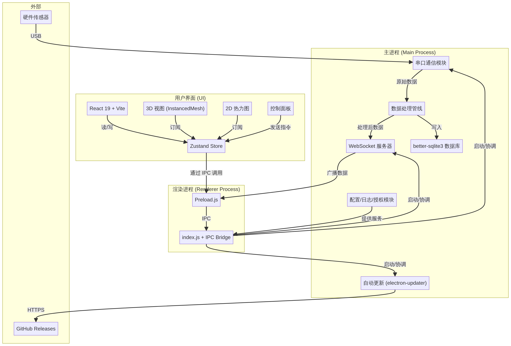
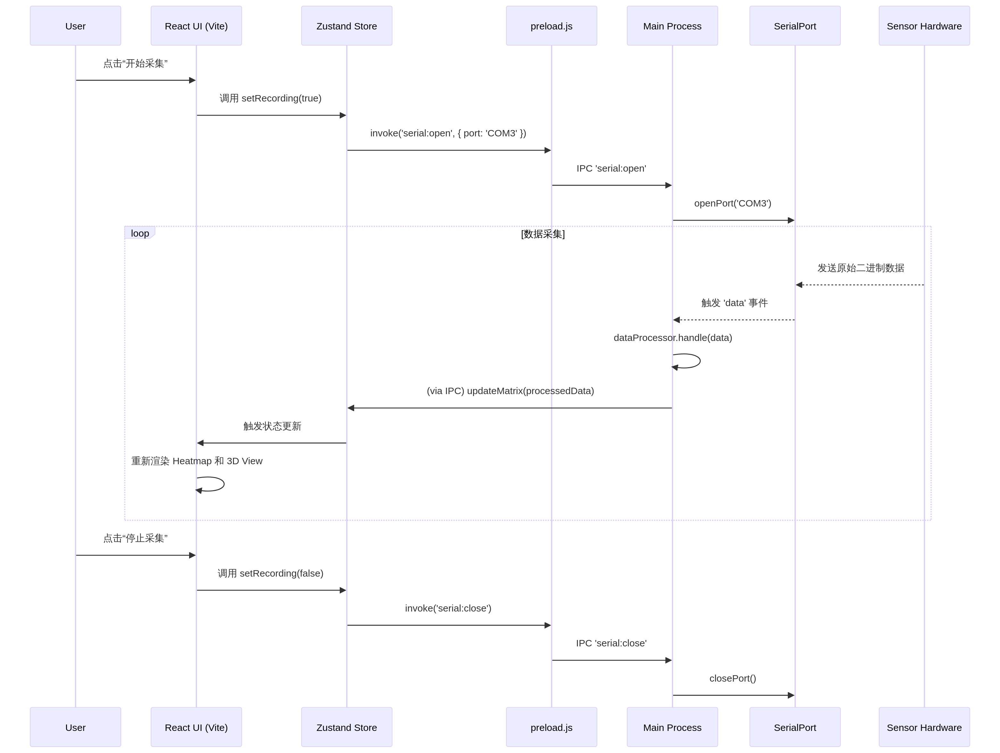

# Shroom1.0 架构文档 (Max 分支)

**版本**: 2.0
**日期**: 2026-03-01
**作者**: Manus AI

[TOC]

## 1. 引言

本文档旨在深入剖析 Shroom1.0 项目的系统架构、模块设计、数据流转以及核心问题，并为 Max 分支的重构优化提供理论依据和设计蓝图。

### 1.1. 项目概述

Shroom1.0 是一个基于 **Electron** 的混合桌面应用程序，专用于**压力传感矩阵**的数据采集、实时可视化、存储与回放分析。系统通过串口与硬件传感器连接，接收原始压力数据，经过处理后通过 WebSocket 推送至前端，以 2D 热力图和 3D 模型的方式进行可视化呈现。

### 1.2. 架构目标 (Max 分支)

Max 分支的核心目标是解决原始代码库（main 分支）中存在的严重耦合、可维护性差、性能瓶颈等问题，实现一个**高内聚、低耦合、可扩展、易维护**的现代化软件架构。具体目标包括：

- **模块化**: 将巨大的单体文件（`server.js`, `Home.js`）拆分为职责单一的模块。
- **组件化与 Hook 化**: 将重复的 UI 和业务逻辑抽象为可复用的 React 组件和自定义 Hook。
- **清晰的数据流**: 建立单向、可预测的数据流转路径。
- **配置中心化**: 消除硬编码，实现所有配置的统一管理。
- **提升健壮性**: 引入结构化日志、错误处理和授权管理机制。

## 2. 整体架构 (Vite + React 19 + better-sqlite3)

经过深度优化，项目架构已全面现代化，核心技术栈升级为 **Vite + React 19 + better-sqlite3**，并引入了严格的安全模型和高性能渲染管线。

**核心变更**:
- **构建工具**: 从 Webpack 4 迁移到 **Vite**，开发体验和构建效率大幅提升。
- **前端框架**: 从 React 17 升级到 **React 19**，解锁并发特性。
- **数据库**: 从 `sqlite3` 迁移到 **`better-sqlite3`**，性能和 API 易用性显著改善。
- **安全模型**: 强制启用 **`contextIsolation`** 和 **`sandbox`**，通过 `preload.js` 建立安全 IPC 通道。
- **3D 渲染**: 引入 **`InstancedMesh`** 模式，将渲染调用从 O(n) 降至 O(1)。
- **状态管理**: 引入 **Zustand**，实现更简洁、高效的全局状态管理。
- **自动更新**: 集成 **`electron-updater`**，实现无缝后台更新。

系统采用经典的 Electron **主进程-渲染进程**架构。Max 分支在此基础上，对主进程（后端）和渲染进程（前端）的内部结构进行了彻底的模块化重构。

### 2.1. 架构图

### 2.2. 技术栈

| 分类 | 技术 | 用途 |
| :--- | :--- | :--- |
| **应用框架** | Electron | 跨平台桌面应用容器 |
| **后端环境** | Node.js | 主进程运行环境 |
| **前端框架** | React | UI 构建与渲染 |
| **实时通信** | WebSocket (`ws`) | 前后端数据双向通信 |
| **硬件通信** | `serialport` | 串口数据读写 |
| **数据存储** | SQLite3 | 本地数据持久化 |
| **数据导出** | `csv-writer` | 数据导出为 CSV 格式 |
| **3D 渲染** | Three.js | 压力分布的 3D 模型可视化 |
| **打包工具** | Electron Forge | 应用打包与分发 |
| **授权加密** | `crypto` (AES) | 授权文件加密与验证 |

## 3. 后端设计 (主进程)

后端（主进程）负责所有与操作系统、硬件、文件系统及网络相关的核心任务。Max 分支将原 `server.js` (4648 行) 拆分为 8 个高内聚的模块。

### 3.1. 模块概览

| 模块 | 核心职责 |
| :--- | :--- |
| `index.js` | **应用入口**。负责 Electron 窗口管理和主进程生命周期。 |
| `server.js` (重构后) | **总调度器**。协调各模块，处理 IPC 消息，但不包含具体业务逻辑。 |
| `configManager.js` | **配置中心**。统一管理所有硬编码常量（端口、波特率、矩阵尺寸等）。 |
| `logger.js` | **日志模块**。提供带级别和时间戳的结构化日志，替代 `console.log`。 |
| `licenseHelper.js` | **授权管理**。封装 `config.txt` 解密、网络时间获取、有效期校验。 |
| `serialHelper.js` | **串口管理**。封装串口的打开、关闭、读写，支持多串口（坐垫/靠背/头枕）。 |
| `dbHelper.js` | **数据库工具**。将 SQLite 操作封装为 Promise 风格，消除回调地狱。 |
| `wsHelper.js` | **WebSocket 工具**。封装广播、单发、消息路由，消除重复的 `forEach` 广播。 |
| `dataProcessor.js` | **数据处理管线**。封装线序转换、归零、平滑等一系列数据变换操作。 |
| `csvHelper.js` | **CSV 导出工具**。封装 `csv-writer`，提供标准化的 CSV 导出接口。 |

### 3.2. 核心流程

1. **启动**: `index.js` 创建 Electron 窗口。`server.js` 初始化各模块。
2. **授权**: `licenseHelper` 验证授权，若无效则限制功能。
3. **连接**: 前端通过 `useSerialControl` 发送指令，`server.js` 调用 `serialHelper` 打开指定串口。
4. **数据接收**: `serialHelper` 接收到串口数据帧，交由 `dataProcessor` 处理。
5. **数据处理**: `dataProcessor` 按预设管线（如 `car10Sit` 线序转换 -> `applyZero` 归零 -> `applyGaussianBlur` 平滑）处理数据，并计算统计信息。
6. **数据分发**: `server.js` 通过 `wsHelper` 将处理后的数据和统计信息广播给前端。
7. **数据存储**: 若处于采集状态，`server.js` 调用 `dbHelper` 将原始数据帧存入 SQLite。

## 4. 前端设计 (渲染进程)

前端负责所有 UI 展示和用户交互。Max 分支将原 `Home.js` (3610 行) 的巨大 Class 组件重构为多个函数式组件，并抽取了 5 个核心自定义 Hook 来管理复杂状态和副作用。

### 4.1. 模块概览

| 模块 | 核心职责 |
| :--- | :--- |
| `App.js` | **应用根组件**。负责路由管理和全局上下文提供。 |
| `pages/Home.js` (重构后) | **主页面组件**。作为容器，组合多个子组件，协调各 Hook。 |
| `hooks/useWebSocket.js` | **WebSocket 连接管理**。封装 3 个 WebSocket 连接的生命周期，支持自动重连。 |
| `hooks/usePressureData.js`| **压力数据状态管理**。聚合所有压力相关的状态（矩阵、统计值、峰值、归零参考）。 |
| `hooks/useSerialControl.js`| **后端指令封装**。将所有发送给后端的控制指令封装为语义化函数。 |
| `hooks/usePlayback.js` | **历史回放管理**。封装回放进度、播放/暂停、速度控制等状态。 |
| `hooks/useThreeScene.js` | **3D 场景初始化**。将 `three/` 目录下 47 个组件中重复的场景设置代码统一封装。 |
| `components/` | **UI 组件库**。包含 `Heatmap`、`PressureChart`、`ThreeCanvas` 等展示组件。 |
| `constants.js` | **前端常量**。统一管理前端所有硬编码常量。 |

### 4.2. 核心流程

1. **初始化**: `Home.js` 初始化所有 Hook。
   - `useWebSocket` 建立与后端 3 个 WebSocket 服务器的连接。
   - `useSerialControl` 获得向后端发送指令的函数集合。
   - `usePressureData` 准备好接收和处理压力数据的状态容器。
2. **用户交互**: 用户在 UI 上操作（如选择串口、点击“开始采集”）。
   - 调用 `useSerialControl` 提供的函数，如 `controls.openPort('COM3')`。
   - `useSerialControl` 通过 `useWebSocket` 的 `sendMessage` 方法将指令发送到后端。
3. **数据接收**: `useWebSocket` 的 `onMessage` 回调被触发。
   - 根据消息类型，调用 `usePressureData` 的 `updateFromMatrix` 或 `usePlayback` 的 `setCurrentIndex` 等方法来更新状态。
4. **UI 渲染**: React 检测到状态变更，自动重新渲染相关组件。
   - `Heatmap` 组件根据 `pressureData.sitData.matrix` 渲染 2D 热力图。
   - `ThreeCanvas` 组件根据 `pressureData.sitData.matrix` 更新 3D 模型顶点颜色。
   - `PressureChart` 组件根据压力统计值更新图表。

## 5. 数据流

系统的数据流是单向且清晰的，从硬件输入到 UI 输出，构成一个完整的闭环。

## 6. 部署与打包

项目使用 **Electron Forge** 进行打包。`forge.config.js` 定义了打包配置，包括应用图标、入口点、打包格式（如 `squirrel.windows`、`zip`）等。

- **资源管理**: `db/`、`data/` 等目录应放在 Electron 的 `userData` 目录中，以确保应用更新后数据不丢失。Max 分支通过 `configManager.js` 中的 `APP_DATA_DIR` 实现了这一点。
- **依赖管理**: `package.json` 中 `dependencies` 和 `devDependencies` 需要严格区分。所有运行时依赖（如 `serialport`, `sqlite3`）必须放在 `dependencies` 中。

## 7. 总结与展望

Max 分支通过全面的模块化和组件化重构，极大地提升了 Shroom1.0 项目的代码质量、可维护性和可扩展性。未来的优化方向可以包括：

- **前端状态管理库**: 对于更复杂的交互，可以引入 Zustand 或 Redux Toolkit 来代替部分 `useState` 和 `useContext`。
- **性能优化**: 对 3D 渲染部分进行更深入的性能分析，例如使用 Instanced Mesh 优化大规模重复几何体的渲染。
- **测试**: 为核心模块（如 `dataProcessor`, `dbHelper`）和自定义 Hook 编写单元测试和集成测试。
- **数据库升级**: 考虑将 SQLite 替换为性能更强的嵌入式数据库（如 DuckDB）或专业的时序数据库（如 InfluxDB），以支持更大规模的数据采集和分析。
