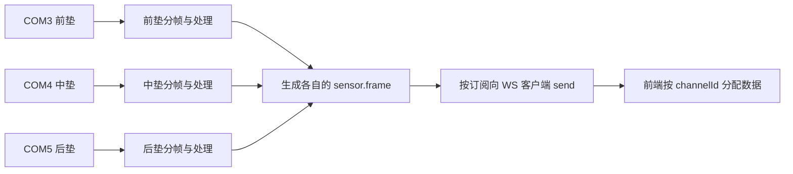

# Manifest、多串口与内置 Agent 生成规则

> 核对日期：2026-09-24。面向理解和使用 Shroom 的用户。
> 本文根据当前源码整理，未连接真机。描述现有规则，不改变程序行为，也没有安装示例系统。
> 此处的 Agent 指 Shroom 软件里的对话助手；本次 Codex 对话及其技能是另一套执行环境。

## 1. Manifest 是什么，和“系统”有什么关系

**Manifest 是展示系统的配置清单，通常是 `display-system.json`。所谓“Manifest 系统”，就是由这份配置驱动的展示系统。**

例如“坐垫压力系统”是一项业务功能；它的 Manifest 告诉软件有哪些传感器、怎样读数据、怎样排列采样点、运行什么算法、显示什么画面。

| 配置内容 | 回答的问题 |
| --- | --- |
| 系统 `id`、`name` | 这是哪个系统，界面叫什么名字？ |
| `sensors[]` | 系统包含哪几路传感器，每路叫什么？ |
| 每路 `protocol`、`matrix`、`files` | 怎样拆包解码，目标矩阵多大，线序和点位文件在哪？ |
| 每路 `algorithm` | 数据需要什么计算，还是直接使用映射结果？ |
| `display` | 使用哪个渲染器、哪些图表、怎样组织页面？ |

Manifest 保存配置。它不保存正在流动的每一帧压力值，也不会仅因文件存在就打开串口。

### 软件里目前有三类系统

| 类型 | 含义 | 内置 Agent 的处理方式 |
| --- | --- | --- |
| `builtin` | 原生内置系统，主要行为由现有代码实现 | 读取真实模板后创建独立副本；不直接覆盖内置原系统 |
| `builtin-template` | 从原生系统创建的独立副本 | 可以修改支持的名称、算法和图表配置；设备协议、矩阵和线序仍继承原生来源 |
| `manifest` | 配置式系统，由 Manifest 和相关定义文件驱动 | 可以新建、复制，以及通过现有工具修改支持的显示和算法配置 |

因此，“沿用 hand 的图表和工具布局”与“完整复制 hand 设备”是两种要求。前者可以建立不同矩阵的新系统；后者继承原生设备输入，不能随意替换为另一种矩阵或协议。

配置版本也要分开看：**当前 Agent 新建 Manifest 使用 `schemaVersion: 3`，而 WS 的 `sensor.frame` 使用 `schemaVersion: 1`。** 两个数字描述不同结构。旧配置还可能使用单数 `sensor`，加载器会做兼容归一化。

### 一个仓库里的真实例子

[坐垫配置](../display-systems/cushion/display-system.json) 的关键身份字段如下。这里只摘录一部分，不能直接拿这段当完整安装文件：

```json
{
  "schemaVersion": 3,
  "id": "cushion",
  "name": "坐垫",
  "sensors": [
    {
      "id": "cushionSit",
      "label": "坐垫压力",
      "type": "cushion-sit",
      "outputChannel": "sit",
      "matrix": { "rows": 23, "cols": 23 }
    }
  ]
}
```

这里一项业务系统叫 `cushion`，里面一路传感器叫 `cushionSit`，显示输出别名叫 `sit`。三个名字各有用途，不要求相同。

## 2. 传感器、串口角色、COM 和通道怎样对应

先看五个最常用字段：

| 字段 | 谁确定 | 用途 |
| --- | --- | --- |
| `displaySystemId` | 来自 Manifest 顶层 `id` | 区分不同展示系统 |
| `sensorId` / `role` | Manifest 的 `sensors[].id`；程序据此生成串口角色 | 在当前系统中区分每路设备，管理对应串口连接 |
| `channelId` | 程序组合为 `系统ID:传感器ID` | WS 订阅、帧身份、历史数据的完整寻址键 |
| `outputChannel` | 配置指定，缺省使用传感器 ID | 显示和内部处理使用的输出别名，不代替完整 `channelId` |
| `path` | 用户在连接时选择，例如 `COM3` | 本次连接使用的物理串口；更换 COM 不改变业务身份 |

`sensor.type` / 帧里的 `sensorType` 是另一项类型标识。当前软件还用它参与系统选择和运行匹配，因此 Agent 新建时必须生成独立类型，不能照搬其他系统的类型。

### 三串口示例

假设新系统 ID 为 `triple-pad`，每个串口接一个压力垫：

| 物理用途 | 配置中的传感器 ID / 运行时角色 | 用户选择的 COM | 自动生成的 `channelId` |
| --- | --- | --- | --- |
| 前垫 | `front` | COM3 | `triple-pad:front` |
| 中垫 | `middle` | COM4 | `triple-pad:middle` |
| 后垫 | `rear` | COM5 | `triple-pad:rear` |

程序按角色管理三个 `SerialPort` 实例，并按各自的 parser 通道接收和分帧。普通界面里选中 COM 就发起打开请求，不需要再手写三份串口代码。同一个 COM 不能同时分配给两个角色。

**“增加三个 ID”只完成了三路身份声明。完整生成还需要每路的协议、矩阵和线序/点位，以及可用的显示方案。** 角色可以由 Agent 根据你明确描述的业务用途命名，但它不能猜 COM3 究竟接的是前垫还是后垫。

### 运行时怎样发送



每路处理好一帧，经过发布规则后单独推送。默认不等三路凑齐，也不提供硬件同步采样。多路仍共用 WS 服务 `19999`；通道名只是数据身份，不是新网络端口。

控制操作主要经 HTTP `19245`，传感器帧和状态经 WS。后端用订阅表找到页面的连接，再执行 `client.send(JSON.stringify(frame))`。当前主页默认订阅 `*`，收到后按当前系统过滤。通用 WS 发送层没有传感器帧的逐帧确认、断线补发或统一积压控制。

## 3. Agent 实际怎样生成一个系统

**模型负责理解需求、选择能力、提交结构化参数；软件负责生成文件、校验和保存。** 模型输出一段聊天文字或 JSON，并不等于系统已经安装。

1. **确认当前对象和能力。** 每轮读取当前系统快照；需要修改或复制时读取目标配置。查询真实协议、渲染器、算法和平台契约，使用目录中的标识。
2. **选择正确工具。** 新设备配置、复制 Manifest、完整复制原生设备使用不同工具，不能混用。
3. **提交参数并生成提案。** 软件根据参数生成 Manifest、逐传感器映射文件和显示配置，校验通过后形成待应用提案。
4. **用户在软件提案卡片点击应用。** 软件再次核对当前能力及适用的版本/身份条件，随后保存。生成提案时不会顺便连接设备。
5. **读回并分阶段验证。** 保存后重新读取 Manifest 和映射文件。连接设备是另一个操作；收到有效实时帧和画面正确还需继续检查。

### 不同要求使用不同工具

| 用户要求 | 实际工具 | 主要规则 |
| --- | --- | --- |
| 按新协议、矩阵和映射建立系统 | `prepare_create_system` | 提供 1～8 路完整传感器参数；生成配置式系统 |
| 复制已有配置式系统 | `prepare_duplicate_system` | 读取原配置及定义文件，生成独立身份，不让模型重新抄写全部映射 |
| 完整复制原生设备及专用页面 | `prepare_builtin_system` | 来源必须在模板目录中；继承原生输入 |
| 改显示或绑定算法、图表 | `prepare_update_display` / 对应系统的算法配置工具 | 只改工具支持的字段，保留没有要求修改的内容 |
| 连接指定设备 | `prepare_connect_device` | 明确系统、传感器和真实端口，生成单独连接提案 |

显示修改、原生副本修改和 Manifest 算法绑定的工具边界不同。`prepare_update_display` 并不是任意重写 Manifest 的入口。

### 会生成哪些文件

以下是三路新系统的典型配置文件结构。它是结构示意，本次没有实际安装：

```text
display-systems/triple-pad/
  display-system.json
  front/line-order.json
  front/point-order.json
  middle/line-order.json
  middle/point-order.json
  rear/line-order.json
  rear/point-order.json
```

提供真实物理坐标时可增加 `coordinate-map.json`；选择配置算法或支持的算法包时还会生成相应定义文件。目录和引用路径由生成器按传感器 ID 组织，创建工具不接受模型任意指定文件路径。

开发环境的用户系统位于项目 `display-systems/`；安装版位于应用 `userData/display-systems/`。保存和重载配置会建立运行绑定，实际 COM 连接在运行时单独选择。

## 4. 哪些是生成规则，哪些由代码强制检查

### 身份和输入规则

| 规则 | 当前落实位置 / 含义 |
| --- | --- |
| 新建工具每次接收 1～8 路传感器，每路矩阵行列为 1～256 | 工具参数 schema 强制检查；这是该 Agent 工具的限制，不等于所有底层系统只有 8 路上限 |
| 系统 ID 不与现有系统冲突，同一系统内传感器 ID、输出别名不重复 | 身份检查及 Manifest 校验器强制检查 |
| 每路 `type` 等于新系统 ID，或以 `新系统ID-` 开头，并避免已有类型冲突 | 生成器强制检查，例如 `triple-pad-front` |
| 每路必须有真实可用的 `protocolId`、矩阵和映射 | `protocolId` 必须命中实时目录；映射必须提供 `axisMapping` 或完整 `lineOrder` 与 `pointOrder` |
| 不猜业务角色、协议、映射、物理坐标和 COM 对应关系 | 模型提示词要求；信息不足时应询问，而不能把猜测写成设备事实 |

内置 Agent 当前的新建工具接收的是 `protocolId`，软件复制该预设的协议对象。**这个入口不支持模型随意提交一个新的串口驱动或任意协议源码。** 如果现有目录没有匹配协议，需要先补充平台支持，不能谎称已有能力。

### 原始点数、线序与展示矩阵

| 对象 | 它描述什么 | 关键约定 |
| --- | --- | --- |
| `protocol.decoding.valueCount` | 设备一帧解码出多少原始数值 | 保留真实协议点数，不为迁就画面尺寸而修改 |
| `lineOrder` | 从原始数组取哪些数值、按什么顺序取 | 使用 **1 基索引**，第一个原始数值编号为 1 |
| `pointOrder` | 取出的每个值放到目标矩阵哪一格 | 使用 **0 基行列坐标**，左上格为 `[0, 0]` |
| `matrix.rows/cols` | 目标矩阵几何尺寸 | 可以与原始点数不同，但必须与映射文件一致 |
| `coordinateMap` | 显示点的真实平面位置 | 可选；缺少依据时不自动编造物理形状 |

例如原始协议为 1024 点，而画面要显示 23×23＝529 点：协议仍解码 1024 点，映射负责选取和排列 529 点。不能把协议点数直接改成 529。

如果用户提供 x/y 坐标选择规则，Agent 提交 `axisMapping`，软件按 **y 外层、x 内层**展开，并计算 `原始行 × 原始列数 + 原始列 + 1` 得到线序。坐标数量、重复和范围会检查；同时提供的显式映射若与计算结果冲突，会拒绝生成。提案展示首尾、换行等样点，应用后逐项读回。

显式线序和点位路径还会检查长度对应、索引范围和目标坐标。规则矩阵与带空格的布局不能仅凭总点数互相替代，最终仍以配置及映射校验结果为准。

### 渲染和算法规则

1. **单传感器新系统**未指定渲染器时，生成器默认选 `pointGrid`。**多传感器新系统必须显式提供 `rendererId`**，且标识必须来自当前目录；多路画面是否符合预期还要看实际渲染。工具文字的简写“默认 pointGrid”不能覆盖这条代码检查。
2. 新系统复用监测工作区的图表和工具布局。中间画布由所选渲染器决定；“新建系统”不意味着 Agent 重新编写整套前端。
3. 新建配置工具的算法选择为 `none`、受支持的 JSON 运算、可挂载算法包。算法包必须在目录中，并经过对应的尺寸、资源和实例限制检查。
4. **生成新的分类算法是另一条工作流**：选择有标签的真实采集数据 → 编写受限 Python `predict(f)` → 测试 → 生成保存提案。它不是在 `prepare_create_system` 里执行任意代码；保存为包后还需绑定系统，检查实际输入和输出。
5. 图表必须使用真实指标。呼吸率趋势、呼吸波形、压力曲线不能改名字互相代替。未提供单点物理面积时，默认覆盖范围以“格”显示；左侧统计默认使用第一路传感器，不自动把多路相加。

### 规则从哪里来

| 来源 | 作用 |
| --- | --- |
| [runtime.js 的 INSTRUCTIONS](../backend/agent-runtime/runtime.js) | 模型每次请求接收的行为指令，例如不猜协议、先读真实状态 |
| [toolSchemas.js](../backend/agent-runtime/tools/toolSchemas.js) | 工具参数的必填字段、类型、数量和范围 |
| [tools/index.js](../backend/agent-runtime/tools/index.js) | 参数转配置、映射计算、目录查询、提案、保存与读回检查 |
| [Manifest 校验器](../backend/extension-host/manifest/displaySystemConfigValidator.js)与[定义文件校验器](../backend/extension-host/manifest/displaySystemConfigFileValidator.js) | 系统身份、协议、显示和映射文件的实际合法性检查 |
| [多传感器稳定契约](../sdk/backend/contract/multiSensorStableContract.json) | Manifest、传感器身份和对外帧结构的共同约定 |

仓库里的 [add-display-system 工作流程说明](../agent-resources/add-display-system/SKILL.md)还覆盖更广的扩展接入流程；不能只因其中写了某项能力，就认定内置 Agent 当前已有对应工具。当前内置模型调用直接使用 `runtime.js` 的 `INSTRUCTIONS` 和已注册工具，实际能力以工具实现为准。

## 5. 怎样判断已经完成，以及怎样向 Agent 提需求

### 五个阶段分别检查

| 阶段 | 可以确认什么 | 还不能确认什么 |
| --- | --- | --- |
| 提案生成 | 参数通过当前生成检查，可供查看 | 尚未保存系统 |
| 应用并读回成功 | 配置和映射已写入，读回匹配 | 尚未证明设备已连接或页面已显示 |
| 串口 `open` | 指定端口已经打开 | 尚未证明设备输出可用数据 |
| `liveVerified` | 观察到了身份匹配、近期且有效的实时数据 | 尚未证明物理方向、标定和画面正确 |
| 真机与画面核对 | 已对照实际按压位置、数据和显示检查 | 结论仅覆盖本次实际检查范围 |

配置提案的“点击应用”是 **Shroom 内置 Agent 的产品流程**。应用时会重新查询能力；修改或复制还会核对相应版本，复制也检查源配置和定义文件摘要，避免把过时提案直接写回。配置保存不会自动开始采集。

连接提案要求明确 `systemId`、`sensorId`、`portPath`。应用连接后，当前工具会进行一次约 3 秒、最多 30 帧的观察，并检查端口和系统状态；看到有效帧后仍将物理标定与渲染列为未验证。

### 直接描述需求，不用记工具名

可以给软件内 Agent 这样的请求，把方括号部分替换成真实资料：

> 新建一个三路压力垫系统，分别是前垫、中垫、后垫。
> 三路协议见附件，每路原始点数为［真实点数］，展示矩阵为［行×列］。
> 每路线序和点位见［附件或明确的坐标规则］，不要猜测缺失映射。
> 画面需要［分别显示三路 / 按已提供布局合并］，图表需要［真实指标］。
> 先生成配置提案；COM 对应关系在连接设备时由我明确指定。

Agent 应自行把这些需求转换为当前支持的工具参数。只有缺少设备事实、映射依据或平台能力时，才需要补充对应信息；不是要求用户手写整个 Manifest。

进一步阅读：[内置 Agent](embedded-agent.md)、[数据链路](chains/data-flow.md)、[界面链路](chains/interface-flow.md)。

### 本文验证范围

已静态核对模型指令、工具参数、生成器、校验器、串口/WS 关键链路及仓库配置实例；文档链接和 JSON 摘录另做本地检查。未启动服务、连接设备、生成系统或应用提案。本次只有文档变更，不运行 Standard/Full 测试、全量构建或打包。
