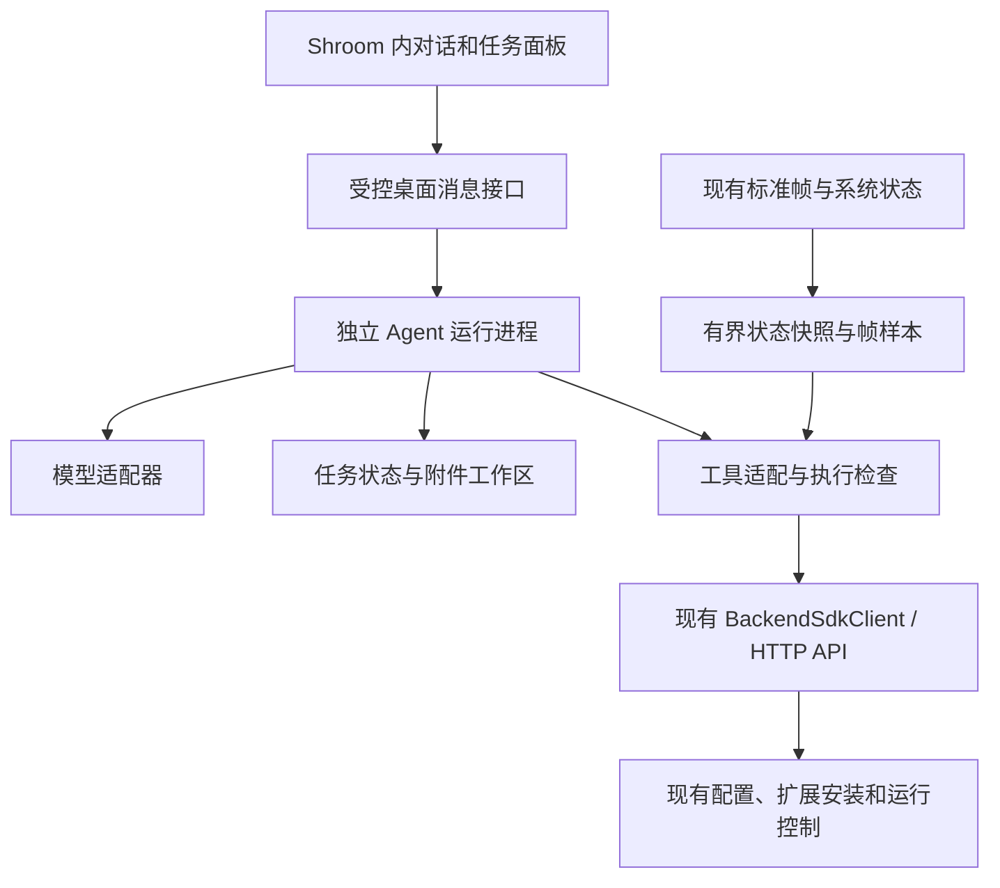

# Shroom 内置 Agent：首版任务计划

> 日期：2026-09-15。性质：初始计划及实施对照；当前落地范围见第 10 节。
> 目标：用户在 Shroom 内对话、导入资料、查看执行进度并使用结果。
> 第 1–9 节保留规划时的范围、估算和完整验收清单；未勾选不代表代码均未实施，请以第 10 节及使用指南为准。

## 1. 首版交付目标

用一套协议已受平台支持的单传感器设备，完成以下流程：

```text
导入协议与线序资料 → 生成使用现成能力的系统 → 校验并安装
→ 激活并观察真实帧 → 对话修改展示 → 对缺帧等故障给出证据
```

首版交付三种用户任务：

1. 创建系统：根据资料组合已注册的协议、算法、渲染器和图表。
2. 修改系统：修改当前系统支持的展示配置，并显示变更和应用结果。
3. 诊断设备：检查连接、有效帧、通道归属和展示状态，说明已确认问题及待确认信息。

首版按一个 Agent、一个模型提供方、一个有副作用的任务队列实现。模型选择由短期技术验证确定，保留适配接口。
软件需要新增 Agent 运行模块；复用现有 SDK、业务接口、校验器和随包规则，不预设已有可嵌入的外部 Agent 服务。

后续迭代加入自定义代码生成、定时采集与批量导出、历史数据分析和报告。
未知协议、任意模型自动映射、扫描文档 OCR、新增原生依赖等需求，先验证平台是否支持，再单独估算。

## 2. 实施假设与估算口径

- 单人开发、AI 辅助，Windows 为首个交付平台；实际人员和可投入时间尚未确认。
- 按每周 40 小时计算，预留 20% 处理问题和返工，计划净容量为每周 32 小时。
- 没有历史迭代速度，使用理想开发小时估算，不虚构故事点或历史产能。
- 六阶段合计约 108–156 小时，对应约 4–6 个日历周；这是规划范围，T0 结束后重新估算。
- 第一个可体验原型目标为约 3–5 个开发日：软件内提问，真实调用只读工具，显示实际结果。
- 真机验收依赖一套代表设备、已知正确的协议/线序和样例数据；缺少设备时只能交付待真机验证的候选版本。

## 3. 新增模块与复用边界

以下路径是建议新增位置，实施前确定最终命名：

| 模块 | 建议位置 | 职责 |
| --- | --- | --- |
| 对话与任务界面 | `client/src/features/agent/` | 输入、附件、任务步骤、变更摘要、执行结果；接入既有软件界面 |
| 进程生命周期 | `app/electron/agentProcess.js` | 启动、健康状态、退出和异常回收；Agent 运行在独立进程 |
| Agent 运行模块 | `backend/agent-runtime/` | 模型适配、工具循环、上下文组装、单任务调度 |
| 工具适配 | `backend/agent-runtime/tools/` | 结构化参数、授权范围、调用现有 SDK、返回可验证结果 |
| 会话、附件与任务记录 | `userData/agent/` | 保存会话、输入引用、生成草稿、步骤结果及恢复信息 |



现有采集、算法、存储、回放和实时展示继续使用原链路。模型按需读取摘要或少量样本。
独立进程用于避免共享事件循环及管理生命周期，不等于已具备任意生成代码的安全沙箱。

## 4. 阶段任务

| 阶段 | 工作量估算 | 主要产物 | 前置依赖 | 负责人角色 |
| --- | --- | --- | --- | --- |
| T0：固定范围与验证接入 | 8–12 小时 | 样例任务、模型接入结论、工具与事件约定 | 代表输入资料 | 主开发 |
| T1：软件内运行闭环 | 20–28 小时 | 对话、运行进程、真实只读工具、进度与错误 | T0 | 运行层与前端 |
| T2：任务执行与状态 | 20–28 小时 | 单队列、任务记录、权限检查、状态核验 | T1；部分可与 T1 并行 | 运行层 |
| T3：创建展示系统 | 28–40 小时 | 资料解析、配置草稿、校验安装、首帧验证 | T2 | 业务工具与集成 |
| T4：修改与诊断 | 16–24 小时 | 展示配置修改、结构化故障诊断 | T2；综合验收依赖 T3 | 业务工具与前端 |
| T5：首版验收与打包 | 16–24 小时 | 回归证据、真机记录、Windows 安装包验证 | T3、T4 | 主开发与验收 |

### T0：固定首个场景，验证模型与工具调用

- [ ] 固定一套已支持协议的传感器、一份线序资料、一组真实样例和预期矩阵。
- [ ] 选择首个模型接入方式，实测结构化工具调用、流式输出、取消和错误返回；在实施时核查所选服务的当前官方文档。
- [ ] 列出三种首版任务需要的工具，区分已有 API 与需要补齐的观察接口。
- [ ] 约定任务 ID、步骤 ID、工具调用 ID、结果格式、错误码和 UI 事件；沿用已有命令 requestId。
- [ ] 明确首批文件格式：文本协议资料、JSON、CSV 和 XLSX；文本 PDF 按解析可行性纳入，扫描件另估。

验收：一个最小程序能真实读取运行中软件的契约与系统目录，模型根据结果回答；固定输入能人工核对预期输出。

### T1：在软件里完成第一次真实工具调用

- [ ] 新增独立 Agent 进程及受控消息接口，接入 Electron 启动、关闭和异常回收。
- [ ] 新增软件内对话入口、模型连接配置、流式回复、工具执行状态和明确错误提示。
- [ ] 接入 `getContract`、系统列表和端口状态等只读工具；结果由工具返回，模型不猜测设备状态。
- [ ] 凭据只进入受控运行模块，使用选定的安全存储方式，不写入前端持久化、日志或生成文件。
- [ ] 保存最小会话历史和任务入口，设置调用超时、最大工具步数与调用预算。

验收：在软件里询问当前系统/设备情况，可看到真实工具调用及对应结果；无凭据、网络失败、用户停止和进程异常均能明确结束当前操作。

### T2：建立可靠任务执行机制

- [ ] 保存任务阶段、输入引用、目标系统、工具参数、结果和产物；记录可观察的操作，不依赖模型记忆恢复状态。
- [ ] 区分运行、核验、成功、失败、中断、结果不确定；已接受的命令不得直接标记业务完成。
- [ ] 单个有副作用任务顺序执行；重试前查明上次执行结果，对创建/覆盖等操作保存任务与产物关联。
- [ ] 取消时停止模型调用和后续调度；已发出的后端操作需要独立核实。后端未确认停止时不得显示“已取消执行”。
- [ ] 将权限和可写路径检查放在工具执行端，复用用户已授权范围；资料和日志中的文字按数据处理。
- [ ] 每次执行前刷新当前系统、实时/回放状态及必要前置条件。对同一系统的手动修改采用后端版本前提检查或等效互斥策略，避免覆盖新修改。
- [ ] 为任务固定目标系统和会话代次；用户切换系统后核验任务作用域，旧响应不得更新新系统或把下一步操作转向新目标。
- [ ] 进程重启后标明中断任务，先核验已产生结果；不自动重放状态不明的写操作。

验收：超时、重复请求、重启和用户中途修改目标配置，都不会造成静默重复安装或错误宣告成功。

### T3：完成自然语言创建系统

- [ ] 资料导入使用受限的任务工作区和附件 ID，设置大小、数量及解析超时限制。
- [ ] 结构化提取矩阵、协议、线序与业务通道身份，并保留来源；关键资料缺失时明确请求补充，不补造协议参数。
- [ ] 读取运行中的契约、策略、协议预设和 catalog，加载随软件版本发布的生成规则。
- [ ] 组合已有能力，生成 manifest、definitions 和可读摘要；沿用平台字段和稳定标识。
- [ ] 复用服务端校验与安装 API；将生成、校验、保存、重载、激活和观察帧分为可追踪步骤。
- [ ] 记录系统和扩展标识、任务生成文件及变更前状态；失败时清楚展示已完成步骤和可恢复范围。
- [ ] 验证目标通道真实 canonical 帧的身份、来源、尺寸、点数、样例值和方向；无设备时只标记配置安装完成。

验收：从固定资料生成系统，安装后可在软件中发现；连接明确设备并按既有许可激活后，观察到符合样例的真实数据。仅保存成功、串口 open 或界面 ready 不算端到端通过。

### T4：修改系统与诊断故障

- [ ] 将“修改展示”映射到已有 display 局部保存入口，展示修改前后差异，复查结果。
- [ ] 首版支持选择已有渲染方式、已有图表以及契约允许的显示参数；目录不支持的需求明确报告能力缺口。
- [ ] 修改前记录可恢复配置；后端保存失败、前端应用失败和用户并发修改分别处理。恢复只覆盖明确可逆的配置修改。
- [ ] 建立端口 → 有效帧 → 通道身份 → 激活状态 → 展示状态的观察链；没有观察接口的环节返回“未知”，并按需补接口。
- [ ] 故障回答携带观测时间、目标设备/通道、实际状态和下一步检查；区分推断与已确认结论。

首版诊断工具只读；建议的修复需要作为有明确目标和授权范围的另一项操作执行。

验收：用对话完成一次展示修改，重开软件后配置保留；对无数据、点数不符、目标通道不符等故障给出与证据一致的结论。

### T5：集成、真机与安装包验收

- [ ] 维护固定需求和输入资料的回归集，覆盖成功、错误参数、重复调用、超时、中断与恢复。
- [ ] 前端使用可控测试事件验证交互；同时保留真实模型与真实工具的完整任务记录。
- [ ] 按仓库规则执行 Full，覆盖 Electron 生命周期、SDK/HTTP 边界及依赖变化。
- [ ] 用代表设备验证创建、修改、诊断，并在采集运行时观察 Agent 启停及异常的影响。
- [ ] 在 Windows 安装包环境核对资源、凭据、附件路径、用户数据目录、关闭回收及重启状态。
- [ ] 更新当前开发手册及 ARCHITECTURE.md 维护记录；仅在入口、契约或验证路由变化时更新索引。

验收：通过下方首版场景，并分别提供自动化、真实模型、真机和安装包证据。测试通过不得替代真机结论。

## 5. 首批工具与现有能力对应

以下是工具职责，不预先冻结新工具的字段或函数名：

| 工具职责 | 主要复用来源 | 补充工作 |
| --- | --- | --- |
| 查询平台能力 | SDK contract、policy、catalog | 工具 schema、版本检查、按任务裁剪上下文 |
| 读取系统与运行状态 | 系统目录、serial/status、channels 等 | 统一带时间与目标身份的快照；缺项明确 unknown |
| 读取附件 | 新任务附件工作区 | 格式解析、引用追踪、资源限制 |
| 创建系统 | Display System workspace API | 生成草稿、步骤记录、重复调用处理、失败核验 |
| 修改展示 | display 局部保存 API | 差异、前置版本检查、读回验证、配置恢复 |
| 激活与连接 | `sensor.switch`、`serial.open` | 目标确认、既有许可检查、等待真实帧 |
| 核验与诊断 | 标准帧订阅、已有状态及受限日志 | 有界样本、观察时限、前端展示状态补充 |

## 6. 首版验收场景

| 场景 | 通过条件 |
| --- | --- |
| 有效资料创建系统 | 配置校验通过，系统可发现；真机阶段目标通道的真实帧与样例一致 |
| 缺协议或线序有歧义 | 明确缺项，任务停在待补资料；不把猜测配置标记为可用 |
| 重复点击、响应丢失后重试 | 可定位第一次执行结果；不生成重复系统或静默覆盖 |
| 对话修改图表或渲染 | 只改变授权的展示项；保存读回和界面实际应用均通过 |
| 用户同时手动改配置 | 检出版本冲突或占用，不覆盖较新的修改 |
| 执行中切换系统 | 旧响应与任务仍绑定原目标；下一步不误操作新系统 |
| 串口打开但无有效帧 | 说明已连接但缺有效数据；不宣告展示系统端到端可用 |
| 实时与回放混淆、通道不符 | 基于 source 和身份拒绝错误验收；指出实际观测对象 |
| 模型超时、取消或进程崩溃 | 不再调度后续步骤；保留已完成操作和不确定项，重启可核验 |
| 写入中断或多步骤部分成功 | 显示已保存/已激活范围，提供可恢复路径，不用聊天“失败”掩盖已发生变更 |
| 安装包与采集同时运行 | Agent 能从安装包启动、退出及恢复；既有采集链按原验收要求通过 |

## 7. 依赖与并行安排

关键路径：T0 → T1 → T2 → T3 → T5。
T4 的局部配置与诊断工具在 T2 后可与 T3 并行，最终统一进入 T5。

- T0 固定消息契约后，前端对话面板与运行层可以并行；模拟事件只用于交互开发。
- 运行层搭建时，可独立整理固定样例、现有工具映射和回归场景。
- 真实的写入任务必须等 T2 的状态、执行检查和失败语义就绪后接入。
- 单人实施以顺序推进为主；普通任务最多安排两个互不重叠的子任务，并行不会自动折半工期。

首个两周建议目标：在软件内完成有进度、有结果的真实只读任务，并具备最小任务记录。

- 总容量：80 小时；统一预留 16 小时，净计划容量 64 小时。
- 建议选入：T0 最多 12 小时、T1 最多 28 小时、T2 的任务记录/单队列/超时第一批 16 小时，共 56 小时。
- 剩余 8 小时用于集成和估算误差；T0 验证后再确认后续故事，不把完整 T3 提前承诺进首个迭代。

主要进度风险：模型工具调用能力不满足要求、资料格式复杂、缺少真实状态观察接口、手动与 Agent 写入冲突、安装包运行资源遗漏。
对应处理：T0 先实测模型；固定首批资料格式；工具明确 unknown 并按需补接口；写入前提在执行端校验；T1 起验证进程生命周期，T5 完成正式安装包核对。

## 8. 首版之后的迭代

1. 自定义图表与算法：先接 Agent App 生成及现有安装校验，再单独完善生成算法的执行限制、样本和指标验证。
2. 自动采集与导出：补任务与后端操作的身份关联、完成查询、停止语义和不确定结果处理，再串联定时采集和批量导出。
3. 数据分析与报告：提供受限历史读取、确定性统计和报告生成工具，再让 Agent 编排这些工具。

特别依赖：现有命令 ACK 已有 requestId，但 CSV 完成事件缺少可靠请求身份。客户端批量导出只在单个活跃导出方假设下成立；软件内 Agent 的单队列不能阻止用户在其他入口同时导出。全局互斥或完成身份契约必须先解决。
现有 Agent App 安装已有 staging、backup 和失败回滚。后续补的是整个任务的跨步骤恢复及可逆配置版本，不重新实现已有单包安装器。

## 9. 验证规则与代码依据

初次规划只新增此文档，没有运行代码测试、服务、构建或真机测试；后续实施验证见第 10 节。
实施时，纯 UI 局部变更按 Standard；触及 Electron/IPC、HTTP/命令、公共 SDK、依赖、存储或实时契约时按 Full。
后端测试使用项目 Electron 的 Node ABI，构建输出使用系统临时目录；实际发布仍需单独授权。

- [当前开发者手册](../developer-guide.md)
- [架构入口及验证矩阵](../../ARCHITECTURE_INDEX.md)
- [已有目标架构：目标态参考](../shroom-platform-target-architecture.md)
- [Backend SDK 客户端入口](../../sdk/backend/client/index.js)
- [运行契约](../../sdk/backend/contract/sdkApiContract.js)
- [Agent App 安装服务](../../backend/extension-host/agent-apps/agentAppService.js)
- [展示系统工作区](../../backend/extension-host/workspace/displaySystemWorkspaceService.js)
- [命令 HTTP 入口](../../backend/kernel/platform/http/controlRoutes.js)
- [现有批量导出控制器](../../client/src/components/title/portalCsvBatch.js)
- [随包机器规则](../../agent-resources/policy.json)

## 10. 2026-09-15 实施对照

用户随后授权直接实施。已实现的软件入口及具体限制见 [内置 Agent 使用指南](../embedded-agent.md)。以下区分代码和验收，不将合成模型/设备算作真实模型/真机通过。

| 阶段 | 当前实现 | 尚待完成的验收或范围 |
| --- | --- | --- |
| T0 | Responses 适配、工具/事件/状态契约、UTF-8 文本与 XLSX 附件 | 用户实际模型账号、代表设备和真实输入资料 |
| T1 | 全局对话、模型设置、流式消息、独立 utilityProcess、受限 IPC、系统加密密钥、真实业务接口 | 实际模型服务的联调 |
| T2 | 单活动任务锁、持久化步骤/提案、取消/超时、中断恢复、revision 冲突检查、不确定写操作不重做 | 真机多窗口并发和长时间采集影响 |
| T3 | 已有协议/算法/渲染器创建提案、校验保存读回、指定目标连接提案、标准帧观察 | 真实资料的方向/标定核验；未知协议与任意自定义源码仍属后续 |
| T4 | display 局部修改/恢复、状态和帧诊断 | 切换既有系统 renderer/profile 未接入；真实画面/物理一致性未验证 |
| T5 | Full 9/9、隔离浏览器交互、真实 Electron/临时 ASAR 独立进程冒烟通过 | 真实模型记录、真机全链路、安装后 Windows 包验证 |

真实 Electron 冒烟使用本机合成 Responses HTTP 服务和模拟设备状态，确实启动 utilityProcess 并验证加密/流/工具/持久化/关闭。
未配置实际模型密钥、未连接硬件、未生成正式安装包；不将此候选实现描述为真机验收完成。
