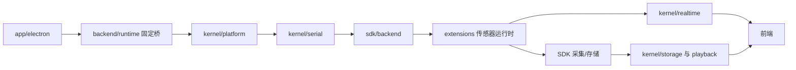

# Shroom 仓库目录地图

> 最后更新：2026-08-28

本文把产品中的“稳定软件壳、后端稳定内核、可变扩展和前端展示”映射到当前真实仓库目录。只描述已经落地的结构。

## 1. 分层关系

| 产品层 | 当前目录 | 责任与边界 |
| --- | --- | --- |
| Electron 稳定软件壳 | `app/electron/` | 启动本地后端、承载网页并提供系统集成；不直接依赖后端内部模块 |
| Electron 后端固定桥 | `backend/runtime/index.js`、`backend/common/logger.js` | 保持 Electron 现有启动和日志路径不变 |
| 应用后端稳定内核 | `backend/kernel/` | 平台装配、串口编排、存储、回放、CSV、实时输出和算法集成 |
| 后端扩展宿主 | `backend/extension-host/` | 发现、校验、绑定和调度展示系统/传感器扩展 |
| 后端扩展实现 | `backend/extensions/` | 内置传感器运行时和展示系统示例 |
| 可复用后端 SDK | `sdk/backend/` | 协议、串口底层、采集、存储和处理的单一来源 |
| 前端稳定运行能力 | `client/src/runtime/`、`renderers/`、`displays/`、`services/` | 运行总线、渲染/展示注册和通信 |
| 前端可变业务与可视化 | `client/src/extensions/`、`visualization/`、`page/` | 展示系统、人体等业务界面与可视化 |
| 展示系统工作区 | `display-systems/` | 当前可扫描的展示系统配置与资源 |
| 安装包网页资源 | `build/` | 当前随应用交付的网页资源和离线兜底 |

## 2. 当前核心目录树

```text
E:/shroom1/
├─ app/
│  └─ electron/                         # 稳定 Electron 壳
├─ backend/
│  ├─ common/
│  │  └─ logger.js                      # Electron 固定日志桥
│  ├─ runtime/
│  │  └─ index.js                       # Electron 固定后端桥
│  ├─ kernel/
│  │  ├─ platform/                      # 启动、命令、HTTP、WS、授权、运行态
│  │  ├─ serial/                        # 应用侧串口控制与编排
│  │  ├─ storage/                       # 数据库装配与历史查询
│  │  ├─ playback/                      # 回放
│  │  ├─ csv/                           # CSV 导出
│  │  ├─ realtime/                      # 实时帧分发
│  │  └─ algorithm-channel/             # 简单算法通道
│  ├─ extension-host/                   # 展示系统扩展宿主
│  │  ├─ manifest/                     # 配置发现、校验与展示定义
│  │  ├─ runtime/                      # 通道规划、绑定与调度
│  │  └─ workspace/                    # 用户展示系统工作区
│  ├─ extensions/
│  │  ├─ built-in-sensors/              # 内置传感器运行时
│  │  └─ examples/                      # 展示系统示例
│  ├─ compatibility/                    # 历史迁移资料
│  └─ tests/                            # 后端测试
├─ sdk/
│  └─ backend/                          # 可复用后端能力单一来源
├─ client/
│  └─ src/
│     ├─ runtime/                       # 前端运行时基础设施
│     ├─ renderers/                     # 渲染器注册与宿主
│     ├─ displays/                      # 展示注册能力
│     ├─ services/                      # 通信与应用服务
│     ├─ extensions/                    # 可变业务能力
│     ├─ visualization/                 # 可视化实现
│     ├─ page/                          # 页面入口
│     └─ legacy/                        # 仍需参考或兼容的旧页面
├─ display-systems/                     # 展示系统工作区
├─ build/                               # 随应用交付的网页资源
└─ docs/
   └─ repository-map.md
```

`backend/` 一级目录现为七类：`common`、`runtime`、`kernel`、`extension-host`、`extensions`、`compatibility`、`tests`。旧的 `server`、`services`、`serial`、`db`、`displaySystems` 等一级路径和兼容转发层已经移除。

## 3. 后端稳定链路



- Electron 的后端启动入口和日志入口保持原路径。
- `kernel/serial` 负责应用编排，串口底层和协议仍由 SDK 提供。
- `kernel/storage` 负责应用数据库装配和查询，通用存储能力仍由 SDK 提供。
- `extension-host` 是扩展接入点，具体运行时位于 `extensions`。
- 目录迁移没有改变硬件协议、线序语义、数据库结构或历史数据格式。

## 4. 新能力应该放在哪里

| 新能力 | 推荐落点 |
| --- | --- |
| 新传感器应用运行时 | `backend/extensions/built-in-sensors/` |
| 新展示系统示例 | `backend/extensions/examples/<id>/` |
| 展示系统配置发现与校验 | `backend/extension-host/manifest/` |
| 展示系统运行调度 | `backend/extension-host/runtime/` |
| 展示系统工作区 | `backend/extension-host/workspace/` |
| 应用侧串口多通道编排 | `backend/kernel/serial/` |
| 协议和串口通用能力 | `sdk/backend/protocol/`、`sdk/backend/serial/` |
| 采集和存储通用能力 | `sdk/backend/collection/`、`sdk/backend/storage/` |
| 通用矩阵处理算法 | `sdk/backend/processing/` |
| Shroom 专用 Node/Python 算法集成 | `backend/kernel/algorithm-channel/` |
| 新前端业务页面 | `client/src/extensions/` 或 `client/src/page/` |
| 新可视化 | `client/src/visualization/`，通过现有 renderer/display 机制注册 |

## 5. 不可跨越的边界

- 不因新增传感器或渲染方式修改 Electron 固定桥。
- 后端应用层不复制 SDK 的协议、串口、采集、存储和处理实现。
- 扩展通过 `extension-host` 和稳定内核接入，不反向控制 Electron 主进程。
- `compatibility/` 只服务历史兼容，不作为新业务模块库。
- 涉及硬件协议、历史数据格式或 SDK 公共 API 的变化必须单独评审；本次目录收拢不包含这些变化。

## 6. 当前网页交付边界

`build/` 是当前安装包内的网页资源和离线兜底。在线版本检测、自动缓存和离线回退属于后续产品能力；当前目录结构不把它描述为已落地功能，也不因此改动 Electron 稳定入口。

## 7. 一级目录中的源码与运行产物

| 目录 | 当前性质 | 处理结论 |
| --- | --- | --- |
| `build/` | Electron 固定读取的前端构建资源 | 保留现路径；移动会影响稳定入口 |
| `release-notes/` | Windows/macOS 版本说明源文件 | 保留；版本历史在前端构建时读取 Windows Markdown |
| `display-systems/` | 可配置展示系统工作区 | 保留，不是临时目录 |
| `db/` | 初始化库与本机历史数据库 | 只跟踪 `init.db`；历史库不得移动或删除 |
| `pack-resources/` | 打包资源暂存 | 被打包配置使用；当前保留 |
| `dist/` | 安装包与更新清单构建产物 | 已忽略，不应提交 |
| `data/`、`img/`、`oneStepPdf/` | 开发态 CSV、上传图片和报告输出 | 新文件已忽略；已有跟踪内容及路径迁移等待数据兼容确认 |
| `outputs/`、`test-results/`、`runtime/temp/`、`tmp/` | 工具输出、测试状态和运行临时文件 | 新文件已忽略；已有跟踪内容尚未批量移除 |
| `project/` | 未被生产、测试或打包引用的旧模型/原型 | 候选归档；其中大部分模型纹理与正式资源重复，尚未删除 |

开发态导出仍由 `backend/kernel/platform/serverPathConfig.js` 指向根目录下的 `data/`、
`img/` 与 `oneStepPdf/`。将其统一迁移到 `runtime/exports/` 会改变已有文件位置，必须在
备份、兼容读取和用户可见下载位置确认后单独实施。
