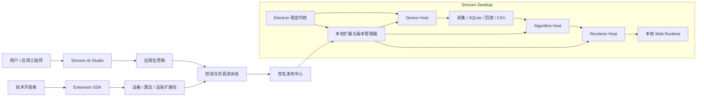

# Shroom 理想平台目标架构

> 文档性质：目标态架构设计，不代表当前版本已经全部实现  
> 面向读者：产品、架构、后端、前端、算法、测试与交付团队  
> 更新日期：2026-08-28  
> 当前实现请以项目根目录的 [`ARCHITECTURE.md`](../ARCHITECTURE.md) 为准

## 1. 文档目的

本文描述 Shroom 从“多传感器 Electron 桌面应用”演进为“可扩展、可生成、可验证的传感器应用平台”后的理想架构。

目标是同时满足两件看似冲突的事情：

1. 串口连接、采集、存储、回放和导出必须长期稳定；
2. 新传感器、新算法、新渲染和新客户界面必须可以快速增加。

架构的核心判断是：

> Electron 稳定内核负责可信执行，变化能力通过受控扩展包接入，AI 只生成可检查的应用制品，不能修改内核。

## 2. 架构目标与非目标

### 2.1 架构目标

- 新增常见串口传感器时，不修改 Electron 主进程和稳定采集链路；
- 新增算法时，不影响原始数据采集、保存、回放和导出；
- 新增 2D/3D 渲染时，不向渲染代码暴露串口、文件系统或数据库权限；
- Web 页面可以在线发布、下载后本地运行，并支持断网启动和版本回退；
- 技术开发者能够编写并验证扩展，非技术人员能够借助 AI 组合现有能力；
- 每次采集都能追溯使用了哪些设备、算法和渲染版本；
- 实时、保存、回放和 CSV 使用同一套数据语义；
- 单个插件故障不能拖垮稳定内核和正在进行的采集。

### 2.2 非目标

- 不承诺所有未知传感器都能零代码接入；
- 不允许 AI 或客户直接修改 Electron、preload、IPC、数据库和更新逻辑；
- 不允许联网下载的包直接执行任意 Node、Python、Shell 或原生代码；
- 不把普通 Service Worker 缓存视为 Electron 的完整更新和回滚系统；
- 不在第一阶段建设开放插件市场或面向大众的通用低代码平台；
- 不将渲染后的插值、平滑或颜色数据作为采集和统计的数据真相。

## 3. 核心架构原则

### 3.1 稳定内核，外部扩展

客户、AI 和普通插件永远不能修改稳定内核。平台方可以低频发布经过签名、实机回归和可回滚的内核升级。

### 3.2 数据真相只有一份

协议解析和线序归一化后的 `CanonicalFrame` 是采集、统计、回放和导出的统一基础。算法只能增加派生层，渲染器只能消费数据。

### 3.3 默认拒绝权限

插件只能获得清单中声明并由宿主批准的最小能力。文件、网络、Shell、设备写入和系统权限默认全部拒绝。

### 3.4 先验证，再发布

任何设备包、算法包、渲染包和应用包都必须经过 Schema、权限、样本、黄金结果和兼容性检查后才能激活。

### 3.5 本地优先，在线分发

在线服务负责发布、授权和下载；现场采集、算法执行、回放和导出默认在本地完成。断网不应影响已经安装并验证通过的应用。

### 3.6 版本可追溯、结果可复现

应用不能依赖模糊的 `latest`。一次采集必须记录精确插件版本、哈希、参数和数据契约版本。

## 4. 系统上下文



## 5. 逻辑分层

| 层级 | 主要职责 | 更新频率 |
| --- | --- | --- |
| Electron 稳定内核 | 窗口、进程、权限、串口所有权、本地服务、存储、更新与恢复 | 低频 |
| 扩展运行时 | Device、Algorithm、Renderer 三类 Host 与资源限制 | 低频 |
| 设备扩展包 | 协议、通道、矩阵、线序、基础标定和测试样本 | 按设备更新 |
| 算法扩展包 | 算子图、模型、参数 Schema、指标、事件和黄金结果 | 按算法更新 |
| 渲染扩展包 | 2D/3D 视图、模型、布局、控件、主题和展示参数 | 高频 |
| Shroom 应用包 | 将设备、算法、渲染、工作流和报告锁定为一个可交付应用 | 按项目更新 |
| AI Studio | 收集需求、推荐能力、生成草稿、解释差异和引导验证 | 高频在线更新 |

## 6. Electron 稳定内核

稳定内核是平台的根信任，负责以下能力：

- Electron 生命周期和窗口管理；
- 串口枚举、打开、关闭、重连和限流；
- 插件进程启动、终止、超时和资源回收；
- IPC 与本地接口的权限代理；
- 会话、采集、SQLite、回放和 CSV 导出；
- 扩展包下载、验签、安装、激活和回滚；
- Web Bundle 的本地版本选择；
- 审计日志、诊断信息和健康检查；
- 厂商签名内核更新。

内核不应该继续累积以下内容：

- 具体客户页面；
- 某个传感器型号的专属线序分支；
- 某个客户的阈值、颜色和报告格式；
- 可以由插件 Host 表达的业务算法；
- 渲染模型和品牌资源。

## 7. 三类扩展宿主

### 7.1 Device Host

Device Host 拥有稳定内核提供的受控字节流，负责运行设备扩展。插件本身不直接打开串口。

```text
串口 → RawChunk → Device Plugin → DecodedFrame → CanonicalFrame
```

设备扩展可以描述：

- 波特率和只读串口参数；
- 固定长度、分隔符、帧头帧尾和最大帧长；
- 数值类型、大小端、偏移和通道；
- CRC 或已注册校验算法的参数；
- 矩阵尺寸、裁剪、旋转、翻转和点位映射；
- 基础清零、标定系数和质量状态；
- 原始帧样本与预期矩阵。

优先使用声明式协议。声明式 DSL 无法表达时，允许技术开发者提交经过审查和签名的受限 Decoder；首选无系统权限的 WASM 或独立进程协议，而不是在主进程执行动态 JavaScript。

### 7.2 Algorithm Host

Algorithm Host 消费不可变的 `CanonicalFrame`，输出派生层、指标和事件。

```text
INIT(config)
PROCESS(frame) → layers + metrics + events + quality
RESET(reason)
SNAPSHOT / RESTORE（可选）
DISPOSE
```

算法插件不得覆盖 `normalized` 层，只能增加具名结果，例如：

```text
layers.pressureSmoothed
layers.postureProbability
metrics.centerOfPressure
metrics.leftRightBalance
events.overPressure
```

算法分为两档：

1. `algorithm.graph`：由白名单算子组成，AI 可以生成和调参；
2. 代码型算法：由技术开发者提供并由平台签名，在隔离运行时执行。

旧有 Python 算法可以先通过 `TrustedLegacyAlgorithmAdapter` 接入。需要新增 Python 包、DLL、CUDA 或原生依赖时，应更新独立算法运行时或由平台方评估内核升级。

### 7.3 Renderer Host

Renderer Host 将标准数据传给隔离的 Web 渲染器。

```text
Host → INIT / FRAME / SETTINGS / RESIZE / DISPOSE
Plugin → READY / USER_EVENT / PERFORMANCE / ERROR
```

渲染器可以获得：

- 标准 `RenderFrame`；
- 自己的只读模型、纹理和字体；
- 声明式控件状态；
- Canvas、OffscreenCanvas 或隔离页面容器。

渲染器不能获得：

- Electron preload 和原始 IPC；
- Node、Shell 和文件系统；
- 串口句柄和本地服务令牌；
- 任意网络访问；
- 修改采集数据的能力。

第三方渲染器应运行在 sandbox iframe、Worker 或独立 WebContents 中。渲染器失效时，系统应回退到内置原始矩阵视图，采集继续运行。

## 8. 标准数据契约

### 8.1 数据分层

```text
RawChunk v1
  ↓ 设备协议解析
DecodedFrame v1
  ↓ 线序、方向、通道和基础标定
CanonicalFrame v1
  ↓ 算法处理
ProcessedFrame v1
  ↓ 展示适配
RenderFrame v1
```

### 8.2 契约定义

| 契约 | 最小内容 | 所有者 |
| --- | --- | --- |
| RawChunk | bytes、receiveTimestamp、portId、sequence | 稳定内核 |
| DecodedFrame | sensorId、channel、samples、shape、unit、quality | Device Host |
| CanonicalFrame | seq、timestamp、normalized、rawRef、devicePluginRef、quality | Data Core |
| ProcessedFrame | canonicalRef、layers、metrics、events、algorithmRefs | Algorithm Host |
| RenderFrame | 显示所需的只读矩阵、指标、事件和展示元数据 | Renderer Host |

大矩阵使用 TypedArray 或 Transferable ArrayBuffer 传输；控制和元数据使用严格 JSON Schema。

### 8.3 数据真相规则

- `CanonicalFrame.normalized` 是统计、采集、回放和 CSV 的基础真相；
- 左侧压力总和、面积、最大值、均值和趋势必须来自协议解析、线序归一化后的原始矩阵；
- 3D 插值、高斯平滑、颜色映射和点云结果仅用于显示；
- 线序、旋转和翻转只能在设备归一化阶段执行一次；
- 算法失败不能阻止 CanonicalFrame 落库；
- 重新使用新算法计算历史数据时，结果必须标记为“重算”，保留原计算版本；
- 一次会话必须记录设备包、算法包、参数和 Schema 的精确版本及哈希。

## 9. 扩展包格式

三类扩展共用 `.shroompkg`，通过 `kind` 区分。

```text
example.shroompkg
├─ manifest.json
├─ payload/
│  ├─ device.json
│  ├─ algorithm.graph / algorithm.wasm
│  └─ renderer/
├─ assets/
├─ schemas/
├─ tests/
│  ├─ inputs/
│  └─ expected/
├─ sbom.json
├─ hashes.json
└─ signature.ed25519
```

### 9.1 Manifest 最小字段

```json
{
  "schemaVersion": 1,
  "kind": "device|algorithm|renderer",
  "id": "com.shroom.example",
  "version": "1.0.0",
  "publisher": "shroom",
  "requires": {
    "kernelApi": "^1.0",
    "frameSchema": "^1.0",
    "hostApi": "device@1"
  },
  "entrypoint": "payload/device.json",
  "permissions": [],
  "resourceLimits": {},
  "dependencies": [],
  "testManifest": "tests/manifest.json"
}
```

### 9.2 应用包

`.shroomapp` 不包含内核代码，只负责锁定一个应用所需能力：

```json
{
  "schemaVersion": 1,
  "appId": "com.customer.seat-demo",
  "version": "1.0.0",
  "requiresKernelApi": "^1.0",
  "device": {
    "id": "com.shroom.seat-16x16",
    "version": "2.1.0",
    "hash": "sha256:..."
  },
  "algorithms": [],
  "renderers": [],
  "workflow": {},
  "report": {},
  "permissions": []
}
```

应用锁文件必须使用精确版本和哈希，不能在现场自动解析到未知的最新版。

## 10. AI Studio

AI Studio 位于稳定内核之外。它的角色是需求翻译器和受控制品生成器，而不是内核代码修改器。

### 10.1 AI 可以生成

- 已注册协议原语的设备描述；
- 矩阵、通道、线序和方向映射草稿；
- 白名单算法节点及参数；
- 已注册渲染器的布局和展示设置；
- 采集、报警、报告和导出工作流；
- 原始帧样本、预期矩阵和一致性测试；
- 接线、操作和验证文档。

### 10.2 AI 不可以直接发布

- 新 USB、BLE、HID、CAN 驱动；
- Electron 主进程、preload 和 IPC 修改；
- 任意 JS、Node、Python、Shell、WASM 或原生库；
- 数据库 Schema 和核心数据语义；
- 文件、网络、摄像头和设备写入权限；
- 未经真实样本确认的协议、线序和标定结果；
- 医疗诊断、安全控制或执行器控制结论。

### 10.3 AI 发布流水线

```text
自然语言需求
→ AI 生成草稿
→ Schema 和权限检查
→ 录制帧仿真
→ 黄金结果与实时/回放/CSV 一致性测试
→ 用户预览和差异确认
→ 技术审批（按风险需要）
→ 平台签名
→ staging 安装
→ 健康检查
→ 激活或回滚
```

## 11. 权限与执行隔离

| 扩展类型 | 推荐隔离 | 资源限制 | 故障策略 |
| --- | --- | --- | --- |
| 声明式设备协议 | 内核受控解释器 | 帧长、频率、矩阵、缓冲上限 | 拒绝坏帧或停止该设备 |
| 自定义 Decoder | 无系统权限的 WASM/utility process | CPU、内存、单帧超时、输出大小 | 杀死实例，保留原始字节诊断 |
| 算法 | WASM/独立算法进程 | 每帧 deadline、队列长度、内存 | 跳过派生结果，采集继续 |
| 渲染器 | sandbox iframe/WebContents/Worker | FPS、GPU、消息大小、无网络 | 销毁并回退基础矩阵 |

基础权限示例：

```text
device: serial.read-via-host
algorithm: canonical.read + derived.write
renderer: render.read + ui.event
```

以下能力不能由插件自行声明获得：串口任意写入、文件系统、Shell、任意网络、固件升级、摄像头、系统 IPC 和授权管理。

## 12. 版本、安装与回滚

### 12.1 独立版本维度

```text
kernelVersion
kernelApiVersion
frameSchemaVersion
deviceHostApiVersion
algorithmHostApiVersion
rendererHostApiVersion
webBundleVersion
appVersion
```

### 12.2 安装流程

```text
下载到 staging
→ 校验 HTTPS 来源
→ 校验签名和逐文件哈希
→ 校验路径、解压大小和资源上限
→ 校验 Schema、权限和兼容范围
→ 执行扩展自带测试
→ 原子安装
→ 在安全时机激活
→ 健康检查
→ 失败回退 previous
```

设备和算法不能在一次采集中途热切换。允许预下载，但必须在停止采集后激活。渲染器也应在明确的安全刷新点切换。

## 13. Web 在线发布与离线运行

Electron 不直接依赖在线页面运行。在线服务发布签名、不可变的 Web Bundle，本地主进程负责版本管理。

```text
resources/build/                  factory
userData/web-bundles/<version>/  已验证版本
userData/web-current.json        current / previous 指针
```

启动顺序：

1. 加载 `current`；
2. Web 回报 `WEB_READY`，包含 UI、Kernel API、Frame Schema 和 Renderer ID；
3. 超时、白屏、崩溃或不兼容时回退 `previous`；
4. `previous` 失败时加载安装包中的 `factory`；
5. 断网时完全跳过在线检查，使用最后验证版本。

Service Worker 可以服务独立浏览器 PWA，但不能代替 Electron 的签名、原子切换和多级回退。

## 14. 故障隔离

| 故障 | 预期行为 |
| --- | --- |
| 串口断开 | 内核按策略重连并记录状态，不伪造数据 |
| Device Plugin 超时 | 停止该设备解析，保留诊断字节，其他会话不受影响 |
| Algorithm Plugin 崩溃 | 原始采集继续，派生结果标记 unavailable |
| Renderer Plugin 崩溃 | 回退到基础矩阵，采集和保存继续 |
| Web Bundle 白屏 | 回退 previous 或 factory |
| 应用包不兼容 | 安装阶段拒绝，不影响当前版本 |
| 磁盘空间不足 | 停止采集并给出明确原因，实时观察可按策略继续 |
| 网络中断 | 已安装应用继续离线运行 |

## 15. 数据一致性与验证

每个设备包必须提供至少一组原始帧和预期 CanonicalFrame。关键验证包括：

- 原始帧解析长度和矩阵尺寸正确；
- 每个通道只映射一次且不丢点、不重复；
- 方向与真实物理方向一致；
- 清零和标定结果可追溯；
- 实时 CanonicalFrame 与落库结果一致；
- 回放帧数、顺序和值与采集一致；
- CSV 字段、通道和数值与 CanonicalFrame 一致；
- 算法失败时原始数据不丢失；
- 渲染参数变化不改变业务统计；
- 插件和 Web 版本失败时能够自动回退。

高风险设备还需要执行：

- 8、24、72 小时稳定性测试；
- 拔插、错误波特率和无数据恢复；
- 磁盘不足、断电和坏包更新演练；
- 高帧率下的延迟、掉帧和队列保护；
- 旧历史数据的兼容回放。

## 16. 可观测性与诊断

平台应统一记录：

- 内核、Web、应用和各插件版本；
- 串口状态、重连次数和字节吞吐；
- 帧序号、解析错误、丢帧和队列长度；
- 算法耗时、超时和派生质量状态；
- 渲染 FPS、崩溃与回退次数；
- 采集、回放和导出的帧数对账；
- 安装、签名、兼容和回滚事件；
- 用户批准的应用差异和发布时间。

诊断信息默认保存在本地。上传必须得到明确授权，并在上传前去除敏感业务数据。

## 17. 哪些扩展不需要更新内核

- 新波特率、分隔符、固定长度和已有 CRC 参数；
- 新矩阵、通道、线序、点序和基础标定；
- 白名单算法图；
- 当前 Algorithm Host 能运行的新签名算法；
- 只消费现有 Frame Schema 的新 2D/3D 渲染器；
- 新模型、纹理、颜色、Shader 预设和页面布局；
- 新报告模板、工作流和品牌资源。

## 18. 哪些变化必须由平台方升级

- 新传输类型，例如 HID、BLE、CAN 或专用 USB 驱动；
- 新原生模块、DLL、Python 运行时、CUDA 或系统 GPU 能力；
- 新串口写入、设备控制和固件升级权限；
- 新文件、网络、摄像头和系统 IPC 能力；
- 数据库 Schema 或采集、回放、CSV 语义变化；
- Frame Schema 或 Host API 的破坏性变化；
- 插件运行时无法隔离的新能力；
- Electron、Chromium、Node 和串口依赖的安全修复。

原则是：

> 新业务逻辑通过扩展包交付；新的系统能力和信任边界由平台方低频升级。

## 19. 从当前项目迁移

当前项目不是从零开始：已有串口、协议分支、采集、回放、CSV、算法进程、2D/3D 渲染，以及 SDK 中的 `ProtocolRegistry`、Profile 和前端 `DisplayRegistry` 雏形。

但当前生产链路仍存在大型单体、设备分支和包内 Web Build，不能直接视为已经完成的平台插件架构。

建议迁移顺序：

1. 冻结 `CanonicalFrame v1` 和最小质量字段；
2. 定义 Device、Algorithm、Renderer 三套 Host API；
3. 将现有生产链路包装为内置 `LegacyDeviceAdapter`，先保护现有稳定能力；
4. 选择一个已验证的简单设备作为第一个 Device Plugin；
5. 将一个现有算法包装为 `TrustedLegacyAlgorithmAdapter`；
6. 将一个简单矩阵视图包装为第一个 Renderer Plugin；
7. 新旧链路并行运行，用黄金帧比较实时、落库、回放和 CSV；
8. 建立 `.shroompkg`、签名、staging、current/previous/factory 和健康检查；
9. 在两个真实设备上完成 8 至 24 小时实机验证；
10. 稳定后再开放 AI 生成声明式 `.shroomapp`，不让 AI 直接修改仓库。

迁移期间不应一次性重写所有设备和 `Home` 页面。每次只迁移一个设备、一条算法链和一种渲染，并保留可比较的旧路径。

## 20. 分阶段交付

### 阶段一：可信数据底座

- `CanonicalFrame v1`；
- 实时、采集、回放、CSV 一致性测试；
- 当前链路安全与默认测试门禁；
- factory 恢复版本。

### 阶段二：三类扩展宿主

- Device、Algorithm、Renderer Host API；
- 第一个设备、算法和渲染扩展；
- 资源限制、故障隔离和诊断；
- 扩展 Manifest 与本地 Registry。

### 阶段三：发布与离线更新

- 包签名和哈希；
- staging、原子激活和回滚；
- Web current/previous/factory；
- 断网、坏包和断电演练。

### 阶段四：AI Studio

- 自然语言生成声明式应用草稿；
- 能力推荐、澄清问题和差异解释；
- 真实录制数据仿真；
- 审批、签名和团队模板库。

## 21. 目标态验收标准

- 一个已安装的旧应用在没有网络时可以正常启动、采集、回放和导出；
- 新增标准串口传感器不修改 Electron 主进程；
- 新增算法失败时不会中断原始采集；
- 新增渲染器失败时能够回退到基础矩阵；
- 设备、算法和渲染扩展可以独立安装与回滚；
- 一次采集能够追溯全部扩展版本、哈希和参数；
- 实时、数据库、回放和 CSV 黄金结果一致；
- AI 生成的制品无法获得未授权系统能力；
- 至少 70% 的试点需求无需修改稳定内核；
- 两类真实硬件通过长时间采集和故障恢复测试。

## 22. 待决策事项

- 代码型 Decoder 和算法首选 WASM、独立进程还是二者并存；
- 首版是否允许第三方签名，或只接受 Shroom 官方签名；
- 算法派生结果保存全部、只保存指标，还是按项目选择；
- 历史回放默认使用保存结果，还是允许选择新算法重算；
- Renderer Host 采用 iframe、Worker、WebContents 还是分级策略；
- Web Bundle 与应用包是否共用发布中心和签名根；
- 企业离线环境如何导入许可证、信任根和离线包；
- 插件兼容周期及 Kernel API 的长期支持政策。

## 23. 相关文档

- [Shroom 产品概念一页纸](./shroom-product-concept-one-pager.md)
- [Shroom 平台介绍与使用指南](./shroom-platform-overview-and-guide.md)
- [当前项目架构](../ARCHITECTURE.md)
- [当前产品需求文档](../PRD-Shroom.md)
- [后端 SDK 说明](../sdk/README.md)

