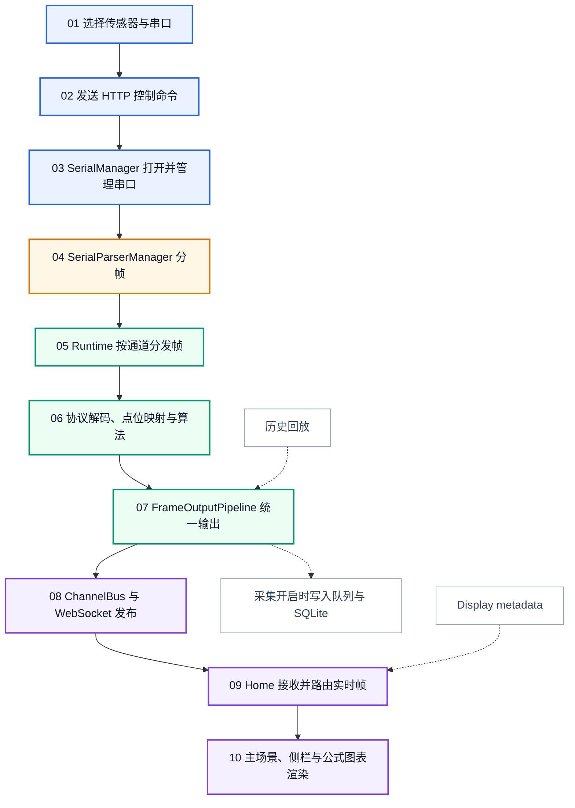
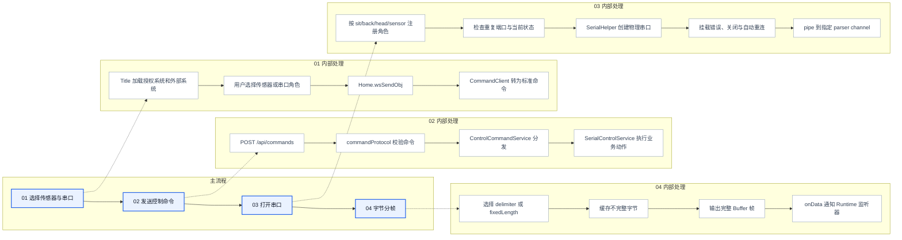
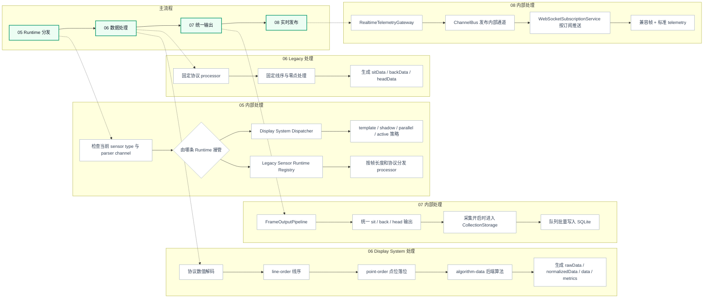
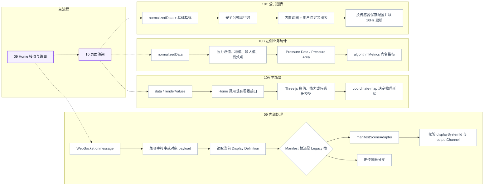
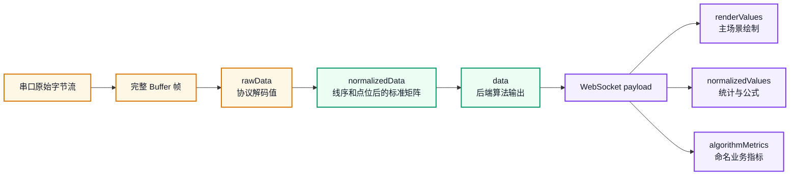
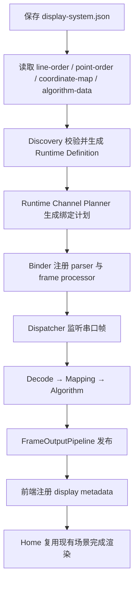
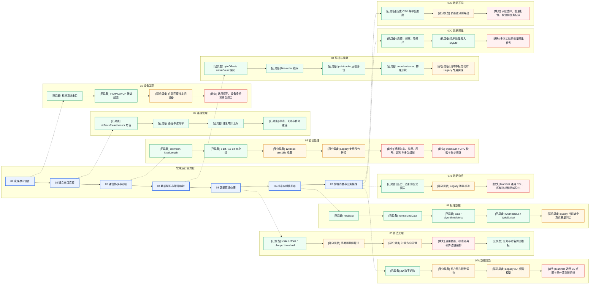

# Shroom 串口到数据渲染业务流程

> [!info] 文档目标
> 本文描述一帧传感器数据如何从“用户选择串口”走到“主界面完成渲染”。图采用纵向编号主流程，并把每一步的内部处理展开到右侧；它是执行顺序图，不是思维导图。

## 阅读方式

- 实线箭头表示实时数据必须经过的主路径。
- 虚线箭头表示某一步内部展开的职责或可选支路。
- 蓝色节点是控制与连接，橙色节点是串口与解析，绿色节点是后端数据处理，紫色节点是前端与渲染。
- Display System 表示由 `display-system.json` 驱动的新配置链路；Legacy 表示仍由固定传感器处理器驱动的兼容链路。
- 更完整的模块边界见 [[ARCHITECTURE]] 和 [[backend/BACKEND_ARCHITECTURE]]。

## 0. 全链路总览

主路径可以压缩为：

`界面选择` → `HTTP Command` → `串口连接` → `字节分帧` → `Runtime 路由` → `解码/映射/算法` → `统一输出` → `WebSocket` → `前端路由` → `场景渲染`

## 1. 串口连接与分帧

下面对应总览中的 `01` 到 `04`。左侧是业务顺序，右侧是每一步实际包含的处理。

<strong>01 选择传感器与串口</strong>

- 输入
  - 密钥授权允许的内置传感器。
  - `/api/display-systems` 返回的本机外部 Display Systems。
  - 当前扫描到的串口列表。
- 核心处理
  - `client/src/components/title/Title.jsx` 合并内置系统和外部系统。
  - 选择传感器时产生 `sensor.switch`，选择端口时产生 `serial.open`。
  - 旧页面仍可传入 `sitPort`、`backPort`、`headPort`、`sensorPort`，但会在前端 Command Client 中转换为标准命令。
- 输出
  - `{ type, payload, requestId }` 格式的控制命令。

<strong>02 发送 HTTP 控制命令</strong>

- 输入
  - 前端标准控制命令。
- 核心处理
  - `client/src/services/command/commandClient.js` 调用 `POST /api/commands`。
  - `backend/contracts/commandProtocol.js` 校验命令类型与参数。
  - `backend/application/controlCommandService.js` 只负责编排命令入口。
  - `backend/application/serialControlService.js` 校验授权、切换当前传感器、初始化相关 runtime，并执行串口打开或关闭。
- 输出
  - HTTP ACK。
  - 更新后的当前传感器状态。
  - 交给 SerialManager 的串口角色、路径、波特率和 parser channel。

<strong>03 SerialManager 打开并管理串口</strong>

- 输入
  - 串口角色，例如 `sit`、`back`、`head`、`sensor`。
  - 串口路径、波特率和 parser channel。
- 核心处理
  - `backend/server/serialRuntimeFactory.js` 创建全局唯一的 `serialManager` 与 `serialParserManager`。
  - `backend/serial/serialManager.js` 维护注册配置和运行实例。
  - 打开前检查同一路径是否已被其他角色占用，避免重复连接。
  - `backend/serial/serialHelper.js` 是物理串口创建和枚举边界。
  - 串口关闭或异常时由 SerialManager 维护状态并按配置重连。
  - 成功打开后，把串口流 `pipe` 到对应 parser channel。
- 输出
  - 持续进入 parser 的原始字节流。
  - 可查询的串口状态、最近错误和重连状态。

<strong>04 SerialParserManager 完成分帧</strong>

- 输入
  - 连续、可能粘包或拆包的串口字节流。
- 核心处理
  - `backend/serial/serialParserManager.js` 集中管理命名 parser channel。
  - 内置通道包括 `sit`、`back`、`head`、`bigBedSit` 和 `smallBed12B`。
  - Display System 可以根据 manifest 动态注册新的通道。
  - `delimiter` 模式按帧尾切分；`fixedLength` 模式按固定字节数切分。
  - parser 只解决“哪里是一帧”，不负责点位、压力算法或页面渲染。
- 输出
  - 一帧完整的 `Buffer`。
  - 通过 `onData(channel, handler)` 交给后续 Runtime。

## 2. 帧处理与实时发布

下面对应总览中的 `05` 到 `08`。这一段把完整二进制帧转换成前端可消费的业务帧。

<strong>05 Runtime 按通道分发帧</strong>

- 输入
  - parser channel。
  - 完整 `Buffer` 帧。
  - 当前传感器类型和 Display System 运行模式。
- Display System 路径
  - `backend/displaySystems/displaySystemRuntimeDispatcher.js` 监听 parser channel。
  - `backend/displaySystems/displaySystemRuntimeBinder.js` 把 manifest、parser、processor 和输出通道绑定成一条运行链。
  - `template` 不运行，`shadow` 只计算不发布，`parallel` 并行发布，`active` 接管生产输出，`disabled` 完全停用。
- Legacy 路径
  - `backend/sensors/runtime/bindSerialSensorRuntimes.js` 把固定 parser channel 注册到 Sensor Runtime Registry。
  - `backend/sensors/runtime/legacySerialFrameRuntime.js` 根据通道、帧长度和协议类型选择具体 processor。
- 输出
  - 交给 Display System 通用处理器或旧传感器专用处理器的完整帧。

<strong>06 协议解码、线序、点位与算法</strong>

- Display System 的固定顺序
  - `display-system.json` 提供协议、运行模式、输出通道和展示 metadata。
  - 协议解码把字节转为 `uint8`、`uint16le` 等数值。
  - `line-order.json` 调整传感器电气线序。
  - `point-order.json` 把顺序值放入目标矩阵单元。
  - `algorithm-data.json` 执行压力换算、阈值、缩放或命名指标计算。
  - `coordinate-map.json` 描述物理坐标，只负责几何布局，不改变数据索引。
  - 核心入口是 `backend/displaySystems/displaySystemFrameProcessorFactory.js`。
- Legacy 的处理方式
  - 使用 `backend/sensors/runtime/` 下的固定 processor。
  - processor 内部完成固定协议判断、线序、清零、压力标定和 payload 构造。
- 输出字段
  - `rawData`：协议解码后的顺序数值。
  - `normalizedData`：经过线序和点位映射的标准矩阵值。
  - `data`：后端算法输出，作为 Display System 的绘图数据。
  - `algorithmMetrics`：算法生成的命名业务指标。
  - `sitData`、`backData` 或 `headData`：兼容现有场景和旧页面的通道字段。

<strong>07 FrameOutputPipeline 统一输出</strong>

- 输入
  - 已处理的业务 payload。
- 核心处理
  - `backend/services/realtime/frameOutputPipelineService.js` 提供 `publishSit`、`publishBack` 和 `publishHead`。
  - 实时展示和历史回放都从这里进入统一输出路径。
  - 采集未开启时直接发布实时帧。
  - 采集开启时，`backend/services/collection/collectionFrameStorageService.js` 同时构建存储载荷并交给写入队列。
  - Display System 采集会保留 `normalizedData`、`algorithmMetrics` 和 `metrics`，保证回放后仍能恢复左侧业务指标。
- 输出
  - 交给 RealtimeTelemetryGateway 的实时 payload。
  - 可选的 SQLite 采集记录。

<strong>08 ChannelBus 与 WebSocket 发布</strong>

- 输入
  - `sit`、`back` 或 `head` 通道及其业务 payload。
- 核心处理
  - `backend/services/realtime/realtimeTelemetryGateway.js` 是实时发布总入口。
  - `backend/channel/channelBus.js` 先在后端内部发布精确通道和通配通道。
  - `backend/services/websocket/websocketSubscriptionService.js` 只向订阅对应通道的客户端发送。
  - 同一帧可同时生成旧页面兼容 payload 和标准 telemetry，SDK 可以按标准 channel 订阅。
  - WebSocket 负责实时推送，不再承担新的串口打开、采集启动等控制命令。
- 输出
  - 发往主前端和 SDK 的 WebSocket 消息。

## 3. 前端接收与渲染

下面对应总览中的 `09` 和 `10`。渲染不是单一动作，而是主场景、业务统计和公式图表三条并行分支。

<strong>09 Home 接收并路由实时帧</strong>

- 输入
  - 主 WebSocket 推送的实时消息。
  - 当前选择的传感器类型。
  - 前端 Display Registry 中的静态或动态定义。
- 核心处理
  - `client/src/page/home/Home.jsx` 的 `onmessage` 进入统一实时消息处理。
  - 消息可以是 JSON 字符串，也可以是已经解析的对象。
  - `client/src/displays/registry.js` 根据传感器类型返回当前 Display Definition。
  - 带 `displaySystemId` 的帧必须匹配当前系统，避免并行系统的数据进入错误场景。
  - Display System 帧进入 `client/src/extensions/display-system/manifestSceneAdapter.js`。
  - 没有 manifest 标识的旧帧继续进入原有传感器分支。
- 输出
  - `renderValues`：交给主场景。
  - `normalizedValues`：交给业务统计和公式图表。
  - `metrics` 与 `algorithmMetrics`：交给左侧指标。

<strong>10A 主场景渲染</strong>

- 输入
  - 后端算法输出的 `data`，在前端适配后称为 `renderValues`。
  - Display metadata 中的矩阵、坐标、renderer、visual algorithm 和 profile。
- 核心处理
  - `Home.handleManifestSceneFrame()` 调用当前已挂载场景的 `sitData()` 或 `changeWsData()`。
  - 新配置系统复用 Home 现有数值/Three.js 场景，不在配置弹窗中创建另一套展示页面。
  - `coordinate-map.json` 的 `[x, y]` 物理坐标转换为场景坐标，使点图保持传感器真实形状和宽高比。
  - renderer 决定数字矩阵、热力图或已有传感器场景。
  - 前端 visual algorithm 只改变绘制值，不反向修改业务统计数据。
- 输出
  - 主界面的传感器点图、热力效果、数字矩阵或三维模型。

<strong>10B 左侧业务统计渲染</strong>

- 输入
  - `normalizedData`。
  - 后端 `metrics` 与 `algorithmMetrics`。
  - manifest 的 `display.sidebar` 配置。
- 核心处理
  - `client/src/components/aside/Aside.jsx` 计算或展示总压力、均值、最大值、有效点和受压面积。
  - `Pressure Data` 与 `Pressure Area` 保留现有 Canvas 趋势入口。
  - `algorithmMetrics` 通过 manifest 的显示名称、单位和小数位展示。
  - 统计始终使用映射后的标准矩阵，不使用 Three.js 插值、平滑、颜色映射后的数组。
- 输出
  - 左侧实时数值、受压面积、算法指标和两张内置趋势图。

<strong>10C 用户公式图表渲染</strong>

- 输入
  - `normalizedData`。
  - `total`、`avg`、`max`、`points`、`area`、`frame` 等基础变量。
  - `algorithm_<id>` 格式的后端算法指标。
- 核心处理
  - `client/src/components/aside/FormulaChartPanel.jsx` 管理图表新建、编辑和删除。
  - `client/src/components/aside/formulaChartRuntime.js` 使用白名单表达式解释器，不执行用户 JavaScript。
  - 两张内置图表和用户自定义图表共用同一套公式运行时。
  - 配置按传感器类型保存在浏览器本地，实时更新限制为 10Hz。
- 输出
  - 可编辑的业务公式趋势图。

## 4. 一帧数据在各阶段的形态

- `Buffer` 只表示一帧边界已经确定，内容还没有业务含义。
- `rawData` 已完成字节精度与大小端解码，但仍保持传感器原始顺序。
- `normalizedData` 是业务基准数据，线序和点位已经稳定，适合统计、采集、回放和公式。
- `data` 是后端算法结果，主要负责主场景绘图。
- `renderValues` 可以再经过前端显示算法，但不会覆盖 `normalizedData`。
- Legacy 传感器为了兼容旧页面，字段可能只有 `sitData`、`backData` 或 `headData`；新 Display System 使用上面的完整分层字段。

## 5. 渲染边界

### 主场景只关心“怎么画”

- 数据源：`data` / `renderValues`。
- 几何来源：`coordinate-map.json`。
- 展示方式：renderer、profile、Three.js 场景或数字矩阵。
- 显示算法：阈值、平滑、颜色和视觉插值可以在这里发生。

### 左侧面板只关心“业务值是什么”

- 数据源：`normalizedData` / `normalizedValues`。
- 基础指标：总值、均值、最大值、有效点和面积。
- 算法指标：`algorithmMetrics`。
- 不读取 Three.js 处理后的数据，避免视觉效果改变业务统计。

### 采集与回放保持同一业务语义

- 采集保存标准矩阵、算法指标和必要 metadata。
- 回放恢复同样的 payload 后重新进入 FrameOutputPipeline。
- 实时和回放共用同一前端路由与渲染入口。

## 6. 新展示系统的完整闭环

这条闭环意味着：新增传感器时，优先增加配置文件和算法数据，不再为每个传感器复制一套串口监听、WebSocket 和展示页面。

## 7. 按现象定位问题

1. 看不到串口：检查串口扫描、Title 端口列表和 SerialManager 状态。
2. 点击打开没有连接：检查 `/api/commands` ACK、授权状态、串口角色与端口占用。
3. 串口有字节但没有实时帧：检查 parser channel、分隔符、固定帧长和数据精度。
4. 有帧但矩阵顺序错误：检查 `line-order.json` 和 `point-order.json`。
5. 点图形状错误：检查 `coordinate-map.json`，不要通过修改点位顺序修正物理形状。
6. 主场景有数据但左侧不更新：检查 `normalizedData`、sidebar 配置和 `Home.handleManifestSidebarData()`。
7. 左侧正确但主场景错误：检查 `data`、renderer、visual algorithm 和场景适配接口。
8. 后端已发布但页面没有数据：检查 ChannelBus 通道、WebSocket 订阅、`displaySystemId` 和 `outputChannel`。
9. 实时正常但回放不一致：检查采集载荷是否保留 `normalizedData`、`algorithmMetrics` 和 `metrics`。

## 8. 核心文件索引

- 控制入口
  - `client/src/components/title/Title.jsx`
  - `client/src/services/command/commandClient.js`
  - `backend/application/controlCommandService.js`
  - `backend/application/serialControlService.js`
- 串口与分帧
  - `backend/serial/serialManager.js`
  - `backend/serial/serialParserManager.js`
  - `backend/serial/serialHelper.js`
- Display System 数据处理
  - `backend/displaySystems/displaySystemRuntimeDispatcher.js`
  - `backend/displaySystems/displaySystemRuntimeBinder.js`
  - `backend/displaySystems/displaySystemFrameProcessorFactory.js`
- Legacy 数据处理
  - `backend/sensors/runtime/bindSerialSensorRuntimes.js`
  - `backend/sensors/runtime/legacySerialFrameRuntime.js`
  - `backend/sensors/runtime/`
- 实时输出
  - `backend/services/realtime/frameOutputPipelineService.js`
  - `backend/services/realtime/realtimeTelemetryGateway.js`
  - `backend/channel/channelBus.js`
  - `backend/services/websocket/websocketSubscriptionService.js`
- 前端路由与渲染
  - `client/src/page/home/Home.jsx`
  - `client/src/displays/registry.js`
  - `client/src/extensions/display-system/manifestSceneAdapter.js`
  - `client/src/components/aside/Aside.jsx`
  - `client/src/components/aside/FormulaChartPanel.jsx`

## 9. 按实际业务能力扩展后的流程

你提供的图覆盖了软件运行的主要业务，但需要把“发现设备、协议可靠性、算法位置、标准数据、分析任务和导出任务”补进主路径。下面的状态以“新建 Display System 是否能够直接复用”为判断标准，而不是只判断仓库里是否存在某段旧代码。

- `[已具备]`：新旧架构已有稳定入口。
- `[部分具备]`：代码存在，但仅覆盖部分协议、部分传感器或 Legacy 场景。
- `[缺失]`：尚未形成可配置、可复用的公共能力。

## 10. 你图中的能力，项目现在到什么程度

### 寻找串口：基础完整，自动识别不足

- 已有
  - `backend/serial/serialHelper.js` 枚举操作系统串口。
  - `backend/serial/serialPortFilterService.js` 根据路径、VID、PID、manufacturer 等信息筛选 WCH/CH34x 候选。
  - `GET /api/serial/ports` 提供给前端和 SDK。
  - SerialManager 能返回连接状态、打开时间、最近错误并自动重连。
- 部分具备
  - 双手套存在按候选端口自动连接的专用逻辑。
- 真正缺少
  - 通用设备握手。
  - USB serial number、固件版本和设备型号识别。
  - manifest 中声明“该设备应该绑定哪个 serial role”的匹配规则。
  - 多个同型号设备同时插入时的稳定身份。

### 通信协议：常规帧完整，复杂协议仍靠写代码

- 已有
  - 波特率配置。
  - 分隔符分帧。
  - 固定长度分帧。
  - `uint8/int8/uint16le/uint16be/int16le/int16be` 解码。
  - 页面中的 12 Bit 选择映射到现有 `uint16le` 两字节承载格式。
- 部分具备
  - `handGloveDouble` 等 Legacy 协议能够拼接 130/146 字节多包。
- 真正缺少
  - 可在 manifest 中配置的通用多包组帧。
  - 独立包头、包尾、payload 长度字段和消息类型字段。
  - 包序号、丢包检测、重复包检测和组帧超时。
  - checksum、CRC 和非法帧丢弃策略。
  - 噪声字节后的自动重新同步。

> [!warning] “按分隔符分帧”不等于“支持分包协议”
> 当前 Display System 的 `delimiter` 是把连续字节切成单帧；真正的分包协议还需要把多帧按设备、消息类型、序号和超时重新组装成一帧业务数据。

### 解析数据：线序和点位已经比较完整

- 已有
  - `byteOffset` 与 `valueCount` 控制有效载荷范围。
  - `line-order.json` 处理电气线序。
  - `point-order.json` 处理矩阵落点。
  - `coordinate-map.json` 处理真实物理形状。
  - 保存阶段会检查矩阵尺寸、重复点位、坐标合法性和数据数量。
- 仍需统一
  - 清零、基线扣除、坏点屏蔽、灵敏度系数和压力标定仍有不少传感器专用逻辑。
  - 这些能力应该变成标准处理步骤，而不是继续放在某个 Legacy processor 中。

### 数据处理：算法很多，但没有统一算法流水线

- 已有
  - Display System JSON 算法支持 `scale`、`offset`、`clamp`、`zeroBelow` 和常用聚合指标。
  - 手工 manifest 可以加载受限 JavaScript 算法。
  - `backend/processing/smoothingAlgorithms.js` 已迁出高斯平滑入口。
  - 多个旧前端场景有高斯、插值、阈值和指数平滑代码。
  - 通用前端可视算法支持 `normalize`、`threshold` 和邻域平均 `smooth`。
- 关键区别
  - 当前通用 `smooth` 是同一帧内的空间邻域平均，不是跨时间帧的低通滤波。
  - Legacy 中的指数平滑属于时间滤波，但没有成为 Display System 的标准能力。
  - 高斯算法存在，不代表配置页面已经可以把它插入新传感器的统一处理链。
- 真正缺少
  - 明确的处理顺序：`清零 → 标定 → 坏点 → 空间滤波 → 时间滤波 → 业务算法 → 指标`。
  - 按 `displaySystemId + channel` 隔离的有状态算法实例。
  - 标准 Gaussian、EMA、低通、中值滤波和去抖算子。
  - 算法输入输出尺寸校验、耗时统计和异常降级。

### 数据渲染：旧场景丰富，新配置系统还没有完全继承

- 已有
  - 新 Display System 保存后能进入 Home 现有 `Fast1024` 数字场景。
  - `coordinate-map.json` 能控制点位物理形状和宽高比。
  - 旧传感器拥有数字矩阵、热力图、3D 点图、模型贴图等多种场景。
  - 压力、面积、算法指标以及用户公式图表已经接通。
- 部分具备
  - Display metadata 声明了 `heatmap/matrix/raw2d` renderer 和 profile。
  - 但是 Home 当前对 manifest 系统固定复用 `Fast1024`，metadata 中选择的 renderer 尚未真正决定主界面挂载哪个渲染器。
  - Title 的颜色、滤波、高度等调节仍按旧传感器名称分组；动态系统 ID 默认不会自动获得这些控制项。
- 真正缺少
  - 统一 Renderer Registry。
  - 可配置的通用 2D 数字、2D 热力和 3D 高度点图。
  - renderer 自己声明需要的控制项，例如颜色范围、阈值、点大小、高度和相机。
  - 同一份 `coordinate-map` 在所有 renderer 中使用一致的点位索引。

### 数据分析与框选：Legacy 有，Manifest 没有统一入口

- 已有
  - `SelectionHelper.js`、`SelectionBox.js` 和 `BrushManager.js` 被多个旧 Three.js 场景使用。
  - 部分手套场景已经能把屏幕框转换为传感器点索引。
- 问题
  - 框选代码分散在多个场景中，行为不完全一致。
  - Display System 默认使用的 `Fast1024` 目前只有平移和缩放，没有通用框选。
- 真正缺少
  - `RegionSelectionService`：把屏幕矩形转换成稳定的点位 ID 集合。
  - ROI 数据模型：名称、颜色、点位、创建时间和所属 display system。
  - 选区压力、面积、最大值、均值、占比和公式指标。
  - 选区保存、比较、采集和导出。

### 数据采集：“批量写数据库”已有，“批量做实验”没有

- 已有
  - 开始/停止采集。
  - 自定义采集频率或跟随串口频率。
  - 矩阵降采样。
  - 磁盘空间保护。
  - `collectionInsertQueueService` 会把多帧合并成事务批量写入 SQLite。
- 需要区分
  - 当前“批量”是数据库写入优化，不是用户层面的批量采集。
- 真正缺少
  - 一组样本名称、重复次数、单次时长、间隔时间组成的采集计划。
  - 采集任务 ID、当前进度、失败重试、暂停和取消。
  - 被试、产品、姿态、工况、备注等实验 metadata。
  - 多通道或多传感器同时开始、同时结束的 session。

### 数据下载：CSV 可用，但还不是完整导出中心

- 已有
  - 按历史日期导出 CSV。
  - 汽车/三通道类型可分别导出 sit、back、head 文件。
  - 支持导出目录、进度通知和失败结果。
  - 前端、HTTP 和 SDK 都有 `export.csv` 控制入口。
- 真正缺少
  - 选择导出 `rawData`、`normalizedData`、`data`、基础指标或算法指标。
  - 多日期、多采集 session 批量导出。
  - ZIP 打包以及配置、坐标、算法版本随数据一起导出。
  - 导出任务列表、取消、重试和结果保留。
  - ROI 选区数据单独导出。

## 11. 这张图本身还漏掉的系统能力

### 数据正确性

- 帧时间戳应该在后端收到完整帧时统一生成，必要时保留设备时间。
- 应增加 frame sequence，判断丢帧、乱序和重复帧。
- telemetry 的 `quality` 目前通常直接标记为 `good`，还没有根据 CRC、长度、延迟和传感器状态真实计算。
- 需要记录配置版本、算法版本和标定版本，确保历史数据可以复现。

### 运行可靠性

- parser 应统计收到字节数、完整帧数、非法帧数、组帧超时和 CRC 失败数。
- Frame Pipeline 应统计输入 FPS、输出 FPS、处理耗时和队列积压。
- WebSocket 应统计订阅数量、发送失败和慢客户端。
- 应把这些状态汇总到统一的 runtime diagnostics API，而不是只能查看日志。

### 安全边界

- 用户算法需要明确 CPU 超时、内存上限、输入尺寸和失败回退。
- 自定义导出路径必须继续限制到允许目录。
- Display System 配置需要 schema 版本迁移和失败回滚。
- 新配置启用前应先经过 `shadow` 对比，再切换到 `active`。

### 多传感器一致性

- 如果后续同时连接多个传感器，需要 session 级统一时钟。
- 每帧应该携带 `deviceId`、`displaySystemId`、`channelId`、`sequence` 和 `timestamp`。
- 多路采集需要定义允许的时间偏差以及缺帧补齐策略。
- 前端“切换展示”只改变可见场景，不能停止后台传感器算法和采集任务。

## 12. 建议的改造优先级

### P0：先补通用实时链路

1. 新增通用 `PacketAssembler`，支持包头、长度、序号、多包、超时和 checksum/CRC。
2. 新增 `ProcessingPipeline`，按配置执行清零、标定、坏点、Gaussian、时间低通、业务算法和指标。
3. 新增真正驱动 Home 的 `RendererRegistry`，先完成通用 2D 数字、2D 热力和 3D 点图。
4. 为 parser、processor、pipeline 和 WebSocket 增加统一 diagnostics 与真实 `quality`。

### P1：补齐用户业务操作

1. 将 BrushManager 收敛为 Display System 通用 ROI 服务。
2. 新增采集任务模型，把“批量实验”与“数据库批量写入”分开。
3. 新增导出任务模型，支持字段选择、多 session 和 ZIP 结果包。
4. 把设备握手和稳定身份匹配加入 manifest。

### P2：提高产品化程度

1. 增加多传感器 session 同步和后台持续算法运行。
2. 增加配置版本、算法版本、标定版本和历史复现。
3. 增加真实串口硬件回归测试、长时间稳定性测试和故障注入测试。

> [!summary] 当前判断
> 项目已经有“串口 → 解析 → 映射 → 算法 → 实时发布 → 页面渲染 → 采集/回放/CSV”的完整主链，缺的不是再拆文件。最主要的架构债是把 Legacy 中已有的分包、高斯、低通、3D、框选等能力收敛成 Display System 可以按配置直接组合的公共运行时。
